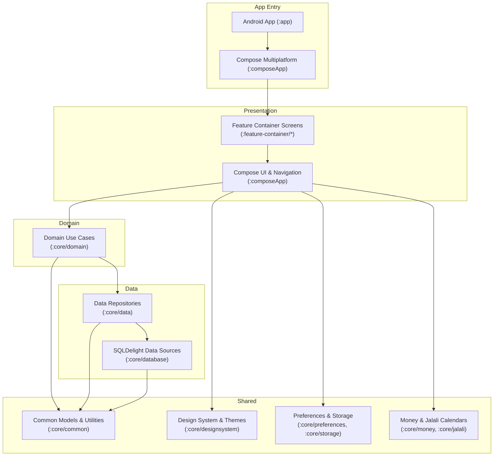
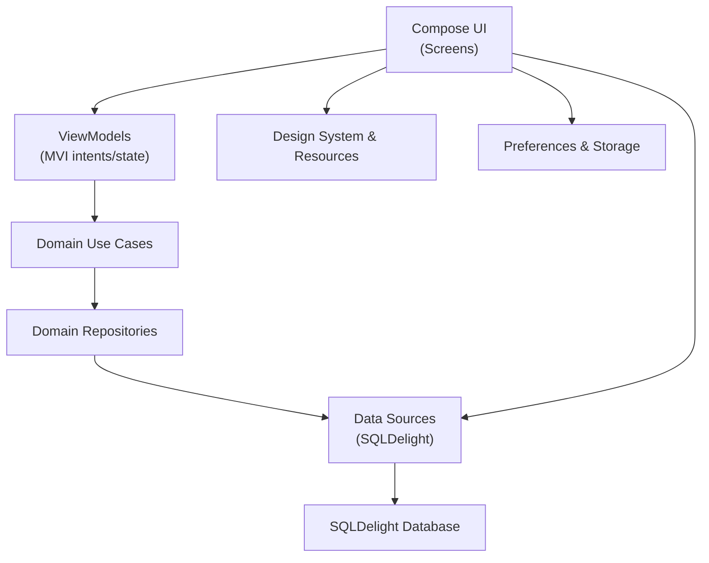
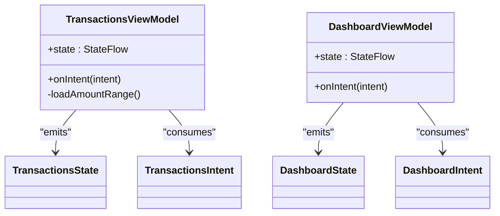
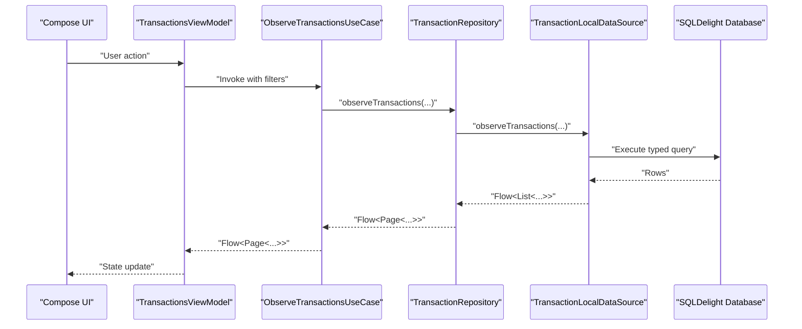
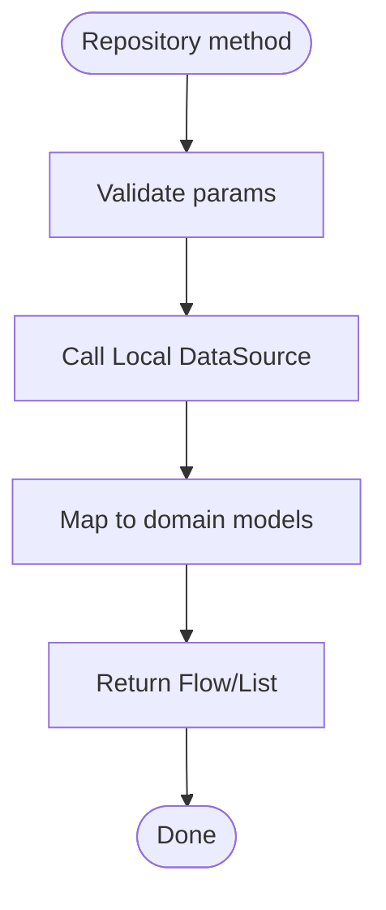
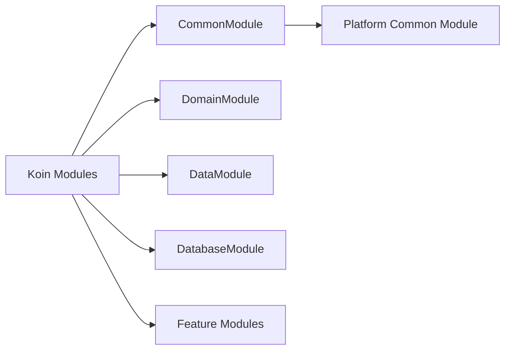
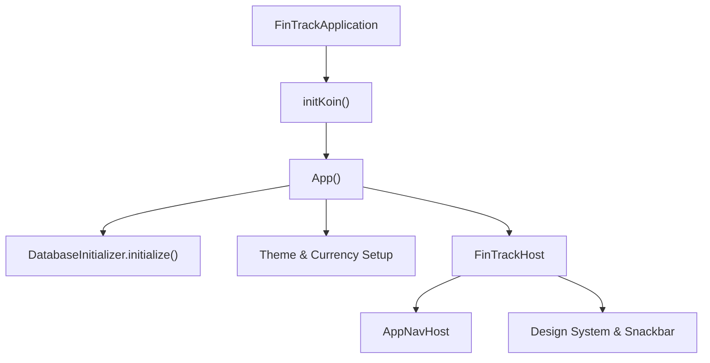

# Architecture Overview

<cite>
**Referenced Files in This Document**
- [FinTrackApplication.kt](file://app/src/main/java/com/kazemieh/fintrack/FinTrackApplication.kt)
- [MainActivity.kt](file://app/src/main/java/com/kazemieh/fintrack/MainActivity.kt)
- [App.kt](file://composeApp/src/commonMain/kotlin/com/kazemieh/composeApp/App.kt)
- [FinTrackHost.kt](file://composeApp/src/commonMain/kotlin/com/kazemieh/composeApp/FinTrackHost.kt)
- [DomainModule.kt](file://core/domain/src/commonMain/kotlin/com/kazemieh/domain/di/DomainModule.kt)
- [DashboardViewModel.kt](file://feature-container/dashboard/src/commonMain/kotlin/com/kazemieh/dashboard/DashboardViewModel.kt)
- [TransactionsViewModel.kt](file://feature-container/transactions/src/commonMain/kotlin/com/kazemieh/transactions/TransactionsViewModel.kt)
- [TransactionRepositoryImpl.kt](file://core/data/src/commonMain/kotlin/com/kazemieh/data/repository/TransactionRepositoryImpl.kt)
- [ObserveTransactionsUseCase.kt](file://core/domain/src/commonMain/kotlin/com/kazemieh/domain/usecase/ObserveTransactionsUseCase.kt)
- [TransactionLocalDataSourceImpl.kt](file://core/database/src/commonMain/kotlin/com/kazemieh/database/datasource/TransactionLocalDataSourceImpl.kt)
- [CommonModule.kt](file://core/common/src/commonMain/kotlin/com/kazemieh/common/di/CommonModule.kt)
- [DataModule.kt](file://core/data/src/commonMain/kotlin/com/kazemieh/data/di/DataModule.kt)
- [DatabaseModule.kt](file://core/database/src/commonMain/kotlin/com/kazemieh/database/di/DatabaseModule.kt)
- [libs.versions.toml](file://gradle/libs.versions.toml)
- [settings.gradle.kts](file://settings.gradle.kts)
</cite>

## Table of Contents
1. [Introduction](#introduction)
2. [Project Structure](#project-structure)
3. [Core Components](#core-components)
4. [Architecture Overview](#architecture-overview)
5. [Detailed Component Analysis](#detailed-component-analysis)
6. [Dependency Analysis](#dependency-analysis)
7. [Performance Considerations](#performance-considerations)
8. [Troubleshooting Guide](#troubleshooting-guide)
9. [Conclusion](#conclusion)
10. [Appendices](#appendices)

## Introduction
This document presents the architecture overview of FinTrack, a Kotlin Multiplatform (KMP) personal finance application built with Clean Architecture principles. The system emphasizes separation of concerns across presentation, domain, and data layers, with reactive streams powered by Kotlin Coroutines and Kotlin Flow. Dependency Injection is handled via Koin, while SQLDelight provides type-safe database access across platforms. The UI is composed with Jetpack Compose and Compose Multiplatform, enabling shared UI logic and native performance on Android, iOS, JVM (desktop/web), and Web.

## Project Structure
FinTrack is organized into modular Gradle projects grouped under core and feature modules:
- Presentation layer: composeApp hosts the Compose entry point and navigation; feature-container modules encapsulate screens and ViewModels.
- Domain layer: core/domain defines use cases and repository abstractions.
- Data layer: core/data implements repositories backed by core/database’s SQLDelight data sources.
- Shared modules: core/common, core/designsystem, core/preferences, core/storage, core/money, core/jalali provide cross-cutting utilities and models.
- Feature modules: feature-share modules encapsulate reusable UI and business logic for categories, sources, tags, persons, notifications, lock, and budgets.

**Diagram sources**
- [settings.gradle.kts:41-69](file://settings.gradle.kts#L41-L69)
- [App.kt:94-133](file://composeApp/src/commonMain/kotlin/com/kazemieh/composeApp/App.kt#L94-L133)

**Section sources**
- [settings.gradle.kts:41-69](file://settings.gradle.kts#L41-L69)
- [App.kt:94-133](file://composeApp/src/commonMain/kotlin/com/kazemieh/composeApp/App.kt#L94-L133)

## Core Components
- Application bootstrap and DI initialization:
  - Android Application initializes Koin and notification channels.
  - Compose App initializes Koin with a consolidated module list and starts database initialization.
- ViewModels implementing MVVM with MVI-like intents and state:
  - DashboardViewModel and TransactionsViewModel manage UI state transitions via sealed intent interfaces and immutable state objects.
- Domain use cases:
  - ObserveTransactionsUseCase exposes reactive streams to the presentation layer.
- Data repositories and SQLDelight data sources:
  - TransactionRepositoryImpl mediates between use cases and the local data source.
  - TransactionLocalDataSourceImpl executes typed SQLDelight queries and maps results to common models.

Key implementation references:
- Application bootstrap and DI: [FinTrackApplication.kt:14-22](file://app/src/main/java/com/kazemieh/fintrack/FinTrackApplication.kt#L14-L22), [App.kt:94-133](file://composeApp/src/commonMain/kotlin/com/kazemieh/composeApp/App.kt#L94-L133)
- MVVM/MVI ViewModels: [DashboardViewModel.kt:13-83](file://feature-container/dashboard/src/commonMain/kotlin/com/kazemieh/dashboard/DashboardViewModel.kt#L13-L83), [TransactionsViewModel.kt:51-526](file://feature-container/transactions/src/commonMain/kotlin/com/kazemieh/transactions/TransactionsViewModel.kt#L51-L526)
- Domain use cases: [ObserveTransactionsUseCase.kt:10-19](file://core/domain/src/commonMain/kotlin/com/kazemieh/domain/usecase/ObserveTransactionsUseCase.kt#L10-L19)
- Repositories and data sources: [TransactionRepositoryImpl.kt:22-235](file://core/data/src/commonMain/kotlin/com/kazemieh/data/repository/TransactionRepositoryImpl.kt#L22-L235), [TransactionLocalDataSourceImpl.kt:33-576](file://core/database/src/commonMain/kotlin/com/kazemieh/database/datasource/TransactionLocalDataSourceImpl.kt#L33-L576)

**Section sources**
- [FinTrackApplication.kt:14-22](file://app/src/main/java/com/kazemieh/fintrack/FinTrackApplication.kt#L14-L22)
- [App.kt:94-133](file://composeApp/src/commonMain/kotlin/com/kazemieh/composeApp/App.kt#L94-L133)
- [DashboardViewModel.kt:13-83](file://feature-container/dashboard/src/commonMain/kotlin/com/kazemieh/dashboard/DashboardViewModel.kt#L13-L83)
- [TransactionsViewModel.kt:51-526](file://feature-container/transactions/src/commonMain/kotlin/com/kazemieh/transactions/TransactionsViewModel.kt#L51-L526)
- [ObserveTransactionsUseCase.kt:10-19](file://core/domain/src/commonMain/kotlin/com/kazemieh/domain/usecase/ObserveTransactionsUseCase.kt#L10-L19)
- [TransactionRepositoryImpl.kt:22-235](file://core/data/src/commonMain/kotlin/com/kazemieh/data/repository/TransactionRepositoryImpl.kt#L22-L235)
- [TransactionLocalDataSourceImpl.kt:33-576](file://core/database/src/commonMain/kotlin/com/kazemieh/database/datasource/TransactionLocalDataSourceImpl.kt#L33-L576)

## Architecture Overview
FinTrack follows Clean Architecture with distinct layers:
- Presentation: Compose UI with ViewModels emitting state flows; navigation orchestrated by AppNavHost.
- Domain: Use cases define the app’s features and operate on reactive streams.
- Data: Repositories abstract data access; SQLDelight provides type-safe queries and migrations.

**Diagram sources**
- [App.kt:55-92](file://composeApp/src/commonMain/kotlin/com/kazemieh/composeApp/App.kt#L55-L92)
- [FinTrackHost.kt:28-84](file://composeApp/src/commonMain/kotlin/com/kazemieh/composeApp/FinTrackHost.kt#L28-L84)
- [DomainModule.kt:63-164](file://core/domain/src/commonMain/kotlin/com/kazemieh/domain/di/DomainModule.kt#L63-L164)
- [DataModule.kt:11-15](file://core/data/src/commonMain/kotlin/com/kazemieh/data/di/DataModule.kt#L11-L15)
- [DatabaseModule.kt:13-31](file://core/database/src/commonMain/kotlin/com/kazemieh/database/di/DatabaseModule.kt#L13-L31)

## Detailed Component Analysis

### Presentation Layer: MVVM with MVI
- ViewModels encapsulate UI state and transform user intents into state updates.
- TransactionsViewModel orchestrates filtering, date ranges, and entity selections; DashboardViewModel manages quick actions and bottom sheets.
- UI reacts to state flows and displays snackbar events via a centralized controller.

**Diagram sources**
- [TransactionsViewModel.kt:51-526](file://feature-container/transactions/src/commonMain/kotlin/com/kazemieh/transactions/TransactionsViewModel.kt#L51-L526)
- [DashboardViewModel.kt:13-83](file://feature-container/dashboard/src/commonMain/kotlin/com/kazemieh/dashboard/DashboardViewModel.kt#L13-L83)

**Section sources**
- [TransactionsViewModel.kt:51-526](file://feature-container/transactions/src/commonMain/kotlin/com/kazemieh/transactions/TransactionsViewModel.kt#L51-L526)
- [DashboardViewModel.kt:13-83](file://feature-container/dashboard/src/commonMain/kotlin/com/kazemieh/dashboard/DashboardViewModel.kt#L13-L83)

### Domain Layer: Use Cases and Repositories
- Use cases expose reactive APIs to the presentation layer.
- Repositories abstract data access and coordinate with data sources.

**Diagram sources**
- [TransactionsViewModel.kt:51-526](file://feature-container/transactions/src/commonMain/kotlin/com/kazemieh/transactions/TransactionsViewModel.kt#L51-L526)
- [ObserveTransactionsUseCase.kt:10-19](file://core/domain/src/commonMain/kotlin/com/kazemieh/domain/usecase/ObserveTransactionsUseCase.kt#L10-L19)
- [TransactionRepositoryImpl.kt:55-60](file://core/data/src/commonMain/kotlin/com/kazemieh/data/repository/TransactionRepositoryImpl.kt#L55-L60)
- [TransactionLocalDataSourceImpl.kt:46-81](file://core/database/src/commonMain/kotlin/com/kazemieh/database/datasource/TransactionLocalDataSourceImpl.kt#L46-L81)

**Section sources**
- [ObserveTransactionsUseCase.kt:10-19](file://core/domain/src/commonMain/kotlin/com/kazemieh/domain/usecase/ObserveTransactionsUseCase.kt#L10-L19)
- [TransactionRepositoryImpl.kt:55-60](file://core/data/src/commonMain/kotlin/com/kazemieh/data/repository/TransactionRepositoryImpl.kt#L55-L60)
- [TransactionLocalDataSourceImpl.kt:46-81](file://core/database/src/commonMain/kotlin/com/kazemieh/database/datasource/TransactionLocalDataSourceImpl.kt#L46-L81)

### Data Layer: Repositories and SQLDelight
- TransactionRepositoryImpl delegates to TransactionLocalDataSource and persists recent searches via PreferenceRepository.
- TransactionLocalDataSourceImpl maps SQLDelight queries to common models and exposes typed reactive streams.

**Diagram sources**
- [TransactionRepositoryImpl.kt:22-235](file://core/data/src/commonMain/kotlin/com/kazemieh/data/repository/TransactionRepositoryImpl.kt#L22-L235)
- [TransactionLocalDataSourceImpl.kt:33-576](file://core/database/src/commonMain/kotlin/com/kazemieh/database/datasource/TransactionLocalDataSourceImpl.kt#L33-L576)

**Section sources**
- [TransactionRepositoryImpl.kt:22-235](file://core/data/src/commonMain/kotlin/com/kazemieh/data/repository/TransactionRepositoryImpl.kt#L22-L235)
- [TransactionLocalDataSourceImpl.kt:33-576](file://core/database/src/commonMain/kotlin/com/kazemieh/database/datasource/TransactionLocalDataSourceImpl.kt#L33-L576)

### Dependency Injection with Koin
- Koin modules are consolidated in App.kt and started early in the app lifecycle.
- Modules include common, data, domain, database, and feature-specific modules.

**Diagram sources**
- [App.kt:94-133](file://composeApp/src/commonMain/kotlin/com/kazemieh/composeApp/App.kt#L94-L133)
- [CommonModule.kt:6-11](file://core/common/src/commonMain/kotlin/com/kazemieh/common/di/CommonModule.kt#L6-L11)
- [DomainModule.kt:63-164](file://core/domain/src/commonMain/kotlin/com/kazemieh/domain/di/DomainModule.kt#L63-L164)
- [DataModule.kt:11-15](file://core/data/src/commonMain/kotlin/com/kazemieh/data/di/DataModule.kt#L11-L15)
- [DatabaseModule.kt:13-31](file://core/database/src/commonMain/kotlin/com/kazemieh/database/di/DatabaseModule.kt#L13-L31)

**Section sources**
- [App.kt:94-133](file://composeApp/src/commonMain/kotlin/com/kazemieh/composeApp/App.kt#L94-L133)
- [CommonModule.kt:6-11](file://core/common/src/commonMain/kotlin/com/kazemieh/common/di/CommonModule.kt#L6-L11)
- [DomainModule.kt:63-164](file://core/domain/src/commonMain/kotlin/com/kazemieh/domain/di/DomainModule.kt#L63-L164)
- [DataModule.kt:11-15](file://core/data/src/commonMain/kotlin/com/kazemieh/data/di/DataModule.kt#L11-L15)
- [DatabaseModule.kt:13-31](file://core/database/src/commonMain/kotlin/com/kazemieh/database/di/DatabaseModule.kt#L13-L31)

## Dependency Analysis
- Module inclusion and startup order:
  - Android Application initializes Koin and notification channels.
  - Compose App initializes database and theme preferences, then launches the main navigation host.
- Reactive streams:
  - SQLDelight queries are mapped to Kotlin Flow and exposed through use cases and repositories.
- Cross-cutting modules:
  - Design system, preferences, and storage are injected and consumed across features.

**Diagram sources**
- [FinTrackApplication.kt:14-22](file://app/src/main/java/com/kazemieh/fintrack/FinTrackApplication.kt#L14-L22)
- [App.kt:55-92](file://composeApp/src/commonMain/kotlin/com/kazemieh/composeApp/App.kt#L55-L92)
- [FinTrackHost.kt:28-84](file://composeApp/src/commonMain/kotlin/com/kazemieh/composeApp/FinTrackHost.kt#L28-L84)

**Section sources**
- [FinTrackApplication.kt:14-22](file://app/src/main/java/com/kazemieh/fintrack/FinTrackApplication.kt#L14-L22)
- [App.kt:55-92](file://composeApp/src/commonMain/kotlin/com/kazemieh/composeApp/App.kt#L55-L92)
- [FinTrackHost.kt:28-84](file://composeApp/src/commonMain/kotlin/com/kazemieh/composeApp/FinTrackHost.kt#L28-L84)

## Performance Considerations
- Reactive data flows:
  - SQLDelight queries are executed on Dispatchers.Default and mapped to Flow to keep UI responsive.
- Pagination and filtering:
  - Use Page and PageRequest to limit dataset sizes and reduce memory pressure.
- State updates:
  - Immutable state objects and copy-based updates minimize unnecessary recompositions.
- Platform-specific drivers:
  - SQLDelight drivers are configured per platform to optimize IO and migrations.

[No sources needed since this section provides general guidance]

## Troubleshooting Guide
- Database initialization failures:
  - Verify DatabaseInitializer is invoked during app startup and that SQLDelight schemas are up-to-date.
- Flow emissions not updating UI:
  - Ensure use cases return Flow and ViewModels collect state properly; check dispatchers and mapping steps.
- Dependency resolution errors:
  - Confirm module inclusion in settings.gradle.kts and consistent versions in libs.versions.toml.

**Section sources**
- [App.kt:72-75](file://composeApp/src/commonMain/kotlin/com/kazemieh/composeApp/App.kt#L72-L75)
- [libs.versions.toml:1-261](file://gradle/libs.versions.toml#L1-L261)
- [settings.gradle.kts:41-69](file://settings.gradle.kts#L41-L69)

## Conclusion
FinTrack’s architecture cleanly separates presentation, domain, and data concerns, leveraging Kotlin Multiplatform, Compose, Koin, SQLDelight, and reactive streams. The MVVM/MVI pattern in ViewModels, combined with domain-driven use cases and repository abstractions, yields a maintainable, testable, and scalable system suitable for Android, iOS, JVM, and Web.

[No sources needed since this section summarizes without analyzing specific files]

## Appendices

### Technology Stack and Version Compatibility
- Kotlin Multiplatform and Compose Multiplatform for shared UI and logic.
- SQLDelight for type-safe database access across platforms.
- Koin for dependency injection.
- Coroutines and Flow for reactive programming.
- Jetpack Compose for modern UI.
- Material3 for theming and components.
- Version catalog centralizes dependency versions.

**Section sources**
- [libs.versions.toml:1-261](file://gradle/libs.versions.toml#L1-L261)

### Infrastructure and Deployment Topology
- Android app module hosts the Android entry point and initializes platform-specific services.
- Compose Multiplatform module provides the shared UI and navigation host.
- SQLDelight generates platform-specific drivers and schemas; migrations are managed via schema versions.
- No external cloud dependencies are evident in the referenced modules.

**Section sources**
- [FinTrackApplication.kt:14-22](file://app/src/main/java/com/kazemieh/fintrack/FinTrackApplication.kt#L14-L22)
- [DatabaseModule.kt:13-31](file://core/database/src/commonMain/kotlin/com/kazemieh/database/di/DatabaseModule.kt#L13-L31)