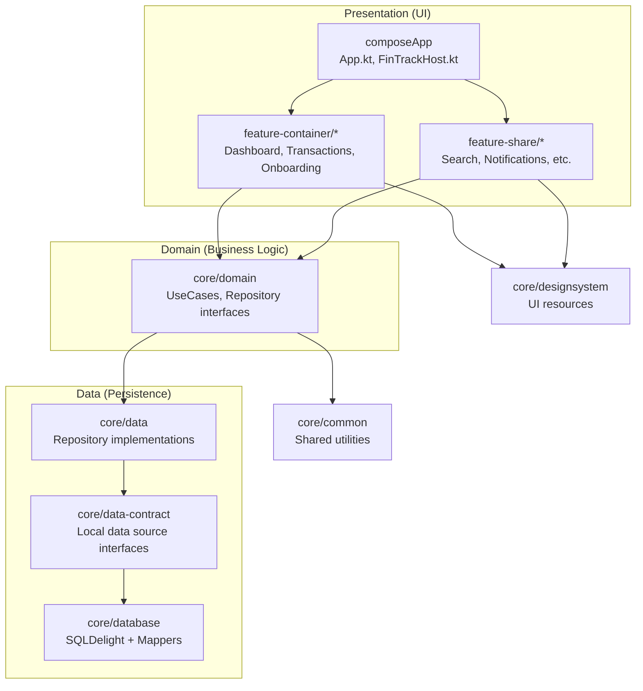
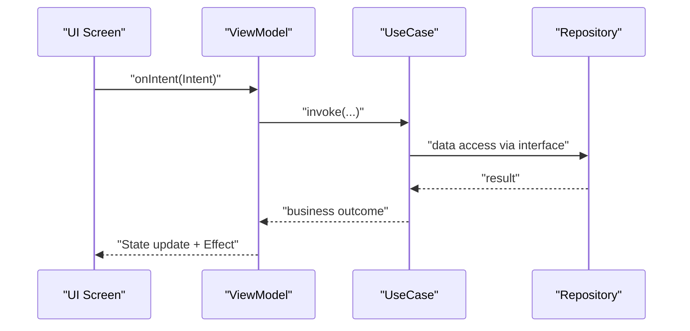
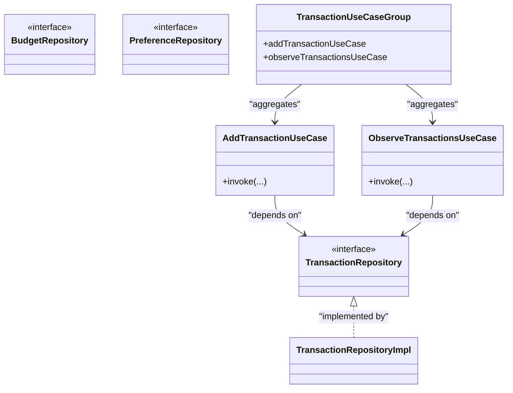
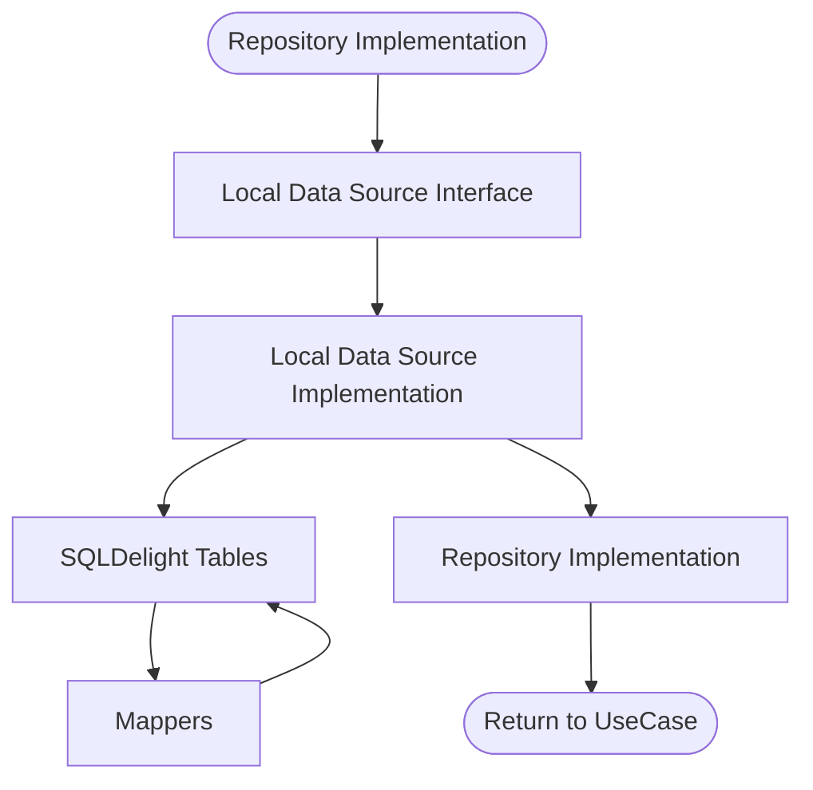
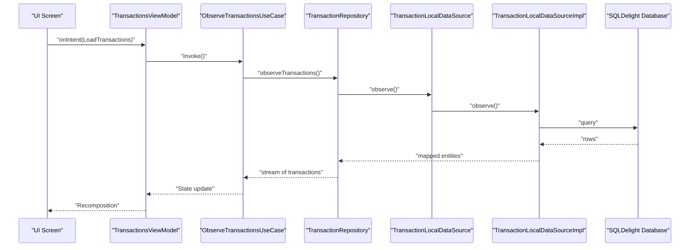
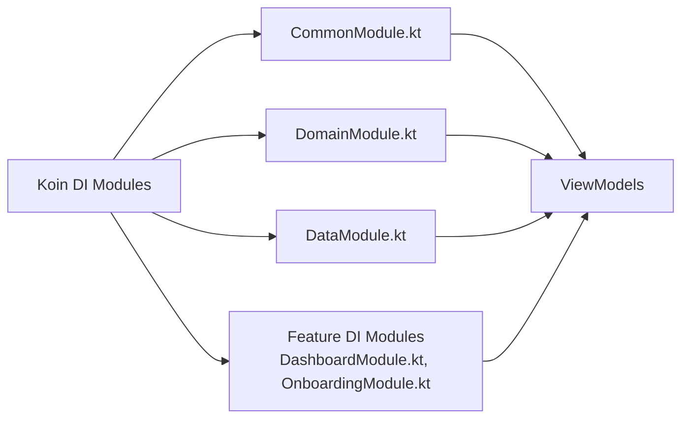
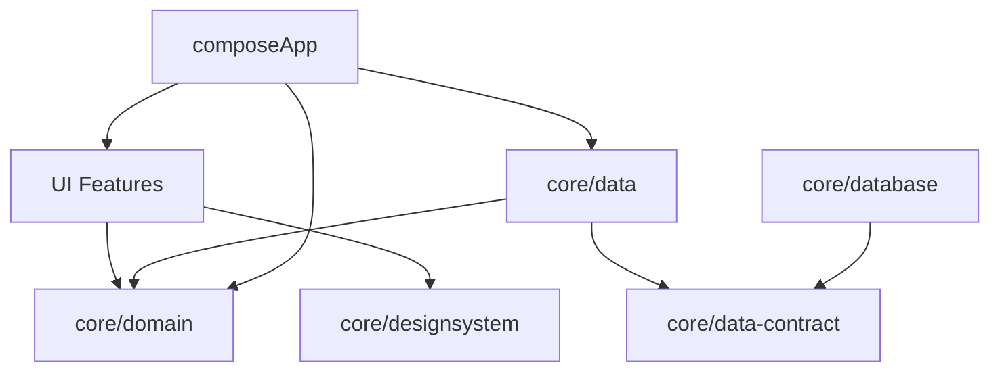

# Clean Architecture Principles

<cite>
**Referenced Files in This Document**
- [FinTrackApplication.kt](file://app/src/main/java/com/kazemieh/fintrack/FinTrackApplication.kt)
- [MainActivity.kt](file://app/src/main/java/com/kazemieh/fintrack/MainActivity.kt)
- [App.kt](file://composeApp/src/commonMain/kotlin/com/kazemieh/composeApp/App.kt)
- [FinTrackHost.kt](file://composeApp/src/commonMain/kotlin/com/kazemieh/composeApp/FinTrackHost.kt)
- [AppNavigation.kt](file://composeApp/src/commonMain/kotlin/com/kazemieh/composeApp/navigation/AppNavigation.kt)
- [Destinations.kt](file://composeApp/src/commonMain/kotlin/com/kazemieh/composeApp/navigation/Destinations.kt)
- [Screen.kt](file://composeApp/src/commonMain/kotlin/com/kazemieh/composeApp/navigation/Screen.kt)
- [BottombarNavigation.kt](file://composeApp/src/commonMain/kotlin/com/kazemieh/composeApp/navigation/navigationBar/BottombarNavigation.kt)
- [FintrackNavigationBar.kt](file://composeApp/src/commonMain/kotlin/com/kazemieh/composeApp/navigation/navigationBar/FintrackNavigationBar.kt)
- [CommonModule.kt](file://core/common/src/commonMain/kotlin/com/kazemieh/common/di/CommonModule.kt)
- [DomainModule.kt](file://core/domain/src/commonMain/kotlin/com/kazemieh/domain/di/DomainModule.kt)
- [DataModule.kt](file://core/data/src/commonMain/kotlin/com/kazemieh/data/di/DataModule.kt)
- [DashboardModule.kt](file://feature-container/dashboard/src/commonMain/kotlin/com/kazemieh/dashboard/di/DashboardModule.kt)
- [OnboardingModule.kt](file://feature-container/onboarding/src/commonMain/kotlin/com/kazemieh/onboarding/di/OnboardingModule.kt)
- [DashboardViewModel.kt](file://feature-container/dashboard/src/commonMain/kotlin/com/kazemieh/dashboard/DashboardViewModel.kt)
- [OnboardingViewModel.kt](file://feature-container/onboarding/src/commonMain/kotlin/com/kazemieh/onboarding/ui/OnboardingViewModel.kt)
- [TransactionsViewModel.kt](file://feature-container/transactions/src/commonMain/kotlin/com/kazemieh/transactions/TransactionsViewModel.kt)
- [SearchViewModel.kt](file://feature-share/search/src/commonMain/kotlin/com/kazemieh/search/ui/SearchViewModel.kt)
- [BudgetRepository.kt](file://core/domain/src/commonMain/kotlin/com/kazemieh/domain/repository/BudgetRepository.kt)
- [PreferenceRepository.kt](file://core/domain/src/commonMain/kotlin/com/kazemieh/domain/repository/PreferenceRepository.kt)
- [TransactionRepository.kt](file://core/domain/src/commonMain/kotlin/com/kazemieh/domain/repository/TransactionRepository.kt)
- [PreferenceRepositoryImpl.kt](file://core/data/src/commonMain/kotlin/com/kazemieh/data/repository/PreferenceRepositoryImpl.kt)
- [TransactionRepositoryImpl.kt](file://core/data/src/commonMain/kotlin/com/kazemieh/data/repository/TransactionRepositoryImpl.kt)
- [BudgetLocalDataSource.kt](file://core/data-contract/src/commonMain/kotlin/com/kazemieh/data_contract/datasource/BudgetLocalDataSource.kt)
- [TransactionLocalDataSource.kt](file://core/data-contract/src/commonMain/kotlin/com/kazemieh/data_contract/datasource/TransactionLocalDataSource.kt)
- [TransactionLocalDataSourceImpl.kt](file://core/database/src/commonMain/kotlin/com/kazemieh/database/datasource/TransactionLocalDataSourceImpl.kt)
- [Mappers.kt](file://core/database/src/commonMain/kotlin/com/kazemieh/database/mapper/Mappers.kt)
- [DatabaseModule.kt](file://core/database/src/commonMain/kotlin/com/kazemieh/database/di/DatabaseModule.kt)
- [DriverFactory.kt](file://core/database/src/commonMain/kotlin/com/kazemieh/database/DriverFactory.kt)
- [AddTransactionUseCase.kt](file://core/domain/src/commonMain/kotlin/com/kazemieh/domain/usecase/AddTransactionUseCase.kt)
- [ObserveTransactionsUseCase.kt](file://core/domain/src/commonMain/kotlin/com/kazemieh/domain/usecase/ObserveTransactionsUseCase.kt)
- [TransactionUseCaseGroup.kt](file://core/domain/src/commonMain/kotlin/com/kazemieh/domain/usecase/TransactionUseCaseGroup.kt)
- [architecture_analysis.md](file://agent/architecture_analysis.md)
- [fintrack_master_guide.md](file://agent/fintrack_master_guide.md)
- [AGENTS.md](file://AGENTS.md)
</cite>

## Table of Contents
1. [Introduction](#introduction)
2. [Project Structure](#project-structure)
3. [Core Components](#core-components)
4. [Architecture Overview](#architecture-overview)
5. [Detailed Component Analysis](#detailed-component-analysis)
6. [Dependency Analysis](#dependency-analysis)
7. [Performance Considerations](#performance-considerations)
8. [Troubleshooting Guide](#troubleshooting-guide)
9. [Conclusion](#conclusion)
10. [Appendices](#appendices)

## Introduction
This document explains how FinTrack implements Clean Architecture with a strict three-layer separation:
- Presentation (UI): Composed screens and ViewModels in feature modules and composeApp.
- Domain (Business Logic): UseCases and repository interfaces define business rules and orchestrate operations.
- Data (Persistence): Concrete repositories and data sources implement persistence while remaining hidden behind interfaces.

It also documents how ViewModels act as controllers between UI and UseCases, how UseCases encapsulate business rules, how Repositories abstract data access, and how dependency inversion ensures higher layers depend on abstractions. Practical data-flow examples illustrate the end-to-end flow from UI through ViewModels to UseCases and Repositories. Finally, it explains how this architecture improves testability, maintainability, and cross-platform compatibility, and how interfaces and dependency injection support the pattern.

## Project Structure
FinTrack organizes code into modules aligned with Clean Architecture layers and feature boundaries:
- Presentation layer: composeApp (cross-platform host), feature-container (features), feature-share (shared features).
- Domain layer: core/domain (UseCases, repository interfaces).
- Data layer: core/data (repository implementations), core/data-contract (data source contracts), core/database (SQLDelight implementations and mappers).
- Shared utilities and DI: core/common, core/designsystem, core/money, core/preferences, core/storage, core/jalali.

**Diagram sources**
- [App.kt](file://composeApp/src/commonMain/kotlin/com/kazemieh/composeApp/App.kt)
- [DashboardModule.kt](file://feature-container/dashboard/src/commonMain/kotlin/com/kazemieh/dashboard/di/DashboardModule.kt)
- [OnboardingModule.kt](file://feature-container/onboarding/src/commonMain/kotlin/com/kazemieh/onboarding/di/OnboardingModule.kt)
- [DomainModule.kt](file://core/domain/src/commonMain/kotlin/com/kazemieh/domain/di/DomainModule.kt)
- [DataModule.kt](file://core/data/src/commonMain/kotlin/com/kazemieh/data/di/DataModule.kt)
- [BudgetLocalDataSource.kt](file://core/data-contract/src/commonMain/kotlin/com/kazemieh/data_contract/datasource/BudgetLocalDataSource.kt)
- [TransactionLocalDataSource.kt](file://core/data-contract/src/commonMain/kotlin/com/kazemieh/data_contract/datasource/TransactionLocalDataSource.kt)
- [TransactionLocalDataSourceImpl.kt](file://core/database/src/commonMain/kotlin/com/kazemieh/database/datasource/TransactionLocalDataSourceImpl.kt)
- [CommonModule.kt](file://core/common/src/commonMain/kotlin/com/kazemieh/common/di/CommonModule.kt)

**Section sources**
- [architecture_analysis.md:27-53](file://agent/architecture_analysis.md#L27-L53)
- [AGENTS.md:26-31](file://AGENTS.md#L26-L31)

## Core Components
- Presentation layer: Screens and ViewModels in feature modules implement an MVI-inspired pattern. ViewModels expose StateFlow and Effect flows and accept Intents via a single entry point. Dependency injection is provided via Koin modules in each layer.
- Domain layer: UseCases encapsulate business rules and orchestrate operations. Repository interfaces define contracts for data access without exposing implementation details.
- Data layer: Repository implementations in core/data depend on data-contract interfaces and SQLDelight implementations in core/database. Mappers convert between domain and database models.

Key architectural principles:
- Dependency inversion: Presentation depends on Domain UseCases; Data depends on Domain repository interfaces.
- Separation of concerns: Business logic in UseCases; persistence in Data; UI in Presentation.
- Cross-platform: commonMain Kotlin targets enable reuse across Android, iOS, JVM, and Web.

**Section sources**
- [architecture_analysis.md:36-42](file://agent/architecture_analysis.md#L36-L42)
- [fintrack_master_guide.md:71-115](file://agent/fintrack_master_guide.md#L71-L115)
- [AGENTS.md:26-31](file://AGENTS.md#L26-L31)

## Architecture Overview
The following diagram shows the end-to-end flow from UI through ViewModels to UseCases and Repositories, and how dependency inversion keeps layers decoupled.

```mermaid
graph LR
UI["UI Screen<br/>DashboardScreen.kt / TransactionsScreen.kt"] --> VM["ViewModel<br/>DashboardViewModel.kt / TransactionsViewModel.kt"]
VM --> UC["UseCase<br/>ObserveTransactionsUseCase.kt / AddTransactionUseCase.kt"]
UC --> RepoIF["Repository Interface<br/>TransactionRepository.kt"]
RepoIF --> RepoImpl["Repository Implementation<br/>TransactionRepositoryImpl.kt"]
RepoImpl --> DSIF["Local Data Source Interface<br/>TransactionLocalDataSource.kt"]
DSIF --> DSImpl["Local Data Source Implementation<br/>TransactionLocalDataSourceImpl.kt"]
DSImpl --> DB["SQLDelight Database<br/>Transaction.sq"]
DB --> Mapper["Mappers.kt"]
Mapper --> DSImpl
RepoImpl --> VM
VM --> UI
```

**Diagram sources**
- [DashboardViewModel.kt](file://feature-container/dashboard/src/commonMain/kotlin/com/kazemieh/dashboard/DashboardViewModel.kt)
- [TransactionsViewModel.kt](file://feature-container/transactions/src/commonMain/kotlin/com/kazemieh/transactions/TransactionsViewModel.kt)
- [ObserveTransactionsUseCase.kt](file://core/domain/src/commonMain/kotlin/com/kazemieh/domain/usecase/ObserveTransactionsUseCase.kt)
- [AddTransactionUseCase.kt](file://core/domain/src/commonMain/kotlin/com/kazemieh/domain/usecase/AddTransactionUseCase.kt)
- [TransactionRepository.kt](file://core/domain/src/commonMain/kotlin/com/kazemieh/domain/repository/TransactionRepository.kt)
- [TransactionRepositoryImpl.kt](file://core/data/src/commonMain/kotlin/com/kazemieh/data/repository/TransactionRepositoryImpl.kt)
- [TransactionLocalDataSource.kt](file://core/data-contract/src/commonMain/kotlin/com/kazemieh/data_contract/datasource/TransactionLocalDataSource.kt)
- [TransactionLocalDataSourceImpl.kt](file://core/database/src/commonMain/kotlin/com/kazemieh/database/datasource/TransactionLocalDataSourceImpl.kt)
- [Mappers.kt](file://core/database/src/commonMain/kotlin/com/kazemieh/database/mapper/Mappers.kt)

## Detailed Component Analysis

### Presentation Layer: UI and ViewModels
- UI screens are defined under feature modules and composeApp. They collect state from ViewModels and react to effects.
- ViewModels implement an MVI-inspired pattern: a single intent entry point, state updates, and one-time effects.
- Dependency injection: Koin modules in each feature and core module provide UseCases and repositories to ViewModels.

**Diagram sources**
- [DashboardViewModel.kt](file://feature-container/dashboard/src/commonMain/kotlin/com/kazemieh/dashboard/DashboardViewModel.kt)
- [TransactionsViewModel.kt](file://feature-container/transactions/src/commonMain/kotlin/com/kazemieh/transactions/TransactionsViewModel.kt)
- [ObserveTransactionsUseCase.kt](file://core/domain/src/commonMain/kotlin/com/kazemieh/domain/usecase/ObserveTransactionsUseCase.kt)
- [TransactionRepository.kt](file://core/domain/src/commonMain/kotlin/com/kazemieh/domain/repository/TransactionRepository.kt)

**Section sources**
- [architecture_analysis.md:36-42](file://agent/architecture_analysis.md#L36-L42)
- [fintrack_master_guide.md:71-115](file://agent/fintrack_master_guide.md#L71-L115)

### Domain Layer: UseCases and Repository Interfaces
- UseCases encapsulate business rules and orchestrate operations. They expose an invoke operator and coordinate with repositories via interfaces.
- Repository interfaces define contracts for data access without exposing implementation details. Examples include BudgetRepository, PreferenceRepository, and TransactionRepository.

**Diagram sources**
- [TransactionRepository.kt](file://core/domain/src/commonMain/kotlin/com/kazemieh/domain/repository/TransactionRepository.kt)
- [BudgetRepository.kt](file://core/domain/src/commonMain/kotlin/com/kazemieh/domain/repository/BudgetRepository.kt)
- [PreferenceRepository.kt](file://core/domain/src/commonMain/kotlin/com/kazemieh/domain/repository/PreferenceRepository.kt)
- [AddTransactionUseCase.kt](file://core/domain/src/commonMain/kotlin/com/kazemieh/domain/usecase/AddTransactionUseCase.kt)
- [ObserveTransactionsUseCase.kt](file://core/domain/src/commonMain/kotlin/com/kazemieh/domain/usecase/ObserveTransactionsUseCase.kt)
- [TransactionUseCaseGroup.kt](file://core/domain/src/commonMain/kotlin/com/kazemieh/domain/usecase/TransactionUseCaseGroup.kt)

**Section sources**
- [fintrack_master_guide.md:71-75](file://agent/fintrack_master_guide.md#L71-L75)

### Data Layer: Repository Implementations and Data Sources
- Repository implementations depend on data-contract interfaces and SQLDelight implementations.
- Local data sources define interfaces in data-contract and implementations in database, with mappers converting between domain and database models.
- Dependency inversion ensures presentation and domain remain agnostic of persistence specifics.

**Diagram sources**
- [TransactionRepositoryImpl.kt](file://core/data/src/commonMain/kotlin/com/kazemieh/data/repository/TransactionRepositoryImpl.kt)
- [TransactionLocalDataSource.kt](file://core/data-contract/src/commonMain/kotlin/com/kazemieh/data_contract/datasource/TransactionLocalDataSource.kt)
- [TransactionLocalDataSourceImpl.kt](file://core/database/src/commonMain/kotlin/com/kazemieh/database/datasource/TransactionLocalDataSourceImpl.kt)
- [Mappers.kt](file://core/database/src/commonMain/kotlin/com/kazemieh/database/mapper/Mappers.kt)

**Section sources**
- [architecture_analysis.md:44-51](file://agent/architecture_analysis.md#L44-L51)
- [fintrack_master_guide.md:71-75](file://agent/fintrack_master_guide.md#L71-L75)

### Practical Example: Data Flow from UI to UseCases and Repositories
This example traces the flow when observing transactions:
1. UI screen triggers a ViewModel intent.
2. ViewModel invokes an ObserveTransactionsUseCase.
3. UseCase calls the TransactionRepository interface.
4. Repository implementation accesses TransactionLocalDataSource interface.
5. Data source implementation queries SQLDelight tables via TransactionLocalDataSourceImpl.
6. Mappers convert to domain models.
7. ViewModel receives results and updates state/effect.

**Diagram sources**
- [TransactionsViewModel.kt](file://feature-container/transactions/src/commonMain/kotlin/com/kazemieh/transactions/TransactionsViewModel.kt)
- [ObserveTransactionsUseCase.kt](file://core/domain/src/commonMain/kotlin/com/kazemieh/domain/usecase/ObserveTransactionsUseCase.kt)
- [TransactionRepository.kt](file://core/domain/src/commonMain/kotlin/com/kazemieh/domain/repository/TransactionRepository.kt)
- [TransactionLocalDataSource.kt](file://core/data-contract/src/commonMain/kotlin/com/kazemieh/data_contract/datasource/TransactionLocalDataSource.kt)
- [TransactionLocalDataSourceImpl.kt](file://core/database/src/commonMain/kotlin/com/kazemieh/database/datasource/TransactionLocalDataSourceImpl.kt)

**Section sources**
- [TransactionsViewModel.kt](file://feature-container/transactions/src/commonMain/kotlin/com/kazemieh/transactions/TransactionsViewModel.kt)
- [ObserveTransactionsUseCase.kt](file://core/domain/src/commonMain/kotlin/com/kazemieh/domain/usecase/ObserveTransactionsUseCase.kt)
- [TransactionRepository.kt](file://core/domain/src/commonMain/kotlin/com/kazemieh/domain/repository/TransactionRepository.kt)

### Dependency Inversion and Layer Contracts
- Higher layers depend on abstractions: Presentation depends on Domain UseCases; Data depends on Domain repository interfaces.
- Abstractions are defined in Domain; implementations are provided in Data and Database.
- This guarantees testability: Unit tests can mock UseCases and repository interfaces; integration tests can swap repository implementations.

**Section sources**
- [architecture_analysis.md:27-35](file://agent/architecture_analysis.md#L27-L35)
- [AGENTS.md:26-31](file://AGENTS.md#L26-L31)

### Role of Interfaces in Maintaining Layer Separation
- Repository interfaces isolate domain from data implementation details.
- Data source interfaces isolate data contracts from SQLDelight specifics.
- This prevents logic leakage and maintains clear boundaries.

**Section sources**
- [fintrack_master_guide.md:71-75](file://agent/fintrack_master_guide.md#L71-L75)

### Dependency Injection and Testability
- Koin modules aggregate dependencies per layer and feature.
- ViewModels receive UseCases and repositories via constructor injection.
- Tests can override modules to inject mocks or fakes.

**Diagram sources**
- [CommonModule.kt](file://core/common/src/commonMain/kotlin/com/kazemieh/common/di/CommonModule.kt)
- [DomainModule.kt](file://core/domain/src/commonMain/kotlin/com/kazemieh/domain/di/DomainModule.kt)
- [DataModule.kt](file://core/data/src/commonMain/kotlin/com/kazemieh/data/di/DataModule.kt)
- [DashboardModule.kt](file://feature-container/dashboard/src/commonMain/kotlin/com/kazemieh/dashboard/di/DashboardModule.kt)
- [OnboardingModule.kt](file://feature-container/onboarding/src/commonMain/kotlin/com/kazemieh/onboarding/di/OnboardingModule.kt)

**Section sources**
- [architecture_analysis.md:36-42](file://agent/architecture_analysis.md#L36-L42)

## Dependency Analysis
The project enforces dependency direction to avoid cycles and preserve layering:
- UI features depend on Domain UseCases and common utilities.
- UI features depend on designsystem resources.
- Data depends on Domain repository interfaces.
- Data depends on data-contract interfaces.
- Database depends on data-contract interfaces.

**Diagram sources**
- [AGENTS.md:26-31](file://AGENTS.md#L26-L31)
- [architecture_analysis.md:27-35](file://agent/architecture_analysis.md#L27-L35)

**Section sources**
- [AGENTS.md:26-31](file://AGENTS.md#L26-L31)
- [architecture_analysis.md:27-35](file://agent/architecture_analysis.md#L27-L35)

## Performance Considerations
- UseCases should remain lightweight and delegate persistence to repositories to keep UI responsive.
- Prefer streaming UseCases (e.g., observe) for real-time UI updates.
- Keep repository implementations efficient and avoid unnecessary conversions; leverage SQLDelight queries and mappers.
- Minimize cross-feature dependencies to reduce recompilation and improve build times.

[No sources needed since this section provides general guidance]

## Troubleshooting Guide
- If UI does not update after an action, verify the ViewModel emits state and effects correctly and that the screen collects state via the recommended lifecycle-aware collection method.
- If data does not persist, check that the repository implementation is injected and that the data-contract and database modules are included in the platform-specific DI setup.
- If navigation fails, confirm route definitions and type-safe navigation classes are consistent across screens.

**Section sources**
- [architecture_analysis.md:36-42](file://agent/architecture_analysis.md#L36-L42)
- [fintrack_master_guide.md:84-91](file://agent/fintrack_master_guide.md#L84-L91)

## Conclusion
FinTrack’s Clean Architecture separates Presentation, Domain, and Data clearly, enabling testability, maintainability, and cross-platform compatibility. ViewModels act as controllers between UI and UseCases, UseCases encapsulate business rules, and Repositories abstract data access behind interfaces. Dependency inversion and Koin-driven DI reinforce layer independence, while shared resources and MVI state management streamline development across platforms.

[No sources needed since this section summarizes without analyzing specific files]

## Appendices
- Application bootstrap and navigation are centralized in composeApp, which orchestrates features and navigation definitions.
- Feature modules provide DI modules to wire ViewModels with UseCases and repositories.

**Section sources**
- [App.kt](file://composeApp/src/commonMain/kotlin/com/kazemieh/composeApp/App.kt)
- [FinTrackHost.kt](file://composeApp/src/commonMain/kotlin/com/kazemieh/composeApp/FinTrackHost.kt)
- [AppNavigation.kt](file://composeApp/src/commonMain/kotlin/com/kazemieh/composeApp/navigation/AppNavigation.kt)
- [Destinations.kt](file://composeApp/src/commonMain/kotlin/com/kazemieh/composeApp/navigation/Destinations.kt)
- [Screen.kt](file://composeApp/src/commonMain/kotlin/com/kazemieh/composeApp/navigation/Screen.kt)
- [BottombarNavigation.kt](file://composeApp/src/commonMain/kotlin/com/kazemieh/composeApp/navigation/navigationBar/BottombarNavigation.kt)
- [FintrackNavigationBar.kt](file://composeApp/src/commonMain/kotlin/com/kazemieh/composeApp/navigation/navigationBar/FintrackNavigationBar.kt)
- [DashboardModule.kt](file://feature-container/dashboard/src/commonMain/kotlin/com/kazemieh/dashboard/di/DashboardModule.kt)
- [OnboardingModule.kt](file://feature-container/onboarding/src/commonMain/kotlin/com/kazemieh/onboarding/di/OnboardingModule.kt)