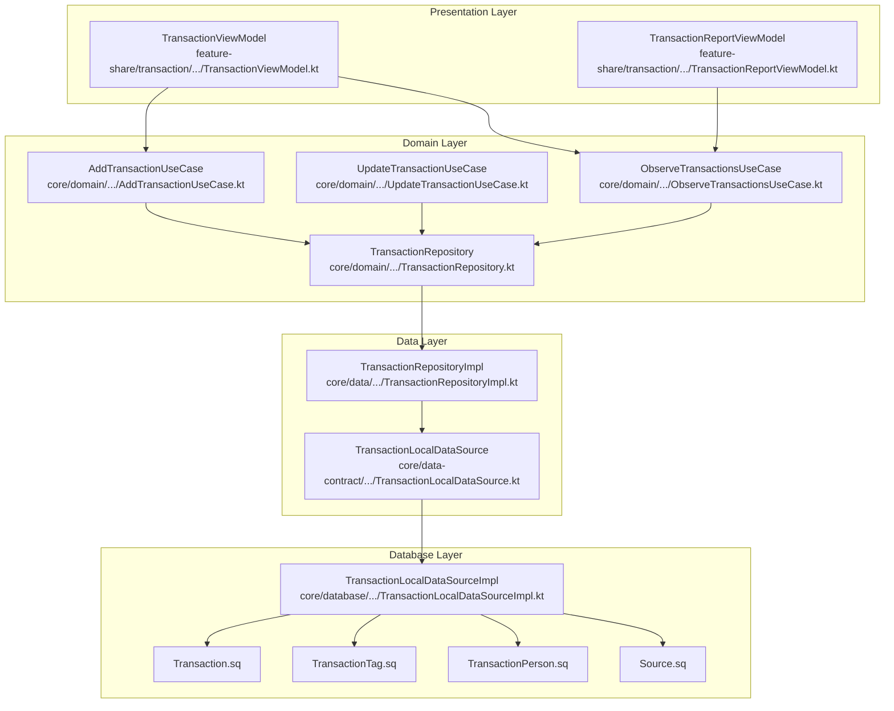
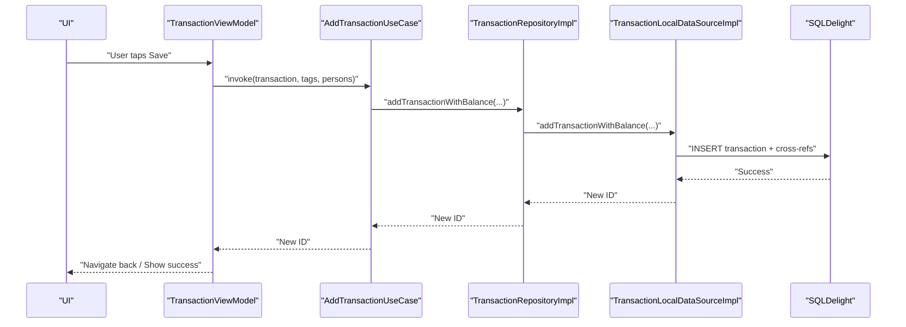
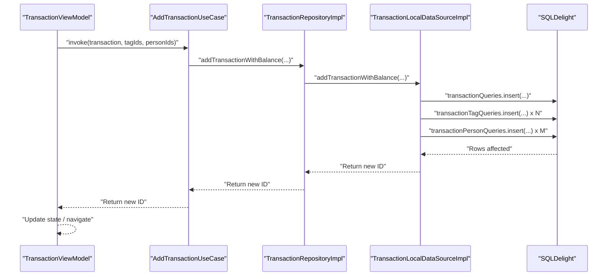
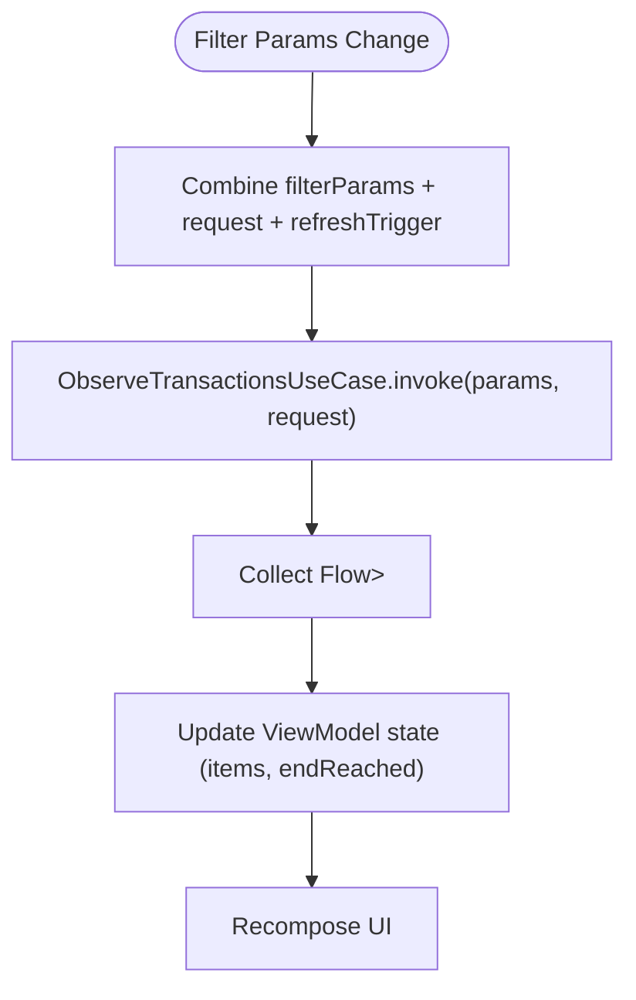
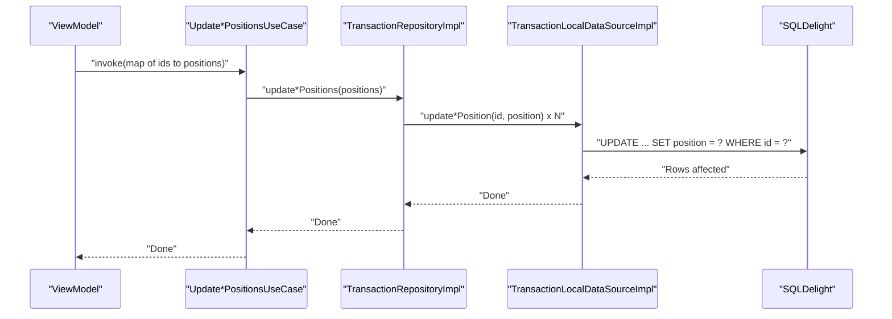
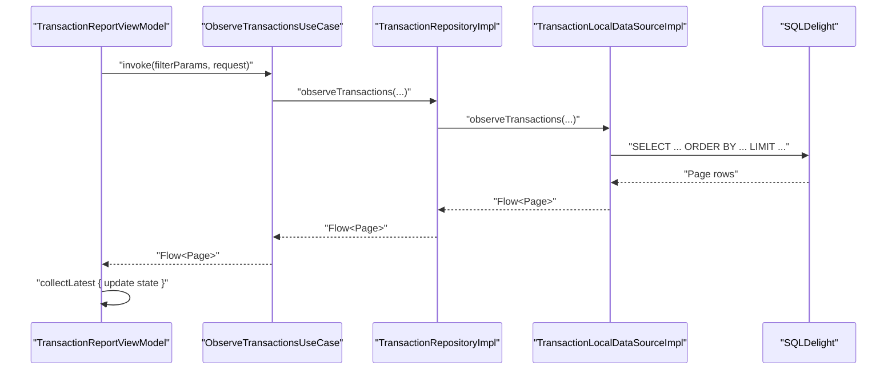
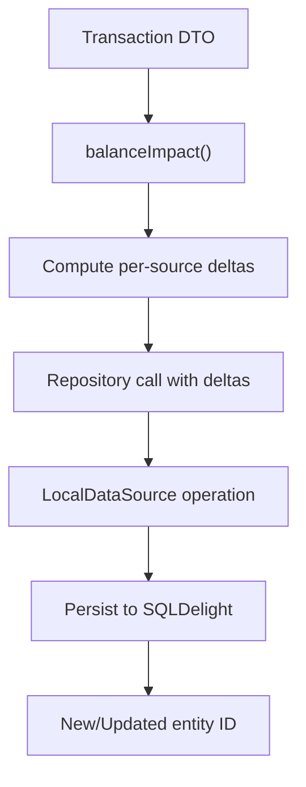
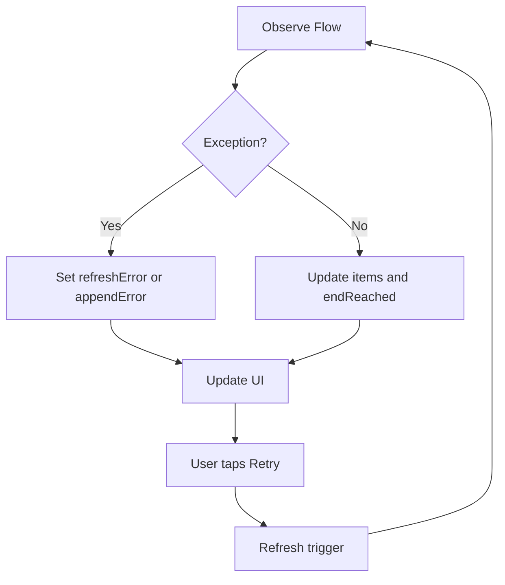
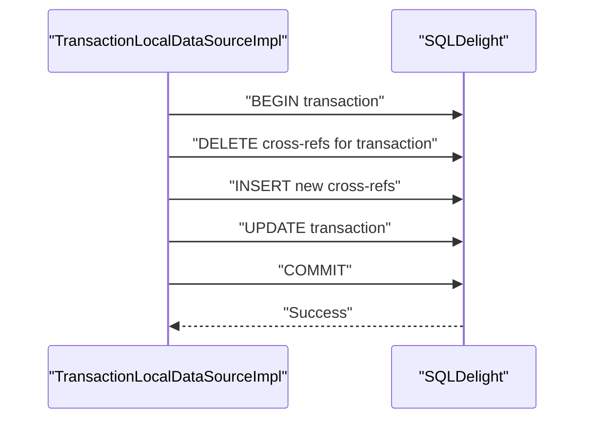
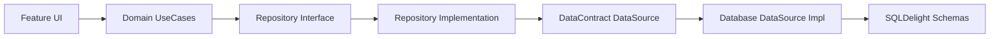

# Data Flow Architecture

<cite>
**Referenced Files in This Document**
- [TransactionViewModel.kt](file://feature-share/transaction/src/commonMain/kotlin/com/kazemieh/transaction/ui/main/TransactionViewModel.kt)
- [TransactionReportViewModel.kt](file://feature-share/transaction/src/commonMain/kotlin/com/kazemieh/transaction/ui/report/TransactionReportViewModel.kt)
- [AddTransactionUseCase.kt](file://core/domain/src/commonMain/kotlin/com/kazemieh/domain/usecase/AddTransactionUseCase.kt)
- [UpdateTransactionUseCase.kt](file://core/domain/src/commonMain/kotlin/com/kazemieh/domain/usecase/UpdateTransactionUseCase.kt)
- [ObserveTransactionsUseCase.kt](file://core/domain/src/commonMain/kotlin/com/kazemieh/domain/usecase/ObserveTransactionsUseCase.kt)
- [TransactionRepository.kt](file://core/domain/src/commonMain/kotlin/com/kazemieh/domain/repository/TransactionRepository.kt)
- [TransactionRepositoryImpl.kt](file://core/data/src/commonMain/kotlin/com/kazemieh/data/repository/TransactionRepositoryImpl.kt)
- [TransactionLocalDataSource.kt](file://core/data-contract/src/commonMain/kotlin/com/kazemieh/data_contract/datasource/TransactionLocalDataSource.kt)
- [TransactionLocalDataSourceImpl.kt](file://core/database/src/commonMain/kotlin/com/kazemieh/database/datasource/TransactionLocalDataSourceImpl.kt)
- [Source.sq](file://core/database/src/commonMain/sqldelight/com/kazemieh/database/Source.sq)
- [Transaction.sq](file://core/database/src/commonMain/sqldelight/com/kazemieh/database/Transaction.sq)
- [TransactionPerson.sq](file://core/database/src/commonMain/sqldelight/com/kazemieh/database/TransactionPerson.sq)
- [TransactionTag.sq](file://core/database/src/commonMain/sqldelight/com/kazemieh/database/TransactionTag.sq)
- [TransactionFilterParams.kt](file://core/common/src/commonMain/kotlin/com/kazemieh/common/model/TransactionFilterParams.kt)
- [PageRequest.kt](file://core/common/src/commonMain/kotlin/com/kazemieh/common/model/PageRequest.kt)
- [Transaction.kt](file://core/common/src/commonMain/kotlin/com/kazemieh/common/model/Transaction.kt)
- [TransactionWithRelations.kt](file://core/common/src/commonMain/kotlin/com/kazemieh/common/model/TransactionWithRelations.kt)
- [balanceImpact.kt](file://core/domain/src/commonMain/kotlin/com/kazemieh/domain/util/balanceImpact.kt)
- [fintrack_master_guide.md](file://agent/fintrack_master_guide.md)
</cite>

## Table of Contents
1. [Introduction](#introduction)
2. [Project Structure](#project-structure)
3. [Core Components](#core-components)
4. [Architecture Overview](#architecture-overview)
5. [Detailed Component Analysis](#detailed-component-analysis)
6. [Dependency Analysis](#dependency-analysis)
7. [Performance Considerations](#performance-considerations)
8. [Troubleshooting Guide](#troubleshooting-guide)
9. [Conclusion](#conclusion)

## Introduction
This document explains the end-to-end data flow architecture in FinTrack, from user input through UI intents to persistent storage. It covers how reactive streams with Kotlin Flow power real-time updates, how data transformations occur across layers, and how filtering, batch operations, and offline-first strategies are implemented. The architecture follows a layered pattern:
- UI intents trigger UseCases
- UseCases operate on repositories
- Repositories delegate to local data sources
- Local data sources persist to SQLDelight databases

## Project Structure
FinTrack organizes code by layers and features:
- UI and presentation live under feature modules (e.g., transactions)
- Domain defines UseCases and repository interfaces
- Data implements repositories and delegates to data contracts
- Data-contract defines DataSource interfaces
- Database implements DataSources with SQLDelight queries
- Common models and utilities are shared across layers

**Diagram sources**
- [TransactionViewModel.kt:83-105](file://feature-share/transaction/src/commonMain/kotlin/com/kazemieh/transaction/ui/main/TransactionViewModel.kt#L83-L105)
- [TransactionReportViewModel.kt:162-190](file://feature-share/transaction/src/commonMain/kotlin/com/kazemieh/transaction/ui/report/TransactionReportViewModel.kt#L162-L190)
- [AddTransactionUseCase.kt:1-18](file://core/domain/src/commonMain/kotlin/com/kazemieh/domain/usecase/AddTransactionUseCase.kt#L1-L18)
- [UpdateTransactionUseCase.kt:1-32](file://core/domain/src/commonMain/kotlin/com/kazemieh/domain/usecase/UpdateTransactionUseCase.kt#L1-L32)
- [ObserveTransactionsUseCase.kt:1-19](file://core/domain/src/commonMain/kotlin/com/kazemieh/domain/usecase/ObserveTransactionsUseCase.kt#L1-L19)
- [TransactionRepository.kt](file://core/domain/src/commonMain/kotlin/com/kazemieh/domain/repository/TransactionRepository.kt)
- [TransactionRepositoryImpl.kt:96-234](file://core/data/src/commonMain/kotlin/com/kazemieh/data/repository/TransactionRepositoryImpl.kt#L96-L234)
- [TransactionLocalDataSource.kt](file://core/data-contract/src/commonMain/kotlin/com/kazemieh/data_contract/datasource/TransactionLocalDataSource.kt)
- [TransactionLocalDataSourceImpl.kt:536-575](file://core/database/src/commonMain/kotlin/com/kazemieh/database/datasource/TransactionLocalDataSourceImpl.kt#L536-L575)
- [Transaction.sq](file://core/database/src/commonMain/sqldelight/com/kazemieh/database/Transaction.sq)
- [TransactionTag.sq](file://core/database/src/commonMain/sqldelight/com/kazemieh/database/TransactionTag.sq)
- [TransactionPerson.sq](file://core/database/src/commonMain/sqldelight/com/kazemieh/database/TransactionPerson.sq)
- [Source.sq](file://core/database/src/commonMain/sqldelight/com/kazemieh/database/Source.sq)

**Section sources**
- [fintrack_master_guide.md:71-100](file://agent/fintrack_master_guide.md#L71-L100)

## Core Components
- UI ViewModels orchestrate user intents and collect reactive streams from UseCases.
- UseCases encapsulate single responsibilities and transform data via utility helpers.
- Repositories define the contract for data access and coordinate between layers.
- Local DataSources implement persistence using SQLDelight queries.
- SQLDelight schemas define tables and queries for transactions, tags, persons, and sources.

Key responsibilities:
- TransactionViewModel handles pagination, filters, and refresh triggers.
- TransactionReportViewModel observes filtered pages and manages errors.
- UseCases compute balance impacts and delegate to repositories.
- TransactionRepositoryImpl delegates to local data sources.
- TransactionLocalDataSourceImpl executes SQLDelight queries and maintains consistency.

**Section sources**
- [TransactionViewModel.kt:67-105](file://feature-share/transaction/src/commonMain/kotlin/com/kazemieh/transaction/ui/main/TransactionViewModel.kt#L67-L105)
- [TransactionReportViewModel.kt:157-190](file://feature-share/transaction/src/commonMain/kotlin/com/kazemieh/transaction/ui/report/TransactionReportViewModel.kt#L157-L190)
- [AddTransactionUseCase.kt:1-18](file://core/domain/src/commonMain/kotlin/com/kazemieh/domain/usecase/AddTransactionUseCase.kt#L1-L18)
- [UpdateTransactionUseCase.kt:1-32](file://core/domain/src/commonMain/kotlin/com/kazemieh/domain/usecase/UpdateTransactionUseCase.kt#L1-L32)
- [ObserveTransactionsUseCase.kt:1-19](file://core/domain/src/commonMain/kotlin/com/kazemieh/domain/usecase/ObserveTransactionsUseCase.kt#L1-L19)
- [TransactionRepositoryImpl.kt:96-234](file://core/data/src/commonMain/kotlin/com/kazemieh/data/repository/TransactionRepositoryImpl.kt#L96-L234)
- [TransactionLocalDataSourceImpl.kt:536-575](file://core/database/src/commonMain/kotlin/com/kazemieh/database/datasource/TransactionLocalDataSourceImpl.kt#L536-L575)

## Architecture Overview
The data flow follows a unidirectional stream:
- UI intents enter ViewModels
- ViewModels call UseCases
- UseCases call repositories
- Repositories call local data sources
- Local data sources persist to SQLDelight tables
- Observers receive reactive updates through Flow

**Diagram sources**
- [TransactionViewModel.kt:83-105](file://feature-share/transaction/src/commonMain/kotlin/com/kazemieh/transaction/ui/main/TransactionViewModel.kt#L83-L105)
- [AddTransactionUseCase.kt:10-17](file://core/domain/src/commonMain/kotlin/com/kazemieh/domain/usecase/AddTransactionUseCase.kt#L10-L17)
- [TransactionRepositoryImpl.kt:96-110](file://core/data/src/commonMain/kotlin/com/kazemieh/data/repository/TransactionRepositoryImpl.kt#L96-L110)
- [TransactionLocalDataSourceImpl.kt:536-575](file://core/database/src/commonMain/kotlin/com/kazemieh/database/datasource/TransactionLocalDataSourceImpl.kt#L536-L575)
- [Transaction.sq](file://core/database/src/commonMain/sqldelight/com/kazemieh/database/Transaction.sq)
- [TransactionTag.sq](file://core/database/src/commonMain/sqldelight/com/kazemieh/database/TransactionTag.sq)
- [TransactionPerson.sq](file://core/database/src/commonMain/sqldelight/com/kazemieh/database/TransactionPerson.sq)

## Detailed Component Analysis

### Transaction Creation Flow
End-to-end flow for adding a transaction:
1. UI emits an intent to save
2. ViewModel invokes AddTransactionUseCase
3. UseCase computes balance impact and calls repository
4. Repository delegates to local data source
5. Local data source inserts transaction and cross-references
6. SQLDelight persists data and returns new ID
7. ViewModel receives result and updates UI

**Diagram sources**
- [TransactionViewModel.kt:83-105](file://feature-share/transaction/src/commonMain/kotlin/com/kazemieh/transaction/ui/main/TransactionViewModel.kt#L83-L105)
- [AddTransactionUseCase.kt:10-17](file://core/domain/src/commonMain/kotlin/com/kazemieh/domain/usecase/AddTransactionUseCase.kt#L10-L17)
- [TransactionRepositoryImpl.kt:96-110](file://core/data/src/commonMain/kotlin/com/kazemieh/data/repository/TransactionRepositoryImpl.kt#L96-L110)
- [TransactionLocalDataSourceImpl.kt:536-575](file://core/database/src/commonMain/kotlin/com/kazemieh/database/datasource/TransactionLocalDataSourceImpl.kt#L536-L575)
- [Transaction.sq](file://core/database/src/commonMain/sqldelight/com/kazemieh/database/Transaction.sq)
- [TransactionTag.sq](file://core/database/src/commonMain/sqldelight/com/kazemieh/database/TransactionTag.sq)
- [TransactionPerson.sq](file://core/database/src/commonMain/sqldelight/com/kazemieh/database/TransactionPerson.sq)

**Section sources**
- [AddTransactionUseCase.kt:1-18](file://core/domain/src/commonMain/kotlin/com/kazemieh/domain/usecase/AddTransactionUseCase.kt#L1-L18)
- [TransactionRepositoryImpl.kt:96-110](file://core/data/src/commonMain/kotlin/com/kazemieh/data/repository/TransactionRepositoryImpl.kt#L96-L110)
- [TransactionLocalDataSourceImpl.kt:536-575](file://core/database/src/commonMain/kotlin/com/kazemieh/database/datasource/TransactionLocalDataSourceImpl.kt#L536-L575)

### Filtering Mechanisms
Filtering is applied at the domain layer:
- TransactionFilterParams drives filtering criteria
- ObserveTransactionsUseCase exposes Flow<Page<TransactionWithRelations>>
- TransactionReportViewModel combines filter params, request, and refresh trigger to observe filtered pages

**Diagram sources**
- [TransactionReportViewModel.kt:162-190](file://feature-share/transaction/src/commonMain/kotlin/com/kazemieh/transaction/ui/report/TransactionReportViewModel.kt#L162-L190)
- [ObserveTransactionsUseCase.kt:13-18](file://core/domain/src/commonMain/kotlin/com/kazemieh/domain/usecase/ObserveTransactionsUseCase.kt#L13-L18)
- [TransactionFilterParams.kt](file://core/common/src/commonMain/kotlin/com/kazemieh/common/model/TransactionFilterParams.kt)
- [PageRequest.kt](file://core/common/src/commonMain/kotlin/com/kazemieh/common/model/PageRequest.kt)

**Section sources**
- [TransactionReportViewModel.kt:157-190](file://feature-share/transaction/src/commonMain/kotlin/com/kazemieh/transaction/ui/report/TransactionReportViewModel.kt#L157-L190)
- [ObserveTransactionsUseCase.kt:1-19](file://core/domain/src/commonMain/kotlin/com/kazemieh/domain/usecase/ObserveTransactionsUseCase.kt#L1-L19)

### Batch Operations
Batch operations are supported through position updates and cross-reference management:
- Position updates: UpdateTagPositionsUseCase, UpdatePersonPositionsUseCase, UpdateSourcePositionsUseCase
- Cross-reference updates: TransactionLocalDataSourceImpl deletes existing relations and re-inserts new ones during update

**Diagram sources**
- [UpdateTransactionUseCase.kt:1-32](file://core/domain/src/commonMain/kotlin/com/kazemieh/domain/usecase/UpdateTransactionUseCase.kt#L1-L32)
- [TransactionRepositoryImpl.kt:213-229](file://core/data/src/commonMain/kotlin/com/kazemieh/data/repository/TransactionRepositoryImpl.kt#L213-L229)
- [TransactionLocalDataSourceImpl.kt:536-575](file://core/database/src/commonMain/kotlin/com/kazemieh/database/datasource/TransactionLocalDataSourceImpl.kt#L536-L575)
- [Source.sq](file://core/database/src/commonMain/sqldelight/com/kazemieh/database/Source.sq)

**Section sources**
- [TransactionRepositoryImpl.kt:213-229](file://core/data/src/commonMain/kotlin/com/kazemieh/data/repository/TransactionRepositoryImpl.kt#L213-L229)
- [TransactionLocalDataSourceImpl.kt:536-575](file://core/database/src/commonMain/kotlin/com/kazemieh/database/datasource/TransactionLocalDataSourceImpl.kt#L536-L575)

### Real-Time Updates with Flow
Real-time updates are achieved through Flow:
- ObserveTransactionsUseCase returns Flow<Page<TransactionWithRelations>>
- TransactionReportViewModel collectsLatest and updates state
- TransactionViewModel initializes observation and refreshes on demand

**Diagram sources**
- [ObserveTransactionsUseCase.kt:13-18](file://core/domain/src/commonMain/kotlin/com/kazemieh/domain/usecase/ObserveTransactionsUseCase.kt#L13-L18)
- [TransactionReportViewModel.kt:162-190](file://feature-share/transaction/src/commonMain/kotlin/com/kazemieh/transaction/ui/report/TransactionReportViewModel.kt#L162-L190)
- [TransactionRepositoryImpl.kt:96-110](file://core/data/src/commonMain/kotlin/com/kazemieh/data/repository/TransactionRepositoryImpl.kt#L96-L110)
- [TransactionLocalDataSourceImpl.kt:536-575](file://core/database/src/commonMain/kotlin/com/kazemieh/database/datasource/TransactionLocalDataSourceImpl.kt#L536-L575)

**Section sources**
- [ObserveTransactionsUseCase.kt:1-19](file://core/domain/src/commonMain/kotlin/com/kazemieh/domain/usecase/ObserveTransactionsUseCase.kt#L1-L19)
- [TransactionReportViewModel.kt:157-190](file://feature-share/transaction/src/commonMain/kotlin/com/kazemieh/transaction/ui/report/TransactionReportViewModel.kt#L157-L190)

### Data Transformations
Transformations occur across layers:
- UseCases compute balance impact deltas using balanceImpact utility
- Repositories forward requests to local data sources
- Local data sources manage cross-references and enforce referential integrity

**Diagram sources**
- [UpdateTransactionUseCase.kt:16-25](file://core/domain/src/commonMain/kotlin/com/kazemieh/domain/usecase/UpdateTransactionUseCase.kt#L16-L25)
- [balanceImpact.kt](file://core/domain/src/commonMain/kotlin/com/kazemieh/domain/util/balanceImpact.kt)
- [TransactionRepositoryImpl.kt:96-110](file://core/data/src/commonMain/kotlin/com/kazemieh/data/repository/TransactionRepositoryImpl.kt#L96-L110)
- [TransactionLocalDataSourceImpl.kt:536-575](file://core/database/src/commonMain/kotlin/com/kazemieh/database/datasource/TransactionLocalDataSourceImpl.kt#L536-L575)

**Section sources**
- [UpdateTransactionUseCase.kt:1-32](file://core/domain/src/commonMain/kotlin/com/kazemieh/domain/usecase/UpdateTransactionUseCase.kt#L1-L32)
- [balanceImpact.kt](file://core/domain/src/commonMain/kotlin/com/kazemieh/domain/util/balanceImpact.kt)

### Local vs Remote Data Sources and Offline-First
- Local data sources implement persistence using SQLDelight tables
- Remote synchronization is not present in the examined code; offline-first is achieved by relying solely on local data sources
- No explicit cache invalidation or conflict resolution logic was identified in the examined files

Implications:
- All reads/writes go through TransactionLocalDataSourceImpl
- No network layer or remote data source interfaces were found in the examined scope
- Offline-first behavior is ensured by avoiding network dependencies

**Section sources**
- [TransactionLocalDataSource.kt](file://core/data-contract/src/commonMain/kotlin/com/kazemieh/data_contract/datasource/TransactionLocalDataSource.kt)
- [TransactionLocalDataSourceImpl.kt:536-575](file://core/database/src/commonMain/kotlin/com/kazemieh/database/datasource/TransactionLocalDataSourceImpl.kt#L536-L575)

### Error Propagation and Retry
- TransactionReportViewModel demonstrates error handling by catching exceptions from the Flow and setting error flags in state
- Retry is triggered via a dedicated intent in the ViewModel

**Diagram sources**
- [TransactionReportViewModel.kt:175-181](file://feature-share/transaction/src/commonMain/kotlin/com/kazemieh/transaction/ui/report/TransactionReportViewModel.kt#L175-L181)

**Section sources**
- [TransactionReportViewModel.kt:157-190](file://feature-share/transaction/src/commonMain/kotlin/com/kazemieh/transaction/ui/report/TransactionReportViewModel.kt#L157-L190)

### Data Consistency Guarantees
Consistency is maintained through:
- SQL transactions in TransactionLocalDataSourceImpl for multi-table writes
- Cross-reference deletion and re-insertion during updates
- Balance adjustments executed alongside transaction updates

**Diagram sources**
- [TransactionLocalDataSourceImpl.kt:536-575](file://core/database/src/commonMain/kotlin/com/kazemieh/database/datasource/TransactionLocalDataSourceImpl.kt#L536-L575)

**Section sources**
- [TransactionLocalDataSourceImpl.kt:536-575](file://core/database/src/commonMain/kotlin/com/kazemieh/database/datasource/TransactionLocalDataSourceImpl.kt#L536-L575)

## Dependency Analysis
The dependency chain is clean and layered:
- Presentation depends on Domain UseCases
- Domain depends on Repository interfaces
- Data implements Repository and depends on DataContract
- DataContract depends on Database implementations
- Database depends on SQLDelight schemas

**Diagram sources**
- [TransactionViewModel.kt:83-105](file://feature-share/transaction/src/commonMain/kotlin/com/kazemieh/transaction/ui/main/TransactionViewModel.kt#L83-L105)
- [AddTransactionUseCase.kt:10-17](file://core/domain/src/commonMain/kotlin/com/kazemieh/domain/usecase/AddTransactionUseCase.kt#L10-L17)
- [TransactionRepository.kt](file://core/domain/src/commonMain/kotlin/com/kazemieh/domain/repository/TransactionRepository.kt)
- [TransactionRepositoryImpl.kt:96-110](file://core/data/src/commonMain/kotlin/com/kazemieh/data/repository/TransactionRepositoryImpl.kt#L96-L110)
- [TransactionLocalDataSource.kt](file://core/data-contract/src/commonMain/kotlin/com/kazemieh/data_contract/datasource/TransactionLocalDataSource.kt)
- [TransactionLocalDataSourceImpl.kt:536-575](file://core/database/src/commonMain/kotlin/com/kazemieh/database/datasource/TransactionLocalDataSourceImpl.kt#L536-L575)
- [Transaction.sq](file://core/database/src/commonMain/sqldelight/com/kazemieh/database/Transaction.sq)

**Section sources**
- [TransactionRepository.kt](file://core/domain/src/commonMain/kotlin/com/kazemieh/domain/repository/TransactionRepository.kt)
- [TransactionRepositoryImpl.kt:96-234](file://core/data/src/commonMain/kotlin/com/kazemieh/data/repository/TransactionRepositoryImpl.kt#L96-L234)

## Performance Considerations
- Pagination via PageRequest reduces memory footprint
- collectLatest ensures only the latest collection is active, preventing redundant work
- Batch position updates iterate over maps; consider batching SQL statements if needed
- Cross-reference deletion and insertion during updates is efficient but should avoid unnecessary duplicates

## Troubleshooting Guide
Common issues and remedies:
- Observation not updating: Verify that Flow is collected and that refreshTrigger emits
- Filter not applied: Ensure TransactionFilterParams is updated and combined with request
- Append errors: Use retry intent to trigger refresh; check error flags set in state
- Update failures: Confirm transaction exists before update and that cross-reference tables are properly managed

**Section sources**
- [TransactionReportViewModel.kt:157-190](file://feature-share/transaction/src/commonMain/kotlin/com/kazemieh/transaction/ui/report/TransactionReportViewModel.kt#L157-L190)
- [TransactionLocalDataSourceImpl.kt:536-575](file://core/database/src/commonMain/kotlin/com/kazemieh/database/datasource/TransactionLocalDataSourceImpl.kt#L536-L575)

## Conclusion
FinTrack’s data flow architecture cleanly separates concerns across layers, leveraging Kotlin Flow for real-time updates and SQLDelight for reliable persistence. The system supports filtering, pagination, batch operations, and maintains consistency through SQL transactions. While offline-first behavior is evident, remote synchronization and conflict resolution are not implemented in the examined scope.