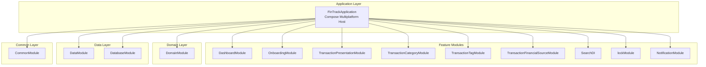
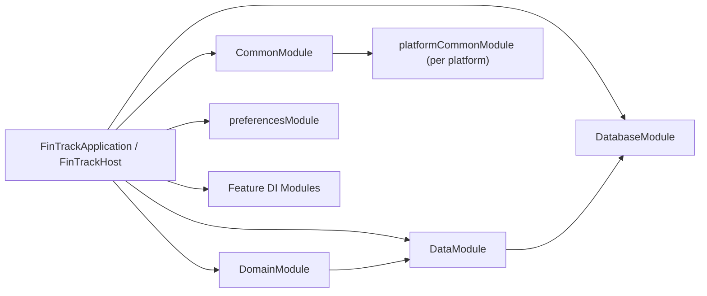
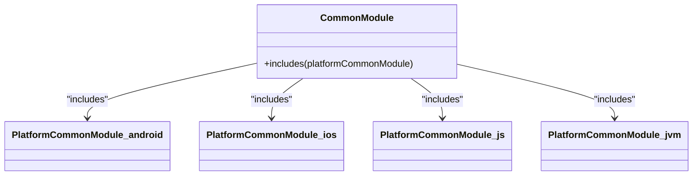
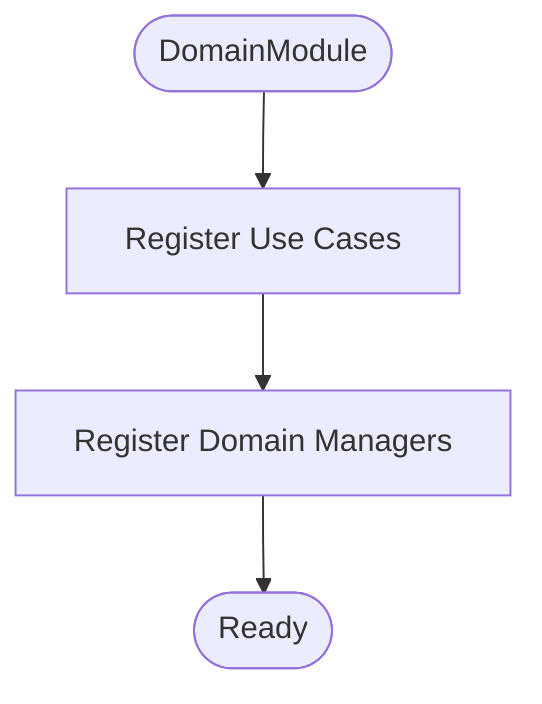
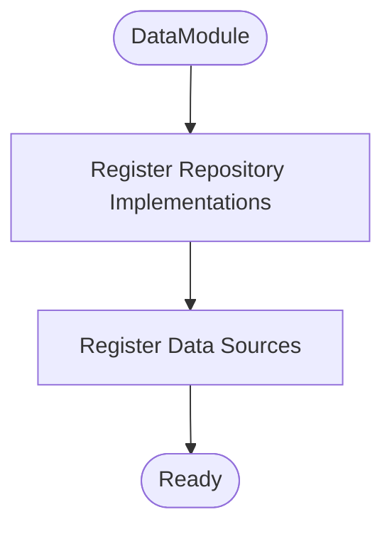
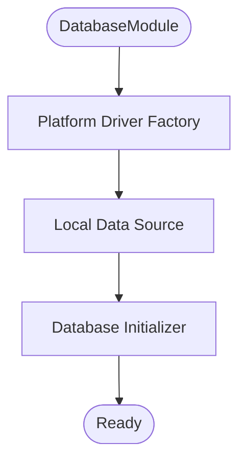
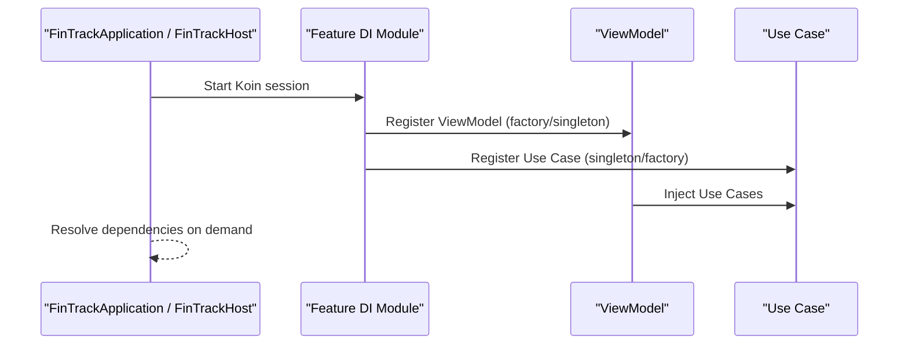
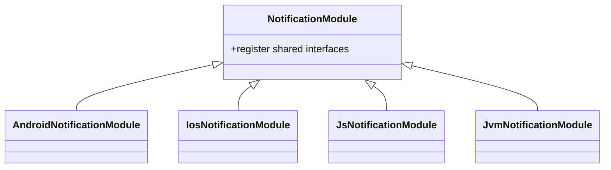
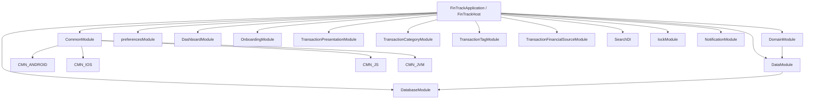

# Dependency Injection with Koin

<cite>
**Referenced Files in This Document**
- [CommonModule.kt](file://core/common/src/commonMain/kotlin/com/kazemieh/common/di/CommonModule.kt)
- [CommonModule.android.kt](file://core/common/src/androidMain/kotlin/com/kazemieh/common/di/CommonModule.android.kt)
- [CommonModule.ios.kt](file://core/common/src/iosMain/kotlin/com/kazemieh/common/di/CommonModule.ios.kt)
- [CommonModule.js.kt](file://core/common/src/jsMain/kotlin/com/kazemieh/common/di/CommonModule.js.kt)
- [CommonModule.jvm.kt](file://core/common/src/jvmMain/kotlin/com/kazemieh/common/di/CommonModule.jvm.kt)
- [DomainModule.kt](file://core/domain/src/commonMain/kotlin/com/kazemieh/domain/di/DomainModule.kt)
- [DataModule.kt](file://core/data/src/commonMain/kotlin/com/kazemieh/data/di/DataModule.kt)
- [DatabaseModule.kt](file://core/database/src/commonMain/kotlin/com/kazemieh/database/di/DatabaseModule.kt)
- [preferencesModule.kt](file://core/preferences/src/commonMain/kotlin/com/kazemieh/preferences/preferencesModule.kt)
- [DashboardModule.kt](file://feature-container/dashboard/src/commonMain/kotlin/com/kazemieh/dashboard/di/DashboardModule.kt)
- [OnboardingModule.kt](file://feature-container/onboarding/src/commonMain/kotlin/com/kazemieh/onboarding/di/OnboardingModule.kt)
- [TransactionPresentationModule.kt](file://feature-share/transaction/src/commonMain/kotlin/com/kazemieh/transaction/di/TransactionPresentationModule.kt)
- [TransactionCategoryModule.kt](file://feature-share/category/src/commonMain/kotlin/com/kazemieh/category/di/TransactionCategoryModule.kt)
- [TransactionTagModule.kt](file://feature-share/tags/src/commonMain/kotlin/com/kazemieh/tag/di/TransactionTagModule.kt)
- [TransactionFinancialSourceModule.kt](file://feature-share/source/src/commonMain/kotlin/com/kazemieh/financialsource/di/TransactionFinancialSourceModule.kt)
- [SearchDI.kt](file://feature-share/search/src/commonMain/kotlin/com/kazemieh/search/di/SearchDI.kt)
- [lockModule.kt](file://feature-share/lock/src/commonMain/kotlin/com/kazemieh/lock/di/lockModule.kt)
- [NotificationModule.kt](file://feature-share/notifications/src/commonMain/kotlin/com/kazemieh/notifications/di/NotificationModule.kt)
- [AndroidNotificationModule.kt](file://feature-share/notifications/src/androidMain/kotlin/com/kazemieh/notifications/di/AndroidNotificationModule.kt)
- [IosNotificationModule.kt](file://feature-share/notifications/src/iosMain/kotlin/com/kazemieh/notifications/di/IosNotificationModule.kt)
- [JsNotificationModule.kt](file://feature-share/notifications/src/jsMain/kotlin/com/kazemieh/notifications/di/JsNotificationModule.kt)
- [JvmNotificationModule.kt](file://feature-share/notifications/src/jvmMain/kotlin/com/kazemieh/notifications/di/JvmNotificationModule.kt)
- [FinTrackApplication.kt](file://app/src/main/java/com/kazemieh/fintrack/FinTrackApplication.kt)
- [FinTrackHost.kt](file://composeApp/src/commonMain/kotlin/com/kazemieh/composeApp/FinTrackHost.kt)
</cite>

## Table of Contents
1. [Introduction](#introduction)
2. [Project Structure](#project-structure)
3. [Core Components](#core-components)
4. [Architecture Overview](#architecture-overview)
5. [Detailed Component Analysis](#detailed-component-analysis)
6. [Dependency Analysis](#dependency-analysis)
7. [Performance Considerations](#performance-considerations)
8. [Troubleshooting Guide](#troubleshooting-guide)
9. [Conclusion](#conclusion)

## Introduction
This document explains the Koin dependency injection architecture used in FinTrack. It focuses on how modules are organized across layers and platforms, how common and platform-specific implementations are separated, and how repositories, use cases, and managers are registered and injected. It also covers singleton vs factory scopes, conditional bindings, testability via mocks, and best practices for avoiding circular dependencies and managing complex object graphs.

## Project Structure
FinTrack follows a multiplatform modular architecture with clear separation of concerns:
- Common layer: shared business logic, models, and DI modules that are platform-independent.
- Platform-specific layers: Android, iOS, JVM, and JS, each providing platform adapters and implementations.
- Feature containers and shareable features: each feature exposes its own DI module(s) to wire UI, presentation, domain, and data layers.
- Application entry points: Android app and Compose Multiplatform host initialize Koin and assemble modules.

**Diagram sources**
- [FinTrackApplication.kt](file://app/src/main/java/com/kazemieh/fintrack/FinTrackApplication.kt)
- [FinTrackHost.kt](file://composeApp/src/commonMain/kotlin/com/kazemieh/composeApp/FinTrackHost.kt)
- [CommonModule.kt](file://core/common/src/commonMain/kotlin/com/kazemieh/common/di/CommonModule.kt)
- [DomainModule.kt](file://core/domain/src/commonMain/kotlin/com/kazemieh/domain/di/DomainModule.kt)
- [DataModule.kt](file://core/data/src/commonMain/kotlin/com/kazemieh/data/di/DataModule.kt)
- [DatabaseModule.kt](file://core/database/src/commonMain/kotlin/com/kazemieh/database/di/DatabaseModule.kt)
- [DashboardModule.kt](file://feature-container/dashboard/src/commonMain/kotlin/com/kazemieh/dashboard/di/DashboardModule.kt)
- [OnboardingModule.kt](file://feature-container/onboarding/src/commonMain/kotlin/com/kazemieh/onboarding/di/OnboardingModule.kt)
- [TransactionPresentationModule.kt](file://feature-share/transaction/src/commonMain/kotlin/com/kazemieh/transaction/di/TransactionPresentationModule.kt)
- [TransactionCategoryModule.kt](file://feature-share/category/src/commonMain/kotlin/com/kazemieh/category/di/TransactionCategoryModule.kt)
- [TransactionTagModule.kt](file://feature-share/tags/src/commonMain/kotlin/com/kazemieh/tag/di/TransactionTagModule.kt)
- [TransactionFinancialSourceModule.kt](file://feature-share/source/src/commonMain/kotlin/com/kazemieh/financialsource/di/TransactionFinancialSourceModule.kt)
- [SearchDI.kt](file://feature-share/search/src/commonMain/kotlin/com/kazemieh/search/di/SearchDI.kt)
- [lockModule.kt](file://feature-share/lock/src/commonMain/kotlin/com/kazemieh/lock/di/lockModule.kt)
- [NotificationModule.kt](file://feature-share/notifications/src/commonMain/kotlin/com/kazemieh/notifications/di/NotificationModule.kt)

**Section sources**
- [CommonModule.kt:1-10](file://core/common/src/commonMain/kotlin/com/kazemieh/common/di/CommonModule.kt#L1-L10)
- [FinTrackApplication.kt](file://app/src/main/java/com/kazemieh/fintrack/FinTrackApplication.kt)
- [FinTrackHost.kt](file://composeApp/src/commonMain/kotlin/com/kazemieh/composeApp/FinTrackHost.kt)

## Core Components
Koin modules are defined across layers and platforms to separate concerns and enable platform-specific implementations:

- Common DI module
  - Declares expect/actual platformCommonModule and includes it to merge platform-specific bindings into a single commonModule.
  - Provides shared bindings that are identical across platforms.

- Domain DI module
  - Registers use cases and domain-level managers.
  - Exposes domain abstractions and orchestrators to higher layers.

- Data DI module
  - Registers repositories and data sources.
  - Bridges domain repositories to platform-specific data implementations.

- Database DI module
  - Provides database driver factories and local data sources.
  - Handles SQLDelight initialization and platform-specific drivers.

- Preferences DI module
  - Registers preference-related services and observers.

- Feature DI modules
  - Each feature registers its presentation and UI-related dependencies.
  - Coordinates with domain and data modules to wire view models and use cases.

Key DI patterns observed:
- Singleton scope: Used for long-lived services like database drivers, formatters, and managers.
- Factory scope: Used for transient objects like view models or temporary processors.
- Platform-specific includes: Each platform contributes its own bindings via actual platformCommonModule.

**Section sources**
- [CommonModule.kt:1-10](file://core/common/src/commonMain/kotlin/com/kazemieh/common/di/CommonModule.kt#L1-L10)
- [CommonModule.android.kt:1-7](file://core/common/src/androidMain/kotlin/com/kazemieh/common/di/CommonModule.android.kt#L1-L7)
- [CommonModule.ios.kt:1-7](file://core/common/src/iosMain/kotlin/com/kazemieh/common/di/CommonModule.ios.kt#L1-L7)
- [CommonModule.js.kt:1-7](file://core/common/src/jsMain/kotlin/com/kazemieh/common/di/CommonModule.js.kt#L1-L7)
- [CommonModule.jvm.kt:1-7](file://core/common/src/jvmMain/kotlin/com/kazemieh/common/di/CommonModule.jvm.kt#L1-L7)
- [DomainModule.kt](file://core/domain/src/commonMain/kotlin/com/kazemieh/domain/di/DomainModule.kt)
- [DataModule.kt](file://core/data/src/commonMain/kotlin/com/kazemieh/data/di/DataModule.kt)
- [DatabaseModule.kt](file://core/database/src/commonMain/kotlin/com/kazemieh/database/di/DatabaseModule.kt)
- [preferencesModule.kt](file://core/preferences/src/commonMain/kotlin/com/kazemieh/preferences/preferencesModule.kt)

## Architecture Overview
The DI architecture is layered and platform-aware:
- Application entry points initialize Koin and assemble modules from common, domain, data, database, preferences, and feature modules.
- Common module aggregates platform-specific bindings through includes.
- Domain module depends on data module; presentation modules depend on domain.
- Feature modules encapsulate their own dependencies and expose them via DI.

**Diagram sources**
- [FinTrackApplication.kt](file://app/src/main/java/com/kazemieh/fintrack/FinTrackApplication.kt)
- [FinTrackHost.kt](file://composeApp/src/commonMain/kotlin/com/kazemieh/composeApp/FinTrackHost.kt)
- [CommonModule.kt:1-10](file://core/common/src/commonMain/kotlin/com/kazemieh/common/di/CommonModule.kt#L1-L10)
- [DomainModule.kt](file://core/domain/src/commonMain/kotlin/com/kazemieh/domain/di/DomainModule.kt)
- [DataModule.kt](file://core/data/src/commonMain/kotlin/com/kazemieh/data/di/DataModule.kt)
- [DatabaseModule.kt](file://core/database/src/commonMain/kotlin/com/kazemieh/database/di/DatabaseModule.kt)
- [preferencesModule.kt](file://core/preferences/src/commonMain/kotlin/com/kazemieh/preferences/preferencesModule.kt)

## Detailed Component Analysis

### Common DI Module
The common module defines an expect/actual platformCommonModule and includes it to merge platform-specific bindings. This pattern ensures:
- Shared bindings live in the common module.
- Platform-specific implementations are contributed via actual declarations in each platform source set.

**Diagram sources**
- [CommonModule.kt:1-10](file://core/common/src/commonMain/kotlin/com/kazemieh/common/di/CommonModule.kt#L1-L10)
- [CommonModule.android.kt:1-7](file://core/common/src/androidMain/kotlin/com/kazemieh/common/di/CommonModule.android.kt#L1-L7)
- [CommonModule.ios.kt:1-7](file://core/common/src/iosMain/kotlin/com/kazemieh/common/di/CommonModule.ios.kt#L1-L7)
- [CommonModule.js.kt:1-7](file://core/common/src/jsMain/kotlin/com/kazemieh/common/di/CommonModule.js.kt#L1-L7)
- [CommonModule.jvm.kt:1-7](file://core/common/src/jvmMain/kotlin/com/kazemieh/common/di/CommonModule.jvm.kt#L1-L7)

**Section sources**
- [CommonModule.kt:1-10](file://core/common/src/commonMain/kotlin/com/kazemieh/common/di/CommonModule.kt#L1-L10)
- [CommonModule.android.kt:1-7](file://core/common/src/androidMain/kotlin/com/kazemieh/common/di/CommonModule.android.kt#L1-L7)
- [CommonModule.ios.kt:1-7](file://core/common/src/iosMain/kotlin/com/kazemieh/common/di/CommonModule.ios.kt#L1-L7)
- [CommonModule.js.kt:1-7](file://core/common/src/jsMain/kotlin/com/kazemieh/common/di/CommonModule.js.kt#L1-L7)
- [CommonModule.jvm.kt:1-7](file://core/common/src/jvmMain/kotlin/com/kazemieh/common/di/CommonModule.jvm.kt#L1-L7)

### Domain DI Module
Registers domain use cases and managers. Typical registrations include:
- Use cases as singletons or factory-scoped depending on lifecycle needs.
- Managers that coordinate domain operations.

**Diagram sources**
- [DomainModule.kt](file://core/domain/src/commonMain/kotlin/com/kazemieh/domain/di/DomainModule.kt)

**Section sources**
- [DomainModule.kt](file://core/domain/src/commonMain/kotlin/com/kazemieh/domain/di/DomainModule.kt)

### Data DI Module
Registers repositories and data sources. Typical registrations include:
- Repository implementations as singletons.
- Local and remote data sources as singletons or scoped to repository lifetime.

**Diagram sources**
- [DataModule.kt](file://core/data/src/commonMain/kotlin/com/kazemieh/data/di/DataModule.kt)

**Section sources**
- [DataModule.kt](file://core/data/src/commonMain/kotlin/com/kazemieh/data/di/DataModule.kt)

### Database DI Module
Provides database driver factories and local data sources. Typical registrations include:
- Driver factory per platform.
- Local data source implementation.
- Database initializer.

**Diagram sources**
- [DatabaseModule.kt](file://core/database/src/commonMain/kotlin/com/kazemieh/database/di/DatabaseModule.kt)

**Section sources**
- [DatabaseModule.kt](file://core/database/src/commonMain/kotlin/com/kazemieh/database/di/DatabaseModule.kt)

### Feature DI Modules
Each feature module registers its presentation and UI dependencies:
- Presentation modules (e.g., TransactionPresentationModule) bind view models and UI-related services.
- Feature-specific modules (e.g., TransactionCategoryModule, TransactionTagModule, TransactionFinancialSourceModule) bind feature-specific use cases and repositories.

**Diagram sources**
- [FinTrackApplication.kt](file://app/src/main/java/com/kazemieh/fintrack/FinTrackApplication.kt)
- [FinTrackHost.kt](file://composeApp/src/commonMain/kotlin/com/kazemieh/composeApp/FinTrackHost.kt)
- [TransactionPresentationModule.kt](file://feature-share/transaction/src/commonMain/kotlin/com/kazemieh/transaction/di/TransactionPresentationModule.kt)
- [TransactionCategoryModule.kt](file://feature-share/category/src/commonMain/kotlin/com/kazemieh/category/di/TransactionCategoryModule.kt)
- [TransactionTagModule.kt](file://feature-share/tags/src/commonMain/kotlin/com/kazemieh/tag/di/TransactionTagModule.kt)
- [TransactionFinancialSourceModule.kt](file://feature-share/source/src/commonMain/kotlin/com/kazemieh/financialsource/di/TransactionFinancialSourceModule.kt)

**Section sources**
- [TransactionPresentationModule.kt](file://feature-share/transaction/src/commonMain/kotlin/com/kazemieh/transaction/di/TransactionPresentationModule.kt)
- [TransactionCategoryModule.kt](file://feature-share/category/src/commonMain/kotlin/com/kazemieh/category/di/TransactionCategoryModule.kt)
- [TransactionTagModule.kt](file://feature-share/tags/src/commonMain/kotlin/com/kazemieh/tag/di/TransactionTagModule.kt)
- [TransactionFinancialSourceModule.kt](file://feature-share/source/src/commonMain/kotlin/com/kazemieh/financialsource/di/TransactionFinancialSourceModule.kt)

### Notifications DI Modules (Platform-Specific)
Notifications feature demonstrates conditional bindings via platform-specific modules:
- Common notification module registers shared interfaces and base bindings.
- Platform-specific modules (Android, iOS, JVM, JS) contribute platform adapters and schedulers.

**Diagram sources**
- [NotificationModule.kt](file://feature-share/notifications/src/commonMain/kotlin/com/kazemieh/notifications/di/NotificationModule.kt)
- [AndroidNotificationModule.kt](file://feature-share/notifications/src/androidMain/kotlin/com/kazemieh/notifications/di/AndroidNotificationModule.kt)
- [IosNotificationModule.kt](file://feature-share/notifications/src/iosMain/kotlin/com/kazemieh/notifications/di/IosNotificationModule.kt)
- [JsNotificationModule.kt](file://feature-share/notifications/src/jsMain/kotlin/com/kazemieh/notifications/di/JsNotificationModule.kt)
- [JvmNotificationModule.kt](file://feature-share/notifications/src/jvmMain/kotlin/com/kazemieh/notifications/di/JvmNotificationModule.kt)

**Section sources**
- [NotificationModule.kt](file://feature-share/notifications/src/commonMain/kotlin/com/kazemieh/notifications/di/NotificationModule.kt)
- [AndroidNotificationModule.kt](file://feature-share/notifications/src/androidMain/kotlin/com/kazemieh/notifications/di/AndroidNotificationModule.kt)
- [IosNotificationModule.kt](file://feature-share/notifications/src/iosMain/kotlin/com/kazemieh/notifications/di/IosNotificationModule.kt)
- [JsNotificationModule.kt](file://feature-share/notifications/src/jsMain/kotlin/com/kazemieh/notifications/di/JsNotificationModule.kt)
- [JvmNotificationModule.kt](file://feature-share/notifications/src/jvmMain/kotlin/com/kazemieh/notifications/di/JvmNotificationModule.kt)

## Dependency Analysis
The DI graph exhibits clear layering and platform separation:
- Application entry points assemble modules from common, domain, data, database, preferences, and feature modules.
- Common module includes platform-specific contributions.
- Domain depends on data; data depends on database.
- Features depend on domain and optionally on data.

**Diagram sources**
- [FinTrackApplication.kt](file://app/src/main/java/com/kazemieh/fintrack/FinTrackApplication.kt)
- [FinTrackHost.kt](file://composeApp/src/commonMain/kotlin/com/kazemieh/composeApp/FinTrackHost.kt)
- [CommonModule.kt:1-10](file://core/common/src/commonMain/kotlin/com/kazemieh/common/di/CommonModule.kt#L1-L10)
- [DomainModule.kt](file://core/domain/src/commonMain/kotlin/com/kazemieh/domain/di/DomainModule.kt)
- [DataModule.kt](file://core/data/src/commonMain/kotlin/com/kazemieh/data/di/DataModule.kt)
- [DatabaseModule.kt](file://core/database/src/commonMain/kotlin/com/kazemieh/database/di/DatabaseModule.kt)
- [preferencesModule.kt](file://core/preferences/src/commonMain/kotlin/com/kazemieh/preferences/preferencesModule.kt)
- [DashboardModule.kt](file://feature-container/dashboard/src/commonMain/kotlin/com/kazemieh/dashboard/di/DashboardModule.kt)
- [OnboardingModule.kt](file://feature-container/onboarding/src/commonMain/kotlin/com/kazemieh/onboarding/di/OnboardingModule.kt)
- [TransactionPresentationModule.kt](file://feature-share/transaction/src/commonMain/kotlin/com/kazemieh/transaction/di/TransactionPresentationModule.kt)
- [TransactionCategoryModule.kt](file://feature-share/category/src/commonMain/kotlin/com/kazemieh/category/di/TransactionCategoryModule.kt)
- [TransactionTagModule.kt](file://feature-share/tags/src/commonMain/kotlin/com/kazemieh/tag/di/TransactionTagModule.kt)
- [TransactionFinancialSourceModule.kt](file://feature-share/source/src/commonMain/kotlin/com/kazemieh/financialsource/di/TransactionFinancialSourceModule.kt)
- [SearchDI.kt](file://feature-share/search/src/commonMain/kotlin/com/kazemieh/search/di/SearchDI.kt)
- [lockModule.kt](file://feature-share/lock/src/commonMain/kotlin/com/kazemieh/lock/di/lockModule.kt)
- [NotificationModule.kt](file://feature-share/notifications/src/commonMain/kotlin/com/kazemieh/notifications/di/NotificationModule.kt)

**Section sources**
- [FinTrackApplication.kt](file://app/src/main/java/com/kazemieh/fintrack/FinTrackApplication.kt)
- [FinTrackHost.kt](file://composeApp/src/commonMain/kotlin/com/kazemieh/composeApp/FinTrackHost.kt)
- [CommonModule.kt:1-10](file://core/common/src/commonMain/kotlin/com/kazemieh/common/di/CommonModule.kt#L1-L10)
- [DomainModule.kt](file://core/domain/src/commonMain/kotlin/com/kazemieh/domain/di/DomainModule.kt)
- [DataModule.kt](file://core/data/src/commonMain/kotlin/com/kazemieh/data/di/DataModule.kt)
- [DatabaseModule.kt](file://core/database/src/commonMain/kotlin/com/kazemieh/database/di/DatabaseModule.kt)
- [preferencesModule.kt](file://core/preferences/src/commonMain/kotlin/com/kazemieh/preferences/preferencesModule.kt)

## Performance Considerations
- Prefer singleton scope for heavy or expensive-to-create services (e.g., database drivers, formatters).
- Use factory scope for short-lived objects (e.g., view models) to avoid memory retention issues.
- Keep module initialization lightweight; defer heavy work to lazy initialization or on-demand creation.
- Minimize cross-layer dependencies to reduce object graph complexity and improve startup time.

## Troubleshooting Guide
Common DI issues and resolutions:
- Missing platform bindings: Ensure platformCommonModule is properly declared and included in the common module.
- Circular dependencies: Break cycles by introducing abstractions or moving shared logic to a lower layer.
- Scope mismatches: Verify singleton vs factory usage aligns with object lifecycles.
- Feature module not registering: Confirm the feature DI module is included in the application’s module assembly.

**Section sources**
- [CommonModule.kt:1-10](file://core/common/src/commonMain/kotlin/com/kazemieh/common/di/CommonModule.kt#L1-L10)
- [FinTrackApplication.kt](file://app/src/main/java/com/kazemieh/fintrack/FinTrackApplication.kt)
- [FinTrackHost.kt](file://composeApp/src/commonMain/kotlin/com/kazemieh/composeApp/FinTrackHost.kt)

## Conclusion
FinTrack’s Koin DI architecture cleanly separates common and platform-specific concerns, organizes dependencies across layers, and enables testability through mocks and loose coupling. By following the patterns outlined here—common modules with platform includes, layered registration of use cases and repositories, and careful scope selection—you can maintain a scalable and testable dependency graph across multiple platforms.