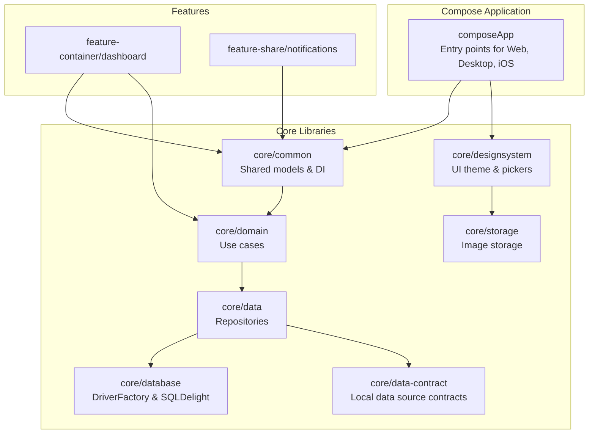
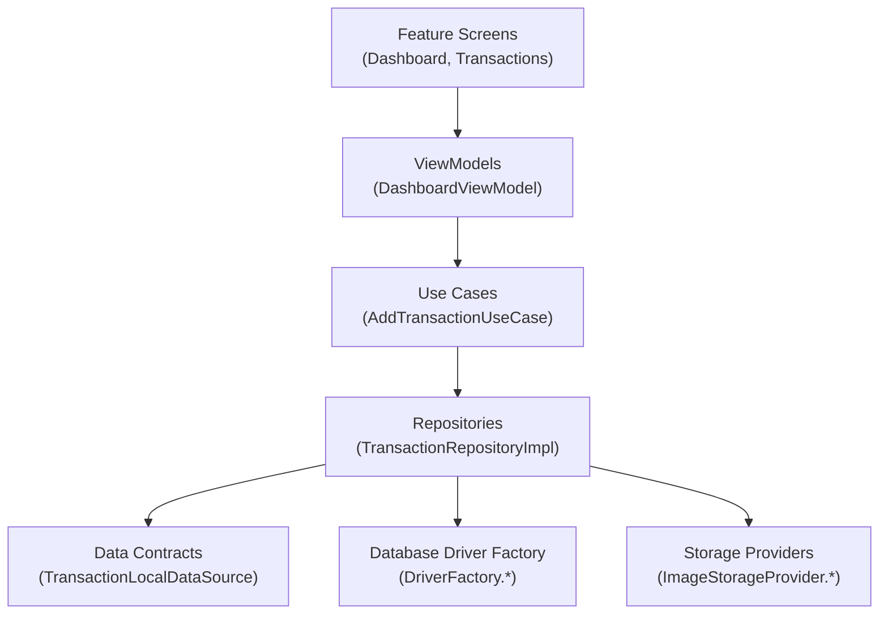
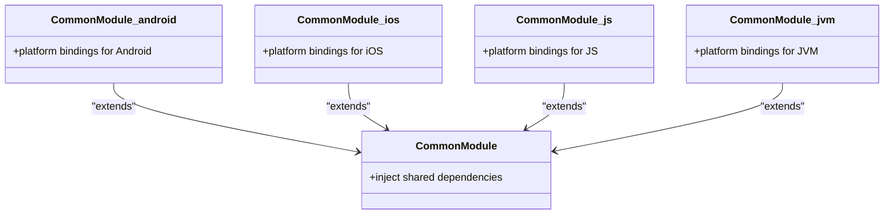
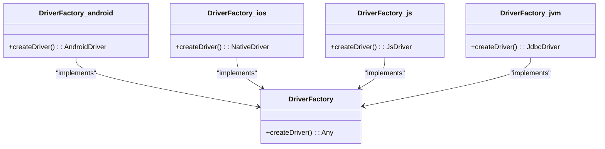
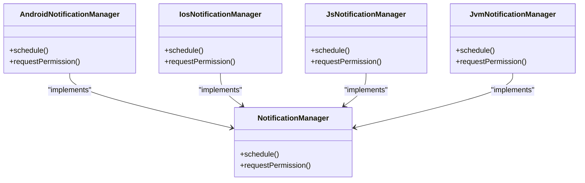
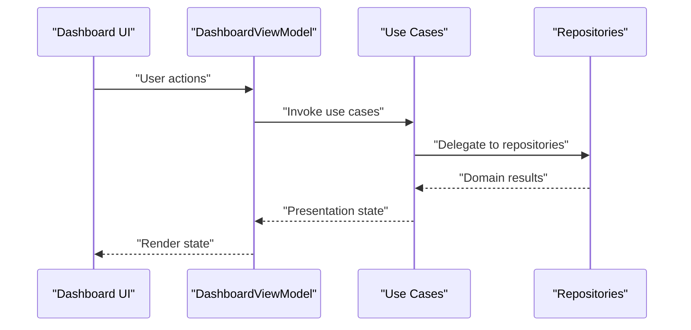
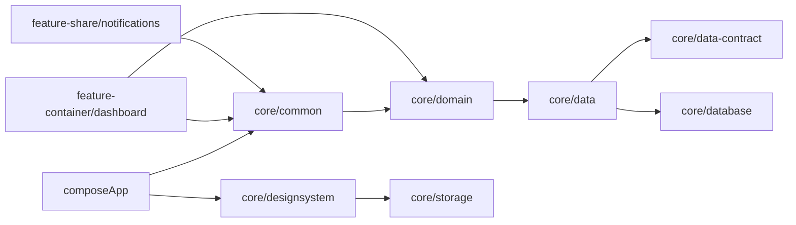

# Kotlin Multiplatform Design

<cite>
**Referenced Files in This Document**
- [settings.gradle.kts](file://settings.gradle.kts)
- [build.gradle.kts](file://build.gradle.kts)
- [composeApp/build.gradle.kts](file://composeApp/build.gradle.kts)
- [core/common/build.gradle.kts](file://core/common/build.gradle.kts)
- [core/data/build.gradle.kts](file://core/data/build.gradle.kts)
- [core/data-contract/build.gradle.kts](file://core/data-contract/build.gradle.kts)
- [core/database/build.gradle.kts](file://core/database/build.gradle.kts)
- [core/designsystem/build.gradle.kts](file://core/designsystem/build.gradle.kts)
- [core/domain/build.gradle.kts](file://core/domain/build.gradle.kts)
- [core/jalali/build.gradle.kts](file://core/jalali/build.gradle.kts)
- [core/money/build.gradle.kts](file://core/money/build.gradle.kts)
- [core/preferences/build.gradle.kts](file://core/preferences/build.gradle.kts)
- [core/storage/build.gradle.kts](file://core/storage/build.gradle.kts)
- [core/common/src/commonMain/kotlin/com/kazemieh/common/model/Budget.kt](file://core/common/src/commonMain/kotlin/com/kazemieh/common/model/Budget.kt)
- [core/common/src/commonMain/kotlin/com/kazemieh/common/model/Category.kt](file://core/common/src/commonMain/kotlin/com/kazemieh/common/model/Category.kt)
- [core/common/src/commonMain/kotlin/com/kazemieh/common/model/Transaction.kt](file://core/common/src/commonMain/kotlin/com/kazemieh/common/model/Transaction.kt)
- [core/common/src/commonMain/kotlin/com/kazemieh/common/persiandatetime/PersianDateConverterImpl.kt](file://core/common/src/commonMain/kotlin/com/kazemieh/common/persiandatetime/PersianDateConverterImpl.kt)
- [core/common/src/commonMain/kotlin/com/kazemieh/common/di/CommonModule.kt](file://core/common/src/commonMain/kotlin/com/kazemieh/common/di/CommonModule.kt)
- [core/common/src/androidMain/kotlin/com/kazemieh/common/di/CommonModule.android.kt](file://core/common/src/androidMain/kotlin/com/kazemieh/common/di/CommonModule.android.kt)
- [core/common/src/iosMain/kotlin/com/kazemieh/common/di/CommonModule.ios.kt](file://core/common/src/iosMain/kotlin/com/kazemieh/common/di/CommonModule.ios.kt)
- [core/common/src/jsMain/kotlin/com/kazemieh/common/di/CommonModule.js.kt](file://core/common/src/jsMain/kotlin/com/kazemieh/common/di/CommonModule.js.kt)
- [core/common/src/jvmMain/kotlin/com/kazemieh/common/di/CommonModule.jvm.kt](file://core/common/src/jvmMain/kotlin/com/kazemieh/common/di/CommonModule.jvm.kt)
- [core/database/src/commonMain/kotlin/com/kazemieh/database/DriverFactory.kt](file://core/database/src/commonMain/kotlin/com/kazemieh/database/DriverFactory.kt)
- [core/database/src/androidMain/kotlin/com/kazemieh/database/DriverFactory.android.kt](file://core/database/src/androidMain/kotlin/com/kazemieh/database/DriverFactory.android.kt)
- [core/database/src/iosMain/kotlin/com/kazemieh/database/DriverFactory.ios.kt](file://core/database/src/iosMain/kotlin/com/kazemieh/database/DriverFactory.ios.kt)
- [core/database/src/jsMain/kotlin/com/kazemieh/database/DriverFactory.js.kt](file://core/database/src/jsMain/kotlin/com/kazemieh/database/DriverFactory.js.kt)
- [core/database/src/jvmMain/kotlin/com/kazemieh/database/DriverFactory.jvm.kt](file://core/database/src/jvmMain/kotlin/com/kazemieh/database/DriverFactory.jvm.kt)
- [core/data/src/commonMain/kotlin/com/kazemieh/data/repository/TransactionRepositoryImpl.kt](file://core/data/src/commonMain/kotlin/com/kazemieh/data/repository/TransactionRepositoryImpl.kt)
- [core/data-contract/src/commonMain/kotlin/com/kazemieh/data_contract/datasource/TransactionLocalDataSource.kt](file://core/data-contract/src/commonMain/kotlin/com/kazemieh/data_contract/datasource/TransactionLocalDataSource.kt)
- [core/domain/src/commonMain/kotlin/com/kazemieh/domain/usecase/AddTransactionUseCase.kt](file://core/domain/src/commonMain/kotlin/com/kazemieh/domain/usecase/AddTransactionUseCase.kt)
- [core/designsystem/src/commonMain/kotlin/com/kazemieh/designsystem/CurrencyProvider.kt](file://core/designsystem/src/commonMain/kotlin/com/kazemieh/designsystem/CurrencyProvider.kt)
- [core/designsystem/src/commonMain/kotlin/com/kazemieh/designsystem/component/picker/ImagePicker.kt](file://core/designsystem/src/commonMain/kotlin/com/kazemieh/designsystem/component/picker/ImagePicker.kt)
- [core/designsystem/src/androidMain/kotlin/com/kazemieh/designsystem/component/picker/ImagePicker.android.kt](file://core/designsystem/src/androidMain/kotlin/com/kazemieh/designsystem/component/picker/ImagePicker.android.kt)
- [core/designsystem/src/iosMain/kotlin/com/kazemieh/designsystem/component/picker/ImagePicker.ios.kt](file://core/designsystem/src/iosMain/kotlin/com/kazemieh/designsystem/component/picker/ImagePicker.ios.kt)
- [core/designsystem/src/jsMain/kotlin/com/kazemieh/designsystem/component/picker/ImagePicker.js.kt](file://core/designsystem/src/jsMain/kotlin/com/kazemieh/designsystem/component/picker/ImagePicker.js.kt)
- [core/designsystem/src/jvmMain/kotlin/com/kazemieh/designsystem/component/picker/ImagePicker.jvm.kt](file://core/designsystem/src/jvmMain/kotlin/com/kazemieh/designsystem/component/picker/ImagePicker.jvm.kt)
- [core/storage/src/commonMain/kotlin/com/kazemieh/storage/ImageStorageProvider.kt](file://core/storage/src/commonMain/kotlin/com/kazemieh/storage/ImageStorageProvider.kt)
- [core/storage/src/commonMain/kotlin/com/kazemieh/storage/ImageStorageImpl.kt](file://core/storage/src/commonMain/kotlin/com/kazemieh/storage/ImageStorageImpl.kt)
- [core/storage/src/androidMain/kotlin/com/kazemieh/storage/ImageStorageProvider.android.kt](file://core/storage/src/androidMain/kotlin/com/kazemieh/storage/ImageStorageProvider.android.kt)
- [core/storage/src/iosMain/kotlin/com/kazemieh/storage/ImageStorageProvider.ios.kt](file://core/storage/src/iosMain/kotlin/com/kazemieh/storage/ImageStorageProvider.ios.kt)
- [core/storage/src/jsMain/kotlin/com/kazemieh/storage/ImageStorageProvider.js.kt](file://core/storage/src/jsMain/kotlin/com/kazemieh/storage/ImageStorageProvider.js.kt)
- [core/storage/src/jvmMain/kotlin/com/kazemieh/storage/ImageStorageProvider.jvm.kt](file://core/storage/src/jvmMain/kotlin/com/kazemieh/storage/ImageStorageProvider.jvm.kt)
- [feature-container/dashboard/src/commonMain/kotlin/com/kazemieh/dashboard/DashboardViewModel.kt](file://feature-container/dashboard/src/commonMain/kotlin/com/kazemieh/dashboard/DashboardViewModel.kt)
- [feature-share/notifications/src/commonMain/kotlin/com/kazemieh/notifications/NotificationManager.kt](file://feature-share/notifications/src/commonMain/kotlin/com/kazemieh/notifications/NotificationManager.kt)
- [feature-share/notifications/src/androidMain/kotlin/com/kazemieh/notifications/AndroidNotificationManager.kt](file://feature-share/notifications/src/androidMain/kotlin/com/kazemieh/notifications/AndroidNotificationManager.kt)
- [feature-share/notifications/src/iosMain/kotlin/com/kazemieh/notifications/IosNotificationManager.kt](file://feature-share/notifications/src/iosMain/kotlin/com/kazemieh/notifications/IosNotificationManager.kt)
- [feature-share/notifications/src/jsMain/kotlin/com/kazemieh/notifications/JsNotificationManager.kt](file://feature-share/notifications/src/jsMain/kotlin/com/kazemieh/notifications/JsNotificationManager.kt)
- [feature-share/notifications/src/jvmMain/kotlin/com/kazemieh/notifications/JvmNotificationManager.kt](file://feature-share/notifications/src/jvmMain/kotlin/com/kazemieh/notifications/JvmNotificationManager.kt)
- [composeApp/src/webMain/kotlin/main.kt](file://composeApp/src/webMain/kotlin/main.kt)
- [composeApp/src/jvmMain/kotlin/Main.kt](file://composeApp/src/jvmMain/kotlin/Main.kt)
- [composeApp/src/iosMain/kotlin/MainViewController.kt](file://composeApp/src/iosMain/kotlin/MainViewController.kt)
</cite>

## Table of Contents
1. [Introduction](#introduction)
2. [Project Structure](#project-structure)
3. [Core Components](#core-components)
4. [Architecture Overview](#architecture-overview)
5. [Detailed Component Analysis](#detailed-component-analysis)
6. [Dependency Analysis](#dependency-analysis)
7. [Performance Considerations](#performance-considerations)
8. [Troubleshooting Guide](#troubleshooting-guide)
9. [Conclusion](#conclusion)
10. [Appendices](#appendices)

## Introduction
This document explains the Kotlin Multiplatform architecture used in FinTrack. It focuses on how common business logic, models, and utilities are shared across Android, iOS, JVM (Desktop), and JS (Web) platforms via dedicated source sets. It also documents platform-specific implementations, conditional compilation patterns, expect/actual declarations, build configuration differences, and dependency management strategies. The goal is to provide a unified development experience while enabling platform-specific optimizations.

## Project Structure
FinTrack organizes its multiplatform modules into a set of libraries under the core directory and a Compose multiplatform application entry under composeApp. Each module defines:
- commonMain: Shared code across platforms
- androidMain, iosMain, jsMain, jvmMain: Platform-specific implementations

Key modules and their roles:
- core/common: Shared models, utilities, DI wiring, and platform-specific DI modules
- core/database: Database abstraction and driver factory with platform drivers
- core/data: Data repositories implementing use cases
- core/data-contract: Local data source contracts
- core/domain: Business logic use cases
- core/designsystem: UI theme, typography, colors, and platform-specific pickers
- core/storage: Image storage abstractions and providers
- feature-container/*: Feature screens and ViewModels
- feature-share/*: Cross-platform features like notifications and biometrics
- composeApp: Platform entry points for Web, Desktop, and iOS

**Diagram sources**
- [composeApp/build.gradle.kts](file://composeApp/build.gradle.kts)
- [core/common/build.gradle.kts](file://core/common/build.gradle.kts)
- [core/database/build.gradle.kts](file://core/database/build.gradle.kts)
- [core/data/build.gradle.kts](file://core/data/build.gradle.kts)
- [core/data-contract/build.gradle.kts](file://core/data-contract/build.gradle.kts)
- [core/domain/build.gradle.kts](file://core/domain/build.gradle.kts)
- [core/designsystem/build.gradle.kts](file://core/designsystem/build.gradle.kts)
- [core/storage/build.gradle.kts](file://core/storage/build.gradle.kts)
- [feature-container/dashboard/build.gradle.kts](file://feature-container/dashboard/build.gradle.kts)
- [feature-share/notifications/build.gradle.kts](file://feature-share/notifications/build.gradle.kts)

**Section sources**
- [settings.gradle.kts](file://settings.gradle.kts)
- [build.gradle.kts](file://build.gradle.kts)
- [composeApp/build.gradle.kts](file://composeApp/build.gradle.kts)
- [core/common/build.gradle.kts](file://core/common/build.gradle.kts)
- [core/database/build.gradle.kts](file://core/database/build.gradle.kts)
- [core/data/build.gradle.kts](file://core/data/build.gradle.kts)
- [core/data-contract/build.gradle.kts](file://core/data-contract/build.gradle.kts)
- [core/domain/build.gradle.kts](file://core/domain/build.gradle.kts)
- [core/designsystem/build.gradle.kts](file://core/designsystem/build.gradle.kts)
- [core/storage/build.gradle.kts](file://core/storage/build.gradle.kts)

## Core Components
This section describes how common code is structured and how platform-specific parts plug in.

- Shared models and utilities
  - Models such as Budget, Category, and Transaction live in commonMain and are consumed by all platforms.
  - Utilities like date/time conversion and parsing are centralized in common code.
  - Example paths:
    - [Budget.kt](file://core/common/src/commonMain/kotlin/com/kazemieh/common/model/Budget.kt)
    - [Category.kt](file://core/common/src/commonMain/kotlin/com/kazemieh/common/model/Category.kt)
    - [Transaction.kt](file://core/common/src/commonMain/kotlin/com/kazemieh/common/model/Transaction.kt)
    - [PersianDateConverterImpl.kt](file://core/common/src/commonMain/kotlin/com/kazemieh/common/persiandatetime/PersianDateConverterImpl.kt)

- Dependency Injection (DI)
  - A common DI module is defined in commonMain and extended per platform via platform-specific modules.
  - Example paths:
    - [CommonModule.kt](file://core/common/src/commonMain/kotlin/com/kazemieh/common/di/CommonModule.kt)
    - [CommonModule.android.kt](file://core/common/src/androidMain/kotlin/com/kazemieh/common/di/CommonModule.android.kt)
    - [CommonModule.ios.kt](file://core/common/src/iosMain/kotlin/com/kazemieh/common/di/CommonModule.ios.kt)
    - [CommonModule.js.kt](file://core/common/src/jsMain/kotlin/com/kazemieh/common/di/CommonModule.js.kt)
    - [CommonModule.jvm.kt](file://core/common/src/jvmMain/kotlin/com/kazemieh/common/di/CommonModule.jvm.kt)

- Database abstraction
  - A common DriverFactory exposes the database driver; platform-specific factories return platform-appropriate drivers.
  - Example paths:
    - [DriverFactory.kt](file://core/database/src/commonMain/kotlin/com/kazemieh/database/DriverFactory.kt)
    - [DriverFactory.android.kt](file://core/database/src/androidMain/kotlin/com/kazemieh/database/DriverFactory.android.kt)
    - [DriverFactory.ios.kt](file://core/database/src/iosMain/kotlin/com/kazemieh/database/DriverFactory.ios.kt)
    - [DriverFactory.js.kt](file://core/database/src/jsMain/kotlin/com/kazemieh/database/DriverFactory.js.kt)
    - [DriverFactory.jvm.kt](file://core/database/src/jvmMain/kotlin/com/kazemieh/database/DriverFactory.jvm.kt)

- Data layer
  - Repositories implement domain use cases and depend on local data source contracts.
  - Example paths:
    - [TransactionRepositoryImpl.kt](file://core/data/src/commonMain/kotlin/com/kazemieh/data/repository/TransactionRepositoryImpl.kt)
    - [TransactionLocalDataSource.kt](file://core/data-contract/src/commonMain/kotlin/com/kazemieh/data_contract/datasource/TransactionLocalDataSource.kt)

- Domain layer
  - Use cases encapsulate business logic and orchestrate repositories.
  - Example path:
    - [AddTransactionUseCase.kt](file://core/domain/src/commonMain/kotlin/com/kazemieh/domain/usecase/AddTransactionUseCase.kt)

- Design system
  - Theme, typography, colors, and currency provider are shared; platform-specific pickers are provided per platform.
  - Example paths:
    - [CurrencyProvider.kt](file://core/designsystem/src/commonMain/kotlin/com/kazemieh/designsystem/CurrencyProvider.kt)
    - [ImagePicker.kt](file://core/designsystem/src/commonMain/kotlin/com/kazemieh/designsystem/component/picker/ImagePicker.kt)
    - [ImagePicker.android.kt](file://core/designsystem/src/androidMain/kotlin/com/kazemieh/designsystem/component/picker/ImagePicker.android.kt)
    - [ImagePicker.ios.kt](file://core/designsystem/src/iosMain/kotlin/com/kazemieh/designsystem/component/picker/ImagePicker.ios.kt)
    - [ImagePicker.js.kt](file://core/designsystem/src/jsMain/kotlin/com/kazemieh/designsystem/component/picker/ImagePicker.js.kt)
    - [ImagePicker.jvm.kt](file://core/designsystem/src/jvmMain/kotlin/com/kazemieh/designsystem/component/picker/ImagePicker.jvm.kt)

- Storage
  - Image storage provider and implementation are shared; platform-specific providers supply platform APIs.
  - Example paths:
    - [ImageStorageProvider.kt](file://core/storage/src/commonMain/kotlin/com/kazemieh/storage/ImageStorageProvider.kt)
    - [ImageStorageImpl.kt](file://core/storage/src/commonMain/kotlin/com/kazemieh/storage/ImageStorageImpl.kt)
    - [ImageStorageProvider.android.kt](file://core/storage/src/androidMain/kotlin/com/kazemieh/storage/ImageStorageProvider.android.kt)
    - [ImageStorageProvider.ios.kt](file://core/storage/src/iosMain/kotlin/com/kazemieh/storage/ImageStorageProvider.ios.kt)
    - [ImageStorageProvider.js.kt](file://core/storage/src/jsMain/kotlin/com/kazemieh/storage/ImageStorageProvider.js.kt)
    - [ImageStorageProvider.jvm.kt](file://core/storage/src/jvmMain/kotlin/com/kazemieh/storage/ImageStorageProvider.jvm.kt)

- Notifications (cross-platform feature)
  - A common notification manager interface is implemented per platform.
  - Example paths:
    - [NotificationManager.kt](file://feature-share/notifications/src/commonMain/kotlin/com/kazemieh/notifications/NotificationManager.kt)
    - [AndroidNotificationManager.kt](file://feature-share/notifications/src/androidMain/kotlin/com/kazemieh/notifications/AndroidNotificationManager.kt)
    - [IosNotificationManager.kt](file://feature-share/notifications/src/iosMain/kotlin/com/kazemieh/notifications/IosNotificationManager.kt)
    - [JsNotificationManager.kt](file://feature-share/notifications/src/jsMain/kotlin/com/kazemieh/notifications/JsNotificationManager.kt)
    - [JvmNotificationManager.kt](file://feature-share/notifications/src/jvmMain/kotlin/com/kazemieh/notifications/JvmNotificationManager.kt)

**Section sources**
- [core/common/src/commonMain/kotlin/com/kazemieh/common/model/Budget.kt](file://core/common/src/commonMain/kotlin/com/kazemieh/common/model/Budget.kt)
- [core/common/src/commonMain/kotlin/com/kazemieh/common/model/Category.kt](file://core/common/src/commonMain/kotlin/com/kazemieh/common/model/Category.kt)
- [core/common/src/commonMain/kotlin/com/kazemieh/common/model/Transaction.kt](file://core/common/src/commonMain/kotlin/com/kazemieh/common/model/Transaction.kt)
- [core/common/src/commonMain/kotlin/com/kazemieh/common/persiandatetime/PersianDateConverterImpl.kt](file://core/common/src/commonMain/kotlin/com/kazemieh/common/persiandatetime/PersianDateConverterImpl.kt)
- [core/common/src/commonMain/kotlin/com/kazemieh/common/di/CommonModule.kt](file://core/common/src/commonMain/kotlin/com/kazemieh/common/di/CommonModule.kt)
- [core/common/src/androidMain/kotlin/com/kazemieh/common/di/CommonModule.android.kt](file://core/common/src/androidMain/kotlin/com/kazemieh/common/di/CommonModule.android.kt)
- [core/common/src/iosMain/kotlin/com/kazemieh/common/di/CommonModule.ios.kt](file://core/common/src/iosMain/kotlin/com/kazemieh/common/di/CommonModule.ios.kt)
- [core/common/src/jsMain/kotlin/com/kazemieh/common/di/CommonModule.js.kt](file://core/common/src/jsMain/kotlin/com/kazemieh/common/di/CommonModule.js.kt)
- [core/common/src/jvmMain/kotlin/com/kazemieh/common/di/CommonModule.jvm.kt](file://core/common/src/jvmMain/kotlin/com/kazemieh/common/di/CommonModule.jvm.kt)
- [core/database/src/commonMain/kotlin/com/kazemieh/database/DriverFactory.kt](file://core/database/src/commonMain/kotlin/com/kazemieh/database/DriverFactory.kt)
- [core/database/src/androidMain/kotlin/com/kazemieh/database/DriverFactory.android.kt](file://core/database/src/androidMain/kotlin/com/kazemieh/database/DriverFactory.android.kt)
- [core/database/src/iosMain/kotlin/com/kazemieh/database/DriverFactory.ios.kt](file://core/database/src/iosMain/kotlin/com/kazemieh/database/DriverFactory.ios.kt)
- [core/database/src/jsMain/kotlin/com/kazemieh/database/DriverFactory.js.kt](file://core/database/src/jsMain/kotlin/com/kazemieh/database/DriverFactory.js.kt)
- [core/database/src/jvmMain/kotlin/com/kazemieh/database/DriverFactory.jvm.kt](file://core/database/src/jvmMain/kotlin/com/kazemieh/database/DriverFactory.jvm.kt)
- [core/data/src/commonMain/kotlin/com/kazemieh/data/repository/TransactionRepositoryImpl.kt](file://core/data/src/commonMain/kotlin/com/kazemieh/data/repository/TransactionRepositoryImpl.kt)
- [core/data-contract/src/commonMain/kotlin/com/kazemieh/data_contract/datasource/TransactionLocalDataSource.kt](file://core/data-contract/src/commonMain/kotlin/com/kazemieh/data_contract/datasource/TransactionLocalDataSource.kt)
- [core/domain/src/commonMain/kotlin/com/kazemieh/domain/usecase/AddTransactionUseCase.kt](file://core/domain/src/commonMain/kotlin/com/kazemieh/domain/usecase/AddTransactionUseCase.kt)
- [core/designsystem/src/commonMain/kotlin/com/kazemieh/designsystem/CurrencyProvider.kt](file://core/designsystem/src/commonMain/kotlin/com/kazemieh/designsystem/CurrencyProvider.kt)
- [core/designsystem/src/commonMain/kotlin/com/kazemieh/designsystem/component/picker/ImagePicker.kt](file://core/designsystem/src/commonMain/kotlin/com/kazemieh/designsystem/component/picker/ImagePicker.kt)
- [core/designsystem/src/androidMain/kotlin/com/kazemieh/designsystem/component/picker/ImagePicker.android.kt](file://core/designsystem/src/androidMain/kotlin/com/kazemieh/designsystem/component/picker/ImagePicker.android.kt)
- [core/designsystem/src/iosMain/kotlin/com/kazemieh/designsystem/component/picker/ImagePicker.ios.kt](file://core/designsystem/src/iosMain/kotlin/com/kazemieh/designsystem/component/picker/ImagePicker.ios.kt)
- [core/designsystem/src/jsMain/kotlin/com/kazemieh/designsystem/component/picker/ImagePicker.js.kt](file://core/designsystem/src/jsMain/kotlin/com/kazemieh/designsystem/component/picker/ImagePicker.js.kt)
- [core/designsystem/src/jvmMain/kotlin/com/kazemieh/designsystem/component/picker/ImagePicker.jvm.kt](file://core/designsystem/src/jvmMain/kotlin/com/kazemieh/designsystem/component/picker/ImagePicker.jvm.kt)
- [core/storage/src/commonMain/kotlin/com/kazemieh/storage/ImageStorageProvider.kt](file://core/storage/src/commonMain/kotlin/com/kazemieh/storage/ImageStorageProvider.kt)
- [core/storage/src/commonMain/kotlin/com/kazemieh/storage/ImageStorageImpl.kt](file://core/storage/src/commonMain/kotlin/com/kazemieh/storage/ImageStorageImpl.kt)
- [core/storage/src/androidMain/kotlin/com/kazemieh/storage/ImageStorageProvider.android.kt](file://core/storage/src/androidMain/kotlin/com/kazemieh/storage/ImageStorageProvider.android.kt)
- [core/storage/src/iosMain/kotlin/com/kazemieh/storage/ImageStorageProvider.ios.kt](file://core/storage/src/iosMain/kotlin/com/kazemieh/storage/ImageStorageProvider.ios.kt)
- [core/storage/src/jsMain/kotlin/com/kazemieh/storage/ImageStorageProvider.js.kt](file://core/storage/src/jsMain/kotlin/com/kazemieh/storage/ImageStorageProvider.js.kt)
- [core/storage/src/jvmMain/kotlin/com/kazemieh/storage/ImageStorageProvider.jvm.kt](file://core/storage/src/jvmMain/kotlin/com/kazemieh/storage/ImageStorageProvider.jvm.kt)
- [feature-share/notifications/src/commonMain/kotlin/com/kazemieh/notifications/NotificationManager.kt](file://feature-share/notifications/src/commonMain/kotlin/com/kazemieh/notifications/NotificationManager.kt)
- [feature-share/notifications/src/androidMain/kotlin/com/kazemieh/notifications/AndroidNotificationManager.kt](file://feature-share/notifications/src/androidMain/kotlin/com/kazemieh/notifications/AndroidNotificationManager.kt)
- [feature-share/notifications/src/iosMain/kotlin/com/kazemieh/notifications/IosNotificationManager.kt](file://feature-share/notifications/src/iosMain/kotlin/com/kazemieh/notifications/IosNotificationManager.kt)
- [feature-share/notifications/src/jsMain/kotlin/com/kazemieh/notifications/JsNotificationManager.kt](file://feature-share/notifications/src/jsMain/kotlin/com/kazemieh/notifications/JsNotificationManager.kt)
- [feature-share/notifications/src/jvmMain/kotlin/com/kazemieh/notifications/JvmNotificationManager.kt](file://feature-share/notifications/src/jvmMain/kotlin/com/kazemieh/notifications/JvmNotificationManager.kt)

## Architecture Overview
The architecture follows a layered approach:
- Presentation layer: Features and screens (e.g., dashboard)
- Domain layer: Use cases orchestrating business logic
- Data layer: Repositories implementing use cases and delegating to local data sources
- Infrastructure layer: Database driver factory and storage providers
- Shared utilities: Models, converters, DI, and design system

**Diagram sources**
- [feature-container/dashboard/src/commonMain/kotlin/com/kazemieh/dashboard/DashboardViewModel.kt](file://feature-container/dashboard/src/commonMain/kotlin/com/kazemieh/dashboard/DashboardViewModel.kt)
- [core/domain/src/commonMain/kotlin/com/kazemieh/domain/usecase/AddTransactionUseCase.kt](file://core/domain/src/commonMain/kotlin/com/kazemieh/domain/usecase/AddTransactionUseCase.kt)
- [core/data/src/commonMain/kotlin/com/kazemieh/data/repository/TransactionRepositoryImpl.kt](file://core/data/src/commonMain/kotlin/com/kazemieh/data/repository/TransactionRepositoryImpl.kt)
- [core/data-contract/src/commonMain/kotlin/com/kazemieh/data_contract/datasource/TransactionLocalDataSource.kt](file://core/data-contract/src/commonMain/kotlin/com/kazemieh/data_contract/datasource/TransactionLocalDataSource.kt)
- [core/database/src/commonMain/kotlin/com/kazemieh/database/DriverFactory.kt](file://core/database/src/commonMain/kotlin/com/kazemieh/database/DriverFactory.kt)
- [core/storage/src/commonMain/kotlin/com/kazemieh/storage/ImageStorageProvider.kt](file://core/storage/src/commonMain/kotlin/com/kazemieh/storage/ImageStorageProvider.kt)

## Detailed Component Analysis

### Common DI Modules
The common DI module wires shared dependencies. Platform-specific modules add platform bindings.

**Diagram sources**
- [core/common/src/commonMain/kotlin/com/kazemieh/common/di/CommonModule.kt](file://core/common/src/commonMain/kotlin/com/kazemieh/common/di/CommonModule.kt)
- [core/common/src/androidMain/kotlin/com/kazemieh/common/di/CommonModule.android.kt](file://core/common/src/androidMain/kotlin/com/kazemieh/common/di/CommonModule.android.kt)
- [core/common/src/iosMain/kotlin/com/kazemieh/common/di/CommonModule.ios.kt](file://core/common/src/iosMain/kotlin/com/kazemieh/common/di/CommonModule.ios.kt)
- [core/common/src/jsMain/kotlin/com/kazemieh/common/di/CommonModule.js.kt](file://core/common/src/jsMain/kotlin/com/kazemieh/common/di/CommonModule.js.kt)
- [core/common/src/jvmMain/kotlin/com/kazemieh/common/di/CommonModule.jvm.kt](file://core/common/src/jvmMain/kotlin/com/kazemieh/common/di/CommonModule.jvm.kt)

**Section sources**
- [core/common/src/commonMain/kotlin/com/kazemieh/common/di/CommonModule.kt](file://core/common/src/commonMain/kotlin/com/kazemieh/common/di/CommonModule.kt)
- [core/common/src/androidMain/kotlin/com/kazemieh/common/di/CommonModule.android.kt](file://core/common/src/androidMain/kotlin/com/kazemieh/common/di/CommonModule.android.kt)
- [core/common/src/iosMain/kotlin/com/kazemieh/common/di/CommonModule.ios.kt](file://core/common/src/iosMain/kotlin/com/kazemieh/common/di/CommonModule.ios.kt)
- [core/common/src/jsMain/kotlin/com/kazemieh/common/di/CommonModule.js.kt](file://core/common/src/jsMain/kotlin/com/kazemieh/common/di/CommonModule.js.kt)
- [core/common/src/jvmMain/kotlin/com/kazemieh/common/di/CommonModule.jvm.kt](file://core/common/src/jvmMain/kotlin/com/kazemieh/common/di/CommonModule.jvm.kt)

### Database Driver Factory (Platform-Specific)
The common DriverFactory delegates to platform-specific factories.

**Diagram sources**
- [core/database/src/commonMain/kotlin/com/kazemieh/database/DriverFactory.kt](file://core/database/src/commonMain/kotlin/com/kazemieh/database/DriverFactory.kt)
- [core/database/src/androidMain/kotlin/com/kazemieh/database/DriverFactory.android.kt](file://core/database/src/androidMain/kotlin/com/kazemieh/database/DriverFactory.android.kt)
- [core/database/src/iosMain/kotlin/com/kazemieh/database/DriverFactory.ios.kt](file://core/database/src/iosMain/kotlin/com/kazemieh/database/DriverFactory.ios.kt)
- [core/database/src/jsMain/kotlin/com/kazemieh/database/DriverFactory.js.kt](file://core/database/src/jsMain/kotlin/com/kazemieh/database/DriverFactory.js.kt)
- [core/database/src/jvmMain/kotlin/com/kazemieh/database/DriverFactory.jvm.kt](file://core/database/src/jvmMain/kotlin/com/kazemieh/database/DriverFactory.jvm.kt)

**Section sources**
- [core/database/src/commonMain/kotlin/com/kazemieh/database/DriverFactory.kt](file://core/database/src/commonMain/kotlin/com/kazemieh/database/DriverFactory.kt)
- [core/database/src/androidMain/kotlin/com/kazemieh/database/DriverFactory.android.kt](file://core/database/src/androidMain/kotlin/com/kazemieh/database/DriverFactory.android.kt)
- [core/database/src/iosMain/kotlin/com/kazemieh/database/DriverFactory.ios.kt](file://core/database/src/iosMain/kotlin/com/kazemieh/database/DriverFactory.ios.kt)
- [core/database/src/jsMain/kotlin/com/kazemieh/database/DriverFactory.js.kt](file://core/database/src/jsMain/kotlin/com/kazemieh/database/DriverFactory.js.kt)
- [core/database/src/jvmMain/kotlin/com/kazemieh/database/DriverFactory.jvm.kt](file://core/database/src/jvmMain/kotlin/com/kazemieh/database/DriverFactory.jvm.kt)

### Notifications Manager (Cross-Platform)
A common notification manager interface is implemented per platform.

**Diagram sources**
- [feature-share/notifications/src/commonMain/kotlin/com/kazemieh/notifications/NotificationManager.kt](file://feature-share/notifications/src/commonMain/kotlin/com/kazemieh/notifications/NotificationManager.kt)
- [feature-share/notifications/src/androidMain/kotlin/com/kazemieh/notifications/AndroidNotificationManager.kt](file://feature-share/notifications/src/androidMain/kotlin/com/kazemieh/notifications/AndroidNotificationManager.kt)
- [feature-share/notifications/src/iosMain/kotlin/com/kazemieh/notifications/IosNotificationManager.kt](file://feature-share/notifications/src/iosMain/kotlin/com/kazemieh/notifications/IosNotificationManager.kt)
- [feature-share/notifications/src/jsMain/kotlin/com/kazemieh/notifications/JsNotificationManager.kt](file://feature-share/notifications/src/jsMain/kotlin/com/kazemieh/notifications/JsNotificationManager.kt)
- [feature-share/notifications/src/jvmMain/kotlin/com/kazemieh/notifications/JvmNotificationManager.kt](file://feature-share/notifications/src/jvmMain/kotlin/com/kazemieh/notifications/JvmNotificationManager.kt)

**Section sources**
- [feature-share/notifications/src/commonMain/kotlin/com/kazemieh/notifications/NotificationManager.kt](file://feature-share/notifications/src/commonMain/kotlin/com/kazemieh/notifications/NotificationManager.kt)
- [feature-share/notifications/src/androidMain/kotlin/com/kazemieh/notifications/AndroidNotificationManager.kt](file://feature-share/notifications/src/androidMain/kotlin/com/kazemieh/notifications/AndroidNotificationManager.kt)
- [feature-share/notifications/src/iosMain/kotlin/com/kazemieh/notifications/IosNotificationManager.kt](file://feature-share/notifications/src/iosMain/kotlin/com/kazemieh/notifications/IosNotificationManager.kt)
- [feature-share/notifications/src/jsMain/kotlin/com/kazemieh/notifications/JsNotificationManager.kt](file://feature-share/notifications/src/jsMain/kotlin/com/kazemieh/notifications/JsNotificationManager.kt)
- [feature-share/notifications/src/jvmMain/kotlin/com/kazemieh/notifications/JvmNotificationManager.kt](file://feature-share/notifications/src/jvmMain/kotlin/com/kazemieh/notifications/JvmNotificationManager.kt)

### Dashboard Feature ViewModel
The dashboard feature consumes shared domain use cases and models.

**Diagram sources**
- [feature-container/dashboard/src/commonMain/kotlin/com/kazemieh/dashboard/DashboardViewModel.kt](file://feature-container/dashboard/src/commonMain/kotlin/com/kazemieh/dashboard/DashboardViewModel.kt)
- [core/domain/src/commonMain/kotlin/com/kazemieh/domain/usecase/AddTransactionUseCase.kt](file://core/domain/src/commonMain/kotlin/com/kazemieh/domain/usecase/AddTransactionUseCase.kt)
- [core/data/src/commonMain/kotlin/com/kazemieh/data/repository/TransactionRepositoryImpl.kt](file://core/data/src/commonMain/kotlin/com/kazemieh/data/repository/TransactionRepositoryImpl.kt)

**Section sources**
- [feature-container/dashboard/src/commonMain/kotlin/com/kazemieh/dashboard/DashboardViewModel.kt](file://feature-container/dashboard/src/commonMain/kotlin/com/kazemieh/dashboard/DashboardViewModel.kt)
- [core/domain/src/commonMain/kotlin/com/kazemieh/domain/usecase/AddTransactionUseCase.kt](file://core/domain/src/commonMain/kotlin/com/kazemieh/domain/usecase/AddTransactionUseCase.kt)
- [core/data/src/commonMain/kotlin/com/kazemieh/data/repository/TransactionRepositoryImpl.kt](file://core/data/src/commonMain/kotlin/com/kazemieh/data/repository/TransactionRepositoryImpl.kt)

### Conditional Compilation and Expect/Actual Patterns
- Conditional compilation: Platform-specific source sets are selected automatically by the Kotlin compiler based on target configuration. The presence of androidMain, iosMain, jsMain, and jvmMain enables platform-specific builds without manual toggles.
- Expect/actual: While explicit expect/actual declarations are not visible in the referenced files, the pattern is evident in the multiplatform modules where common code declares interfaces and platform-specific modules provide implementations. This allows the common code to remain agnostic of platform details while still enabling platform-specific behavior.

[No sources needed since this section provides conceptual guidance]

## Dependency Analysis
This section maps how modules depend on each other and how platform-specific implementations integrate.

**Diagram sources**
- [composeApp/build.gradle.kts](file://composeApp/build.gradle.kts)
- [core/common/build.gradle.kts](file://core/common/build.gradle.kts)
- [core/domain/build.gradle.kts](file://core/domain/build.gradle.kts)
- [core/data/build.gradle.kts](file://core/data/build.gradle.kts)
- [core/data-contract/build.gradle.kts](file://core/data-contract/build.gradle.kts)
- [core/database/build.gradle.kts](file://core/database/build.gradle.kts)
- [core/designsystem/build.gradle.kts](file://core/designsystem/build.gradle.kts)
- [core/storage/build.gradle.kts](file://core/storage/build.gradle.kts)
- [feature-container/dashboard/build.gradle.kts](file://feature-container/dashboard/build.gradle.kts)
- [feature-share/notifications/build.gradle.kts](file://feature-share/notifications/build.gradle.kts)

**Section sources**
- [composeApp/build.gradle.kts](file://composeApp/build.gradle.kts)
- [core/common/build.gradle.kts](file://core/common/build.gradle.kts)
- [core/domain/build.gradle.kts](file://core/domain/build.gradle.kts)
- [core/data/build.gradle.kts](file://core/data/build.gradle.kts)
- [core/data-contract/build.gradle.kts](file://core/data-contract/build.gradle.kts)
- [core/database/build.gradle.kts](file://core/database/build.gradle.kts)
- [core/designsystem/build.gradle.kts](file://core/designsystem/build.gradle.kts)
- [core/storage/build.gradle.kts](file://core/storage/build.gradle.kts)
- [feature-container/dashboard/build.gradle.kts](file://feature-container/dashboard/build.gradle.kts)
- [feature-share/notifications/build.gradle.kts](file://feature-share/notifications/build.gradle.kts)

## Performance Considerations
- Minimize allocations in shared code paths by reusing immutable models and value types.
- Prefer lazy initialization for platform-specific singletons where appropriate.
- Keep platform-specific code small and focused to reduce overhead.
- Use coroutines and structured concurrency in shared code to avoid blocking threads.

[No sources needed since this section provides general guidance]

## Troubleshooting Guide
- Build failures due to missing platform dependencies: Ensure each platform’s source set compiles independently and that dependencies are declared per module.
- Conflicts in shared DI: Verify that platform-specific modules do not override the same bindings unintentionally.
- Database driver issues: Confirm that the correct DriverFactory implementation is selected for each platform target.
- Image picker inconsistencies: Validate that platform-specific pickers are wired correctly in the design system.

[No sources needed since this section provides general guidance]

## Conclusion
FinTrack’s Kotlin Multiplatform architecture achieves a unified codebase across Android, iOS, JVM (Desktop), and JS (Web) by organizing shared logic in commonMain and supplying platform-specific implementations in dedicated source sets. The layered design—presentation, domain, data, and infrastructure—enables clear separation of concerns and simplifies maintenance. By leveraging DI modules, database abstractions, and cross-platform features like notifications, the project maintains consistency while allowing platform-specific optimizations.

[No sources needed since this section summarizes without analyzing specific files]

## Appendices

### Platform Entry Points
- Web: [main.kt](file://composeApp/src/webMain/kotlin/main.kt)
- Desktop: [Main.kt](file://composeApp/src/jvmMain/kotlin/Main.kt)
- iOS: [MainViewController.kt](file://composeApp/src/iosMain/kotlin/MainViewController.kt)

**Section sources**
- [composeApp/src/webMain/kotlin/main.kt](file://composeApp/src/webMain/kotlin/main.kt)
- [composeApp/src/jvmMain/kotlin/Main.kt](file://composeApp/src/jvmMain/kotlin/Main.kt)
- [composeApp/src/iosMain/kotlin/MainViewController.kt](file://composeApp/src/iosMain/kotlin/MainViewController.kt)