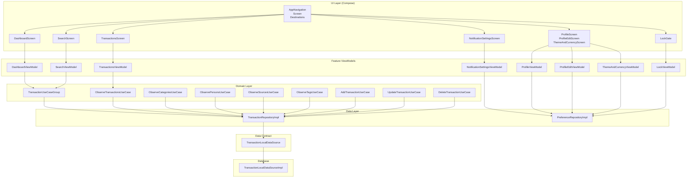
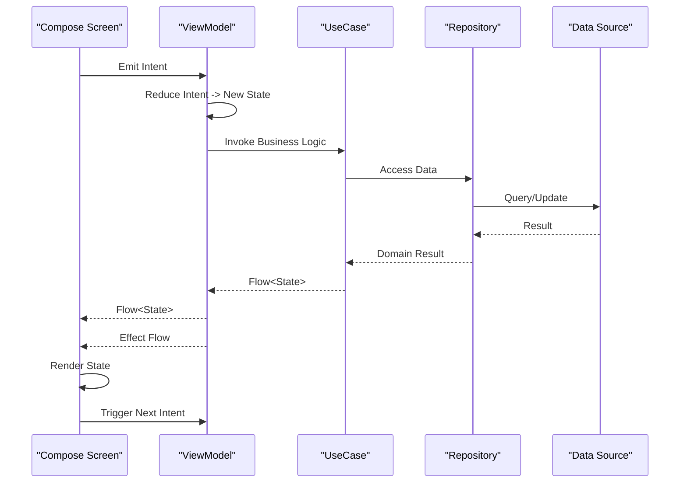
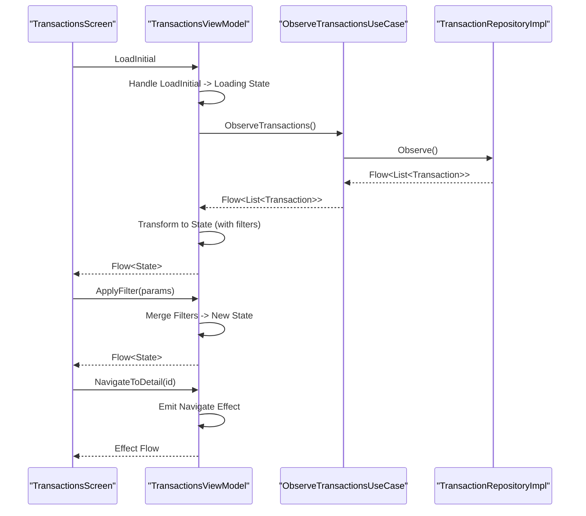
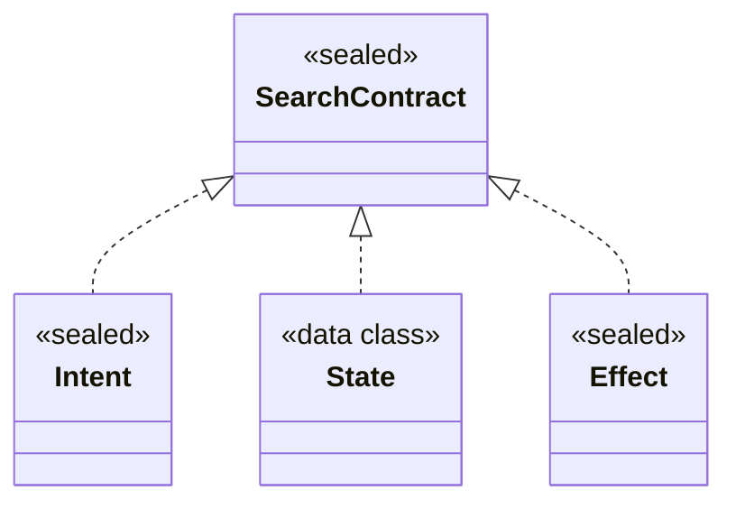
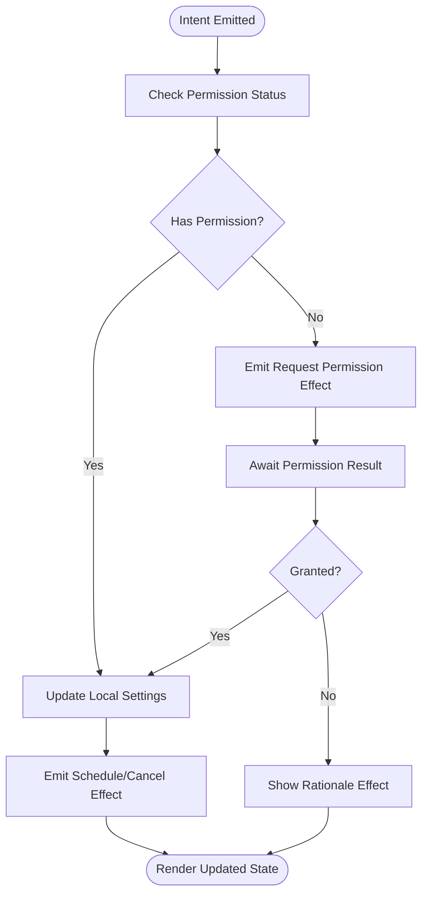
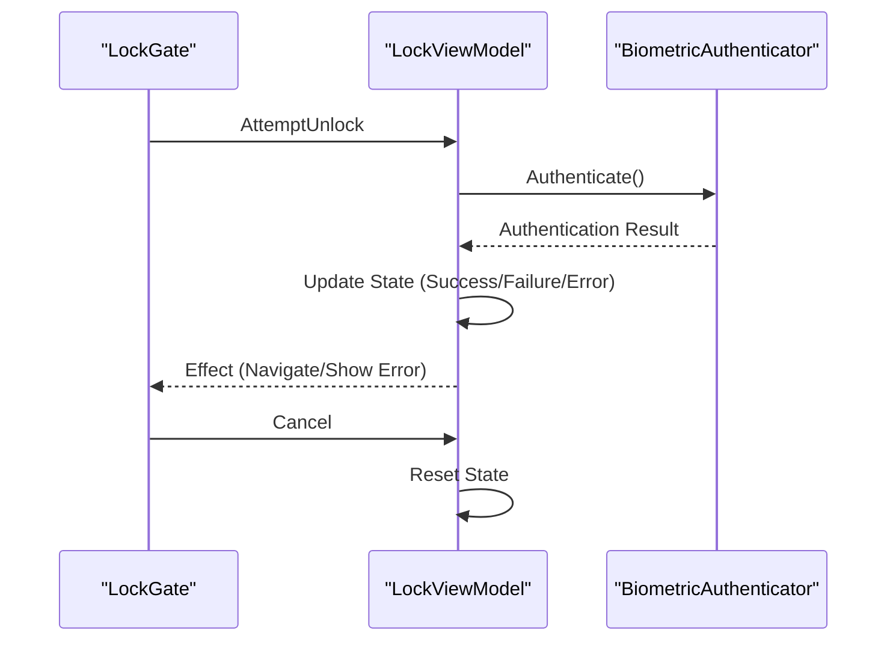
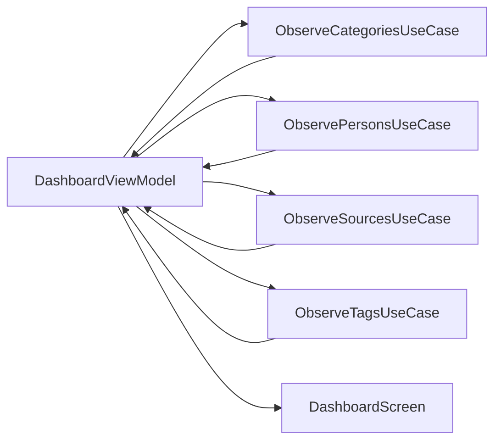
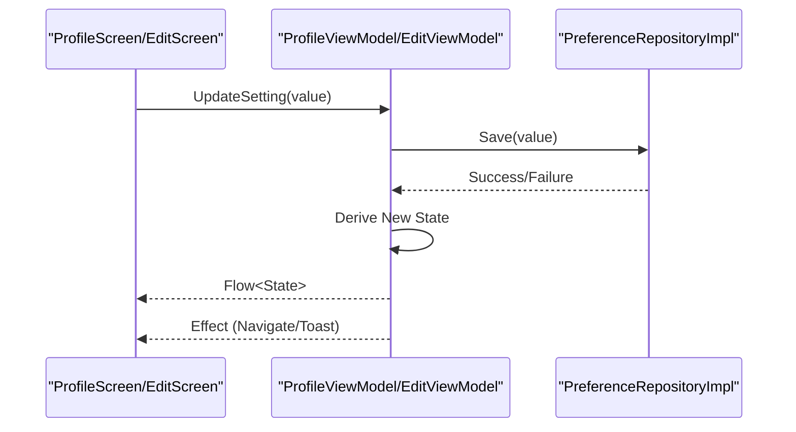
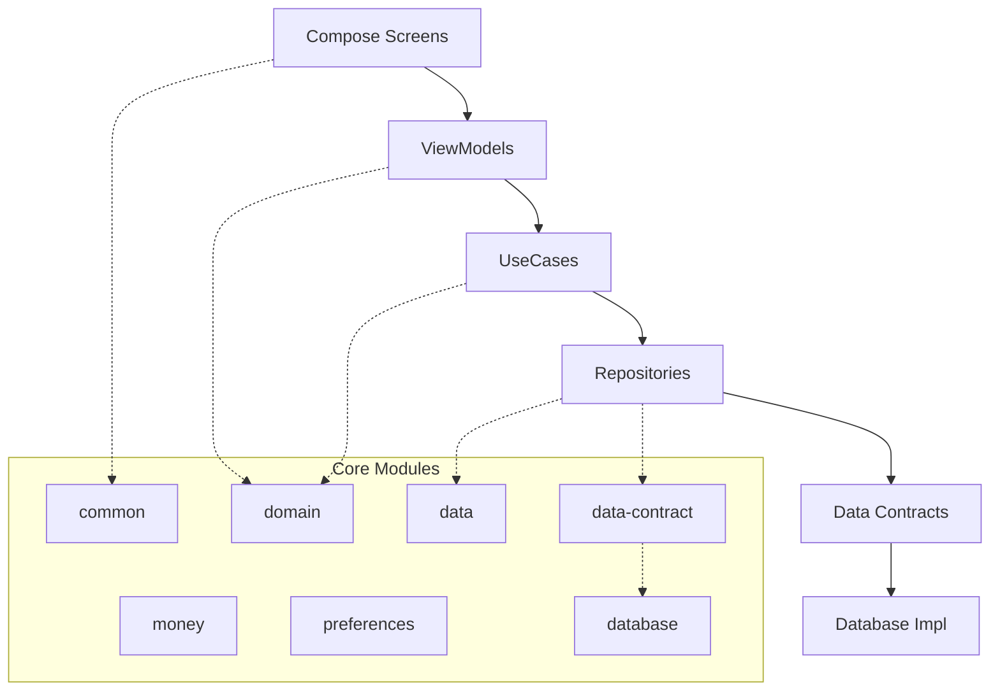

# MVVM with MVI Pattern

<cite>
**Referenced Files in This Document**
- [DashboardViewModel.kt](file://feature-container/dashboard/src/commonMain/kotlin/com/kazemieh/dashboard/DashboardViewModel.kt)
- [OnboardingViewModel.kt](file://feature-container/onboarding/src/commonMain/kotlin/com/kazemieh/onboarding/ui/OnboardingViewModel.kt)
- [TransactionsViewModel.kt](file://feature-container/transactions/src/commonMain/kotlin/com/kazemieh/transactions/TransactionsViewModel.kt)
- [ProfileViewModel.kt](file://feature-container/profile/src/commonMain/kotlin/com/kazemieh/profile/ProfileViewModel.kt)
- [ProfileEditViewModel.kt](file://feature-container/profile/src/commonMain/kotlin/com/kazemieh/profile/ProfileEditViewModel.kt)
- [ThemeAndCurrencyViewModel.kt](file://feature-container/profile/src/commonMain/kotlin/com/kazemieh/profile/ThemeAndCurrencyViewModel.kt)
- [SearchViewModel.kt](file://feature-share/search/src/commonMain/kotlin/com/kazemieh/search/ui/SearchViewModel.kt)
- [SearchContract.kt](file://feature-share/search/src/commonMain/kotlin/com/kazemieh/search/ui/SearchContract.kt)
- [NotificationSettingsViewModel.kt](file://feature-share/notifications/src/commonMain/kotlin/com/kazemieh/notifications/ui/NotificationSettingsViewModel.kt)
- [NotificationSettingsIntent.kt](file://feature-share/notifications/src/commonMain/kotlin/com/kazemieh/notifications/ui/NotificationSettingsIntent.kt)
- [NotificationSettingsState.kt](file://feature-share/notifications/src/commonMain/kotlin/com/kazemieh/notifications/ui/NotificationSettingsState.kt)
- [LockViewModel.kt](file://feature-share/lock/src/commonMain/kotlin/com/kazemieh/lock/LockViewModel.kt)
- [LockContract.kt](file://feature-share/lock/src/commonMain/kotlin/com/kazemieh/lock/LockContract.kt)
- [TransactionsScreen.kt](file://feature-container/transactions/src/commonMain/kotlin/com/kazemieh/transactions/TransactionsScreen.kt)
- [SearchScreen.kt](file://feature-share/search/src/commonMain/kotlin/com/kazemieh/search/ui/SearchScreen.kt)
- [NotificationSettingsScreen.kt](file://feature-share/notifications/src/commonMain/kotlin/com/kazemieh/notifications/ui/NotificationSettingsScreen.kt)
- [ProfileScreen.kt](file://feature-container/profile/src/commonMain/kotlin/com/kazemieh/profile/ProfileScreen.kt)
- [ProfileEditScreen.kt](file://feature-container/profile/src/commonMain/kotlin/com/kazemieh/profile/ProfileEditScreen.kt)
- [ThemeAndCurrencyScreen.kt](file://feature-container/profile/src/commonMain/kotlin/com/kazemieh/profile/ThemeAndCurrencyScreen.kt)
- [LockGate.kt](file://feature-share/lock/src/commonMain/kotlin/com/kazemieh/lock/LockGate.kt)
- [FinTrackApplication.kt](file://app/src/main/java/com/kazemieh/fintrack/FinTrackApplication.kt)
- [MainActivity.kt](file://app/src/main/java/com/kazemieh/fintrack/MainActivity.kt)
- [App.kt](file://composeApp/src/commonMain/kotlin/com/kazemieh/composeApp/App.kt)
- [FinTrackHost.kt](file://composeApp/src/commonMain/kotlin/com/kazemieh/composeApp/FinTrackHost.kt)
- [AppNavigation.kt](file://composeApp/src/commonMain/kotlin/com/kazemieh/composeApp/navigation/AppNavigation.kt)
- [Screen.kt](file://composeApp/src/commonMain/kotlin/com/kazemieh/composeApp/navigation/Screen.kt)
- [Destinations.kt](file://composeApp/src/commonMain/kotlin/com/kazemieh/composeApp/navigation/Destinations.kt)
- [BottombarNavigation.kt](file://composeApp/src/commonMain/kotlin/com/kazemieh/composeApp/navigation/navigationBar/BottombarNavigation.kt)
- [FintrackNavigationBar.kt](file://composeApp/src/commonMain/kotlin/com/kazemieh/composeApp/navigation/navigationBar/FintrackNavigationBar.kt)
- [DomainModule.kt](file://core/domain/src/commonMain/kotlin/com/kazemieh/domain/di/DomainModule.kt)
- [DataModule.kt](file://core/data/src/commonMain/kotlin/com/kazemieh/data/di/DataModule.kt)
- [DatabaseModule.kt](file://core/database/src/commonMain/kotlin/com/kazemieh/database/di/DatabaseModule.kt)
- [CommonModule.kt](file://core/common/src/commonMain/kotlin/com/kazemieh/common/di/CommonModule.kt)
- [TransactionUseCaseGroup.kt](file://core/domain/src/commonMain/kotlin/com/kazemieh/domain/usecase/TransactionUseCaseGroup.kt)
- [ObserveTransactionsUseCase.kt](file://core/domain/src/commonMain/kotlin/com/kazemieh/domain/usecase/ObserveTransactionsUseCase.kt)
- [ObserveCategoriesUseCase.kt](file://core/domain/src/commonMain/kotlin/com/kazemieh/domain/usecase/ObserveCategoriesUseCase.kt)
- [ObservePersonsUseCase.kt](file://core/domain/src/commonMain/kotlin/com/kazemieh/domain/usecase/ObservePersonsUseCase.kt)
- [ObserveSourcesUseCase.kt](file://core/domain/src/commonMain/kotlin/com/kazemieh/domain/usecase/ObserveSourcesUseCase.kt)
- [ObserveTagsUseCase.kt](file://core/domain/src/commonMain/kotlin/com/kazemieh/domain/usecase/ObserveTagsUseCase.kt)
- [AddTransactionUseCase.kt](file://core/domain/src/commonMain/kotlin/com/kazemieh/domain/usecase/AddTransactionUseCase.kt)
- [UpdateTransactionUseCase.kt](file://core/domain/src/commonMain/kotlin/com/kazemieh/domain/usecase/UpdateTransactionUseCase.kt)
- [DeleteTransactionUseCase.kt](file://core/domain/src/commonMain/kotlin/com/kazemieh/domain/usecase/DeleteTransactionUseCase.kt)
- [TransactionRepository.kt](file://core/domain/src/commonMain/kotlin/com/kazemieh/domain/repository/TransactionRepository.kt)
- [TransactionRepositoryImpl.kt](file://core/data/src/commonMain/kotlin/com/kazemieh/data/repository/TransactionRepositoryImpl.kt)
- [TransactionLocalDataSource.kt](file://core/data-contract/src/commonMain/kotlin/com/kazemieh/data_contract/datasource/TransactionLocalDataSource.kt)
- [TransactionLocalDataSourceImpl.kt](file://core/database/src/commonMain/kotlin/com/kazemieh/database/datasource/TransactionLocalDataSourceImpl.kt)
- [Transaction.kt](file://core/common/src/commonMain/kotlin/com/kazemieh/common/model/Transaction.kt)
- [Category.kt](file://core/common/src/commonMain/kotlin/com/kazemieh/common/model/Category.kt)
- [Person.kt](file://core/common/src/commonMain/kotlin/com/kazemieh/common/model/Person.kt)
- [Source.kt](file://core/common/src/commonMain/kotlin/com/kazemieh/common/model/Source.kt)
- [Tag.kt](file://core/common/src/commonMain/kotlin/com/kazemieh/common/model/Tag.kt)
- [TransactionWithRelations.kt](file://core/common/src/commonMain/kotlin/com/kazemieh/common/model/TransactionWithRelations.kt)
- [TransactionFilterParams.kt](file://core/common/src/commonMain/kotlin/com/kazemieh/common/model/TransactionFilterParams.kt)
- [PageRequest.kt](file://core/common/src/commonMain/kotlin/com/kazemieh/common/model/PageRequest.kt)
- [DateFilterHelper.kt](file://core/common/src/commonMain/kotlin/com/kazemieh/common/DateFilterHelper.kt)
- [Ext.kt](file://core/common/src/commonMain/kotlin/com/kazemieh/common/Ext.kt)
- [Log.kt](file://core/common/src/commonMain/kotlin/com/kazemieh/common/Log.kt)
- [ImageStorage.kt](file://core/common/src/commonMain/kotlin/com/kazemieh/common/ImageStorage.kt)
- [MoneyFormatter.kt](file://core/money/src/commonMain/kotlin/com/kazemieh/money/MoneyFormatter.kt)
- [Currency.kt](file://core/money/src/commonMain/kotlin/com/kazemieh/money/Currency.kt)
- [FinTrackPreferences.kt](file://core/preferences/src/commonMain/kotlin/com/kazemieh/preferences/FinTrackPreferences.kt)
- [SettingsObserver.kt](file://core/preferences/src/commonMain/kotlin/com/kazemieh/preferences/SettingsObserver.kt)
- [PreferenceRepository.kt](file://core/domain/src/commonMain/kotlin/com/kazemieh/domain/repository/PreferenceRepository.kt)
- [PreferenceRepositoryImpl.kt](file://core/data/src/commonMain/kotlin/com/kazemieh/data/repository/PreferenceRepositoryImpl.kt)
- [PreferenceUseCases.kt](file://core/domain/src/commonMain/kotlin/com/kazemieh/domain/usecase/PreferenceUseCases.kt)
- [BalanceImpact.kt](file://core/domain/src/commonMain/kotlin/com/kazemieh/domain/util/balanceImpact.kt)
</cite>

## Table of Contents
1. [Introduction](#introduction)
2. [Project Structure](#project-structure)
3. [Core Components](#core-components)
4. [Architecture Overview](#architecture-overview)
5. [Detailed Component Analysis](#detailed-component-analysis)
6. [Dependency Analysis](#dependency-analysis)
7. [Performance Considerations](#performance-considerations)
8. [Troubleshooting Guide](#troubleshooting-guide)
9. [Conclusion](#conclusion)

## Introduction
This document explains how FinTrack implements MVVM with the Model-View-Intent (MVI) pattern across its Compose-based features. It focuses on how ViewModels manage UI state through immutable intents, how state flows from UseCases to ViewModels to UI components, and how side effects are handled reactively. The pattern emphasizes:
- Intent-driven architecture: user actions become intents processed by reducers to update state
- Immutable state derivation: state updates are pure transformations of previous state
- Reactive effects: side effects are modeled as flows and executed in a controlled manner
- Testability and predictability: deterministic state transitions and isolated effects
- Separation of concerns: clear boundaries between UI, state, business logic, and data

## Project Structure
FinTrack organizes features by capability (features) and shared cross-cutting concerns (core). The UI layer uses Jetpack Compose with a navigation host. ViewModels live alongside screens in feature modules, and business logic is encapsulated in UseCases within the domain module. Data access is abstracted via repositories and local data sources.

**Diagram sources**
- [AppNavigation.kt](file://composeApp/src/commonMain/kotlin/com/kazemieh/composeApp/navigation/AppNavigation.kt)
- [Screen.kt](file://composeApp/src/commonMain/kotlin/com/kazemieh/composeApp/navigation/Screen.kt)
- [DashboardViewModel.kt](file://feature-container/dashboard/src/commonMain/kotlin/com/kazemieh/dashboard/DashboardViewModel.kt)
- [TransactionsViewModel.kt](file://feature-container/transactions/src/commonMain/kotlin/com/kazemieh/transactions/TransactionsViewModel.kt)
- [SearchViewModel.kt](file://feature-share/search/src/commonMain/kotlin/com/kazemieh/search/ui/SearchViewModel.kt)
- [NotificationSettingsViewModel.kt](file://feature-share/notifications/src/commonMain/kotlin/com/kazemieh/notifications/ui/NotificationSettingsViewModel.kt)
- [ProfileViewModel.kt](file://feature-container/profile/src/commonMain/kotlin/com/kazemieh/profile/ProfileViewModel.kt)
- [ProfileEditViewModel.kt](file://feature-container/profile/src/commonMain/kotlin/com/kazemieh/profile/ProfileEditViewModel.kt)
- [ThemeAndCurrencyViewModel.kt](file://feature-container/profile/src/commonMain/kotlin/com/kazemieh/profile/ThemeAndCurrencyViewModel.kt)
- [LockViewModel.kt](file://feature-share/lock/src/commonMain/kotlin/com/kazemieh/lock/LockViewModel.kt)
- [TransactionUseCaseGroup.kt](file://core/domain/src/commonMain/kotlin/com/kazemieh/domain/usecase/TransactionUseCaseGroup.kt)
- [ObserveTransactionsUseCase.kt](file://core/domain/src/commonMain/kotlin/com/kazemieh/domain/usecase/ObserveTransactionsUseCase.kt)
- [TransactionRepositoryImpl.kt](file://core/data/src/commonMain/kotlin/com/kazemieh/data/repository/TransactionRepositoryImpl.kt)
- [TransactionLocalDataSource.kt](file://core/data-contract/src/commonMain/kotlin/com/kazemieh/data_contract/datasource/TransactionLocalDataSource.kt)
- [TransactionLocalDataSourceImpl.kt](file://core/database/src/commonMain/kotlin/com/kazemieh/database/datasource/TransactionLocalDataSourceImpl.kt)

**Section sources**
- [AppNavigation.kt](file://composeApp/src/commonMain/kotlin/com/kazemieh/composeApp/navigation/AppNavigation.kt)
- [Screen.kt](file://composeApp/src/commonMain/kotlin/com/kazemieh/composeApp/navigation/Screen.kt)
- [FinTrackHost.kt](file://composeApp/src/commonMain/kotlin/com/kazemieh/composeApp/FinTrackHost.kt)

## Core Components
- ViewModels: Manage UI state and intents per screen, derive state from UseCases, and expose effects as flows.
- Contracts: Define Intent, State, and SideEffect types for each screen, ensuring type safety and clear boundaries.
- UseCases: Encapsulate business logic and return reactive streams (Flow) for observation.
- Repositories and Data Sources: Abstract persistence and provide typed access to domain entities.
- Navigation and Screens: Compose UI components that render state and emit intents to ViewModels.

Key patterns demonstrated:
- Intent-driven updates: Intents are sealed classes or enums that describe user actions or system events.
- Reducers: Pure functions that transform previous state into new state based on intents.
- Effects: Side effects are modeled as sealed classes and executed reactively after state updates.
- Reactive state: State is derived from UseCases and exposed as Flow<State>, consumed by Compose UI.

**Section sources**
- [SearchContract.kt](file://feature-share/search/src/commonMain/kotlin/com/kazemieh/search/ui/SearchContract.kt)
- [NotificationSettingsIntent.kt](file://feature-share/notifications/src/commonMain/kotlin/com/kazemieh/notifications/ui/NotificationSettingsIntent.kt)
- [NotificationSettingsState.kt](file://feature-share/notifications/src/commonMain/kotlin/com/kazemieh/notifications/ui/NotificationSettingsState.kt)
- [LockContract.kt](file://feature-share/lock/src/commonMain/kotlin/com/kazemieh/lock/LockContract.kt)

## Architecture Overview
The MVVM with MVI architecture in FinTrack follows a unidirectional data flow:
- UI emits intents based on user interactions or lifecycle events.
- ViewModel processes intents through reducer-like logic to compute new state.
- ViewModel exposes state as a Flow and side effects as a Flow.
- UI observes state and renders accordingly; effects are executed reactively.

**Diagram sources**
- [TransactionsViewModel.kt](file://feature-container/transactions/src/commonMain/kotlin/com/kazemieh/transactions/TransactionsViewModel.kt)
- [ObserveTransactionsUseCase.kt](file://core/domain/src/commonMain/kotlin/com/kazemieh/domain/usecase/ObserveTransactionsUseCase.kt)
- [TransactionRepositoryImpl.kt](file://core/data/src/commonMain/kotlin/com/kazemieh/data/repository/TransactionRepositoryImpl.kt)
- [TransactionLocalDataSourceImpl.kt](file://core/database/src/commonMain/kotlin/com/kazemieh/database/datasource/TransactionLocalDataSourceImpl.kt)

## Detailed Component Analysis

### Transactions Feature (MVI Example)
The Transactions feature exemplifies intent-driven state management:
- Intents: Filter transactions, load more, navigate, and handle UI actions.
- State: Includes transaction list, filters, loading indicators, and error handling.
- Effects: Navigation commands, snackbar messages, and analytics triggers.
- UseCases: Observe transactions, apply filters, and manage pagination.

**Diagram sources**
- [TransactionsScreen.kt](file://feature-container/transactions/src/commonMain/kotlin/com/kazemieh/transactions/TransactionsScreen.kt)
- [TransactionsViewModel.kt](file://feature-container/transactions/src/commonMain/kotlin/com/kazemieh/transactions/TransactionsViewModel.kt)
- [ObserveTransactionsUseCase.kt](file://core/domain/src/commonMain/kotlin/com/kazemieh/domain/usecase/ObserveTransactionsUseCase.kt)
- [TransactionRepositoryImpl.kt](file://core/data/src/commonMain/kotlin/com/kazemieh/data/repository/TransactionRepositoryImpl.kt)

**Section sources**
- [TransactionsViewModel.kt](file://feature-container/transactions/src/commonMain/kotlin/com/kazemieh/transactions/TransactionsViewModel.kt)
- [TransactionsScreen.kt](file://feature-container/transactions/src/commonMain/kotlin/com/kazemieh/transactions/TransactionsScreen.kt)
- [ObserveTransactionsUseCase.kt](file://core/domain/src/commonMain/kotlin/com/kazemieh/domain/usecase/ObserveTransactionsUseCase.kt)
- [TransactionUseCaseGroup.kt](file://core/domain/src/commonMain/kotlin/com/kazemieh/domain/usecase/TransactionUseCaseGroup.kt)

### Search Feature (Contracts and Intent-Driven Updates)
The Search feature demonstrates contract-based MVI:
- Contract defines Intent, State, and Effect types for type-safe updates.
- ViewModel handles search queries, debounced input, and navigation to results.
- Effects include navigating to a dedicated results screen and emitting analytics.

**Diagram sources**
- [SearchContract.kt](file://feature-share/search/src/commonMain/kotlin/com/kazemieh/search/ui/SearchContract.kt)

**Section sources**
- [SearchViewModel.kt](file://feature-share/search/src/commonMain/kotlin/com/kazemieh/search/ui/SearchViewModel.kt)
- [SearchContract.kt](file://feature-share/search/src/commonMain/kotlin/com/kazemieh/search/ui/SearchContract.kt)
- [SearchScreen.kt](file://feature-share/search/src/commonMain/kotlin/com/kazemieh/search/ui/SearchScreen.kt)

### Notifications Feature (Effects and Permissions)
The Notifications feature showcases reactive effects and permission handling:
- Intent: Toggle notification settings, request permissions, and handle system changes.
- State: Tracks current settings, permission status, and error conditions.
- Effects: Launch permission requests, show rationale dialogs, and schedule notifications.

**Diagram sources**
- [NotificationSettingsViewModel.kt](file://feature-share/notifications/src/commonMain/kotlin/com/kazemieh/notifications/ui/NotificationSettingsViewModel.kt)
- [NotificationSettingsIntent.kt](file://feature-share/notifications/src/commonMain/kotlin/com/kazemieh/notifications/ui/NotificationSettingsIntent.kt)
- [NotificationSettingsState.kt](file://feature-share/notifications/src/commonMain/kotlin/com/kazemieh/notifications/ui/NotificationSettingsState.kt)

**Section sources**
- [NotificationSettingsViewModel.kt](file://feature-share/notifications/src/commonMain/kotlin/com/kazemieh/notifications/ui/NotificationSettingsViewModel.kt)
- [NotificationSettingsIntent.kt](file://feature-share/notifications/src/commonMain/kotlin/com/kazemieh/notifications/ui/NotificationSettingsIntent.kt)
- [NotificationSettingsState.kt](file://feature-share/notifications/src/commonMain/kotlin/com/kazemieh/notifications/ui/NotificationSettingsState.kt)

### Lock Feature (Security Gate with Effects)
The Lock feature implements a security gate with biometric/PIN flows:
- Contract defines intents for authentication attempts and cancellation.
- ViewModel orchestrates authentication, emits effects for biometric prompts, and navigates on success.
- Effects include showing biometric prompts and navigating to unlock destination.

**Diagram sources**
- [LockGate.kt](file://feature-share/lock/src/commonMain/kotlin/com/kazemieh/lock/LockGate.kt)
- [LockViewModel.kt](file://feature-share/lock/src/commonMain/kotlin/com/kazemieh/lock/LockViewModel.kt)
- [LockContract.kt](file://feature-share/lock/src/commonMain/kotlin/com/kazemieh/lock/LockContract.kt)

**Section sources**
- [LockViewModel.kt](file://feature-share/lock/src/commonMain/kotlin/com/kazemieh/lock/LockViewModel.kt)
- [LockContract.kt](file://feature-share/lock/src/commonMain/kotlin/com/kazemieh/lock/LockContract.kt)
- [LockGate.kt](file://feature-share/lock/src/commonMain/kotlin/com/kazemieh/lock/LockGate.kt)

### Dashboard Feature (Observation and Composition)
The Dashboard feature composes multiple observations:
- Uses multiple UseCases to observe categories, persons, sources, and tags.
- Aggregates state and exposes combined Flow<State>.
- Emits navigation and analytics effects based on user interactions.

**Diagram sources**
- [DashboardViewModel.kt](file://feature-container/dashboard/src/commonMain/kotlin/com/kazemieh/dashboard/DashboardViewModel.kt)
- [ObserveCategoriesUseCase.kt](file://core/domain/src/commonMain/kotlin/com/kazemieh/domain/usecase/ObserveCategoriesUseCase.kt)
- [ObservePersonsUseCase.kt](file://core/domain/src/commonMain/kotlin/com/kazemieh/domain/usecase/ObservePersonsUseCase.kt)
- [ObserveSourcesUseCase.kt](file://core/domain/src/commonMain/kotlin/com/kazemieh/domain/usecase/ObserveSourcesUseCase.kt)
- [ObserveTagsUseCase.kt](file://core/domain/src/commonMain/kotlin/com/kazemieh/domain/usecase/ObserveTagsUseCase.kt)

**Section sources**
- [DashboardViewModel.kt](file://feature-container/dashboard/src/commonMain/kotlin/com/kazemieh/dashboard/DashboardViewModel.kt)

### Profile Features (Settings and Edit)
Profile features demonstrate settings management and edit flows:
- ProfileViewModel and ProfileEditViewModel manage theme/currency and user profile edits.
- Effects include saving preferences, navigating between screens, and showing success/error states.
- State includes current settings, form validity, and loading indicators.

**Diagram sources**
- [ProfileViewModel.kt](file://feature-container/profile/src/commonMain/kotlin/com/kazemieh/profile/ProfileViewModel.kt)
- [ProfileEditViewModel.kt](file://feature-container/profile/src/commonMain/kotlin/com/kazemieh/profile/ProfileEditViewModel.kt)
- [ThemeAndCurrencyViewModel.kt](file://feature-container/profile/src/commonMain/kotlin/com/kazemieh/profile/ThemeAndCurrencyViewModel.kt)
- [PreferenceRepositoryImpl.kt](file://core/data/src/commonMain/kotlin/com/kazemieh/data/repository/PreferenceRepositoryImpl.kt)

**Section sources**
- [ProfileViewModel.kt](file://feature-container/profile/src/commonMain/kotlin/com/kazemieh/profile/ProfileViewModel.kt)
- [ProfileEditViewModel.kt](file://feature-container/profile/src/commonMain/kotlin/com/kazemieh/profile/ProfileEditViewModel.kt)
- [ThemeAndCurrencyViewModel.kt](file://feature-container/profile/src/commonMain/kotlin/com/kazemieh/profile/ThemeAndCurrencyViewModel.kt)

## Dependency Analysis
FinTrack’s dependency graph reflects clean layering:
- UI depends on ViewModels and navigation definitions.
- ViewModels depend on UseCases from the domain layer.
- UseCases depend on repositories from the data layer.
- Repositories depend on data contracts and database implementations.

**Diagram sources**
- [CommonModule.kt](file://core/common/src/commonMain/kotlin/com/kazemieh/common/di/CommonModule.kt)
- [DomainModule.kt](file://core/domain/src/commonMain/kotlin/com/kazemieh/domain/di/DomainModule.kt)
- [DataModule.kt](file://core/data/src/commonMain/kotlin/com/kazemieh/data/di/DataModule.kt)
- [DatabaseModule.kt](file://core/database/src/commonMain/kotlin/com/kazemieh/database/di/DatabaseModule.kt)

**Section sources**
- [CommonModule.kt](file://core/common/src/commonMain/kotlin/com/kazemieh/common/di/CommonModule.kt)
- [DomainModule.kt](file://core/domain/src/commonMain/kotlin/com/kazemieh/domain/di/DomainModule.kt)
- [DataModule.kt](file://core/data/src/commonMain/kotlin/com/kazemieh/data/di/DataModule.kt)
- [DatabaseModule.kt](file://core/database/src/commonMain/kotlin/com/kazemieh/database/di/DatabaseModule.kt)

## Performance Considerations
- Prefer distinct state emissions: avoid redundant recompositions by deriving state efficiently and using stable collections.
- Debounce user input: in search and filter flows, debounce intents to reduce excessive recompositions and network calls.
- Efficient filtering: apply filters at the database level when possible to minimize in-memory transformations.
- Memory leaks prevention: cancel collectors and subscriptions on lifecycle events; use structured concurrency with coroutines.
- Reactive composition: leverage Kotlin Flows to compose multiple streams and avoid blocking operations on main thread.
- Caching and paging: implement pagination and caching strategies for large lists to maintain responsiveness.

## Troubleshooting Guide
Common issues and resolutions:
- Stale state after navigation: ensure ViewModels reset or refresh state upon entering screens; use lifecycle-aware collectors.
- Excessive recomposition: verify state immutability and stable equality; avoid unnecessary object creation in state.
- Permission denials: handle rationale flows and fallback mechanisms; expose effects to guide users to settings.
- Authentication failures: surface clear error messages and allow retry; persist minimal state during auth flows.
- Data inconsistencies: validate repository transactions and ensure atomic updates; propagate errors as state changes.

**Section sources**
- [Log.kt](file://core/common/src/commonMain/kotlin/com/kazemieh/common/Log.kt)
- [Ext.kt](file://core/common/src/commonMain/kotlin/com/kazemieh/common/Ext.kt)

## Conclusion
FinTrack’s MVVM with MVI pattern delivers a robust, testable, and predictable UI architecture:
- Intents drive state transitions, ensuring deterministic behavior.
- State derivation from UseCases centralizes business logic and simplifies testing.
- Reactive effects isolate side effects and improve maintainability.
- Clear contracts and layered dependencies enhance separation of concerns.
- Integration with Kotlin Coroutines and Flow enables efficient, scalable reactive state management across platforms.