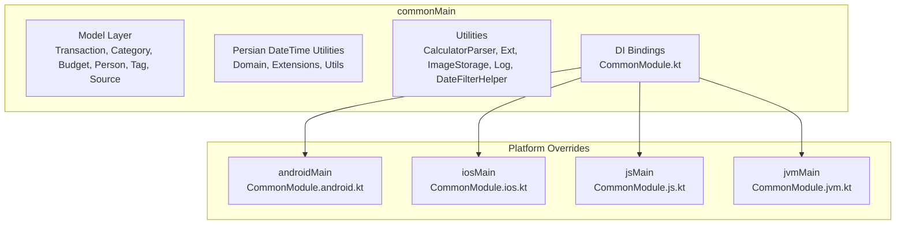
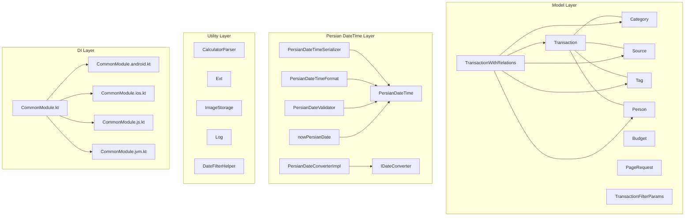
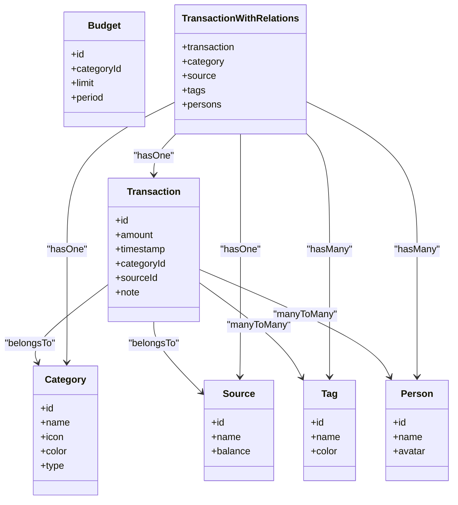
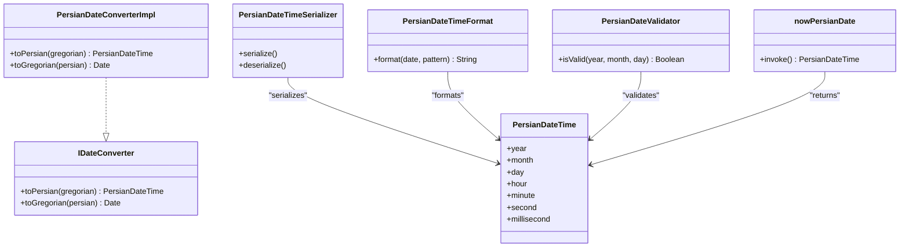
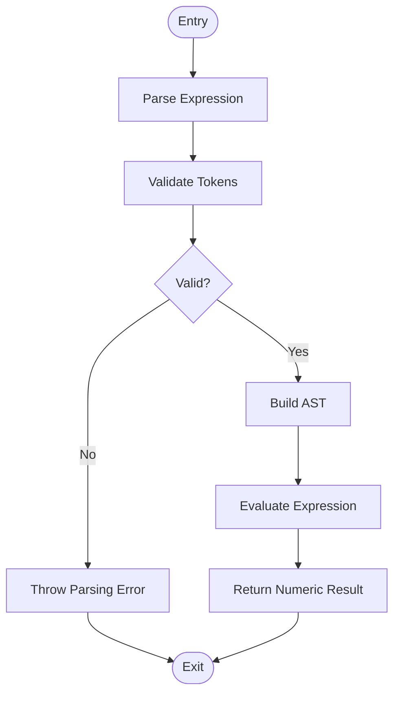
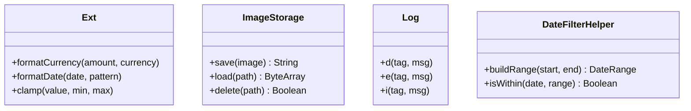
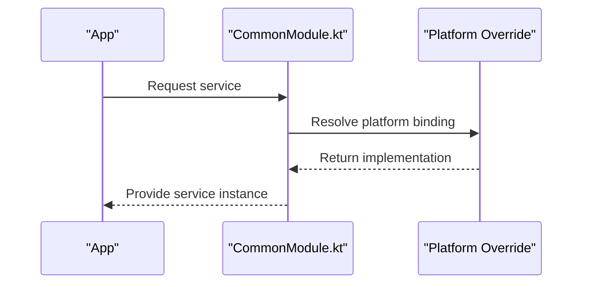
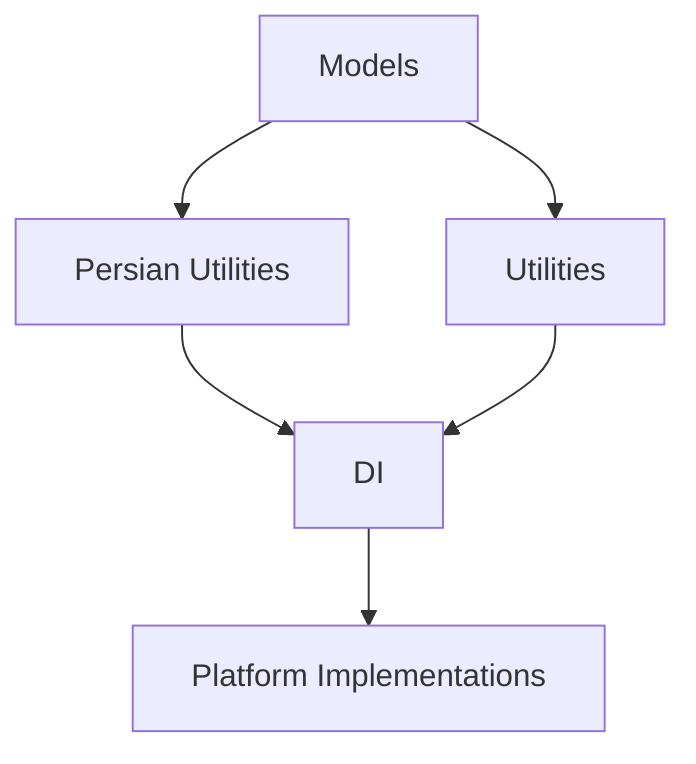

# Common Module

<cite>
**Referenced Files in This Document**
- [Budget.kt](file://core/common/src/commonMain/kotlin/com/kazemieh/common/model/Budget.kt)
- [Category.kt](file://core/common/src/commonMain/kotlin/com/kazemieh/common/model/Category.kt)
- [PageRequest.kt](file://core/common/src/commonMain/kotlin/com/kazemieh/common/model/PageRequest.kt)
- [Person.kt](file://core/common/src/commonMain/kotlin/com/kazemieh/common/model/Person.kt)
- [Source.kt](file://core/common/src/commonMain/kotlin/com/kazemieh/common/model/Source.kt)
- [Tag.kt](file://core/common/src/commonMain/kotlin/com/kazemieh/common/model/Tag.kt)
- [Transaction.kt](file://core/common/src/commonMain/kotlin/com/kazemieh/common/model/Transaction.kt)
- [TransactionFilterParams.kt](file://core/common/src/commonMain/kotlin/com/kazemieh/common/model/TransactionFilterParams.kt)
- [TransactionWithRelations.kt](file://core/common/src/commonMain/kotlin/com/kazemieh/common/model/TransactionWithRelations.kt)
- [PersianDateTime.kt](file://core/common/src/commonMain/kotlin/com/kazemieh/common/persiandatetime/domain/PersianDateTime.kt)
- [PersianDateTimeSerializer.kt](file://core/common/src/commonMain/kotlin/com/kazemieh/common/persiandatetime/domain/PersianDateTimeSerializer.kt)
- [PersianDateConverterImpl.kt](file://core/common/src/commonMain/kotlin/com/kazemieh/common/persiandatetime/PersianDateConverterImpl.kt)
- [PersianDateTimeFormat.kt](file://core/common/src/commonMain/kotlin/com/kazemieh/common/persiandatetime/util/PersianDateTimeFormat.kt)
- [PersianDateValidator.kt](file://core/common/src/commonMain/kotlin/com/kazemieh/common/persiandatetime/util/PersianDateValidator.kt)
- [nowPersianDate.kt](file://core/common/src/commonMain/kotlin/com/kazemieh/common/persiandatetime/extensions/nowPersianDate.kt)
- [CalculatorParser.kt](file://core/common/src/commonMain/kotlin/com/kazemieh/common/util/CalculatorParser.kt)
- [Ext.kt](file://core/common/src/commonMain/kotlin/com/kazemieh/common/Ext.kt)
- [ImageStorage.kt](file://core/common/src/commonMain/kotlin/com/kazemieh/common/ImageStorage.kt)
- [Log.kt](file://core/common/src/commonMain/kotlin/com/kazemieh/common/Log.kt)
- [DateFilterHelper.kt](file://core/common/src/commonMain/kotlin/com/kazemieh/common/DateFilterHelper.kt)
- [CommonModule.kt](file://core/common/src/commonMain/kotlin/com/kazemieh/common/di/CommonModule.kt)
- [CommonModule.android.kt](file://core/common/src/androidMain/kotlin/com/kazemieh/common/di/CommonModule.android.kt)
- [CommonModule.ios.kt](file://core/common/src/iosMain/kotlin/com/kazemieh/common/di/CommonModule.ios.kt)
- [CommonModule.js.kt](file://core/common/src/jsMain/kotlin/com/kazemieh/common/di/CommonModule.js.kt)
- [CommonModule.jvm.kt](file://core/common/src/jvmMain/kotlin/com/kazemieh/common/di/CommonModule.jvm.kt)
</cite>

## Table of Contents
1. [Introduction](#introduction)
2. [Project Structure](#project-structure)
3. [Core Components](#core-components)
4. [Architecture Overview](#architecture-overview)
5. [Detailed Component Analysis](#detailed-component-analysis)
6. [Dependency Analysis](#dependency-analysis)
7. [Performance Considerations](#performance-considerations)
8. [Troubleshooting Guide](#troubleshooting-guide)
9. [Conclusion](#conclusion)
10. [Appendices](#appendices)

## Introduction
The Common module serves as the foundational layer for shared utilities, data models, and cross-platform abstractions across all platform implementations in the FinTrack project. It centralizes:
- Core data models used throughout the application (Transaction, Category, Budget, Person, Tag, Source)
- Persian date/time utilities with conversion, formatting, and validation capabilities
- Mathematical parsing helpers for expression evaluation
- Extension functions and platform-agnostic utilities
- DI bindings for common services

This module is organized with Kotlin Multiplatform targets (commonMain, androidMain, iosMain, jsMain, jvmMain) to maximize code reuse while allowing platform-specific overrides where necessary.

## Project Structure
The Common module is structured around feature-oriented packages under commonMain, with platform-specific DI modules in their respective platform folders.

**Diagram sources**
- [CommonModule.kt:1-200](file://core/common/src/commonMain/kotlin/com/kazemieh/common/di/CommonModule.kt#L1-L200)
- [CommonModule.android.kt:1-200](file://core/common/src/androidMain/kotlin/com/kazemieh/common/di/CommonModule.android.kt#L1-L200)
- [CommonModule.ios.kt:1-200](file://core/common/src/iosMain/kotlin/com/kazemieh/common/di/CommonModule.ios.kt#L1-L200)
- [CommonModule.js.kt:1-200](file://core/common/src/jsMain/kotlin/com/kazemieh/common/di/CommonModule.js.kt#L1-L200)
- [CommonModule.jvm.kt:1-200](file://core/common/src/jvmMain/kotlin/com/kazemieh/common/di/CommonModule.jvm.kt#L1-L200)

**Section sources**
- [CommonModule.kt:1-200](file://core/common/src/commonMain/kotlin/com/kazemieh/common/di/CommonModule.kt#L1-L200)
- [CommonModule.android.kt:1-200](file://core/common/src/androidMain/kotlin/com/kazemieh/common/di/CommonModule.android.kt#L1-L200)
- [CommonModule.ios.kt:1-200](file://core/common/src/iosMain/kotlin/com/kazemieh/common/di/CommonModule.ios.kt#L1-L200)
- [CommonModule.js.kt:1-200](file://core/common/src/jsMain/kotlin/com/kazemieh/common/di/CommonModule.js.kt#L1-L200)
- [CommonModule.jvm.kt:1-200](file://core/common/src/jvmMain/kotlin/com/kazemieh/common/di/CommonModule.jvm.kt#L1-L200)

## Core Components
This section documents the primary shared models and utilities that form the backbone of the application’s data layer and platform utilities.

- Shared Models
  - Transaction: Represents financial entries with amounts, timestamps, and relationships to Category, Source, Tags, and Persons.
  - Category: Defines categories for income/expense classification.
  - Budget: Tracks budget limits per Category.
  - Person: Represents counterparties or individuals associated with transactions.
  - Tag: Provides flexible tagging for transactions.
  - Source: Denotes origin of funds or destinations for outflows.
  - Supporting Types: PageRequest, TransactionFilterParams, TransactionWithRelations.

- Persian Date/Time Utilities
  - Domain types: PersianDateTime, IDateConverter, PersianDateTimeSerializer
  - Implementation: PersianDateConverterImpl
  - Utilities: PersianDateTimeFormat, PersianDateValidator, nowPersianDate extension
  - Cross-platform compatibility via multiplatform annotations and commonMain targets

- Utilities
  - CalculatorParser: Parses arithmetic expressions safely
  - Ext: Extension functions for common types
  - ImageStorage: Abstraction for image persistence
  - Log: Logging abstraction
  - DateFilterHelper: Helper for date range filtering

**Section sources**
- [Transaction.kt:1-200](file://core/common/src/commonMain/kotlin/com/kazemieh/common/model/Transaction.kt#L1-L200)
- [Category.kt:1-200](file://core/common/src/commonMain/kotlin/com/kazemieh/common/model/Category.kt#L1-L200)
- [Budget.kt:1-200](file://core/common/src/commonMain/kotlin/com/kazemieh/common/model/Budget.kt#L1-L200)
- [Person.kt:1-200](file://core/common/src/commonMain/kotlin/com/kazemieh/common/model/Person.kt#L1-L200)
- [Tag.kt:1-200](file://core/common/src/commonMain/kotlin/com/kazemieh/common/model/Tag.kt#L1-L200)
- [Source.kt:1-200](file://core/common/src/commonMain/kotlin/com/kazemieh/common/model/Source.kt#L1-L200)
- [PageRequest.kt:1-200](file://core/common/src/commonMain/kotlin/com/kazemieh/common/model/PageRequest.kt#L1-L200)
- [TransactionFilterParams.kt:1-200](file://core/common/src/commonMain/kotlin/com/kazemieh/common/model/TransactionFilterParams.kt#L1-L200)
- [TransactionWithRelations.kt:1-200](file://core/common/src/commonMain/kotlin/com/kazemieh/common/model/TransactionWithRelations.kt#L1-L200)
- [PersianDateTime.kt:1-200](file://core/common/src/commonMain/kotlin/com/kazemieh/common/persiandatetime/domain/PersianDateTime.kt#L1-L200)
- [PersianDateTimeSerializer.kt:1-200](file://core/common/src/commonMain/kotlin/com/kazemieh/common/persiandatetime/domain/PersianDateTimeSerializer.kt#L1-L200)
- [PersianDateConverterImpl.kt:1-200](file://core/common/src/commonMain/kotlin/com/kazemieh/common/persiandatetime/PersianDateConverterImpl.kt#L1-L200)
- [PersianDateTimeFormat.kt:1-200](file://core/common/src/commonMain/kotlin/com/kazemieh/common/persiandatetime/util/PersianDateTimeFormat.kt#L1-L200)
- [PersianDateValidator.kt:1-200](file://core/common/src/commonMain/kotlin/com/kazemieh/common/persiandatetime/util/PersianDateValidator.kt#L1-L200)
- [nowPersianDate.kt:1-200](file://core/common/src/commonMain/kotlin/com/kazemieh/common/persiandatetime/extensions/nowPersianDate.kt#L1-L200)
- [CalculatorParser.kt:1-200](file://core/common/src/commonMain/kotlin/com/kazemieh/common/util/CalculatorParser.kt#L1-L200)
- [Ext.kt:1-200](file://core/common/src/commonMain/kotlin/com/kazemieh/common/Ext.kt#L1-L200)
- [ImageStorage.kt:1-200](file://core/common/src/commonMain/kotlin/com/kazemieh/common/ImageStorage.kt#L1-L200)
- [Log.kt:1-200](file://core/common/src/commonMain/kotlin/com/kazemieh/common/Log.kt#L1-L200)
- [DateFilterHelper.kt:1-200](file://core/common/src/commonMain/kotlin/com/kazemieh/common/DateFilterHelper.kt#L1-L200)

## Architecture Overview
The Common module follows a layered architecture:
- Model Layer: Immutable data classes representing domain entities
- Persian DateTime Layer: Converter interface, serializer, and utilities
- Utility Layer: Parsing, logging, storage, and extension helpers
- DI Layer: Platform-agnostic bindings with platform overrides

**Diagram sources**
- [Transaction.kt:1-200](file://core/common/src/commonMain/kotlin/com/kazemieh/common/model/Transaction.kt#L1-L200)
- [Category.kt:1-200](file://core/common/src/commonMain/kotlin/com/kazemieh/common/model/Category.kt#L1-L200)
- [Budget.kt:1-200](file://core/common/src/commonMain/kotlin/com/kazemieh/common/model/Budget.kt#L1-L200)
- [Person.kt:1-200](file://core/common/src/commonMain/kotlin/com/kazemieh/common/model/Person.kt#L1-L200)
- [Tag.kt:1-200](file://core/common/src/commonMain/kotlin/com/kazemieh/common/model/Tag.kt#L1-L200)
- [Source.kt:1-200](file://core/common/src/commonMain/kotlin/com/kazemieh/common/model/Source.kt#L1-L200)
- [PageRequest.kt:1-200](file://core/common/src/commonMain/kotlin/com/kazemieh/common/model/PageRequest.kt#L1-L200)
- [TransactionFilterParams.kt:1-200](file://core/common/src/commonMain/kotlin/com/kazemieh/common/model/TransactionFilterParams.kt#L1-L200)
- [TransactionWithRelations.kt:1-200](file://core/common/src/commonMain/kotlin/com/kazemieh/common/model/TransactionWithRelations.kt#L1-L200)
- [PersianDateTime.kt:1-200](file://core/common/src/commonMain/kotlin/com/kazemieh/common/persiandatetime/domain/PersianDateTime.kt#L1-L200)
- [PersianDateConverterImpl.kt:1-200](file://core/common/src/commonMain/kotlin/com/kazemieh/common/persiandatetime/PersianDateConverterImpl.kt#L1-L200)
- [PersianDateTimeSerializer.kt:1-200](file://core/common/src/commonMain/kotlin/com/kazemieh/common/persiandatetime/domain/PersianDateTimeSerializer.kt#L1-L200)
- [PersianDateTimeFormat.kt:1-200](file://core/common/src/commonMain/kotlin/com/kazemieh/common/persiandatetime/util/PersianDateTimeFormat.kt#L1-L200)
- [PersianDateValidator.kt:1-200](file://core/common/src/commonMain/kotlin/com/kazemieh/common/persiandatetime/util/PersianDateValidator.kt#L1-L200)
- [nowPersianDate.kt:1-200](file://core/common/src/commonMain/kotlin/com/kazemieh/common/persiandatetime/extensions/nowPersianDate.kt#L1-L200)
- [CalculatorParser.kt:1-200](file://core/common/src/commonMain/kotlin/com/kazemieh/common/util/CalculatorParser.kt#L1-L200)
- [Ext.kt:1-200](file://core/common/src/commonMain/kotlin/com/kazemieh/common/Ext.kt#L1-L200)
- [ImageStorage.kt:1-200](file://core/common/src/commonMain/kotlin/com/kazemieh/common/ImageStorage.kt#L1-L200)
- [Log.kt:1-200](file://core/common/src/commonMain/kotlin/com/kazemieh/common/Log.kt#L1-L200)
- [DateFilterHelper.kt:1-200](file://core/common/src/commonMain/kotlin/com/kazemieh/common/DateFilterHelper.kt#L1-L200)
- [CommonModule.kt:1-200](file://core/common/src/commonMain/kotlin/com/kazemieh/common/di/CommonModule.kt#L1-L200)
- [CommonModule.android.kt:1-200](file://core/common/src/androidMain/kotlin/com/kazemieh/common/di/CommonModule.android.kt#L1-L200)
- [CommonModule.ios.kt:1-200](file://core/common/src/iosMain/kotlin/com/kazemieh/common/di/CommonModule.ios.kt#L1-L200)
- [CommonModule.js.kt:1-200](file://core/common/src/jsMain/kotlin/com/kazemieh/common/di/CommonModule.js.kt#L1-L200)
- [CommonModule.jvm.kt:1-200](file://core/common/src/jvmMain/kotlin/com/kazemieh/common/di/CommonModule.jvm.kt#L1-L200)

## Detailed Component Analysis

### Shared Data Models
The model layer defines immutable data structures representing core entities. Relationships are established through foreign keys and association tables (as seen in TransactionWithRelations).

**Diagram sources**
- [Transaction.kt:1-200](file://core/common/src/commonMain/kotlin/com/kazemieh/common/model/Transaction.kt#L1-L200)
- [Category.kt:1-200](file://core/common/src/commonMain/kotlin/com/kazemieh/common/model/Category.kt#L1-L200)
- [Budget.kt:1-200](file://core/common/src/commonMain/kotlin/com/kazemieh/common/model/Budget.kt#L1-L200)
- [Person.kt:1-200](file://core/common/src/commonMain/kotlin/com/kazemieh/common/model/Person.kt#L1-L200)
- [Tag.kt:1-200](file://core/common/src/commonMain/kotlin/com/kazemieh/common/model/Tag.kt#L1-L200)
- [Source.kt:1-200](file://core/common/src/commonMain/kotlin/com/kazemieh/common/model/Source.kt#L1-L200)
- [TransactionWithRelations.kt:1-200](file://core/common/src/commonMain/kotlin/com/kazemieh/common/model/TransactionWithRelations.kt#L1-L200)

Implementation highlights:
- Transaction encapsulates amount, timestamp, and associations to Category and Source, with optional note.
- Category includes metadata like icon and color for UI rendering.
- Budget links a limit to a Category for spending control.
- Person and Tag represent many-to-many relationships with Transaction.
- TransactionWithRelations aggregates related entities for presentation and reporting.

Validation rules and constraints:
- Amount must be numeric and non-negative for income/expense depending on type.
- Timestamp must be valid and ordered for filtering and reporting.
- Category.type must match the Transaction type (income/expense).
- Budget.limit must be greater than or equal to zero.
- Person and Tag identifiers must reference existing entities.

Serialization considerations:
- Entities are designed for JSON serialization and deserialization.
- Optional fields support nullable serialization.
- Enumerated fields (e.g., type) should serialize consistently across platforms.

**Section sources**
- [Transaction.kt:1-200](file://core/common/src/commonMain/kotlin/com/kazemieh/common/model/Transaction.kt#L1-L200)
- [Category.kt:1-200](file://core/common/src/commonMain/kotlin/com/kazemieh/common/model/Category.kt#L1-L200)
- [Budget.kt:1-200](file://core/common/src/commonMain/kotlin/com/kazemieh/common/model/Budget.kt#L1-L200)
- [Person.kt:1-200](file://core/common/src/commonMain/kotlin/com/kazemieh/common/model/Person.kt#L1-L200)
- [Tag.kt:1-200](file://core/common/src/commonMain/kotlin/com/kazemieh/common/model/Tag.kt#L1-L200)
- [Source.kt:1-200](file://core/common/src/commonMain/kotlin/com/kazemieh/common/model/Source.kt#L1-L200)
- [TransactionWithRelations.kt:1-200](file://core/common/src/commonMain/kotlin/com/kazemieh/common/model/TransactionWithRelations.kt#L1-L200)

### Persian Date/Time Utilities
The Persian date/time subsystem provides conversion, formatting, and validation for Jalali calendar dates across platforms.

**Diagram sources**
- [PersianDateTime.kt:1-200](file://core/common/src/commonMain/kotlin/com/kazemieh/common/persiandatetime/domain/PersianDateTime.kt#L1-L200)
- [PersianDateConverterImpl.kt:1-200](file://core/common/src/commonMain/kotlin/com/kazemieh/common/persiandatetime/PersianDateConverterImpl.kt#L1-L200)
- [PersianDateTimeSerializer.kt:1-200](file://core/common/src/commonMain/kotlin/com/kazemieh/common/persiandatetime/domain/PersianDateTimeSerializer.kt#L1-L200)
- [PersianDateTimeFormat.kt:1-200](file://core/common/src/commonMain/kotlin/com/kazemieh/common/persiandatetime/util/PersianDateTimeFormat.kt#L1-L200)
- [PersianDateValidator.kt:1-200](file://core/common/src/commonMain/kotlin/com/kazemieh/common/persiandatetime/util/PersianDateValidator.kt#L1-L200)
- [nowPersianDate.kt:1-200](file://core/common/src/commonMain/kotlin/com/kazemieh/common/persiandatetime/extensions/nowPersianDate.kt#L1-L200)

Processing logic:
- Conversion: Gregorian date to Persian date and vice versa using the converter implementation.
- Formatting: Pattern-based formatting for display and persistence.
- Validation: Ensures valid Persian calendar dates.
- Serialization: Custom serializer for PersianDateTime to maintain consistent representation.

Cross-platform compatibility:
- Uses commonMain targets for shared logic.
- Platform-specific DI modules bind the converter implementation.

**Section sources**
- [PersianDateTime.kt:1-200](file://core/common/src/commonMain/kotlin/com/kazemieh/common/persiandatetime/domain/PersianDateTime.kt#L1-L200)
- [PersianDateConverterImpl.kt:1-200](file://core/common/src/commonMain/kotlin/com/kazemieh/common/persiandatetime/PersianDateConverterImpl.kt#L1-L200)
- [PersianDateTimeSerializer.kt:1-200](file://core/common/src/commonMain/kotlin/com/kazemieh/common/persiandatetime/domain/PersianDateTimeSerializer.kt#L1-L200)
- [PersianDateTimeFormat.kt:1-200](file://core/common/src/commonMain/kotlin/com/kazemieh/common/persiandatetime/util/PersianDateTimeFormat.kt#L1-L200)
- [PersianDateValidator.kt:1-200](file://core/common/src/commonMain/kotlin/com/kazemieh/common/persiandatetime/util/PersianDateValidator.kt#L1-L200)
- [nowPersianDate.kt:1-200](file://core/common/src/commonMain/kotlin/com/kazemieh/common/persiandatetime/extensions/nowPersianDate.kt#L1-L200)

### Mathematical Parser
The calculator parser evaluates arithmetic expressions safely and efficiently.

**Diagram sources**
- [CalculatorParser.kt:1-200](file://core/common/src/commonMain/kotlin/com/kazemieh/common/util/CalculatorParser.kt#L1-L200)

Usage patterns:
- Supports basic arithmetic operators (+, -, *, /) and parentheses.
- Handles floating-point precision carefully.
- Integrates with UI components for quick calculations.

**Section sources**
- [CalculatorParser.kt:1-200](file://core/common/src/commonMain/kotlin/com/kazemieh/common/util/CalculatorParser.kt#L1-L200)

### Extension Functions and Utilities
Extensions and utilities enhance developer ergonomics and reduce boilerplate.

**Diagram sources**
- [Ext.kt:1-200](file://core/common/src/commonMain/kotlin/com/kazemieh/common/Ext.kt#L1-L200)
- [ImageStorage.kt:1-200](file://core/common/src/commonMain/kotlin/com/kazemieh/common/ImageStorage.kt#L1-L200)
- [Log.kt:1-200](file://core/common/src/commonMain/kotlin/com/kazemieh/common/Log.kt#L1-L200)
- [DateFilterHelper.kt:1-200](file://core/common/src/commonMain/kotlin/com/kazemieh/common/DateFilterHelper.kt#L1-L200)

**Section sources**
- [Ext.kt:1-200](file://core/common/src/commonMain/kotlin/com/kazemieh/common/Ext.kt#L1-L200)
- [ImageStorage.kt:1-200](file://core/common/src/commonMain/kotlin/com/kazemieh/common/ImageStorage.kt#L1-L200)
- [Log.kt:1-200](file://core/common/src/commonMain/kotlin/com/kazemieh/common/Log.kt#L1-L200)
- [DateFilterHelper.kt:1-200](file://core/common/src/commonMain/kotlin/com/kazemieh/common/DateFilterHelper.kt#L1-L200)

### DI Bindings and Cross-Platform Considerations
The DI module binds common services and allows platform-specific overrides.

**Diagram sources**
- [CommonModule.kt:1-200](file://core/common/src/commonMain/kotlin/com/kazemieh/common/di/CommonModule.kt#L1-L200)
- [CommonModule.android.kt:1-200](file://core/common/src/androidMain/kotlin/com/kazemieh/common/di/CommonModule.android.kt#L1-L200)
- [CommonModule.ios.kt:1-200](file://core/common/src/iosMain/kotlin/com/kazemieh/common/di/CommonModule.ios.kt#L1-L200)
- [CommonModule.js.kt:1-200](file://core/common/src/jsMain/kotlin/com/kazemieh/common/di/CommonModule.js.kt#L1-L200)
- [CommonModule.jvm.kt:1-200](file://core/common/src/jvmMain/kotlin/com/kazemieh/common/di/CommonModule.jvm.kt#L1-L200)

Practical examples:
- Binding ImageStorage: Provide a platform-specific implementation for saving/loading images.
- Binding PersianDateConverterImpl: Ensure the correct converter is injected on each platform.
- Binding Log: Route logs to platform-specific sinks (e.g., Android logcat, iOS console, JVM stdout).

**Section sources**
- [CommonModule.kt:1-200](file://core/common/src/commonMain/kotlin/com/kazemieh/common/di/CommonModule.kt#L1-L200)
- [CommonModule.android.kt:1-200](file://core/common/src/androidMain/kotlin/com/kazemieh/common/di/CommonModule.android.kt#L1-L200)
- [CommonModule.ios.kt:1-200](file://core/common/src/iosMain/kotlin/com/kazemieh/common/di/CommonModule.ios.kt#L1-L200)
- [CommonModule.js.kt:1-200](file://core/common/src/jsMain/kotlin/com/kazemieh/common/di/CommonModule.js.kt#L1-L200)
- [CommonModule.jvm.kt:1-200](file://core/common/src/jvmMain/kotlin/com/kazemieh/common/di/CommonModule.jvm.kt#L1-L200)

## Dependency Analysis
The Common module exhibits low coupling and high cohesion:
- Models depend on each other through associations but remain independent otherwise.
- Persian utilities depend on the converter interface, enabling easy substitution.
- Utilities are standalone and reusable across modules.
- DI modules depend on platform implementations without leaking platform specifics into common code.

**Diagram sources**
- [CommonModule.kt:1-200](file://core/common/src/commonMain/kotlin/com/kazemieh/common/di/CommonModule.kt#L1-L200)
- [PersianDateConverterImpl.kt:1-200](file://core/common/src/commonMain/kotlin/com/kazemieh/common/persiandatetime/PersianDateConverterImpl.kt#L1-L200)
- [ImageStorage.kt:1-200](file://core/common/src/commonMain/kotlin/com/kazemieh/common/ImageStorage.kt#L1-L200)

**Section sources**
- [CommonModule.kt:1-200](file://core/common/src/commonMain/kotlin/com/kazemieh/common/di/CommonModule.kt#L1-L200)
- [PersianDateConverterImpl.kt:1-200](file://core/common/src/commonMain/kotlin/com/kazemieh/common/persiandatetime/PersianDateConverterImpl.kt#L1-L200)
- [ImageStorage.kt:1-200](file://core/common/src/commonMain/kotlin/com/kazemieh/common/ImageStorage.kt#L1-L200)

## Performance Considerations
- Prefer immutable data models to avoid defensive copying and simplify concurrency.
- Use lazy evaluation for derived properties in models where appropriate.
- Cache frequently accessed formatted strings (e.g., currency, dates) to reduce repeated computations.
- Minimize allocations in hot paths (e.g., parsing, formatting) by reusing buffers or builders.
- Keep serializers efficient and avoid unnecessary conversions during JSON marshalling/unmarshalling.

## Troubleshooting Guide
Common issues and resolutions:
- Serialization errors with PersianDateTime: Ensure the custom serializer is registered and used consistently across platforms.
- Invalid Persian dates: Validate inputs using PersianDateValidator before conversion.
- Parsing failures: Wrap CalculatorParser usage in try-catch and provide user-friendly error messages.
- Logging inconsistencies: Use the Log abstraction to route messages to platform-specific sinks.
- Image storage failures: Verify platform-specific storage permissions and paths.

**Section sources**
- [PersianDateTimeSerializer.kt:1-200](file://core/common/src/commonMain/kotlin/com/kazemieh/common/persiandatetime/domain/PersianDateTimeSerializer.kt#L1-L200)
- [PersianDateValidator.kt:1-200](file://core/common/src/commonMain/kotlin/com/kazemieh/common/persiandatetime/util/PersianDateValidator.kt#L1-L200)
- [CalculatorParser.kt:1-200](file://core/common/src/commonMain/kotlin/com/kazemieh/common/util/CalculatorParser.kt#L1-L200)
- [Log.kt:1-200](file://core/common/src/commonMain/kotlin/com/kazemieh/common/Log.kt#L1-L200)
- [ImageStorage.kt:1-200](file://core/common/src/commonMain/kotlin/com/kazemieh/common/ImageStorage.kt#L1-L200)

## Conclusion
The Common module provides a robust, cross-platform foundation for FinTrack by consolidating shared models, Persian date/time utilities, mathematical parsing, and essential utilities. Its layered design, DI bindings, and platform-specific overrides enable seamless integration across Android, iOS, JVM, and JavaScript environments while maintaining code reuse and consistency.

## Appendices
- Practical usage patterns:
  - Model creation: Instantiate models with required fields and optional relations; validate before persistence.
  - Persian date handling: Convert Gregorian dates to Persian for display and storage; validate before use.
  - Expression parsing: Use CalculatorParser for quick arithmetic operations in UI components.
  - DI configuration: Bind platform-specific implementations via DI modules to ensure correct runtime behavior.

[No sources needed since this section provides general guidance]