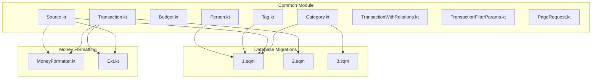
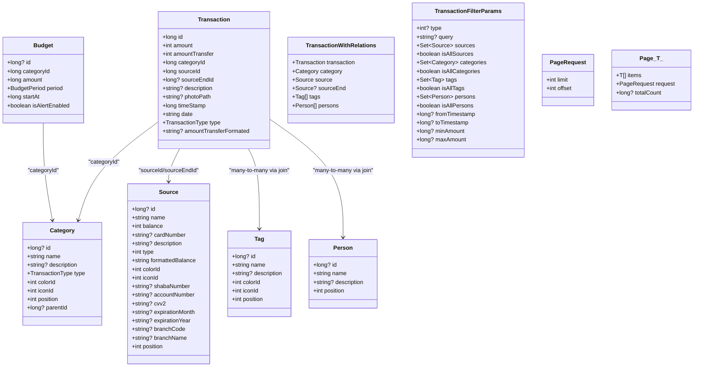
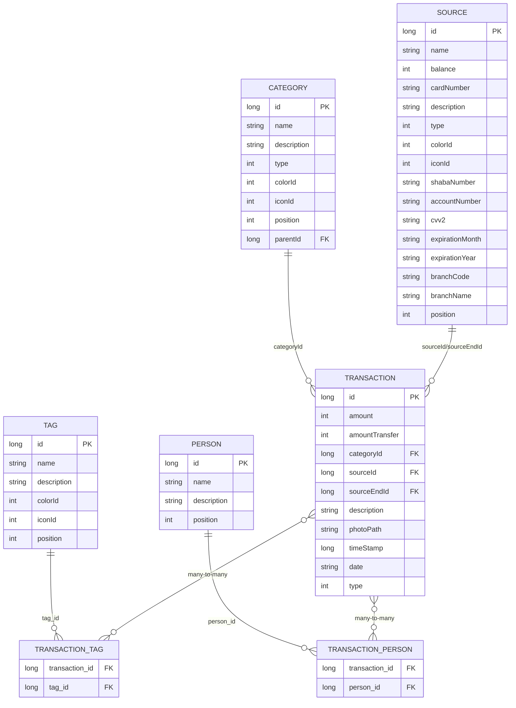

# Data Models

<cite>
**Referenced Files in This Document**
- [Transaction.kt](file://core/common/src/commonMain/kotlin/com/kazemieh/common/model/Transaction.kt)
- [Category.kt](file://core/common/src/commonMain/kotlin/com/kazemieh/common/model/Category.kt)
- [Budget.kt](file://core/common/src/commonMain/kotlin/com/kazemieh/common/model/Budget.kt)
- [Person.kt](file://core/common/src/commonMain/kotlin/com/kazemieh/common/model/Person.kt)
- [Tag.kt](file://core/common/src/commonMain/kotlin/com/kazemieh/common/model/Tag.kt)
- [Source.kt](file://core/common/src/commonMain/kotlin/com/kazemieh/common/model/Source.kt)
- [TransactionWithRelations.kt](file://core/common/src/commonMain/kotlin/com/kazemieh/common/model/TransactionWithRelations.kt)
- [TransactionFilterParams.kt](file://core/common/src/commonMain/kotlin/com/kazemieh/common/model/TransactionFilterParams.kt)
- [PageRequest.kt](file://core/common/src/commonMain/kotlin/com/kazemieh/common/model/PageRequest.kt)
- [MoneyFormatter.kt](file://core/money/src/commonMain/kotlin/com/kazemieh/money/MoneyFormatter.kt)
- [Ext.kt](file://core/common/src/commonMain/kotlin/com/kazemieh/common/Ext.kt)
- [1.sqm](file://core/database/src/commonMain/sqldelight/com/kazemieh/database/1.sqm)
- [2.sqm](file://core/database/src/commonMain/sqldelight/com/kazemieh/database/2.sqm)
- [3.sqm](file://core/database/src/commonMain/sqldelight/com/kazemieh/database/3.sqm)
</cite>

## Table of Contents
1. [Introduction](#introduction)
2. [Project Structure](#project-structure)
3. [Core Components](#core-components)
4. [Architecture Overview](#architecture-overview)
5. [Detailed Component Analysis](#detailed-component-analysis)
6. [Dependency Analysis](#dependency-analysis)
7. [Performance Considerations](#performance-considerations)
8. [Troubleshooting Guide](#troubleshooting-guide)
9. [Conclusion](#conclusion)
10. [Appendices](#appendices)

## Introduction
This document provides comprehensive data model documentation for the Common module’s core entities used across FinTrack. It covers the primary models: Transaction, Category, Budget, Person, Tag, and Source. It also documents supporting constructs such as TransactionWithRelations (for efficient loading), TransactionFilterParams (for filtering), and PageRequest/Page (for pagination). The document explains field definitions, data types, validation rules, business constraints, entity relationships, foreign key mappings, referential integrity, serialization formats, JSON schema representations, and cross-platform compatibility considerations. Practical examples of model instantiation, relationship establishment, and common query patterns are included.

## Project Structure
The data models reside in the Common module under the model package. Supporting formatting utilities and database migration scripts define constraints and defaults at the persistence layer.

**Diagram sources**
- [Transaction.kt:1-36](file://core/common/src/commonMain/kotlin/com/kazemieh/common/model/Transaction.kt#L1-L36)
- [Category.kt:1-29](file://core/common/src/commonMain/kotlin/com/kazemieh/common/model/Category.kt#L1-L29)
- [Budget.kt:1-26](file://core/common/src/commonMain/kotlin/com/kazemieh/common/model/Budget.kt#L1-L26)
- [Person.kt:1-12](file://core/common/src/commonMain/kotlin/com/kazemieh/common/model/Person.kt#L1-L12)
- [Tag.kt:1-14](file://core/common/src/commonMain/kotlin/com/kazemieh/common/model/Tag.kt#L1-L14)
- [Source.kt:1-27](file://core/common/src/commonMain/kotlin/com/kazemieh/common/model/Source.kt#L1-L27)
- [TransactionWithRelations.kt:1-15](file://core/common/src/commonMain/kotlin/com/kazemieh/common/model/TransactionWithRelations.kt#L1-L15)
- [TransactionFilterParams.kt:1-19](file://core/common/src/commonMain/kotlin/com/kazemieh/common/model/TransactionFilterParams.kt#L1-L19)
- [PageRequest.kt:1-16](file://core/common/src/commonMain/kotlin/com/kazemieh/common/model/PageRequest.kt#L1-L16)
- [MoneyFormatter.kt:1-14](file://core/money/src/commonMain/kotlin/com/kazemieh/money/MoneyFormatter.kt#L1-L14)
- [Ext.kt:1-36](file://core/common/src/commonMain/kotlin/com/kazemieh/common/Ext.kt#L1-L36)
- [1.sqm:1-12](file://core/database/src/commonMain/sqldelight/com/kazemieh/database/1.sqm#L1-L12)
- [2.sqm:1-2](file://core/database/src/commonMain/sqldelight/com/kazemieh/database/2.sqm#L1-L2)
- [3.sqm:1-2](file://core/database/src/commonMain/sqldelight/com/kazemieh/database/3.sqm#L1-L2)

**Section sources**
- [Transaction.kt:1-36](file://core/common/src/commonMain/kotlin/com/kazemieh/common/model/Transaction.kt#L1-L36)
- [Category.kt:1-29](file://core/common/src/commonMain/kotlin/com/kazemieh/common/model/Category.kt#L1-L29)
- [Budget.kt:1-26](file://core/common/src/commonMain/kotlin/com/kazemieh/common/model/Budget.kt#L1-L26)
- [Person.kt:1-12](file://core/common/src/commonMain/kotlin/com/kazemieh/common/model/Person.kt#L1-L12)
- [Tag.kt:1-14](file://core/common/src/commonMain/kotlin/com/kazemieh/common/model/Tag.kt#L1-L14)
- [Source.kt:1-27](file://core/common/src/commonMain/kotlin/com/kazemieh/common/model/Source.kt#L1-L27)
- [TransactionWithRelations.kt:1-15](file://core/common/src/commonMain/kotlin/com/kazemieh/common/model/TransactionWithRelations.kt#L1-L15)
- [TransactionFilterParams.kt:1-19](file://core/common/src/commonMain/kotlin/com/kazemieh/common/model/TransactionFilterParams.kt#L1-L19)
- [PageRequest.kt:1-16](file://core/common/src/commonMain/kotlin/com/kazemieh/common/model/PageRequest.kt#L1-L16)
- [MoneyFormatter.kt:1-14](file://core/money/src/commonMain/kotlin/com/kazemieh/money/MoneyFormatter.kt#L1-L14)
- [Ext.kt:1-36](file://core/common/src/commonMain/kotlin/com/kazemieh/common/Ext.kt#L1-L36)
- [1.sqm:1-12](file://core/database/src/commonMain/sqldelight/com/kazemieh/database/1.sqm#L1-L12)
- [2.sqm:1-2](file://core/database/src/commonMain/sqldelight/com/kazemieh/database/2.sqm#L1-L2)
- [3.sqm:1-2](file://core/database/src/commonMain/sqldelight/com/kazemieh/database/3.sqm#L1-L2)

## Core Components
This section introduces each core model with its fields, types, and constraints. Serialization is enabled via Kotlinx Serialization annotations.

- Transaction
  - Purpose: Represents income, expense, and transfer records.
  - Fields: id, amount, amountTransfer, categoryId, sourceId, sourceEndId?, description?, photoPath?, timeStamp, date, type.
  - Types: Long ids, Int amounts, optional Long and String fields, Long timestamps, String date, TransactionType enum.
  - Validation and constraints:
    - amount and amountTransfer are integers representing smallest currency units.
    - type determines behavior; amountTransfer is meaningful only for transfers.
    - Optional fields allow partial record creation.
    - date is presentational; timeStamp is epoch milliseconds.
  - Business rules:
    - Transfer type implies sourceEndId must be set.
    - Amount signs are handled by formatting utilities for display.
  - Serialization: @Serializable applied; JSON schema representation follows field types.

- Category
  - Purpose: Hierarchical grouping of transactions by type (income/expense).
  - Fields: id?, name, description?, type, colorId, iconId, position, parentId?.
  - Types: Long id, String name/description, TransactionType, Int color/icon/position, Long parentId?.
  - Constraints:
    - parentId references another Category id (self-reference).
    - position default 0; updated to id during migration.
  - Business rules:
    - type restricts categories to income or expense.
    - parentId enables hierarchical organization.

- Budget
  - Purpose: Financial planning with limits per category and periods.
  - Fields: id?, categoryId, amount, period, startAt, isAlertEnabled.
  - Types: Long id?, Long categoryId, Long amount, BudgetPeriod enum, Long startAt, Boolean.
  - Constraints:
    - amount is stored in smallest currency units.
    - period defines aggregation window.
  - Business rules:
    - isAlertEnabled controls notification threshold behavior.

- Person
  - Purpose: Parties involved in transactions (e.g., payees, payors).
  - Fields: id?, name, description?, position.
  - Types: Long id?, String name/description, Int position.
  - Constraints:
    - position default 0; updated to id during migration.

- Tag
  - Purpose: Additional categorization metadata for transactions.
  - Fields: id?, name, description?, colorId, iconId, position.
  - Types: Long id?, String name/description, Int color/icon/position.
  - Constraints:
    - position default 0; updated to id during migration.

- Source
  - Purpose: Financial accounts (cash, bank, cards).
  - Fields: id?, name, balance, cardNumber?, description?, type, formattedBalance, colorId, iconId, shabaNumber?, accountNumber?, cvv2?, expirationMonth?, expirationYear?, branchCode?, branchName?, position.
  - Types: Long id?, String name/description/card/account/branch, Int balance/type/color/icon/position, String expiry/month/year, formattedBalance computed.
  - Constraints:
    - balance is integer in smallest currency units.
    - formattedBalance derived from balance via formatting utilities.
  - Business rules:
    - Supports multiple account types and sensitive info placeholders.

- TransactionWithRelations
  - Purpose: Efficient pre-joined view of a transaction with related entities for UI rendering.
  - Fields: transaction, category, source, sourceEnd?, tags[], persons[].
  - Types: Nested models as defined above.
  - Business rules:
    - Ensures consistent loading of related data in a single response.

- TransactionFilterParams
  - Purpose: Filter criteria for transaction queries.
  - Fields: type?, query?, sources Set, isAllSources, categories Set, isAllCategories, tags Set, isAllTags, persons Set, isAllPersons, fromTimestamp?, toTimestamp?, minAmount?, maxAmount?.
  - Types: Int type, String query, Sets of entity models, Boolean flags, Long timestamps/amounts.
  - Business rules:
    - isAll* flags toggle inclusion/exclusion semantics for collections.

- PageRequest and Page
  - Purpose: Pagination support for listing operations.
  - Fields: PageRequest(limit, offset), Page(items, request, totalCount?).
  - Types: Int limit/offset, List<T>, Long totalCount?.
  - Business rules:
    - totalCount? indicates total records when available.

**Section sources**
- [Transaction.kt:1-36](file://core/common/src/commonMain/kotlin/com/kazemieh/common/model/Transaction.kt#L1-L36)
- [Category.kt:1-29](file://core/common/src/commonMain/kotlin/com/kazemieh/common/model/Category.kt#L1-L29)
- [Budget.kt:1-26](file://core/common/src/commonMain/kotlin/com/kazemieh/common/model/Budget.kt#L1-L26)
- [Person.kt:1-12](file://core/common/src/commonMain/kotlin/com/kazemieh/common/model/Person.kt#L1-L12)
- [Tag.kt:1-14](file://core/common/src/commonMain/kotlin/com/kazemieh/common/model/Tag.kt#L1-L14)
- [Source.kt:1-27](file://core/common/src/commonMain/kotlin/com/kazemieh/common/model/Source.kt#L1-L27)
- [TransactionWithRelations.kt:1-15](file://core/common/src/commonMain/kotlin/com/kazemieh/common/model/TransactionWithRelations.kt#L1-L15)
- [TransactionFilterParams.kt:1-19](file://core/common/src/commonMain/kotlin/com/kazemieh/common/model/TransactionFilterParams.kt#L1-L19)
- [PageRequest.kt:1-16](file://core/common/src/commonMain/kotlin/com/kazemieh/common/model/PageRequest.kt#L1-L16)

## Architecture Overview
The data models form the core of FinTrack’s domain layer. They are serialized for cross-platform transport and mapped to SQLDelight entities in the database module. Utility functions provide consistent formatting for Persian locale and numeric presentation.

**Diagram sources**
- [Transaction.kt:1-36](file://core/common/src/commonMain/kotlin/com/kazemieh/common/model/Transaction.kt#L1-L36)
- [Category.kt:1-29](file://core/common/src/commonMain/kotlin/com/kazemieh/common/model/Category.kt#L1-L29)
- [Budget.kt:1-26](file://core/common/src/commonMain/kotlin/com/kazemieh/common/model/Budget.kt#L1-L26)
- [Person.kt:1-12](file://core/common/src/commonMain/kotlin/com/kazemieh/common/model/Person.kt#L1-L12)
- [Tag.kt:1-14](file://core/common/src/commonMain/kotlin/com/kazemieh/common/model/Tag.kt#L1-L14)
- [Source.kt:1-27](file://core/common/src/commonMain/kotlin/com/kazemieh/common/model/Source.kt#L1-L27)
- [TransactionWithRelations.kt:1-15](file://core/common/src/commonMain/kotlin/com/kazemieh/common/model/TransactionWithRelations.kt#L1-L15)
- [TransactionFilterParams.kt:1-19](file://core/common/src/commonMain/kotlin/com/kazemieh/common/model/TransactionFilterParams.kt#L1-L19)
- [PageRequest.kt:1-16](file://core/common/src/commonMain/kotlin/com/kazemieh/common/model/PageRequest.kt#L1-L16)

## Detailed Component Analysis

### Transaction Model
- Fields and types:
  - id: Long (primary key)
  - amount: Int (smallest currency unit)
  - amountTransfer: Int (default 0; transfer-specific)
  - categoryId: Long (foreign key to Category)
  - sourceId: Long (foreign key to Source)
  - sourceEndId?: Long (transfer destination; nullable)
  - description?: String
  - photoPath?: String
  - timeStamp: Long (epoch milliseconds)
  - date: String (presentational)
  - type: TransactionType (ALL, INCOME, EXPENSE, TRANSFER)
- Validation and constraints:
  - amountTransfer is meaningful only when type is TRANSFER.
  - sourceEndId must be provided for transfers.
  - Optional fields allow flexible creation.
- Business rules:
  - Income vs expense determined by type; transfer moves funds between sources.
- Serialization:
  - @Serializable; JSON schema mirrors field types.
- Formatting:
  - amountTransferFormated computed property uses Persian price formatting.

**Section sources**
- [Transaction.kt:1-36](file://core/common/src/commonMain/kotlin/com/kazemieh/common/model/Transaction.kt#L1-L36)
- [Ext.kt:1-36](file://core/common/src/commonMain/kotlin/com/kazemieh/common/Ext.kt#L1-L36)

### Category Model
- Fields and types:
  - id?: Long
  - name: String
  - description?: String
  - type: TransactionType (INCOME or EXPENSE)
  - colorId: Int
  - iconId: Int
  - position: Int (default 0)
  - parentId?: Long (self-reference)
- Validation and constraints:
  - parentId references Category.id; creates hierarchy.
  - position default 0; later updated to id by migration.
- Business rules:
  - Categories group transactions by type and support nesting via parentId.
- Serialization:
  - @Serializable; JSON schema reflects fields.

**Section sources**
- [Category.kt:1-29](file://core/common/src/commonMain/kotlin/com/kazemieh/common/model/Category.kt#L1-L29)
- [3.sqm:1-2](file://core/database/src/commonMain/sqldelight/com/kazemieh/database/3.sqm#L1-L2)

### Budget Model
- Fields and types:
  - id?: Long
  - categoryId: Long (foreign key to Category)
  - amount: Long (budget limit in smallest currency unit)
  - period: BudgetPeriod (DAILY, WEEKLY, MONTHLY, YEARLY)
  - startAt: Long (epoch milliseconds)
  - isAlertEnabled: Boolean (default true)
- Validation and constraints:
  - amount is positive; period defines aggregation window.
- Business rules:
  - Budgets track spending against category limits; alerts configurable.
- Serialization:
  - @Serializable; JSON schema mirrors fields.

**Section sources**
- [Budget.kt:1-26](file://core/common/src/commonMain/kotlin/com/kazemieh/common/model/Budget.kt#L1-L26)

### Person Model
- Fields and types:
  - id?: Long
  - name: String
  - description?: String
  - position: Int (default 0)
- Validation and constraints:
  - position default 0; updated to id by migration.
- Business rules:
  - Represents counterparties in transactions.
- Serialization:
  - @Serializable; JSON schema reflects fields.

**Section sources**
- [Person.kt:1-12](file://core/common/src/commonMain/kotlin/com/kazemieh/common/model/Person.kt#L1-L12)
- [1.sqm:1-12](file://core/database/src/commonMain/sqldelight/com/kazemieh/database/1.sqm#L1-L12)

### Tag Model
- Fields and types:
  - id?: Long
  - name: String
  - description?: String
  - colorId: Int
  - iconId: Int
  - position: Int (default 0)
- Validation and constraints:
  - position default 0; updated to id by migration.
- Business rules:
  - Adds metadata to transactions.
- Serialization:
  - @Serializable; JSON schema reflects fields.

**Section sources**
- [Tag.kt:1-14](file://core/common/src/commonMain/kotlin/com/kazemieh/common/model/Tag.kt#L1-L14)
- [1.sqm:1-12](file://core/database/src/commonMain/sqldelight/com/kazemieh/database/1.sqm#L1-L12)

### Source Model
- Fields and types:
  - id?: Long
  - name: String
  - balance: Int (smallest currency unit)
  - cardNumber?, description?, shabaNumber?, accountNumber?, branchName?, branchCode?, expirationMonth?, expirationYear?, cvv2?: String
  - type: Int
  - formattedBalance: String (computed from balance)
  - colorId, iconId: Int
  - position: Int (default 0)
- Validation and constraints:
  - balance is integer; formattedBalance uses formatting utilities.
  - position default 0; updated to id by migration.
- Business rules:
  - Supports multiple account types and masked sensitive data.
- Serialization:
  - @Serializable; JSON schema reflects fields.

**Section sources**
- [Source.kt:1-27](file://core/common/src/commonMain/kotlin/com/kazemieh/common/model/Source.kt#L1-L27)
- [MoneyFormatter.kt:1-14](file://core/money/src/commonMain/kotlin/com/kazemieh/money/MoneyFormatter.kt#L1-L14)
- [Ext.kt:1-36](file://core/common/src/commonMain/kotlin/com/kazemieh/common/Ext.kt#L1-L36)
- [1.sqm:1-12](file://core/database/src/commonMain/sqldelight/com/kazemieh/database/1.sqm#L1-L12)

### TransactionWithRelations Wrapper
- Purpose: Encapsulates a Transaction along with related Category, Source, optional destination Source, and associated Tags and Persons.
- Fields:
  - transaction: Transaction
  - category: Category
  - source: Source
  - sourceEnd?: Source
  - tags: List<Tag>
  - persons: List<Person>
- Business rules:
  - Simplifies UI rendering by providing a single object with all related data.

**Section sources**
- [TransactionWithRelations.kt:1-15](file://core/common/src/commonMain/kotlin/com/kazemieh/common/model/TransactionWithRelations.kt#L1-L15)

### TransactionFilterParams
- Purpose: Provides filter criteria for transaction queries.
- Fields:
  - type?: Int (mapped to TransactionType)
  - query?: String (text search)
  - sources: Set<Source>
  - isAllSources: Boolean
  - categories: Set<Category>
  - isAllCategories: Boolean
  - tags: Set<Tag>
  - isAllTags: Boolean
  - persons: Set<Person>
  - isAllPersons: Boolean
  - fromTimestamp?, toTimestamp?: Long
  - minAmount?, maxAmount?: Long
- Business rules:
  - isAll* flags control inclusion semantics for multi-select filters.

**Section sources**
- [TransactionFilterParams.kt:1-19](file://core/common/src/commonMain/kotlin/com/kazemieh/common/model/TransactionFilterParams.kt#L1-L19)

### PageRequest and Page
- Purpose: Standard pagination support.
- Fields:
  - PageRequest: limit, offset
  - Page<T>: items, request, totalCount?
- Business rules:
  - totalCount? allows clients to compute total pages when provided.

**Section sources**
- [PageRequest.kt:1-16](file://core/common/src/commonMain/kotlin/com/kazemieh/common/model/PageRequest.kt#L1-L16)

## Dependency Analysis
Entity relationships and referential integrity are defined by foreign keys and enforced by migrations.

**Diagram sources**
- [Transaction.kt:1-36](file://core/common/src/commonMain/kotlin/com/kazemieh/common/model/Transaction.kt#L1-L36)
- [Category.kt:1-29](file://core/common/src/commonMain/kotlin/com/kazemieh/common/model/Category.kt#L1-L29)
- [Source.kt:1-27](file://core/common/src/commonMain/kotlin/com/kazemieh/common/model/Source.kt#L1-L27)
- [Tag.kt:1-14](file://core/common/src/commonMain/kotlin/com/kazemieh/common/model/Tag.kt#L1-L14)
- [Person.kt:1-12](file://core/common/src/commonMain/kotlin/com/kazemieh/common/model/Person.kt#L1-L12)
- [1.sqm:1-12](file://core/database/src/commonMain/sqldelight/com/kazemieh/database/1.sqm#L1-L12)
- [2.sqm:1-2](file://core/database/src/commonMain/sqldelight/com/kazemieh/database/2.sqm#L1-L2)
- [3.sqm:1-2](file://core/database/src/commonMain/sqldelight/com/kazemieh/database/3.sqm#L1-L2)

**Section sources**
- [Transaction.kt:1-36](file://core/common/src/commonMain/kotlin/com/kazemieh/common/model/Transaction.kt#L1-L36)
- [Category.kt:1-29](file://core/common/src/commonMain/kotlin/com/kazemieh/common/model/Category.kt#L1-L29)
- [Source.kt:1-27](file://core/common/src/commonMain/kotlin/com/kazemieh/common/model/Source.kt#L1-L27)
- [Tag.kt:1-14](file://core/common/src/commonMain/kotlin/com/kazemieh/common/model/Tag.kt#L1-L14)
- [Person.kt:1-12](file://core/common/src/commonMain/kotlin/com/kazemieh/common/model/Person.kt#L1-L12)
- [1.sqm:1-12](file://core/database/src/commonMain/sqldelight/com/kazemieh/database/1.sqm#L1-L12)
- [2.sqm:1-2](file://core/database/src/commonMain/sqldelight/com/kazemieh/database/2.sqm#L1-L2)
- [3.sqm:1-2](file://core/database/src/commonMain/sqldelight/com/kazemieh/database/3.sqm#L1-L2)

## Performance Considerations
- Prefer TransactionWithRelations for UI-heavy screens to minimize round-trips and reduce joins at runtime.
- Use TransactionFilterParams with isAll* flags to avoid unnecessary collection filtering on the client.
- Apply PageRequest.limit and offset to bound query result sets and reduce memory overhead.
- Keep amount fields as integers to avoid floating-point precision issues and simplify comparisons.

## Troubleshooting Guide
- Transfer validation:
  - Ensure sourceEndId is set when type is TRANSFER.
  - Verify amountTransfer is populated for transfer records.
- Hierarchy issues:
  - If parentId is set, ensure the referenced Category exists; otherwise, enforce referential integrity at the application level.
- Position defaults:
  - If position appears incorrect, confirm migration scripts executed to update positions to id values.
- Formatting:
  - For display consistency, rely on formatting utilities for amounts and balances; avoid manual formatting.

**Section sources**
- [Transaction.kt:1-36](file://core/common/src/commonMain/kotlin/com/kazemieh/common/model/Transaction.kt#L1-L36)
- [1.sqm:1-12](file://core/database/src/commonMain/sqldelight/com/kazemieh/database/1.sqm#L1-L12)
- [3.sqm:1-2](file://core/database/src/commonMain/sqldelight/com/kazemieh/database/3.sqm#L1-L2)

## Conclusion
The Common module’s data models provide a robust, serializable foundation for FinTrack’s financial tracking features. They support hierarchical categories, flexible tagging and person associations, multi-source accounts, and efficient transaction filtering and pagination. By leveraging TransactionWithRelations and TransactionFilterParams, applications can achieve both performance and usability while maintaining referential integrity and consistent formatting across platforms.

## Appendices

### Practical Examples

- Instantiate a Transaction
  - Create an income transaction with categoryId, sourceId, amount, and type.
  - For transfers, set sourceEndId and amountTransfer accordingly.

- Establish Relationships
  - Link a Transaction to Category via categoryId.
  - Link a Transaction to Source via sourceId and optionally sourceEndId for transfers.
  - Associate Tags and Persons via many-to-many relationships.

- Common Query Patterns
  - Filter by type, date range, and amount bounds using TransactionFilterParams.
  - Paginate results using PageRequest and Page.
  - Load enriched data with TransactionWithRelations for UI rendering.

### Cross-Platform Compatibility
- Serialization:
  - All models are annotated for Kotlinx Serialization, enabling JSON interchange across JVM, JS, and native targets.
- Formatting:
  - Persian digit conversion and price formatting utilities ensure consistent display across locales.
- Database Migrations:
  - Migrations define defaults and constraints; ensure they are applied before model usage to maintain referential integrity.

**Section sources**
- [Transaction.kt:1-36](file://core/common/src/commonMain/kotlin/com/kazemieh/common/model/Transaction.kt#L1-L36)
- [Category.kt:1-29](file://core/common/src/commonMain/kotlin/com/kazemieh/common/model/Category.kt#L1-L29)
- [Source.kt:1-27](file://core/common/src/commonMain/kotlin/com/kazemieh/common/model/Source.kt#L1-L27)
- [Tag.kt:1-14](file://core/common/src/commonMain/kotlin/com/kazemieh/common/model/Tag.kt#L1-L14)
- [Person.kt:1-12](file://core/common/src/commonMain/kotlin/com/kazemieh/common/model/Person.kt#L1-L12)
- [TransactionWithRelations.kt:1-15](file://core/common/src/commonMain/kotlin/com/kazemieh/common/model/TransactionWithRelations.kt#L1-L15)
- [TransactionFilterParams.kt:1-19](file://core/common/src/commonMain/kotlin/com/kazemieh/common/model/TransactionFilterParams.kt#L1-L19)
- [PageRequest.kt:1-16](file://core/common/src/commonMain/kotlin/com/kazemieh/common/model/PageRequest.kt#L1-L16)
- [Ext.kt:1-36](file://core/common/src/commonMain/kotlin/com/kazemieh/common/Ext.kt#L1-L36)
- [MoneyFormatter.kt:1-14](file://core/money/src/commonMain/kotlin/com/kazemieh/money/MoneyFormatter.kt#L1-L14)
- [1.sqm:1-12](file://core/database/src/commonMain/sqldelight/com/kazemieh/database/1.sqm#L1-L12)
- [2.sqm:1-2](file://core/database/src/commonMain/sqldelight/com/kazemieh/database/2.sqm#L1-L2)
- [3.sqm:1-2](file://core/database/src/commonMain/sqldelight/com/kazemieh/database/3.sqm#L1-L2)