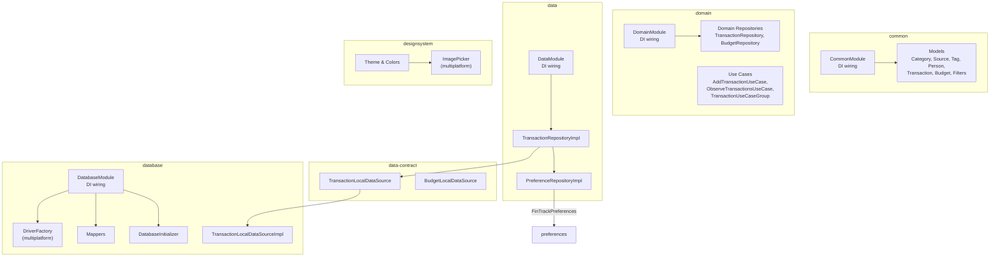
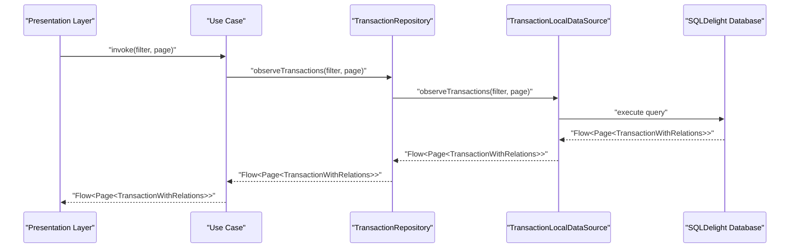
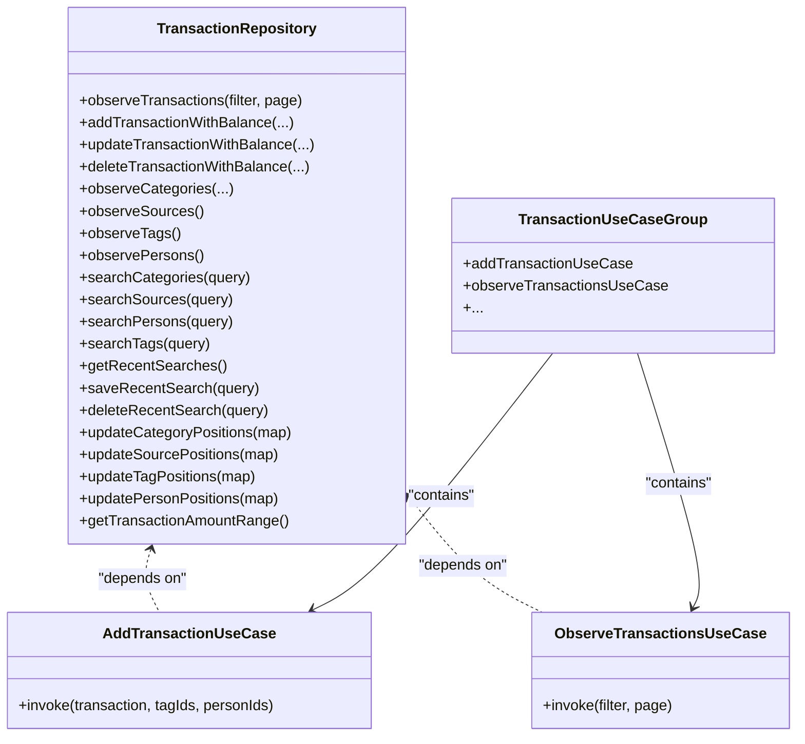
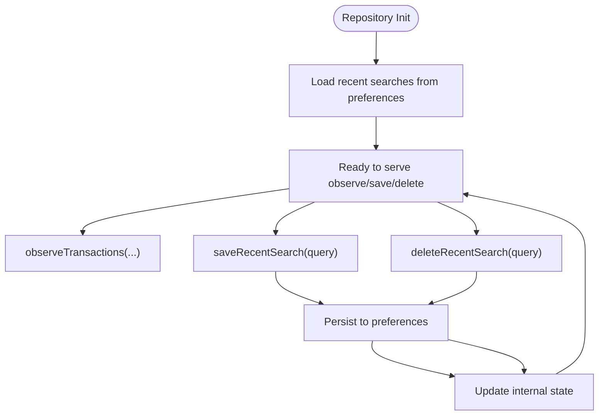
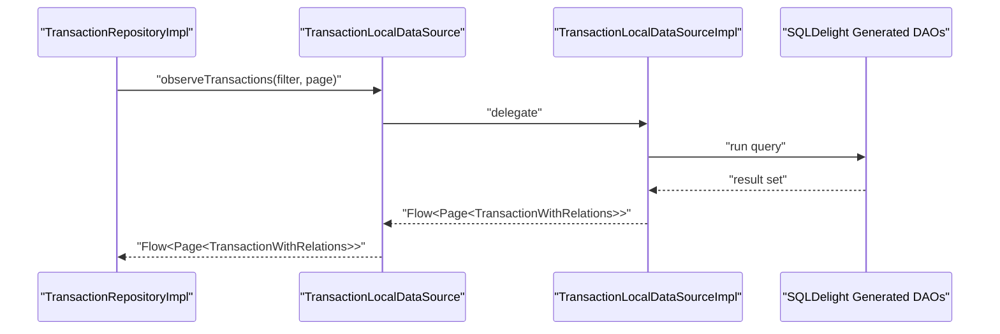
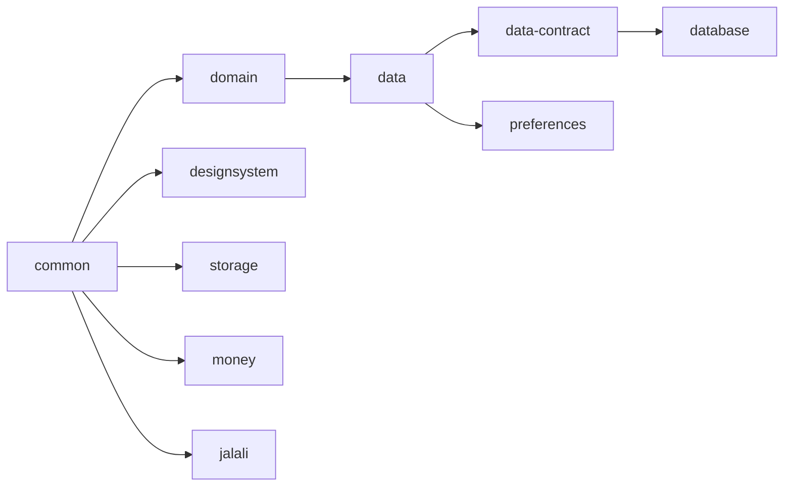

# Core Modules

<cite>
**Referenced Files in This Document**
- [Budget.kt](file://core/common/src/commonMain/kotlin/com/kazemieh/common/model/Budget.kt)
- [Category.kt](file://core/common/src/commonMain/kotlin/com/kazemieh/common/model/Category.kt)
- [Transaction.kt](file://core/common/src/commonMain/kotlin/com/kazemieh/common/model/Transaction.kt)
- [Person.kt](file://core/common/src/commonMain/kotlin/com/kazemieh/common/model/Person.kt)
- [Tag.kt](file://core/common/src/commonMain/kotlin/com/kazemieh/common/model/Tag.kt)
- [Source.kt](file://core/common/src/commonMain/kotlin/com/kazemieh/common/model/Source.kt)
- [TransactionFilterParams.kt](file://core/common/src/commonMain/kotlin/com/kazemieh/common/model/TransactionFilterParams.kt)
- [TransactionWithRelations.kt](file://core/common/src/commonMain/kotlin/com/kazemieh/common/model/TransactionWithRelations.kt)
- [CommonModule.kt](file://core/common/src/commonMain/kotlin/com/kazemieh/common/di/CommonModule.kt)
- [CommonModule.android.kt](file://core/common/src/androidMain/kotlin/com/kazemieh/common/di/CommonModule.android.kt)
- [CommonModule.ios.kt](file://core/common/src/iosMain/kotlin/com/kazemieh/common/di/CommonModule.ios.kt)
- [CommonModule.js.kt](file://core/common/src/jsMain/kotlin/com/kazemieh/common/di/CommonModule.js.kt)
- [CommonModule.jvm.kt](file://core/common/src/jvmMain/kotlin/com/kazemieh/common/di/CommonModule.jvm.kt)
- [DomainModule.kt](file://core/domain/src/commonMain/kotlin/com/kazemieh/domain/di/DomainModule.kt)
- [BudgetRepository.kt](file://core/domain/src/commonMain/kotlin/com/kazemieh/domain/repository/BudgetRepository.kt)
- [TransactionRepository.kt](file://core/domain/src/commonMain/kotlin/com/kazemieh/domain/repository/TransactionRepository.kt)
- [AddTransactionUseCase.kt](file://core/domain/src/commonMain/kotlin/com/kazemieh/domain/usecase/AddTransactionUseCase.kt)
- [ObserveTransactionsUseCase.kt](file://core/domain/src/commonMain/kotlin/com/kazemieh/domain/usecase/ObserveTransactionsUseCase.kt)
- [TransactionUseCaseGroup.kt](file://core/domain/src/commonMain/kotlin/com/kazemieh/domain/usecase/TransactionUseCaseGroup.kt)
- [balanceImpact.kt](file://core/domain/src/commonMain/kotlin/com/kazemieh/domain/util/balanceImpact.kt)
- [DataModule.kt](file://core/data/src/commonMain/kotlin/com/kazemieh/data/di/DataModule.kt)
- [TransactionRepositoryImpl.kt](file://core/data/src/commonMain/kotlin/com/kazemieh/data/repository/TransactionRepositoryImpl.kt)
- [PreferenceRepositoryImpl.kt](file://core/data/src/commonMain/kotlin/com/kazemieh/data/repository/PreferenceRepositoryImpl.kt)
- [TransactionLocalDataSource.kt](file://core/data-contract/src/commonMain/kotlin/com/kazemieh/data_contract/datasource/TransactionLocalDataSource.kt)
- [BudgetLocalDataSource.kt](file://core/data-contract/src/commonMain/kotlin/com/kazemieh/data_contract/datasource/BudgetLocalDataSource.kt)
- [DatabaseModule.kt](file://core/database/src/commonMain/kotlin/com/kazemieh/database/di/DatabaseModule.kt)
- [DriverFactory.kt](file://core/database/src/commonMain/kotlin/com/kazemieh/database/DriverFactory.kt)
- [DriverFactory.android.kt](file://core/database/src/androidMain/kotlin/com/kazemieh/database/DriverFactory.android.kt)
- [DriverFactory.ios.kt](file://core/database/src/iosMain/kotlin/com/kazemieh/database/DriverFactory.ios.kt)
- [DriverFactory.js.kt](file://core/database/src/jsMain/kotlin/com/kazemieh/database/DriverFactory.js.kt)
- [DriverFactory.jvm.kt](file://core/database/src/jvmMain/kotlin/com/kazemieh/database/DriverFactory.jvm.kt)
- [TransactionLocalDataSourceImpl.kt](file://core/database/src/commonMain/kotlin/com/kazemieh/database/datasource/TransactionLocalDataSourceImpl.kt)
- [Mappers.kt](file://core/database/src/commonMain/kotlin/com/kazemieh/database/mapper/Mappers.kt)
- [DatabaseInitializer.kt](file://core/database/src/commonMain/kotlin/com/kazemieh/database/DatabaseInitializer.kt)
- [AppTheme.kt](file://core/designsystem/src/commonMain/kotlin/com/kazemieh/designsystem/AppTheme.kt)
- [Color.kt](file://core/designsystem/src/commonMain/kotlin/com/kazemieh/designsystem/Color.kt)
- [Dimensions.kt](file://core/designsystem/src/commonMain/kotlin/com/kazemieh/designsystem/Dimensions.kt)
- [Theme.kt](file://core/designsystem/src/commonMain/kotlin/com/kazemieh/designsystem/Theme.kt)
- [CurrencyProvider.kt](file://core/designsystem/src/commonMain/kotlin/com/kazemieh/designsystem/CurrencyProvider.kt)
- [ImagePicker.android.kt](file://core/designsystem/src/androidMain/kotlin/com/kazemieh/designsystem/component/picker/ImagePicker.android.kt)
- [ImagePicker.ios.kt](file://core/designsystem/src/iosMain/kotlin/com/kazemieh/designsystem/component/picker/ImagePicker.ios.kt)
- [ImagePicker.js.kt](file://core/designsystem/src/jsMain/kotlin/com/kazemieh/designsystem/component/picker/ImagePicker.js.kt)
- [ImagePicker.jvm.kt](file://core/designsystem/src/jvmMain/kotlin/com/kazemieh/designsystem/component/picker/ImagePicker.jvm.kt)
- [ImageStorage.kt](file://core/common/src/commonMain/kotlin/com/kazemieh/common/ImageStorage.kt)
- [ImageStorageImpl.kt](file://core/storage/src/commonMain/kotlin/com/kazemieh/storage/ImageStorageImpl.kt)
- [ImageStorageImpl.android.kt](file://core/storage/src/androidMain/kotlin/com/kazemieh/storage/ImageStorageImpl.android.kt)
- [ImageStorageImpl.ios.kt](file://core/storage/src/iosMain/kotlin/com/kazemieh/storage/ImageStorageImpl.ios.kt)
- [ImageStorageImpl.js.kt](file://core/storage/src/jsMain/kotlin/com/kazemieh/storage/ImageStorageImpl.js.kt)
- [ImageStorageImpl.jvm.kt](file://core/storage/src/jvmMain/kotlin/com/kazemieh/storage/ImageStorageImpl.jvm.kt)
- [FinTrackPreferences.kt](file://core/preferences/src/commonMain/kotlin/com/kazemieh/preferences/FinTrackPreferences.kt)
- [SettingsObserver.kt](file://core/preferences/src/commonMain/kotlin/com/kazemieh/preferences/SettingsObserver.kt)
- [preferencesModule.kt](file://core/preferences/src/commonMain/kotlin/com/kazemieh/preferences/preferencesModule.kt)
- [MoneyFormatter.kt](file://core/money/src/commonMain/kotlin/com/kazemieh/money/MoneyFormatter.kt)
- [Currency.kt](file://core/money/src/commonMain/kotlin/com/kazemieh/money/Currency.kt)
- [JalaliCalendar.kt](file://core/jalali/src/commonMain/kotlin/com/kazemieh/jalali/JalaliCalendar.kt)
</cite>

## Table of Contents
1. [Introduction](#introduction)
2. [Project Structure](#project-structure)
3. [Core Components](#core-components)
4. [Architecture Overview](#architecture-overview)
5. [Detailed Component Analysis](#detailed-component-analysis)
6. [Dependency Analysis](#dependency-analysis)
7. [Performance Considerations](#performance-considerations)
8. [Troubleshooting Guide](#troubleshooting-guide)
9. [Conclusion](#conclusion)
10. [Appendices](#appendices)

## Introduction
This document explains FinTrack’s core module organization and how shared modules form the application’s foundation. It covers the responsibilities and implementation details of:
- common: Shared models, utilities, and platform-specific DI wiring
- domain: Business logic and use cases
- data: Data layer implementation and repository wiring
- data-contract: Local data source contracts
- database: Local persistence via SQLDelight and platform drivers
- designsystem: UI components, theming, and cross-platform resource providers

It also documents configuration options, dependency injection patterns, and multiplatform considerations, and illustrates module interactions with practical sequences and diagrams.

## Project Structure
FinTrack organizes functionality into cohesive Kotlin Multiplatform modules. The core modules are:
- common: Cross-platform models and utilities
- domain: Use cases and repositories interfaces
- data: Repository implementations and DI wiring
- data-contract: Local data source contracts
- database: SQLDelight schema, DAOs, mappers, and driver factories
- designsystem: Compose UI primitives, theme, and platform pickers
- storage: Image storage abstraction and implementations
- preferences: Settings and observers
- money: Currency and formatting utilities
- jalali: Calendar utilities

**Diagram sources**
- [CommonModule.kt](file://core/common/src/commonMain/kotlin/com/kazemieh/common/di/CommonModule.kt)
- [DomainModule.kt](file://core/domain/src/commonMain/kotlin/com/kazemieh/domain/di/DomainModule.kt)
- [DataModule.kt](file://core/data/src/commonMain/kotlin/com/kazemieh/data/di/DataModule.kt)
- [TransactionRepositoryImpl.kt](file://core/data/src/commonMain/kotlin/com/kazemieh/data/repository/TransactionRepositoryImpl.kt)
- [PreferenceRepositoryImpl.kt](file://core/data/src/commonMain/kotlin/com/kazemieh/data/repository/PreferenceRepositoryImpl.kt)
- [TransactionLocalDataSource.kt](file://core/data-contract/src/commonMain/kotlin/com/kazemieh/data_contract/datasource/TransactionLocalDataSource.kt)
- [DatabaseModule.kt](file://core/database/src/commonMain/kotlin/com/kazemieh/database/di/DatabaseModule.kt)
- [DriverFactory.kt](file://core/database/src/commonMain/kotlin/com/kazemieh/database/DriverFactory.kt)
- [TransactionLocalDataSourceImpl.kt](file://core/database/src/commonMain/kotlin/com/kazemieh/database/datasource/TransactionLocalDataSourceImpl.kt)
- [Mappers.kt](file://core/database/src/commonMain/kotlin/com/kazemieh/database/mapper/Mappers.kt)
- [DatabaseInitializer.kt](file://core/database/src/commonMain/kotlin/com/kazemieh/database/DatabaseInitializer.kt)
- [Theme.kt](file://core/designsystem/src/commonMain/kotlin/com/kazemieh/designsystem/Theme.kt)
- [ImagePicker.android.kt](file://core/designsystem/src/androidMain/kotlin/com/kazemieh/designsystem/component/picker/ImagePicker.android.kt)

**Section sources**
- [CommonModule.kt](file://core/common/src/commonMain/kotlin/com/kazemieh/common/di/CommonModule.kt)
- [DomainModule.kt](file://core/domain/src/commonMain/kotlin/com/kazemieh/domain/di/DomainModule.kt)
- [DataModule.kt](file://core/data/src/commonMain/kotlin/com/kazemieh/data/di/DataModule.kt)
- [DatabaseModule.kt](file://core/database/src/commonMain/kotlin/com/kazemieh/database/di/DatabaseModule.kt)

## Core Components
This section describes each core module’s purpose, responsibilities, and key elements.

- common
  - Purpose: Provide shared models, serialization-friendly data classes, and platform-specific DI wiring for the rest of the app.
  - Responsibilities:
    - Define cross-platform models for transactions, categories, sources, tags, persons, budgets, filters, and relations.
    - Offer utilities such as image storage abstractions and logging helpers.
    - Provide DI modules per platform to wire platform-specific implementations.
  - Key files:
    - Models: [Budget.kt](file://core/common/src/commonMain/kotlin/com/kazemieh/common/model/Budget.kt), [Category.kt](file://core/common/src/commonMain/kotlin/com/kazemieh/common/model/Category.kt), [Transaction.kt](file://core/common/src/commonMain/kotlin/com/kazemieh/common/model/Transaction.kt), [Person.kt](file://core/common/src/commonMain/kotlin/com/kazemieh/common/model/Person.kt), [Tag.kt](file://core/common/src/commonMain/kotlin/com/kazemieh/common/model/Tag.kt), [Source.kt](file://core/common/src/commonMain/kotlin/com/kazemieh/common/model/Source.kt), [TransactionFilterParams.kt](file://core/common/src/commonMain/kotlin/com/kazemieh/common/model/TransactionFilterParams.kt), [TransactionWithRelations.kt](file://core/common/src/commonMain/kotlin/com/kazemieh/common/model/TransactionWithRelations.kt)
    - DI: [CommonModule.kt](file://core/common/src/commonMain/kotlin/com/kazemieh/common/di/CommonModule.kt), [CommonModule.android.kt](file://core/common/src/androidMain/kotlin/com/kazemieh/common/di/CommonModule.android.kt), [CommonModule.ios.kt](file://core/common/src/iosMain/kotlin/com/kazemieh/common/di/CommonModule.ios.kt), [CommonModule.js.kt](file://core/common/src/jsMain/kotlin/com/kazemieh/common/di/CommonModule.js.kt), [CommonModule.jvm.kt](file://core/common/src/jvmMain/kotlin/com/kazemieh/common/di/CommonModule.jvm.kt)
    - Utilities: [ImageStorage.kt](file://core/common/src/commonMain/kotlin/com/kazemieh/common/ImageStorage.kt)

- domain
  - Purpose: Encapsulate business logic and orchestrate use cases without binding to data sources.
  - Responsibilities:
    - Define repository interfaces for transactions, budgets, and preferences.
    - Provide use cases for CRUD operations, observations, and analytics-like queries.
    - Compute balance impacts for financial operations.
  - Key files:
    - Repositories: [TransactionRepository.kt](file://core/domain/src/commonMain/kotlin/com/kazemieh/domain/repository/TransactionRepository.kt), [BudgetRepository.kt](file://core/domain/src/commonMain/kotlin/com/kazemieh/domain/repository/BudgetRepository.kt)
    - Use cases: [AddTransactionUseCase.kt](file://core/domain/src/commonMain/kotlin/com/kazemieh/domain/usecase/AddTransactionUseCase.kt), [ObserveTransactionsUseCase.kt](file://core/domain/src/commonMain/kotlin/com/kazemieh/domain/usecase/ObserveTransactionsUseCase.kt), [TransactionUseCaseGroup.kt](file://core/domain/src/commonMain/kotlin/com/kazemieh/domain/usecase/TransactionUseCaseGroup.kt)
    - Utilities: [balanceImpact.kt](file://core/domain/src/commonMain/kotlin/com/kazemieh/domain/util/balanceImpact.kt)
    - DI: [DomainModule.kt](file://core/domain/src/commonMain/kotlin/com/kazemieh/domain/di/DomainModule.kt)

- data
  - Purpose: Implement repositories and connect to local data sources via dependency injection.
  - Responsibilities:
    - Implement TransactionRepository and PreferenceRepository.
    - Delegate to TransactionLocalDataSource and FinTrackPreferences.
  - Key files:
    - Implementations: [TransactionRepositoryImpl.kt](file://core/data/src/commonMain/kotlin/com/kazemieh/data/repository/TransactionRepositoryImpl.kt), [PreferenceRepositoryImpl.kt](file://core/data/src/commonMain/kotlin/com/kazemieh/data/repository/PreferenceRepositoryImpl.kt)
    - DI: [DataModule.kt](file://core/data/src/commonMain/kotlin/com/kazemieh/data/di/DataModule.kt)

- data-contract
  - Purpose: Define contracts for local data sources to keep repositories platform-agnostic.
  - Responsibilities:
    - Specify method signatures for local operations (add/update/delete/observe/search/position updates).
  - Key files:
    - Contracts: [TransactionLocalDataSource.kt](file://core/data-contract/src/commonMain/kotlin/com/kazemieh/data_contract/datasource/TransactionLocalDataSource.kt), [BudgetLocalDataSource.kt](file://core/data-contract/src/commonMain/kotlin/com/kazemieh/data_contract/datasource/BudgetLocalDataSource.kt)

- database
  - Purpose: Provide local persistence using SQLDelight with platform-specific drivers.
  - Responsibilities:
    - Define SQLDelight schemas and DAOs.
    - Provide DriverFactory and DataSource implementations.
    - Expose mappers and initialize the database.
  - Key files:
    - DI: [DatabaseModule.kt](file://core/database/src/commonMain/kotlin/com/kazemieh/database/di/DatabaseModule.kt)
    - Drivers: [DriverFactory.kt](file://core/database/src/commonMain/kotlin/com/kazemieh/database/DriverFactory.kt), [DriverFactory.android.kt](file://core/database/src/androidMain/kotlin/com/kazemieh/database/DriverFactory.android.kt), [DriverFactory.ios.kt](file://core/database/src/iosMain/kotlin/com/kazemieh/database/DriverFactory.ios.kt), [DriverFactory.js.kt](file://core/database/src/jsMain/kotlin/com/kazemieh/database/DriverFactory.js.kt), [DriverFactory.jvm.kt](file://core/database/src/jvmMain/kotlin/com/kazemieh/database/DriverFactory.jvm.kt)
    - Implementation: [TransactionLocalDataSourceImpl.kt](file://core/database/src/commonMain/kotlin/com/kazemieh/database/datasource/TransactionLocalDataSourceImpl.kt)
    - Mappers: [Mappers.kt](file://core/database/src/commonMain/kotlin/com/kazemieh/database/mapper/Mappers.kt)
    - Initializer: [DatabaseInitializer.kt](file://core/database/src/commonMain/kotlin/com/kazemieh/database/DatabaseInitializer.kt)

- designsystem
  - Purpose: Provide reusable UI components, theming, typography, colors, and platform-specific pickers.
  - Responsibilities:
    - Centralize theme, colors, dimensions, shapes, and typography.
    - Offer platform-specific image pickers and currency provider.
  - Key files:
    - Theming: [Theme.kt](file://core/designsystem/src/commonMain/kotlin/com/kazemieh/designsystem/Theme.kt), [AppTheme.kt](file://core/designsystem/src/commonMain/kotlin/com/kazemieh/designsystem/AppTheme.kt), [Color.kt](file://core/designsystem/src/commonMain/kotlin/com/kazemieh/designsystem/Color.kt), [Dimensions.kt](file://core/designsystem/src/commonMain/kotlin/com/kazemieh/designsystem/Dimensions.kt), [CurrencyProvider.kt](file://core/designsystem/src/commonMain/kotlin/com/kazemieh/designsystem/CurrencyProvider.kt)
    - Pickers: [ImagePicker.android.kt](file://core/designsystem/src/androidMain/kotlin/com/kazemieh/designsystem/component/picker/ImagePicker.android.kt), [ImagePicker.ios.kt](file://core/designsystem/src/iosMain/kotlin/com/kazemieh/designsystem/component/picker/ImagePicker.ios.kt), [ImagePicker.js.kt](file://core/designsystem/src/jsMain/kotlin/com/kazemieh/designsystem/component/picker/ImagePicker.js.kt), [ImagePicker.jvm.kt](file://core/designsystem/src/jvmMain/kotlin/com/kazemieh/designsystem/component/picker/ImagePicker.jvm.kt)

- storage
  - Purpose: Abstract image storage across platforms.
  - Responsibilities:
    - Provide ImageStorage interface and platform-specific implementations.
  - Key files:
    - Abstraction: [ImageStorage.kt](file://core/common/src/commonMain/kotlin/com/kazemieh/common/ImageStorage.kt)
    - Implementations: [ImageStorageImpl.kt](file://core/storage/src/commonMain/kotlin/com/kazemieh/storage/ImageStorageImpl.kt), [ImageStorageImpl.android.kt](file://core/storage/src/androidMain/kotlin/com/kazemieh/storage/ImageStorageImpl.android.kt), [ImageStorageImpl.ios.kt](file://core/storage/src/iosMain/kotlin/com/kazemieh/storage/ImageStorageImpl.ios.kt), [ImageStorageImpl.js.kt](file://core/storage/src/jsMain/kotlin/com/kazemieh/storage/ImageStorageImpl.js.kt), [ImageStorageImpl.jvm.kt](file://core/storage/src/jvmMain/kotlin/com/kazemieh/storage/ImageStorageImpl.jvm.kt)

- preferences
  - Purpose: Manage persistent settings and observe changes.
  - Responsibilities:
    - Provide typed getters/setters and Flow-based observers.
  - Key files:
    - [FinTrackPreferences.kt](file://core/preferences/src/commonMain/kotlin/com/kazemieh/preferences/FinTrackPreferences.kt), [SettingsObserver.kt](file://core/preferences/src/commonMain/kotlin/com/kazemieh/preferences/SettingsObserver.kt), [preferencesModule.kt](file://core/preferences/src/commonMain/kotlin/com/kazemieh/preferences/preferencesModule.kt)

- money
  - Purpose: Provide currency and formatting utilities.
  - Responsibilities:
    - Offer currency constants and formatter helpers.
  - Key files:
    - [MoneyFormatter.kt](file://core/money/src/commonMain/kotlin/com/kazemieh/money/MoneyFormatter.kt), [Currency.kt](file://core/money/src/commonMain/kotlin/com/kazemieh/money/Currency.kt)

- jalali
  - Purpose: Provide Jalali calendar utilities.
  - Responsibilities:
    - Offer calendar conversions and helpers.
  - Key files:
    - [JalaliCalendar.kt](file://core/jalali/src/commonMain/kotlin/com/kazemieh/jalali/JalaliCalendar.kt)

**Section sources**
- [CommonModule.kt](file://core/common/src/commonMain/kotlin/com/kazemieh/common/di/CommonModule.kt)
- [DomainModule.kt](file://core/domain/src/commonMain/kotlin/com/kazemieh/domain/di/DomainModule.kt)
- [DataModule.kt](file://core/data/src/commonMain/kotlin/com/kazemieh/data/di/DataModule.kt)
- [TransactionRepositoryImpl.kt](file://core/data/src/commonMain/kotlin/com/kazemieh/data/repository/TransactionRepositoryImpl.kt)
- [PreferenceRepositoryImpl.kt](file://core/data/src/commonMain/kotlin/com/kazemieh/data/repository/PreferenceRepositoryImpl.kt)
- [TransactionLocalDataSource.kt](file://core/data-contract/src/commonMain/kotlin/com/kazemieh/data_contract/datasource/TransactionLocalDataSource.kt)
- [BudgetLocalDataSource.kt](file://core/data-contract/src/commonMain/kotlin/com/kazemieh/data_contract/datasource/BudgetLocalDataSource.kt)
- [DatabaseModule.kt](file://core/database/src/commonMain/kotlin/com/kazemieh/database/di/DatabaseModule.kt)
- [DriverFactory.kt](file://core/database/src/commonMain/kotlin/com/kazemieh/database/DriverFactory.kt)
- [TransactionLocalDataSourceImpl.kt](file://core/database/src/commonMain/kotlin/com/kazemieh/database/datasource/TransactionLocalDataSourceImpl.kt)
- [Mappers.kt](file://core/database/src/commonMain/kotlin/com/kazemieh/database/mapper/Mappers.kt)
- [DatabaseInitializer.kt](file://core/database/src/commonMain/kotlin/com/kazemieh/database/DatabaseInitializer.kt)
- [Theme.kt](file://core/designsystem/src/commonMain/kotlin/com/kazemieh/designsystem/Theme.kt)
- [ImagePicker.android.kt](file://core/designsystem/src/androidMain/kotlin/com/kazemieh/designsystem/component/picker/ImagePicker.android.kt)
- [ImageStorage.kt](file://core/common/src/commonMain/kotlin/com/kazemieh/common/ImageStorage.kt)
- [ImageStorageImpl.kt](file://core/storage/src/commonMain/kotlin/com/kazemieh/storage/ImageStorageImpl.kt)
- [FinTrackPreferences.kt](file://core/preferences/src/commonMain/kotlin/com/kazemieh/preferences/FinTrackPreferences.kt)
- [SettingsObserver.kt](file://core/preferences/src/commonMain/kotlin/com/kazemieh/preferences/SettingsObserver.kt)
- [MoneyFormatter.kt](file://core/money/src/commonMain/kotlin/com/kazemieh/money/MoneyFormatter.kt)
- [JalaliCalendar.kt](file://core/jalali/src/commonMain/kotlin/com/kazemieh/jalali/JalaliCalendar.kt)

## Architecture Overview
FinTrack follows Clean Architecture with a repository pattern and dependency injection. The flow is:
- Presentation requests data via use cases
- Use cases call repositories
- Repositories delegate to local data sources
- Local data sources interact with SQLDelight-generated DAOs and drivers
- Preferences and storage are injected via DI

**Diagram sources**
- [ObserveTransactionsUseCase.kt](file://core/domain/src/commonMain/kotlin/com/kazemieh/domain/usecase/ObserveTransactionsUseCase.kt)
- [TransactionRepository.kt](file://core/domain/src/commonMain/kotlin/com/kazemieh/domain/repository/TransactionRepository.kt)
- [TransactionRepositoryImpl.kt](file://core/data/src/commonMain/kotlin/com/kazemieh/data/repository/TransactionRepositoryImpl.kt)
- [TransactionLocalDataSource.kt](file://core/data-contract/src/commonMain/kotlin/com/kazemieh/data_contract/datasource/TransactionLocalDataSource.kt)
- [TransactionLocalDataSourceImpl.kt](file://core/database/src/commonMain/kotlin/com/kazemieh/database/datasource/TransactionLocalDataSourceImpl.kt)

**Section sources**
- [TransactionRepository.kt](file://core/domain/src/commonMain/kotlin/com/kazemieh/domain/repository/TransactionRepository.kt)
- [TransactionRepositoryImpl.kt](file://core/data/src/commonMain/kotlin/com/kazemieh/data/repository/TransactionRepositoryImpl.kt)
- [TransactionLocalDataSource.kt](file://core/data-contract/src/commonMain/kotlin/com/kazemieh/data_contract/datasource/TransactionLocalDataSource.kt)
- [TransactionLocalDataSourceImpl.kt](file://core/database/src/commonMain/kotlin/com/kazemieh/database/datasource/TransactionLocalDataSourceImpl.kt)

## Detailed Component Analysis

### common: Shared Models and Utilities
- Purpose: Provide serialization-friendly models and utilities used across layers.
- Key models:
  - Budget and BudgetPeriod: [Budget.kt](file://core/common/src/commonMain/kotlin/com/kazemieh/common/model/Budget.kt)
  - Category and CategorySum: [Category.kt](file://core/common/src/commonMain/kotlin/com/kazemieh/common/model/Category.kt)
  - Transaction and TransactionType: [Transaction.kt](file://core/common/src/commonMain/kotlin/com/kazemieh/common/model/Transaction.kt)
  - Source: [Source.kt](file://core/common/src/commonMain/kotlin/com/kazemieh/common/model/Source.kt)
  - Tag and Person: [Tag.kt](file://core/common/src/commonMain/kotlin/com/kazemieh/common/model/Tag.kt), [Person.kt](file://core/common/src/commonMain/kotlin/com/kazemieh/common/model/Person.kt)
  - TransactionFilterParams and TransactionWithRelations: [TransactionFilterParams.kt](file://core/common/src/commonMain/kotlin/com/kazemieh/common/model/TransactionFilterParams.kt), [TransactionWithRelations.kt](file://core/common/src/commonMain/kotlin/com/kazemieh/common/model/TransactionWithRelations.kt)
- DI wiring per platform: [CommonModule.kt](file://core/common/src/commonMain/kotlin/com/kazemieh/common/di/CommonModule.kt), [CommonModule.android.kt](file://core/common/src/androidMain/kotlin/com/kazemieh/common/di/CommonModule.android.kt), [CommonModule.ios.kt](file://core/common/src/iosMain/kotlin/com/kazemieh/common/di/CommonModule.ios.kt), [CommonModule.js.kt](file://core/common/src/jsMain/kotlin/com/kazemieh/common/di/CommonModule.js.kt), [CommonModule.jvm.kt](file://core/common/src/jvmMain/kotlin/com/kazemieh/common/di/CommonModule.jvm.kt)
- Usage patterns:
  - Models are passed between domain and presentation layers.
  - Platform DI modules bind platform-specific implementations for storage and other services.

**Section sources**
- [Budget.kt](file://core/common/src/commonMain/kotlin/com/kazemieh/common/model/Budget.kt)
- [Category.kt](file://core/common/src/commonMain/kotlin/com/kazemieh/common/model/Category.kt)
- [Transaction.kt](file://core/common/src/commonMain/kotlin/com/kazemieh/common/model/Transaction.kt)
- [Source.kt](file://core/common/src/commonMain/kotlin/com/kazemieh/common/model/Source.kt)
- [Tag.kt](file://core/common/src/commonMain/kotlin/com/kazemieh/common/model/Tag.kt)
- [Person.kt](file://core/common/src/commonMain/kotlin/com/kazemieh/common/model/Person.kt)
- [TransactionFilterParams.kt](file://core/common/src/commonMain/kotlin/com/kazemieh/common/model/TransactionFilterParams.kt)
- [TransactionWithRelations.kt](file://core/common/src/commonMain/kotlin/com/kazemieh/common/model/TransactionWithRelations.kt)
- [CommonModule.kt](file://core/common/src/commonMain/kotlin/com/kazemieh/common/di/CommonModule.kt)

### domain: Business Logic and Use Cases
- Purpose: Encapsulate business rules and orchestrate operations without binding to data sources.
- Repositories:
  - TransactionRepository: [TransactionRepository.kt](file://core/domain/src/commonMain/kotlin/com/kazemieh/domain/repository/TransactionRepository.kt)
  - BudgetRepository: [BudgetRepository.kt](file://core/domain/src/commonMain/kotlin/com/kazemieh/domain/repository/BudgetRepository.kt)
- Use cases:
  - AddTransactionUseCase: [AddTransactionUseCase.kt](file://core/domain/src/commonMain/kotlin/com/kazemieh/domain/usecase/AddTransactionUseCase.kt)
  - ObserveTransactionsUseCase: [ObserveTransactionsUseCase.kt](file://core/domain/src/commonMain/kotlin/com/kazemieh/domain/usecase/ObserveTransactionsUseCase.kt)
  - TransactionUseCaseGroup: [TransactionUseCaseGroup.kt](file://core/domain/src/commonMain/kotlin/com/kazemieh/domain/usecase/TransactionUseCaseGroup.kt)
- Utilities:
  - balanceImpact: [balanceImpact.kt](file://core/domain/src/commonMain/kotlin/com/kazemieh/domain/util/balanceImpact.kt)
- DI wiring: [DomainModule.kt](file://core/domain/src/commonMain/kotlin/com/kazemieh/domain/di/DomainModule.kt)

**Diagram sources**
- [TransactionRepository.kt](file://core/domain/src/commonMain/kotlin/com/kazemieh/domain/repository/TransactionRepository.kt)
- [AddTransactionUseCase.kt](file://core/domain/src/commonMain/kotlin/com/kazemieh/domain/usecase/AddTransactionUseCase.kt)
- [ObserveTransactionsUseCase.kt](file://core/domain/src/commonMain/kotlin/com/kazemieh/domain/usecase/ObserveTransactionsUseCase.kt)
- [TransactionUseCaseGroup.kt](file://core/domain/src/commonMain/kotlin/com/kazemieh/domain/usecase/TransactionUseCaseGroup.kt)

**Section sources**
- [TransactionRepository.kt](file://core/domain/src/commonMain/kotlin/com/kazemieh/domain/repository/TransactionRepository.kt)
- [AddTransactionUseCase.kt](file://core/domain/src/commonMain/kotlin/com/kazemieh/domain/usecase/AddTransactionUseCase.kt)
- [ObserveTransactionsUseCase.kt](file://core/domain/src/commonMain/kotlin/com/kazemieh/domain/usecase/ObserveTransactionsUseCase.kt)
- [TransactionUseCaseGroup.kt](file://core/domain/src/commonMain/kotlin/com/kazemieh/domain/usecase/TransactionUseCaseGroup.kt)
- [balanceImpact.kt](file://core/domain/src/commonMain/kotlin/com/kazemieh/domain/util/balanceImpact.kt)

### data: Repository Implementations
- Purpose: Implement domain repositories and bridge to local data sources.
- Implementations:
  - TransactionRepositoryImpl: [TransactionRepositoryImpl.kt](file://core/data/src/commonMain/kotlin/com/kazemieh/data/repository/TransactionRepositoryImpl.kt)
  - PreferenceRepositoryImpl: [PreferenceRepositoryImpl.kt](file://core/data/src/commonMain/kotlin/com/kazemieh/data/repository/PreferenceRepositoryImpl.kt)
- DI wiring: [DataModule.kt](file://core/data/src/commonMain/kotlin/com/kazemieh/data/di/DataModule.kt)

**Diagram sources**
- [TransactionRepositoryImpl.kt](file://core/data/src/commonMain/kotlin/com/kazemieh/data/repository/TransactionRepositoryImpl.kt)
- [PreferenceRepositoryImpl.kt](file://core/data/src/commonMain/kotlin/com/kazemieh/data/repository/PreferenceRepositoryImpl.kt)

**Section sources**
- [TransactionRepositoryImpl.kt](file://core/data/src/commonMain/kotlin/com/kazemieh/data/repository/TransactionRepositoryImpl.kt)
- [PreferenceRepositoryImpl.kt](file://core/data/src/commonMain/kotlin/com/kazemieh/data/repository/PreferenceRepositoryImpl.kt)
- [DataModule.kt](file://core/data/src/commonMain/kotlin/com/kazemieh/data/di/DataModule.kt)

### data-contract: Local Data Source Contracts
- Purpose: Define contracts for local operations to keep repositories platform-agnostic.
- Contracts:
  - TransactionLocalDataSource: [TransactionLocalDataSource.kt](file://core/data-contract/src/commonMain/kotlin/com/kazemieh/data_contract/datasource/TransactionLocalDataSource.kt)
  - BudgetLocalDataSource: [BudgetLocalDataSource.kt](file://core/data-contract/src/commonMain/kotlin/com/kazemieh/data_contract/datasource/BudgetLocalDataSource.kt)

**Section sources**
- [TransactionLocalDataSource.kt](file://core/data-contract/src/commonMain/kotlin/com/kazemieh/data_contract/datasource/TransactionLocalDataSource.kt)
- [BudgetLocalDataSource.kt](file://core/data-contract/src/commonMain/kotlin/com/kazemieh/data_contract/datasource/BudgetLocalDataSource.kt)

### database: Local Persistence and Drivers
- Purpose: Provide SQLDelight-backed local persistence with platform-specific drivers.
- DI wiring: [DatabaseModule.kt](file://core/database/src/commonMain/kotlin/com/kazemieh/database/di/DatabaseModule.kt)
- Drivers: [DriverFactory.kt](file://core/database/src/commonMain/kotlin/com/kazemieh/database/DriverFactory.kt), platform-specific files under androidMain, iosMain, jsMain, jvmMain
- Implementation: [TransactionLocalDataSourceImpl.kt](file://core/database/src/commonMain/kotlin/com/kazemieh/database/datasource/TransactionLocalDataSourceImpl.kt)
- Mappers: [Mappers.kt](file://core/database/src/commonMain/kotlin/com/kazemieh/database/mapper/Mappers.kt)
- Initializer: [DatabaseInitializer.kt](file://core/database/src/commonMain/kotlin/com/kazemieh/database/DatabaseInitializer.kt)

**Diagram sources**
- [TransactionRepositoryImpl.kt](file://core/data/src/commonMain/kotlin/com/kazemieh/data/repository/TransactionRepositoryImpl.kt)
- [TransactionLocalDataSource.kt](file://core/data-contract/src/commonMain/kotlin/com/kazemieh/data_contract/datasource/TransactionLocalDataSource.kt)
- [TransactionLocalDataSourceImpl.kt](file://core/database/src/commonMain/kotlin/com/kazemieh/database/datasource/TransactionLocalDataSourceImpl.kt)

**Section sources**
- [DatabaseModule.kt](file://core/database/src/commonMain/kotlin/com/kazemieh/database/di/DatabaseModule.kt)
- [DriverFactory.kt](file://core/database/src/commonMain/kotlin/com/kazemieh/database/DriverFactory.kt)
- [TransactionLocalDataSourceImpl.kt](file://core/database/src/commonMain/kotlin/com/kazemieh/database/datasource/TransactionLocalDataSourceImpl.kt)
- [Mappers.kt](file://core/database/src/commonMain/kotlin/com/kazemieh/database/mapper/Mappers.kt)
- [DatabaseInitializer.kt](file://core/database/src/commonMain/kotlin/com/kazemieh/database/DatabaseInitializer.kt)

### designsystem: UI Components and Theming
- Purpose: Provide reusable UI primitives, theme, and platform-specific pickers.
- Theming:
  - Theme and AppTheme: [Theme.kt](file://core/designsystem/src/commonMain/kotlin/com/kazemieh/designsystem/Theme.kt), [AppTheme.kt](file://core/designsystem/src/commonMain/kotlin/com/kazemieh/designsystem/AppTheme.kt)
  - Color and Dimensions: [Color.kt](file://core/designsystem/src/commonMain/kotlin/com/kazemieh/designsystem/Color.kt), [Dimensions.kt](file://core/designsystem/src/commonMain/kotlin/com/kazemieh/designsystem/Dimensions.kt)
  - CurrencyProvider: [CurrencyProvider.kt](file://core/designsystem/src/commonMain/kotlin/com/kazemieh/designsystem/CurrencyProvider.kt)
- Platform pickers:
  - ImagePicker.*: [ImagePicker.android.kt](file://core/designsystem/src/androidMain/kotlin/com/kazemieh/designsystem/component/picker/ImagePicker.android.kt), [ImagePicker.ios.kt](file://core/designsystem/src/iosMain/kotlin/com/kazemieh/designsystem/component/picker/ImagePicker.ios.kt), [ImagePicker.js.kt](file://core/designsystem/src/jsMain/kotlin/com/kazemieh/designsystem/component/picker/ImagePicker.js.kt), [ImagePicker.jvm.kt](file://core/designsystem/src/jvmMain/kotlin/com/kazemieh/designsystem/component/picker/ImagePicker.jvm.kt)

**Section sources**
- [Theme.kt](file://core/designsystem/src/commonMain/kotlin/com/kazemieh/designsystem/Theme.kt)
- [AppTheme.kt](file://core/designsystem/src/commonMain/kotlin/com/kazemieh/designsystem/AppTheme.kt)
- [Color.kt](file://core/designsystem/src/commonMain/kotlin/com/kazemieh/designsystem/Color.kt)
- [Dimensions.kt](file://core/designsystem/src/commonMain/kotlin/com/kazemieh/designsystem/Dimensions.kt)
- [CurrencyProvider.kt](file://core/designsystem/src/commonMain/kotlin/com/kazemieh/designsystem/CurrencyProvider.kt)
- [ImagePicker.android.kt](file://core/designsystem/src/androidMain/kotlin/com/kazemieh/designsystem/component/picker/ImagePicker.android.kt)

### storage: Image Storage Abstraction
- Purpose: Abstract image storage across platforms.
- Abstraction: [ImageStorage.kt](file://core/common/src/commonMain/kotlin/com/kazemieh/common/ImageStorage.kt)
- Implementations: [ImageStorageImpl.kt](file://core/storage/src/commonMain/kotlin/com/kazemieh/storage/ImageStorageImpl.kt), platform-specific files under androidMain, iosMain, jsMain, jvmMain

**Section sources**
- [ImageStorage.kt](file://core/common/src/commonMain/kotlin/com/kazemieh/common/ImageStorage.kt)
- [ImageStorageImpl.kt](file://core/storage/src/commonMain/kotlin/com/kazemieh/storage/ImageStorageImpl.kt)
- [ImageStorageImpl.android.kt](file://core/storage/src/androidMain/kotlin/com/kazemieh/storage/ImageStorageImpl.android.kt)
- [ImageStorageImpl.ios.kt](file://core/storage/src/iosMain/kotlin/com/kazemieh/storage/ImageStorageImpl.ios.kt)
- [ImageStorageImpl.js.kt](file://core/storage/src/jsMain/kotlin/com/kazemieh/storage/ImageStorageImpl.js.kt)
- [ImageStorageImpl.jvm.kt](file://core/storage/src/jvmMain/kotlin/com/kazemieh/storage/ImageStorageImpl.jvm.kt)

### preferences: Settings and Observers
- Purpose: Provide typed settings and Flow-based observers for reactive UI.
- Files:
  - [FinTrackPreferences.kt](file://core/preferences/src/commonMain/kotlin/com/kazemieh/preferences/FinTrackPreferences.kt)
  - [SettingsObserver.kt](file://core/preferences/src/commonMain/kotlin/com/kazemieh/preferences/SettingsObserver.kt)
  - [preferencesModule.kt](file://core/preferences/src/commonMain/kotlin/com/kazemieh/preferences/preferencesModule.kt)

**Section sources**
- [FinTrackPreferences.kt](file://core/preferences/src/commonMain/kotlin/com/kazemieh/preferences/FinTrackPreferences.kt)
- [SettingsObserver.kt](file://core/preferences/src/commonMain/kotlin/com/kazemieh/preferences/SettingsObserver.kt)
- [preferencesModule.kt](file://core/preferences/src/commonMain/kotlin/com/kazemieh/preferences/preferencesModule.kt)

### money and jalali: Utilities
- money: [MoneyFormatter.kt](file://core/money/src/commonMain/kotlin/com/kazemieh/money/MoneyFormatter.kt), [Currency.kt](file://core/money/src/commonMain/kotlin/com/kazemieh/money/Currency.kt)
- jalali: [JalaliCalendar.kt](file://core/jalali/src/commonMain/kotlin/com/kazemieh/jalali/JalaliCalendar.kt)

**Section sources**
- [MoneyFormatter.kt](file://core/money/src/commonMain/kotlin/com/kazemieh/money/MoneyFormatter.kt)
- [Currency.kt](file://core/money/src/commonMain/kotlin/com/kazemieh/money/Currency.kt)
- [JalaliCalendar.kt](file://core/jalali/src/commonMain/kotlin/com/kazemieh/jalali/JalaliCalendar.kt)

## Dependency Analysis
This section maps dependencies among core modules and highlights coupling and cohesion.

**Diagram sources**
- [CommonModule.kt](file://core/common/src/commonMain/kotlin/com/kazemieh/common/di/CommonModule.kt)
- [DomainModule.kt](file://core/domain/src/commonMain/kotlin/com/kazemieh/domain/di/DomainModule.kt)
- [DataModule.kt](file://core/data/src/commonMain/kotlin/com/kazemieh/data/di/DataModule.kt)
- [TransactionLocalDataSource.kt](file://core/data-contract/src/commonMain/kotlin/com/kazemieh/data_contract/datasource/TransactionLocalDataSource.kt)
- [DatabaseModule.kt](file://core/database/src/commonMain/kotlin/com/kazemieh/database/di/DatabaseModule.kt)
- [Theme.kt](file://core/designsystem/src/commonMain/kotlin/com/kazemieh/designsystem/Theme.kt)
- [ImageStorage.kt](file://core/common/src/commonMain/kotlin/com/kazemieh/common/ImageStorage.kt)
- [FinTrackPreferences.kt](file://core/preferences/src/commonMain/kotlin/com/kazemieh/preferences/FinTrackPreferences.kt)
- [MoneyFormatter.kt](file://core/money/src/commonMain/kotlin/com/kazemieh/money/MoneyFormatter.kt)
- [JalaliCalendar.kt](file://core/jalali/src/commonMain/kotlin/com/kazemieh/jalali/JalaliCalendar.kt)

**Section sources**
- [TransactionRepositoryImpl.kt](file://core/data/src/commonMain/kotlin/com/kazemieh/data/repository/TransactionRepositoryImpl.kt)
- [TransactionLocalDataSource.kt](file://core/data-contract/src/commonMain/kotlin/com/kazemieh/data_contract/datasource/TransactionLocalDataSource.kt)
- [TransactionLocalDataSourceImpl.kt](file://core/database/src/commonMain/kotlin/com/kazemieh/database/datasource/TransactionLocalDataSourceImpl.kt)

## Performance Considerations
- Use cases compute balance impacts efficiently and delegate heavy work to repositories and data sources.
- Repository implementations expose Flow streams to avoid unnecessary recompositions and to support incremental updates.
- Local data sources leverage SQLDelight queries and mappers to minimize overhead.
- Preferences are cached in-memory and persisted periodically to reduce IO.

[No sources needed since this section provides general guidance]

## Troubleshooting Guide
- If observeTransactions does not emit:
  - Verify DI wiring for domain and data modules.
  - Ensure TransactionLocalDataSourceImpl is bound to the correct driver and schema.
- If recent searches are missing:
  - Confirm PreferenceRepositoryImpl is wired and preferences keys match.
- If images fail to load:
  - Check ImageStorage bindings in platform-specific DI modules.

**Section sources**
- [TransactionRepositoryImpl.kt](file://core/data/src/commonMain/kotlin/com/kazemieh/data/repository/TransactionRepositoryImpl.kt)
- [PreferenceRepositoryImpl.kt](file://core/data/src/commonMain/kotlin/com/kazemieh/data/repository/PreferenceRepositoryImpl.kt)
- [ImageStorageImpl.kt](file://core/storage/src/commonMain/kotlin/com/kazemieh/storage/ImageStorageImpl.kt)

## Conclusion
FinTrack’s core modules establish a clean separation of concerns:
- common defines shared models and utilities
- domain encapsulates business logic via use cases and repository interfaces
- data implements repositories and bridges to local data sources
- data-contract defines contracts for local operations
- database provides SQLDelight-backed persistence with platform drivers
- designsystem offers UI primitives and theming
- storage, preferences, money, and jalali provide supporting utilities

This structure enables multiplatform development, testability, and maintainability while keeping business rules centralized and data access pluggable.

[No sources needed since this section summarizes without analyzing specific files]

## Appendices
- Practical examples:
  - Adding a transaction:
    - Use case: [AddTransactionUseCase.kt](file://core/domain/src/commonMain/kotlin/com/kazemieh/domain/usecase/AddTransactionUseCase.kt)
    - Repository impl: [TransactionRepositoryImpl.kt](file://core/data/src/commonMain/kotlin/com/kazemieh/data/repository/TransactionRepositoryImpl.kt)
    - Local data source: [TransactionLocalDataSource.kt](file://core/data-contract/src/commonMain/kotlin/com/kazemieh/data_contract/datasource/TransactionLocalDataSource.kt)
    - Database impl: [TransactionLocalDataSourceImpl.kt](file://core/database/src/commonMain/kotlin/com/kazemieh/database/datasource/TransactionLocalDataSourceImpl.kt)
  - Observing transactions:
    - Use case: [ObserveTransactionsUseCase.kt](file://core/domain/src/commonMain/kotlin/com/kazemieh/domain/usecase/ObserveTransactionsUseCase.kt)
    - Repository impl: [TransactionRepositoryImpl.kt](file://core/data/src/commonMain/kotlin/com/kazemieh/data/repository/TransactionRepositoryImpl.kt)
    - Local data source: [TransactionLocalDataSource.kt](file://core/data-contract/src/commonMain/kotlin/com/kazemieh/data_contract/datasource/TransactionLocalDataSource.kt)
    - Database impl: [TransactionLocalDataSourceImpl.kt](file://core/database/src/commonMain/kotlin/com/kazemieh/database/datasource/TransactionLocalDataSourceImpl.kt)

[No sources needed since this section aggregates previously cited files]