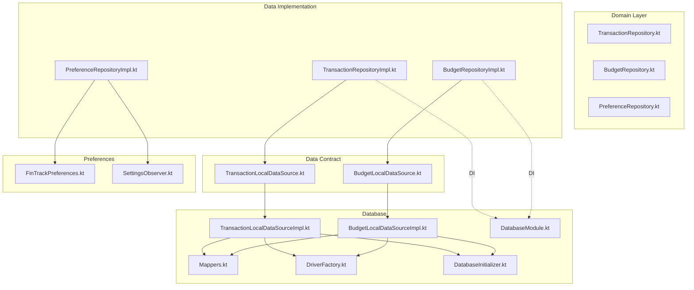
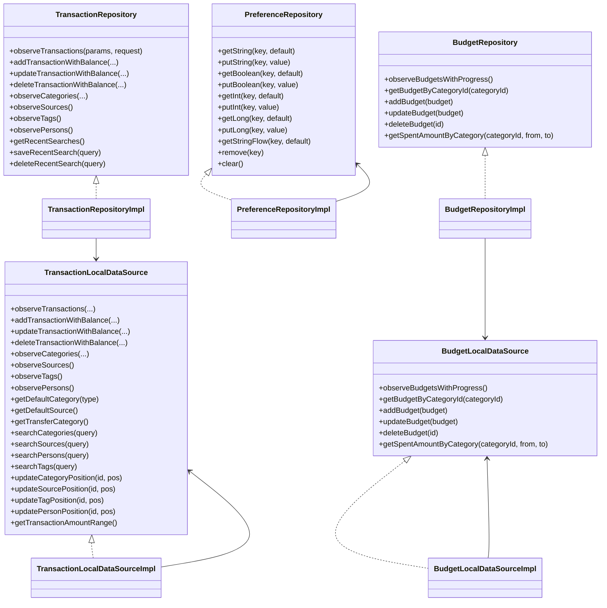
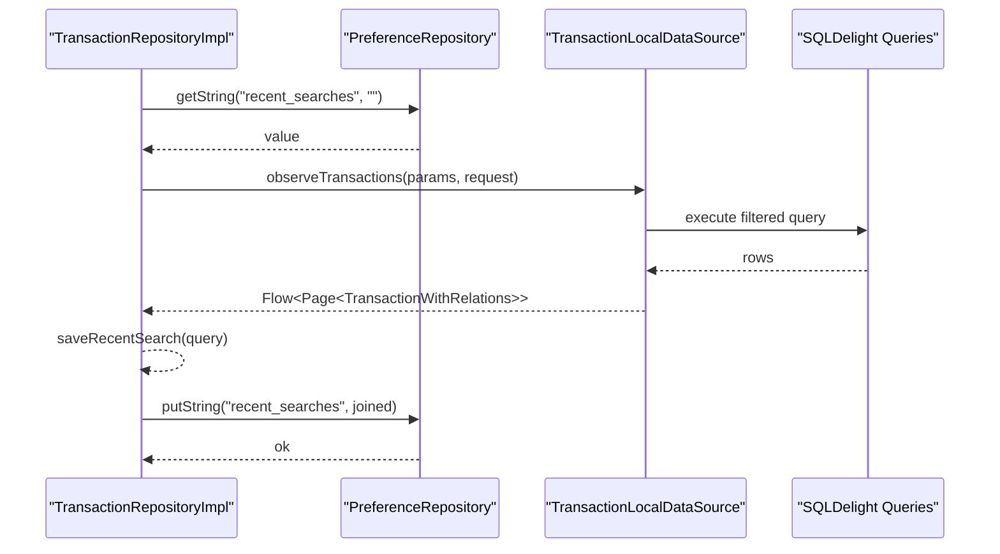
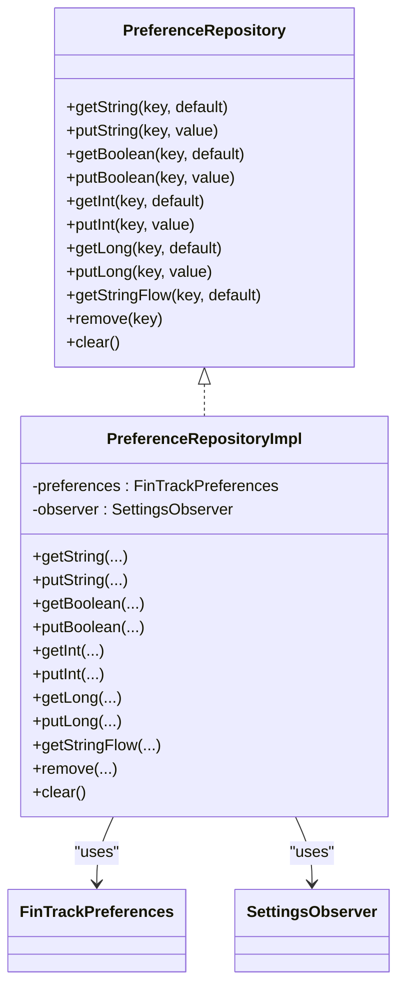
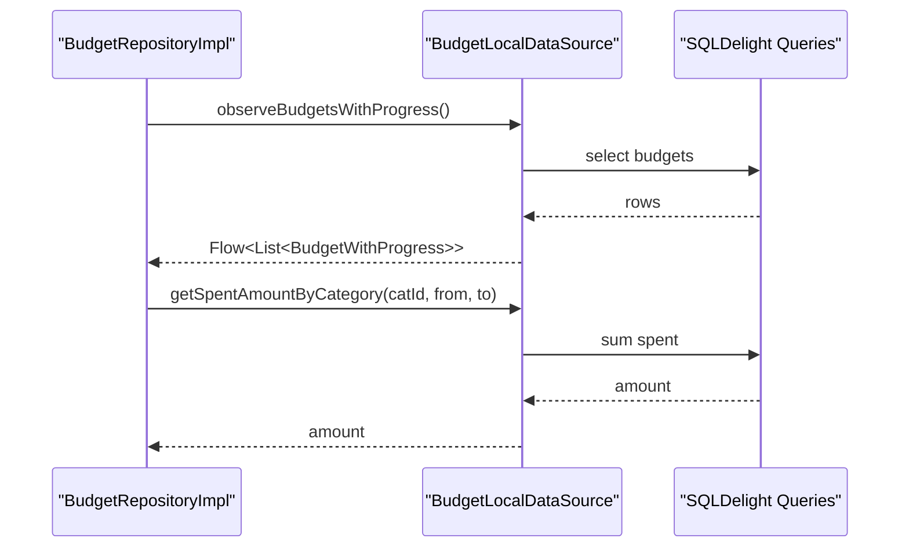
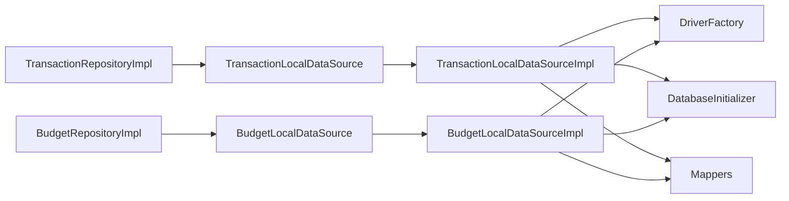
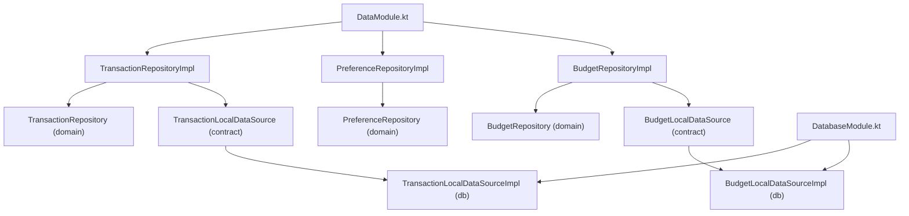

# Data Module

<cite>
**Referenced Files in This Document**
- [TransactionRepositoryImpl.kt](file://core/data/src/commonMain/kotlin/com/kazemieh/data/repository/TransactionRepositoryImpl.kt)
- [PreferenceRepositoryImpl.kt](file://core/data/src/commonMain/kotlin/com/kazemieh/data/repository/PreferenceRepositoryImpl.kt)
- [BudgetRepositoryImpl.kt](file://core/data/src/commonMain/kotlin/com/kazemieh/data/repository/BudgetRepositoryImpl.kt)
- [TransactionRepository.kt](file://core/domain/src/commonMain/kotlin/com/kazemieh/domain/repository/TransactionRepository.kt)
- [PreferenceRepository.kt](file://core/domain/src/commonMain/kotlin/com/kazemieh/domain/repository/PreferenceRepository.kt)
- [BudgetRepository.kt](file://core/domain/src/commonMain/kotlin/com/kazemieh/domain/repository/BudgetRepository.kt)
- [TransactionLocalDataSource.kt](file://core/data-contract/src/commonMain/kotlin/com/kazemieh/data_contract/datasource/TransactionLocalDataSource.kt)
- [BudgetLocalDataSource.kt](file://core/data-contract/src/commonMain/kotlin/com/kazemieh/data_contract/datasource/BudgetLocalDataSource.kt)
- [TransactionLocalDataSourceImpl.kt](file://core/database/src/commonMain/kotlin/com/kazemieh/database/datasource/TransactionLocalDataSourceImpl.kt)
- [BudgetLocalDataSourceImpl.kt](file://core/database/src/commonMain/kotlin/com/kazemieh/database/datasource/BudgetLocalDataSourceImpl.kt)
- [FinTrackPreferences.kt](file://core/preferences/src/commonMain/kotlin/com/kazemieh/preferences/FinTrackPreferences.kt)
- [SettingsObserver.kt](file://core/preferences/src/commonMain/kotlin/com/kazemieh/preferences/SettingsObserver.kt)
- [DataModule.kt](file://core/data/src/commonMain/kotlin/com/kazemieh/data/di/DataModule.kt)
- [DatabaseModule.kt](file://core/database/src/commonMain/kotlin/com/kazemieh/database/di/DatabaseModule.kt)
- [Mappers.kt](file://core/database/src/commonMain/kotlin/com/kazemieh/database/mapper/Mappers.kt)
- [DriverFactory.kt](file://core/database/src/commonMain/kotlin/com/kazemieh/database/DriverFactory.kt)
- [DatabaseInitializer.kt](file://core/database/src/commonMain/kotlin/com/kazemieh/database/DatabaseInitializer.kt)
</cite>

## Table of Contents
1. [Introduction](#introduction)
2. [Project Structure](#project-structure)
3. [Core Components](#core-components)
4. [Architecture Overview](#architecture-overview)
5. [Detailed Component Analysis](#detailed-component-analysis)
6. [Dependency Analysis](#dependency-analysis)
7. [Performance Considerations](#performance-considerations)
8. [Troubleshooting Guide](#troubleshooting-guide)
9. [Conclusion](#conclusion)

## Introduction
This document explains the Data module’s role in implementing repository interfaces defined in the domain layer. It focuses on the repository pattern, dependency inversion, and multiplatform data sources. The Data module translates domain contracts into concrete implementations backed by local data sources and SQLDelight database queries. It also documents error handling strategies, data source abstractions, and practical patterns for extending the data access layer.

## Project Structure
The Data module is organized around repositories that implement domain interfaces and delegate to local data sources. The data-contract module defines the local data source interfaces, while the database module provides concrete implementations using SQLDelight. Preferences are handled via a dedicated preferences module with observable flows.

**Diagram sources**
- [TransactionRepository.kt:1-94](file://core/domain/src/commonMain/kotlin/com/kazemieh/domain/repository/TransactionRepository.kt#L1-L94)
- [BudgetRepository.kt:1-15](file://core/domain/src/commonMain/kotlin/com/kazemieh/domain/repository/BudgetRepository.kt#L1-L15)
- [PreferenceRepository.kt:1-18](file://core/domain/src/commonMain/kotlin/com/kazemieh/domain/repository/PreferenceRepository.kt#L1-L18)
- [TransactionLocalDataSource.kt:1-87](file://core/data-contract/src/commonMain/kotlin/com/kazemieh/data_contract/datasource/TransactionLocalDataSource.kt#L1-L87)
- [BudgetLocalDataSource.kt:1-15](file://core/data-contract/src/commonMain/kotlin/com/kazemieh/data_contract/datasource/BudgetLocalDataSource.kt#L1-L15)
- [TransactionRepositoryImpl.kt:1-235](file://core/data/src/commonMain/kotlin/com/kazemieh/data/repository/TransactionRepositoryImpl.kt#L1-L235)
- [PreferenceRepositoryImpl.kt:1-24](file://core/data/src/commonMain/kotlin/com/kazemieh/data/repository/PreferenceRepositoryImpl.kt#L1-L24)
- [BudgetRepositoryImpl.kt:1-36](file://core/data/src/commonMain/kotlin/com/kazemieh/data/repository/BudgetRepositoryImpl.kt#L1-L36)
- [TransactionLocalDataSourceImpl.kt:1-576](file://core/database/src/commonMain/kotlin/com/kazemieh/database/datasource/TransactionLocalDataSourceImpl.kt#L1-L576)
- [BudgetLocalDataSourceImpl.kt:1-113](file://core/database/src/commonMain/kotlin/com/kazemieh/database/datasource/BudgetLocalDataSourceImpl.kt#L1-L113)
- [FinTrackPreferences.kt:1-51](file://core/preferences/src/commonMain/kotlin/com/kazemieh/preferences/FinTrackPreferences.kt#L1-L51)
- [SettingsObserver.kt:1-26](file://core/preferences/src/commonMain/kotlin/com/kazemieh/preferences/SettingsObserver.kt#L1-L26)
- [DatabaseModule.kt](file://core/database/src/commonMain/kotlin/com/kazemieh/database/di/DatabaseModule.kt)
- [Mappers.kt](file://core/database/src/commonMain/kotlin/com/kazemieh/database/mapper/Mappers.kt)
- [DriverFactory.kt](file://core/database/src/commonMain/kotlin/com/kazemieh/database/DriverFactory.kt)
- [DatabaseInitializer.kt](file://core/database/src/commonMain/kotlin/com/kazemieh/database/DatabaseInitializer.kt)

**Section sources**
- [DataModule.kt:1-16](file://core/data/src/commonMain/kotlin/com/kazemieh/data/di/DataModule.kt#L1-L16)
- [DatabaseModule.kt](file://core/database/src/commonMain/kotlin/com/kazemieh/database/di/DatabaseModule.kt)

## Core Components
- TransactionRepositoryImpl: Implements the domain TransactionRepository interface and delegates to a TransactionLocalDataSource. It also manages recent searches via PreferenceRepository and exposes flows for UI observation.
- PreferenceRepositoryImpl: Implements the domain PreferenceRepository interface using FinTrackPreferences and SettingsObserver for reactive preferences.
- BudgetRepositoryImpl: Implements the domain BudgetRepository interface and delegates to BudgetLocalDataSource.

These repositories exemplify dependency inversion by depending on interfaces (domain and data-contract) rather than concrete implementations, enabling testability and multiplatform data sources.

**Section sources**
- [TransactionRepositoryImpl.kt:22-235](file://core/data/src/commonMain/kotlin/com/kazemieh/data/repository/TransactionRepositoryImpl.kt#L22-L235)
- [PreferenceRepositoryImpl.kt:8-24](file://core/data/src/commonMain/kotlin/com/kazemieh/data/repository/PreferenceRepositoryImpl.kt#L8-L24)
- [BudgetRepositoryImpl.kt:9-36](file://core/data/src/commonMain/kotlin/com/kazemieh/data/repository/BudgetRepositoryImpl.kt#L9-L36)
- [TransactionRepository.kt:16-94](file://core/domain/src/commonMain/kotlin/com/kazemieh/domain/repository/TransactionRepository.kt#L16-L94)
- [PreferenceRepository.kt:5-18](file://core/domain/src/commonMain/kotlin/com/kazemieh/domain/repository/PreferenceRepository.kt#L5-L18)
- [BudgetRepository.kt:7-15](file://core/domain/src/commonMain/kotlin/com/kazemieh/domain/repository/BudgetRepository.kt#L7-L15)

## Architecture Overview
The Data module adheres to layered architecture:
- Domain layer defines repository interfaces and use cases.
- Data-contract layer defines local data source interfaces.
- Data layer implements repositories and depends on local data sources.
- Database layer implements local data sources using SQLDelight.
- Preferences layer provides reactive settings.

**Diagram sources**
- [TransactionRepository.kt:16-94](file://core/domain/src/commonMain/kotlin/com/kazemieh/domain/repository/TransactionRepository.kt#L16-L94)
- [PreferenceRepository.kt:5-18](file://core/domain/src/commonMain/kotlin/com/kazemieh/domain/repository/PreferenceRepository.kt#L5-L18)
- [BudgetRepository.kt:7-15](file://core/domain/src/commonMain/kotlin/com/kazemieh/domain/repository/BudgetRepository.kt#L7-L15)
- [TransactionLocalDataSource.kt:16-87](file://core/data-contract/src/commonMain/kotlin/com/kazemieh/data_contract/datasource/TransactionLocalDataSource.kt#L16-L87)
- [BudgetLocalDataSource.kt:7-15](file://core/data-contract/src/commonMain/kotlin/com/kazemieh/data_contract/datasource/BudgetLocalDataSource.kt#L7-L15)
- [TransactionRepositoryImpl.kt:22-235](file://core/data/src/commonMain/kotlin/com/kazemieh/data/repository/TransactionRepositoryImpl.kt#L22-L235)
- [PreferenceRepositoryImpl.kt:8-24](file://core/data/src/commonMain/kotlin/com/kazemieh/data/repository/PreferenceRepositoryImpl.kt#L8-L24)
- [BudgetRepositoryImpl.kt:9-36](file://core/data/src/commonMain/kotlin/com/kazemieh/data/repository/BudgetRepositoryImpl.kt#L9-L36)
- [TransactionLocalDataSourceImpl.kt:33-576](file://core/database/src/commonMain/kotlin/com/kazemieh/database/datasource/TransactionLocalDataSourceImpl.kt#L33-L576)
- [BudgetLocalDataSourceImpl.kt:18-113](file://core/database/src/commonMain/kotlin/com/kazemieh/database/datasource/BudgetLocalDataSourceImpl.kt#L18-L113)

## Detailed Component Analysis

### TransactionRepositoryImpl
Purpose:
- Implements TransactionRepository from the domain layer.
- Delegates database operations to TransactionLocalDataSource.
- Manages recent searches using PreferenceRepository and exposes them as a Flow.

Key behaviors:
- Observes transactions with filtering and pagination.
- Provides category sums aggregation.
- CRUD operations for categories, sources, tags, and persons.
- Default entity retrieval helpers (default category, transfer category, default source).
- Most-used entities observation and search APIs.
- Position updates for ordering persistence.
- Amount range retrieval.

Error handling:
- Throws exceptions when updates fail to verify database state (e.g., missing records after update).
- Uses transactions for multi-step operations to maintain consistency.

**Diagram sources**
- [TransactionRepositoryImpl.kt:29-85](file://core/data/src/commonMain/kotlin/com/kazemieh/data/repository/TransactionRepositoryImpl.kt#L29-L85)
- [TransactionLocalDataSourceImpl.kt:46-81](file://core/database/src/commonMain/kotlin/com/kazemieh/database/datasource/TransactionLocalDataSourceImpl.kt#L46-L81)
- [FinTrackPreferences.kt:12-13](file://core/preferences/src/commonMain/kotlin/com/kazemieh/preferences/FinTrackPreferences.kt#L12-L13)
- [SettingsObserver.kt:12-17](file://core/preferences/src/commonMain/kotlin/com/kazemieh/preferences/SettingsObserver.kt#L12-L17)

**Section sources**
- [TransactionRepositoryImpl.kt:22-235](file://core/data/src/commonMain/kotlin/com/kazemieh/data/repository/TransactionRepositoryImpl.kt#L22-L235)
- [TransactionLocalDataSource.kt:16-87](file://core/data-contract/src/commonMain/kotlin/com/kazemieh/data_contract/datasource/TransactionLocalDataSource.kt#L16-L87)
- [TransactionLocalDataSourceImpl.kt:33-576](file://core/database/src/commonMain/kotlin/com/kazemieh/database/datasource/TransactionLocalDataSourceImpl.kt#L33-L576)
- [FinTrackPreferences.kt:8-26](file://core/preferences/src/commonMain/kotlin/com/kazemieh/preferences/FinTrackPreferences.kt#L8-L26)
- [SettingsObserver.kt:10-25](file://core/preferences/src/commonMain/kotlin/com/kazemieh/preferences/SettingsObserver.kt#L10-L25)

### PreferenceRepositoryImpl
Purpose:
- Implements PreferenceRepository to abstract persistent settings.
- Bridges synchronous preferences and reactive flows.

Key behaviors:
- Read/write for String, Boolean, Int, Long.
- Reactive String flow via SettingsObserver.
- Remove and clear operations.

Integration:
- Uses FinTrackPreferences for storage.
- Uses SettingsObserver for Flow emissions.

**Diagram sources**
- [PreferenceRepository.kt:5-18](file://core/domain/src/commonMain/kotlin/com/kazemieh/domain/repository/PreferenceRepository.kt#L5-L18)
- [PreferenceRepositoryImpl.kt:8-24](file://core/data/src/commonMain/kotlin/com/kazemieh/data/repository/PreferenceRepositoryImpl.kt#L8-L24)
- [FinTrackPreferences.kt:8-26](file://core/preferences/src/commonMain/kotlin/com/kazemieh/preferences/FinTrackPreferences.kt#L8-L26)
- [SettingsObserver.kt:10-25](file://core/preferences/src/commonMain/kotlin/com/kazemieh/preferences/SettingsObserver.kt#L10-L25)

**Section sources**
- [PreferenceRepositoryImpl.kt:8-24](file://core/data/src/commonMain/kotlin/com/kazemieh/data/repository/PreferenceRepositoryImpl.kt#L8-L24)
- [FinTrackPreferences.kt:8-26](file://core/preferences/src/commonMain/kotlin/com/kazemieh/preferences/FinTrackPreferences.kt#L8-L26)
- [SettingsObserver.kt:10-25](file://core/preferences/src/commonMain/kotlin/com/kazemieh/preferences/SettingsObserver.kt#L10-L25)

### BudgetRepositoryImpl
Purpose:
- Implements BudgetRepository from the domain layer.
- Delegates to BudgetLocalDataSource for budget-related operations.

Key behaviors:
- Observe budgets with computed progress.
- CRUD operations for budgets.
- Calculate spent amounts by category and time window.

**Diagram sources**
- [BudgetRepositoryImpl.kt:9-36](file://core/data/src/commonMain/kotlin/com/kazemieh/data/repository/BudgetRepositoryImpl.kt#L9-L36)
- [BudgetLocalDataSource.kt:7-15](file://core/data-contract/src/commonMain/kotlin/com/kazemieh/data_contract/datasource/BudgetLocalDataSource.kt#L7-L15)
- [BudgetLocalDataSourceImpl.kt:25-85](file://core/database/src/commonMain/kotlin/com/kazemieh/database/datasource/BudgetLocalDataSourceImpl.kt#L25-L85)

**Section sources**
- [BudgetRepositoryImpl.kt:9-36](file://core/data/src/commonMain/kotlin/com/kazemieh/data/repository/BudgetRepositoryImpl.kt#L9-L36)
- [BudgetLocalDataSource.kt:7-15](file://core/data-contract/src/commonMain/kotlin/com/kazemieh/data_contract/datasource/BudgetLocalDataSource.kt#L7-L15)
- [BudgetLocalDataSourceImpl.kt:18-113](file://core/database/src/commonMain/kotlin/com/kazemieh/database/datasource/BudgetLocalDataSourceImpl.kt#L18-L113)

### Data Source Abstraction and Multiplatform Data Sources
- Local data source interfaces define contracts for repositories to depend on.
- Concrete implementations use SQLDelight queries and mappers.
- Multiplatform drivers are provided via DriverFactory and initialized by DatabaseInitializer.

**Diagram sources**
- [TransactionLocalDataSource.kt:16-87](file://core/data-contract/src/commonMain/kotlin/com/kazemieh/data_contract/datasource/TransactionLocalDataSource.kt#L16-L87)
- [BudgetLocalDataSource.kt:7-15](file://core/data-contract/src/commonMain/kotlin/com/kazemieh/data_contract/datasource/BudgetLocalDataSource.kt#L7-L15)
- [TransactionLocalDataSourceImpl.kt:33-576](file://core/database/src/commonMain/kotlin/com/kazemieh/database/datasource/TransactionLocalDataSourceImpl.kt#L33-L576)
- [BudgetLocalDataSourceImpl.kt:18-113](file://core/database/src/commonMain/kotlin/com/kazemieh/database/datasource/BudgetLocalDataSourceImpl.kt#L18-L113)
- [DriverFactory.kt](file://core/database/src/commonMain/kotlin/com/kazemieh/database/DriverFactory.kt)
- [DatabaseInitializer.kt](file://core/database/src/commonMain/kotlin/com/kazemieh/database/DatabaseInitializer.kt)
- [Mappers.kt](file://core/database/src/commonMain/kotlin/com/kazemieh/database/mapper/Mappers.kt)

**Section sources**
- [TransactionLocalDataSource.kt:16-87](file://core/data-contract/src/commonMain/kotlin/com/kazemieh/data_contract/datasource/TransactionLocalDataSource.kt#L16-L87)
- [BudgetLocalDataSource.kt:7-15](file://core/data-contract/src/commonMain/kotlin/com/kazemieh/data_contract/datasource/BudgetLocalDataSource.kt#L7-L15)
- [TransactionLocalDataSourceImpl.kt:33-576](file://core/database/src/commonMain/kotlin/com/kazemieh/database/datasource/TransactionLocalDataSourceImpl.kt#L33-L576)
- [BudgetLocalDataSourceImpl.kt:18-113](file://core/database/src/commonMain/kotlin/com/kazemieh/database/datasource/BudgetLocalDataSourceImpl.kt#L18-L113)
- [DriverFactory.kt](file://core/database/src/commonMain/kotlin/com/kazemieh/database/DriverFactory.kt)
- [DatabaseInitializer.kt](file://core/database/src/commonMain/kotlin/com/kazemieh/database/DatabaseInitializer.kt)
- [Mappers.kt](file://core/database/src/commonMain/kotlin/com/kazemieh/database/mapper/Mappers.kt)

## Dependency Analysis
- Repositories depend on domain interfaces, ensuring decoupling from concrete implementations.
- Data-contract interfaces isolate repositories from database specifics.
- DI wiring registers repository implementations and binds them to domain interfaces.
- Database module provides concrete data sources and SQLDelight infrastructure.

**Diagram sources**
- [DataModule.kt:11-15](file://core/data/src/commonMain/kotlin/com/kazemieh/data/di/DataModule.kt#L11-L15)
- [TransactionRepository.kt:16-94](file://core/domain/src/commonMain/kotlin/com/kazemieh/domain/repository/TransactionRepository.kt#L16-L94)
- [PreferenceRepository.kt:5-18](file://core/domain/src/commonMain/kotlin/com/kazemieh/domain/repository/PreferenceRepository.kt#L5-L18)
- [BudgetRepository.kt:7-15](file://core/domain/src/commonMain/kotlin/com/kazemieh/domain/repository/BudgetRepository.kt#L7-L15)
- [TransactionLocalDataSource.kt:16-87](file://core/data-contract/src/commonMain/kotlin/com/kazemieh/data_contract/datasource/TransactionLocalDataSource.kt#L16-L87)
- [BudgetLocalDataSource.kt:7-15](file://core/data-contract/src/commonMain/kotlin/com/kazemieh/data_contract/datasource/BudgetLocalDataSource.kt#L7-L15)
- [TransactionLocalDataSourceImpl.kt:33-576](file://core/database/src/commonMain/kotlin/com/kazemieh/database/datasource/TransactionLocalDataSourceImpl.kt#L33-L576)
- [BudgetLocalDataSourceImpl.kt:18-113](file://core/database/src/commonMain/kotlin/com/kazemieh/database/datasource/BudgetLocalDataSourceImpl.kt#L18-L113)
- [DatabaseModule.kt](file://core/database/src/commonMain/kotlin/com/kazemieh/database/di/DatabaseModule.kt)

**Section sources**
- [DataModule.kt:11-15](file://core/data/src/commonMain/kotlin/com/kazemieh/data/di/DataModule.kt#L11-L15)
- [DatabaseModule.kt](file://core/database/src/commonMain/kotlin/com/kazemieh/database/di/DatabaseModule.kt)

## Performance Considerations
- Flow-based observation leverages SQLDelight’s async coroutines to minimize main-thread work.
- Batch operations (e.g., updating positions) iterate over maps and issue single queries per entity.
- Transactions are used for multi-step writes to ensure atomicity and reduce overhead.
- Mapper functions convert database rows to domain models efficiently.

[No sources needed since this section provides general guidance]

## Troubleshooting Guide
Common issues and resolutions:
- Update failures: The database layer validates updates by re-querying the affected record and throws an exception if not found, preventing silent inconsistencies.
- Transaction not found during update: A specific exception is thrown when the target record does not exist post-update.
- Recent search persistence: If blank queries are saved, they are ignored; duplicates are removed and only the most recent 10 are retained.

Practical checks:
- Verify DI bindings register the correct repository implementations for domain interfaces.
- Ensure local data source implementations are provided by the database module.
- Confirm preferences keys and defaults align with usage in repositories.

**Section sources**
- [TransactionLocalDataSourceImpl.kt:136-144](file://core/database/src/commonMain/kotlin/com/kazemieh/database/datasource/TransactionLocalDataSourceImpl.kt#L136-L144)
- [TransactionLocalDataSourceImpl.kt:540-545](file://core/database/src/commonMain/kotlin/com/kazemieh/database/datasource/TransactionLocalDataSourceImpl.kt#L540-L545)
- [TransactionRepositoryImpl.kt:38-53](file://core/data/src/commonMain/kotlin/com/kazemieh/data/repository/TransactionRepositoryImpl.kt#L38-L53)

## Conclusion
The Data module implements the repository pattern with strong adherence to dependency inversion. Repositories depend on domain interfaces and data-contract interfaces, delegating concrete operations to database implementations. This design enables multiplatform support, reactive preferences, robust error handling, and clean separation of concerns. New data access logic should follow this pattern: define or extend a data-contract interface, implement it in the database module, wire it into repositories, and expose domain interfaces for consumption by higher layers.