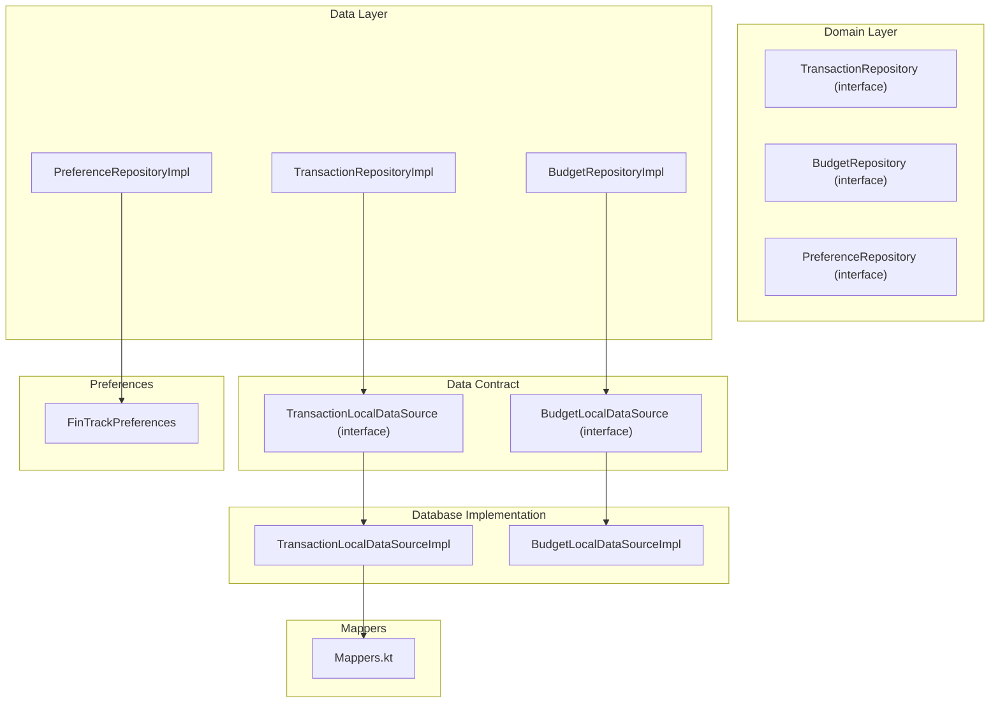
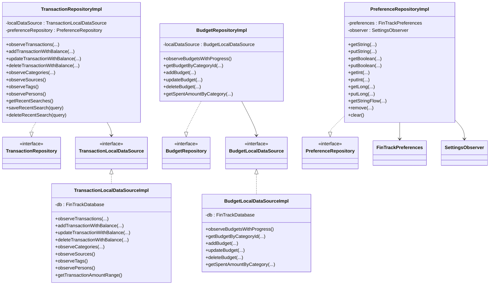
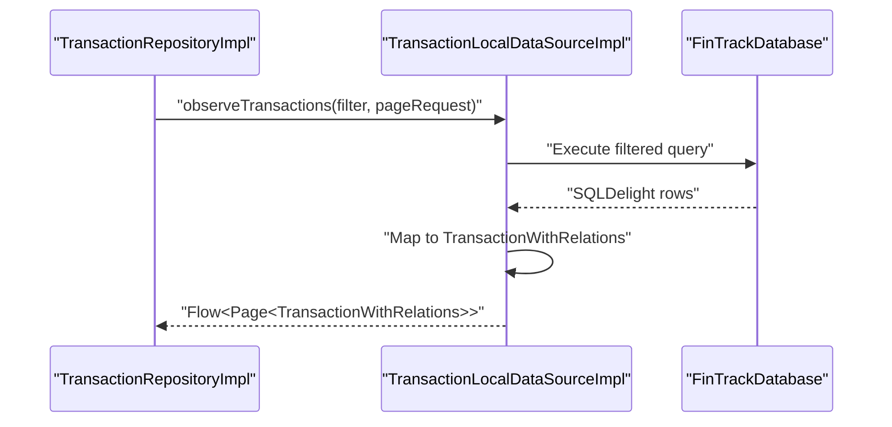
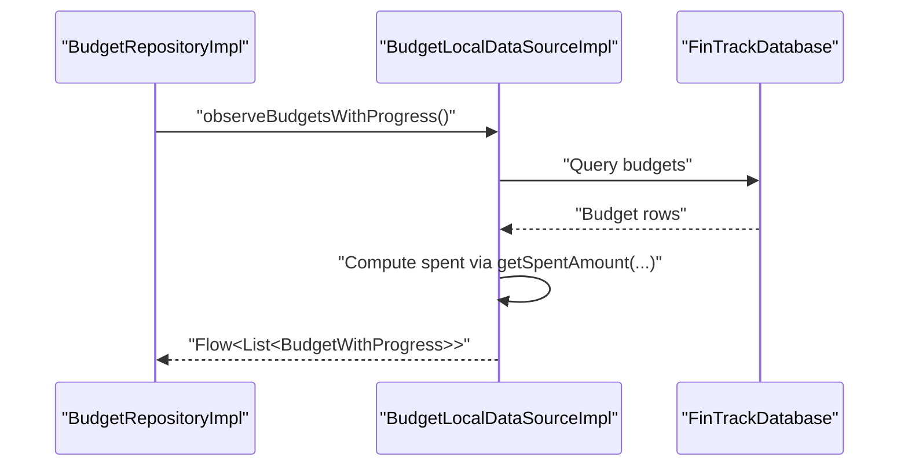
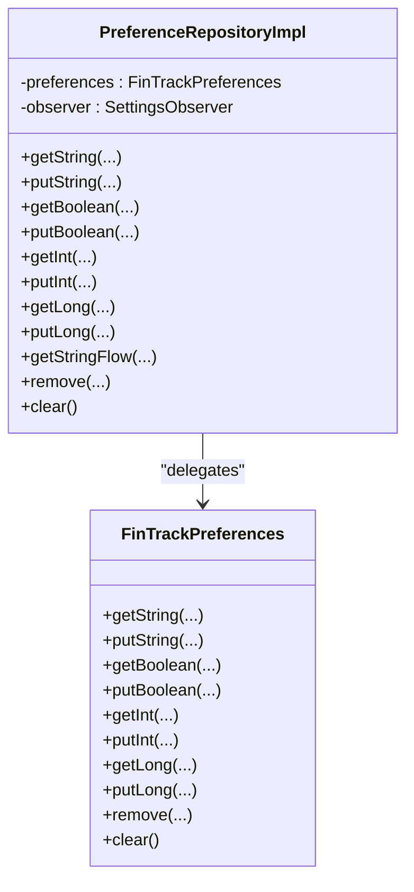
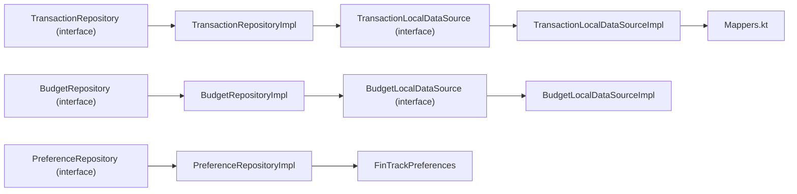

# Repository Implementations

<cite>
**Referenced Files in This Document**
- [TransactionRepositoryImpl.kt](file://core/data/src/commonMain/kotlin/com/kazemieh/data/repository/TransactionRepositoryImpl.kt)
- [BudgetRepositoryImpl.kt](file://core/data/src/commonMain/kotlin/com/kazemieh/data/repository/BudgetRepositoryImpl.kt)
- [PreferenceRepositoryImpl.kt](file://core/data/src/commonMain/kotlin/com/kazemieh/data/repository/PreferenceRepositoryImpl.kt)
- [TransactionRepository.kt](file://core/domain/src/commonMain/kotlin/com/kazemieh/domain/repository/TransactionRepository.kt)
- [BudgetRepository.kt](file://core/domain/src/commonMain/kotlin/com/kazemieh/domain/repository/BudgetRepository.kt)
- [PreferenceRepository.kt](file://core/domain/src/commonMain/kotlin/com/kazemieh/domain/repository/PreferenceRepository.kt)
- [TransactionLocalDataSource.kt](file://core/data-contract/src/commonMain/kotlin/com/kazemieh/data_contract/datasource/TransactionLocalDataSource.kt)
- [BudgetLocalDataSource.kt](file://core/data-contract/src/commonMain/kotlin/com/kazemieh/data_contract/datasource/BudgetLocalDataSource.kt)
- [TransactionLocalDataSourceImpl.kt](file://core/database/src/commonMain/kotlin/com/kazemieh/database/datasource/TransactionLocalDataSourceImpl.kt)
- [BudgetLocalDataSourceImpl.kt](file://core/database/src/commonMain/kotlin/com/kazemieh/database/datasource/BudgetLocalDataSourceImpl.kt)
- [Mappers.kt](file://core/database/src/commonMain/kotlin/com/kazemieh/database/mapper/Mappers.kt)
- [FinTrackPreferences.kt](file://core/preferences/src/commonMain/kotlin/com/kazemieh/preferences/FinTrackPreferences.kt)
</cite>

## Table of Contents
1. [Introduction](#introduction)
2. [Project Structure](#project-structure)
3. [Core Components](#core-components)
4. [Architecture Overview](#architecture-overview)
5. [Detailed Component Analysis](#detailed-component-analysis)
6. [Dependency Analysis](#dependency-analysis)
7. [Performance Considerations](#performance-considerations)
8. [Troubleshooting Guide](#troubleshooting-guide)
9. [Conclusion](#conclusion)

## Introduction
This document provides a comprehensive analysis of the concrete repository implementations that bridge domain use cases with local data sources. It focuses on three repositories:
- TransactionRepositoryImpl: orchestrates transaction CRUD, relations, filters, and metadata operations.
- BudgetRepositoryImpl: manages budget entities and progress calculations.
- PreferenceRepositoryImpl: exposes a unified interface to persistent settings and reactive preference updates.

The analysis covers constructor dependencies, method implementations, data access patterns, domain-to-data transformations, error handling, thread-safety considerations, caching strategies, and performance optimizations.

## Project Structure
The repositories live in the data module and depend on:
- Domain repository interfaces (contracts).
- Data contract local data sources (abstractions).
- Database implementations of local data sources.
- Mapper utilities for transforming SQLDelight-generated records to domain models.
- Preferences for lightweight, reactive settings.

**Diagram sources**
- [TransactionRepositoryImpl.kt:22-25](file://core/data/src/commonMain/kotlin/com/kazemieh/data/repository/TransactionRepositoryImpl.kt#L22-L25)
- [BudgetRepositoryImpl.kt:9-11](file://core/data/src/commonMain/kotlin/com/kazemieh/data/repository/BudgetRepositoryImpl.kt#L9-L11)
- [PreferenceRepositoryImpl.kt:8-11](file://core/data/src/commonMain/kotlin/com/kazemieh/data/repository/PreferenceRepositoryImpl.kt#L8-L11)
- [TransactionLocalDataSource.kt:16-86](file://core/data-contract/src/commonMain/kotlin/com/kazemieh/data_contract/datasource/TransactionLocalDataSource.kt#L16-L86)
- [BudgetLocalDataSource.kt:7-14](file://core/data-contract/src/commonMain/kotlin/com/kazemieh/data_contract/datasource/BudgetLocalDataSource.kt#L7-L14)
- [TransactionLocalDataSourceImpl.kt:33-35](file://core/database/src/commonMain/kotlin/com/kazemieh/database/datasource/TransactionLocalDataSourceImpl.kt#L33-L35)
- [BudgetLocalDataSourceImpl.kt:18-20](file://core/database/src/commonMain/kotlin/com/kazemieh/database/datasource/BudgetLocalDataSourceImpl.kt#L18-L20)
- [Mappers.kt:22-123](file://core/database/src/commonMain/kotlin/com/kazemieh/database/mapper/Mappers.kt#L22-L123)
- [FinTrackPreferences.kt:8-10](file://core/preferences/src/commonMain/kotlin/com/kazemieh/preferences/FinTrackPreferences.kt#L8-L10)

**Section sources**
- [TransactionRepositoryImpl.kt:1-235](file://core/data/src/commonMain/kotlin/com/kazemieh/data/repository/TransactionRepositoryImpl.kt#L1-L235)
- [BudgetRepositoryImpl.kt:1-36](file://core/data/src/commonMain/kotlin/com/kazemieh/data/repository/BudgetRepositoryImpl.kt#L1-L36)
- [PreferenceRepositoryImpl.kt:1-24](file://core/data/src/commonMain/kotlin/com/kazemieh/data/repository/PreferenceRepositoryImpl.kt#L1-L24)

## Core Components
This section outlines each repository’s role, constructor dependencies, and primary responsibilities.

- TransactionRepositoryImpl
  - Dependencies: TransactionLocalDataSource, PreferenceRepository.
  - Responsibilities: Delegates all transaction and entity operations to the local data source; manages recent searches via preferences; exposes flows for lists and sums; coordinates cross-reference updates and balance adjustments.

- BudgetRepositoryImpl
  - Dependencies: BudgetLocalDataSource.
  - Responsibilities: Exposes budget flows with computed progress; delegates CRUD operations; computes spent amounts per category and period.

- PreferenceRepositoryImpl
  - Dependencies: FinTrackPreferences, SettingsObserver.
  - Responsibilities: Provides typed getters/setters and reactive flows for preferences; supports removal and clearing.

**Section sources**
- [TransactionRepositoryImpl.kt:22-25](file://core/data/src/commonMain/kotlin/com/kazemieh/data/repository/TransactionRepositoryImpl.kt#L22-L25)
- [BudgetRepositoryImpl.kt:9-11](file://core/data/src/commonMain/kotlin/com/kazemieh/data/repository/BudgetRepositoryImpl.kt#L9-L11)
- [PreferenceRepositoryImpl.kt:8-11](file://core/data/src/commonMain/kotlin/com/kazemieh/data/repository/PreferenceRepositoryImpl.kt#L8-L11)

## Architecture Overview
The repositories act as adapters between domain interfaces and database-backed local data sources. They transform domain models to SQLDelight records and back, coordinate transactions, and expose reactive streams.

**Diagram sources**
- [TransactionRepository.kt:16-93](file://core/domain/src/commonMain/kotlin/com/kazemieh/domain/repository/TransactionRepository.kt#L16-L93)
- [BudgetRepository.kt:7-14](file://core/domain/src/commonMain/kotlin/com/kazemieh/domain/repository/BudgetRepository.kt#L7-L14)
- [PreferenceRepository.kt:5-17](file://core/domain/src/commonMain/kotlin/com/kazemieh/domain/repository/PreferenceRepository.kt#L5-L17)
- [TransactionRepositoryImpl.kt:22-25](file://core/data/src/commonMain/kotlin/com/kazemieh/data/repository/TransactionRepositoryImpl.kt#L22-L25)
- [BudgetRepositoryImpl.kt:9-11](file://core/data/src/commonMain/kotlin/com/kazemieh/data/repository/BudgetRepositoryImpl.kt#L9-L11)
- [PreferenceRepositoryImpl.kt:8-11](file://core/data/src/commonMain/kotlin/com/kazemieh/data/repository/PreferenceRepositoryImpl.kt#L8-L11)
- [TransactionLocalDataSource.kt:16-86](file://core/data-contract/src/commonMain/kotlin/com/kazemieh/data_contract/datasource/TransactionLocalDataSource.kt#L16-L86)
- [BudgetLocalDataSource.kt:7-14](file://core/data-contract/src/commonMain/kotlin/com/kazemieh/data_contract/datasource/BudgetLocalDataSource.kt#L7-L14)
- [TransactionLocalDataSourceImpl.kt:33-35](file://core/database/src/commonMain/kotlin/com/kazemieh/database/datasource/TransactionLocalDataSourceImpl.kt#L33-L35)
- [BudgetLocalDataSourceImpl.kt:18-20](file://core/database/src/commonMain/kotlin/com/kazemieh/database/datasource/BudgetLocalDataSourceImpl.kt#L18-L20)

## Detailed Component Analysis

### TransactionRepositoryImpl
- Constructor dependencies
  - TransactionLocalDataSource: primary data access abstraction.
  - PreferenceRepository: for managing recent searches persisted as a delimited string.
- Initialization and recent searches
  - Reads stored recent searches on startup and initializes an internal state flow.
- Method implementations and data access patterns
  - Observes transactions with filtering and pagination, delegating to the local data source.
  - Computes category sums via a dedicated query.
  - Manages transaction CRUD with balance deltas applied atomically.
  - Exposes flows for categories, sources, tags, and persons; supports flat and hierarchical category views.
  - Provides defaults for categories and sources, and transfer category handling.
  - Supports search across entities and maintains most-used lists.
  - Updates positions for categories, sources, tags, and persons.
  - Returns amount range for transactions.
- Data transformation
  - Relies on TransactionLocalDataSourceImpl mappers to convert SQLDelight records to domain models.
- Error handling and exceptions
  - Throws explicit exceptions when updates fail to find records or when required IDs are missing.
- Thread safety and concurrency
  - Uses Dispatchers.Default for database operations; Flow emissions occur on Dispatchers.Default.
  - Internal recent searches managed via MutableStateFlow and update semantics.
- Caching and performance
  - No explicit in-memory cache; relies on SQLDelight queries and reactive flows.
  - Batch operations for position updates iterate over provided maps.
  - Cross-reference insertions deduplicate IDs before writing.

**Diagram sources**
- [TransactionRepositoryImpl.kt:55-60](file://core/data/src/commonMain/kotlin/com/kazemieh/data/repository/TransactionRepositoryImpl.kt#L55-L60)
- [TransactionLocalDataSourceImpl.kt:46-81](file://core/database/src/commonMain/kotlin/com/kazemieh/database/datasource/TransactionLocalDataSourceImpl.kt#L46-L81)

**Section sources**
- [TransactionRepositoryImpl.kt:22-25](file://core/data/src/commonMain/kotlin/com/kazemieh/data/repository/TransactionRepositoryImpl.kt#L22-L25)
- [TransactionRepositoryImpl.kt:29-34](file://core/data/src/commonMain/kotlin/com/kazemieh/data/repository/TransactionRepositoryImpl.kt#L29-L34)
- [TransactionRepositoryImpl.kt:55-60](file://core/data/src/commonMain/kotlin/com/kazemieh/data/repository/TransactionRepositoryImpl.kt#L55-L60)
- [TransactionRepositoryImpl.kt:66-85](file://core/data/src/commonMain/kotlin/com/kazemieh/data/repository/TransactionRepositoryImpl.kt#L66-L85)
- [TransactionRepositoryImpl.kt:87-141](file://core/data/src/commonMain/kotlin/com/kazemieh/data/repository/TransactionRepositoryImpl.kt#L87-L141)
- [TransactionRepositoryImpl.kt:163-169](file://core/data/src/commonMain/kotlin/com/kazemieh/data/repository/TransactionRepositoryImpl.kt#L163-L169)
- [TransactionRepositoryImpl.kt:175-189](file://core/data/src/commonMain/kotlin/com/kazemieh/data/repository/TransactionRepositoryImpl.kt#L175-L189)
- [TransactionRepositoryImpl.kt:191-205](file://core/data/src/commonMain/kotlin/com/kazemieh/data/repository/TransactionRepositoryImpl.kt#L191-L205)
- [TransactionRepositoryImpl.kt:207-229](file://core/data/src/commonMain/kotlin/com/kazemieh/data/repository/TransactionRepositoryImpl.kt#L207-L229)
- [TransactionRepositoryImpl.kt:231-233](file://core/data/src/commonMain/kotlin/com/kazemieh/data/repository/TransactionRepositoryImpl.kt#L231-L233)

### BudgetRepositoryImpl
- Constructor dependencies
  - BudgetLocalDataSource: abstraction for budget-related persistence and queries.
- Method implementations and data access patterns
  - Exposes budgets with computed progress by combining budget records with spent amounts.
  - CRUD operations for budgets delegated to the local data source.
  - Calculates spent amounts per category and period.
- Data transformation
  - Uses BudgetLocalDataSourceImpl to map database rows to domain models and compute progress.
- Error handling and exceptions
  - No explicit exception throwing observed in this repository; delegates to underlying data source.
- Thread safety and concurrency
  - Uses Dispatchers.IO for flow emissions.
- Caching and performance
  - No explicit caching; progress computed on demand by combining budget and spent queries.

**Diagram sources**
- [BudgetRepositoryImpl.kt:12-14](file://core/data/src/commonMain/kotlin/com/kazemieh/data/repository/BudgetRepositoryImpl.kt#L12-L14)
- [BudgetLocalDataSourceImpl.kt:25-32](file://core/database/src/commonMain/kotlin/com/kazemieh/database/datasource/BudgetLocalDataSourceImpl.kt#L25-L32)

**Section sources**
- [BudgetRepositoryImpl.kt:9-11](file://core/data/src/commonMain/kotlin/com/kazemieh/data/repository/BudgetRepositoryImpl.kt#L9-L11)
- [BudgetRepositoryImpl.kt:12-14](file://core/data/src/commonMain/kotlin/com/kazemieh/data/repository/BudgetRepositoryImpl.kt#L12-L14)
- [BudgetRepositoryImpl.kt:16-18](file://core/data/src/commonMain/kotlin/com/kazemieh/data/repository/BudgetRepositoryImpl.kt#L16-L18)
- [BudgetRepositoryImpl.kt:20-30](file://core/data/src/commonMain/kotlin/com/kazemieh/data/repository/BudgetRepositoryImpl.kt#L20-L30)
- [BudgetRepositoryImpl.kt:32-34](file://core/data/src/commonMain/kotlin/com/kazemieh/data/repository/BudgetRepositoryImpl.kt#L32-L34)

### PreferenceRepositoryImpl
- Constructor dependencies
  - FinTrackPreferences: typed settings wrapper.
  - SettingsObserver: provides reactive flows for preference changes.
- Method implementations and data access patterns
  - Typed getters and setters for strings, booleans, ints, and longs.
  - Reactive flow for string keys.
  - Removal and clearing support.
- Data transformation
  - No transformation required; returns primitive values or flows directly.
- Error handling and exceptions
  - No explicit exception throwing; relies on underlying settings library behavior.
- Thread safety and concurrency
  - Delegates to the settings library and observer; reactive flows propagate changes reactively.
- Caching and performance
  - No in-memory cache; reads/writes go directly to the settings backend.

**Diagram sources**
- [PreferenceRepositoryImpl.kt:8-11](file://core/data/src/commonMain/kotlin/com/kazemieh/data/repository/PreferenceRepositoryImpl.kt#L8-L11)
- [FinTrackPreferences.kt:8-26](file://core/preferences/src/commonMain/kotlin/com/kazemieh/preferences/FinTrackPreferences.kt#L8-L26)

**Section sources**
- [PreferenceRepositoryImpl.kt:8-11](file://core/data/src/commonMain/kotlin/com/kazemieh/data/repository/PreferenceRepositoryImpl.kt#L8-L11)
- [PreferenceRepositoryImpl.kt:12-22](file://core/data/src/commonMain/kotlin/com/kazemieh/data/repository/PreferenceRepositoryImpl.kt#L12-L22)
- [FinTrackPreferences.kt:12-25](file://core/preferences/src/commonMain/kotlin/com/kazemieh/preferences/FinTrackPreferences.kt#L12-L25)

## Dependency Analysis
- Domain to Data
  - Repositories implement domain interfaces and depend on data contract local data sources.
- Data to Database
  - Local data sources are implemented by SQLDelight-backed classes that execute queries and map results.
- Mappers
  - Mappers convert SQLDelight records to domain models and vice versa, ensuring clean separation between persistence and domain layers.
- Preferences
  - PreferenceRepositoryImpl depends on FinTrackPreferences and SettingsObserver to provide typed and reactive settings access.

**Diagram sources**
- [TransactionRepository.kt:16-93](file://core/domain/src/commonMain/kotlin/com/kazemieh/domain/repository/TransactionRepository.kt#L16-L93)
- [BudgetRepository.kt:7-14](file://core/domain/src/commonMain/kotlin/com/kazemieh/domain/repository/BudgetRepository.kt#L7-L14)
- [PreferenceRepository.kt:5-17](file://core/domain/src/commonMain/kotlin/com/kazemieh/domain/repository/PreferenceRepository.kt#L5-L17)
- [TransactionRepositoryImpl.kt:22-25](file://core/data/src/commonMain/kotlin/com/kazemieh/data/repository/TransactionRepositoryImpl.kt#L22-L25)
- [BudgetRepositoryImpl.kt:9-11](file://core/data/src/commonMain/kotlin/com/kazemieh/data/repository/BudgetRepositoryImpl.kt#L9-L11)
- [PreferenceRepositoryImpl.kt:8-11](file://core/data/src/commonMain/kotlin/com/kazemieh/data/repository/PreferenceRepositoryImpl.kt#L8-L11)
- [TransactionLocalDataSource.kt:16-86](file://core/data-contract/src/commonMain/kotlin/com/kazemieh/data_contract/datasource/TransactionLocalDataSource.kt#L16-L86)
- [BudgetLocalDataSource.kt:7-14](file://core/data-contract/src/commonMain/kotlin/com/kazemieh/data_contract/datasource/BudgetLocalDataSource.kt#L7-L14)
- [TransactionLocalDataSourceImpl.kt:33-35](file://core/database/src/commonMain/kotlin/com/kazemieh/database/datasource/TransactionLocalDataSourceImpl.kt#L33-L35)
- [BudgetLocalDataSourceImpl.kt:18-20](file://core/database/src/commonMain/kotlin/com/kazemieh/database/datasource/BudgetLocalDataSourceImpl.kt#L18-L20)
- [Mappers.kt:22-123](file://core/database/src/commonMain/kotlin/com/kazemieh/database/mapper/Mappers.kt#L22-L123)
- [FinTrackPreferences.kt:8-10](file://core/preferences/src/commonMain/kotlin/com/kazemieh/preferences/FinTrackPreferences.kt#L8-L10)

**Section sources**
- [TransactionRepositoryImpl.kt:22-25](file://core/data/src/commonMain/kotlin/com/kazemieh/data/repository/TransactionRepositoryImpl.kt#L22-L25)
- [BudgetRepositoryImpl.kt:9-11](file://core/data/src/commonMain/kotlin/com/kazemieh/data/repository/BudgetRepositoryImpl.kt#L9-L11)
- [PreferenceRepositoryImpl.kt:8-11](file://core/data/src/commonMain/kotlin/com/kazemieh/data/repository/PreferenceRepositoryImpl.kt#L8-L11)
- [TransactionLocalDataSourceImpl.kt:33-35](file://core/database/src/commonMain/kotlin/com/kazemieh/database/datasource/TransactionLocalDataSourceImpl.kt#L33-L35)
- [BudgetLocalDataSourceImpl.kt:18-20](file://core/database/src/commonMain/kotlin/com/kazemieh/database/datasource/BudgetLocalDataSourceImpl.kt#L18-L20)
- [Mappers.kt:22-123](file://core/database/src/commonMain/kotlin/com/kazemieh/database/mapper/Mappers.kt#L22-L123)
- [FinTrackPreferences.kt:8-26](file://core/preferences/src/commonMain/kotlin/com/kazemieh/preferences/FinTrackPreferences.kt#L8-L26)

## Performance Considerations
- Concurrency and dispatchers
  - TransactionLocalDataSourceImpl uses Dispatchers.Default for database operations and Flow mapping, balancing responsiveness and throughput.
  - BudgetLocalDataSourceImpl uses Dispatchers.IO for flow mapping, suitable for heavier computations.
- Query efficiency
  - Filtering and pagination are handled at the SQL level, minimizing Kotlin-side processing.
  - Cross-reference writes deduplicate IDs before insertion to avoid redundant operations.
- Reactive streams
  - Flows emit on background dispatchers, enabling UI-friendly consumption without blocking the main thread.
- Memory and caching
  - No explicit in-memory caches; rely on SQLDelight’s query results and reactive updates.
- Transaction boundaries
  - Multi-step operations (insert/update/delete with balance adjustments) are wrapped in database transactions to maintain consistency.

[No sources needed since this section provides general guidance]

## Troubleshooting Guide
- Transaction update failures
  - Symptom: IllegalStateException indicating update failure when a record is not found.
  - Cause: Attempting to update a non-existent transaction ID.
  - Resolution: Ensure the transaction exists before invoking update; validate IDs upstream.
  - Evidence: [TransactionLocalDataSourceImpl.kt:540-545](file://core/database/src/commonMain/kotlin/com/kazemieh/database/datasource/TransactionLocalDataSourceImpl.kt#L540-L545)
- Category update failures
  - Symptom: IllegalStateException when a category update fails to reflect in the database.
  - Cause: Underlying update did not modify any rows.
  - Resolution: Verify category ID and parameters; check database constraints.
  - Evidence: [TransactionLocalDataSourceImpl.kt:137-142](file://core/database/src/commonMain/kotlin/com/kazemieh/database/datasource/TransactionLocalDataSourceImpl.kt#L137-L142)
- Missing source ID during updates
  - Symptom: IllegalArgumentException for null source ID.
  - Cause: Source object passed without a valid identifier.
  - Resolution: Assign IDs before updates; enforce validation in use cases.
  - Evidence: [TransactionLocalDataSourceImpl.kt](file://core/database/src/commonMain/kotlin/com/kazemieh/database/datasource/TransactionLocalDataSourceImpl.kt#L148)
- Recent search invalidation
  - Symptom: Empty or stale recent searches after initialization.
  - Cause: Stored delimiter-separated list not properly formatted.
  - Resolution: Ensure delimiter consistency and non-blank queries when saving/deleting.
  - Evidence: [TransactionRepositoryImpl.kt:30-33](file://core/data/src/commonMain/kotlin/com/kazemieh/data/repository/TransactionRepositoryImpl.kt#L30-L33), [TransactionRepositoryImpl.kt:38-46](file://core/data/src/commonMain/kotlin/com/kazemieh/data/repository/TransactionRepositoryImpl.kt#L38-L46)

**Section sources**
- [TransactionLocalDataSourceImpl.kt:137-142](file://core/database/src/commonMain/kotlin/com/kazemieh/database/datasource/TransactionLocalDataSourceImpl.kt#L137-L142)
- [TransactionLocalDataSourceImpl.kt:540-545](file://core/database/src/commonMain/kotlin/com/kazemieh/database/datasource/TransactionLocalDataSourceImpl.kt#L540-L545)
- [TransactionLocalDataSourceImpl.kt](file://core/database/src/commonMain/kotlin/com/kazemieh/database/datasource/TransactionLocalDataSourceImpl.kt#L148)
- [TransactionRepositoryImpl.kt:30-33](file://core/data/src/commonMain/kotlin/com/kazemieh/data/repository/TransactionRepositoryImpl.kt#L30-L33)
- [TransactionRepositoryImpl.kt:38-46](file://core/data/src/commonMain/kotlin/com/kazemieh/data/repository/TransactionRepositoryImpl.kt#L38-L46)

## Conclusion
The repository implementations provide a clean, testable bridge between domain use cases and local data sources. They delegate persistence concerns to SQLDelight-backed data sources, apply domain-to-persistence transformations via mappers, and expose reactive streams for UI consumption. Error handling is explicit for critical operations, and concurrency is addressed through appropriate dispatchers. While no in-memory caching is present, the design leverages SQLDelight’s query efficiency and reactive flows to maintain responsiveness and correctness.