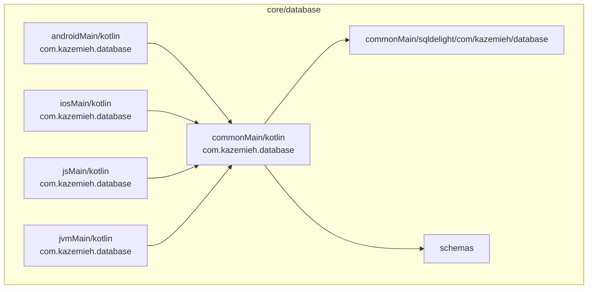
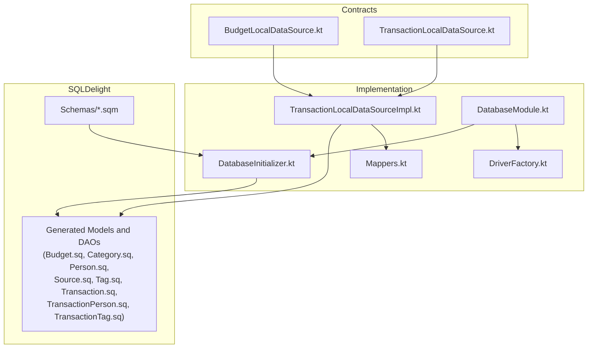
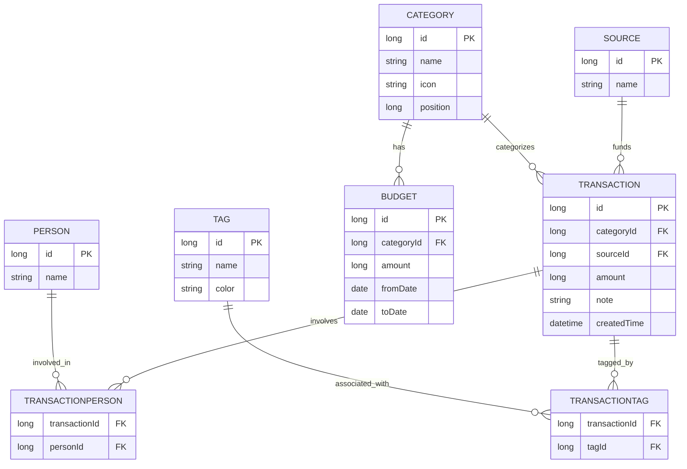
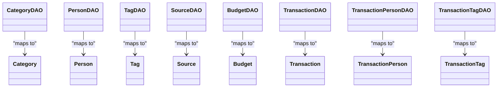
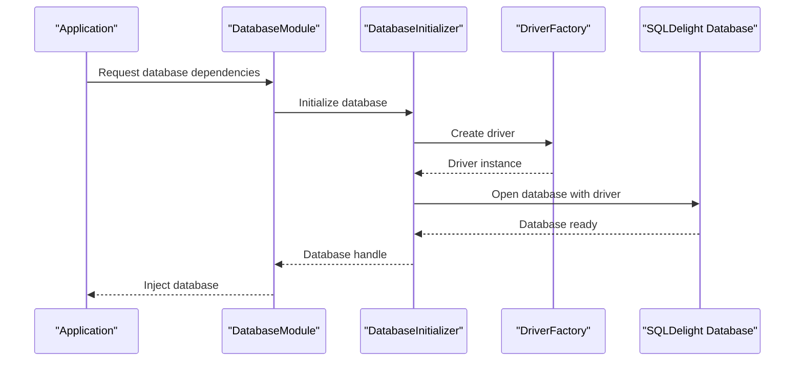
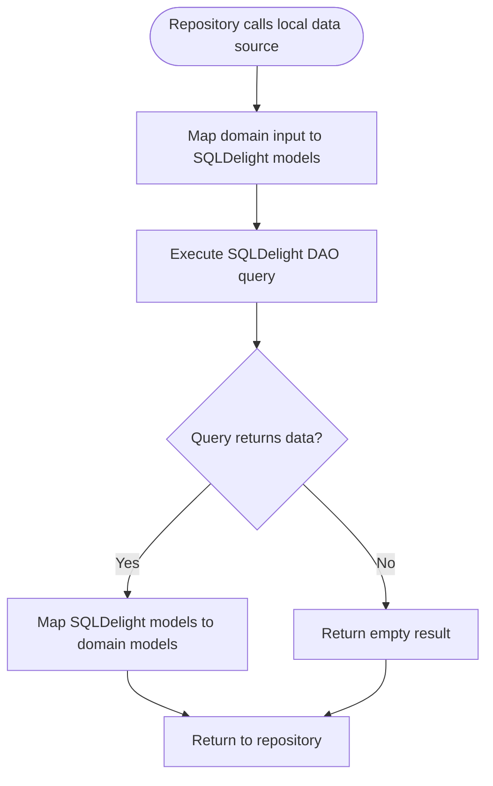
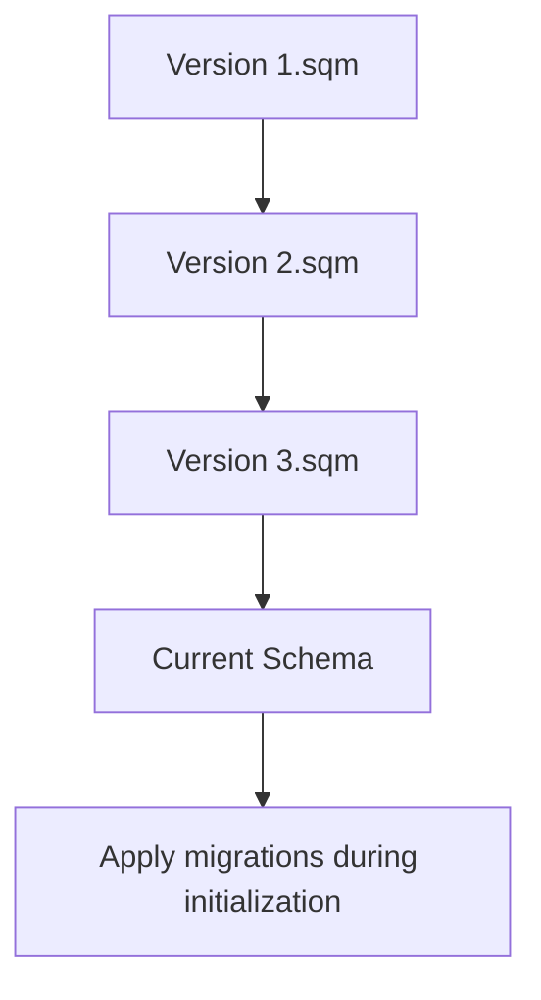
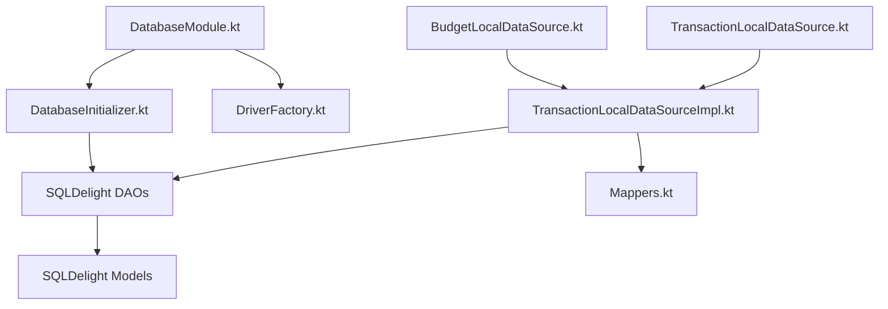

# Database Module

<cite>
**Referenced Files in This Document**
- [DatabaseInitializer.kt](file://core/database/src/commonMain/kotlin/com/kazemieh/database/DatabaseInitializer.kt)
- [DatabaseModule.kt](file://core/database/src/commonMain/kotlin/com/kazemieh/database/di/DatabaseModule.kt)
- [DriverFactory.kt](file://core/database/src/commonMain/kotlin/com/kazemieh/database/DriverFactory.kt)
- [DriverFactory.android.kt](file://core/database/src/androidMain/kotlin/com/kazemieh/database/DriverFactory.android.kt)
- [DriverFactory.ios.kt](file://core/database/src/iosMain/kotlin/com/kazemieh/database/DriverFactory.ios.kt)
- [DriverFactory.js.kt](file://core/database/src/jsMain/kotlin/com/kazemieh/database/DriverFactory.js.kt)
- [DriverFactory.jvm.kt](file://core/database/src/jvmMain/kotlin/com/kazemieh/database/DriverFactory.jvm.kt)
- [Mappers.kt](file://core/database/src/commonMain/kotlin/com/kazemieh/database/mapper/Mappers.kt)
- [TransactionLocalDataSourceImpl.kt](file://core/database/src/commonMain/kotlin/com/kazemieh/database/datasource/TransactionLocalDataSourceImpl.kt)
- [BudgetLocalDataSource.kt](file://core/data-contract/src/commonMain/kotlin/com/kazemieh/data_contract/datasource/BudgetLocalDataSource.kt)
- [TransactionLocalDataSource.kt](file://core/data-contract/src/commonMain/kotlin/com/kazemieh/data_contract/datasource/TransactionLocalDataSource.kt)
- [Budget.sq](file://core/database/src/commonMain/sqldelight/com/kazemieh/database/Budget.sq)
- [Category.sq](file://core/database/src/commonMain/sqldelight/com/kazemieh/database/Category.sq)
- [Person.sq](file://core/database/src/commonMain/sqldelight/com/kazemieh/database/Person.sq)
- [Source.sq](file://core/database/src/commonMain/sqldelight/com/kazemieh/database/Source.sq)
- [Tag.sq](file://core/database/src/commonMain/sqldelight/com/kazemieh/database/Tag.sq)
- [Transaction.sq](file://core/database/src/commonMain/sqldelight/com/kazemieh/database/Transaction.sq)
- [TransactionPerson.sq](file://core/database/src/commonMain/sqldelight/com/kazemieh/database/TransactionPerson.sq)
- [TransactionTag.sq](file://core/database/src/commonMain/sqldelight/com/kazemieh/database/TransactionTag.sq)
- [1.sqm](file://core/database/schemas/1.sqm)
- [2.sqm](file://core/database/schemas/2.sqm)
- [3.sqm](file://core/database/schemas/3.sqm)
- [build.gradle.kts](file://core/database/build.gradle.kts)
</cite>

## Table of Contents
1. [Introduction](#introduction)
2. [Project Structure](#project-structure)
3. [Core Components](#core-components)
4. [Architecture Overview](#architecture-overview)
5. [Detailed Component Analysis](#detailed-component-analysis)
6. [Dependency Analysis](#dependency-analysis)
7. [Performance Considerations](#performance-considerations)
8. [Troubleshooting Guide](#troubleshooting-guide)
9. [Conclusion](#conclusion)

## Introduction
This document explains the Database module responsible for local persistence using SQLDelight. It covers the purpose of the layer that defines database schemas, provides type-safe SQL queries, and manages database initialization and migrations. The module implements SQLDelight-generated DAOs and models, exposes a DI module for dependency injection, and coordinates driver creation across platforms. Practical examples demonstrate initialization, query execution, data mapping, and schema evolution strategies.

## Project Structure
The Database module organizes SQLDelight schema definitions under a dedicated sqldelight directory, platform-specific driver factories, DI bindings, and initialization logic. SQLDelight generates Kotlin code from .sq files, which are then compiled into DAOs and models. Migration scripts are stored under schemas with incremental numbering.

**Diagram sources**
- [build.gradle.kts](file://core/database/build.gradle.kts)
- [DriverFactory.kt](file://core/database/src/commonMain/kotlin/com/kazemieh/database/DriverFactory.kt)
- [DriverFactory.android.kt](file://core/database/src/androidMain/kotlin/com/kazemieh/database/DriverFactory.android.kt)
- [DriverFactory.ios.kt](file://core/database/src/iosMain/kotlin/com/kazemieh/database/DriverFactory.ios.kt)
- [DriverFactory.js.kt](file://core/database/src/jsMain/kotlin/com/kazemieh/database/DriverFactory.js.kt)
- [DriverFactory.jvm.kt](file://core/database/src/jvmMain/kotlin/com/kazemieh/database/DriverFactory.jvm.kt)

**Section sources**
- [build.gradle.kts](file://core/database/build.gradle.kts)

## Core Components
- SQLDelight schema definitions (.sq files) define tables and relationships for Budget, Category, Person, Source, Tag, Transaction, and junction tables TransactionPerson and TransactionTag.
- SQLDelight-generated DAOs and models provide type-safe database access.
- DriverFactory creates the appropriate SQLDelight driver per platform.
- DatabaseInitializer configures and opens the database connection.
- DatabaseModule provides DI bindings for database components.
- Mappers convert between domain models and SQLDelight-generated models.
- TransactionLocalDataSourceImpl implements local data source using SQLDelight DAOs.
- BudgetLocalDataSource and TransactionLocalDataSource define contracts for budget and transaction local data access.

**Section sources**
- [Budget.sq](file://core/database/src/commonMain/sqldelight/com/kazemieh/database/Budget.sq)
- [Category.sq](file://core/database/src/commonMain/sqldelight/com/kazemieh/database/Category.sq)
- [Person.sq](file://core/database/src/commonMain/sqldelight/com/kazemieh/database/Person.sq)
- [Source.sq](file://core/database/src/commonMain/sqldelight/com/kazemieh/database/Source.sq)
- [Tag.sq](file://core/database/src/commonMain/sqldelight/com/kazemieh/database/Tag.sq)
- [Transaction.sq](file://core/database/src/commonMain/sqldelight/com/kazemieh/database/Transaction.sq)
- [TransactionPerson.sq](file://core/database/src/commonMain/sqldelight/com/kazemieh/database/TransactionPerson.sq)
- [TransactionTag.sq](file://core/database/src/commonMain/sqldelight/com/kazemieh/database/TransactionTag.sq)
- [DriverFactory.kt](file://core/database/src/commonMain/kotlin/com/kazemieh/database/DriverFactory.kt)
- [DatabaseInitializer.kt](file://core/database/src/commonMain/kotlin/com/kazemieh/database/DatabaseInitializer.kt)
- [DatabaseModule.kt](file://core/database/src/commonMain/kotlin/com/kazemieh/database/di/DatabaseModule.kt)
- [Mappers.kt](file://core/database/src/commonMain/kotlin/com/kazemieh/database/mapper/Mappers.kt)
- [TransactionLocalDataSourceImpl.kt](file://core/database/src/commonMain/kotlin/com/kazemieh/database/datasource/TransactionLocalDataSourceImpl.kt)
- [BudgetLocalDataSource.kt](file://core/data-contract/src/commonMain/kotlin/com/kazemieh/data_contract/datasource/BudgetLocalDataSource.kt)
- [TransactionLocalDataSource.kt](file://core/data-contract/src/commonMain/kotlin/com/kazemieh/data_contract/datasource/TransactionLocalDataSource.kt)

## Architecture Overview
The Database module follows a layered architecture:
- Contracts define local data source interfaces in the data-contract module.
- Implementation resides in the database module using SQLDelight.
- DI wiring binds contracts to implementations and provides database access.
- SQLDelight handles schema definitions, migrations, and type-safe queries.

**Diagram sources**
- [BudgetLocalDataSource.kt](file://core/data-contract/src/commonMain/kotlin/com/kazemieh/data_contract/datasource/BudgetLocalDataSource.kt)
- [TransactionLocalDataSource.kt](file://core/data-contract/src/commonMain/kotlin/com/kazemieh/data_contract/datasource/TransactionLocalDataSource.kt)
- [TransactionLocalDataSourceImpl.kt](file://core/database/src/commonMain/kotlin/com/kazemieh/database/datasource/TransactionLocalDataSourceImpl.kt)
- [Mappers.kt](file://core/database/src/commonMain/kotlin/com/kazemieh/database/mapper/Mappers.kt)
- [DatabaseInitializer.kt](file://core/database/src/commonMain/kotlin/com/kazemieh/database/DatabaseInitializer.kt)
- [DatabaseModule.kt](file://core/database/src/commonMain/kotlin/com/kazemieh/database/di/DatabaseModule.kt)
- [DriverFactory.kt](file://core/database/src/commonMain/kotlin/com/kazemieh/database/DriverFactory.kt)
- [Budget.sq](file://core/database/src/commonMain/sqldelight/com/kazemieh/database/Budget.sq)
- [Category.sq](file://core/database/src/commonMain/sqldelight/com/kazemieh/database/Category.sq)
- [Person.sq](file://core/database/src/commonMain/sqldelight/com/kazemieh/database/Person.sq)
- [Source.sq](file://core/database/src/commonMain/sqldelight/com/kazemieh/database/Source.sq)
- [Tag.sq](file://core/database/src/commonMain/sqldelight/com/kazemieh/database/Tag.sq)
- [Transaction.sq](file://core/database/src/commonMain/sqldelight/com/kazemieh/database/Transaction.sq)
- [TransactionPerson.sq](file://core/database/src/commonMain/sqldelight/com/kazemieh/database/TransactionPerson.sq)
- [TransactionTag.sq](file://core/database/src/commonMain/sqldelight/com/kazemieh/database/TransactionTag.sq)
- [1.sqm](file://core/database/schemas/1.sqm)
- [2.sqm](file://core/database/schemas/2.sqm)
- [3.sqm](file://core/database/schemas/3.sqm)

## Detailed Component Analysis

### SQLDelight Schema Definitions
The schema files define normalized relational structures:
- Core entities: Budget, Category, Person, Source, Tag, Transaction.
- Junction tables: TransactionPerson, TransactionTag for many-to-many relationships.
- Generated DAOs expose typed queries for CRUD and complex selections.

**Diagram sources**
- [Category.sq](file://core/database/src/commonMain/sqldelight/com/kazemieh/database/Category.sq)
- [Person.sq](file://core/database/src/commonMain/sqldelight/com/kazemieh/database/Person.sq)
- [Tag.sq](file://core/database/src/commonMain/sqldelight/com/kazemieh/database/Tag.sq)
- [Source.sq](file://core/database/src/commonMain/sqldelight/com/kazemieh/database/Source.sq)
- [Budget.sq](file://core/database/src/commonMain/sqldelight/com/kazemieh/database/Budget.sq)
- [Transaction.sq](file://core/database/src/commonMain/sqldelight/com/kazemieh/database/Transaction.sq)
- [TransactionPerson.sq](file://core/database/src/commonMain/sqldelight/com/kazemieh/database/TransactionPerson.sq)
- [TransactionTag.sq](file://core/database/src/commonMain/sqldelight/com/kazemieh/database/TransactionTag.sq)

**Section sources**
- [Category.sq](file://core/database/src/commonMain/sqldelight/com/kazemieh/database/Category.sq)
- [Person.sq](file://core/database/src/commonMain/sqldelight/com/kazemieh/database/Person.sq)
- [Tag.sq](file://core/database/src/commonMain/sqldelight/com/kazemieh/database/Tag.sq)
- [Source.sq](file://core/database/src/commonMain/sqldelight/com/kazemieh/database/Source.sq)
- [Budget.sq](file://core/database/src/commonMain/sqldelight/com/kazemieh/database/Budget.sq)
- [Transaction.sq](file://core/database/src/commonMain/sqldelight/com/kazemieh/database/Transaction.sq)
- [TransactionPerson.sq](file://core/database/src/commonMain/sqldelight/com/kazemieh/database/TransactionPerson.sq)
- [TransactionTag.sq](file://core/database/src/commonMain/sqldelight/com/kazemieh/database/TransactionTag.sq)

### SQLDelight Generated Classes and Relationships
SQLDelight generates models and DAOs from .sq files. These classes encapsulate:
- Table models with typed properties.
- DAOs with methods for insert, update, delete, and select operations.
- Query interfaces for complex selections and aggregations.

**Diagram sources**
- [Category.sq](file://core/database/src/commonMain/sqldelight/com/kazemieh/database/Category.sq)
- [Person.sq](file://core/database/src/commonMain/sqldelight/com/kazemieh/database/Person.sq)
- [Tag.sq](file://core/database/src/commonMain/sqldelight/com/kazemieh/database/Tag.sq)
- [Source.sq](file://core/database/src/commonMain/sqldelight/com/kazemieh/database/Source.sq)
- [Budget.sq](file://core/database/src/commonMain/sqldelight/com/kazemieh/database/Budget.sq)
- [Transaction.sq](file://core/database/src/commonMain/sqldelight/com/kazemieh/database/Transaction.sq)
- [TransactionPerson.sq](file://core/database/src/commonMain/sqldelight/com/kazemieh/database/TransactionPerson.sq)
- [TransactionTag.sq](file://core/database/src/commonMain/sqldelight/com/kazemieh/database/TransactionTag.sq)

**Section sources**
- [Category.sq](file://core/database/src/commonMain/sqldelight/com/kazemieh/database/Category.sq)
- [Person.sq](file://core/database/src/commonMain/sqldelight/com/kazemieh/database/Person.sq)
- [Tag.sq](file://core/database/src/commonMain/sqldelight/com/kazemieh/database/Tag.sq)
- [Source.sq](file://core/database/src/commonMain/sqldelight/com/kazemieh/database/Source.sq)
- [Budget.sq](file://core/database/src/commonMain/sqldelight/com/kazemieh/database/Budget.sq)
- [Transaction.sq](file://core/database/src/commonMain/sqldelight/com/kazemieh/database/Transaction.sq)
- [TransactionPerson.sq](file://core/database/src/commonMain/sqldelight/com/kazemieh/database/TransactionPerson.sq)
- [TransactionTag.sq](file://core/database/src/commonMain/sqldelight/com/kazemieh/database/TransactionTag.sq)

### Database Initialization and Driver Factory
The module initializes the database and selects the appropriate driver per platform. The DI module wires initialization and driver creation, while platform-specific DriverFactory implementations provide the correct SQLDelight driver.

**Diagram sources**
- [DatabaseModule.kt](file://core/database/src/commonMain/kotlin/com/kazemieh/database/di/DatabaseModule.kt)
- [DatabaseInitializer.kt](file://core/database/src/commonMain/kotlin/com/kazemieh/database/DatabaseInitializer.kt)
- [DriverFactory.kt](file://core/database/src/commonMain/kotlin/com/kazemieh/database/DriverFactory.kt)
- [DriverFactory.android.kt](file://core/database/src/androidMain/kotlin/com/kazemieh/database/DriverFactory.android.kt)
- [DriverFactory.ios.kt](file://core/database/src/iosMain/kotlin/com/kazemieh/database/DriverFactory.ios.kt)
- [DriverFactory.js.kt](file://core/database/src/jsMain/kotlin/com/kazemieh/database/DriverFactory.js.kt)
- [DriverFactory.jvm.kt](file://core/database/src/jvmMain/kotlin/com/kazemieh/database/DriverFactory.jvm.kt)

**Section sources**
- [DatabaseInitializer.kt](file://core/database/src/commonMain/kotlin/com/kazemieh/database/DatabaseInitializer.kt)
- [DriverFactory.kt](file://core/database/src/commonMain/kotlin/com/kazemieh/database/DriverFactory.kt)
- [DriverFactory.android.kt](file://core/database/src/androidMain/kotlin/com/kazemieh/database/DriverFactory.android.kt)
- [DriverFactory.ios.kt](file://core/database/src/iosMain/kotlin/com/kazemieh/database/DriverFactory.ios.kt)
- [DriverFactory.js.kt](file://core/database/src/jsMain/kotlin/com/kazemieh/database/DriverFactory.js.kt)
- [DriverFactory.jvm.kt](file://core/database/src/jvmMain/kotlin/com/kazemieh/database/DriverFactory.jvm.kt)
- [DatabaseModule.kt](file://core/database/src/commonMain/kotlin/com/kazemieh/database/di/DatabaseModule.kt)

### Data Mapping and Local Data Source Implementation
Domain models are mapped to SQLDelight-generated models via mappers. The TransactionLocalDataSourceImpl uses DAOs to execute queries and return domain-friendly results. Contracts in the data-contract module define the expected interface for consumers.

**Diagram sources**
- [Mappers.kt](file://core/database/src/commonMain/kotlin/com/kazemieh/database/mapper/Mappers.kt)
- [TransactionLocalDataSourceImpl.kt](file://core/database/src/commonMain/kotlin/com/kazemieh/database/datasource/TransactionLocalDataSourceImpl.kt)
- [BudgetLocalDataSource.kt](file://core/data-contract/src/commonMain/kotlin/com/kazemieh/data_contract/datasource/BudgetLocalDataSource.kt)
- [TransactionLocalDataSource.kt](file://core/data-contract/src/commonMain/kotlin/com/kazemieh/data_contract/datasource/TransactionLocalDataSource.kt)

**Section sources**
- [Mappers.kt](file://core/database/src/commonMain/kotlin/com/kazemieh/database/mapper/Mappers.kt)
- [TransactionLocalDataSourceImpl.kt](file://core/database/src/commonMain/kotlin/com/kazemieh/database/datasource/TransactionLocalDataSourceImpl.kt)
- [BudgetLocalDataSource.kt](file://core/data-contract/src/commonMain/kotlin/com/kazemieh/data_contract/datasource/BudgetLocalDataSource.kt)
- [TransactionLocalDataSource.kt](file://core/data-contract/src/commonMain/kotlin/com/kazemieh/data_contract/datasource/TransactionLocalDataSource.kt)

### Schema Evolution and Migrations
Schema migrations are managed by placing migration scripts under schemas with incremental numbering. Each script defines the changes required to move from one schema version to the next. The initializer ensures the database is opened with the latest schema version.

**Diagram sources**
- [1.sqm](file://core/database/schemas/1.sqm)
- [2.sqm](file://core/database/schemas/2.sqm)
- [3.sqm](file://core/database/schemas/3.sqm)
- [DatabaseInitializer.kt](file://core/database/src/commonMain/kotlin/com/kazemieh/database/DatabaseInitializer.kt)

**Section sources**
- [1.sqm](file://core/database/schemas/1.sqm)
- [2.sqm](file://core/database/schemas/2.sqm)
- [3.sqm](file://core/database/schemas/3.sqm)
- [DatabaseInitializer.kt](file://core/database/src/commonMain/kotlin/com/kazemieh/database/DatabaseInitializer.kt)

## Dependency Analysis
The Database module depends on SQLDelight runtime and platform drivers. DI wiring connects initialization, driver creation, and DAO usage. Contracts isolate consumers from implementation details.

**Diagram sources**
- [DatabaseModule.kt](file://core/database/src/commonMain/kotlin/com/kazemieh/database/di/DatabaseModule.kt)
- [DatabaseInitializer.kt](file://core/database/src/commonMain/kotlin/com/kazemieh/database/DatabaseInitializer.kt)
- [DriverFactory.kt](file://core/database/src/commonMain/kotlin/com/kazemieh/database/DriverFactory.kt)
- [TransactionLocalDataSourceImpl.kt](file://core/database/src/commonMain/kotlin/com/kazemieh/database/datasource/TransactionLocalDataSourceImpl.kt)
- [Mappers.kt](file://core/database/src/commonMain/kotlin/com/kazemieh/database/mapper/Mappers.kt)
- [BudgetLocalDataSource.kt](file://core/data-contract/src/commonMain/kotlin/com/kazemieh/data_contract/datasource/BudgetLocalDataSource.kt)
- [TransactionLocalDataSource.kt](file://core/data-contract/src/commonMain/kotlin/com/kazemieh/data_contract/datasource/TransactionLocalDataSource.kt)

**Section sources**
- [DatabaseModule.kt](file://core/database/src/commonMain/kotlin/com/kazemieh/database/di/DatabaseModule.kt)
- [DatabaseInitializer.kt](file://core/database/src/commonMain/kotlin/com/kazemieh/database/DatabaseInitializer.kt)
- [DriverFactory.kt](file://core/database/src/commonMain/kotlin/com/kazemieh/database/DriverFactory.kt)
- [TransactionLocalDataSourceImpl.kt](file://core/database/src/commonMain/kotlin/com/kazemieh/database/datasource/TransactionLocalDataSourceImpl.kt)
- [Mappers.kt](file://core/database/src/commonMain/kotlin/com/kazemieh/database/mapper/Mappers.kt)
- [BudgetLocalDataSource.kt](file://core/data-contract/src/commonMain/kotlin/com/kazemieh/data_contract/datasource/BudgetLocalDataSource.kt)
- [TransactionLocalDataSource.kt](file://core/data-contract/src/commonMain/kotlin/com/kazemieh/data_contract/datasource/TransactionLocalDataSource.kt)

## Performance Considerations
- Use SQLDelight’s generated DAOs to avoid raw SQL overhead and reduce parsing costs.
- Prefer batch operations for inserts/updates when possible to minimize round trips.
- Leverage indexed columns in frequently queried tables (e.g., timestamps, foreign keys).
- Use projections to limit selected columns and reduce memory footprint.
- Keep migrations minimal and additive to avoid expensive schema rebuilds.
- Cache frequently accessed metadata (categories, sources) in memory to reduce repeated queries.

## Troubleshooting Guide
Common issues and resolutions:
- Migration failures: Verify schema scripts apply in order and target the correct version. Ensure the initializer opens the database with the intended schema version.
- Driver initialization errors: Confirm platform-specific DriverFactory is invoked and returns a valid driver instance.
- Type-mismatch errors: Check mappers to ensure domain and SQLDelight model fields align.
- Query performance: Review DAO method usage and add missing indexes on hot query columns.

**Section sources**
- [DatabaseInitializer.kt](file://core/database/src/commonMain/kotlin/com/kazemieh/database/DatabaseInitializer.kt)
- [DriverFactory.kt](file://core/database/src/commonMain/kotlin/com/kazemieh/database/DriverFactory.kt)
- [Mappers.kt](file://core/database/src/commonMain/kotlin/com/kazemieh/database/mapper/Mappers.kt)

## Conclusion
The Database module provides robust local persistence using SQLDelight. It defines clear schemas, offers type-safe queries, manages initialization and migrations, and integrates cleanly with DI and data contracts. By leveraging generated DAOs and proper mapping, the module balances correctness, performance, and maintainability across platforms.