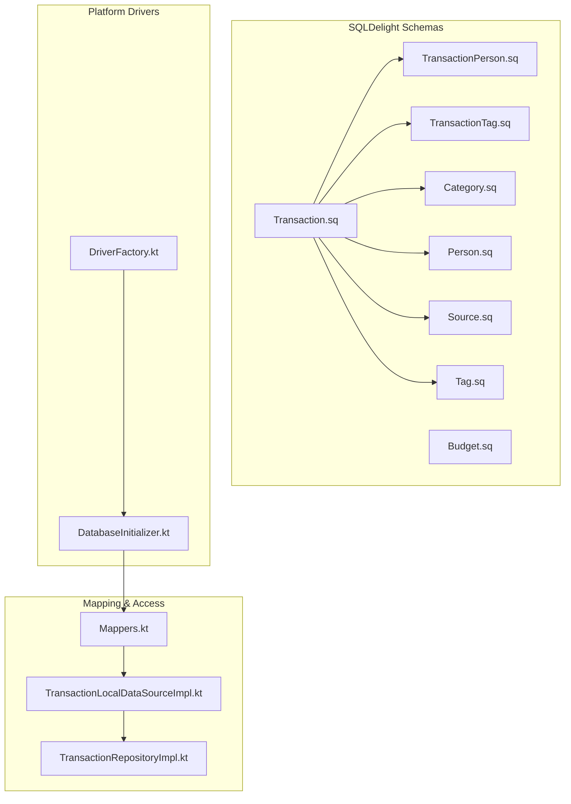
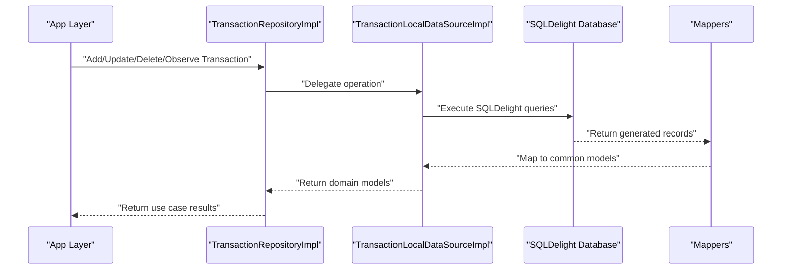
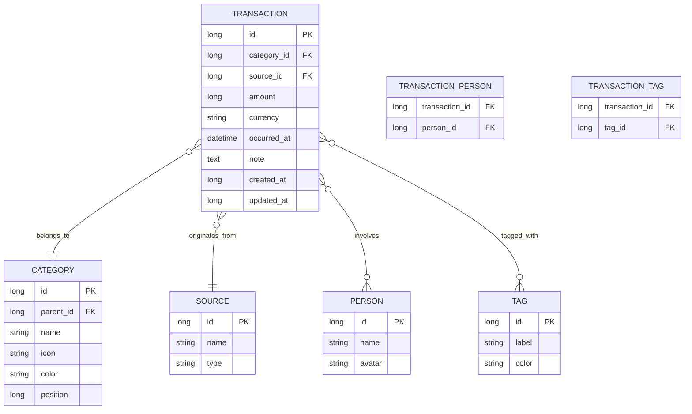
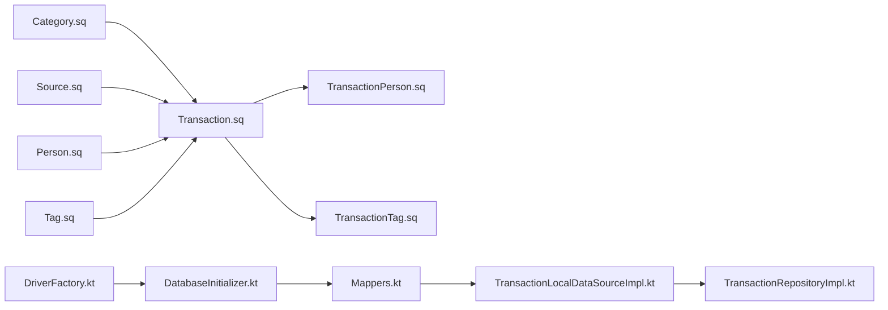

# Database Schemas

<cite>
**Referenced Files in This Document**
- [Budget.sq](file://core/database/src/commonMain/sqldelight/com/kazemieh/database/Budget.sq)
- [Category.sq](file://core/database/src/commonMain/sqldelight/com/kazemieh/database/Category.sq)
- [Person.sq](file://core/database/src/commonMain/sqldelight/com/kazemieh/database/Person.sq)
- [Source.sq](file://core/database/src/commonMain/sqldelight/com/kazemieh/database/Source.sq)
- [Tag.sq](file://core/database/src/commonMain/sqldelight/com/kazemieh/database/Tag.sq)
- [Transaction.sq](file://core/database/src/commonMain/sqldelight/com/kazemieh/database/Transaction.sq)
- [TransactionPerson.sq](file://core/database/src/commonMain/sqldelight/com/kazemieh/database/TransactionPerson.sq)
- [TransactionTag.sq](file://core/database/src/commonMain/sqldelight/com/kazemieh/database/TransactionTag.sq)
- [DatabaseInitializer.kt](file://core/database/src/commonMain/kotlin/com/kazemieh/database/DatabaseInitializer.kt)
- [DriverFactory.kt](file://core/database/src/commonMain/kotlin/com/kazemieh/database/DriverFactory.kt)
- [TransactionLocalDataSourceImpl.kt](file://core/database/src/commonMain/kotlin/com/kazemieh/database/datasource/TransactionLocalDataSourceImpl.kt)
- [Mappers.kt](file://core/database/src/commonMain/kotlin/com/kazemieh/database/mapper/Mappers.kt)
- [TransactionRepositoryImpl.kt](file://core/data/src/commonMain/kotlin/com/kazemieh/data/repository/TransactionRepositoryImpl.kt)
- [TransactionUseCaseGroup.kt](file://core/domain/src/commonMain/kotlin/com/kazemieh/domain/usecase/TransactionUseCaseGroup.kt)
- [Transaction.kt](file://core/common/src/commonMain/kotlin/com/kazemieh/common/model/Transaction.kt)
- [TransactionWithRelations.kt](file://core/common/src/commonMain/kotlin/com/kazemieh/common/model/TransactionWithRelations.kt)
- [Category.kt](file://core/common/src/commonMain/kotlin/com/kazemieh/common/model/Category.kt)
- [Budget.kt](file://core/common/src/commonMain/kotlin/com/kazemieh/common/model/Budget.kt)
- [Person.kt](file://core/common/src/commonMain/kotlin/com/kazemieh/common/model/Person.kt)
- [Tag.kt](file://core/common/src/commonMain/kotlin/com/kazemieh/common/model/Tag.kt)
- [Source.kt](file://core/common/src/commonMain/kotlin/com/kazemieh/common/model/Source.kt)
</cite>

## Table of Contents
1. [Introduction](#introduction)
2. [Project Structure](#project-structure)
3. [Core Components](#core-components)
4. [Architecture Overview](#architecture-overview)
5. [Detailed Component Analysis](#detailed-component-analysis)
6. [Dependency Analysis](#dependency-analysis)
7. [Performance Considerations](#performance-considerations)
8. [Troubleshooting Guide](#troubleshooting-guide)
9. [Conclusion](#conclusion)

## Introduction
This document explains the database schemas used by FinTrack, focusing on SQLDelight-generated schema definitions and table structures. It describes how each SQLDelight file defines database tables, relationships, and constraints, and how these schemas support core business entities: transactions, categories, budgets, persons, tags, and sources. It also covers schema evolution, migration strategies, version management, indexing, data types, and best practices for maintaining data integrity across platforms.

## Project Structure
The database layer is organized around SQLDelight schema files under the common module and platform-specific driver factories. The schema files define tables and relationships, while Kotlin modules handle initialization, mapping, and repository-level access.

**Diagram sources**
- [Transaction.sq](file://core/database/src/commonMain/sqldelight/com/kazemieh/database/Transaction.sq)
- [TransactionPerson.sq](file://core/database/src/commonMain/sqldelight/com/kazemieh/database/TransactionPerson.sq)
- [TransactionTag.sq](file://core/database/src/commonMain/sqldelight/com/kazemieh/database/TransactionTag.sq)
- [Category.sq](file://core/database/src/commonMain/sqldelight/com/kazemieh/database/Category.sq)
- [Budget.sq](file://core/database/src/commonMain/sqldelight/com/kazemieh/database/Budget.sq)
- [Person.sq](file://core/database/src/commonMain/sqldelight/com/kazemieh/database/Person.sq)
- [Source.sq](file://core/database/src/commonMain/sqldelight/com/kazemieh/database/Source.sq)
- [Tag.sq](file://core/database/src/commonMain/sqldelight/com/kazemieh/database/Tag.sq)
- [DriverFactory.kt](file://core/database/src/commonMain/kotlin/com/kazemieh/database/DriverFactory.kt)
- [DatabaseInitializer.kt](file://core/database/src/commonMain/kotlin/com/kazemieh/database/DatabaseInitializer.kt)
- [Mappers.kt](file://core/database/src/commonMain/kotlin/com/kazemieh/database/mapper/Mappers.kt)
- [TransactionLocalDataSourceImpl.kt](file://core/database/src/commonMain/kotlin/com/kazemieh/database/datasource/TransactionLocalDataSourceImpl.kt)
- [TransactionRepositoryImpl.kt](file://core/data/src/commonMain/kotlin/com/kazemieh/data/repository/TransactionRepositoryImpl.kt)

**Section sources**
- [DriverFactory.kt](file://core/database/src/commonMain/kotlin/com/kazemieh/database/DriverFactory.kt)
- [DatabaseInitializer.kt](file://core/database/src/commonMain/kotlin/com/kazemieh/database/DatabaseInitializer.kt)

## Core Components
This section outlines the primary tables and their roles in modeling FinTrack’s financial domain.

- Transaction: Central entity representing income/expense entries with amounts, timestamps, notes, and links to categories, sources, and related persons/tags.
- Category: Hierarchical classification for transactions (supports parent-child relationships).
- Budget: Defines spending limits per category/time period.
- Person: Entities involved in transactions (e.g., payees, debtors).
- Tag: Free-form labels for categorizing transactions.
- Source: Financial origins or destinations (e.g., bank accounts, cash).
- Transaction-Person and Transaction-Tag: Many-to-many junction tables linking transactions to persons and tags.

These tables collectively enable rich reporting, filtering, and analytics across transactions.

**Section sources**
- [Transaction.sq](file://core/database/src/commonMain/sqldelight/com/kazemieh/database/Transaction.sq)
- [Category.sq](file://core/database/src/commonMain/sqldelight/com/kazemieh/database/Category.sq)
- [Budget.sq](file://core/database/src/commonMain/sqldelight/com/kazemieh/database/Budget.sq)
- [Person.sq](file://core/database/src/commonMain/sqldelight/com/kazemieh/database/Person.sq)
- [Tag.sq](file://core/database/src/commonMain/sqldelight/com/kazemieh/database/Tag.sq)
- [Source.sq](file://core/database/src/commonMain/sqldelight/com/kazemieh/database/Source.sq)
- [TransactionPerson.sq](file://core/database/src/commonMain/sqldelight/com/kazemieh/database/TransactionPerson.sq)
- [TransactionTag.sq](file://core/database/src/commonMain/sqldelight/com/kazemieh/database/TransactionTag.sq)

## Architecture Overview
The database architecture follows a layered pattern:
- SQLDelight schemas define tables and relationships.
- Platform drivers initialize the database connection.
- Mappers convert between SQLDelight-generated records and common models.
- Data sources and repositories expose typed operations to the rest of the app.

**Diagram sources**
- [TransactionRepositoryImpl.kt](file://core/data/src/commonMain/kotlin/com/kazemieh/data/repository/TransactionRepositoryImpl.kt)
- [TransactionLocalDataSourceImpl.kt](file://core/database/src/commonMain/kotlin/com/kazemieh/database/datasource/TransactionLocalDataSourceImpl.kt)
- [Mappers.kt](file://core/database/src/commonMain/kotlin/com/kazemieh/database/mapper/Mappers.kt)

## Detailed Component Analysis

### Transaction Schema
Purpose:
- Stores individual financial events with amount, currency, date/time, notes, and metadata.
- Links to Category, Source, and related Persons/Tags via foreign keys.

Key constraints and relationships:
- Foreign keys to Category, Source.
- Junction table links to Person and Tag via many-to-many relations.
- Indexes recommended on frequently filtered columns (e.g., date range, category, source).

**Diagram sources**
- [Transaction.sq](file://core/database/src/commonMain/sqldelight/com/kazemieh/database/Transaction.sq)
- [Category.sq](file://core/database/src/commonMain/sqldelight/com/kazemieh/database/Category.sq)
- [Person.sq](file://core/database/src/commonMain/sqldelight/com/kazemieh/database/Person.sq)
- [Tag.sq](file://core/database/src/commonMain/sqldelight/com/kazemieh/database/Tag.sq)
- [Source.sq](file://core/database/src/commonMain/sqldelight/com/kazemieh/database/Source.sq)
- [TransactionPerson.sq](file://core/database/src/commonMain/sqldelight/com/kazemieh/database/TransactionPerson.sq)
- [TransactionTag.sq](file://core/database/src/commonMain/sqldelight/com/kazemieh/database/TransactionTag.sq)

**Section sources**
- [Transaction.sq](file://core/database/src/commonMain/sqldelight/com/kazemieh/database/Transaction.sq)
- [TransactionPerson.sq](file://core/database/src/commonMain/sqldelight/com/kazemieh/database/TransactionPerson.sq)
- [TransactionTag.sq](file://core/database/src/commonMain/sqldelight/com/kazemieh/database/TransactionTag.sq)

### Category Schema
Purpose:
- Provides hierarchical classification for transactions.
- Supports parent-child relationships for grouping categories.

Constraints:
- Self-referencing foreign key for hierarchy.
- Position field for ordering.

**Section sources**
- [Category.sq](file://core/database/src/commonMain/sqldelight/com/kazemieh/database/Category.sq)

### Budget Schema
Purpose:
- Enforces budget limits per category and time window.
- Supports monthly or custom-period budgets.

Constraints:
- Composite constraints to prevent overlapping budgets for the same category in the same period.

**Section sources**
- [Budget.sq](file://core/database/src/commonMain/sqldelight/com/kazemieh/database/Budget.sq)

### Person Schema
Purpose:
- Represents individuals associated with transactions (payees, debtors, etc.).

Constraints:
- Unique identifiers for consistent linking.

**Section sources**
- [Person.sq](file://core/database/src/commonMain/sqldelight/com/kazemieh/database/Person.sq)

### Tag Schema
Purpose:
- Adds flexible tagging to transactions for ad-hoc grouping and filtering.

Constraints:
- Unique labels to avoid ambiguity.

**Section sources**
- [Tag.sq](file://core/database/src/commonMain/sqldelight/com/kazemieh/database/Tag.sq)

### Source Schema
Purpose:
- Tracks financial sources/destinations (e.g., bank accounts, cash, credit cards).

Constraints:
- Type enumeration to classify sources.

**Section sources**
- [Source.sq](file://core/database/src/commonMain/sqldelight/com/kazemieh/database/Source.sq)

### Many-to-Many Junction Tables
- TransactionPerson: Links transactions to persons.
- TransactionTag: Links transactions to tags.

Constraints:
- Composite primary keys on (transaction_id, person_id) and (transaction_id, tag_id).
- Foreign key constraints to maintain referential integrity.

**Section sources**
- [TransactionPerson.sq](file://core/database/src/commonMain/sqldelight/com/kazemieh/database/TransactionPerson.sq)
- [TransactionTag.sq](file://core/database/src/commonMain/sqldelight/com/kazemieh/database/TransactionTag.sq)

## Dependency Analysis
The following diagram shows how schema definitions depend on each other and how higher layers consume them.

**Diagram sources**
- [Category.sq](file://core/database/src/commonMain/sqldelight/com/kazemieh/database/Category.sq)
- [Source.sq](file://core/database/src/commonMain/sqldelight/com/kazemieh/database/Source.sq)
- [Person.sq](file://core/database/src/commonMain/sqldelight/com/kazemieh/database/Person.sq)
- [Tag.sq](file://core/database/src/commonMain/sqldelight/com/kazemieh/database/Tag.sq)
- [Transaction.sq](file://core/database/src/commonMain/sqldelight/com/kazemieh/database/Transaction.sq)
- [TransactionPerson.sq](file://core/database/src/commonMain/sqldelight/com/kazemieh/database/TransactionPerson.sq)
- [TransactionTag.sq](file://core/database/src/commonMain/sqldelight/com/kazemieh/database/TransactionTag.sq)
- [DriverFactory.kt](file://core/database/src/commonMain/kotlin/com/kazemieh/database/DriverFactory.kt)
- [DatabaseInitializer.kt](file://core/database/src/commonMain/kotlin/com/kazemieh/database/DatabaseInitializer.kt)
- [Mappers.kt](file://core/database/src/commonMain/kotlin/com/kazemieh/database/mapper/Mappers.kt)
- [TransactionLocalDataSourceImpl.kt](file://core/database/src/commonMain/kotlin/com/kazemieh/database/datasource/TransactionLocalDataSourceImpl.kt)
- [TransactionRepositoryImpl.kt](file://core/data/src/commonMain/kotlin/com/kazemieh/data/repository/TransactionRepositoryImpl.kt)

**Section sources**
- [TransactionUseCaseGroup.kt](file://core/domain/src/commonMain/kotlin/com/kazemieh/domain/usecase/TransactionUseCaseGroup.kt)

## Performance Considerations
Indexing strategy:
- Add indexes on Transaction.occurred_at, Transaction.category_id, Transaction.source_id for efficient filtering and sorting.
- Consider composite indexes for frequent query patterns (e.g., date range + category).

Query patterns:
- Prefer projections that fetch only required columns to reduce IO.
- Use LIMIT and OFFSET for paginated lists; avoid SELECT *.

Data types:
- Use INTEGER for numeric IDs and counters; TEXT for labels and names; REAL for monetary amounts when precision is needed.
- Store timestamps as INTEGER or TEXT ISO-8601 strings depending on platform and readability needs.

Normalization:
- Keep Category and Source normalized to avoid duplication.
- Use junction tables for many-to-many relationships to maintain normalization and flexibility.

Caching:
- Cache frequently accessed small reference tables (Category, Source, Tag) in memory to reduce repeated reads.

Best practices:
- Validate foreign keys at write-time to prevent orphaned records.
- Use transactions for multi-row inserts/updates to preserve consistency.
- Avoid N+1 queries by fetching related entities in bulk.

[No sources needed since this section provides general guidance]

## Troubleshooting Guide
Common issues and resolutions:
- Orphaned records after deletion: Ensure CASCADE or explicit cleanup in junction tables when deleting Categories/Sources/Persons/Tags.
- Duplicate categories/tags: Enforce uniqueness constraints and handle conflicts gracefully in mappers.
- Incorrect totals: Verify currency handling and rounding policies; ensure budget calculations align with transaction amounts.
- Migration failures: Validate schema version transitions and ensure all platform drivers are updated consistently.

**Section sources**
- [Mappers.kt](file://core/database/src/commonMain/kotlin/com/kazemieh/database/mapper/Mappers.kt)
- [TransactionLocalDataSourceImpl.kt](file://core/database/src/commonMain/kotlin/com/kazemieh/database/datasource/TransactionLocalDataSourceImpl.kt)

## Conclusion
FinTrack’s database schemas are designed around a central Transaction entity with supporting Category, Budget, Person, Tag, and Source tables. Many-to-many relationships are modeled via dedicated junction tables. The architecture leverages SQLDelight for type-safe schema definitions, platform drivers for connectivity, and mappers for model conversion. Following the indexing, normalization, and consistency practices outlined here will help maintain performance, integrity, and portability across platforms.