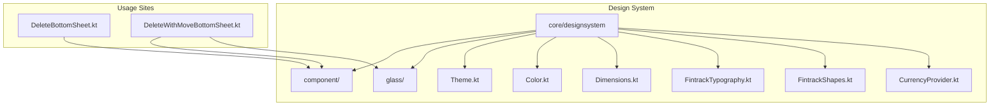
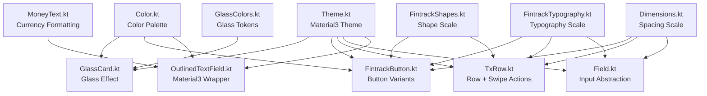
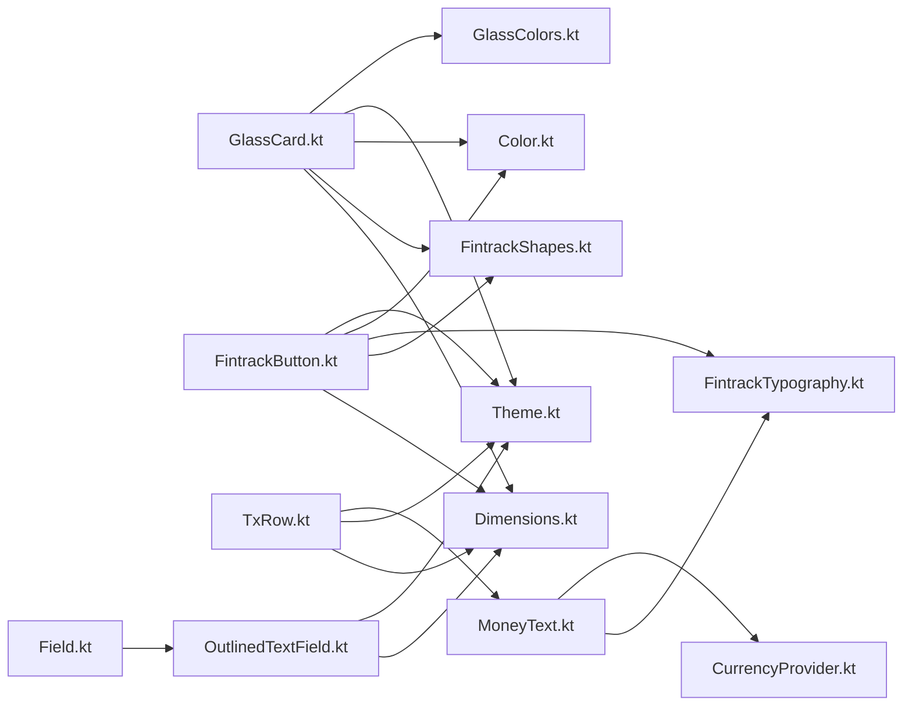

# Design System Components

<cite>
**Referenced Files in This Document**
- [GlassCard.kt](file://core/designsystem/src/commonMain/kotlin/com/kazemieh/designsystem/component/glass/GlassCard.kt)
- [Chip.kt](file://core/designsystem/src/commonMain/kotlin/com/kazemieh/designsystem/component/Chip.kt)
- [FintrackButton.kt](file://core/designsystem/src/commonMain/kotlin/com/kazemieh/designsystem/component/FintrackButton.kt)
- [TxRow.kt](file://core/designsystem/src/commonMain/kotlin/com/kazemieh/designsystem/component/TxRow.kt)
- [Field.kt](file://core/designsystem/src/commonMain/kotlin/com/kazemieh/designsystem/component/Field.kt)
- [MoneyText.kt](file://core/designsystem/src/commonMain/kotlin/com/kazemieh/designsystem/component/MoneyText.kt)
- [OutlinedTextField.kt](file://core/designsystem/src/commonMain/kotlin/com/kazemieh/designsystem/component/OutlinedTextField.kt)
- [GlassColors.kt](file://core/designsystem/src/commonMain/kotlin/com/kazemieh/designsystem/GlassColors.kt)
- [Theme.kt](file://core/designsystem/src/commonMain/kotlin/com/kazemieh/designsystem/Theme.kt)
- [Color.kt](file://core/designsystem/src/commonMain/kotlin/com/kazemieh/designsystem/Color.kt)
- [Dimensions.kt](file://core/designsystem/src/commonMain/kotlin/com/kazemieh/designsystem/Dimensions.kt)
- [FintrackTypography.kt](file://core/designsystem/src/commonMain/kotlin/com/kazemieh/designsystem/FintrackTypography.kt)
- [FintrackShapes.kt](file://core/designsystem/src/commonMain/kotlin/com/kazemieh/designsystem/FintrackShapes.kt)
- [CurrencyProvider.kt](file://core/designsystem/src/commonMain/kotlin/com/kazemieh/designsystem/CurrencyProvider.kt)
- [DeleteBottomSheet.kt](file://core/designsystem/src/commonMain/kotlin/com/kazemieh/designsystem/component/bottomsheet/DeleteBottomSheet.kt)
- [DeleteWithMoveBottomSheet.kt](file://core/designsystem/src/commonMain/kotlin/com/kazemieh/designsystem/component/bottomsheet/DeleteWithMoveBottomSheet.kt)
</cite>

## Table of Contents
1. [Introduction](#introduction)
2. [Project Structure](#project-structure)
3. [Core Components](#core-components)
4. [Architecture Overview](#architecture-overview)
5. [Detailed Component Analysis](#detailed-component-analysis)
6. [Dependency Analysis](#dependency-analysis)
7. [Performance Considerations](#performance-considerations)
8. [Troubleshooting Guide](#troubleshooting-guide)
9. [Conclusion](#conclusion)
10. [Appendices](#appendices)

## Introduction
This document describes the Design System Components used across FinTrack’s Compose-based UI. It focuses on reusable components that implement glassmorphism aesthetics, adhere to Material3 theming, and integrate consistently across platforms. Covered components include GlassCard, Chip, FintrackButton, TxRow, Field, MoneyText, and OutlinedTextField. For each component, we outline props/parameters, styling options, event handlers, customization capabilities, usage patterns, state management, accessibility, responsiveness, and performance considerations. We also provide guidelines for extending existing components and building new ones aligned with the established design system.

## Project Structure
The design system resides under the core/designsystem module. Key areas:
- component/: Reusable composables (GlassCard, Chip, FintrackButton, TxRow, Field, MoneyText, OutlinedTextField)
- glass/: Glassmorphism utilities and color helpers
- theme/: Material3 theme integration (colors, typography, shapes, dimensions)
- CurrencyProvider.kt: Monetary formatting and currency-aware rendering

**Diagram sources**
- [GlassCard.kt](file://core/designsystem/src/commonMain/kotlin/com/kazemieh/designsystem/component/glass/GlassCard.kt)
- [FintrackButton.kt](file://core/designsystem/src/commonMain/kotlin/com/kazemieh/designsystem/component/FintrackButton.kt)
- [TxRow.kt](file://core/designsystem/src/commonMain/kotlin/com/kazemieh/designsystem/component/TxRow.kt)
- [OutlinedTextField.kt](file://core/designsystem/src/commonMain/kotlin/com/kazemieh/designsystem/component/OutlinedTextField.kt)
- [GlassColors.kt](file://core/designsystem/src/commonMain/kotlin/com/kazemieh/designsystem/GlassColors.kt)
- [Theme.kt](file://core/designsystem/src/commonMain/kotlin/com/kazemieh/designsystem/Theme.kt)
- [Color.kt](file://core/designsystem/src/commonMain/kotlin/com/kazemieh/designsystem/Color.kt)
- [Dimensions.kt](file://core/designsystem/src/commonMain/kotlin/com/kazemieh/designsystem/Dimensions.kt)
- [FintrackTypography.kt](file://core/designsystem/src/commonMain/kotlin/com/kazemieh/designsystem/FintrackTypography.kt)
- [FintrackShapes.kt](file://core/designsystem/src/commonMain/kotlin/com/kazemieh/designsystem/FintrackShapes.kt)
- [CurrencyProvider.kt](file://core/designsystem/src/commonMain/kotlin/com/kazemieh/designsystem/CurrencyProvider.kt)
- [DeleteBottomSheet.kt](file://core/designsystem/src/commonMain/kotlin/com/kazemieh/designsystem/component/bottomsheet/DeleteBottomSheet.kt)
- [DeleteWithMoveBottomSheet.kt](file://core/designsystem/src/commonMain/kotlin/com/kazemieh/designsystem/component/bottomsheet/DeleteWithMoveBottomSheet.kt)

**Section sources**
- [GlassCard.kt](file://core/designsystem/src/commonMain/kotlin/com/kazemieh/designsystem/component/glass/GlassCard.kt)
- [FintrackButton.kt](file://core/designsystem/src/commonMain/kotlin/com/kazemieh/designsystem/component/FintrackButton.kt)
- [TxRow.kt](file://core/designsystem/src/commonMain/kotlin/com/kazemieh/designsystem/component/TxRow.kt)
- [OutlinedTextField.kt](file://core/designsystem/src/commonMain/kotlin/com/kazemieh/designsystem/component/OutlinedTextField.kt)
- [GlassColors.kt](file://core/designsystem/src/commonMain/kotlin/com/kazemieh/designsystem/GlassColors.kt)
- [Theme.kt](file://core/designsystem/src/commonMain/kotlin/com/kazemieh/designsystem/Theme.kt)
- [Color.kt](file://core/designsystem/src/commonMain/kotlin/com/kazemieh/designsystem/Color.kt)
- [Dimensions.kt](file://core/designsystem/src/commonMain/kotlin/com/kazemieh/designsystem/Dimensions.kt)
- [FintrackTypography.kt](file://core/designsystem/src/commonMain/kotlin/com/kazemieh/designsystem/FintrackTypography.kt)
- [FintrackShapes.kt](file://core/designsystem/src/commonMain/kotlin/com/kazemieh/designsystem/FintrackShapes.kt)
- [CurrencyProvider.kt](file://core/designsystem/src/commonMain/kotlin/com/kazemieh/designsystem/CurrencyProvider.kt)
- [DeleteBottomSheet.kt](file://core/designsystem/src/commonMain/kotlin/com/kazemieh/designsystem/component/bottomsheet/DeleteBottomSheet.kt)
- [DeleteWithMoveBottomSheet.kt](file://core/designsystem/src/commonMain/kotlin/com/kazemieh/designsystem/component/bottomsheet/DeleteWithMoveBottomSheet.kt)

## Core Components
This section summarizes the primary design system components and their roles.

- GlassCard: Implements a frosted-glass effect container with optional elevation and rounded corners. Supports tinting and overlay blending for depth.
- Chip: Lightweight interactive tag-like element for selections, filters, or labels. Supports selected/unselected states and click handlers.
- FintrackButton: Material3-styled button with consistent sizing, typography, and elevation. Provides primary, secondary, and tonal variants via theme tokens.
- TxRow: Transaction row renderer with swipe actions and minimal variant. Integrates with swipeable rows for destructive actions and selection callbacks.
- Field: Input field abstraction built on Material3 OutlinedTextField. Offers validation, label, placeholder, and error messaging.
- MoneyText: Currency-aware text renderer that formats amounts according to locale and currency provider.
- OutlinedTextField: Thin wrapper around Material3 OutlinedTextField with FinTrack-specific defaults and theming.

Each component exposes a clear API surface with props for content, styling, and behavior, enabling consistent UI composition across screens.

**Section sources**
- [GlassCard.kt](file://core/designsystem/src/commonMain/kotlin/com/kazemieh/designsystem/component/glass/GlassCard.kt)
- [Chip.kt](file://core/designsystem/src/commonMain/kotlin/com/kazemieh/designsystem/component/Chip.kt)
- [FintrackButton.kt](file://core/designsystem/src/commonMain/kotlin/com/kazemieh/designsystem/component/FintrackButton.kt)
- [TxRow.kt](file://core/designsystem/src/commonMain/kotlin/com/kazemieh/designsystem/component/TxRow.kt)
- [Field.kt](file://core/designsystem/src/commonMain/kotlin/com/kazemieh/designsystem/component/Field.kt)
- [MoneyText.kt](file://core/designsystem/src/commonMain/kotlin/com/kazemieh/designsystem/component/MoneyText.kt)
- [OutlinedTextField.kt](file://core/designsystem/src/commonMain/kotlin/com/kazemieh/designsystem/component/OutlinedTextField.kt)

## Architecture Overview
The design system integrates Material3 theming with glassmorphism visuals and platform-specific rendering. Components consume theme tokens for colors, typography, shapes, and spacing. GlassCard leverages GlassColors for backdrop blur and translucency effects. MoneyText relies on CurrencyProvider for localized formatting. OutlinedTextField aligns with Material3 defaults while applying FinTrack-specific color schemes.

**Diagram sources**
- [Theme.kt](file://core/designsystem/src/commonMain/kotlin/com/kazemieh/designsystem/Theme.kt)
- [Color.kt](file://core/designsystem/src/commonMain/kotlin/com/kazemieh/designsystem/Color.kt)
- [FintrackTypography.kt](file://core/designsystem/src/commonMain/kotlin/com/kazemieh/designsystem/FintrackTypography.kt)
- [FintrackShapes.kt](file://core/designsystem/src/commonMain/kotlin/com/kazemieh/designsystem/FintrackShapes.kt)
- [Dimensions.kt](file://core/designsystem/src/commonMain/kotlin/com/kazemieh/designsystem/Dimensions.kt)
- [GlassCard.kt](file://core/designsystem/src/commonMain/kotlin/com/kazemieh/designsystem/component/glass/GlassCard.kt)
- [GlassColors.kt](file://core/designsystem/src/commonMain/kotlin/com/kazemieh/designsystem/GlassColors.kt)
- [FintrackButton.kt](file://core/designsystem/src/commonMain/kotlin/com/kazemieh/designsystem/component/FintrackButton.kt)
- [TxRow.kt](file://core/designsystem/src/commonMain/kotlin/com/kazemieh/designsystem/component/TxRow.kt)
- [Field.kt](file://core/designsystem/src/commonMain/kotlin/com/kazemieh/designsystem/component/Field.kt)
- [MoneyText.kt](file://core/designsystem/src/commonMain/kotlin/com/kazemieh/designsystem/component/MoneyText.kt)
- [OutlinedTextField.kt](file://core/designsystem/src/commonMain/kotlin/com/kazemieh/designsystem/component/OutlinedTextField.kt)

## Detailed Component Analysis

### GlassCard
GlassCard provides a frosted-glass container suitable for modal overlays, cards, and floating panels. It typically uses translucent backgrounds, blurred backdrop regions, and subtle borders to achieve depth without heavy shadows.

Key props and customization:
- Background tint: Controls base translucency and color overlay
- Elevation: Optional shadow for subtle lift
- Rounded corners: Shape scale applied via theme
- Content padding: Spacing scale applied internally
- Clickable area: Optional gesture support for interactions

Styling options:
- Uses GlassColors for backdrop blur and translucency tokens
- Integrates with theme colors for border and surface contrast
- Responsive padding and corner radius scales

Accessibility:
- Ensure sufficient contrast against backdrop
- Provide focus indicators if containing interactive elements
- Respect dynamic type and large text accessibility settings

Integration examples:
- Used inside bottom sheets for action containers
- Serves as a base for dialog-like surfaces

**Section sources**
- [GlassCard.kt](file://core/designsystem/src/commonMain/kotlin/com/kazemieh/designsystem/component/glass/GlassCard.kt)
- [GlassColors.kt](file://core/designsystem/src/commonMain/kotlin/com/kazemieh/designsystem/GlassColors.kt)
- [Theme.kt](file://core/designsystem/src/commonMain/kotlin/com/kazemieh/designsystem/Theme.kt)
- [Color.kt](file://core/designsystem/src/commonMain/kotlin/com/kazemieh/designsystem/Color.kt)
- [FintrackShapes.kt](file://core/designsystem/src/commonMain/kotlin/com/kazemieh/designsystem/FintrackShapes.kt)
- [Dimensions.kt](file://core/designsystem/src/commonMain/kotlin/com/kazemieh/designsystem/Dimensions.kt)
- [DeleteBottomSheet.kt](file://core/designsystem/src/commonMain/kotlin/com/kazemieh/designsystem/component/bottomsheet/DeleteBottomSheet.kt)

### Chip
Chip renders a compact, clickable tag for selections, filters, or labels. It supports selected/unselected states and emits click events.

Key props and customization:
- Text label: Displayed content
- Selected state: Visual indication and optional callback
- Leading/trailing icons: Optional adornments
- Click handler: Callback invoked on selection change

Styling options:
- Typography and padding scales
- Color roles for selected vs unselected states
- Shape scale for rounded edges

Accessibility:
- Announce selection state changes
- Keyboard operability (focus + activation)
- Touch target sizing per platform minimums

Integration examples:
- Filter chips in transaction lists
- Category/tag chips in forms

**Section sources**
- [Chip.kt](file://core/designsystem/src/commonMain/kotlin/com/kazemieh/designsystem/component/Chip.kt)
- [Theme.kt](file://core/designsystem/src/commonMain/kotlin/com/kazemieh/designsystem/Theme.kt)
- [FintrackTypography.kt](file://core/designsystem/src/commonMain/kotlin/com/kazemieh/designsystem/FintrackTypography.kt)
- [FintrackShapes.kt](file://core/designsystem/src/commonMain/kotlin/com/kazemieh/designsystem/FintrackShapes.kt)
- [Dimensions.kt](file://core/designsystem/src/commonMain/kotlin/com/kazemieh/designsystem/Dimensions.kt)

### FintrackButton
FintrackButton wraps Material3 button semantics with FinTrack branding and theme tokens. It supports primary, secondary, and tonal variants.

Key props and customization:
- Text label
- Leading/trailing icon
- Enabled/disabled state
- Click handler
- Variant: primary, secondary, tonal
- Size: small, medium, large

Styling options:
- Typography scale for label
- Elevation and shape scales
- Color roles from theme (primary, secondary, tertiary, surface)

Accessibility:
- Clear affordance and focus ring
- Disabled state communicates non-interactive state
- Sufficient contrast against all backgrounds

Integration examples:
- Action buttons in modals and bottom sheets
- Navigation and form submission controls

**Section sources**
- [FintrackButton.kt](file://core/designsystem/src/commonMain/kotlin/com/kazemieh/designsystem/component/FintrackButton.kt)
- [Theme.kt](file://core/designsystem/src/commonMain/kotlin/com/kazemieh/designsystem/Theme.kt)
- [FintrackTypography.kt](file://core/designsystem/src/commonMain/kotlin/com/kazemieh/designsystem/FintrackTypography.kt)
- [FintrackShapes.kt](file://core/designsystem/src/commonMain/kotlin/com/kazemieh/designsystem/FintrackShapes.kt)
- [Dimensions.kt](file://core/designsystem/src/commonMain/kotlin/com/kazemieh/designsystem/Dimensions.kt)

### TxRow
TxRow renders a single transaction row with optional swipe actions and a minimal variant. It supports click callbacks and destructive actions via swipeable wrappers.

Key props and customization:
- Transaction data: title, amount, date, category, tags
- On click handler
- Optional delete handler for swipe-to-delete
- Minimal mode: reduced layout for dense lists

Styling options:
- Typography scale for labels and amounts
- Color roles for positive/negative amounts
- Spacing scales for content alignment

Accessibility:
- Announce transaction details upon selection
- Provide affordances for swipe actions
- Ensure touch targets meet minimum sizes

Integration examples:
- Transaction list screens
- Swipeable actions for quick deletion

**Section sources**
- [TxRow.kt](file://core/designsystem/src/commonMain/kotlin/com/kazemieh/designsystem/component/TxRow.kt)
- [MoneyText.kt](file://core/designsystem/src/commonMain/kotlin/com/kazemieh/designsystem/component/MoneyText.kt)
- [FintrackTypography.kt](file://core/designsystem/src/commonMain/kotlin/com/kazemieh/designsystem/FintrackTypography.kt)
- [Dimensions.kt](file://core/designsystem/src/commonMain/kotlin/com/kazemieh/designsystem/Dimensions.kt)

### Field
Field abstracts an input field built on Material3 OutlinedTextField. It standardizes labels, placeholders, validation, and error messaging.

Key props and customization:
- Label text
- Placeholder text
- Value binding (mutable state)
- On value change callback
- Error text and visibility
- Enabled/disabled state
- Keyboard options and input types

Styling options:
- Material3 OutlinedTextField defaults with FinTrack color scheme
- Typography and spacing scales
- Shape scale for rounded borders

Accessibility:
- Proper labeling and error announcements
- Focus management and keyboard navigation
- Input type hints for assistive technologies

Integration examples:
- Form fields in onboarding and settings
- Search and filter inputs

**Section sources**
- [Field.kt](file://core/designsystem/src/commonMain/kotlin/com/kazemieh/designsystem/component/Field.kt)
- [OutlinedTextField.kt](file://core/designsystem/src/commonMain/kotlin/com/kazemieh/designsystem/component/OutlinedTextField.kt)
- [Theme.kt](file://core/designsystem/src/commonMain/kotlin/com/kazemieh/designsystem/Theme.kt)
- [FintrackTypography.kt](file://core/designsystem/src/commonMain/kotlin/com/kazemieh/designsystem/FintrackTypography.kt)
- [Dimensions.kt](file://core/designsystem/src/commonMain/kotlin/com/kazemieh/designsystem/Dimensions.kt)

### MoneyText
MoneyText formats and displays monetary amounts with currency awareness. It integrates with the CurrencyProvider to localize amounts and apply currency symbols.

Key props and customization:
- Amount value
- Currency code or provider context
- Negative formatting (color, sign, style)
- Locale-aware formatting
- Minimum fractional digits and grouping

Styling options:
- Typography scale for numeric display
- Color roles for positive/negative values
- Monospace digits for alignment in tables

Accessibility:
- Announce amounts with currency context
- Support screen readers for large numbers
- Respect dynamic type scaling

Integration examples:
- Transaction rows and reports
- Summary cards and balances

**Section sources**
- [MoneyText.kt](file://core/designsystem/src/commonMain/kotlin/com/kazemieh/designsystem/component/MoneyText.kt)
- [CurrencyProvider.kt](file://core/designsystem/src/commonMain/kotlin/com/kazemieh/designsystem/CurrencyProvider.kt)
- [FintrackTypography.kt](file://core/designsystem/src/commonMain/kotlin/com/kazemieh/designsystem/FintrackTypography.kt)
- [Color.kt](file://core/designsystem/src/commonMain/kotlin/com/kazemieh/designsystem/Color.kt)

### OutlinedTextField
OutlinedTextField is a thin wrapper around Material3 OutlinedTextField, applying FinTrack-specific defaults and theme tokens for colors, typography, and spacing.

Key props and customization:
- Label and placeholder
- Value binding and change callback
- Leading/trailing icons
- Error state and message
- Enabled/disabled state
- Keyboard options and input types

Styling options:
- Uses Material3 defaults with FinTrack color roles
- Typography scale for labels and input text
- Spacing for internal padding and borders

Accessibility:
- Proper label association
- Focus ring and keyboard navigation
- Error messages announced clearly

Integration examples:
- Generic input fields across screens
- Search and filter controls

**Section sources**
- [OutlinedTextField.kt](file://core/designsystem/src/commonMain/kotlin/com/kazemieh/designsystem/component/OutlinedTextField.kt)
- [Theme.kt](file://core/designsystem/src/commonMain/kotlin/com/kazemieh/designsystem/Theme.kt)
- [FintrackTypography.kt](file://core/designsystem/src/commonMain/kotlin/com/kazemieh/designsystem/FintrackTypography.kt)
- [Dimensions.kt](file://core/designsystem/src/commonMain/kotlin/com/kazemieh/designsystem/Dimensions.kt)

## Dependency Analysis
The components depend on shared theme tokens and utilities. GlassCard depends on GlassColors for visual effects. MoneyText depends on CurrencyProvider for formatting. OutlinedTextField aligns with Material3 defaults but applies FinTrack color roles. Buttons and rows consume typography and shape scales.

**Diagram sources**
- [GlassCard.kt](file://core/designsystem/src/commonMain/kotlin/com/kazemieh/designsystem/component/glass/GlassCard.kt)
- [GlassColors.kt](file://core/designsystem/src/commonMain/kotlin/com/kazemieh/designsystem/GlassColors.kt)
- [Theme.kt](file://core/designsystem/src/commonMain/kotlin/com/kazemieh/designsystem/Theme.kt)
- [Color.kt](file://core/designsystem/src/commonMain/kotlin/com/kazemieh/designsystem/Color.kt)
- [FintrackShapes.kt](file://core/designsystem/src/commonMain/kotlin/com/kazemieh/designsystem/FintrackShapes.kt)
- [Dimensions.kt](file://core/designsystem/src/commonMain/kotlin/com/kazemieh/designsystem/Dimensions.kt)
- [FintrackButton.kt](file://core/designsystem/src/commonMain/kotlin/com/kazemieh/designsystem/component/FintrackButton.kt)
- [TxRow.kt](file://core/designsystem/src/commonMain/kotlin/com/kazemieh/designsystem/component/TxRow.kt)
- [MoneyText.kt](file://core/designsystem/src/commonMain/kotlin/com/kazemieh/designsystem/component/MoneyText.kt)
- [CurrencyProvider.kt](file://core/designsystem/src/commonMain/kotlin/com/kazemieh/designsystem/CurrencyProvider.kt)
- [Field.kt](file://core/designsystem/src/commonMain/kotlin/com/kazemieh/designsystem/component/Field.kt)
- [OutlinedTextField.kt](file://core/designsystem/src/commonMain/kotlin/com/kazemieh/designsystem/component/OutlinedTextField.kt)
- [FintrackTypography.kt](file://core/designsystem/src/commonMain/kotlin/com/kazemieh/designsystem/FintrackTypography.kt)

**Section sources**
- [GlassCard.kt](file://core/designsystem/src/commonMain/kotlin/com/kazemieh/designsystem/component/glass/GlassCard.kt)
- [GlassColors.kt](file://core/designsystem/src/commonMain/kotlin/com/kazemieh/designsystem/GlassColors.kt)
- [Theme.kt](file://core/designsystem/src/commonMain/kotlin/com/kazemieh/designsystem/Theme.kt)
- [Color.kt](file://core/designsystem/src/commonMain/kotlin/com/kazemieh/designsystem/Color.kt)
- [FintrackShapes.kt](file://core/designsystem/src/commonMain/kotlin/com/kazemieh/designsystem/FintrackShapes.kt)
- [Dimensions.kt](file://core/designsystem/src/commonMain/kotlin/com/kazemieh/designsystem/Dimensions.kt)
- [FintrackButton.kt](file://core/designsystem/src/commonMain/kotlin/com/kazemieh/designsystem/component/FintrackButton.kt)
- [TxRow.kt](file://core/designsystem/src/commonMain/kotlin/com/kazemieh/designsystem/component/TxRow.kt)
- [MoneyText.kt](file://core/designsystem/src/commonMain/kotlin/com/kazemieh/designsystem/component/MoneyText.kt)
- [CurrencyProvider.kt](file://core/designsystem/src/commonMain/kotlin/com/kazemieh/designsystem/CurrencyProvider.kt)
- [Field.kt](file://core/designsystem/src/commonMain/kotlin/com/kazemieh/designsystem/component/Field.kt)
- [OutlinedTextField.kt](file://core/designsystem/src/commonMain/kotlin/com/kazemieh/designsystem/component/OutlinedTextField.kt)
- [FintrackTypography.kt](file://core/designsystem/src/commonMain/kotlin/com/kazemieh/designsystem/FintrackTypography.kt)

## Performance Considerations
- Prefer immutable state updates and recomposition boundaries to minimize unnecessary recompositions.
- Use lazy lists for long transaction feeds; leverage stable keys for items.
- Defer expensive formatting operations in MoneyText to background threads when parsing large datasets.
- Cache formatted currency strings per locale/currency pair to avoid repeated computations.
- Avoid deep nested layouts; use compact row variants (e.g., TxRow minimal) for dense lists.
- Use semantic props and accessibility APIs to reduce runtime checks during rendering.

## Troubleshooting Guide
Common issues and resolutions:
- Low contrast in GlassCard: Adjust tint alpha and border colors to meet accessibility contrast ratios.
- Button text truncation: Use appropriate typography scale and avoid overly long labels; enable overflow handling.
- Input field misalignment: Ensure consistent spacing and typography scales; verify label and placeholder usage.
- MoneyText formatting inconsistencies: Verify currency provider configuration and locale settings; cache formatted values.
- Swipe actions not triggering: Confirm gesture handling and callback wiring; test on different devices and orientations.

**Section sources**
- [GlassCard.kt](file://core/designsystem/src/commonMain/kotlin/com/kazemieh/designsystem/component/glass/GlassCard.kt)
- [FintrackButton.kt](file://core/designsystem/src/commonMain/kotlin/com/kazemieh/designsystem/component/FintrackButton.kt)
- [Field.kt](file://core/designsystem/src/commonMain/kotlin/com/kazemieh/designsystem/component/Field.kt)
- [MoneyText.kt](file://core/designsystem/src/commonMain/kotlin/com/kazemieh/designsystem/component/MoneyText.kt)
- [TxRow.kt](file://core/designsystem/src/commonMain/kotlin/com/kazemieh/designsystem/component/TxRow.kt)

## Conclusion
The Design System Components provide a cohesive, accessible, and performant foundation for FinTrack’s UI. By leveraging Material3 theming, glassmorphism visuals, and consistent spacing/typography scales, components deliver a unified user experience across platforms. Following the patterns outlined here ensures maintainability, scalability, and adherence to the established design system.

## Appendices

### Component Composition Patterns
- Container-first pattern: Wrap content in GlassCard for layered surfaces.
- Control-first pattern: Use FintrackButton for primary actions; complement with Chip for secondary selections.
- List-first pattern: Render TxRow in scrollable lists; use minimal variant for dense layouts.
- Input-first pattern: Use Field for forms; pair with MoneyText for amount inputs.

### Accessibility Best Practices
- Always associate labels with inputs; announce errors clearly.
- Ensure sufficient color contrast and focus indicators.
- Provide keyboard navigation and screen reader support.
- Respect dynamic type and large text accessibility settings.

### Responsive Design Considerations
- Use dimension scales for padding and margins; adapt spacing for tablet and desktop.
- Adjust typography scales for larger screens; maintain readable line heights.
- Optimize touch targets for mobile; ensure adequate spacing on small screens.

### Cross-Platform Rendering Differences
- GlassCard translucency and blur may render differently on iOS vs Android; test and adjust alpha/tint accordingly.
- Button elevation and ripple effects vary by platform; rely on Material3 semantics for consistent UX.
- TextField behavior differs slightly across platforms; validate keyboard behavior and input types.

### Extending Existing Components
- To extend GlassCard: add optional shadow/elevation props; expose tint alpha and border radius overrides.
- To extend Chip: add icon-only mode; support multi-select with selection callbacks.
- To extend FintrackButton: add loading state; support custom leading/trailing icons; add size variants.
- To extend TxRow: add avatar or icon badges; support multi-line labels; expose swipe action customization.
- To extend Field: add masked inputs; support character counters; expose keyboard type customization.
- To extend MoneyText: add custom formatting hooks; support negative/positive sign placement; expose monospace digit alignment.

### Creating New Custom Components
- Define a clear API surface with props for content, styling, and behavior.
- Consume theme tokens for colors, typography, shapes, and spacing.
- Implement accessibility attributes and keyboard navigation.
- Test across platforms and screen sizes; optimize for performance.
- Document usage patterns and integration examples.