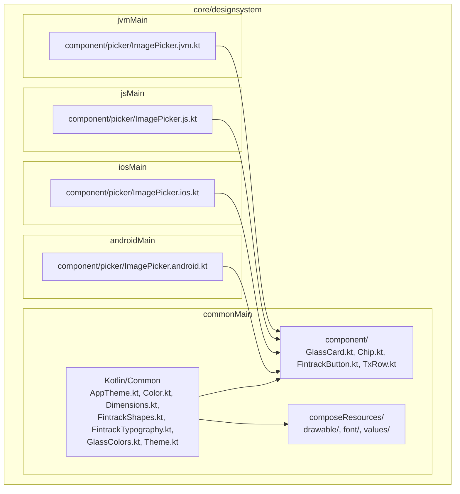
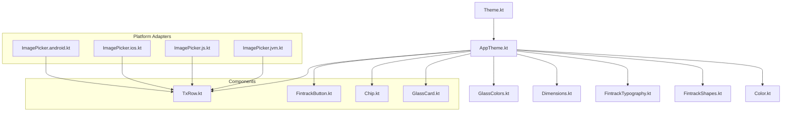
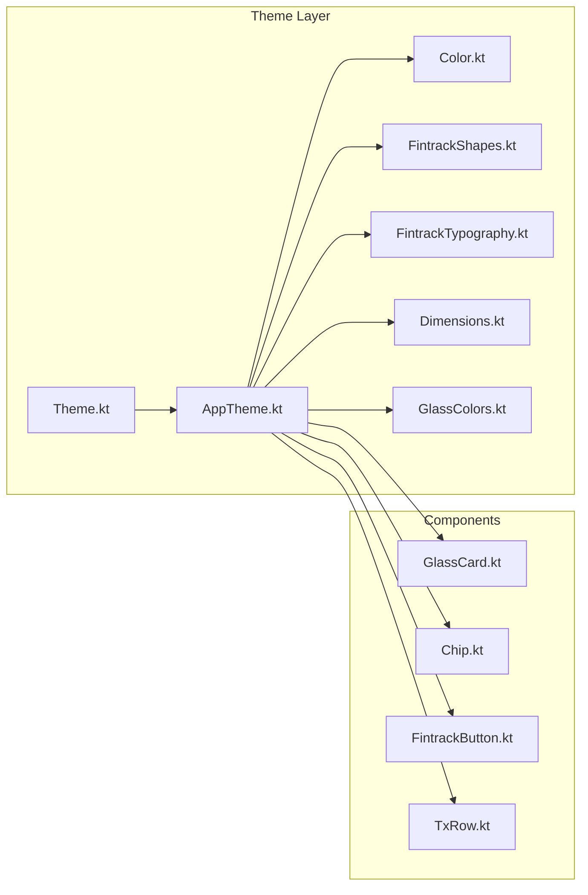

# Design System Module

<cite>
**Referenced Files in This Document**
- [AppTheme.kt](file://core/designsystem/src/commonMain/kotlin/com/kazemieh/designsystem/AppTheme.kt)
- [Color.kt](file://core/designsystem/src/commonMain/kotlin/com/kazemieh/designsystem/Color.kt)
- [Dimensions.kt](file://core/designsystem/src/commonMain/kotlin/com/kazemieh/designsystem/Dimensions.kt)
- [FintrackShapes.kt](file://core/designsystem/src/commonMain/kotlin/com/kazemieh/designsystem/FintrackShapes.kt)
- [FintrackTypography.kt](file://core/designsystem/src/commonMain/kotlin/com/kazemieh/designsystem/FintrackTypography.kt)
- [GlassColors.kt](file://core/designsystem/src/commonMain/kotlin/com/kazemieh/designsystem/GlassColors.kt)
- [Theme.kt](file://core/designsystem/src/commonMain/kotlin/com/kazemieh/designsystem/Theme.kt)
- [GlassCard.kt](file://core/designsystem/src/commonMain/kotlin/com/kazemieh/designsystem/component/GlassCard.kt)
- [Chip.kt](file://core/designsystem/src/commonMain/kotlin/com/kazemieh/designsystem/component/Chip.kt)
- [FintrackButton.kt](file://core/designsystem/src/commonMain/kotlin/com/kazemieh/designsystem/component/FintrackButton.kt)
- [TxRow.kt](file://core/designsystem/src/commonMain/kotlin/com/kazemieh/designsystem/component/TxRow.kt)
- [ImagePicker.android.kt](file://core/designsystem/src/androidMain/kotlin/com/kazemieh/designsystem/component/picker/ImagePicker.android.kt)
- [ImagePicker.ios.kt](file://core/designsystem/src/iosMain/kotlin/com/kazemieh/designsystem/component/picker/ImagePicker.ios.kt)
- [ImagePicker.js.kt](file://core/designsystem/src/jsMain/kotlin/com/kazemieh/designsystem/component/picker/ImagePicker.js.kt)
- [ImagePicker.jvm.kt](file://core/designsystem/src/jvmMain/kotlin/com/kazemieh/designsystem/component/picker/ImagePicker.jvm.kt)
- [compose_resources_overview.md](file://core/designsystem/src/commonMain/composeResources/README.md)
</cite>

## Table of Contents
1. [Introduction](#introduction)
2. [Project Structure](#project-structure)
3. [Core Components](#core-components)
4. [Architecture Overview](#architecture-overview)
5. [Detailed Component Analysis](#detailed-component-analysis)
6. [Dependency Analysis](#dependency-analysis)
7. [Performance Considerations](#performance-considerations)
8. [Troubleshooting Guide](#troubleshooting-guide)
9. [Conclusion](#conclusion)
10. [Appendices](#appendices)

## Introduction
The Design System module establishes shared UI primitives, theming, and visual consistency across platforms in a Compose Multiplatform application. It centralizes:
- Reusable components (GlassCard, Chip, FintrackButton, TxRow)
- Theme definitions, color palettes, shapes, and typography
- Platform-specific adaptations for Android, iOS, Web (JS), and JVM
- Glassmorphism styling utilities for modern UI effects

This layer ensures that all screens and features consume a single source of truth for colors, typography, spacing, shapes, and component behavior, enabling scalable, maintainable, and visually coherent experiences across Android, iOS, Web, and Desktop.

## Project Structure
The Design System is organized by platform targets and shared Kotlin/Common code, with dedicated resource directories for icons and fonts.

**Diagram sources**
- [AppTheme.kt](file://core/designsystem/src/commonMain/kotlin/com/kazemieh/designsystem/AppTheme.kt)
- [Color.kt](file://core/designsystem/src/commonMain/kotlin/com/kazemieh/designsystem/Color.kt)
- [Dimensions.kt](file://core/designsystem/src/commonMain/kotlin/com/kazemieh/designsystem/Dimensions.kt)
- [FintrackShapes.kt](file://core/designsystem/src/commonMain/kotlin/com/kazemieh/designsystem/FintrackShapes.kt)
- [FintrackTypography.kt](file://core/designsystem/src/commonMain/kotlin/com/kazemieh/designsystem/FintrackTypography.kt)
- [GlassColors.kt](file://core/designsystem/src/commonMain/kotlin/com/kazemieh/designsystem/GlassColors.kt)
- [Theme.kt](file://core/designsystem/src/commonMain/kotlin/com/kazemieh/designsystem/Theme.kt)
- [GlassCard.kt](file://core/designsystem/src/commonMain/kotlin/com/kazemieh/designsystem/component/GlassCard.kt)
- [Chip.kt](file://core/designsystem/src/commonMain/kotlin/com/kazemieh/designsystem/component/Chip.kt)
- [FintrackButton.kt](file://core/designsystem/src/commonMain/kotlin/com/kazemieh/designsystem/component/FintrackButton.kt)
- [TxRow.kt](file://core/designsystem/src/commonMain/kotlin/com/kazemieh/designsystem/component/TxRow.kt)
- [ImagePicker.android.kt](file://core/designsystem/src/androidMain/kotlin/com/kazemieh/designsystem/component/picker/ImagePicker.android.kt)
- [ImagePicker.ios.kt](file://core/designsystem/src/iosMain/kotlin/com/kazemieh/designsystem/component/picker/ImagePicker.ios.kt)
- [ImagePicker.js.kt](file://core/designsystem/src/jsMain/kotlin/com/kazemieh/designsystem/component/picker/ImagePicker.js.kt)
- [ImagePicker.jvm.kt](file://core/designsystem/src/jvmMain/kotlin/com/kazemieh/designsystem/component/picker/ImagePicker.jvm.kt)

**Section sources**
- [AppTheme.kt](file://core/designsystem/src/commonMain/kotlin/com/kazemieh/designsystem/AppTheme.kt)
- [Color.kt](file://core/designsystem/src/commonMain/kotlin/com/kazemieh/designsystem/Color.kt)
- [Dimensions.kt](file://core/designsystem/src/commonMain/kotlin/com/kazemieh/designsystem/Dimensions.kt)
- [FintrackShapes.kt](file://core/designsystem/src/commonMain/kotlin/com/kazemieh/designsystem/FintrackShapes.kt)
- [FintrackTypography.kt](file://core/designsystem/src/commonMain/kotlin/com/kazemieh/designsystem/FintrackTypography.kt)
- [GlassColors.kt](file://core/designsystem/src/commonMain/kotlin/com/kazemieh/designsystem/GlassColors.kt)
- [Theme.kt](file://core/designsystem/src/commonMain/kotlin/com/kazemieh/designsystem/Theme.kt)
- [GlassCard.kt](file://core/designsystem/src/commonMain/kotlin/com/kazemieh/designsystem/component/GlassCard.kt)
- [Chip.kt](file://core/designsystem/src/commonMain/kotlin/com/kazemieh/designsystem/component/Chip.kt)
- [FintrackButton.kt](file://core/designsystem/src/commonMain/kotlin/com/kazemieh/designsystem/component/FintrackButton.kt)
- [TxRow.kt](file://core/designsystem/src/commonMain/kotlin/com/kazemieh/designsystem/component/TxRow.kt)
- [ImagePicker.android.kt](file://core/designsystem/src/androidMain/kotlin/com/kazemieh/designsystem/component/picker/ImagePicker.android.kt)
- [ImagePicker.ios.kt](file://core/designsystem/src/iosMain/kotlin/com/kazemieh/designsystem/component/picker/ImagePicker.ios.kt)
- [ImagePicker.js.kt](file://core/designsystem/src/jsMain/kotlin/com/kazemieh/designsystem/component/picker/ImagePicker.js.kt)
- [ImagePicker.jvm.kt](file://core/designsystem/src/jvmMain/kotlin/com/kazemieh/designsystem/component/picker/ImagePicker.jvm.kt)

## Core Components
This section introduces the foundational building blocks of the Design System and how they work together to deliver consistent UI across platforms.

- Theme and Theming
  - Theme.kt defines the primary theme entry points and integrates Material3 tokens with FinTrack brand values.
  - AppTheme.kt exposes prebuilt theme instances for light/dark modes and platform-specific overrides.
  - Color.kt centralizes named color roles and semantic mappings.
  - FintrackShapes.kt standardizes corner radii and shape definitions.
  - FintrackTypography.kt defines typographic scales and text styles.
  - Dimensions.kt standardizes spacing and layout metrics.
  - GlassColors.kt provides glassmorphism-ready color variants for translucent backgrounds.

- Shared Components
  - GlassCard.kt: A card component optimized for glassmorphism with blur/backdrop support and rounded corners.
  - Chip.kt: A compact selection/label element suitable for filters and tags.
  - FintrackButton.kt: A unified button component supporting multiple variants (filled, outlined, tonal) and sizes.
  - TxRow.kt: A row component tailored for transaction lists, encapsulating icon, title, subtitle, and amount presentation.

- Platform-Specific Pickers
  - ImagePicker.android.kt, ImagePicker.ios.kt, ImagePicker.js.kt, ImagePicker.jvm.kt: Platform adapters for image selection workflows.

Practical usage patterns:
- Apply the global theme via AppTheme in your UI composition roots.
- Use FintrackButton for primary actions, Chip for lightweight selections, GlassCard for content containers, and TxRow for list entries.
- Customize colors, typography, and shapes by overriding theme tokens in Theme.kt or AppTheme.kt.

**Section sources**
- [Theme.kt](file://core/designsystem/src/commonMain/kotlin/com/kazemieh/designsystem/Theme.kt)
- [AppTheme.kt](file://core/designsystem/src/commonMain/kotlin/com/kazemieh/designsystem/AppTheme.kt)
- [Color.kt](file://core/designsystem/src/commonMain/kotlin/com/kazemieh/designsystem/Color.kt)
- [FintrackShapes.kt](file://core/designsystem/src/commonMain/kotlin/com/kazemieh/designsystem/FintrackShapes.kt)
- [FintrackTypography.kt](file://core/designsystem/src/commonMain/kotlin/com/kazemieh/designsystem/FintrackTypography.kt)
- [Dimensions.kt](file://core/designsystem/src/commonMain/kotlin/com/kazemieh/designsystem/Dimensions.kt)
- [GlassColors.kt](file://core/designsystem/src/commonMain/kotlin/com/kazemieh/designsystem/GlassColors.kt)
- [GlassCard.kt](file://core/designsystem/src/commonMain/kotlin/com/kazemieh/designsystem/component/GlassCard.kt)
- [Chip.kt](file://core/designsystem/src/commonMain/kotlin/com/kazemieh/designsystem/component/Chip.kt)
- [FintrackButton.kt](file://core/designsystem/src/commonMain/kotlin/com/kazemieh/designsystem/component/FintrackButton.kt)
- [TxRow.kt](file://core/designsystem/src/commonMain/kotlin/com/kazemieh/designsystem/component/TxRow.kt)

## Architecture Overview
The Design System composes theme tokens, platform-specific resources, and shared components into a cohesive UI framework.

**Diagram sources**
- [Theme.kt](file://core/designsystem/src/commonMain/kotlin/com/kazemieh/designsystem/Theme.kt)
- [AppTheme.kt](file://core/designsystem/src/commonMain/kotlin/com/kazemieh/designsystem/AppTheme.kt)
- [Color.kt](file://core/designsystem/src/commonMain/kotlin/com/kazemieh/designsystem/Color.kt)
- [FintrackShapes.kt](file://core/designsystem/src/commonMain/kotlin/com/kazemieh/designsystem/FintrackShapes.kt)
- [FintrackTypography.kt](file://core/designsystem/src/commonMain/kotlin/com/kazemieh/designsystem/FintrackTypography.kt)
- [Dimensions.kt](file://core/designsystem/src/commonMain/kotlin/com/kazemieh/designsystem/Dimensions.kt)
- [GlassColors.kt](file://core/designsystem/src/commonMain/kotlin/com/kazemieh/designsystem/GlassColors.kt)
- [GlassCard.kt](file://core/designsystem/src/commonMain/kotlin/com/kazemieh/designsystem/component/GlassCard.kt)
- [Chip.kt](file://core/designsystem/src/commonMain/kotlin/com/kazemieh/designsystem/component/Chip.kt)
- [FintrackButton.kt](file://core/designsystem/src/commonMain/kotlin/com/kazemieh/designsystem/component/FintrackButton.kt)
- [TxRow.kt](file://core/designsystem/src/commonMain/kotlin/com/kazemieh/designsystem/component/TxRow.kt)
- [ImagePicker.android.kt](file://core/designsystem/src/androidMain/kotlin/com/kazemieh/designsystem/component/picker/ImagePicker.android.kt)
- [ImagePicker.ios.kt](file://core/designsystem/src/iosMain/kotlin/com/kazemieh/designsystem/component/picker/ImagePicker.ios.kt)
- [ImagePicker.js.kt](file://core/designsystem/src/jsMain/kotlin/com/kazemieh/designsystem/component/picker/ImagePicker.js.kt)
- [ImagePicker.jvm.kt](file://core/designsystem/src/jvmMain/kotlin/com/kazemieh/designsystem/component/picker/ImagePicker.jvm.kt)

## Detailed Component Analysis

### GlassCard
GlassCard is a container optimized for glassmorphism effects, combining transparency, blur, and rounded corners to achieve depth while maintaining readability.

Key aspects:
- Purpose: Surface container for content requiring a frosted-glass appearance.
- Props/Parameters: Typically includes content padding, corner radius, surface tint, content alignment, and optional elevation or shadow.
- Styling Options: Uses GlassColors for translucent backgrounds and Material3 surface tokens for contrast.
- Platform Adaptations: Leverages platform-specific rendering capabilities for blur/backdrop effects.

Usage pattern:
- Wrap content inside GlassCard to emphasize layered surfaces.
- Combine with appropriate typography and spacing tokens from Dimensions and FintrackTypography.

**Section sources**
- [GlassCard.kt](file://core/designsystem/src/commonMain/kotlin/com/kazemieh/designsystem/component/GlassCard.kt)
- [GlassColors.kt](file://core/designsystem/src/commonMain/kotlin/com/kazemieh/designsystem/GlassColors.kt)
- [FintrackShapes.kt](file://core/designsystem/src/commonMain/kotlin/com/kazemieh/designsystem/FintrackShapes.kt)
- [FintrackTypography.kt](file://core/designsystem/src/commonMain/kotlin/com/kazemieh/designsystem/FintrackTypography.kt)
- [Dimensions.kt](file://core/designsystem/src/commonMain/kotlin/com/kazemieh/designsystem/Dimensions.kt)

### Chip
Chip is a compact interactive element used for selections, tags, and filters.

Key aspects:
- Purpose: Lightweight selection or labeling control.
- Props/Parameters: Includes label text, selected state, leading/trailing icons, click handler, and variant (e.g., filter vs. suggestion).
- Styling Options: Uses Color roles and Shapes for consistent visual treatment.
- Platform Adaptations: Ensures touch targets meet accessibility guidelines across platforms.

Usage pattern:
- Use Chips for quick filters, tagging, or multi-select scenarios.
- Pair with FintrackButton for primary actions and GlassCard for grouping related controls.

**Section sources**
- [Chip.kt](file://core/designsystem/src/commonMain/kotlin/com/kazemieh/designsystem/component/Chip.kt)
- [Color.kt](file://core/designsystem/src/commonMain/kotlin/com/kazemieh/designsystem/Color.kt)
- [FintrackShapes.kt](file://core/designsystem/src/commonMain/kotlin/com/kazemieh/designsystem/FintrackShapes.kt)

### FintrackButton
FintrackButton unifies action affordances across the app with consistent sizing, states, and variants.

Key aspects:
- Purpose: Primary and secondary actions with standardized behavior.
- Props/Parameters: Variant (filled, outlined, tonal), size (small/medium/large), enabled/disabled state, icon placement, and click handler.
- Styling Options: Integrates with Color roles, Typography, and Shapes for coherent visuals.
- Platform Adaptations: Adapts hover/focus semantics and ripple effects per platform.

Usage pattern:
- Prefer FintrackButton for all actionable elements to maintain consistency.
- Use outlined or tonal variants for secondary actions; filled for primary actions.

**Section sources**
- [FintrackButton.kt](file://core/designsystem/src/commonMain/kotlin/com/kazemieh/designsystem/component/FintrackButton.kt)
- [Color.kt](file://core/designsystem/src/commonMain/kotlin/com/kazemieh/designsystem/Color.kt)
- [FintrackTypography.kt](file://core/designsystem/src/commonMain/kotlin/com/kazemieh/designsystem/FintrackTypography.kt)
- [FintrackShapes.kt](file://core/designsystem/src/commonMain/kotlin/com/kazemieh/designsystem/FintrackShapes.kt)

### TxRow
TxRow presents transaction-related information in a compact, scannable row format.

Key aspects:
- Purpose: Efficiently display transaction metadata (icon, title, subtitle, amount) in lists.
- Props/Parameters: Icon resource, title text, subtitle text, amount value, currency, and optional actions.
- Styling Options: Uses FintrackTypography for text hierarchy and Color roles for emphasis.
- Platform Adaptations: Responsive layout adjustments for different screen sizes and densities.

Usage pattern:
- Render lists of transactions using TxRow to improve readability and scanning speed.
- Combine with scrollable containers and appropriate spacing tokens.

**Section sources**
- [TxRow.kt](file://core/designsystem/src/commonMain/kotlin/com/kazemieh/designsystem/component/TxRow.kt)
- [FintrackTypography.kt](file://core/designsystem/src/commonMain/kotlin/com/kazemieh/designsystem/FintrackTypography.kt)
- [Color.kt](file://core/designsystem/src/commonMain/kotlin/com/kazemieh/designsystem/Color.kt)
- [Dimensions.kt](file://core/designsystem/src/commonMain/kotlin/com/kazemieh/designsystem/Dimensions.kt)

### Image Picker Adapters
Platform-specific pickers adapt image selection workflows to each target.

Key aspects:
- Purpose: Unified interface for selecting images across Android, iOS, Web, and JVM.
- Implementation: Each platform adapter implements the same logical contract using native APIs.
- Integration: Consumers use the shared contract to trigger selection and receive results consistently.

Usage pattern:
- Inject the platform-specific ImagePicker into screens that require media selection.
- Handle permissions and fallbacks gracefully across platforms.

**Section sources**
- [ImagePicker.android.kt](file://core/designsystem/src/androidMain/kotlin/com/kazemieh/designsystem/component/picker/ImagePicker.android.kt)
- [ImagePicker.ios.kt](file://core/designsystem/src/iosMain/kotlin/com/kazemieh/designsystem/component/picker/ImagePicker.ios.kt)
- [ImagePicker.js.kt](file://core/designsystem/src/jsMain/kotlin/com/kazemieh/designsystem/component/picker/ImagePicker.js.kt)
- [ImagePicker.jvm.kt](file://core/designsystem/src/jvmMain/kotlin/com/kazemieh/designsystem/component/picker/ImagePicker.jvm.kt)

## Dependency Analysis
The Design System components depend on shared theme tokens and platform adapters. Dependencies are intentionally decoupled to enable reuse across modules.

**Diagram sources**
- [Theme.kt](file://core/designsystem/src/commonMain/kotlin/com/kazemieh/designsystem/Theme.kt)
- [AppTheme.kt](file://core/designsystem/src/commonMain/kotlin/com/kazemieh/designsystem/AppTheme.kt)
- [Color.kt](file://core/designsystem/src/commonMain/kotlin/com/kazemieh/designsystem/Color.kt)
- [FintrackShapes.kt](file://core/designsystem/src/commonMain/kotlin/com/kazemieh/designsystem/FintrackShapes.kt)
- [FintrackTypography.kt](file://core/designsystem/src/commonMain/kotlin/com/kazemieh/designsystem/FintrackTypography.kt)
- [Dimensions.kt](file://core/designsystem/src/commonMain/kotlin/com/kazemieh/designsystem/Dimensions.kt)
- [GlassColors.kt](file://core/designsystem/src/commonMain/kotlin/com/kazemieh/designsystem/GlassColors.kt)
- [GlassCard.kt](file://core/designsystem/src/commonMain/kotlin/com/kazemieh/designsystem/component/GlassCard.kt)
- [Chip.kt](file://core/designsystem/src/commonMain/kotlin/com/kazemieh/designsystem/component/Chip.kt)
- [FintrackButton.kt](file://core/designsystem/src/commonMain/kotlin/com/kazemieh/designsystem/component/FintrackButton.kt)
- [TxRow.kt](file://core/designsystem/src/commonMain/kotlin/com/kazemieh/designsystem/component/TxRow.kt)

**Section sources**
- [Theme.kt](file://core/designsystem/src/commonMain/kotlin/com/kazemieh/designsystem/Theme.kt)
- [AppTheme.kt](file://core/designsystem/src/commonMain/kotlin/com/kazemieh/designsystem/AppTheme.kt)
- [Color.kt](file://core/designsystem/src/commonMain/kotlin/com/kazemieh/designsystem/Color.kt)
- [FintrackShapes.kt](file://core/designsystem/src/commonMain/kotlin/com/kazemieh/designsystem/FintrackShapes.kt)
- [FintrackTypography.kt](file://core/designsystem/src/commonMain/kotlin/com/kazemieh/designsystem/FintrackTypography.kt)
- [Dimensions.kt](file://core/designsystem/src/commonMain/kotlin/com/kazemieh/designsystem/Dimensions.kt)
- [GlassColors.kt](file://core/designsystem/src/commonMain/kotlin/com/kazemieh/designsystem/GlassColors.kt)
- [GlassCard.kt](file://core/designsystem/src/commonMain/kotlin/com/kazemieh/designsystem/component/GlassCard.kt)
- [Chip.kt](file://core/designsystem/src/commonMain/kotlin/com/kazemieh/designsystem/component/Chip.kt)
- [FintrackButton.kt](file://core/designsystem/src/commonMain/kotlin/com/kazemieh/designsystem/component/FintrackButton.kt)
- [TxRow.kt](file://core/designsystem/src/commonMain/kotlin/com/kazemieh/designsystem/component/TxRow.kt)

## Performance Considerations
- Prefer shared theme tokens to minimize recomposition churn across components.
- Use GlassCard judiciously; excessive nested translucent surfaces can impact rendering performance on lower-end devices.
- Keep Chip and TxRow layouts flat to avoid deep composition trees.
- Defer heavy computations off the UI thread and cache formatted currency/text where possible.
- Optimize image loading and caching in platform-specific pickers to reduce memory pressure.

## Troubleshooting Guide
Common issues and resolutions:
- Inconsistent colors or typography: Verify that components consume tokens from Color.kt, FintrackTypography.kt, and AppTheme.kt rather than hardcoded values.
- Glass effect not visible: Confirm GlassColors usage and platform-specific backdrop/blur support.
- Touch target too small: Adjust spacing via Dimensions.kt and ensure accessibility compliance.
- Platform-specific picker errors: Validate platform adapters and handle permission prompts gracefully.

**Section sources**
- [Color.kt](file://core/designsystem/src/commonMain/kotlin/com/kazemieh/designsystem/Color.kt)
- [FintrackTypography.kt](file://core/designsystem/src/commonMain/kotlin/com/kazemieh/designsystem/FintrackTypography.kt)
- [Dimensions.kt](file://core/designsystem/src/commonMain/kotlin/com/kazemieh/designsystem/Dimensions.kt)
- [GlassColors.kt](file://core/designsystem/src/commonMain/kotlin/com/kazemieh/designsystem/GlassColors.kt)
- [ImagePicker.android.kt](file://core/designsystem/src/androidMain/kotlin/com/kazemieh/designsystem/component/picker/ImagePicker.android.kt)
- [ImagePicker.ios.kt](file://core/designsystem/src/iosMain/kotlin/com/kazemieh/designsystem/component/picker/ImagePicker.ios.kt)
- [ImagePicker.js.kt](file://core/designsystem/src/jsMain/kotlin/com/kazemieh/designsystem/component/picker/ImagePicker.js.kt)
- [ImagePicker.jvm.kt](file://core/designsystem/src/jvmMain/kotlin/com/kazemieh/designsystem/component/picker/ImagePicker.jvm.kt)

## Conclusion
The Design System module provides a robust foundation for consistent, scalable UI across platforms. By centralizing theme tokens, color palettes, typography, shapes, and spacing, and by offering reusable components like GlassCard, Chip, FintrackButton, and TxRow, it enables teams to build cohesive experiences quickly and safely. Platform-specific adapters ensure native-feeling interactions while preserving a unified design language.

## Appendices
- Resource overview: The composeResources directory contains drawable icons, fonts, and values for the Design System. These assets are consumed by components and themes to maintain visual consistency across platforms.

**Section sources**
- [compose_resources_overview.md](file://core/designsystem/src/commonMain/composeResources/README.md)