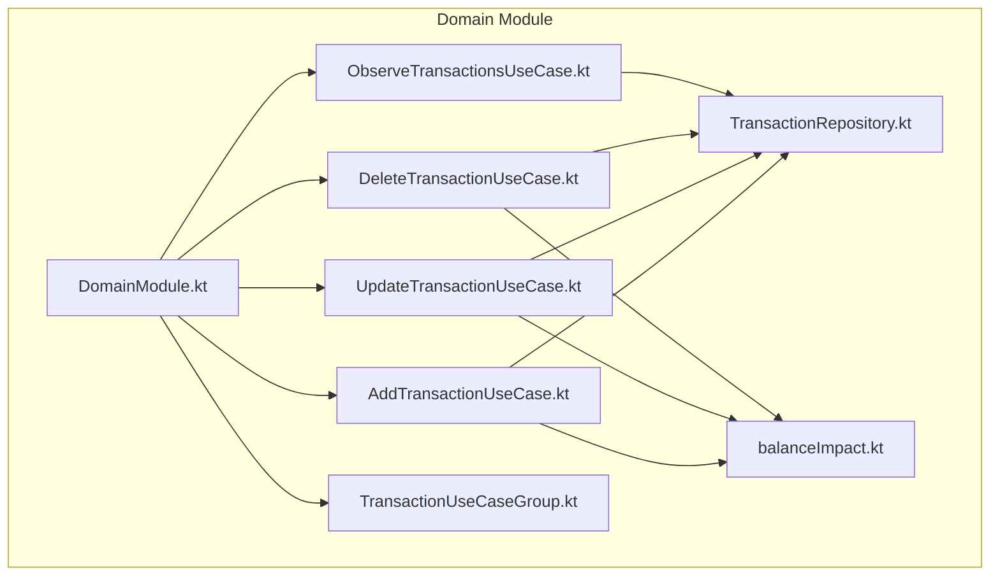
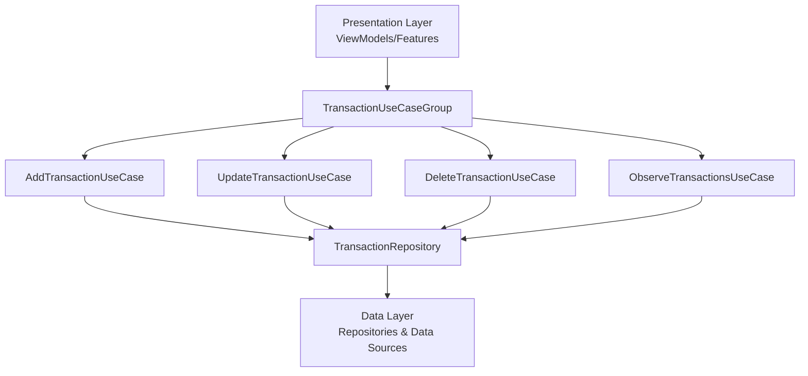
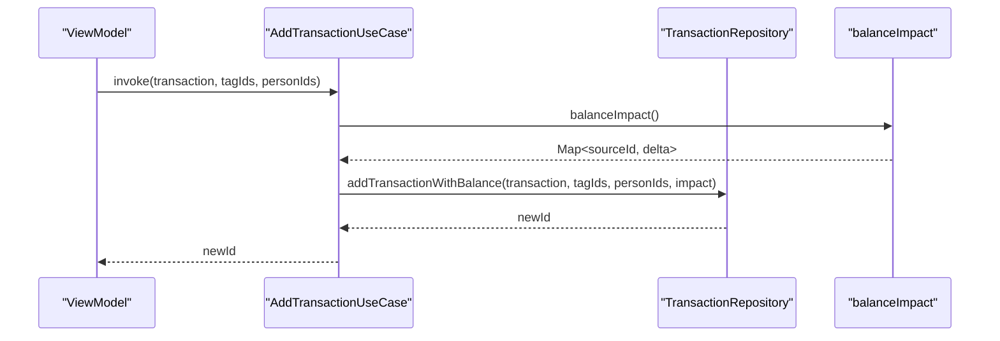
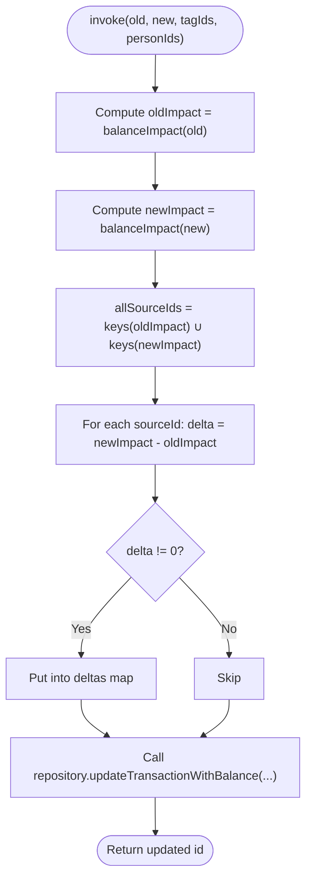
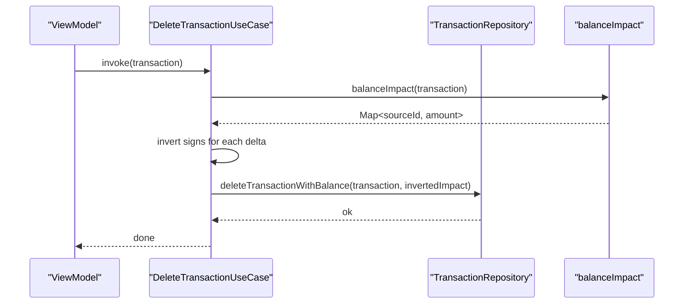
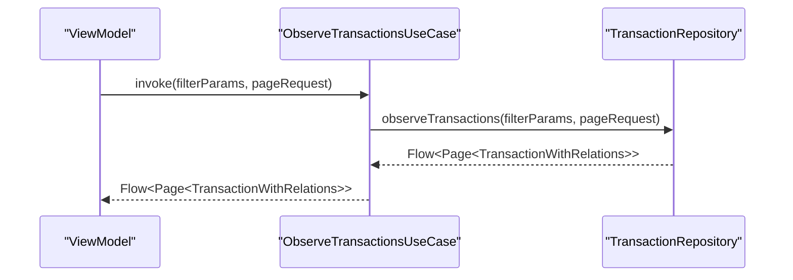
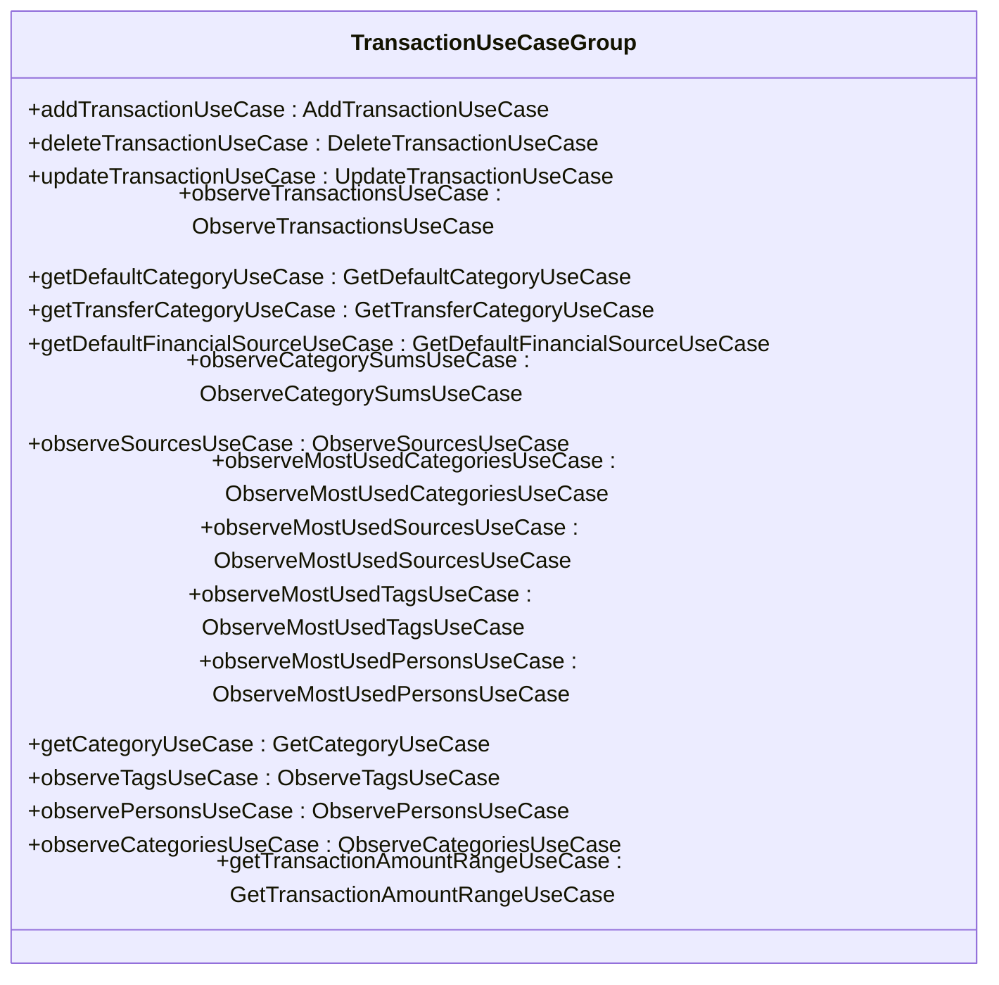
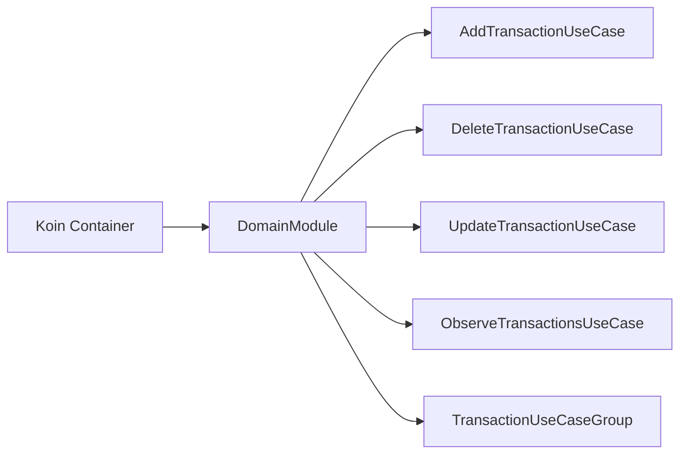
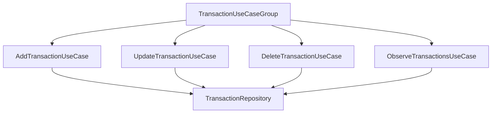

# Domain Module

<cite>
**Referenced Files in This Document**
- [DomainModule.kt](file://core/domain/src/commonMain/kotlin/com/kazemieh/domain/di/DomainModule.kt)
- [TransactionRepository.kt](file://core/domain/src/commonMain/kotlin/com/kazemieh/domain/repository/TransactionRepository.kt)
- [AddTransactionUseCase.kt](file://core/domain/src/commonMain/kotlin/com/kazemieh/domain/usecase/AddTransactionUseCase.kt)
- [DeleteTransactionUseCase.kt](file://core/domain/src/commonMain/kotlin/com/kazemieh/domain/usecase/DeleteTransactionUseCase.kt)
- [UpdateTransactionUseCase.kt](file://core/domain/src/commonMain/kotlin/com/kazemieh/domain/usecase/UpdateTransactionUseCase.kt)
- [ObserveTransactionsUseCase.kt](file://core/domain/src/commonMain/kotlin/com/kazemieh/domain/usecase/ObserveTransactionsUseCase.kt)
- [TransactionUseCaseGroup.kt](file://core/domain/src/commonMain/kotlin/com/kazemieh/domain/usecase/TransactionUseCaseGroup.kt)
- [balanceImpact.kt](file://core/domain/src/commonMain/kotlin/com/kazemieh/domain/util/balanceImpact.kt)
</cite>

## Table of Contents
1. [Introduction](#introduction)
2. [Project Structure](#project-structure)
3. [Core Components](#core-components)
4. [Architecture Overview](#architecture-overview)
5. [Detailed Component Analysis](#detailed-component-analysis)
6. [Dependency Analysis](#dependency-analysis)
7. [Performance Considerations](#performance-considerations)
8. [Troubleshooting Guide](#troubleshooting-guide)
9. [Conclusion](#conclusion)

## Introduction
The Domain module encapsulates the application’s core business logic and use cases. It defines the essential workflows for financial transaction management, categorization, tagging, persons, sources, and preferences. The module adheres to clean architecture principles by separating business rules from infrastructure concerns. It leverages the repository pattern to abstract data access and reactive programming via Kotlin Flows to expose real-time updates. Dependency injection is handled through Koin, enabling testability and modularity.

## Project Structure
The Domain module is organized into three primary packages:
- repository: Defines repository interfaces that abstract data access contracts.
- usecase: Implements use case classes that orchestrate business operations and coordinate with repositories.
- di: Declares Koin modules to wire use cases and repositories.

**Diagram sources**
- [DomainModule.kt:63-163](file://core/domain/src/commonMain/kotlin/com/kazemieh/domain/di/DomainModule.kt#L63-L163)
- [TransactionRepository.kt:16-93](file://core/domain/src/commonMain/kotlin/com/kazemieh/domain/repository/TransactionRepository.kt#L16-L93)
- [TransactionUseCaseGroup.kt:3-22](file://core/domain/src/commonMain/kotlin/com/kazemieh/domain/usecase/TransactionUseCaseGroup.kt#L3-L22)
- [AddTransactionUseCase.kt:7-18](file://core/domain/src/commonMain/kotlin/com/kazemieh/domain/usecase/AddTransactionUseCase.kt#L7-L18)
- [UpdateTransactionUseCase.kt:7-31](file://core/domain/src/commonMain/kotlin/com/kazemieh/domain/usecase/UpdateTransactionUseCase.kt#L7-L31)
- [DeleteTransactionUseCase.kt:7-14](file://core/domain/src/commonMain/kotlin/com/kazemieh/domain/usecase/DeleteTransactionUseCase.kt#L7-L14)
- [ObserveTransactionsUseCase.kt:10-19](file://core/domain/src/commonMain/kotlin/com/kazemieh/domain/usecase/ObserveTransactionsUseCase.kt#L10-L19)
- [balanceImpact.kt:6-17](file://core/domain/src/commonMain/kotlin/com/kazemieh/domain/util/balanceImpact.kt#L6-L17)

**Section sources**
- [DomainModule.kt:63-163](file://core/domain/src/commonMain/kotlin/com/kazemieh/domain/di/DomainModule.kt#L63-L163)

## Core Components
- Repository interface: Defines contracts for CRUD operations, observation via Flows, and specialized queries for categories, tags, persons, sources, budgets, preferences, and recent searches.
- Use cases: Encapsulate specific business operations such as adding, updating, and deleting transactions, observing lists, and grouping related use cases for cohesive access.
- Dependency injection: Koin module wires use cases and groups them into cohesive units for presentation layers.

Key responsibilities:
- Transaction management: Add, update, delete with balance impact calculations.
- Observation: Real-time streams for transactions, categories, tags, sources, and persons.
- Grouping: TransactionUseCaseGroup aggregates related use cases for streamlined access.

**Section sources**
- [TransactionRepository.kt:16-93](file://core/domain/src/commonMain/kotlin/com/kazemieh/domain/repository/TransactionRepository.kt#L16-L93)
- [TransactionUseCaseGroup.kt:3-22](file://core/domain/src/commonMain/kotlin/com/kazemieh/domain/usecase/TransactionUseCaseGroup.kt#L3-L22)

## Architecture Overview
The Domain layer sits between the Presentation and Data layers. Presentation requests use cases, which validate inputs, compute business rules, and delegate to repositories. Repositories abstract persistence and emit reactive streams.

**Diagram sources**
- [TransactionUseCaseGroup.kt:3-22](file://core/domain/src/commonMain/kotlin/com/kazemieh/domain/usecase/TransactionUseCaseGroup.kt#L3-L22)
- [AddTransactionUseCase.kt:7-18](file://core/domain/src/commonMain/kotlin/com/kazemieh/domain/usecase/AddTransactionUseCase.kt#L7-L18)
- [UpdateTransactionUseCase.kt:7-31](file://core/domain/src/commonMain/kotlin/com/kazemieh/domain/usecase/UpdateTransactionUseCase.kt#L7-L31)
- [DeleteTransactionUseCase.kt:7-14](file://core/domain/src/commonMain/kotlin/com/kazemieh/domain/usecase/DeleteTransactionUseCase.kt#L7-L14)
- [ObserveTransactionsUseCase.kt:10-19](file://core/domain/src/commonMain/kotlin/com/kazemieh/domain/usecase/ObserveTransactionsUseCase.kt#L10-L19)
- [TransactionRepository.kt:16-93](file://core/domain/src/commonMain/kotlin/com/kazemieh/domain/repository/TransactionRepository.kt#L16-L93)

## Detailed Component Analysis

### Use Case Pattern Overview
- Purpose: Encapsulate application-specific workflows as single-responsibility operations.
- Inputs/Outputs: Each use case defines typed parameters and return types, often returning primitives, entities, or Flow streams.
- Error handling: Business logic validates preconditions; exceptions propagate to callers who can translate them into UI-friendly errors.

Beginner-friendly concepts:
- A use case is a command or query that performs a business operation.
- It depends on repositories, not on UI or platform specifics.
- Reactive use cases return Flow for real-time updates.

Expert-level details:
- Use cases coordinate multiple repository calls and compute derived values (e.g., balance impact).
- They centralize cross-cutting concerns like validation and side effects.

### Transaction Use Cases

#### AddTransactionUseCase
- Responsibility: Persist a transaction and associated relations, computing balance impact per source.
- Inputs: Transaction entity, tag identifiers, person identifiers.
- Output: Identifier of the created transaction.
- Processing logic:
  - Compute balance impact from the transaction type and amounts.
  - Delegate to repository with impact map to atomically persist and update balances.
- Error handling: Propagates repository exceptions; callers should handle failure states.

**Diagram sources**
- [AddTransactionUseCase.kt:10-17](file://core/domain/src/commonMain/kotlin/com/kazemieh/domain/usecase/AddTransactionUseCase.kt#L10-L17)
- [balanceImpact.kt:6-17](file://core/domain/src/commonMain/kotlin/com/kazemieh/domain/util/balanceImpact.kt#L6-L17)
- [TransactionRepository.kt:18-23](file://core/domain/src/commonMain/kotlin/com/kazemieh/domain/repository/TransactionRepository.kt#L18-L23)

**Section sources**
- [AddTransactionUseCase.kt:7-18](file://core/domain/src/commonMain/kotlin/com/kazemieh/domain/usecase/AddTransactionUseCase.kt#L7-L18)
- [balanceImpact.kt:6-17](file://core/domain/src/commonMain/kotlin/com/kazemieh/domain/util/balanceImpact.kt#L6-L17)
- [TransactionRepository.kt:18-23](file://core/domain/src/commonMain/kotlin/com/kazemieh/domain/repository/TransactionRepository.kt#L18-L23)

#### UpdateTransactionUseCase
- Responsibility: Atomically update a transaction and recalculate balance deltas across affected sources.
- Inputs: Old transaction, new transaction, new tag identifiers, new person identifiers.
- Output: Identifier of the updated transaction.
- Processing logic:
  - Compute impacts for old and new transactions.
  - Derive deltas per source and pass to repository for incremental balance updates.
- Error handling: Propagates repository exceptions; callers should handle partial failures.

**Diagram sources**
- [UpdateTransactionUseCase.kt:10-28](file://core/domain/src/commonMain/kotlin/com/kazemieh/domain/usecase/UpdateTransactionUseCase.kt#L10-L28)
- [balanceImpact.kt:6-17](file://core/domain/src/commonMain/kotlin/com/kazemieh/domain/util/balanceImpact.kt#L6-L17)
- [TransactionRepository.kt:25-30](file://core/domain/src/commonMain/kotlin/com/kazemieh/domain/repository/TransactionRepository.kt#L25-L30)

**Section sources**
- [UpdateTransactionUseCase.kt:7-31](file://core/domain/src/commonMain/kotlin/com/kazemieh/domain/usecase/UpdateTransactionUseCase.kt#L7-L31)
- [balanceImpact.kt:6-17](file://core/domain/src/commonMain/kotlin/com/kazemieh/domain/util/balanceImpact.kt#L6-L17)
- [TransactionRepository.kt:25-30](file://core/domain/src/commonMain/kotlin/com/kazemieh/domain/repository/TransactionRepository.kt#L25-L30)

#### DeleteTransactionUseCase
- Responsibility: Remove a transaction and revert balance changes with inverted impact.
- Inputs: Transaction entity to delete.
- Output: Void.
- Processing logic:
  - Compute negative impact of the transaction.
  - Delegate to repository to remove and adjust balances accordingly.
- Error handling: Propagates repository exceptions.

**Diagram sources**
- [DeleteTransactionUseCase.kt:10-13](file://core/domain/src/commonMain/kotlin/com/kazemieh/domain/usecase/DeleteTransactionUseCase.kt#L10-L13)
- [balanceImpact.kt:6-17](file://core/domain/src/commonMain/kotlin/com/kazemieh/domain/util/balanceImpact.kt#L6-L17)
- [TransactionRepository.kt:32-35](file://core/domain/src/commonMain/kotlin/com/kazemieh/domain/repository/TransactionRepository.kt#L32-L35)

**Section sources**
- [DeleteTransactionUseCase.kt:7-14](file://core/domain/src/commonMain/kotlin/com/kazemieh/domain/usecase/DeleteTransactionUseCase.kt#L7-L14)
- [balanceImpact.kt:6-17](file://core/domain/src/commonMain/kotlin/com/kazemieh/domain/util/balanceImpact.kt#L6-L17)
- [TransactionRepository.kt:32-35](file://core/domain/src/commonMain/kotlin/com/kazemieh/domain/repository/TransactionRepository.kt#L32-L35)

#### ObserveTransactionsUseCase
- Responsibility: Expose a Flow of paginated transactions filtered by criteria.
- Inputs: Filter parameters and pagination request.
- Output: Flow of pages containing transactions with relations.
- Processing logic: Delegates to repository’s observation method.
- Error handling: Flow emissions propagate upstream; callers should handle errors via collectors.

**Diagram sources**
- [ObserveTransactionsUseCase.kt:13-17](file://core/domain/src/commonMain/kotlin/com/kazemieh/domain/usecase/ObserveTransactionsUseCase.kt#L13-L17)
- [TransactionRepository.kt:37-40](file://core/domain/src/commonMain/kotlin/com/kazemieh/domain/repository/TransactionRepository.kt#L37-L40)

**Section sources**
- [ObserveTransactionsUseCase.kt:10-19](file://core/domain/src/commonMain/kotlin/com/kazemieh/domain/usecase/ObserveTransactionsUseCase.kt#L10-L19)
- [TransactionRepository.kt:37-40](file://core/domain/src/commonMain/kotlin/com/kazemieh/domain/repository/TransactionRepository.kt#L37-L40)

### TransactionUseCaseGroup
- Responsibility: Aggregate related transaction use cases for convenient access in presentation layers.
- Composition: Includes add, update, delete, observe, defaults, and observation of related entities.
- Benefits: Reduces dependency wiring in ViewModels and improves cohesion.

**Diagram sources**
- [TransactionUseCaseGroup.kt:3-22](file://core/domain/src/commonMain/kotlin/com/kazemieh/domain/usecase/TransactionUseCaseGroup.kt#L3-L22)

**Section sources**
- [TransactionUseCaseGroup.kt:3-22](file://core/domain/src/commonMain/kotlin/com/kazemieh/domain/usecase/TransactionUseCaseGroup.kt#L3-L22)

### Dependency Injection with Koin
- DomainModule registers use cases and groups them as factories and singles.
- Example bindings:
  - Factory: AddTransactionUseCase(get())
  - Single: TransactionUseCaseGroup(...)
- This enables ViewModels to receive cohesive groups of use cases without manual instantiation.

**Diagram sources**
- [DomainModule.kt:63-163](file://core/domain/src/commonMain/kotlin/com/kazemieh/domain/di/DomainModule.kt#L63-L163)

**Section sources**
- [DomainModule.kt:63-163](file://core/domain/src/commonMain/kotlin/com/kazemieh/domain/di/DomainModule.kt#L63-L163)

## Dependency Analysis
- Cohesion: Use cases are cohesive around specific workflows (transactions, observations).
- Coupling: Use cases depend on TransactionRepository interface, minimizing coupling to concrete implementations.
- Reactive coupling: Observational use cases return Flow, aligning with reactive programming paradigms.
- Grouping: TransactionUseCaseGroup reduces coupling in presentation by providing a single dependency.

**Diagram sources**
- [TransactionRepository.kt:16-93](file://core/domain/src/commonMain/kotlin/com/kazemieh/domain/repository/TransactionRepository.kt#L16-L93)
- [AddTransactionUseCase.kt:7-18](file://core/domain/src/commonMain/kotlin/com/kazemieh/domain/usecase/AddTransactionUseCase.kt#L7-L18)
- [UpdateTransactionUseCase.kt:7-31](file://core/domain/src/commonMain/kotlin/com/kazemieh/domain/usecase/UpdateTransactionUseCase.kt#L7-L31)
- [DeleteTransactionUseCase.kt:7-14](file://core/domain/src/commonMain/kotlin/com/kazemieh/domain/usecase/DeleteTransactionUseCase.kt#L7-L14)
- [ObserveTransactionsUseCase.kt:10-19](file://core/domain/src/commonMain/kotlin/com/kazemieh/domain/usecase/ObserveTransactionsUseCase.kt#L10-L19)
- [TransactionUseCaseGroup.kt:3-22](file://core/domain/src/commonMain/kotlin/com/kazemieh/domain/usecase/TransactionUseCaseGroup.kt#L3-L22)

**Section sources**
- [TransactionRepository.kt:16-93](file://core/domain/src/commonMain/kotlin/com/kazemieh/domain/repository/TransactionRepository.kt#L16-L93)
- [TransactionUseCaseGroup.kt:3-22](file://core/domain/src/commonMain/kotlin/com/kazemieh/domain/usecase/TransactionUseCaseGroup.kt#L3-L22)

## Performance Considerations
- Reactive streams: Prefer observing only necessary subsets of data to minimize recomposition and battery usage.
- Batch operations: Use delta-based balance updates to avoid recalculating totals for unaffected sources.
- Pagination: Use Page and PageRequest to limit observed payloads for transactions and lists.
- Avoid unnecessary conversions: Keep Flow emissions minimal and transform data downstream when needed.

## Troubleshooting Guide
Common issues and resolutions:
- Repository exceptions during add/update/delete:
  - Cause: Validation failures, constraint violations, or IO errors.
  - Resolution: Catch exceptions in presentation, show user-friendly messages, and retry only when appropriate.
- Incorrect balance impact:
  - Cause: Wrong transaction type or missing transfer details.
  - Resolution: Verify transaction fields and ensure balanceImpact is computed before calling repository methods.
- Flow not emitting:
  - Cause: No subscribers or incorrect filter parameters.
  - Resolution: Ensure observers are active and parameters match repository expectations.

## Conclusion
The Domain module cleanly separates business logic from infrastructure, using the repository pattern and reactive streams. Use cases encapsulate workflows, while TransactionUseCaseGroup simplifies dependency management in presentation layers. Koin wiring ensures testable and modular composition. By following these patterns, teams can implement new business logic consistently and maintain high cohesion with low coupling.