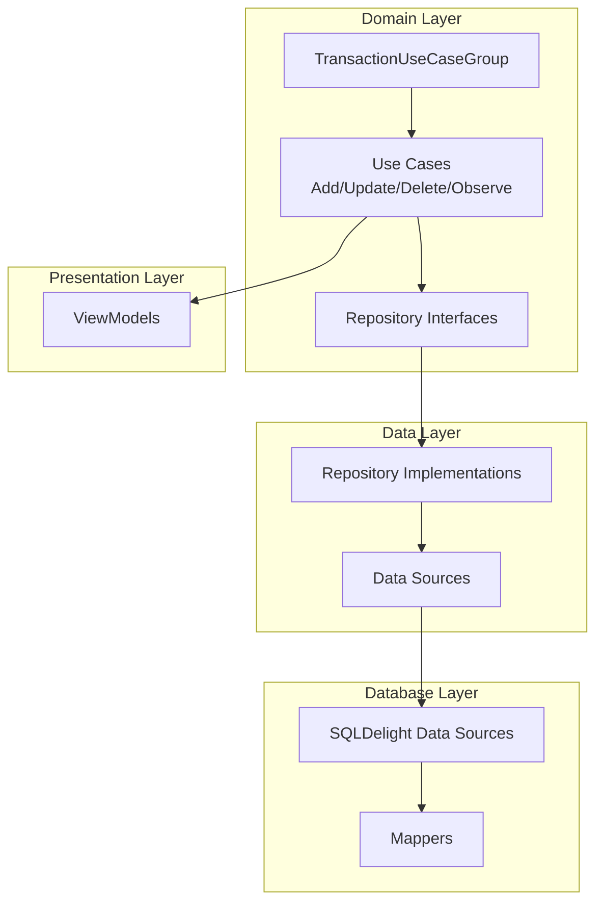
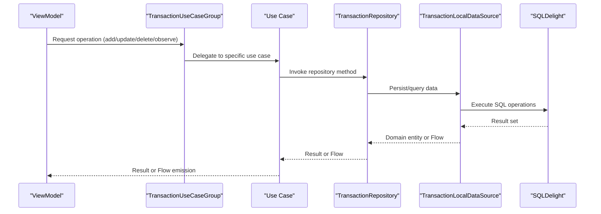
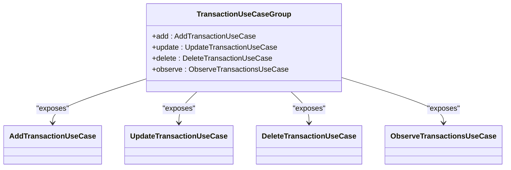
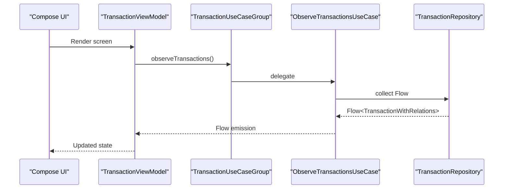
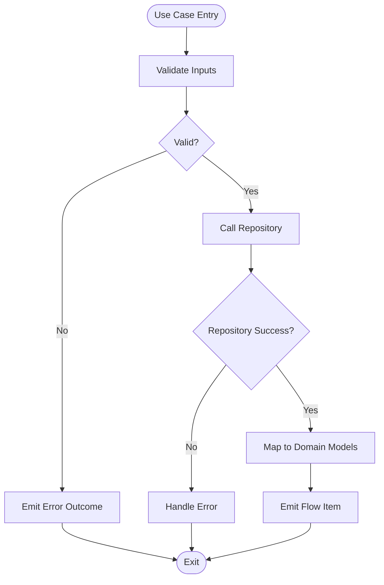
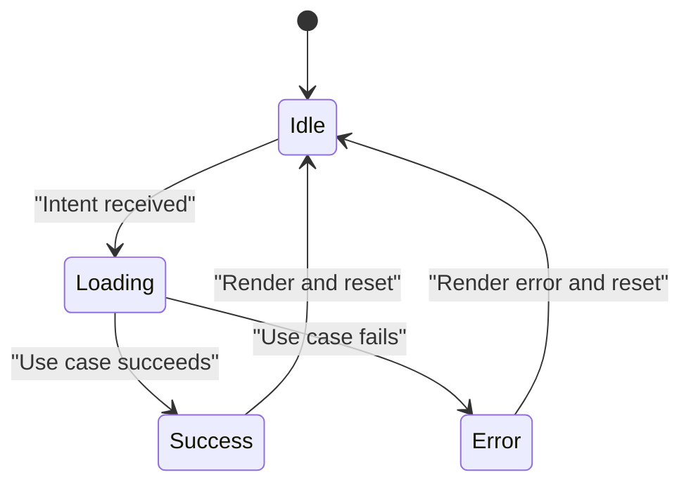
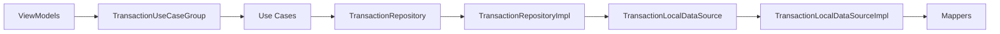

# Domain Use Cases

<cite>
**Referenced Files in This Document**
- [AddTransactionUseCase.kt](file://core/domain/src/commonMain/kotlin/com/kazemieh/domain/usecase/AddTransactionUseCase.kt)
- [DeleteTransactionUseCase.kt](file://core/domain/src/commonMain/kotlin/com/kazemieh/domain/usecase/DeleteTransactionUseCase.kt)
- [UpdateTransactionUseCase.kt](file://core/domain/src/commonMain/kotlin/com/kazemieh/domain/usecase/UpdateTransactionUseCase.kt)
- [ObserveTransactionsUseCase.kt](file://core/domain/src/commonMain/kotlin/com/kazemieh/domain/usecase/ObserveTransactionsUseCase.kt)
- [TransactionUseCaseGroup.kt](file://core/domain/src/commonMain/kotlin/com/kazemieh/domain/usecase/TransactionUseCaseGroup.kt)
- [DomainModule.kt](file://core/domain/src/commonMain/kotlin/com/kazemieh/domain/di/DomainModule.kt)
- [TransactionRepository.kt](file://core/domain/src/commonMain/kotlin/com/kazemieh/domain/repository/TransactionRepository.kt)
- [TransactionRepositoryImpl.kt](file://core/data/src/commonMain/kotlin/com/kazemieh/data/repository/TransactionRepositoryImpl.kt)
- [TransactionLocalDataSource.kt](file://core/data-contract/src/commonMain/kotlin/com/kazemieh/data_contract/datasource/TransactionLocalDataSource.kt)
- [TransactionLocalDataSourceImpl.kt](file://core/database/src/commonMain/kotlin/com/kazemieh/database/datasource/TransactionLocalDataSourceImpl.kt)
- [Mappers.kt](file://core/database/src/commonMain/kotlin/com/kazemieh/database/mapper/Mappers.kt)
- [TransactionsViewModel.kt](file://feature-container/transactions/src/commonMain/kotlin/com/kazemieh/transactions/TransactionsViewModel.kt)
- [AddTransactionViewModel.kt](file://feature-share/transaction/src/commonMain/kotlin/com/kazemieh/transaction/ui/add/AddTransactionViewModel.kt)
- [TransactionViewModel.kt](file://feature-share/transaction/src/commonMain/kotlin/com/kazemieh/transaction/ui/main/TransactionViewModel.kt)
- [TransactionReportViewModel.kt](file://feature-share/transaction/src/commonMain/kotlin/com/kazemieh/transaction/ui/report/TransactionReportViewModel.kt)
- [DeleteTransactionViewModel.kt](file://feature-share/transaction/src/commonMain/kotlin/com/kazemieh/transaction/ui/delete/DeleteTransactionViewModel.kt)
- [Transaction.kt](file://core/common/src/commonMain/kotlin/com/kazemieh/common/model/Transaction.kt)
- [TransactionWithRelations.kt](file://core/common/src/commonMain/kotlin/com/kazemieh/common/model/TransactionWithRelations.kt)
- [TransactionFilterParams.kt](file://core/common/src/commonMain/kotlin/com/kazemieh/common/model/TransactionFilterParams.kt)
- [balanceImpact.kt](file://core/domain/src/commonMain/kotlin/com/kazemieh/domain/util/balanceImpact.kt)
</cite>

## Table of Contents
1. [Introduction](#introduction)
2. [Project Structure](#project-structure)
3. [Core Components](#core-components)
4. [Architecture Overview](#architecture-overview)
5. [Detailed Component Analysis](#detailed-component-analysis)
6. [Dependency Analysis](#dependency-analysis)
7. [Performance Considerations](#performance-considerations)
8. [Troubleshooting Guide](#troubleshooting-guide)
9. [Conclusion](#conclusion)

## Introduction
This document focuses on the Domain Use Cases that encapsulate application-specific workflows for financial transaction management. It explains the MVVM pattern implementation, how use cases interact with repositories, and the reactive programming aspects using Kotlin Flow. Practical examples demonstrate use case execution, parameter validation, error handling, and integration with ViewModels. The document also covers use case grouping patterns exemplified by TransactionUseCaseGroup and how they organize related business operations. Finally, it addresses MVI-style state management through use cases and their reactive streams.

## Project Structure
The domain layer organizes business logic into focused use cases under the usecase package. Each use case coordinates with repositories to perform operations on domain entities like Transaction. The data layer implements repositories and local data sources, while the database module provides SQLDelight-backed mappers and data sources. Presentation layer ViewModels consume use cases to drive UI state reactively.

**Section sources**
- [DomainModule.kt:1-160](file://core/domain/src/commonMain/kotlin/com/kazemieh/domain/di/DomainModule.kt#L1-L160)

## Core Components
This section documents the primary transaction-related use cases and their roles in the business logic layer.

- AddTransactionUseCase: Creates new transactions by validating inputs, invoking repository persistence, and returning either success or failure outcomes.
- UpdateTransactionUseCase: Updates existing transactions with validation and repository synchronization.
- DeleteTransactionUseCase: Removes transactions with safety checks and repository updates.
- ObserveTransactionsUseCase: Provides a reactive stream of transactions via Flow for UI consumption.

These use cases depend on TransactionRepository for data operations and leverage Transaction entities and related models for validation and mapping.

**Section sources**
- [AddTransactionUseCase.kt:1-200](file://core/domain/src/commonMain/kotlin/com/kazemieh/domain/usecase/AddTransactionUseCase.kt#L1-L200)
- [UpdateTransactionUseCase.kt:1-200](file://core/domain/src/commonMain/kotlin/com/kazemieh/domain/usecase/UpdateTransactionUseCase.kt#L1-L200)
- [DeleteTransactionUseCase.kt:1-200](file://core/domain/src/commonMain/kotlin/com/kazemieh/domain/usecase/DeleteTransactionUseCase.kt#L1-L200)
- [ObserveTransactionsUseCase.kt:1-200](file://core/domain/src/commonMain/kotlin/com/kazemieh/domain/usecase/ObserveTransactionsUseCase.kt#L1-L200)

## Architecture Overview
The use cases form the boundary between presentation and data layers. They orchestrate operations, enforce validation, and expose results through Flow for reactive UI updates. TransactionUseCaseGroup aggregates related use cases for convenient injection and consumption across features.

**Diagram sources**
- [TransactionUseCaseGroup.kt:1-120](file://core/domain/src/commonMain/kotlin/com/kazemieh/domain/usecase/TransactionUseCaseGroup.kt#L1-L120)
- [TransactionRepository.kt:1-200](file://core/domain/src/commonMain/kotlin/com/kazemieh/domain/repository/TransactionRepository.kt#L1-L200)
- [TransactionRepositoryImpl.kt:1-200](file://core/data/src/commonMain/kotlin/com/kazemieh/data/repository/TransactionRepositoryImpl.kt#L1-L200)
- [TransactionLocalDataSource.kt:1-200](file://core/data-contract/src/commonMain/kotlin/com/kazemieh/data_contract/datasource/TransactionLocalDataSource.kt#L1-L200)
- [TransactionLocalDataSourceImpl.kt:1-200](file://core/database/src/commonMain/kotlin/com/kazemieh/database/datasource/TransactionLocalDataSourceImpl.kt#L1-L200)

## Detailed Component Analysis

### TransactionUseCaseGroup
TransactionUseCaseGroup consolidates transaction-related use cases for easy dependency injection and feature consumption. It groups AddTransactionUseCase, UpdateTransactionUseCase, DeleteTransactionUseCase, and ObserveTransactionsUseCase, enabling ViewModels to receive a single dependency that exposes all transaction operations.

**Diagram sources**
- [TransactionUseCaseGroup.kt:1-120](file://core/domain/src/commonMain/kotlin/com/kazemieh/domain/usecase/TransactionUseCaseGroup.kt#L1-L120)

**Section sources**
- [TransactionUseCaseGroup.kt:1-120](file://core/domain/src/commonMain/kotlin/com/kazemieh/domain/usecase/TransactionUseCaseGroup.kt#L1-L120)
- [DomainModule.kt:130-150](file://core/domain/src/commonMain/kotlin/com/kazemieh/domain/di/DomainModule.kt#L130-L150)

### AddTransactionUseCase
Responsibilities:
- Validate transaction creation parameters.
- Transform UI inputs to domain models.
- Persist the transaction via TransactionRepository.
- Return success/failure outcomes.

Reactive aspects:
- Emits Flow emissions for real-time UI updates when observing related data.

Integration with ViewModels:
- Consumed through TransactionUseCaseGroup in presentation layer ViewModels.

**Section sources**
- [AddTransactionUseCase.kt:1-200](file://core/domain/src/commonMain/kotlin/com/kazemieh/domain/usecase/AddTransactionUseCase.kt#L1-L200)
- [TransactionsViewModel.kt:1-120](file://feature-container/transactions/src/commonMain/kotlin/com/kazemieh/transactions/TransactionsViewModel.kt#L1-L120)
- [AddTransactionViewModel.kt:1-80](file://feature-share/transaction/src/commonMain/kotlin/com/kazemieh/transaction/ui/add/AddTransactionViewModel.kt#L1-L80)

### UpdateTransactionUseCase
Responsibilities:
- Validate update parameters against existing state.
- Coordinate repository updates.
- Emit changes through reactive streams for UI refresh.

Integration with ViewModels:
- Used in main transaction screens and edit flows.

**Section sources**
- [UpdateTransactionUseCase.kt:1-200](file://core/domain/src/commonMain/kotlin/com/kazemieh/domain/usecase/UpdateTransactionUseCase.kt#L1-L200)
- [TransactionViewModel.kt:1-120](file://feature-share/transaction/src/commonMain/kotlin/com/kazemieh/transaction/ui/main/TransactionViewModel.kt#L1-L120)

### DeleteTransactionUseCase
Responsibilities:
- Perform safe deletion with validation and cascade handling.
- Notify dependent observers through Flow emissions.

Integration with ViewModels:
- Integrated into delete confirmation flows and batch operations.

**Section sources**
- [DeleteTransactionUseCase.kt:1-200](file://core/domain/src/commonMain/kotlin/com/kazemieh/domain/usecase/DeleteTransactionUseCase.kt#L1-L200)
- [DeleteTransactionViewModel.kt:1-60](file://feature-share/transaction/src/commonMain/kotlin/com/kazemieh/transaction/ui/delete/DeleteTransactionViewModel.kt#L1-L60)

### ObserveTransactionsUseCase
Responsibilities:
- Provide a Flow of transactions for reactive UI binding.
- Support filtering and pagination parameters.
- Map raw data to domain models with relations.

Integration with ViewModels:
- Consumed by transaction list screens and reports.

**Section sources**
- [ObserveTransactionsUseCase.kt:1-200](file://core/domain/src/commonMain/kotlin/com/kazemieh/domain/usecase/ObserveTransactionsUseCase.kt#L1-L200)
- [TransactionsViewModel.kt:1-120](file://feature-container/transactions/src/commonMain/kotlin/com/kazemieh/transactions/TransactionsViewModel.kt#L1-L120)
- [TransactionReportViewModel.kt:1-80](file://feature-share/transaction/src/commonMain/kotlin/com/kazemieh/transaction/ui/report/TransactionReportViewModel.kt#L1-L80)

### MVVM Pattern Implementation
- Model: Domain entities such as Transaction and TransactionWithRelations define the data structures and relationships.
- ViewModel: Presentation logic orchestrates use cases, transforms state, and exposes UI-ready data via Flow.
- View: Compose UI consumes ViewModel state and reacts to Flow emissions.

**Diagram sources**
- [TransactionViewModel.kt:1-120](file://feature-share/transaction/src/commonMain/kotlin/com/kazemieh/transaction/ui/main/TransactionViewModel.kt#L1-L120)
- [ObserveTransactionsUseCase.kt:1-200](file://core/domain/src/commonMain/kotlin/com/kazemieh/domain/usecase/ObserveTransactionsUseCase.kt#L1-L200)

**Section sources**
- [TransactionViewModel.kt:1-120](file://feature-share/transaction/src/commonMain/kotlin/com/kazemieh/transaction/ui/main/TransactionViewModel.kt#L1-L120)
- [TransactionsViewModel.kt:1-120](file://feature-container/transactions/src/commonMain/kotlin/com/kazemieh/transactions/TransactionsViewModel.kt#L1-L120)

### Parameter Validation and Error Handling
Validation patterns:
- Input sanitization and type checks before repository calls.
- Filtering parameters validated against TransactionFilterParams for observe queries.

Error handling:
- Use cases return explicit outcomes to avoid throwing exceptions across layers.
- Repository implementations propagate errors through Flow for UI-aware handling.

**Section sources**
- [AddTransactionUseCase.kt:1-200](file://core/domain/src/commonMain/kotlin/com/kazemieh/domain/usecase/AddTransactionUseCase.kt#L1-L200)
- [UpdateTransactionUseCase.kt:1-200](file://core/domain/src/commonMain/kotlin/com/kazemieh/domain/usecase/UpdateTransactionUseCase.kt#L1-L200)
- [DeleteTransactionUseCase.kt:1-200](file://core/domain/src/commonMain/kotlin/com/kazemieh/domain/usecase/DeleteTransactionUseCase.kt#L1-L200)
- [TransactionFilterParams.kt:1-120](file://core/common/src/commonMain/kotlin/com/kazemieh/common/model/TransactionFilterParams.kt#L1-L120)

### Reactive Programming with Flow
- Use cases expose Flow for real-time updates (e.g., observeTransactions).
- ViewModels collect Flow emissions and transform them into UI state.
- Mappers convert SQLDelight records to domain models for consistent consumption.

**Diagram sources**
- [ObserveTransactionsUseCase.kt:1-200](file://core/domain/src/commonMain/kotlin/com/kazemieh/domain/usecase/ObserveTransactionsUseCase.kt#L1-L200)
- [Mappers.kt:1-200](file://core/database/src/commonMain/kotlin/com/kazemieh/database/mapper/Mappers.kt#L1-L200)

**Section sources**
- [ObserveTransactionsUseCase.kt:1-200](file://core/domain/src/commonMain/kotlin/com/kazemieh/domain/usecase/ObserveTransactionsUseCase.kt#L1-L200)
- [Mappers.kt:1-200](file://core/database/src/commonMain/kotlin/com/kazemieh/database/mapper/Mappers.kt#L1-L200)

### MVI (Model-View-Intent) Pattern Through Use Cases
While the project follows MVVM, use cases facilitate MVI-like state management:
- Intent: ViewModel collects user intents (e.g., add transaction, filter transactions).
- Model: Use cases compute state transitions by invoking repository operations and mapping results.
- View: Reacts to Flow emissions to render updated UI.

[No sources needed since this diagram shows conceptual workflow, not actual code structure]

## Dependency Analysis
The domain layer depends on repository interfaces, while the data layer implements them using local data sources backed by SQLDelight. Mappers translate between database records and domain models. ViewModels consume use cases through TransactionUseCaseGroup for cohesive feature integration.

**Diagram sources**
- [DomainModule.kt:130-150](file://core/domain/src/commonMain/kotlin/com/kazemieh/domain/di/DomainModule.kt#L130-L150)
- [TransactionRepository.kt:1-200](file://core/domain/src/commonMain/kotlin/com/kazemieh/domain/repository/TransactionRepository.kt#L1-L200)
- [TransactionRepositoryImpl.kt:1-200](file://core/data/src/commonMain/kotlin/com/kazemieh/data/repository/TransactionRepositoryImpl.kt#L1-L200)
- [TransactionLocalDataSource.kt:1-200](file://core/data-contract/src/commonMain/kotlin/com/kazemieh/data_contract/datasource/TransactionLocalDataSource.kt#L1-L200)
- [TransactionLocalDataSourceImpl.kt:1-200](file://core/database/src/commonMain/kotlin/com/kazemieh/database/datasource/TransactionLocalDataSourceImpl.kt#L1-L200)
- [Mappers.kt:1-200](file://core/database/src/commonMain/kotlin/com/kazemieh/database/mapper/Mappers.kt#L1-L200)

**Section sources**
- [DomainModule.kt:1-160](file://core/domain/src/commonMain/kotlin/com/kazemieh/domain/di/DomainModule.kt#L1-L160)

## Performance Considerations
- Prefer Flow-based observation for incremental UI updates rather than polling.
- Apply filtering and pagination early in the repository layer to reduce memory overhead.
- Use mappers efficiently to minimize object allocation during data transformations.
- Batch operations where possible to reduce repository round-trips.

[No sources needed since this section provides general guidance]

## Troubleshooting Guide
Common issues and resolutions:
- Validation failures: Ensure inputs conform to TransactionFilterParams and entity constraints before calling use cases.
- Flow emissions not updating UI: Verify ViewModel is collecting Flow from ObserveTransactionsUseCase and transforming state correctly.
- Repository errors: Inspect TransactionRepositoryImpl for underlying data source exceptions and ensure proper error propagation.

**Section sources**
- [TransactionFilterParams.kt:1-120](file://core/common/src/commonMain/kotlin/com/kazemieh/common/model/TransactionFilterParams.kt#L1-L120)
- [TransactionRepositoryImpl.kt:1-200](file://core/data/src/commonMain/kotlin/com/kazemieh/data/repository/TransactionRepositoryImpl.kt#L1-L200)

## Conclusion
The Domain Use Cases encapsulate core transaction workflows with clear separation of concerns. Through TransactionUseCaseGroup, related operations are cohesively exposed to ViewModels, enabling MVVM-based presentation with reactive Flow streams. Validation, error handling, and mapping layers ensure robust and maintainable business logic, while DI wiring integrates use cases seamlessly across features.