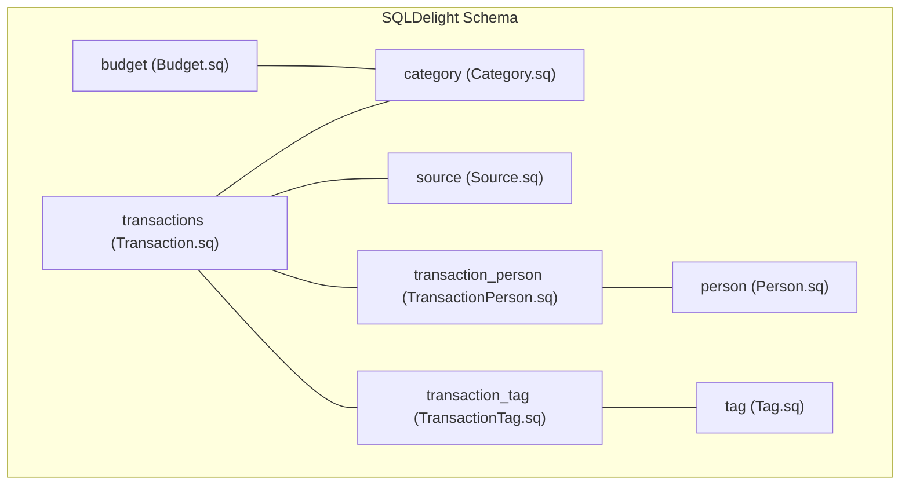
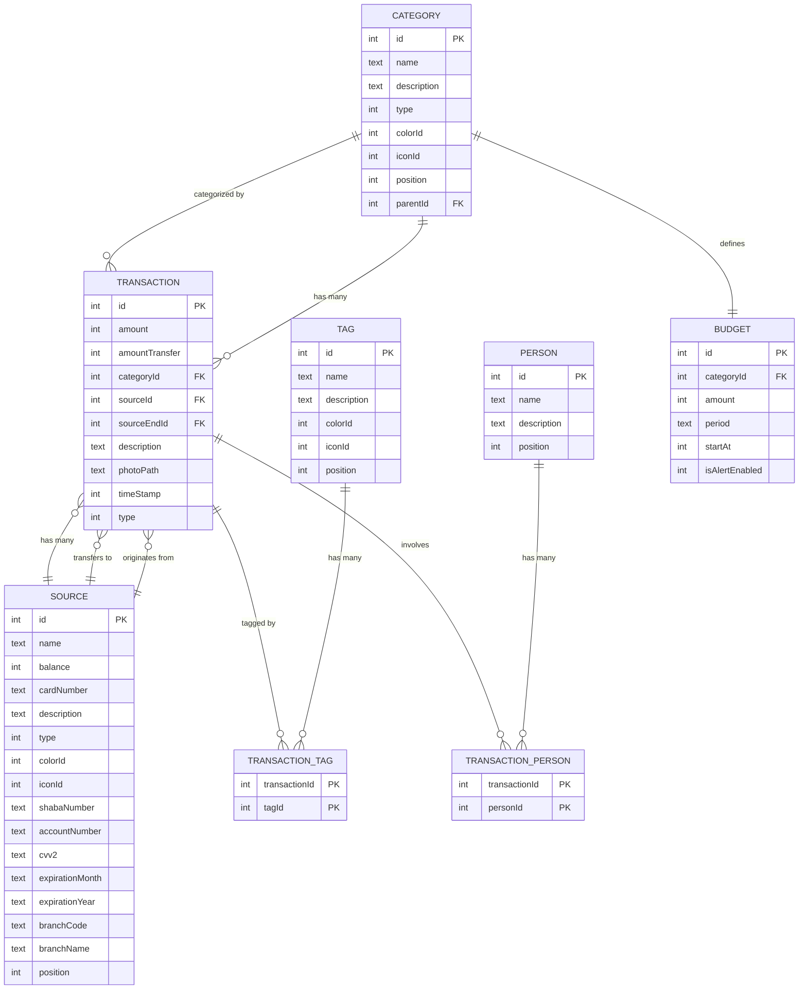
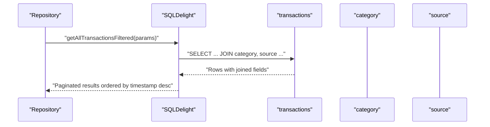
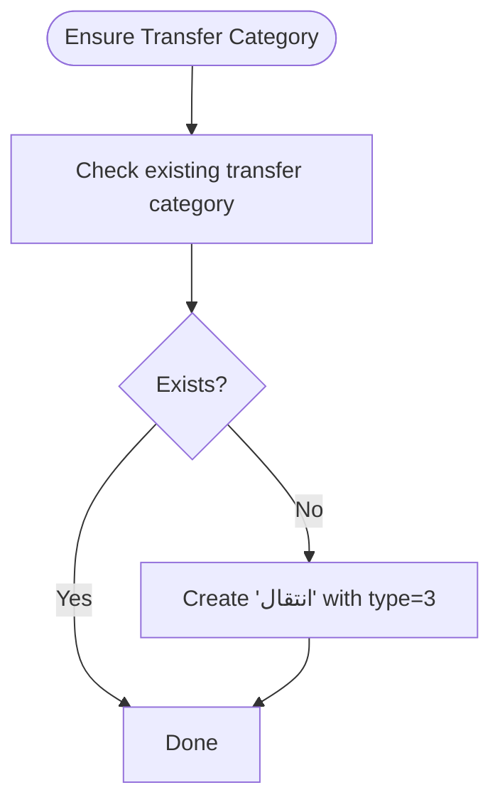
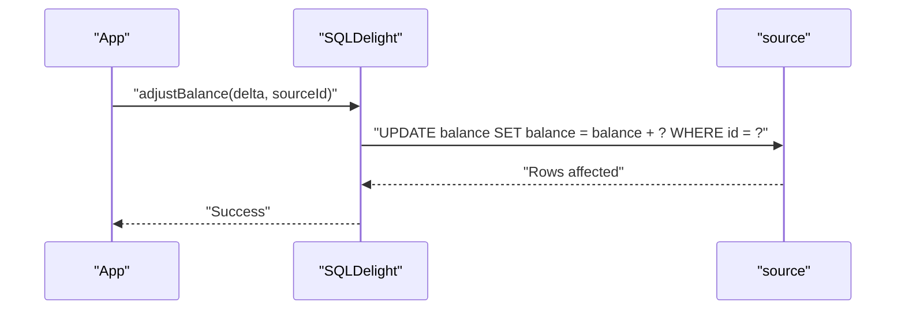
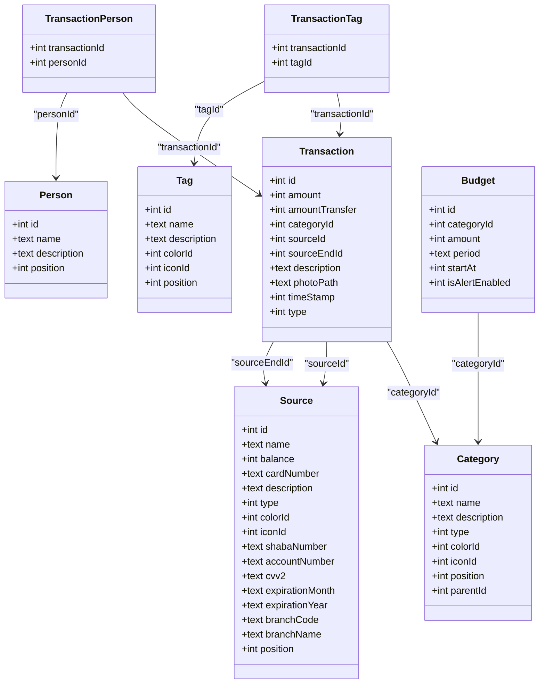
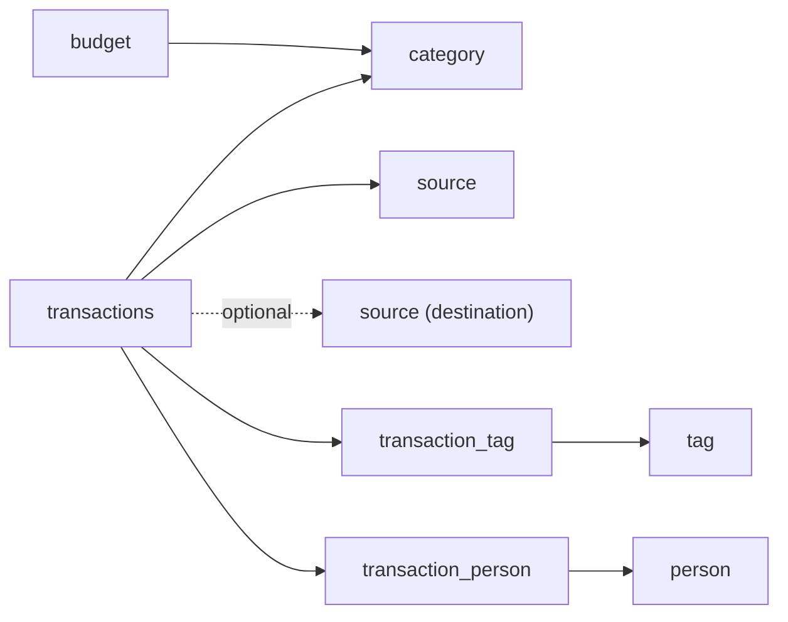

# Data Models and Database

<cite>
**Referenced Files in This Document**
- [Budget.sq](file://core/database/src/commonMain/sqldelight/com/kazemieh/database/Budget.sq)
- [Category.sq](file://core/database/src/commonMain/sqldelight/com/kazemieh/database/Category.sq)
- [Person.sq](file://core/database/src/commonMain/sqldelight/com/kazemieh/database/Person.sq)
- [Source.sq](file://core/database/src/commonMain/sqldelight/com/kazemieh/database/Source.sq)
- [Tag.sq](file://core/database/src/commonMain/sqldelight/com/kazemieh/database/Tag.sq)
- [Transaction.sq](file://core/database/src/commonMain/sqldelight/com/kazemieh/database/Transaction.sq)
- [TransactionPerson.sq](file://core/database/src/commonMain/sqldelight/com/kazemieh/database/TransactionPerson.sq)
- [TransactionTag.sq](file://core/database/src/commonMain/sqldelight/com/kazemieh/database/TransactionTag.sq)
</cite>

## Table of Contents
1. [Introduction](#introduction)
2. [Project Structure](#project-structure)
3. [Core Components](#core-components)
4. [Architecture Overview](#architecture-overview)
5. [Detailed Component Analysis](#detailed-component-analysis)
6. [Dependency Analysis](#dependency-analysis)
7. [Performance Considerations](#performance-considerations)
8. [Troubleshooting Guide](#troubleshooting-guide)
9. [Conclusion](#conclusion)
10. [Appendices](#appendices)

## Introduction
This document provides comprehensive data model documentation for FinTrack’s core entities and SQLDelight database schema. It covers the relationships among Transaction (income, expense, transfer), Category (hierarchical organization), Person/Contact (transaction parties), Tag (categorization), and Source (financial accounts). For each entity, we define fields, data types, primary/foreign keys, indexes, constraints, and SQLDelight queries. We also explain validation and integrity rules, data access patterns, caching strategies, performance considerations, data lifecycle and retention, migration strategies, and security and privacy considerations. Practical examples of queries, joins, and filtering are included.

## Project Structure
FinTrack organizes its database schema under SQLDelight in the core module. Each entity corresponds to a dedicated .sq file containing CREATE TABLE statements, indexes, and named queries. Cross-reference tables manage many-to-many relationships between Transactions and Tags/Persons.

**Diagram sources**
- [Transaction.sq:1-180](file://core/database/src/commonMain/sqldelight/com/kazemieh/database/Transaction.sq#L1-L180)
- [Category.sq:1-104](file://core/database/src/commonMain/sqldelight/com/kazemieh/database/Category.sq#L1-L104)
- [Source.sq:1-77](file://core/database/src/commonMain/sqldelight/com/kazemieh/database/Source.sq#L1-L77)
- [TransactionPerson.sq:1-35](file://core/database/src/commonMain/sqldelight/com/kazemieh/database/TransactionPerson.sq#L1-L35)
- [TransactionTag.sq:1-35](file://core/database/src/commonMain/sqldelight/com/kazemieh/database/TransactionTag.sq#L1-L35)
- [Tag.sq:1-56](file://core/database/src/commonMain/sqldelight/com/kazemieh/database/Tag.sq#L1-L56)
- [Person.sq:1-54](file://core/database/src/commonMain/sqldelight/com/kazemieh/database/Person.sq#L1-L54)
- [Budget.sq:1-40](file://core/database/src/commonMain/sqldelight/com/kazemieh/database/Budget.sq#L1-L40)

**Section sources**
- [Transaction.sq:1-180](file://core/database/src/commonMain/sqldelight/com/kazemieh/database/Transaction.sq#L1-L180)
- [Category.sq:1-104](file://core/database/src/commonMain/sqldelight/com/kazemieh/database/Category.sq#L1-L104)
- [Source.sq:1-77](file://core/database/src/commonMain/sqldelight/com/kazemieh/database/Source.sq#L1-L77)
- [TransactionPerson.sq:1-35](file://core/database/src/commonMain/sqldelight/com/kazemieh/database/TransactionPerson.sq#L1-L35)
- [TransactionTag.sq:1-35](file://core/database/src/commonMain/sqldelight/com/kazemieh/database/TransactionTag.sq#L1-L35)
- [Tag.sq:1-56](file://core/database/src/commonMain/sqldelight/com/kazemieh/database/Tag.sq#L1-L56)
- [Person.sq:1-54](file://core/database/src/commonMain/sqldelight/com/kazemieh/database/Person.sq#L1-L54)
- [Budget.sq:1-40](file://core/database/src/commonMain/sqldelight/com/kazemieh/database/Budget.sq#L1-L40)

## Core Components
This section documents each core entity, its schema, constraints, and representative queries.

- Transaction
  - Purpose: Records income, expense, and transfer entries with amounts, timestamps, categories, and financial sources.
  - Primary key: id
  - Foreign keys: categoryId → category(id), sourceId → source(id), sourceEndId → source(id)
  - Indexes: idx_transaction_category, idx_transaction_source, idx_transaction_sourceEnd, idx_transaction_timestamp
  - Representative queries: insertTransaction, updateTransaction, deleteTransaction, getAllTransactionsFiltered, getTransactionAmountRange, observeCategorySumsByFilter, getTransactionById, insertFullTransaction
  - Notes: Transfer transactions may set amountTransfer and sourceEndId; filters support category/source/tag/person arrays, timestamp range, amount range, and free-text description search.

- Category
  - Purpose: Hierarchical classification for transactions (income, expense, transfer).
  - Primary key: id
  - Optional self-reference: parentId → category(id)
  - Representative queries: addCategory, updateCategory, updateCategoryPosition, observeCategories, observeCategoriesFlat, getCategoryById, getFirstByType, getTransferCategoryOrNull, createTransferCategory, insertTransferCategoryIfMissing, observeCategorySumsByFilter, getMostUsedCategories, searchCategories, deleteCategory, insertFullCategory
  - Notes: Type distinguishes income, expense, and transfer categories; default transfer category is ensured via insertTransferCategoryIfMissing.

- Source
  - Purpose: Financial accounts/banks/cards; tracks balances and metadata.
  - Primary key: id
  - Representative queries: addSource, updateSource, adjustBalance, deleteSource, observeSources, observeSourceById, getDefaultSource, getSourceById, updateSourcePosition, insertFullSource, getMostUsedSources, searchSources
  - Notes: balance is integer (cents or smallest currency unit); supports card/account details and branch info; most-used ranking derived from transaction counts.

- Tag
  - Purpose: Categorization labels for transactions.
  - Primary key: id
  - Representative queries: addTag, updateTag, updateTagPosition, observeTags, getTagById, deleteTag, insertFullTag, getMostUsedTags, searchTags
  - Notes: Many-to-many relationship with transactions via transaction_tag cross-table.

- Person
  - Purpose: Contacts/party involved in transactions.
  - Primary key: id
  - Representative queries: addPerson, updatePerson, updatePersonPosition, observePersons, getPersonById, deletePerson, insertFullPerson, getMostUsedPersons, searchPersons
  - Notes: Many-to-many relationship with transactions via transaction_person cross-table.

- Budget
  - Purpose: Budget limits per category with period and alert flag.
  - Primary key: id
  - Foreign key: categoryId → category(id) with ON DELETE CASCADE
  - Representative queries: observeBudgets, getBudgetByCategoryId, getBudgetById, insertBudget, updateBudget, deleteBudget
  - Notes: Includes category details via LEFT JOIN in observeBudgets.

- TransactionTag (cross-reference)
  - Composite primary key: (transactionId, tagId)
  - Foreign keys: transactionId → transactions(id), tagId → tag(id) with ON DELETE CASCADE
  - Indexes: idx_transaction_tag_transaction, idx_transaction_tag_tag
  - Representative queries: insertTransactionTagCrossRefs, deleteAllTagRefsForTransaction, copyTagRefs, deleteTagRefs, getTagsForTransaction

- TransactionPerson (cross-reference)
  - Composite primary key: (transactionId, personId)
  - Foreign keys: transactionId → transactions(id), personId → person(id) with ON DELETE CASCADE
  - Indexes: idx_transaction_person_transaction, idx_transaction_person_person
  - Representative queries: insertTransactionPersonCrossRefs, deleteAllPersonRefsForTransaction, copyPersonRefs, deletePersonRefs, getPersonsForTransaction

**Section sources**
- [Transaction.sq:1-180](file://core/database/src/commonMain/sqldelight/com/kazemieh/database/Transaction.sq#L1-L180)
- [Category.sq:1-104](file://core/database/src/commonMain/sqldelight/com/kazemieh/database/Category.sq#L1-L104)
- [Source.sq:1-77](file://core/database/src/commonMain/sqldelight/com/kazemieh/database/Source.sq#L1-L77)
- [Tag.sq:1-56](file://core/database/src/commonMain/sqldelight/com/kazemieh/database/Tag.sq#L1-L56)
- [Person.sq:1-54](file://core/database/src/commonMain/sqldelight/com/kazemieh/database/Person.sq#L1-L54)
- [Budget.sq:1-40](file://core/database/src/commonMain/sqldelight/com/kazemieh/database/Budget.sq#L1-L40)
- [TransactionTag.sq:1-35](file://core/database/src/commonMain/sqldelight/com/kazemieh/database/TransactionTag.sq#L1-L35)
- [TransactionPerson.sq:1-35](file://core/database/src/commonMain/sqldelight/com/kazemieh/database/TransactionPerson.sq#L1-L35)

## Architecture Overview
The database follows a normalized relational model with explicit foreign keys and indexes to support transaction-heavy workloads. Cross-reference tables decouple many-to-many relationships. Budgets reference categories. Transactions reference categories and sources, and optionally a second source for transfers. Persons and Tags are attached to transactions via junction tables.

**Diagram sources**
- [Transaction.sq:1-180](file://core/database/src/commonMain/sqldelight/com/kazemieh/database/Transaction.sq#L1-L180)
- [Category.sq:1-104](file://core/database/src/commonMain/sqldelight/com/kazemieh/database/Category.sq#L1-L104)
- [Source.sq:1-77](file://core/database/src/commonMain/sqldelight/com/kazemieh/database/Source.sq#L1-L77)
- [Tag.sq:1-56](file://core/database/src/commonMain/sqldelight/com/kazemieh/database/Tag.sq#L1-L56)
- [Person.sq:1-54](file://core/database/src/commonMain/sqldelight/com/kazemieh/database/Person.sq#L1-L54)
- [Budget.sq:1-40](file://core/database/src/commonMain/sqldelight/com/kazemieh/database/Budget.sq#L1-L40)
- [TransactionTag.sq:1-35](file://core/database/src/commonMain/sqldelight/com/kazemieh/database/TransactionTag.sq#L1-L35)
- [TransactionPerson.sq:1-35](file://core/database/src/commonMain/sqldelight/com/kazemieh/database/TransactionPerson.sq#L1-L35)

## Detailed Component Analysis

### Transaction Entity
- Fields and types
  - id: integer, primary key, autoincrement
  - amount: integer (cents or minor units)
  - amountTransfer: integer (nullable)
  - categoryId: integer, foreign key to category
  - sourceId: integer, foreign key to source
  - sourceEndId: integer, nullable foreign key to source
  - description: text
  - photoPath: text
  - timeStamp: integer (epoch milliseconds)
  - type: integer (enum-like discriminator: income/expense/transfer)
- Constraints
  - Foreign keys cascade deletes for category, source, and sourceEnd
- Indexes
  - idx_transaction_category, idx_transaction_source, idx_transaction_sourceEnd, idx_transaction_timestamp
- Key queries
  - Insert/update/delete: insertTransaction, updateTransaction, deleteTransaction
  - Filtering and aggregation: getAllTransactionsFiltered, getTransactionAmountRange, observeCategorySumsByFilter, getTransactionById, insertFullTransaction
- Business rules
  - For transfers, set amountTransfer and sourceEndId; ensure sourceEndId references a valid source
  - Filters support arrays for categoryIds, sourceIds, tagIds, personIds; timestamp range; amount bounds; description substring match
- Validation
  - Ensure categoryId and sourceId are present for non-transfer types
  - Ensure sourceEndId is set for transfers
  - Enforce referential integrity via foreign keys

**Diagram sources**
- [Transaction.sq:46-128](file://core/database/src/commonMain/sqldelight/com/kazemieh/database/Transaction.sq#L46-L128)

**Section sources**
- [Transaction.sq:1-180](file://core/database/src/commonMain/sqldelight/com/kazemieh/database/Transaction.sq#L1-L180)

### Category Entity
- Fields and types
  - id: integer, primary key, autoincrement
  - name: text
  - description: text
  - type: integer (discriminator)
  - colorId: integer, default 1
  - iconId: integer, default 1
  - position: integer, default 0
  - parentId: integer, references category(id) for hierarchy
- Constraints
  - Self-referencing foreign key for parent-child hierarchy
- Indexes
  - None explicitly defined
- Key queries
  - CRUD: addCategory, updateCategory, updateCategoryPosition, getCategoryById, deleteCategory, insertFullCategory
  - Observability: observeCategories, observeCategoriesFlat, getFirstByType, getTransferCategoryOrNull, createTransferCategory, insertTransferCategoryIfMissing
  - Aggregation: observeCategorySumsByFilter, getMostUsedCategories, searchCategories
- Business rules
  - Transfer category is ensured via insertTransferCategoryIfMissing/getTransferCategoryOrNull
  - Hierarchical organization supported by parentId; top-level categories have NULL parentId
- Validation
  - Ensure parentId cycle-free (application-level enforcement recommended)
  - Use getFirstByType to locate default categories by type

**Diagram sources**
- [Category.sq:41-57](file://core/database/src/commonMain/sqldelight/com/kazemieh/database/Category.sq#L41-L57)

**Section sources**
- [Category.sq:1-104](file://core/database/src/commonMain/sqldelight/com/kazemieh/database/Category.sq#L1-L104)

### Source Entity
- Fields and types
  - id: integer, primary key, autoincrement
  - name: text
  - balance: integer, default 0
  - cardNumber: text
  - description: text
  - type: integer
  - colorId: integer, default 1
  - iconId: integer, default 1
  - shabaNumber: text
  - accountNumber: text
  - cvv2: text
  - expirationMonth: text
  - expirationYear: text
  - branchCode: text
  - branchName: text
  - position: integer, default 0
- Constraints
  - None explicit foreign keys
- Indexes
  - None explicitly defined
- Key queries
  - CRUD: addSource, updateSource, adjustBalance, deleteSource, getSourceById, updateSourcePosition, insertFullSource
  - Observability: observeSources, observeSourceById, getDefaultSource, getMostUsedSources, searchSources
- Business rules
  - balance is integer (cents/minor unit); adjustBalance adds/subtracts amounts atomically
  - Most-used ranking considers both origin and destination roles in transfers
- Validation
  - Ensure balance remains non-negative if required by business policy
  - Validate card/account fields according to payment scheme rules (enforced at application level)

**Diagram sources**
- [Source.sq:30-33](file://core/database/src/commonMain/sqldelight/com/kazemieh/database/Source.sq#L30-L33)

**Section sources**
- [Source.sq:1-77](file://core/database/src/commonMain/sqldelight/com/kazemieh/database/Source.sq#L1-L77)

### Tag Entity
- Fields and types
  - id: integer, primary key, autoincrement
  - name: text
  - description: text
  - colorId: integer, default 1
  - iconId: integer, default 1
  - position: integer, default 0
- Constraints
  - None explicit foreign keys
- Indexes
  - None explicitly defined
- Key queries
  - CRUD: addTag, updateTag, updateTagPosition, getTagById, deleteTag, insertFullTag
  - Observability: observeTags, getMostUsedTags, searchTags
- Business rules
  - Many-to-many with transactions via transaction_tag
- Validation
  - Ensure uniqueness of tag names if desired (application-level)

**Section sources**
- [Tag.sq:1-56](file://core/database/src/commonMain/sqldelight/com/kazemieh/database/Tag.sq#L1-L56)

### Person Entity
- Fields and types
  - id: integer, primary key, autoincrement
  - name: text
  - description: text
  - position: integer, default 0
- Constraints
  - None explicit foreign keys
- Indexes
  - None explicitly defined
- Key queries
  - CRUD: addPerson, updatePerson, updatePersonPosition, getPersonById, deletePerson, insertFullPerson
  - Observability: observePersons, getMostUsedPersons, searchPersons
- Business rules
  - Many-to-many with transactions via transaction_person
- Validation
  - Ensure non-empty names if required by UI/business logic

**Section sources**
- [Person.sq:1-54](file://core/database/src/commonMain/sqldelight/com/kazemieh/database/Person.sq#L1-L54)

### Budget Entity
- Fields and types
  - id: integer, primary key, autoincrement
  - categoryId: integer, foreign key to category(id) with ON DELETE CASCADE
  - amount: integer
  - period: text (e.g., monthly/yearly)
  - startAt: integer (epoch)
  - isAlertEnabled: integer (boolean flag)
- Constraints
  - Foreign key cascade deletion
- Indexes
  - idx_budget_category
- Key queries
  - observeBudgets (joins category), getBudgetByCategoryId, getBudgetById, insertBudget, updateBudget, deleteBudget
- Business rules
  - Budgets are enforced per category; alerts controlled by isAlertEnabled
- Validation
  - Ensure positive amount and valid period string

**Section sources**
- [Budget.sq:1-40](file://core/database/src/commonMain/sqldelight/com/kazemieh/database/Budget.sq#L1-L40)

### Cross-Reference Tables
- TransactionTag
  - Primary key: (transactionId, tagId)
  - Foreign keys: transactionId → transactions(id), tagId → tag(id) with ON DELETE CASCADE
  - Indexes: idx_transaction_tag_transaction, idx_transaction_tag_tag
  - Queries: insertTransactionTagCrossRefs, deleteAllTagRefsForTransaction, copyTagRefs, deleteTagRefs, getTagsForTransaction
- TransactionPerson
  - Primary key: (transactionId, personId)
  - Foreign keys: transactionId → transactions(id), personId → person(id) with ON DELETE CASCADE
  - Indexes: idx_transaction_person_transaction, idx_transaction_person_person
  - Queries: insertTransactionPersonCrossRefs, deleteAllPersonRefsForTransaction, copyPersonRefs, deletePersonRefs, getPersonsForTransaction

**Diagram sources**
- [Transaction.sq:1-180](file://core/database/src/commonMain/sqldelight/com/kazemieh/database/Transaction.sq#L1-L180)
- [Category.sq:1-104](file://core/database/src/commonMain/sqldelight/com/kazemieh/database/Category.sq#L1-L104)
- [Source.sq:1-77](file://core/database/src/commonMain/sqldelight/com/kazemieh/database/Source.sq#L1-L77)
- [Tag.sq:1-56](file://core/database/src/commonMain/sqldelight/com/kazemieh/database/Tag.sq#L1-L56)
- [Person.sq:1-54](file://core/database/src/commonMain/sqldelight/com/kazemieh/database/Person.sq#L1-L54)
- [Budget.sq:1-40](file://core/database/src/commonMain/sqldelight/com/kazemieh/database/Budget.sq#L1-L40)
- [TransactionTag.sq:1-35](file://core/database/src/commonMain/sqldelight/com/kazemieh/database/TransactionTag.sq#L1-L35)
- [TransactionPerson.sq:1-35](file://core/database/src/commonMain/sqldelight/com/kazemieh/database/TransactionPerson.sq#L1-L35)

**Section sources**
- [TransactionTag.sq:1-35](file://core/database/src/commonMain/sqldelight/com/kazemieh/database/TransactionTag.sq#L1-L35)
- [TransactionPerson.sq:1-35](file://core/database/src/commonMain/sqldelight/com/kazemieh/database/TransactionPerson.sq#L1-L35)

## Dependency Analysis
- Referential integrity
  - Transactions depend on Category and Source; optional second Source for transfers
  - Budget depends on Category with cascade delete
  - Cross-reference tables enforce cascade deletes for Tag and Person
- Coupling
  - Transactions join Category, Source, Tag, and Person via LEFT/INNER JOINs
  - Aggregation queries filter by arrays and time ranges
- Potential circular dependencies
  - None observed; Category supports hierarchical parent-child via parentId
- External dependencies
  - SQLDelight runtime and driver selection handled in platform-specific modules

**Diagram sources**
- [Transaction.sq:1-180](file://core/database/src/commonMain/sqldelight/com/kazemieh/database/Transaction.sq#L1-L180)
- [Category.sq:1-104](file://core/database/src/commonMain/sqldelight/com/kazemieh/database/Category.sq#L1-L104)
- [Source.sq:1-77](file://core/database/src/commonMain/sqldelight/com/kazemieh/database/Source.sq#L1-L77)
- [Tag.sq:1-56](file://core/database/src/commonMain/sqldelight/com/kazemieh/database/Tag.sq#L1-L56)
- [Person.sq:1-54](file://core/database/src/commonMain/sqldelight/com/kazemieh/database/Person.sq#L1-L54)
- [Budget.sq:1-40](file://core/database/src/commonMain/sqldelight/com/kazemieh/database/Budget.sq#L1-L40)
- [TransactionTag.sq:1-35](file://core/database/src/commonMain/sqldelight/com/kazemieh/database/TransactionTag.sq#L1-L35)
- [TransactionPerson.sq:1-35](file://core/database/src/commonMain/sqldelight/com/kazemieh/database/TransactionPerson.sq#L1-L35)

**Section sources**
- [Transaction.sq:1-180](file://core/database/src/commonMain/sqldelight/com/kazemieh/database/Transaction.sq#L1-L180)
- [Category.sq:1-104](file://core/database/src/commonMain/sqldelight/com/kazemieh/database/Category.sq#L1-L104)
- [Source.sq:1-77](file://core/database/src/commonMain/sqldelight/com/kazemieh/database/Source.sq#L1-L77)
- [Tag.sq:1-56](file://core/database/src/commonMain/sqldelight/com/kazemieh/database/Tag.sq#L1-L56)
- [Person.sq:1-54](file://core/database/src/commonMain/sqldelight/com/kazemieh/database/Person.sq#L1-L54)
- [Budget.sq:1-40](file://core/database/src/commonMain/sqldelight/com/kazemieh/database/Budget.sq#L1-L40)
- [TransactionTag.sq:1-35](file://core/database/src/commonMain/sqldelight/com/kazemieh/database/TransactionTag.sq#L1-L35)
- [TransactionPerson.sq:1-35](file://core/database/src/commonMain/sqldelight/com/kazemieh/database/TransactionPerson.sq#L1-L35)

## Performance Considerations
- Indexes
  - Transactions: idx_transaction_category, idx_transaction_source, idx_transaction_sourceEnd, idx_transaction_timestamp
  - TransactionTag: idx_transaction_tag_transaction, idx_transaction_tag_tag
  - TransactionPerson: idx_transaction_person_transaction, idx_transaction_person_person
  - Budget: idx_budget_category
- Query patterns
  - getAllTransactionsFiltered uses LEFT/INNER JOINs with GROUP BY and pagination; ensure bind parameters avoid SQL injection and leverage indexes
  - observeCategorySumsByFilter aggregates by category with optional tag/person filters; consider materialized summaries if needed
- Caching strategies
  - Use reactive streams (observe*) to cache recent lists in memory; invalidate on mutation
  - Cache frequently accessed defaults (default source, transfer category) in memory
- Data volume
  - For large histories, prefer server-side pagination and time-windowed queries
- Concurrency
  - Use transactions for batch inserts/updates to maintain consistency

[No sources needed since this section provides general guidance]

## Troubleshooting Guide
- Foreign key constraint failures
  - Ensure categoryId, sourceId, and sourceEndId exist before inserting/updating transactions
  - For deletions, note cascade behavior on category and source references
- Missing transfer category
  - Use insertTransferCategoryIfMissing or getTransferCategoryOrNull to ensure availability
- Duplicate cross-refs
  - Use INSERT OR IGNORE for transaction_tag and transaction_person to prevent duplicates
- Balance drift
  - Verify adjustBalance updates are applied consistently; reconcile balances periodically
- Query performance
  - Confirm appropriate indexes exist; verify bind parameters for array sizes and timestamps

**Section sources**
- [Transaction.sq:12-15](file://core/database/src/commonMain/sqldelight/com/kazemieh/database/Transaction.sq#L12-L15)
- [Category.sq:55-57](file://core/database/src/commonMain/sqldelight/com/kazemieh/database/Category.sq#L55-L57)
- [TransactionTag.sq:12-14](file://core/database/src/commonMain/sqldelight/com/kazemieh/database/TransactionTag.sq#L12-L14)
- [TransactionPerson.sq:12-14](file://core/database/src/commonMain/sqldelight/com/kazemieh/database/TransactionPerson.sq#L12-L14)
- [Source.sq:30-33](file://core/database/src/commonMain/sqldelight/com/kazemieh/database/Source.sq#L30-L33)

## Conclusion
FinTrack’s database schema is designed around a clean relational model with explicit foreign keys, indexes, and cross-reference tables. Transactions are the central entity, linking categories, sources, tags, and persons. The schema supports robust filtering, aggregation, and cascading operations. By following the indexing and caching strategies outlined here, and enforcing validation and integrity rules at the application boundary, the system can scale effectively while maintaining data consistency and performance.

[No sources needed since this section summarizes without analyzing specific files]

## Appendices

### Field Definitions and Constraints Reference
- Transactions
  - Fields: id, amount, amountTransfer, categoryId, sourceId, sourceEndId, description, photoPath, timeStamp, type
  - Primary key: id
  - Foreign keys: categoryId → category(id), sourceId → source(id), sourceEndId → source(id)
  - Indexes: idx_transaction_category, idx_transaction_source, idx_transaction_sourceEnd, idx_transaction_timestamp
- Category
  - Fields: id, name, description, type, colorId, iconId, position, parentId
  - Primary key: id
  - Self-reference: parentId → category(id)
- Source
  - Fields: id, name, balance, cardNumber, description, type, colorId, iconId, shabaNumber, accountNumber, cvv2, expirationMonth, expirationYear, branchCode, branchName, position
  - Primary key: id
- Tag
  - Fields: id, name, description, colorId, iconId, position
  - Primary key: id
- Person
  - Fields: id, name, description, position
  - Primary key: id
- Budget
  - Fields: id, categoryId, amount, period, startAt, isAlertEnabled
  - Primary key: id
  - Foreign key: categoryId → category(id) with ON DELETE CASCADE
  - Index: idx_budget_category
- TransactionTag
  - Fields: transactionId, tagId
  - Primary key: (transactionId, tagId)
  - Foreign keys: transactionId → transactions(id), tagId → tag(id) with ON DELETE CASCADE
  - Indexes: idx_transaction_tag_transaction, idx_transaction_tag_tag
- TransactionPerson
  - Fields: transactionId, personId
  - Primary key: (transactionId, personId)
  - Foreign keys: transactionId → transactions(id), personId → person(id) with ON DELETE CASCADE
  - Indexes: idx_transaction_person_transaction, idx_transaction_person_person

**Section sources**
- [Transaction.sq:1-180](file://core/database/src/commonMain/sqldelight/com/kazemieh/database/Transaction.sq#L1-L180)
- [Category.sq:1-104](file://core/database/src/commonMain/sqldelight/com/kazemieh/database/Category.sq#L1-L104)
- [Source.sq:1-77](file://core/database/src/commonMain/sqldelight/com/kazemieh/database/Source.sq#L1-L77)
- [Tag.sq:1-56](file://core/database/src/commonMain/sqldelight/com/kazemieh/database/Tag.sq#L1-L56)
- [Person.sq:1-54](file://core/database/src/commonMain/sqldelight/com/kazemieh/database/Person.sq#L1-L54)
- [Budget.sq:1-40](file://core/database/src/commonMain/sqldelight/com/kazemieh/database/Budget.sq#L1-L40)
- [TransactionTag.sq:1-35](file://core/database/src/commonMain/sqldelight/com/kazemieh/database/TransactionTag.sq#L1-L35)
- [TransactionPerson.sq:1-35](file://core/database/src/commonMain/sqldelight/com/kazemieh/database/TransactionPerson.sq#L1-L35)

### Sample Data Structures
- Transaction row
  - id, amount, amountTransfer, categoryId, sourceId, sourceEndId, description, photoPath, timeStamp, type
- Category row
  - id, name, description, type, colorId, iconId, position, parentId
- Source row
  - id, name, balance, cardNumber, description, type, colorId, iconId, shabaNumber, accountNumber, cvv2, expirationMonth, expirationYear, branchCode, branchName, position
- Tag row
  - id, name, description, colorId, iconId, position
- Person row
  - id, name, description, position
- Budget row
  - id, categoryId, amount, period, startAt, isAlertEnabled
- TransactionTag row
  - transactionId, tagId
- TransactionPerson row
  - transactionId, personId

[No sources needed since this section provides general guidance]

### Data Access Patterns and Examples
- Retrieve paginated filtered transactions with relations and aggregated tag/person lists
  - Query: getAllTransactionsFiltered
  - Filters: type, categoryIds[], sourceIds[], tagIds[], personIds[], fromTimestamp, toTimestamp, minAmount, maxAmount, query
  - Ordering: timeStamp desc, id desc
  - Pagination: limit, offset
- Summarize category totals by filter
  - Query: observeCategorySumsByFilter
  - Filters: type, categoryIds[], sourceIds[], tagIds[], personIds[], fromTimestamp, toTimestamp, minAmount, maxAmount, query
- Ensure transfer category exists
  - Query: insertTransferCategoryIfMissing or getTransferCategoryOrNull
- Adjust account balance
  - Query: adjustBalance
- Most-used entities
  - Categories: getMostUsedCategories
  - Tags: getMostUsedTags
  - Persons: getMostUsedPersons
  - Sources: getMostUsedSources

**Section sources**
- [Transaction.sq:46-128](file://core/database/src/commonMain/sqldelight/com/kazemieh/database/Transaction.sq#L46-L128)
- [Category.sq:60-82](file://core/database/src/commonMain/sqldelight/com/kazemieh/database/Category.sq#L60-L82)
- [Category.sq:91-97](file://core/database/src/commonMain/sqldelight/com/kazemieh/database/Category.sq#L91-L97)
- [Tag.sq:42-47](file://core/database/src/commonMain/sqldelight/com/kazemieh/database/Tag.sq#L42-L47)
- [Person.sq:40-45](file://core/database/src/commonMain/sqldelight/com/kazemieh/database/Person.sq#L40-L45)
- [Source.sq:59-66](file://core/database/src/commonMain/sqldelight/com/kazemieh/database/Source.sq#L59-L66)
- [Category.sq:55-57](file://core/database/src/commonMain/sqldelight/com/kazemieh/database/Category.sq#L55-L57)
- [Source.sq:30-33](file://core/database/src/commonMain/sqldelight/com/kazemieh/database/Source.sq#L30-L33)

### Data Lifecycle, Retention, and Migration
- Data lifecycle
  - Create: insert* queries
  - Read: observe* and select queries
  - Update: update* queries
  - Delete: delete* queries and cascade behavior on category/source
- Retention
  - No explicit retention policies in schema; implement at application layer (e.g., archive old transactions)
- Migration
  - SQLDelight migrations are stored under schemas directory; increment version and add .sqm files accordingly
  - Ensure foreign key constraints and indexes are recreated after schema changes

[No sources needed since this section provides general guidance]

### Security and Privacy
- Data protection
  - Store sensitive fields (cardNumber, cvv2, shabaNumber, accountNumber) securely; consider encryption-at-rest and access controls
  - Limit exposure of raw financial data in logs and crash reports
- Access control
  - Enforce authentication and authorization before exposing data operations
  - Consider row-level security or app-side filtering for multi-user scenarios

[No sources needed since this section provides general guidance]