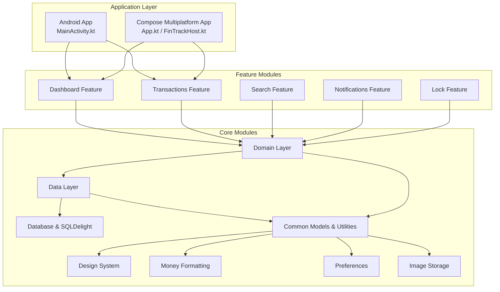
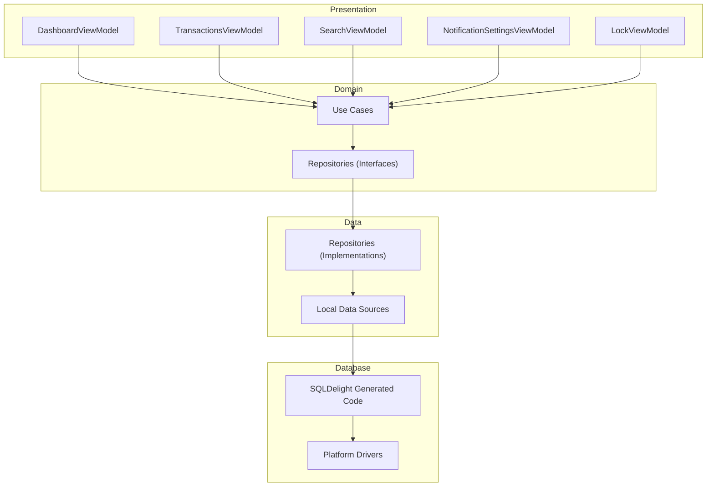
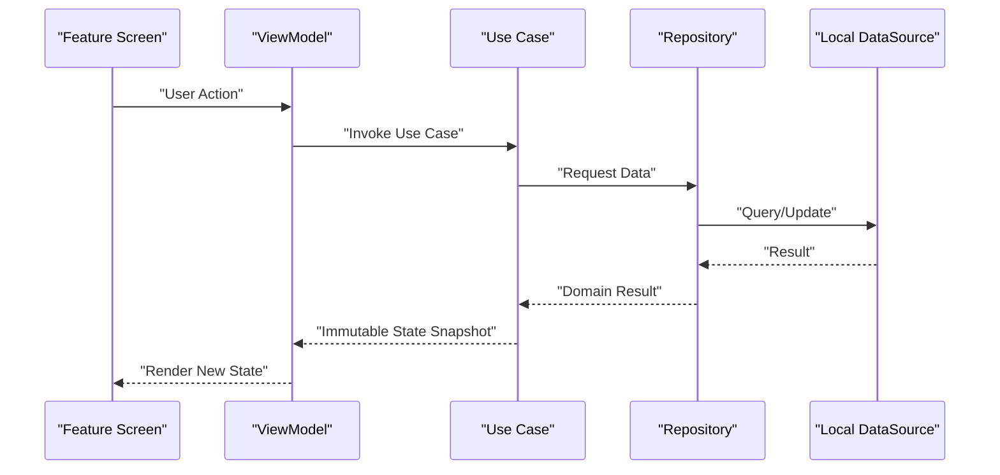
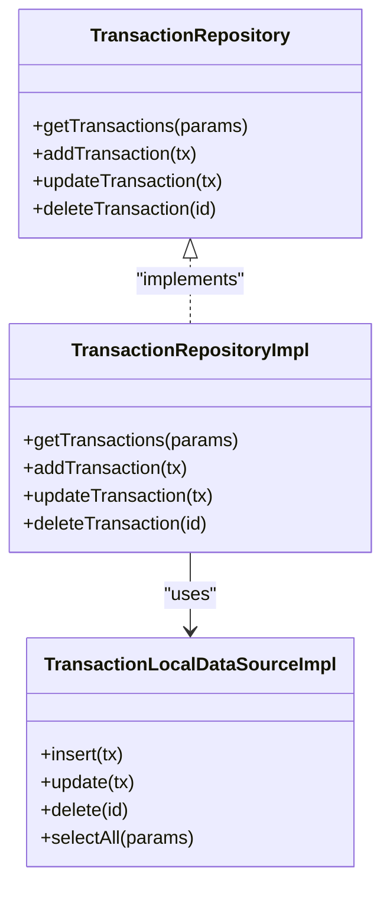
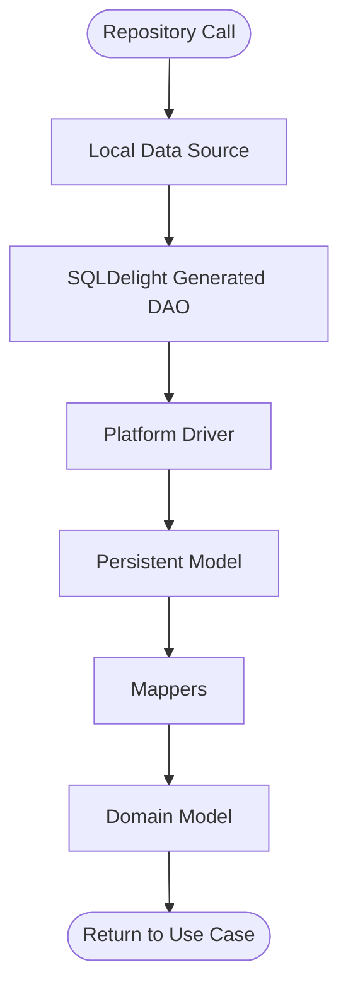
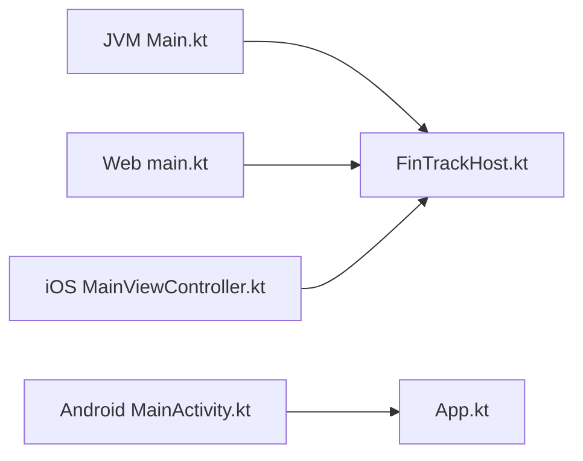

# Development Guidelines and Best Practices

<cite>
**Referenced Files in This Document**
- [README.md](file://README.md)
- [settings.gradle.kts](file://settings.gradle.kts)
- [build.gradle.kts](file://build.gradle.kts)
- [gradle/libs.versions.toml](file://gradle/libs.versions.toml)
- [composeApp/build.gradle.kts](file://composeApp/build.gradle.kts)
- [composeApp/src/commonMain/kotlin/com/kazemieh/composeApp/App.kt](file://composeApp/src/commonMain/kotlin/com/kazemieh/composeApp/App.kt)
- [composeApp/src/commonMain/kotlin/com/kazemieh/composeApp/FinTrackHost.kt](file://composeApp/src/commonMain/kotlin/com/kazemieh/composeApp/FinTrackHost.kt)
- [composeApp/src/androidMain/kotlin/com/kazemieh/composeApp/MainViewController.kt](file://composeApp/src/androidMain/kotlin/com/kazemieh/composeApp/MainViewController.kt)
- [composeApp/src/jvmMain/kotlin/com/kazemieh/fintrack/Main.kt](file://composeApp/src/jvmMain/kotlin/com/kazemieh/fintrack/Main.kt)
- [composeApp/src/webMain/kotlin/com/kazemieh/composeApp/main.kt](file://composeApp/src/webMain/kotlin/com/kazemieh/composeApp/main.kt)
- [app/src/main/java/com/kazemieh/fintrack/FinTrackApplication.kt](file://app/src/main/java/com/kazemieh/fintrack/FinTrackApplication.kt)
- [app/src/main/java/com/kazemieh/fintrack/MainActivity.kt](file://app/src/main/java/com/kazemieh/fintrack/MainActivity.kt)
- [core/domain/src/commonMain/kotlin/com/kazemieh/domain/di/DomainModule.kt](file://core/domain/src/commonMain/kotlin/com/kazemieh/domain/di/DomainModule.kt)
- [core/data/src/commonMain/kotlin/com/kazemieh/data/di/DataModule.kt](file://core/data/src/commonMain/kotlin/com/kazemieh/data/di/DataModule.kt)
- [core/common/src/commonMain/kotlin/com/kazemieh/common/model/Transaction.kt](file://core/common/src/commonMain/kotlin/com/kazemieh/common/model/Transaction.kt)
- [core/common/src/commonMain/kotlin/com/kazemieh/common/persiandatetime/PersianDateConverterImpl.kt](file://core/common/src/commonMain/kotlin/com/kazemieh/common/persiandatetime/PersianDateConverterImpl.kt)
- [core/common/src/commonMain/kotlin/com/kazemieh/common/util/CalculatorParser.kt](file://core/common/src/commonMain/kotlin/com/kazemieh/common/util/CalculatorParser.kt)
- [core/designsystem/src/commonMain/kotlin/com/kazemieh/designsystem/Theme.kt](file://core/designsystem/src/commonMain/kotlin/com/kazemieh/designsystem/Theme.kt)
- [core/designsystem/src/commonMain/kotlin/com/kazemieh/designsystem/CurrencyProvider.kt](file://core/designsystem/src/commonMain/kotlin/com/kazemieh/designsystem/CurrencyProvider.kt)
- [core/money/src/commonMain/kotlin/com/kazemieh/money/MoneyFormatter.kt](file://core/money/src/commonMain/kotlin/com/kazemieh/money/MoneyFormatter.kt)
- [core/preferences/src/commonMain/kotlin/com/kazemieh/preferences/FinTrackPreferences.kt](file://core/preferences/src/commonMain/kotlin/com/kazemieh/preferences/FinTrackPreferences.kt)
- [core/storage/src/commonMain/kotlin/com/kazemieh/storage/ImageStorageImpl.kt](file://core/storage/src/commonMain/kotlin/com/kazemieh/storage/ImageStorageImpl.kt)
- [core/database/src/commonMain/kotlin/com/kazemieh/database/datasource/TransactionLocalDataSourceImpl.kt](file://core/database/src/commonMain/kotlin/com/kazemieh/database/datasource/TransactionLocalDataSourceImpl.kt)
- [core/database/src/commonMain/kotlin/com/kazemieh/database/mapper/Mappers.kt](file://core/database/src/commonMain/kotlin/com/kazemieh/database/mapper/Mappers.kt)
- [core/database/src/commonMain/kotlin/com/kazemieh/database/DatabaseInitializer.kt](file://core/database/src/commonMain/kotlin/com/kazemieh/database/DatabaseInitializer.kt)
- [core/database/src/commonMain/kotlin/com/kazemieh/database/DriverFactory.kt](file://core/database/src/commonMain/kotlin/com/kazemieh/database/DriverFactory.kt)
- [core/data-contract/src/commonMain/kotlin/com/kazemieh/data_contract/datasource/TransactionLocalDataSource.kt](file://core/data-contract/src/commonMain/kotlin/com/kazemieh/data_contract/datasource/TransactionLocalDataSource.kt)
- [core/domain/src/commonMain/kotlin/com/kazemieh/domain/repository/TransactionRepository.kt](file://core/domain/src/commonMain/kotlin/com/kazemieh/domain/repository/TransactionRepository.kt)
- [core/data/src/commonMain/kotlin/com/kazemieh/data/repository/TransactionRepositoryImpl.kt](file://core/data/src/commonMain/kotlin/com/kazemieh/data/repository/TransactionRepositoryImpl.kt)
- [feature-container/dashboard/src/commonMain/kotlin/com/kazemieh/dashboard/DashboardViewModel.kt](file://feature-container/dashboard/src/commonMain/kotlin/com/kazemieh/dashboard/DashboardViewModel.kt)
- [feature-container/transactions/src/commonMain/kotlin/com/kazemieh/transactions/TransactionsViewModel.kt](file://feature-container/transactions/src/commonMain/kotlin/com/kazemieh/transactions/TransactionsViewModel.kt)
- [feature-share/search/src/commonMain/kotlin/com/kazemieh/search/SearchViewModel.kt](file://feature-share/search/src/commonMain/kotlin/com/kazemieh/search/SearchViewModel.kt)
- [feature-share/notifications/src/commonMain/kotlin/com/kazemieh/notifications/ui/NotificationSettingsViewModel.kt](file://feature-share/notifications/src/commonMain/kotlin/com/kazemieh/notifications/ui/NotificationSettingsViewModel.kt)
- [feature-share/lock/src/commonMain/kotlin/com/kazemieh/lock/LockViewModel.kt](file://feature-share/lock/src/commonMain/kotlin/com/kazemieh/lock/LockViewModel.kt)
- [agent/architecture_analysis.md](file://agent/architecture_analysis.md)
- [agent/fintrack_master_guide.md](file://agent/fintrack_master_guide.md)
- [agent/project_conventions.md](file://agent/project_conventions.md)
- [agent/technical_debt_review.md](file://agent/technical_debt_review.md)
</cite>

## Table of Contents
1. [Introduction](#introduction)
2. [Project Structure](#project-structure)
3. [Core Components](#core-components)
4. [Architecture Overview](#architecture-overview)
5. [Detailed Component Analysis](#detailed-component-analysis)
6. [Dependency Analysis](#dependency-analysis)
7. [Performance Considerations](#performance-considerations)
8. [Testing Strategies](#testing-strategies)
9. [Multiplatform Development Guidelines](#multiplatform-development-guidelines)
10. [Coding Standards and Conventions](#coding-standards-and-conventions)
11. [Development Workflows](#development-workflows)
12. [Code Review Process](#code-review-process)
13. [Troubleshooting Guide](#troubleshooting-guide)
14. [Conclusion](#conclusion)

## Introduction
This document defines FinTrack’s development guidelines and best practices, focusing on coding standards, architectural principles, and development workflows. It explains the project’s conventions around Clean Architecture, immutable UI state, business logic in the domain layer, and repositories in the data layer. It also documents module rules, multiplatform development guidelines, and testing strategies, providing both conceptual guidance for beginners and technical details for experienced contributors.

## Project Structure
FinTrack follows a modular, multiplatform architecture with shared modules for common logic and platform-specific implementations. The structure separates concerns into:
- Core modules: domain, data, data-contract, database, common, designsystem, money, preferences, storage
- Feature modules: container and share features for screens and use cases
- Application entry points: Android app, Compose multiplatform app (JVM/Web/iOS), and native platforms

**Diagram sources**
- [composeApp/src/commonMain/kotlin/com/kazemieh/composeApp/App.kt:1-200](file://composeApp/src/commonMain/kotlin/com/kazemieh/composeApp/App.kt#L1-L200)
- [composeApp/src/commonMain/kotlin/com/kazemieh/composeApp/FinTrackHost.kt:1-200](file://composeApp/src/commonMain/kotlin/com/kazemieh/composeApp/FinTrackHost.kt#L1-L200)
- [app/src/main/java/com/kazemieh/fintrack/MainActivity.kt:1-200](file://app/src/main/java/com/kazemieh/fintrack/MainActivity.kt#L1-L200)
- [core/domain/src/commonMain/kotlin/com/kazemieh/domain/di/DomainModule.kt:1-200](file://core/domain/src/commonMain/kotlin/com/kazemieh/domain/di/DomainModule.kt#L1-L200)
- [core/data/src/commonMain/kotlin/com/kazemieh/data/di/DataModule.kt:1-200](file://core/data/src/commonMain/kotlin/com/kazemieh/data/di/DataModule.kt#L1-L200)
- [core/database/src/commonMain/kotlin/com/kazemieh/database/DatabaseInitializer.kt:1-200](file://core/database/src/commonMain/kotlin/com/kazemieh/database/DatabaseInitializer.kt#L1-L200)

**Section sources**
- [settings.gradle.kts:1-200](file://settings.gradle.kts#L1-L200)
- [build.gradle.kts:1-200](file://build.gradle.kts#L1-L200)
- [composeApp/build.gradle.kts:1-200](file://composeApp/build.gradle.kts#L1-L200)

## Core Components
- Domain layer encapsulates business logic and use cases, exposing repositories via DI modules. Examples include transaction use cases and preference use cases.
- Data layer implements repositories and local data sources, mapping between domain and persistence models.
- Database module integrates SQLDelight with platform-specific drivers and mappers.
- Common module centralizes shared models, utilities, and Persian date/time helpers.
- Design system and money modules provide UI theming and currency formatting.
- Preferences and storage modules handle settings and image storage across platforms.

Key implementation patterns:
- Immutable UI state: ViewModels expose immutable state snapshots and emit updates via streams.
- Business logic in domain: Use cases orchestrate domain operations and return pure results.
- Repositories in data: Abstractions define contracts; implementations handle persistence and mapping.

**Section sources**
- [core/domain/src/commonMain/kotlin/com/kazemieh/domain/di/DomainModule.kt:1-200](file://core/domain/src/commonMain/kotlin/com/kazemieh/domain/di/DomainModule.kt#L1-L200)
- [core/data/src/commonMain/kotlin/com/kazemieh/data/di/DataModule.kt:1-200](file://core/data/src/commonMain/kotlin/com/kazemieh/data/di/DataModule.kt#L1-L200)
- [core/domain/src/commonMain/kotlin/com/kazemieh/domain/repository/TransactionRepository.kt:1-200](file://core/domain/src/commonMain/kotlin/com/kazemieh/domain/repository/TransactionRepository.kt#L1-L200)
- [core/data/src/commonMain/kotlin/com/kazemieh/data/repository/TransactionRepositoryImpl.kt:1-200](file://core/data/src/commonMain/kotlin/com/kazemieh/data/repository/TransactionRepositoryImpl.kt#L1-L200)
- [core/database/src/commonMain/kotlin/com/kazemieh/database/datasource/TransactionLocalDataSourceImpl.kt:1-200](file://core/database/src/commonMain/kotlin/com/kazemieh/database/datasource/TransactionLocalDataSourceImpl.kt#L1-L200)
- [core/database/src/commonMain/kotlin/com/kazemieh/database/mapper/Mappers.kt:1-200](file://core/database/src/commonMain/kotlin/com/kazemieh/database/mapper/Mappers.kt#L1-L200)
- [core/common/src/commonMain/kotlin/com/kazemieh/common/model/Transaction.kt:1-200](file://core/common/src/commonMain/kotlin/com/kazemieh/common/model/Transaction.kt#L1-L200)
- [core/common/src/commonMain/kotlin/com/kazemieh/common/persiandatetime/PersianDateConverterImpl.kt:1-200](file://core/common/src/commonMain/kotlin/com/kazemieh/common/persiandatetime/PersianDateConverterImpl.kt#L1-L200)
- [core/designsystem/src/commonMain/kotlin/com/kazemieh/designsystem/Theme.kt:1-200](file://core/designsystem/src/commonMain/kotlin/com/kazemieh/designsystem/Theme.kt#L1-L200)
- [core/money/src/commonMain/kotlin/com/kazemieh/money/MoneyFormatter.kt:1-200](file://core/money/src/commonMain/kotlin/com/kazemieh/money/MoneyFormatter.kt#L1-L200)
- [core/preferences/src/commonMain/kotlin/com/kazemieh/preferences/FinTrackPreferences.kt:1-200](file://core/preferences/src/commonMain/kotlin/com/kazemieh/preferences/FinTrackPreferences.kt#L1-L200)
- [core/storage/src/commonMain/kotlin/com/kazemieh/storage/ImageStorageImpl.kt:1-200](file://core/storage/src/commonMain/kotlin/com/kazemieh/storage/ImageStorageImpl.kt#L1-L200)

## Architecture Overview
FinTrack adopts Clean Architecture principles:
- Presentation layer (features) depends on domain abstractions.
- Domain layer depends only on its own abstractions and models.
- Data layer implements domain repositories and maps to persistent models.
- Database layer handles SQLDelight and platform drivers.

**Diagram sources**
- [feature-container/dashboard/src/commonMain/kotlin/com/kazemieh/dashboard/DashboardViewModel.kt:1-200](file://feature-container/dashboard/src/commonMain/kotlin/com/kazemieh/dashboard/DashboardViewModel.kt#L1-L200)
- [feature-container/transactions/src/commonMain/kotlin/com/kazemieh/transactions/TransactionsViewModel.kt:1-200](file://feature-container/transactions/src/commonMain/kotlin/com/kazemieh/transactions/TransactionsViewModel.kt#L1-L200)
- [feature-share/search/src/commonMain/kotlin/com/kazemieh/search/SearchViewModel.kt:1-200](file://feature-share/search/src/commonMain/kotlin/com/kazemieh/search/SearchViewModel.kt#L1-L200)
- [feature-share/notifications/src/commonMain/kotlin/com/kazemieh/notifications/ui/NotificationSettingsViewModel.kt:1-200](file://feature-share/notifications/src/commonMain/kotlin/com/kazemieh/notifications/ui/NotificationSettingsViewModel.kt#L1-L200)
- [feature-share/lock/src/commonMain/kotlin/com/kazemieh/lock/LockViewModel.kt:1-200](file://feature-share/lock/src/commonMain/kotlin/com/kazemieh/lock/LockViewModel.kt#L1-L200)
- [core/domain/src/commonMain/kotlin/com/kazemieh/domain/repository/TransactionRepository.kt:1-200](file://core/domain/src/commonMain/kotlin/com/kazemieh/domain/repository/TransactionRepository.kt#L1-L200)
- [core/data/src/commonMain/kotlin/com/kazemieh/data/repository/TransactionRepositoryImpl.kt:1-200](file://core/data/src/commonMain/kotlin/com/kazemieh/data/repository/TransactionRepositoryImpl.kt#L1-L200)
- [core/database/src/commonMain/kotlin/com/kazemieh/database/datasource/TransactionLocalDataSourceImpl.kt:1-200](file://core/database/src/commonMain/kotlin/com/kazemieh/database/datasource/TransactionLocalDataSourceImpl.kt#L1-L200)

## Detailed Component Analysis

### ViewModel and State Management
- ViewModels expose immutable state snapshots and update them through pure transformations.
- State updates are emitted via reactive streams to ensure predictable UI rendering.
- Example ViewModels: Dashboard, Transactions, Search, Notifications, Lock.

**Diagram sources**
- [feature-container/dashboard/src/commonMain/kotlin/com/kazemieh/dashboard/DashboardViewModel.kt:1-200](file://feature-container/dashboard/src/commonMain/kotlin/com/kazemieh/dashboard/DashboardViewModel.kt#L1-L200)
- [feature-container/transactions/src/commonMain/kotlin/com/kazemieh/transactions/TransactionsViewModel.kt:1-200](file://feature-container/transactions/src/commonMain/kotlin/com/kazemieh/transactions/TransactionsViewModel.kt#L1-L200)
- [feature-share/search/src/commonMain/kotlin/com/kazemieh/search/SearchViewModel.kt:1-200](file://feature-share/search/src/commonMain/kotlin/com/kazemieh/search/SearchViewModel.kt#L1-L200)
- [feature-share/notifications/src/commonMain/kotlin/com/kazemieh/notifications/ui/NotificationSettingsViewModel.kt:1-200](file://feature-share/notifications/src/commonMain/kotlin/com/kazemieh/notifications/ui/NotificationSettingsViewModel.kt#L1-L200)
- [feature-share/lock/src/commonMain/kotlin/com/kazemieh/lock/LockViewModel.kt:1-200](file://feature-share/lock/src/commonMain/kotlin/com/kazemieh/lock/LockViewModel.kt#L1-L200)

**Section sources**
- [feature-container/dashboard/src/commonMain/kotlin/com/kazemieh/dashboard/DashboardViewModel.kt:1-200](file://feature-container/dashboard/src/commonMain/kotlin/com/kazemieh/dashboard/DashboardViewModel.kt#L1-L200)
- [feature-container/transactions/src/commonMain/kotlin/com/kazemieh/transactions/TransactionsViewModel.kt:1-200](file://feature-container/transactions/src/commonMain/kotlin/com/kazemieh/transactions/TransactionsViewModel.kt#L1-L200)
- [feature-share/search/src/commonMain/kotlin/com/kazemieh/search/SearchViewModel.kt:1-200](file://feature-share/search/src/commonMain/kotlin/com/kazemieh/search/SearchViewModel.kt#L1-L200)
- [feature-share/notifications/src/commonMain/kotlin/com/kazemieh/notifications/ui/NotificationSettingsViewModel.kt:1-200](file://feature-share/notifications/src/commonMain/kotlin/com/kazemieh/notifications/ui/NotificationSettingsViewModel.kt#L1-L200)
- [feature-share/lock/src/commonMain/kotlin/com/kazemieh/lock/LockViewModel.kt:1-200](file://feature-share/lock/src/commonMain/kotlin/com/kazemieh/lock/LockViewModel.kt#L1-L200)

### Domain Layer: Use Cases and Repositories
- Use cases orchestrate domain operations and return immutable results.
- Repositories define contracts for data access; implementations handle mapping and persistence.

**Diagram sources**
- [core/domain/src/commonMain/kotlin/com/kazemieh/domain/repository/TransactionRepository.kt:1-200](file://core/domain/src/commonMain/kotlin/com/kazemieh/domain/repository/TransactionRepository.kt#L1-L200)
- [core/data/src/commonMain/kotlin/com/kazemieh/data/repository/TransactionRepositoryImpl.kt:1-200](file://core/data/src/commonMain/kotlin/com/kazemieh/data/repository/TransactionRepositoryImpl.kt#L1-L200)
- [core/database/src/commonMain/kotlin/com/kazemieh/database/datasource/TransactionLocalDataSourceImpl.kt:1-200](file://core/database/src/commonMain/kotlin/com/kazemieh/database/datasource/TransactionLocalDataSourceImpl.kt#L1-L200)

**Section sources**
- [core/domain/src/commonMain/kotlin/com/kazemieh/domain/repository/TransactionRepository.kt:1-200](file://core/domain/src/commonMain/kotlin/com/kazemieh/domain/repository/TransactionRepository.kt#L1-L200)
- [core/data/src/commonMain/kotlin/com/kazemieh/data/repository/TransactionRepositoryImpl.kt:1-200](file://core/data/src/commonMain/kotlin/com/kazemieh/data/repository/TransactionRepositoryImpl.kt#L1-L200)
- [core/database/src/commonMain/kotlin/com/kazemieh/database/datasource/TransactionLocalDataSourceImpl.kt:1-200](file://core/database/src/commonMain/kotlin/com/kazemieh/database/datasource/TransactionLocalDataSourceImpl.kt#L1-L200)

### Database and Data Contract
- Local data sources define contracts for persistence operations.
- SQLDelight-generated code maps to platform drivers.
- Mappers transform between domain and persistent models.

**Diagram sources**
- [core/data-contract/src/commonMain/kotlin/com/kazemieh/data_contract/datasource/TransactionLocalDataSource.kt:1-200](file://core/data-contract/src/commonMain/kotlin/com/kazemieh/data_contract/datasource/TransactionLocalDataSource.kt#L1-L200)
- [core/database/src/commonMain/kotlin/com/kazemieh/database/datasource/TransactionLocalDataSourceImpl.kt:1-200](file://core/database/src/commonMain/kotlin/com/kazemieh/database/datasource/TransactionLocalDataSourceImpl.kt#L1-L200)
- [core/database/src/commonMain/kotlin/com/kazemieh/database/mapper/Mappers.kt:1-200](file://core/database/src/commonMain/kotlin/com/kazemieh/database/mapper/Mappers.kt#L1-L200)
- [core/database/src/commonMain/kotlin/com/kazemieh/database/DriverFactory.kt:1-200](file://core/database/src/commonMain/kotlin/com/kazemieh/database/DriverFactory.kt#L1-L200)

**Section sources**
- [core/data-contract/src/commonMain/kotlin/com/kazemieh/data_contract/datasource/TransactionLocalDataSource.kt:1-200](file://core/data-contract/src/commonMain/kotlin/com/kazemieh/data_contract/datasource/TransactionLocalDataSource.kt#L1-L200)
- [core/database/src/commonMain/kotlin/com/kazemieh/database/datasource/TransactionLocalDataSourceImpl.kt:1-200](file://core/database/src/commonMain/kotlin/com/kazemieh/database/datasource/TransactionLocalDataSourceImpl.kt#L1-L200)
- [core/database/src/commonMain/kotlin/com/kazemieh/database/mapper/Mappers.kt:1-200](file://core/database/src/commonMain/kotlin/com/kazemieh/database/mapper/Mappers.kt#L1-L200)
- [core/database/src/commonMain/kotlin/com/kazemieh/database/DatabaseInitializer.kt:1-200](file://core/database/src/commonMain/kotlin/com/kazemieh/database/DatabaseInitializer.kt#L1-L200)
- [core/database/src/commonMain/kotlin/com/kazemieh/database/DriverFactory.kt:1-200](file://core/database/src/commonMain/kotlin/com/kazemieh/database/DriverFactory.kt#L1-L200)

### Multiplatform Entry Points
- Compose multiplatform app defines platform entry points for JVM, Web, and iOS.
- Android app provides native entry point.

**Diagram sources**
- [composeApp/src/jvmMain/kotlin/com/kazemieh/fintrack/Main.kt:1-200](file://composeApp/src/jvmMain/kotlin/com/kazemieh/fintrack/Main.kt#L1-L200)
- [composeApp/src/webMain/kotlin/com/kazemieh/composeApp/main.kt:1-200](file://composeApp/src/webMain/kotlin/com/kazemieh/composeApp/main.kt#L1-L200)
- [composeApp/src/androidMain/kotlin/com/kazemieh/composeApp/MainViewController.kt:1-200](file://composeApp/src/androidMain/kotlin/com/kazemieh/composeApp/MainViewController.kt#L1-L200)
- [app/src/main/java/com/kazemieh/fintrack/MainActivity.kt:1-200](file://app/src/main/java/com/kazemieh/fintrack/MainActivity.kt#L1-L200)
- [composeApp/src/commonMain/kotlin/com/kazemieh/composeApp/FinTrackHost.kt:1-200](file://composeApp/src/commonMain/kotlin/com/kazemieh/composeApp/FinTrackHost.kt#L1-L200)

**Section sources**
- [composeApp/src/jvmMain/kotlin/com/kazemieh/fintrack/Main.kt:1-200](file://composeApp/src/jvmMain/kotlin/com/kazemieh/fintrack/Main.kt#L1-L200)
- [composeApp/src/webMain/kotlin/com/kazemieh/composeApp/main.kt:1-200](file://composeApp/src/webMain/kotlin/com/kazemieh/composeApp/main.kt#L1-L200)
- [composeApp/src/androidMain/kotlin/com/kazemieh/composeApp/MainViewController.kt:1-200](file://composeApp/src/androidMain/kotlin/com/kazemieh/composeApp/MainViewController.kt#L1-L200)
- [app/src/main/java/com/kazemieh/fintrack/MainActivity.kt:1-200](file://app/src/main/java/com/kazemieh/fintrack/MainActivity.kt#L1-L200)
- [composeApp/src/commonMain/kotlin/com/kazemieh/composeApp/FinTrackHost.kt:1-200](file://composeApp/src/commonMain/kotlin/com/kazemieh/composeApp/FinTrackHost.kt#L1-L200)

## Dependency Analysis
- Module dependencies are declared in Gradle settings and versions catalog.
- Core modules form the backbone; features depend on domain and common modules.
- Platform-specific modules implement DI bindings and platform adapters.

```mermaid
graph TB
SETTINGS["settings.gradle.kts"]
VERSIONS["gradle/libs.versions.toml"]
subgraph "Modules"
CORE_COMMON["core/common"]
CORE_DOMAIN["core/domain"]
CORE_DATA["core/data"]
CORE_DATABASE["core/database"]
CORE_DESIGN["core/designsystem"]
CORE_MONEY["core/money"]
CORE_PREFS["core/preferences"]
CORE_STORAGE["core/storage"]
FEATURE_DASH["feature-container/dashboard"]
FEATURE_TRANS["feature-container/transactions"]
FEATURE_SEARCH["feature-share/search"]
FEATURE_NOTIF["feature-share/notifications"]
FEATURE_LOCK["feature-share/lock"]
end
SETTINGS --> CORE_COMMON
SETTINGS --> CORE_DOMAIN
SETTINGS --> CORE_DATA
SETTINGS --> CORE_DATABASE
SETTINGS --> CORE_DESIGN
SETTINGS --> CORE_MONEY
SETTINGS --> CORE_PREFS
SETTINGS --> CORE_STORAGE
SETTINGS --> FEATURE_DASH
SETTINGS --> FEATURE_TRANS
SETTINGS --> FEATURE_SEARCH
SETTINGS --> FEATURE_NOTIF
SETTINGS --> FEATURE_LOCK
VERSIONS --> CORE_COMMON
VERSIONS --> CORE_DOMAIN
VERSIONS --> CORE_DATA
VERSIONS --> CORE_DATABASE
VERSIONS --> CORE_DESIGN
VERSIONS --> CORE_MONEY
VERSIONS --> CORE_PREFS
VERSIONS --> CORE_STORAGE
VERSIONS --> FEATURE_DASH
VERSIONS --> FEATURE_TRANS
VERSIONS --> FEATURE_SEARCH
VERSIONS --> FEATURE_NOTIF
VERSIONS --> FEATURE_LOCK
```

**Diagram sources**
- [settings.gradle.kts:1-200](file://settings.gradle.kts#L1-L200)
- [gradle/libs.versions.toml:1-200](file://gradle/libs.versions.toml#L1-L200)

**Section sources**
- [settings.gradle.kts:1-200](file://settings.gradle.kts#L1-L200)
- [gradle/libs.versions.toml:1-200](file://gradle/libs.versions.toml#L1-L200)

## Performance Considerations
- Prefer immutable state updates to minimize UI recompositions and avoid unnecessary redraws.
- Use reactive streams for state emission to decouple UI from data sources.
- Keep business logic in domain layer to enable testable and optimized use cases.
- Optimize database queries with pagination and filtering parameters exposed via models.
- Cache frequently accessed data in memory or preferences to reduce IO overhead.
- Use platform-specific drivers efficiently and initialize database once per platform.

## Testing Strategies
- Unit tests for domain use cases to validate business logic correctness.
- Repository tests to verify data mapping and persistence behavior.
- Instrumentation tests for UI flows and state transitions.
- Multiplatform tests targeting commonMain to ensure shared logic correctness.
- Mock external dependencies (network, storage) to isolate unit under test.

## Multiplatform Development Guidelines
- Keep shared logic in commonMain; platform differences in platform-specific sources.
- Use DI modules to wire platform-specific implementations.
- Ensure consistent APIs across platforms for features and domain modules.
- Test platform entry points and host composition to validate runtime behavior.

## Coding Standards and Conventions
- Naming: Use PascalCase for classes and interfaces, camelCase for properties and functions, UPPER_SNAKE_CASE for constants.
- Modularity: Place related functionality in cohesive modules; avoid tight coupling between modules.
- Immutability: Prefer immutable state and pure functions; update state through transformations.
- Contracts: Define interfaces in commonMain and implement in platform-specific sources.
- Logging: Centralized logging utility in common module for cross-platform consistency.
- Localization: Use design system resources for theme and typography; keep platform-specific assets separate.

## Development Workflows
- Branching: Feature branches per feature; rebase before merge to keep history linear.
- Commit messages: Descriptive messages with scope and summary; reference issues.
- CI/CD: Automated checks for formatting, compilation, and tests across platforms.
- Releases: Semantic versioning; tag releases after successful testing.

## Code Review Process
- Review focus areas: adherence to Clean Architecture, immutability, test coverage, and multiplatform compatibility.
- Checklist: No hardcoded strings, consistent DI usage, platform-specific code isolated, performance considerations addressed.
- Feedback: Constructive; emphasize architectural alignment and maintainability.

## Troubleshooting Guide
- State not updating: Verify immutable state updates and stream emissions in ViewModels.
- Data inconsistencies: Check repository implementations and mappers for correct transformations.
- Platform driver issues: Confirm driver initialization and platform-specific factory bindings.
- Build failures: Validate Gradle settings and versions catalog entries; ensure module dependencies are consistent.

## Conclusion
FinTrack’s development guidelines emphasize Clean Architecture, immutable UI state, and multiplatform consistency. By following these patterns—business logic in domain, repositories in data, and platform-specific implementations—you ensure maintainable, testable, and scalable code across Android, iOS, JVM, and Web platforms.