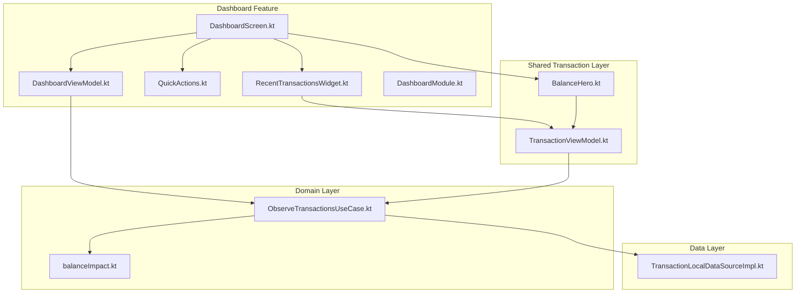
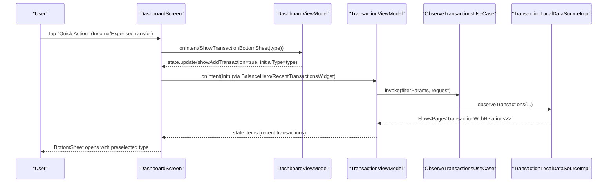
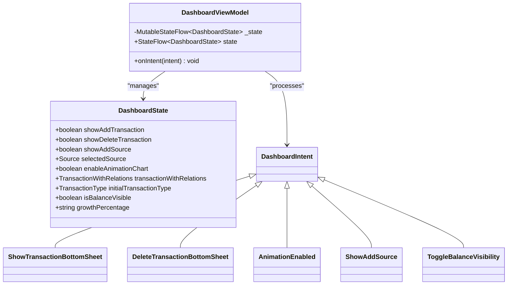
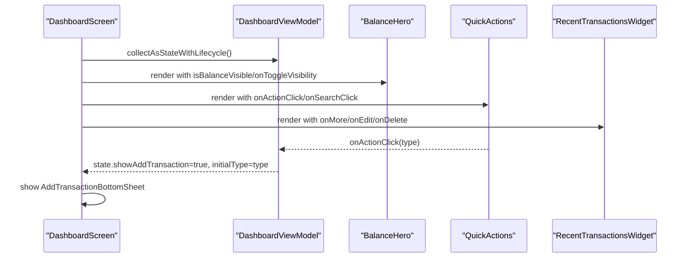
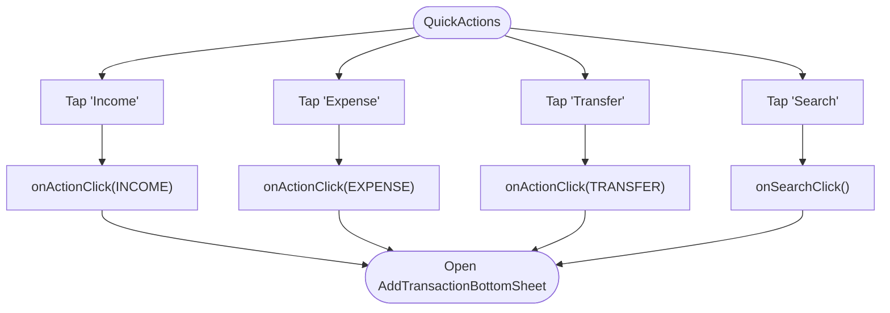
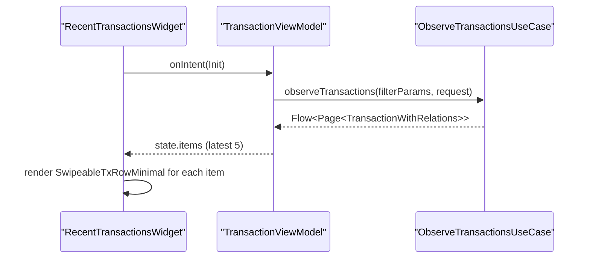
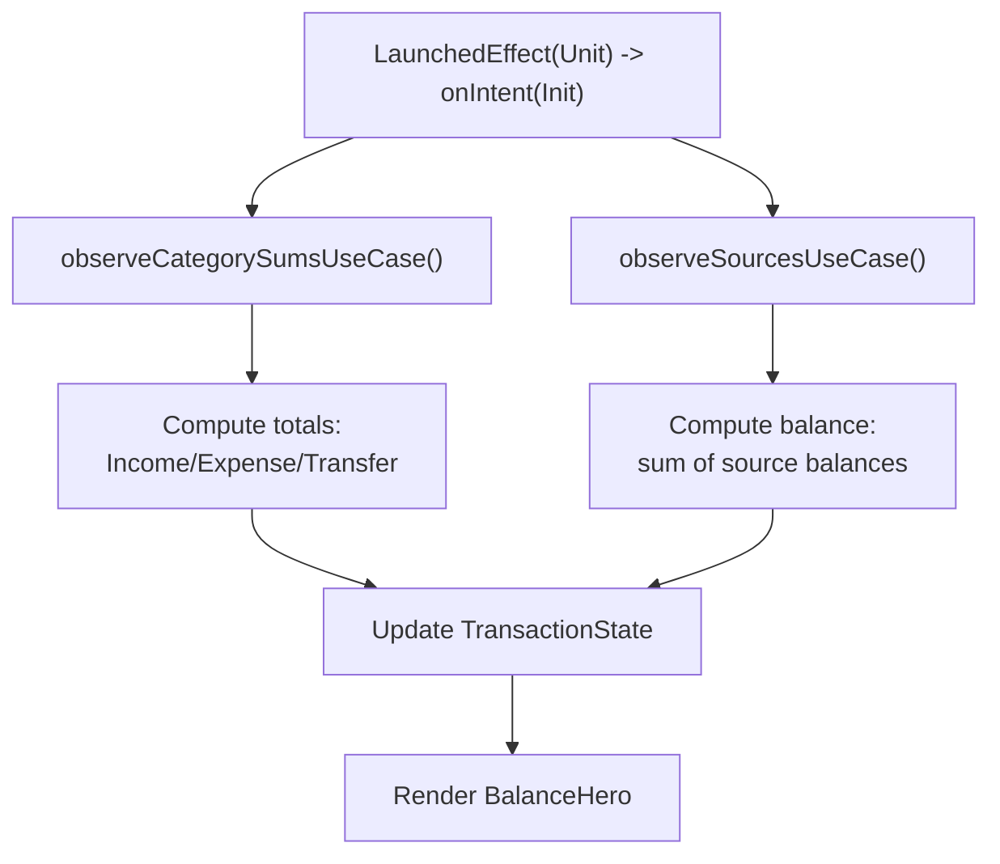
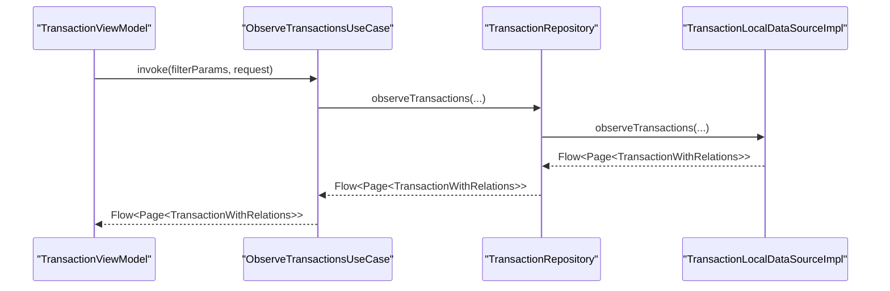
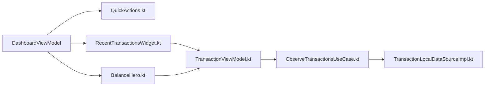

# Dashboard Feature

<cite>
**Referenced Files in This Document**
- [DashboardViewModel.kt](file://feature-container/dashboard/src/commonMain/kotlin/com/kazemieh/dashboard/DashboardViewModel.kt)
- [DashboardScreen.kt](file://feature-container/dashboard/src/commonMain/kotlin/com/kazemieh/dashboard/DashboardScreen.kt)
- [QuickActions.kt](file://feature-container/dashboard/src/commonMain/kotlin/com/kazemieh/dashboard/component/QuickActions.kt)
- [RecentTransactionsWidget.kt](file://feature-container/dashboard/src/commonMain/kotlin/com/kazemieh/dashboard/component/RecentTransactionsWidget.kt)
- [DashboardModule.kt](file://feature-container/dashboard/src/commonMain/kotlin/com/kazemieh/dashboard/di/DashboardModule.kt)
- [TransactionViewModel.kt](file://feature-share/transaction/src/commonMain/kotlin/com/kazemieh/transaction/ui/main/TransactionViewModel.kt)
- [BalanceHero.kt](file://feature-share/transaction/src/commonMain/kotlin/com/kazemieh/transaction/ui/main/BalanceHero.kt)
- [ObserveTransactionsUseCase.kt](file://core/domain/src/commonMain/kotlin/com/kazemieh/domain/usecase/ObserveTransactionsUseCase.kt)
- [TransactionLocalDataSourceImpl.kt](file://core/database/src/commonMain/kotlin/com/kazemieh/database/datasource/TransactionLocalDataSourceImpl.kt)
- [balanceImpact.kt](file://core/domain/src/commonMain/kotlin/com/kazemieh/domain/util/balanceImpact.kt)
- [DomainModule.kt](file://core/domain/src/commonMain/kotlin/com/kazemieh/domain/di/DomainModule.kt)
</cite>

## Table of Contents
1. [Introduction](#introduction)
2. [Project Structure](#project-structure)
3. [Core Components](#core-components)
4. [Architecture Overview](#architecture-overview)
5. [Detailed Component Analysis](#detailed-component-analysis)
6. [Dependency Analysis](#dependency-analysis)
7. [Performance Considerations](#performance-considerations)
8. [Troubleshooting Guide](#troubleshooting-guide)
9. [Conclusion](#conclusion)

## Introduction
The Dashboard feature serves as the primary user entry point and navigation hub for FinTrack. It presents a concise financial overview, including a summarized balance view, quick action buttons for fast transaction creation, and a recent transactions widget for immediate access to transaction history. The dashboard integrates with the domain layer to fetch real-time transaction data and balances, while maintaining a responsive UI through Compose Multiplatform rendering and MVVM state management.

## Project Structure
The dashboard feature is organized into presentation components and a dedicated ViewModel, with supporting UI widgets and dependency injection configuration. It collaborates with shared transaction screens and domain use cases to render financial summaries and manage user interactions.

**Diagram sources**
- [DashboardScreen.kt:64-211](file://feature-container/dashboard/src/commonMain/kotlin/com/kazemieh/dashboard/DashboardScreen.kt#L64-L211)
- [DashboardViewModel.kt:13-55](file://feature-container/dashboard/src/commonMain/kotlin/com/kazemieh/dashboard/DashboardViewModel.kt#L13-L55)
- [QuickActions.kt:29-72](file://feature-container/dashboard/src/commonMain/kotlin/com/kazemieh/dashboard/component/QuickActions.kt#L29-L72)
- [RecentTransactionsWidget.kt:21-50](file://feature-container/dashboard/src/commonMain/kotlin/com/kazemieh/dashboard/component/RecentTransactionsWidget.kt#L21-L50)
- [DashboardModule.kt:7-9](file://feature-container/dashboard/src/commonMain/kotlin/com/kazemieh/dashboard/di/DashboardModule.kt#L7-L9)
- [TransactionViewModel.kt:67-105](file://feature-share/transaction/src/commonMain/kotlin/com/kazemieh/transaction/ui/main/TransactionViewModel.kt#L67-L105)
- [BalanceHero.kt:39-93](file://feature-share/transaction/src/commonMain/kotlin/com/kazemieh/transaction/ui/main/BalanceHero.kt#L39-L93)
- [ObserveTransactionsUseCase.kt:10-19](file://core/domain/src/commonMain/kotlin/com/kazemieh/domain/usecase/ObserveTransactionsUseCase.kt#L10-L19)
- [TransactionLocalDataSourceImpl.kt:78-100](file://core/database/src/commonMain/kotlin/com/kazemieh/database/datasource/TransactionLocalDataSourceImpl.kt#L78-L100)
- [balanceImpact.kt:6-17](file://core/domain/src/commonMain/kotlin/com/kazemieh/domain/util/balanceImpact.kt#L6-L17)

**Section sources**
- [DashboardScreen.kt:64-211](file://feature-container/dashboard/src/commonMain/kotlin/com/kazemieh/dashboard/DashboardScreen.kt#L64-L211)
- [DashboardViewModel.kt:13-55](file://feature-container/dashboard/src/commonMain/kotlin/com/kazemieh/dashboard/DashboardViewModel.kt#L13-L55)
- [QuickActions.kt:29-72](file://feature-container/dashboard/src/commonMain/kotlin/com/kazemieh/dashboard/component/QuickActions.kt#L29-L72)
- [RecentTransactionsWidget.kt:21-50](file://feature-container/dashboard/src/commonMain/kotlin/com/kazemieh/dashboard/component/RecentTransactionsWidget.kt#L21-L50)
- [DashboardModule.kt:7-9](file://feature-container/dashboard/src/commonMain/kotlin/com/kazemieh/dashboard/di/DashboardModule.kt#L7-L9)

## Core Components
- DashboardViewModel: Manages UI state for the dashboard, including visibility toggles for balance, bottom sheets for adding/deleting transactions, and quick action intents. It exposes a StateFlow of DashboardState and processes DashboardIntent actions.
- DashboardScreen: Renders the dashboard UI, including decorative backgrounds, header with user greeting and icons, BalanceHero for financial summary, QuickActions for fast transaction creation, BudgetWidget placeholder, and RecentTransactionsWidget for recent activity. It coordinates navigation and bottom sheet visibility based on ViewModel state.
- QuickActions: A compact row of actionable cards for income, expense, transfer, and search, invoking callbacks to open the transaction creation sheet with appropriate transaction types.
- RecentTransactionsWidget: Displays a scrollable list of recent transactions fetched via TransactionViewModel, enabling inline edit and delete actions.

**Section sources**
- [DashboardViewModel.kt:13-83](file://feature-container/dashboard/src/commonMain/kotlin/com/kazemieh/dashboard/DashboardViewModel.kt#L13-L83)
- [DashboardScreen.kt:64-211](file://feature-container/dashboard/src/commonMain/kotlin/com/kazemieh/dashboard/DashboardScreen.kt#L64-L211)
- [QuickActions.kt:29-118](file://feature-container/dashboard/src/commonMain/kotlin/com/kazemieh/dashboard/component/QuickActions.kt#L29-L118)
- [RecentTransactionsWidget.kt:21-51](file://feature-container/dashboard/src/commonMain/kotlin/com/kazemieh/dashboard/component/RecentTransactionsWidget.kt#L21-L51)

## Architecture Overview
The dashboard follows MVVM:
- View: DashboardScreen renders UI and delegates user actions to DashboardViewModel.
- ViewModel: DashboardViewModel holds state and intents, orchestrating bottom sheet visibility and balance visibility toggles.
- Domain/Data: TransactionViewModel (shared) observes transactions and computes financial summaries using domain use cases and local data sources.

**Diagram sources**
- [DashboardScreen.kt:137-177](file://feature-container/dashboard/src/commonMain/kotlin/com/kazemieh/dashboard/DashboardScreen.kt#L137-L177)
- [DashboardViewModel.kt:18-54](file://feature-container/dashboard/src/commonMain/kotlin/com/kazemieh/dashboard/DashboardViewModel.kt#L18-L54)
- [TransactionViewModel.kt:83-105](file://feature-share/transaction/src/commonMain/kotlin/com/kazemieh/transaction/ui/main/TransactionViewModel.kt#L83-L105)
- [ObserveTransactionsUseCase.kt:13-18](file://core/domain/src/commonMain/kotlin/com/kazemieh/domain/usecase/ObserveTransactionsUseCase.kt#L13-L18)
- [TransactionLocalDataSourceImpl.kt:78-100](file://core/database/src/commonMain/kotlin/com/kazemieh/database/datasource/TransactionLocalDataSourceImpl.kt#L78-L100)

## Detailed Component Analysis

### DashboardViewModel
- Responsibilities:
  - Holds DashboardState with flags for bottom sheet visibility, selected source, animation toggle, and balance visibility.
  - Processes DashboardIntent actions to update state immutably via StateFlow.
- Key behaviors:
  - Toggle bottom sheet visibility for adding/removing transactions.
  - Toggle source selection and animation chart preference.
  - Toggle balance visibility for privacy/security.

**Diagram sources**
- [DashboardViewModel.kt:13-83](file://feature-container/dashboard/src/commonMain/kotlin/com/kazemieh/dashboard/DashboardViewModel.kt#L13-L83)

**Section sources**
- [DashboardViewModel.kt:13-83](file://feature-container/dashboard/src/commonMain/kotlin/com/kazemieh/dashboard/DashboardViewModel.kt#L13-L83)

### DashboardScreen
- Responsibilities:
  - Render decorative background elements and a scrollable column layout.
  - Host BalanceHero, QuickActions, BudgetWidget placeholder, and RecentTransactionsWidget.
  - Manage bottom sheets for transaction creation, deletion, and source selection.
  - Provide navigation callbacks to other screens.
- State orchestration:
  - Collects ViewModel state and reacts to intents for visibility toggles and bottom sheet control.

**Diagram sources**
- [DashboardScreen.kt:64-211](file://feature-container/dashboard/src/commonMain/kotlin/com/kazemieh/dashboard/DashboardScreen.kt#L64-L211)

**Section sources**
- [DashboardScreen.kt:64-211](file://feature-container/dashboard/src/commonMain/kotlin/com/kazemieh/dashboard/DashboardScreen.kt#L64-L211)

### QuickActions Component
- Responsibilities:
  - Provide four quick actions: Income, Expense, Transfer, and Search.
  - Emit the selected transaction type to the parent callback for bottom sheet initialization.
- UI characteristics:
  - Uses glass-styled cards with icons and labels, spaced evenly across the width.

**Diagram sources**
- [QuickActions.kt:29-72](file://feature-container/dashboard/src/commonMain/kotlin/com/kazemieh/dashboard/component/QuickActions.kt#L29-L72)

**Section sources**
- [QuickActions.kt:29-118](file://feature-container/dashboard/src/commonMain/kotlin/com/kazemieh/dashboard/component/QuickActions.kt#L29-L118)

### RecentTransactionsWidget
- Responsibilities:
  - Initialize transaction observation and display up to five recent items.
  - Support inline edit and delete actions by forwarding callbacks to the parent.
- Integration:
  - Uses TransactionViewModel to observe filtered pages of transactions and renders minimal swipeable rows.

**Diagram sources**
- [RecentTransactionsWidget.kt:21-50](file://feature-container/dashboard/src/commonMain/kotlin/com/kazemieh/dashboard/component/RecentTransactionsWidget.kt#L21-L50)
- [TransactionViewModel.kt:83-105](file://feature-share/transaction/src/commonMain/kotlin/com/kazemieh/transaction/ui/main/TransactionViewModel.kt#L83-L105)
- [ObserveTransactionsUseCase.kt:13-18](file://core/domain/src/commonMain/kotlin/com/kazemieh/domain/usecase/ObserveTransactionsUseCase.kt#L13-L18)

**Section sources**
- [RecentTransactionsWidget.kt:21-51](file://feature-container/dashboard/src/commonMain/kotlin/com/kazemieh/dashboard/component/RecentTransactionsWidget.kt#L21-L51)
- [TransactionViewModel.kt:67-105](file://feature-share/transaction/src/commonMain/kotlin/com/kazemieh/transaction/ui/main/TransactionViewModel.kt#L67-L105)

### Balance Calculation and Financial Summaries
- BalanceHero:
  - Initializes TransactionViewModel on first composition and displays the computed balance with optional masking.
  - Provides callbacks to toggle balance visibility and manage financial sources.
- TransactionViewModel:
  - Observes category sums and sources to compute totals for income, expense, transfer, and net balance.
  - Aggregates per-source balances to derive the overall financial position.

**Diagram sources**
- [BalanceHero.kt:39-93](file://feature-share/transaction/src/commonMain/kotlin/com/kazemieh/transaction/ui/main/BalanceHero.kt#L39-L93)
- [TransactionViewModel.kt:194-212](file://feature-share/transaction/src/commonMain/kotlin/com/kazemieh/transaction/ui/main/TransactionViewModel.kt#L194-L212)
- [ObserveTransactionsUseCase.kt:13-18](file://core/domain/src/commonMain/kotlin/com/kazemieh/domain/usecase/ObserveTransactionsUseCase.kt#L13-L18)

**Section sources**
- [BalanceHero.kt:39-93](file://feature-share/transaction/src/commonMain/kotlin/com/kazemieh/transaction/ui/main/BalanceHero.kt#L39-L93)
- [TransactionViewModel.kt:194-212](file://feature-share/transaction/src/commonMain/kotlin/com/kazemieh/transaction/ui/main/TransactionViewModel.kt#L194-L212)

### Domain Integration and Data Flow
- ObserveTransactionsUseCase:
  - Exposes a Flow of paginated transactions based on filter parameters and request limits.
- TransactionLocalDataSourceImpl:
  - Implements filtering by categories, sources, tags, persons, and timestamps, returning categorized sums and transactions.
- balanceImpact utility:
  - Computes per-source impact maps for different transaction types to support balance calculations.

**Diagram sources**
- [ObserveTransactionsUseCase.kt:10-19](file://core/domain/src/commonMain/kotlin/com/kazemieh/domain/usecase/ObserveTransactionsUseCase.kt#L10-L19)
- [TransactionLocalDataSourceImpl.kt:78-100](file://core/database/src/commonMain/kotlin/com/kazemieh/database/datasource/TransactionLocalDataSourceImpl.kt#L78-L100)
- [TransactionViewModel.kt:114-132](file://feature-share/transaction/src/commonMain/kotlin/com/kazemieh/transaction/ui/main/TransactionViewModel.kt#L114-L132)

**Section sources**
- [ObserveTransactionsUseCase.kt:10-19](file://core/domain/src/commonMain/kotlin/com/kazemieh/domain/usecase/ObserveTransactionsUseCase.kt#L10-L19)
- [TransactionLocalDataSourceImpl.kt:78-100](file://core/database/src/commonMain/kotlin/com/kazemieh/database/datasource/TransactionLocalDataSourceImpl.kt#L78-L100)
- [balanceImpact.kt:6-17](file://core/domain/src/commonMain/kotlin/com/kazemieh/domain/util/balanceImpact.kt#L6-L17)
- [DomainModule.kt:63-73](file://core/domain/src/commonMain/kotlin/com/kazemieh/domain/di/DomainModule.kt#L63-L73)

## Dependency Analysis
- Dashboard depends on:
  - Design system components for glass cards, typography, and spacing.
  - Shared transaction components for BalanceHero and RecentTransactionsWidget.
  - Koin for ViewModel injection.
- TransactionViewModel depends on:
  - Domain use cases for observing transactions and category sums.
  - Local data sources for database-backed queries.
- Domain layer provides:
  - Use cases and repositories abstracted behind DI modules.

**Diagram sources**
- [DashboardViewModel.kt:13-55](file://feature-container/dashboard/src/commonMain/kotlin/com/kazemieh/dashboard/DashboardViewModel.kt#L13-L55)
- [QuickActions.kt:29-72](file://feature-container/dashboard/src/commonMain/kotlin/com/kazemieh/dashboard/component/QuickActions.kt#L29-L72)
- [RecentTransactionsWidget.kt:21-50](file://feature-container/dashboard/src/commonMain/kotlin/com/kazemieh/dashboard/component/RecentTransactionsWidget.kt#L21-L50)
- [DashboardScreen.kt:64-211](file://feature-container/dashboard/src/commonMain/kotlin/com/kazemieh/dashboard/DashboardScreen.kt#L64-L211)
- [TransactionViewModel.kt:67-105](file://feature-share/transaction/src/commonMain/kotlin/com/kazemieh/transaction/ui/main/TransactionViewModel.kt#L67-L105)
- [ObserveTransactionsUseCase.kt:10-19](file://core/domain/src/commonMain/kotlin/com/kazemieh/domain/usecase/ObserveTransactionsUseCase.kt#L10-L19)
- [TransactionLocalDataSourceImpl.kt:78-100](file://core/database/src/commonMain/kotlin/com/kazemieh/database/datasource/TransactionLocalDataSourceImpl.kt#L78-L100)

**Section sources**
- [DashboardModule.kt:7-9](file://feature-container/dashboard/src/commonMain/kotlin/com/kazemieh/dashboard/di/DashboardModule.kt#L7-L9)
- [DomainModule.kt:63-73](file://core/domain/src/commonMain/kotlin/com/kazemieh/domain/di/DomainModule.kt#L63-L73)

## Performance Considerations
- Real-time updates:
  - Use Case-based observation streams ensure reactive UI updates without manual polling.
- Memory management for large lists:
  - RecentTransactionsWidget limits displayed items to a small fixed count, reducing composition overhead.
  - TransactionViewModel employs pagination and distinct filters to minimize payload sizes.
- Rendering efficiency:
  - Compose’s immutable state and recomposition boundaries reduce unnecessary redraws.
  - Glass-styled widgets leverage shared design tokens to maintain consistent performance across platforms.
- Cross-platform UI adaptations:
  - Compose Multiplatform ensures consistent UI behavior across Android, iOS, JVM, and Web targets with platform-specific drivers.

## Troubleshooting Guide
- Bottom sheets not appearing:
  - Verify DashboardViewModel intents are invoked and state flags are toggled correctly.
  - Confirm that DashboardScreen conditionally renders bottom sheets based on state.
- Recent transactions not updating:
  - Ensure TransactionViewModel receives Init intent and starts observing transactions.
  - Check that ObserveTransactionsUseCase and TransactionLocalDataSourceImpl are wired via DI.
- Balance not visible:
  - Confirm ToggleBalanceVisibility intent is handled and state.isBalanceVisible is respected by BalanceHero.

**Section sources**
- [DashboardViewModel.kt:18-54](file://feature-container/dashboard/src/commonMain/kotlin/com/kazemieh/dashboard/DashboardViewModel.kt#L18-L54)
- [DashboardScreen.kt:177-210](file://feature-container/dashboard/src/commonMain/kotlin/com/kazemieh/dashboard/DashboardScreen.kt#L177-L210)
- [TransactionViewModel.kt:83-105](file://feature-share/transaction/src/commonMain/kotlin/com/kazemieh/transaction/ui/main/TransactionViewModel.kt#L83-L105)
- [ObserveTransactionsUseCase.kt:13-18](file://core/domain/src/commonMain/kotlin/com/kazemieh/domain/usecase/ObserveTransactionsUseCase.kt#L13-L18)

## Conclusion
The Dashboard feature consolidates FinTrack’s financial overview and quick actions into a cohesive, responsive interface. Through MVVM, it cleanly separates UI concerns from state management, while integrating with domain use cases and local data sources to present accurate, real-time financial summaries. The modular design supports scalable enhancements and consistent cross-platform experiences.