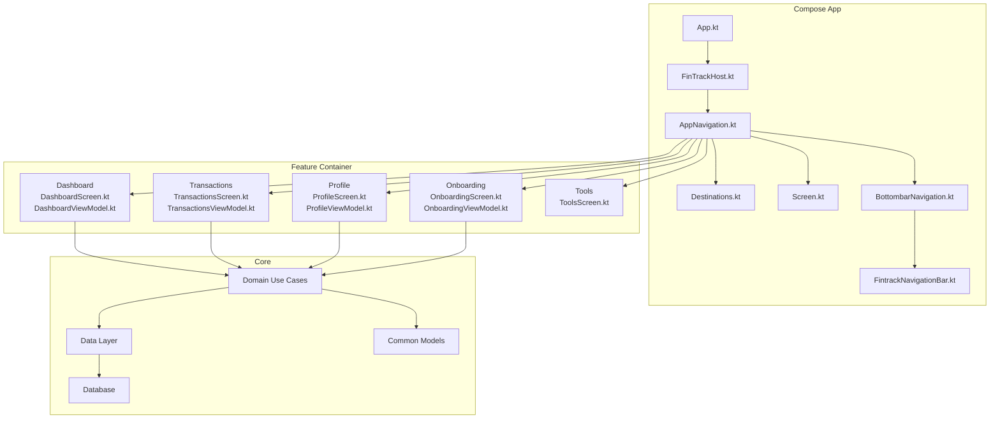
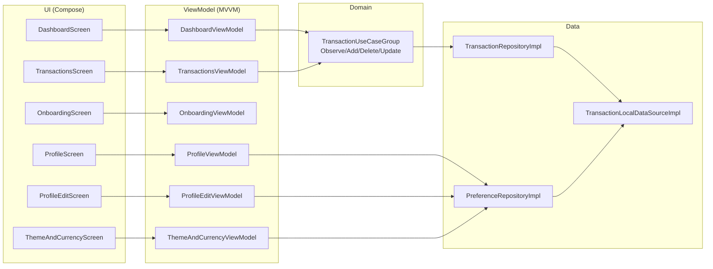
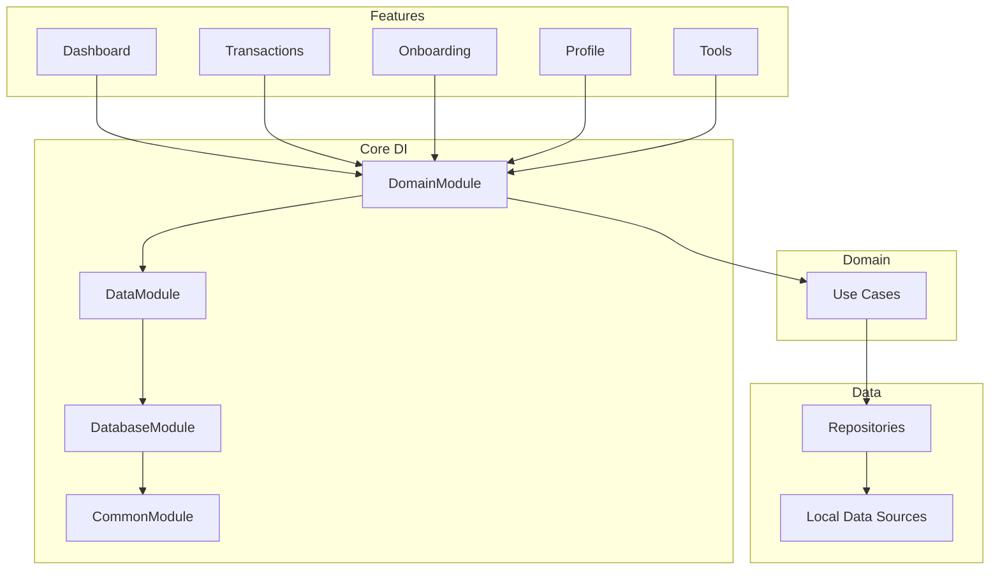

# Feature Modules

<cite>
**Referenced Files in This Document**
- [DashboardScreen.kt](file://feature-container/dashboard/src/commonMain/kotlin/com/kazemieh/dashboard/DashboardScreen.kt)
- [DashboardViewModel.kt](file://feature-container/dashboard/src/commonMain/kotlin/com/kazemieh/dashboard/DashboardViewModel.kt)
- [DashboardModule.kt](file://feature-container/dashboard/src/commonMain/kotlin/com/kazemieh/dashboard/di/DashboardModule.kt)
- [QuickActions.kt](file://feature-container/dashboard/src/commonMain/kotlin/com/kazemieh/dashboard/component/QuickActions.kt)
- [RecentTransactionsWidget.kt](file://feature-container/dashboard/src/commonMain/kotlin/com/kazemieh/dashboard/component/RecentTransactionsWidget.kt)
- [OnboardingScreen.kt](file://feature-container/onboarding/src/commonMain/kotlin/com/kazemieh/onboarding/ui/OnboardingScreen.kt)
- [OnboardingViewModel.kt](file://feature-container/onboarding/src/commonMain/kotlin/com/kazemieh/onboarding/ui/OnboardingViewModel.kt)
- [OnboardingModule.kt](file://feature-container/onboarding/src/commonMain/kotlin/com/kazemieh/onboarding/di/OnboardingModule.kt)
- [ProfileScreen.kt](file://feature-container/profile/src/commonMain/kotlin/com/kazemieh/profile/ProfileScreen.kt)
- [ProfileViewModel.kt](file://feature-container/profile/src/commonMain/kotlin/com/kazemieh/profile/ProfileViewModel.kt)
- [ProfileEditScreen.kt](file://feature-container/profile/src/commonMain/kotlin/com/kazemieh/profile/ProfileEditScreen.kt)
- [ProfileEditViewModel.kt](file://feature-container/profile/src/commonMain/kotlin/com/kazemieh/profile/ProfileEditViewModel.kt)
- [ThemeAndCurrencyScreen.kt](file://feature-container/profile/src/commonMain/kotlin/com/kazemieh/profile/ThemeAndCurrencyScreen.kt)
- [ThemeAndCurrencyViewModel.kt](file://feature-container/profile/src/commonMain/kotlin/com/kazemieh/profile/ThemeAndCurrencyViewModel.kt)
- [ProfileEditContract.kt](file://feature-container/profile/src/commonMain/kotlin/com/kazemieh/profile/ProfileEditContract.kt)
- [DashboardModule.kt (profile)](file://feature-container/profile/src/commonMain/kotlin/com/kazemieh/profile/di/DashboardModule.kt)
- [TransactionsScreen.kt](file://feature-container/transactions/src/commonMain/kotlin/com/kazemieh/transactions/TransactionsScreen.kt)
- [TransactionsViewModel.kt](file://feature-container/transactions/src/commonMain/kotlin/com/kazemieh/transactions/TransactionsViewModel.kt)
- [TransactionFilterBottomSheet.kt](file://feature-container/transactions/src/commonMain/kotlin/com/kazemieh/transactions/TransactionFilterBottomSheet.kt)
- [ReportTopBar.kt](file://feature-container/transactions/src/commonMain/kotlin/com/kazemieh/transactions/ReportTopBar.kt)
- [di.kt (transactions)](file://feature-container/transactions/src/commonMain/kotlin/com/kazemieh/transactions/di/di.kt)
- [ToolsScreen.kt](file://feature-container/tools/src/commonMain/kotlin/com/kazemieh/tools/ToolsScreen.kt)
- [di.kt (tools)](file://feature-container/tools/src/commonMain/kotlin/com/kazemieh/tools/di/di.kt)
- [AppNavigation.kt](file://composeApp/src/commonMain/kotlin/com/kazemieh/composeApp/navigation/AppNavigation.kt)
- [Destinations.kt](file://composeApp/src/commonMain/kotlin/com/kazemieh/composeApp/navigation/Destinations.kt)
- [Screen.kt](file://composeApp/src/commonMain/kotlin/com/kazemieh/composeApp/navigation/Screen.kt)
- [BottombarNavigation.kt](file://composeApp/src/commonMain/kotlin/com/kazemieh/composeApp/navigation/navigationBar/BottombarNavigation.kt)
- [FintrackNavigationBar.kt](file://composeApp/src/commonMain/kotlin/com/kazemieh/composeApp/navigation/navigationBar/FintrackNavigationBar.kt)
- [App.kt](file://composeApp/src/commonMain/kotlin/com/kazemieh/composeApp/App.kt)
- [FinTrackHost.kt](file://composeApp/src/commonMain/kotlin/com/kazemieh/composeApp/FinTrackHost.kt)
- [TransactionUseCaseGroup.kt](file://core/domain/src/commonMain/kotlin/com/kazemieh/domain/usecase/TransactionUseCaseGroup.kt)
- [ObserveTransactionsUseCase.kt](file://core/domain/src/commonMain/kotlin/com/kazemieh/domain/usecase/ObserveTransactionsUseCase.kt)
- [AddTransactionUseCase.kt](file://core/domain/src/commonMain/kotlin/com/kazemieh/domain/usecase/AddTransactionUseCase.kt)
- [DeleteTransactionUseCase.kt](file://core/domain/src/commonMain/kotlin/com/kazemieh/domain/usecase/DeleteTransactionUseCase.kt)
- [UpdateTransactionUseCase.kt](file://core/domain/src/commonMain/kotlin/com/kazemieh/domain/usecase/UpdateTransactionUseCase.kt)
- [Transaction.kt](file://core/common/src/commonMain/kotlin/com/kazemieh/common/model/Transaction.kt)
- [TransactionWithRelations.kt](file://core/common/src/commonMain/kotlin/com/kazemieh/common/model/TransactionWithRelations.kt)
- [TransactionFilterParams.kt](file://core/common/src/commonMain/kotlin/com/kazemieh/common/model/TransactionFilterParams.kt)
- [TransactionLocalDataSource.kt](file://core/data-contract/src/commonMain/kotlin/com/kazemieh/data_contract/datasource/TransactionLocalDataSource.kt)
- [TransactionLocalDataSourceImpl.kt](file://core/database/src/commonMain/kotlin/com/kazemieh/database/datasource/TransactionLocalDataSourceImpl.kt)
- [TransactionRepositoryImpl.kt](file://core/data/src/commonMain/kotlin/com/kazemieh/data/repository/TransactionRepositoryImpl.kt)
- [DomainModule.kt](file://core/domain/src/commonMain/kotlin/com/kazemieh/domain/di/DomainModule.kt)
- [DataModule.kt](file://core/data/src/commonMain/kotlin/com/kazemieh/data/di/DataModule.kt)
- [DatabaseModule.kt](file://core/database/src/commonMain/kotlin/com/kazemieh/database/di/DatabaseModule.kt)
- [CommonModule.kt](file://core/common/src/commonMain/kotlin/com/kazemieh/common/di/CommonModule.kt)
- [PreferenceRepositoryImpl.kt](file://core/data/src/commonMain/kotlin/com/kazemieh/data/repository/PreferenceRepositoryImpl.kt)
- [FinTrackPreferences.kt](file://core/preferences/src/commonMain/kotlin/com/kazemieh/preferences/FinTrackPreferences.kt)
- [settings.gradle.kts](file://settings.gradle.kts)
- [build.gradle.kts (root)](file://build.gradle.kts)
</cite>

## Table of Contents
1. [Introduction](#introduction)
2. [Project Structure](#project-structure)
3. [Core Components](#core-components)
4. [Architecture Overview](#architecture-overview)
5. [Detailed Component Analysis](#detailed-component-analysis)
6. [Dependency Analysis](#dependency-analysis)
7. [Performance Considerations](#performance-considerations)
8. [Troubleshooting Guide](#troubleshooting-guide)
9. [Conclusion](#conclusion)

## Introduction
This document explains FinTrack’s feature module organization with a focus on high-level UI containers and major functional areas. It covers four primary feature containers:
- Dashboard: Main analytics and overview
- Transactions: Transaction management
- Onboarding: User onboarding flow
- Profile: User settings and preferences

It also documents how these features integrate with core modules (MVVM pattern, MVI-style intents, Compose Multiplatform UI), navigation patterns, and cross-platform considerations. The goal is to help both beginners understand feature boundaries and experienced developers extend functionality effectively.

## Project Structure
FinTrack organizes features into separate modules under feature-container, each exposing screens and view models following MVVM. Navigation is centralized in composeApp, which orchestrates screens and bottom bar routing. Core modules provide domain use cases, repositories, and platform-specific data sources.

**Diagram sources**
- [App.kt](file://composeApp/src/commonMain/kotlin/com/kazemieh/composeApp/App.kt)
- [FinTrackHost.kt](file://composeApp/src/commonMain/kotlin/com/kazemieh/composeApp/FinTrackHost.kt)
- [AppNavigation.kt](file://composeApp/src/commonMain/kotlin/com/kazemieh/composeApp/navigation/AppNavigation.kt)
- [Destinations.kt](file://composeApp/src/commonMain/kotlin/com/kazemieh/composeApp/navigation/Destinations.kt)
- [Screen.kt](file://composeApp/src/commonMain/kotlin/com/kazemieh/composeApp/navigation/Screen.kt)
- [BottombarNavigation.kt](file://composeApp/src/commonMain/kotlin/com/kazemieh/composeApp/navigation/navigationBar/BottombarNavigation.kt)
- [FintrackNavigationBar.kt](file://composeApp/src/commonMain/kotlin/com/kazemieh/composeApp/navigation/navigationBar/FintrackNavigationBar.kt)
- [DashboardScreen.kt](file://feature-container/dashboard/src/commonMain/kotlin/com/kazemieh/dashboard/DashboardScreen.kt)
- [TransactionsScreen.kt](file://feature-container/transactions/src/commonMain/kotlin/com/kazemieh/transactions/TransactionsScreen.kt)
- [OnboardingScreen.kt](file://feature-container/onboarding/src/commonMain/kotlin/com/kazemieh/onboarding/ui/OnboardingScreen.kt)
- [ProfileScreen.kt](file://feature-container/profile/src/commonMain/kotlin/com/kazemieh/profile/ProfileScreen.kt)
- [ToolsScreen.kt](file://feature-container/tools/src/commonMain/kotlin/com/kazemieh/tools/ToolsScreen.kt)
- [DomainModule.kt](file://core/domain/src/commonMain/kotlin/com/kazemieh/domain/di/DomainModule.kt)
- [DataModule.kt](file://core/data/src/commonMain/kotlin/com/kazemieh/data/di/DataModule.kt)
- [DatabaseModule.kt](file://core/database/src/commonMain/kotlin/com/kazemieh/database/di/DatabaseModule.kt)
- [CommonModule.kt](file://core/common/src/commonMain/kotlin/com/kazemieh/common/di/CommonModule.kt)

**Section sources**
- [settings.gradle.kts](file://settings.gradle.kts)
- [build.gradle.kts (root)](file://build.gradle.kts)

## Core Components
This section introduces the MVVM components used across feature modules and how they connect to core domain capabilities.

- ViewModels: Each feature exposes a ViewModel responsible for state and intent handling (MVI-style). Examples:
  - DashboardViewModel: Manages overview analytics and recent items.
  - TransactionsViewModel: Handles filtering, reporting, and CRUD operations via use cases.
  - OnboardingViewModel: Drives onboarding steps and completion.
  - ProfileViewModel and ProfileEditViewModel: Manage user profile and editing flows.
  - ThemeAndCurrencyViewModel: Controls theme and currency preferences.

- Screens: Compose UI surfaces that render state and emit intents. Examples:
  - DashboardScreen: Renders quick actions and recent transactions widgets.
  - TransactionsScreen: Presents transaction list with top bar and filter sheet.
  - OnboardingScreen: Guides user through onboarding steps.
  - ProfileScreen and ProfileEditScreen: Display and edit user settings.
  - ThemeAndCurrencyScreen: Adjusts theme and currency preferences.

- Domain Integration: Feature ViewModels depend on domain use cases (e.g., observe, add, update, delete transactions) and repositories. These are wired via DI modules in each feature.

**Section sources**
- [DashboardViewModel.kt](file://feature-container/dashboard/src/commonMain/kotlin/com/kazemieh/dashboard/DashboardViewModel.kt)
- [TransactionsViewModel.kt](file://feature-container/transactions/src/commonMain/kotlin/com/kazemieh/transactions/TransactionsViewModel.kt)
- [OnboardingViewModel.kt](file://feature-container/onboarding/src/commonMain/kotlin/com/kazemieh/onboarding/ui/OnboardingViewModel.kt)
- [ProfileViewModel.kt](file://feature-container/profile/src/commonMain/kotlin/com/kazemieh/profile/ProfileViewModel.kt)
- [ProfileEditViewModel.kt](file://feature-container/profile/src/commonMain/kotlin/com/kazemieh/profile/ProfileEditViewModel.kt)
- [ThemeAndCurrencyViewModel.kt](file://feature-container/profile/src/commonMain/kotlin/com/kazemieh/profile/ThemeAndCurrencyViewModel.kt)
- [TransactionUseCaseGroup.kt](file://core/domain/src/commonMain/kotlin/com/kazemieh/domain/usecase/TransactionUseCaseGroup.kt)
- [ObserveTransactionsUseCase.kt](file://core/domain/src/commonMain/kotlin/com/kazemieh/domain/usecase/ObserveTransactionsUseCase.kt)
- [AddTransactionUseCase.kt](file://core/domain/src/commonMain/kotlin/com/kazemieh/domain/usecase/AddTransactionUseCase.kt)
- [DeleteTransactionUseCase.kt](file://core/domain/src/commonMain/kotlin/com/kazemieh/domain/usecase/DeleteTransactionUseCase.kt)
- [UpdateTransactionUseCase.kt](file://core/domain/src/commonMain/kotlin/com/kazemieh/domain/usecase/UpdateTransactionUseCase.kt)

## Architecture Overview
The feature modules follow MVVM with Compose Multiplatform UI. Navigation is centralized and driven by destinations and screens. Domain use cases encapsulate business logic and are injected into ViewModels via DI modules. Data repositories and local data sources provide persistence and platform-specific implementations.

**Diagram sources**
- [DashboardScreen.kt](file://feature-container/dashboard/src/commonMain/kotlin/com/kazemieh/dashboard/DashboardScreen.kt)
- [TransactionsScreen.kt](file://feature-container/transactions/src/commonMain/kotlin/com/kazemieh/transactions/TransactionsScreen.kt)
- [OnboardingScreen.kt](file://feature-container/onboarding/src/commonMain/kotlin/com/kazemieh/onboarding/ui/OnboardingScreen.kt)
- [ProfileScreen.kt](file://feature-container/profile/src/commonMain/kotlin/com/kazemieh/profile/ProfileScreen.kt)
- [ProfileEditScreen.kt](file://feature-container/profile/src/commonMain/kotlin/com/kazemieh/profile/ProfileEditScreen.kt)
- [ThemeAndCurrencyScreen.kt](file://feature-container/profile/src/commonMain/kotlin/com/kazemieh/profile/ThemeAndCurrencyScreen.kt)
- [DashboardViewModel.kt](file://feature-container/dashboard/src/commonMain/kotlin/com/kazemieh/dashboard/DashboardViewModel.kt)
- [TransactionsViewModel.kt](file://feature-container/transactions/src/commonMain/kotlin/com/kazemieh/transactions/TransactionsViewModel.kt)
- [OnboardingViewModel.kt](file://feature-container/onboarding/src/commonMain/kotlin/com/kazemieh/onboarding/ui/OnboardingViewModel.kt)
- [ProfileViewModel.kt](file://feature-container/profile/src/commonMain/kotlin/com/kazemieh/profile/ProfileViewModel.kt)
- [ProfileEditViewModel.kt](file://feature-container/profile/src/commonMain/kotlin/com/kazemieh/profile/ProfileEditViewModel.kt)
- [ThemeAndCurrencyViewModel.kt](file://feature-container/profile/src/commonMain/kotlin/com/kazemieh/profile/ThemeAndCurrencyViewModel.kt)
- [TransactionUseCaseGroup.kt](file://core/domain/src/commonMain/kotlin/com/kazemieh/domain/usecase/TransactionUseCaseGroup.kt)
- [TransactionRepositoryImpl.kt](file://core/data/src/commonMain/kotlin/com/kazemieh/data/repository/TransactionRepositoryImpl.kt)
- [TransactionLocalDataSourceImpl.kt](file://core/database/src/commonMain/kotlin/com/kazemieh/database/datasource/TransactionLocalDataSourceImpl.kt)
- [PreferenceRepositoryImpl.kt](file://core/data/src/commonMain/kotlin/com/kazemieh/data/repository/PreferenceRepositoryImpl.kt)

## Detailed Component Analysis

### Dashboard Feature
Purpose and scope:
- Provides a main analytics and overview screen.
- Includes quick actions and a recent transactions widget.
- Integrates with domain use cases to present summarized financial insights.

Key components:
- DashboardScreen: Renders overview UI and delegates interactions to DashboardViewModel.
- DashboardViewModel: Holds state and handles intents for analytics and recent items.
- QuickActions: Compose UI component for fast-access actions.
- RecentTransactionsWidget: Compose UI component displaying recent entries.

Implementation details:
- ViewModel observes transaction streams and computes summary metrics.
- UI emits intents for navigation to transaction lists and quick actions.
- DI wiring ensures use cases are provided to the ViewModel.

Navigation patterns:
- Bottom bar navigation routes to Dashboard by default.
- Quick actions navigate to related transaction views.

Integration with core modules:
- Uses ObserveTransactionsUseCase to stream data.
- Uses TransactionUseCaseGroup for aggregated operations.

Practical examples:
- User taps a quick action to add a new transaction; ViewModel triggers AddTransactionUseCase and updates state.
- Recent widget refreshes automatically when new transactions arrive via ObserveTransactionsUseCase.

**Section sources**
- [DashboardScreen.kt](file://feature-container/dashboard/src/commonMain/kotlin/com/kazemieh/dashboard/DashboardScreen.kt)
- [DashboardViewModel.kt](file://feature-container/dashboard/src/commonMain/kotlin/com/kazemieh/dashboard/DashboardViewModel.kt)
- [QuickActions.kt](file://feature-container/dashboard/src/commonMain/kotlin/com/kazemieh/dashboard/component/QuickActions.kt)
- [RecentTransactionsWidget.kt](file://feature-container/dashboard/src/commonMain/kotlin/com/kazemieh/dashboard/component/RecentTransactionsWidget.kt)
- [DashboardModule.kt](file://feature-container/dashboard/src/commonMain/kotlin/com/kazemieh/dashboard/di/DashboardModule.kt)
- [ObserveTransactionsUseCase.kt](file://core/domain/src/commonMain/kotlin/com/kazemieh/domain/usecase/ObserveTransactionsUseCase.kt)
- [TransactionUseCaseGroup.kt](file://core/domain/src/commonMain/kotlin/com/kazemieh/domain/usecase/TransactionUseCaseGroup.kt)

### Transactions Feature
Purpose and scope:
- Central place for viewing, filtering, and managing transactions.
- Supports report top bar, filter bottom sheet, and list rendering.

Key components:
- TransactionsScreen: Main transaction list UI.
- TransactionsViewModel: Manages filters, sorting, and CRUD intents.
- ReportTopBar: Top bar for reports and actions.
- TransactionFilterBottomSheet: Filter UI anchored to bottom sheet.

Implementation details:
- ViewModel composes filter parameters and applies them to ObserveTransactionsUseCase.
- Emits intents to add, update, or delete transactions via TransactionUseCaseGroup.
- UI reacts to state changes and displays filtered lists.

Navigation patterns:
- From dashboard quick actions to open the transaction list.
- Filter sheet overlays during browsing.

Integration with core modules:
- Uses ObserveTransactionsUseCase for live updates.
- Uses AddTransactionUseCase, UpdateTransactionUseCase, DeleteTransactionUseCase for mutations.

Practical examples:
- User opens filter sheet, selects date range, and TransactionsScreen updates instantly.
- User taps “Add” action; ViewModel triggers AddTransactionUseCase and navigates to add screen.

**Section sources**
- [TransactionsScreen.kt](file://feature-container/transactions/src/commonMain/kotlin/com/kazemieh/transactions/TransactionsScreen.kt)
- [TransactionsViewModel.kt](file://feature-container/transactions/src/commonMain/kotlin/com/kazemieh/transactions/TransactionsViewModel.kt)
- [ReportTopBar.kt](file://feature-container/transactions/src/commonMain/kotlin/com/kazemieh/transactions/ReportTopBar.kt)
- [TransactionFilterBottomSheet.kt](file://feature-container/transactions/src/commonMain/kotlin/com/kazemieh/transactions/TransactionFilterBottomSheet.kt)
- [di.kt (transactions)](file://feature-container/transactions/src/commonMain/kotlin/com/kazemieh/transactions/di/di.kt)
- [ObserveTransactionsUseCase.kt](file://core/domain/src/commonMain/kotlin/com/kazemieh/domain/usecase/ObserveTransactionsUseCase.kt)
- [AddTransactionUseCase.kt](file://core/domain/src/commonMain/kotlin/com/kazemieh/domain/usecase/AddTransactionUseCase.kt)
- [DeleteTransactionUseCase.kt](file://core/domain/src/commonMain/kotlin/com/kazemieh/domain/usecase/DeleteTransactionUseCase.kt)
- [UpdateTransactionUseCase.kt](file://core/domain/src/commonMain/kotlin/com/kazemieh/domain/usecase/UpdateTransactionUseCase.kt)

### Onboarding Feature
Purpose and scope:
- Guides new users through initial setup and configuration.
- Collects essential preferences and completes onboarding.

Key components:
- OnboardingScreen: Step-by-step onboarding UI.
- OnboardingViewModel: Manages onboarding progress and completion.

Implementation details:
- ViewModel holds onboarding state and emits intents to advance steps.
- Completes onboarding by invoking appropriate domain actions and persisting preferences.

Navigation patterns:
- Sequential steps lead to completion.
- Onboarding is typically a modal or full-screen flow before entering main app.

Integration with core modules:
- Uses preference repositories and domain use cases to finalize setup.

Practical examples:
- User completes identity setup; ViewModel triggers preference updates and exits onboarding.

**Section sources**
- [OnboardingScreen.kt](file://feature-container/onboarding/src/commonMain/kotlin/com/kazemieh/onboarding/ui/OnboardingScreen.kt)
- [OnboardingViewModel.kt](file://feature-container/onboarding/src/commonMain/kotlin/com/kazemieh/onboarding/ui/OnboardingViewModel.kt)
- [OnboardingModule.kt](file://feature-container/onboarding/src/commonMain/kotlin/com/kazemieh/onboarding/di/OnboardingModule.kt)

### Profile Feature
Purpose and scope:
- Allows users to view and edit personal settings, including theme and currency preferences.

Key components:
- ProfileScreen: Main profile view.
- ProfileViewModel: Manages profile state and navigation intents.
- ProfileEditScreen and ProfileEditViewModel: Editable profile fields.
- ThemeAndCurrencyScreen and ThemeAndCurrencyViewModel: Preferences for theme and currency.

Implementation details:
- ProfileEditContract defines editing contracts and validation.
- ThemeAndCurrencyViewModel manages preference updates via PreferenceRepositoryImpl.
- Profile screens integrate with FinTrackPreferences for persistence.

Navigation patterns:
- From bottom bar to Profile.
- From Profile to Edit and Theme/Currency screens.

Integration with core modules:
- PreferenceRepositoryImpl persists and observes preferences.
- FinTrackPreferences centralizes preference keys and defaults.

Practical examples:
- User switches theme; ThemeAndCurrencyViewModel updates preferences and UI reflects changes immediately.

**Section sources**
- [ProfileScreen.kt](file://feature-container/profile/src/commonMain/kotlin/com/kazemieh/profile/ProfileScreen.kt)
- [ProfileViewModel.kt](file://feature-container/profile/src/commonMain/kotlin/com/kazemieh/profile/ProfileViewModel.kt)
- [ProfileEditScreen.kt](file://feature-container/profile/src/commonMain/kotlin/com/kazemieh/profile/ProfileEditScreen.kt)
- [ProfileEditViewModel.kt](file://feature-container/profile/src/commonMain/kotlin/com/kazemieh/profile/ProfileEditViewModel.kt)
- [ThemeAndCurrencyScreen.kt](file://feature-container/profile/src/commonMain/kotlin/com/kazemieh/profile/ThemeAndCurrencyScreen.kt)
- [ThemeAndCurrencyViewModel.kt](file://feature-container/profile/src/commonMain/kotlin/com/kazemieh/profile/ThemeAndCurrencyViewModel.kt)
- [ProfileEditContract.kt](file://feature-container/profile/src/commonMain/kotlin/com/kazemieh/profile/ProfileEditContract.kt)
- [DashboardModule.kt (profile)](file://feature-container/profile/src/commonMain/kotlin/com/kazemieh/profile/di/DashboardModule.kt)
- [PreferenceRepositoryImpl.kt](file://core/data/src/commonMain/kotlin/com/kazemieh/data/repository/PreferenceRepositoryImpl.kt)
- [FinTrackPreferences.kt](file://core/preferences/src/commonMain/kotlin/com/kazemieh/preferences/FinTrackPreferences.kt)

### Tools Feature
Purpose and scope:
- Provides auxiliary tools screen within the feature-container module.

Key components:
- ToolsScreen: Placeholder or utility screen surface.

Implementation details:
- Exposed as part of feature-container for potential future tooling integrations.

**Section sources**
- [ToolsScreen.kt](file://feature-container/tools/src/commonMain/kotlin/com/kazemieh/tools/ToolsScreen.kt)
- [di.kt (tools)](file://feature-container/tools/src/commonMain/kotlin/com/kazemieh/tools/di/di.kt)

## Dependency Analysis
Feature modules depend on core domain and data layers. DI modules wire use cases and repositories into ViewModels. Navigation depends on centralized navigation definitions and bottom bar components.

**Diagram sources**
- [DomainModule.kt](file://core/domain/src/commonMain/kotlin/com/kazemieh/domain/di/DomainModule.kt)
- [DataModule.kt](file://core/data/src/commonMain/kotlin/com/kazemieh/data/di/DataModule.kt)
- [DatabaseModule.kt](file://core/database/src/commonMain/kotlin/com/kazemieh/database/di/DatabaseModule.kt)
- [CommonModule.kt](file://core/common/src/commonMain/kotlin/com/kazemieh/common/di/CommonModule.kt)
- [TransactionUseCaseGroup.kt](file://core/domain/src/commonMain/kotlin/com/kazemieh/domain/usecase/TransactionUseCaseGroup.kt)
- [TransactionRepositoryImpl.kt](file://core/data/src/commonMain/kotlin/com/kazemieh/data/repository/TransactionRepositoryImpl.kt)
- [TransactionLocalDataSourceImpl.kt](file://core/database/src/commonMain/kotlin/com/kazemieh/database/datasource/TransactionLocalDataSourceImpl.kt)

**Section sources**
- [DomainModule.kt](file://core/domain/src/commonMain/kotlin/com/kazemieh/domain/di/DomainModule.kt)
- [DataModule.kt](file://core/data/src/commonMain/kotlin/com/kazemieh/data/di/DataModule.kt)
- [DatabaseModule.kt](file://core/database/src/commonMain/kotlin/com/kazemieh/database/di/DatabaseModule.kt)
- [CommonModule.kt](file://core/common/src/commonMain/kotlin/com/kazemieh/common/di/CommonModule.kt)

## Performance Considerations
- Prefer observing streams via ObserveTransactionsUseCase to avoid polling and reduce unnecessary recompositions.
- Keep filter computations in ViewModels and memoize where appropriate to minimize UI work.
- Use bottom sheet overlays judiciously to avoid deep composition trees.
- Persist preferences asynchronously to prevent UI blocking.

## Troubleshooting Guide
- If transaction list does not update:
  - Verify ObserveTransactionsUseCase is active and emitting.
  - Confirm TransactionRepositoryImpl and TransactionLocalDataSourceImpl are wired correctly.
- If onboarding does not complete:
  - Check OnboardingViewModel state transitions and preference writes.
- If profile changes do not persist:
  - Ensure PreferenceRepositoryImpl is injected and FinTrackPreferences keys are correct.

**Section sources**
- [ObserveTransactionsUseCase.kt](file://core/domain/src/commonMain/kotlin/com/kazemieh/domain/usecase/ObserveTransactionsUseCase.kt)
- [TransactionRepositoryImpl.kt](file://core/data/src/commonMain/kotlin/com/kazemieh/data/repository/TransactionRepositoryImpl.kt)
- [TransactionLocalDataSourceImpl.kt](file://core/database/src/commonMain/kotlin/com/kazemieh/database/datasource/TransactionLocalDataSourceImpl.kt)
- [PreferenceRepositoryImpl.kt](file://core/data/src/commonMain/kotlin/com/kazemieh/data/repository/PreferenceRepositoryImpl.kt)
- [FinTrackPreferences.kt](file://core/preferences/src/commonMain/kotlin/com/kazemieh/preferences/FinTrackPreferences.kt)

## Conclusion
FinTrack’s feature modules are structured around MVVM and Compose Multiplatform, with clear separation between UI, state (MVI-style intents), and business logic. Navigation is centralized and extensible, while core modules provide robust domain use cases and data persistence. This organization enables maintainability, testability, and cross-platform consistency.