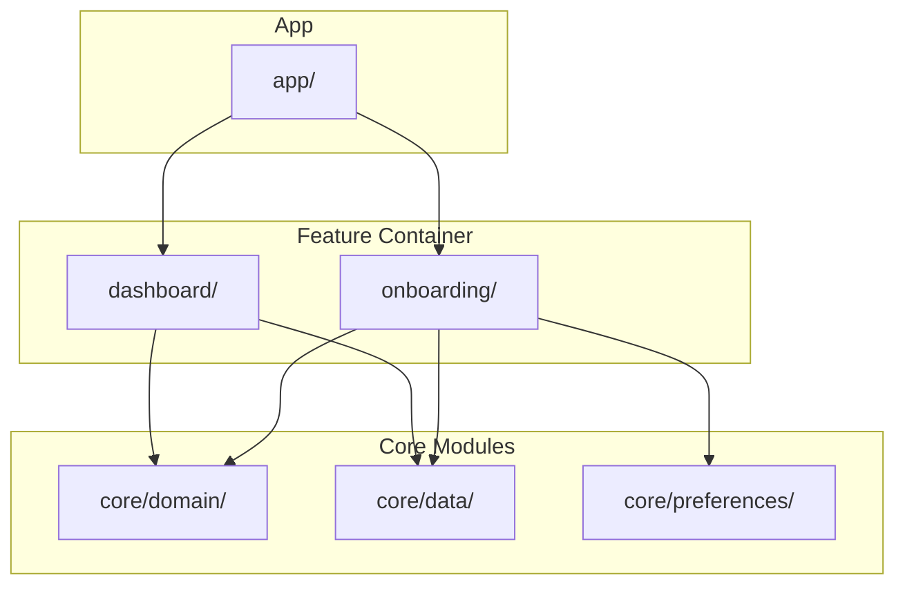
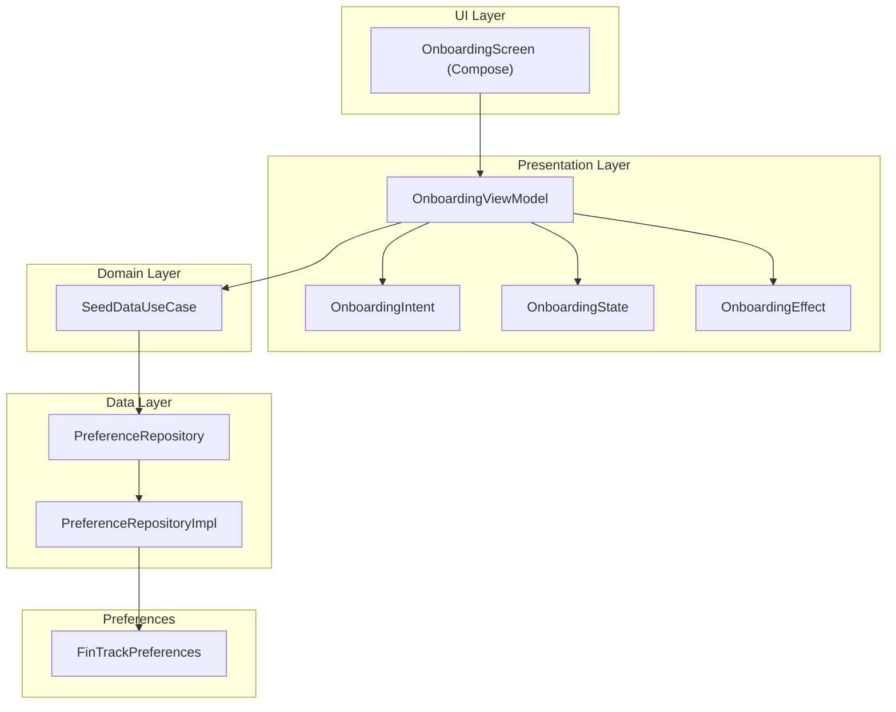
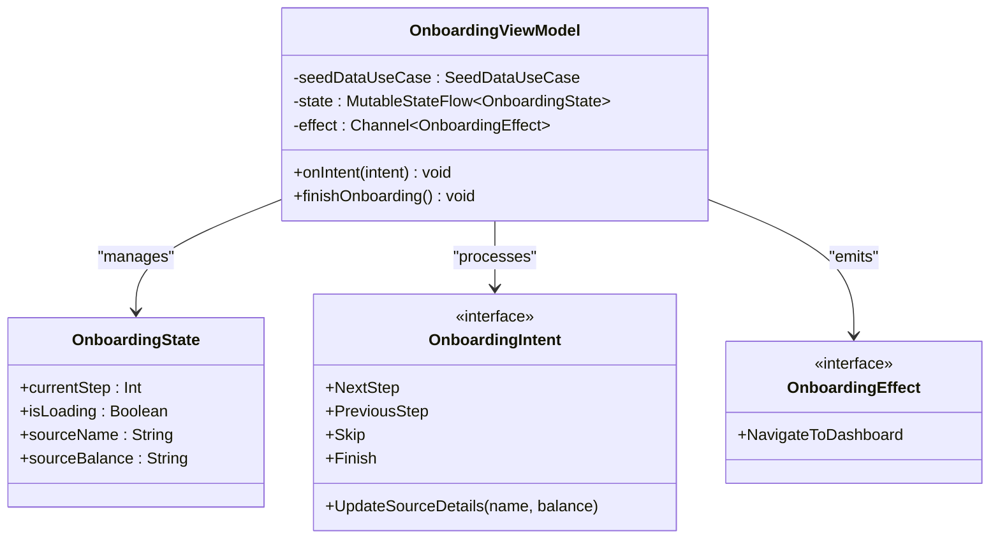
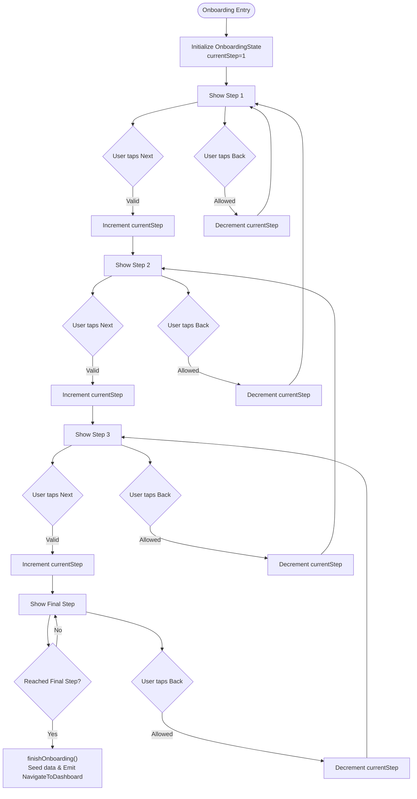
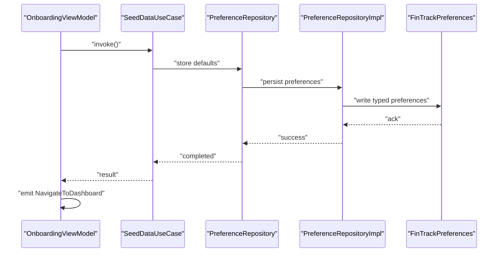
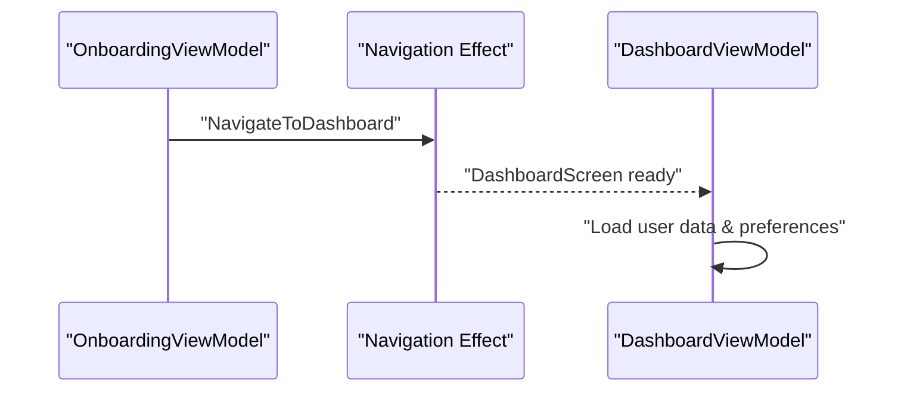
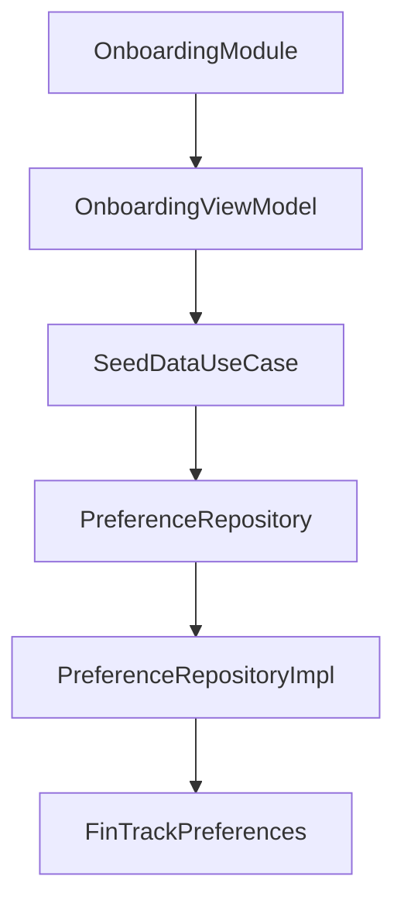

# Onboarding Feature

<cite>
**Referenced Files in This Document**
- [OnboardingViewModel.kt](file://feature-container/onboarding/src/commonMain/kotlin/com/kazemieh/onboarding/ui/OnboardingViewModel.kt)
- [OnboardingModule.kt](file://feature-container/onboarding/src/commonMain/kotlin/com/kazemieh/onboarding/di/OnboardingModule.kt)
- [PreferenceRepository.kt](file://core/domain/src/commonMain/kotlin/com/kazemieh/domain/repository/PreferenceRepository.kt)
- [PreferenceRepositoryImpl.kt](file://core/data/src/commonMain/kotlin/com/kazemieh/data/repository/PreferenceRepositoryImpl.kt)
- [PreferenceUseCases.kt](file://core/domain/src/commonMain/kotlin/com/kazemieh/domain/usecase/PreferenceUseCases.kt)
- [FinTrackPreferences.kt](file://core/preferences/src/commonMain/kotlin/com/kazemieh/preferences/FinTrackPreferences.kt)
- [DashboardViewModel.kt](file://feature-container/dashboard/src/commonMain/kotlin/com/kazemieh/dashboard/DashboardViewModel.kt)
- [MainActivity.kt](file://app/src/main/java/com/kazemieh/fintrack/MainActivity.kt)
</cite>

## Table of Contents
1. [Introduction](#introduction)
2. [Project Structure](#project-structure)
3. [Core Components](#core-components)
4. [Architecture Overview](#architecture-overview)
5. [Detailed Component Analysis](#detailed-component-analysis)
6. [Dependency Analysis](#dependency-analysis)
7. [Performance Considerations](#performance-considerations)
8. [Troubleshooting Guide](#troubleshooting-guide)
9. [Conclusion](#conclusion)

## Introduction
This document describes the Onboarding feature module in FinTrack, focusing on the user onboarding flow, MVVM architecture, and integration with preference repositories. It explains the onboarding progression logic, state management, and how the feature prepares the application for normal operation by seeding initial data and tracking completion.

## Project Structure
The Onboarding feature resides in the feature-container module under the onboarding package. The module follows a clean architecture pattern with a dedicated DI module and UI layer containing the ViewModel and state definitions.

**Diagram sources**
- [OnboardingViewModel.kt](file://feature-container/onboarding/src/commonMain/kotlin/com/kazemieh/onboarding/ui/OnboardingViewModel.kt)
- [OnboardingModule.kt](file://feature-container/onboarding/src/commonMain/kotlin/com/kazemieh/onboarding/di/OnboardingModule.kt)

**Section sources**
- [OnboardingViewModel.kt](file://feature-container/onboarding/src/commonMain/kotlin/com/kazemieh/onboarding/ui/OnboardingViewModel.kt)
- [OnboardingModule.kt](file://feature-container/onboarding/src/commonMain/kotlin/com/kazemieh/onboarding/di/OnboardingModule.kt)

## Core Components
- OnboardingViewModel: Manages onboarding state, intents, and effects. Handles navigation to the dashboard upon completion and seeds initial data via use cases.
- OnboardingState: Holds current step, loading state, and source details collected during onboarding.
- OnboardingIntent: Encapsulates user actions such as navigating forward/backward, updating source details, and finishing onboarding.
- OnboardingEffect: Emits side effects like navigation commands.
- Onboarding DI Module: Registers the ViewModel with dependency injection.

Key responsibilities:
- Progression logic: Validates step boundaries and triggers completion when reaching the final step.
- Data collection: Updates source name and balance captured from user input.
- Completion handling: Seeds default data and navigates to the dashboard.

**Section sources**
- [OnboardingViewModel.kt](file://feature-container/onboarding/src/commonMain/kotlin/com/kazemieh/onboarding/ui/OnboardingViewModel.kt)

## Architecture Overview
The Onboarding feature adheres to MVVM:
- View (Compose): Renders onboarding steps and reacts to state changes.
- ViewModel: Owns state, processes intents, and emits effects.
- Domain/Data: Provides use cases and repositories for data operations.
- Preferences: Integrates with preference repositories to persist onboarding completion and settings.

**Diagram sources**
- [OnboardingViewModel.kt](file://feature-container/onboarding/src/commonMain/kotlin/com/kazemieh/onboarding/ui/OnboardingViewModel.kt)
- [PreferenceRepository.kt](file://core/domain/src/commonMain/kotlin/com/kazemieh/domain/repository/PreferenceRepository.kt)
- [PreferenceRepositoryImpl.kt](file://core/data/src/commonMain/kotlin/com/kazemieh/data/repository/PreferenceRepositoryImpl.kt)
- [FinTrackPreferences.kt](file://core/preferences/src/commonMain/kotlin/com/kazemieh/preferences/FinTrackPreferences.kt)

## Detailed Component Analysis

### OnboardingViewModel Analysis
The ViewModel encapsulates onboarding logic:
- State management: Uses a StateFlow for immutable state updates and a Channel for effects.
- Intent handling: Processes navigation and data update intents while enforcing step boundaries.
- Completion flow: Seeding default data and emitting a navigation effect to the dashboard.

**Diagram sources**
- [OnboardingViewModel.kt](file://feature-container/onboarding/src/commonMain/kotlin/com/kazemieh/onboarding/ui/OnboardingViewModel.kt)

**Section sources**
- [OnboardingViewModel.kt](file://feature-container/onboarding/src/commonMain/kotlin/com/kazemieh/onboarding/ui/OnboardingViewModel.kt)

### Onboarding Progression Logic
The progression logic ensures safe navigation between steps and completion handling:
- NextStep: Increments step if within bounds; otherwise finishes onboarding.
- PreviousStep: Decrements step if greater than the minimum.
- UpdateSourceDetails: Updates collected source details.
- Finish: Triggers completion flow.

**Diagram sources**
- [OnboardingViewModel.kt](file://feature-container/onboarding/src/commonMain/kotlin/com/kazemieh/onboarding/ui/OnboardingViewModel.kt)

**Section sources**
- [OnboardingViewModel.kt](file://feature-container/onboarding/src/commonMain/kotlin/com/kazemieh/onboarding/ui/OnboardingViewModel.kt)

### Integration with Preference Repositories
The onboarding completion integrates with preference repositories to persist settings and completion status. The preference layer provides:
- PreferenceRepository and PreferenceRepositoryImpl for data persistence.
- FinTrackPreferences for typed preference access.
- PreferenceUseCases for higher-level operations.

**Diagram sources**
- [OnboardingViewModel.kt](file://feature-container/onboarding/src/commonMain/kotlin/com/kazemieh/onboarding/ui/OnboardingViewModel.kt)
- [PreferenceRepository.kt](file://core/domain/src/commonMain/kotlin/com/kazemieh/domain/repository/PreferenceRepository.kt)
- [PreferenceRepositoryImpl.kt](file://core/data/src/commonMain/kotlin/com/kazemieh/data/repository/PreferenceRepositoryImpl.kt)
- [FinTrackPreferences.kt](file://core/preferences/src/commonMain/kotlin/com/kazemieh/preferences/FinTrackPreferences.kt)

**Section sources**
- [PreferenceRepository.kt](file://core/domain/src/commonMain/kotlin/com/kazemieh/domain/repository/PreferenceRepository.kt)
- [PreferenceRepositoryImpl.kt](file://core/data/src/commonMain/kotlin/com/kazemieh/data/repository/PreferenceRepositoryImpl.kt)
- [FinTrackPreferences.kt](file://core/preferences/src/commonMain/kotlin/com/kazemieh/preferences/FinTrackPreferences.kt)

### Navigation to Dashboard
Upon completion, the ViewModel emits a navigation effect to move to the dashboard. The dashboard module provides its own ViewModel for subsequent operations.

**Diagram sources**
- [OnboardingViewModel.kt](file://feature-container/onboarding/src/commonMain/kotlin/com/kazemieh/onboarding/ui/OnboardingViewModel.kt)
- [DashboardViewModel.kt](file://feature-container/dashboard/src/commonMain/kotlin/com/kazemieh/dashboard/DashboardViewModel.kt)

**Section sources**
- [OnboardingViewModel.kt](file://feature-container/onboarding/src/commonMain/kotlin/com/kazemieh/onboarding/ui/OnboardingViewModel.kt)
- [DashboardViewModel.kt](file://feature-container/dashboard/src/commonMain/kotlin/com/kazemieh/dashboard/DashboardViewModel.kt)

## Dependency Analysis
The Onboarding feature depends on domain use cases and data repositories, which in turn depend on the preference layer. The DI module registers the ViewModel for dependency injection.

**Diagram sources**
- [OnboardingModule.kt](file://feature-container/onboarding/src/commonMain/kotlin/com/kazemieh/onboarding/di/OnboardingModule.kt)
- [OnboardingViewModel.kt](file://feature-container/onboarding/src/commonMain/kotlin/com/kazemieh/onboarding/ui/OnboardingViewModel.kt)
- [PreferenceRepository.kt](file://core/domain/src/commonMain/kotlin/com/kazemieh/domain/repository/PreferenceRepository.kt)
- [PreferenceRepositoryImpl.kt](file://core/data/src/commonMain/kotlin/com/kazemieh/data/repository/PreferenceRepositoryImpl.kt)
- [FinTrackPreferences.kt](file://core/preferences/src/commonMain/kotlin/com/kazemieh/preferences/FinTrackPreferences.kt)

**Section sources**
- [OnboardingModule.kt](file://feature-container/onboarding/src/commonMain/kotlin/com/kazemieh/onboarding/di/OnboardingModule.kt)
- [OnboardingViewModel.kt](file://feature-container/onboarding/src/commonMain/kotlin/com/kazemieh/onboarding/ui/OnboardingViewModel.kt)

## Performance Considerations
- State immutability: Using StateFlow prevents unnecessary recompositions and ensures predictable UI updates.
- Effect channel: Separating side effects reduces ViewModel complexity and improves testability.
- Minimal work on main thread: Use cases and repositories handle persistence off the main thread.
- Navigation efficiency: Emitting a single navigation effect avoids redundant navigation calls.

## Troubleshooting Guide
Common issues and resolutions:
- Steps not advancing: Verify step boundary checks and ensure intent dispatching occurs on UI events.
- Data not persisting: Confirm use case invocation and repository write operations succeed.
- Navigation not triggered: Ensure the effect is observed and handled by the navigation layer.
- Preference conflicts: Validate preference keys and types in FinTrackPreferences.

**Section sources**
- [OnboardingViewModel.kt](file://feature-container/onboarding/src/commonMain/kotlin/com/kazemieh/onboarding/ui/OnboardingViewModel.kt)
- [PreferenceRepositoryImpl.kt](file://core/data/src/commonMain/kotlin/com/kazemieh/data/repository/PreferenceRepositoryImpl.kt)

## Conclusion
The Onboarding feature implements a robust MVVM architecture with clear separation of concerns. It manages user progression, collects essential setup data, seeds default content, and integrates with preference repositories for persistence. The design supports future enhancements such as notifications setup and security configuration by extending the existing use case and repository layers.