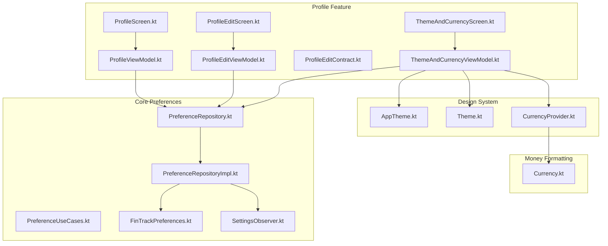
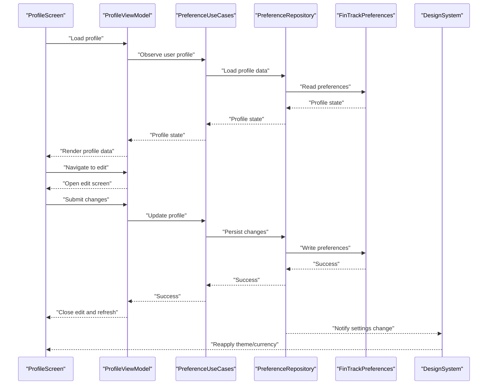
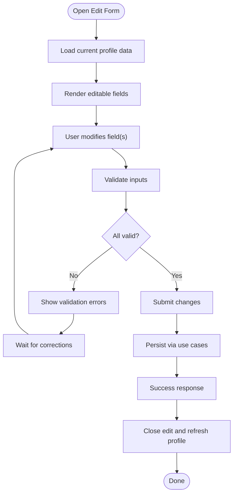
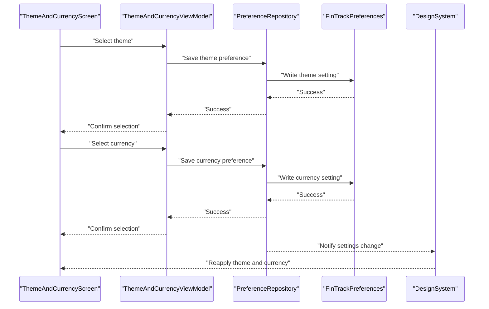
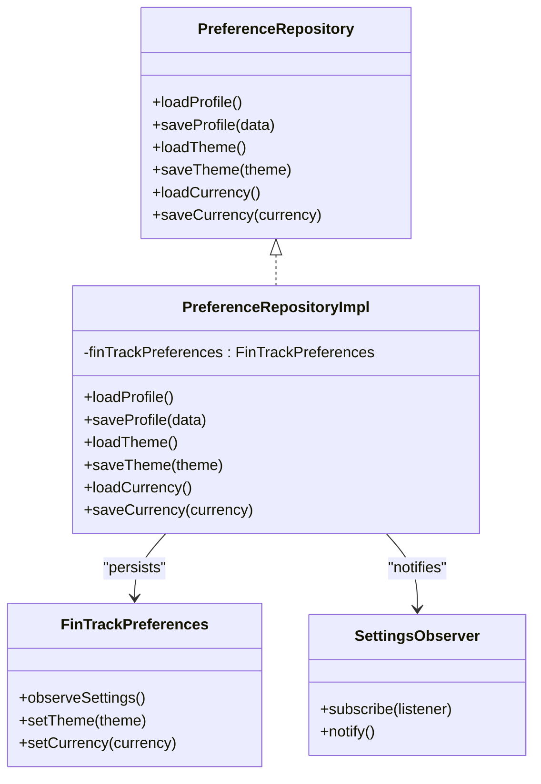
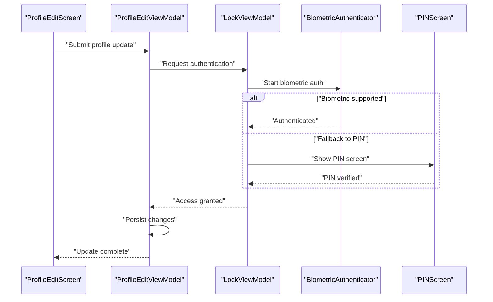
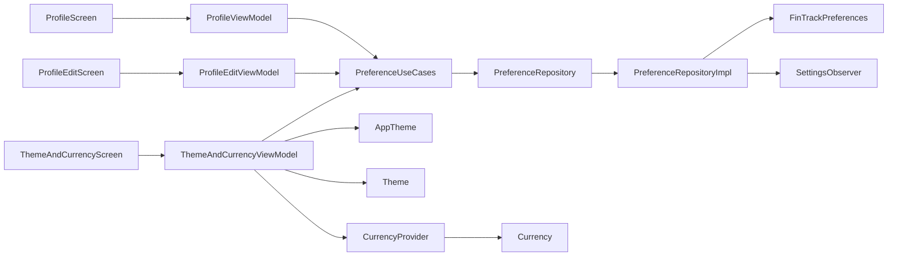

# Profile Feature

<cite>
**Referenced Files in This Document**
- [ProfileScreen.kt](file://feature-container/profile/src/commonMain/kotlin/com/kazemieh/profile/ProfileScreen.kt)
- [ProfileViewModel.kt](file://feature-container/profile/src/commonMain/kotlin/com/kazemieh/profile/ProfileViewModel.kt)
- [ProfileEditScreen.kt](file://feature-container/profile/src/commonMain/kotlin/com/kazemieh/profile/ProfileEditScreen.kt)
- [ProfileEditViewModel.kt](file://feature-container/profile/src/commonMain/kotlin/com/kazemieh/profile/ProfileEditViewModel.kt)
- [ProfileEditContract.kt](file://feature-container/profile/src/commonMain/kotlin/com/kazemieh/profile/ProfileEditContract.kt)
- [ThemeAndCurrencyScreen.kt](file://feature-container/profile/src/commonMain/kotlin/com/kazemieh/profile/ThemeAndCurrencyScreen.kt)
- [ThemeAndCurrencyViewModel.kt](file://feature-container/profile/src/commonMain/kotlin/com/kazemieh/profile/ThemeAndCurrencyViewModel.kt)
- [PreferenceRepository.kt](file://core/domain/src/commonMain/kotlin/com/kazemieh/domain/repository/PreferenceRepository.kt)
- [PreferenceRepositoryImpl.kt](file://core/data/src/commonMain/kotlin/com/kazemieh/data/repository/PreferenceRepositoryImpl.kt)
- [PreferenceUseCases.kt](file://core/domain/src/commonMain/kotlin/com/kazemieh/domain/usecase/PreferenceUseCases.kt)
- [FinTrackPreferences.kt](file://core/preferences/src/commonMain/kotlin/com/kazemieh/preferences/FinTrackPreferences.kt)
- [SettingsObserver.kt](file://core/preferences/src/commonMain/kotlin/com/kazemieh/preferences/SettingsObserver.kt)
- [AppTheme.kt](file://core/designsystem/src/commonMain/kotlin/com/kazemieh/designsystem/AppTheme.kt)
- [Theme.kt](file://core/designsystem/src/commonMain/kotlin/com/kazemieh/designsystem/Theme.kt)
- [CurrencyProvider.kt](file://core/designsystem/src/commonMain/kotlin/com/kazemieh/designsystem/CurrencyProvider.kt)
- [Currency.kt](file://core/money/src/commonMain/kotlin/com/kazemieh/money/Currency.kt)
- [LockViewModel.kt](file://feature-share/lock/src/commonMain/kotlin/com/kazemieh/lock/LockViewModel.kt)
- [LockContract.kt](file://feature-share/lock/src/commonMain/kotlin/com/kazemieh/lock/LockContract.kt)
- [BiometricAuthenticator.kt](file://feature-share/lock/src/commonMain/kotlin/com/kazemieh/lock/BiometricAuthenticator.kt)
- [PINScreen.kt](file://feature-share/lock/src/commonMain/kotlin/com/kazemieh/lock/PINScreen.kt)
</cite>

## Table of Contents
1. [Introduction](#introduction)
2. [Project Structure](#project-structure)
3. [Core Components](#core-components)
4. [Architecture Overview](#architecture-overview)
5. [Detailed Component Analysis](#detailed-component-analysis)
6. [Dependency Analysis](#dependency-analysis)
7. [Performance Considerations](#performance-considerations)
8. [Troubleshooting Guide](#troubleshooting-guide)
9. [Conclusion](#conclusion)

## Introduction
This document describes the Profile feature module responsible for user profile management, appearance customization, and application settings. It covers:
- Profile viewing and editing flows
- Theme selection and currency preferences
- MVVM implementation with dedicated view models
- Integration with preference repositories and settings observers
- Real-time UI updates and cross-platform settings synchronization
- Security integration with biometric authentication and PIN protection
- Impact of profile changes on other application components

## Project Structure
The Profile feature resides under feature-container/profile and integrates with core modules for preferences, design system, and money formatting. The module exposes screens and view models for:
- Profile viewing and editing
- Theme and currency customization
- Preference persistence and observation

**Diagram sources**
- [ProfileScreen.kt](file://feature-container/profile/src/commonMain/kotlin/com/kazemieh/profile/ProfileScreen.kt)
- [ProfileViewModel.kt](file://feature-container/profile/src/commonMain/kotlin/com/kazemieh/profile/ProfileViewModel.kt)
- [ProfileEditScreen.kt](file://feature-container/profile/src/commonMain/kotlin/com/kazemieh/profile/ProfileEditScreen.kt)
- [ProfileEditViewModel.kt](file://feature-container/profile/src/commonMain/kotlin/com/kazemieh/profile/ProfileEditViewModel.kt)
- [ProfileEditContract.kt](file://feature-container/profile/src/commonMain/kotlin/com/kazemieh/profile/ProfileEditContract.kt)
- [ThemeAndCurrencyScreen.kt](file://feature-container/profile/src/commonMain/kotlin/com/kazemieh/profile/ThemeAndCurrencyScreen.kt)
- [ThemeAndCurrencyViewModel.kt](file://feature-container/profile/src/commonMain/kotlin/com/kazemieh/profile/ThemeAndCurrencyViewModel.kt)
- [PreferenceRepository.kt](file://core/domain/src/commonMain/kotlin/com/kazemieh/domain/repository/PreferenceRepository.kt)
- [PreferenceRepositoryImpl.kt](file://core/data/src/commonMain/kotlin/com/kazemieh/data/repository/PreferenceRepositoryImpl.kt)
- [PreferenceUseCases.kt](file://core/domain/src/commonMain/kotlin/com/kazemieh/domain/usecase/PreferenceUseCases.kt)
- [FinTrackPreferences.kt](file://core/preferences/src/commonMain/kotlin/com/kazemieh/preferences/FinTrackPreferences.kt)
- [SettingsObserver.kt](file://core/preferences/src/commonMain/kotlin/com/kazemieh/preferences/SettingsObserver.kt)
- [AppTheme.kt](file://core/designsystem/src/commonMain/kotlin/com/kazemieh/designsystem/AppTheme.kt)
- [Theme.kt](file://core/designsystem/src/commonMain/kotlin/com/kazemieh/designsystem/Theme.kt)
- [CurrencyProvider.kt](file://core/designsystem/src/commonMain/kotlin/com/kazemieh/designsystem/CurrencyProvider.kt)
- [Currency.kt](file://core/money/src/commonMain/kotlin/com/kazemieh/money/Currency.kt)

**Section sources**
- [ProfileScreen.kt](file://feature-container/profile/src/commonMain/kotlin/com/kazemieh/profile/ProfileScreen.kt)
- [ProfileEditScreen.kt](file://feature-container/profile/src/commonMain/kotlin/com/kazemieh/profile/ProfileEditScreen.kt)
- [ThemeAndCurrencyScreen.kt](file://feature-container/profile/src/commonMain/kotlin/com/kazemieh/profile/ThemeAndCurrencyScreen.kt)

## Core Components
- ProfileScreen: Displays current user profile data and navigates to edit screen.
- ProfileViewModel: Manages profile state, loads user data, and triggers edits via use cases.
- ProfileEditScreen: Presents editable fields for profile data and handles validation.
- ProfileEditViewModel: Coordinates form state, validation, and persistence of profile changes.
- ThemeAndCurrencyScreen: Allows selecting theme and currency, updating global appearance and formatting.
- ThemeAndCurrencyViewModel: Handles theme/currency selection, persists preferences, and observes changes.

Key responsibilities:
- View models encapsulate UI logic and state management.
- Preference repositories persist and observe settings across platforms.
- Design system components apply theme and currency formatting globally.

**Section sources**
- [ProfileViewModel.kt](file://feature-container/profile/src/commonMain/kotlin/com/kazemieh/profile/ProfileViewModel.kt)
- [ProfileEditViewModel.kt](file://feature-container/profile/src/commonMain/kotlin/com/kazemieh/profile/ProfileEditViewModel.kt)
- [ThemeAndCurrencyViewModel.kt](file://feature-container/profile/src/commonMain/kotlin/com/kazemieh/profile/ThemeAndCurrencyViewModel.kt)

## Architecture Overview
The Profile feature follows MVVM with reactive preference updates:
- Screens observe state from view models.
- View models use use cases to interact with repositories.
- Repositories persist preferences and notify observers.
- Design system applies theme and currency formatting.

**Diagram sources**
- [ProfileScreen.kt](file://feature-container/profile/src/commonMain/kotlin/com/kazemieh/profile/ProfileScreen.kt)
- [ProfileViewModel.kt](file://feature-container/profile/src/commonMain/kotlin/com/kazemieh/profile/ProfileViewModel.kt)
- [PreferenceUseCases.kt](file://core/domain/src/commonMain/kotlin/com/kazemieh/domain/usecase/PreferenceUseCases.kt)
- [PreferenceRepository.kt](file://core/domain/src/commonMain/kotlin/com/kazemieh/domain/repository/PreferenceRepository.kt)
- [PreferenceRepositoryImpl.kt](file://core/data/src/commonMain/kotlin/com/kazemieh/data/repository/PreferenceRepositoryImpl.kt)
- [FinTrackPreferences.kt](file://core/preferences/src/commonMain/kotlin/com/kazemieh/preferences/FinTrackPreferences.kt)
- [AppTheme.kt](file://core/designsystem/src/commonMain/kotlin/com/kazemieh/designsystem/AppTheme.kt)
- [Theme.kt](file://core/designsystem/src/commonMain/kotlin/com/kazemieh/designsystem/Theme.kt)

## Detailed Component Analysis

### ProfileScreen and ProfileViewModel
- ProfileScreen renders user profile fields and provides navigation to the edit screen.
- ProfileViewModel loads profile data via use cases, manages loading and error states, and exposes commands to open the edit screen.

Implementation highlights:
- Reactive state rendering from view model.
- Navigation command pattern for edit flow.
- Integration with preference use cases for data loading.

**Section sources**
- [ProfileScreen.kt](file://feature-container/profile/src/commonMain/kotlin/com/kazemieh/profile/ProfileScreen.kt)
- [ProfileViewModel.kt](file://feature-container/profile/src/commonMain/kotlin/com/kazemieh/profile/ProfileViewModel.kt)

### ProfileEditScreen and ProfileEditViewModel
- ProfileEditScreen displays editable fields for profile data and validates inputs before submission.
- ProfileEditViewModel manages form state, validation rules, and persists changes through use cases.

Form handling patterns:
- Field-level validation with error messages surfaced to the UI.
- Submission guarded by validation checks.
- Use of contract types to define form intents and state transitions.

**Diagram sources**
- [ProfileEditScreen.kt](file://feature-container/profile/src/commonMain/kotlin/com/kazemieh/profile/ProfileEditScreen.kt)
- [ProfileEditViewModel.kt](file://feature-container/profile/src/commonMain/kotlin/com/kazemieh/profile/ProfileEditViewModel.kt)
- [ProfileEditContract.kt](file://feature-container/profile/src/commonMain/kotlin/com/kazemieh/profile/ProfileEditContract.kt)

**Section sources**
- [ProfileEditScreen.kt](file://feature-container/profile/src/commonMain/kotlin/com/kazemieh/profile/ProfileEditScreen.kt)
- [ProfileEditViewModel.kt](file://feature-container/profile/src/commonMain/kotlin/com/kazemieh/profile/ProfileEditViewModel.kt)
- [ProfileEditContract.kt](file://feature-container/profile/src/commonMain/kotlin/com/kazemieh/profile/ProfileEditContract.kt)

### ThemeAndCurrencyScreen and ThemeAndCurrencyViewModel
- ThemeAndCurrencyScreen allows users to select application theme and currency.
- ThemeAndCurrencyViewModel handles selection, persists preferences, and triggers global UI updates.

Theme and currency mechanisms:
- Theme selection updates global theme definitions.
- Currency selection configures currency provider for consistent formatting across the app.
- Changes propagate through settings observer to all screens.

**Diagram sources**
- [ThemeAndCurrencyScreen.kt](file://feature-container/profile/src/commonMain/kotlin/com/kazemieh/profile/ThemeAndCurrencyScreen.kt)
- [ThemeAndCurrencyViewModel.kt](file://feature-container/profile/src/commonMain/kotlin/com/kazemieh/profile/ThemeAndCurrencyViewModel.kt)
- [PreferenceRepository.kt](file://core/domain/src/commonMain/kotlin/com/kazemieh/domain/repository/PreferenceRepository.kt)
- [PreferenceRepositoryImpl.kt](file://core/data/src/commonMain/kotlin/com/kazemieh/data/repository/PreferenceRepositoryImpl.kt)
- [FinTrackPreferences.kt](file://core/preferences/src/commonMain/kotlin/com/kazemieh/preferences/FinTrackPreferences.kt)
- [AppTheme.kt](file://core/designsystem/src/commonMain/kotlin/com/kazemieh/designsystem/AppTheme.kt)
- [Theme.kt](file://core/designsystem/src/commonMain/kotlin/com/kazemieh/designsystem/Theme.kt)
- [CurrencyProvider.kt](file://core/designsystem/src/commonMain/kotlin/com/kazemieh/designsystem/CurrencyProvider.kt)

**Section sources**
- [ThemeAndCurrencyScreen.kt](file://feature-container/profile/src/commonMain/kotlin/com/kazemieh/profile/ThemeAndCurrencyScreen.kt)
- [ThemeAndCurrencyViewModel.kt](file://feature-container/profile/src/commonMain/kotlin/com/kazemieh/profile/ThemeAndCurrencyViewModel.kt)

### Preference Repositories and Settings Synchronization
- PreferenceRepository defines the abstraction for reading/writing preferences.
- PreferenceRepositoryImpl implements persistence using FinTrackPreferences and notifies observers.
- PreferenceUseCases orchestrate operations for profile and settings.
- SettingsObserver propagates changes to subscribers for real-time UI updates.

**Diagram sources**
- [PreferenceRepository.kt](file://core/domain/src/commonMain/kotlin/com/kazemieh/domain/repository/PreferenceRepository.kt)
- [PreferenceRepositoryImpl.kt](file://core/data/src/commonMain/kotlin/com/kazemieh/data/repository/PreferenceRepositoryImpl.kt)
- [FinTrackPreferences.kt](file://core/preferences/src/commonMain/kotlin/com/kazemieh/preferences/FinTrackPreferences.kt)
- [SettingsObserver.kt](file://core/preferences/src/commonMain/kotlin/com/kazemieh/preferences/SettingsObserver.kt)

**Section sources**
- [PreferenceRepository.kt](file://core/domain/src/commonMain/kotlin/com/kazemieh/domain/repository/PreferenceRepository.kt)
- [PreferenceRepositoryImpl.kt](file://core/data/src/commonMain/kotlin/com/kazemieh/data/repository/PreferenceRepositoryImpl.kt)
- [PreferenceUseCases.kt](file://core/domain/src/commonMain/kotlin/com/kazemieh/domain/usecase/PreferenceUseCases.kt)
- [FinTrackPreferences.kt](file://core/preferences/src/commonMain/kotlin/com/kazemieh/preferences/FinTrackPreferences.kt)
- [SettingsObserver.kt](file://core/preferences/src/commonMain/kotlin/com/kazemieh/preferences/SettingsObserver.kt)

### Security Integration: Biometric Authentication and PIN Protection
- Profile changes can trigger security gates managed by the lock feature.
- LockViewModel coordinates authentication flows and protects sensitive actions.
- BiometricAuthenticator and PINScreen provide platform-specific secure entry mechanisms.

Impact on profile changes:
- Editing sensitive profile data may require biometric verification or PIN entry.
- After successful authentication, changes are persisted and UI updates are applied.

**Diagram sources**
- [ProfileEditScreen.kt](file://feature-container/profile/src/commonMain/kotlin/com/kazemieh/profile/ProfileEditScreen.kt)
- [ProfileEditViewModel.kt](file://feature-container/profile/src/commonMain/kotlin/com/kazemieh/profile/ProfileEditViewModel.kt)
- [LockViewModel.kt](file://feature-share/lock/src/commonMain/kotlin/com/kazemieh/lock/LockViewModel.kt)
- [LockContract.kt](file://feature-share/lock/src/commonMain/kotlin/com/kazemieh/lock/LockContract.kt)
- [BiometricAuthenticator.kt](file://feature-share/lock/src/commonMain/kotlin/com/kazemieh/lock/BiometricAuthenticator.kt)
- [PINScreen.kt](file://feature-share/lock/src/commonMain/kotlin/com/kazemieh/lock/PINScreen.kt)

**Section sources**
- [LockViewModel.kt](file://feature-share/lock/src/commonMain/kotlin/com/kazemieh/lock/LockViewModel.kt)
- [LockContract.kt](file://feature-share/lock/src/commonMain/kotlin/com/kazemieh/lock/LockContract.kt)
- [BiometricAuthenticator.kt](file://feature-share/lock/src/commonMain/kotlin/com/kazemieh/lock/BiometricAuthenticator.kt)
- [PINScreen.kt](file://feature-share/lock/src/commonMain/kotlin/com/kazemieh/lock/PINScreen.kt)

## Dependency Analysis
- Profile screens depend on their respective view models for state and commands.
- View models depend on use cases and repositories for data operations.
- Repositories depend on FinTrackPreferences for persistence and SettingsObserver for notifications.
- ThemeAndCurrencyViewModel depends on design system components for applying theme and currency formatting.
- Money formatting depends on CurrencyProvider and Currency models.

**Diagram sources**
- [ProfileScreen.kt](file://feature-container/profile/src/commonMain/kotlin/com/kazemieh/profile/ProfileScreen.kt)
- [ProfileViewModel.kt](file://feature-container/profile/src/commonMain/kotlin/com/kazemieh/profile/ProfileViewModel.kt)
- [ProfileEditScreen.kt](file://feature-container/profile/src/commonMain/kotlin/com/kazemieh/profile/ProfileEditScreen.kt)
- [ProfileEditViewModel.kt](file://feature-container/profile/src/commonMain/kotlin/com/kazemieh/profile/ProfileEditViewModel.kt)
- [ThemeAndCurrencyScreen.kt](file://feature-container/profile/src/commonMain/kotlin/com/kazemieh/profile/ThemeAndCurrencyScreen.kt)
- [ThemeAndCurrencyViewModel.kt](file://feature-container/profile/src/commonMain/kotlin/com/kazemieh/profile/ThemeAndCurrencyViewModel.kt)
- [PreferenceUseCases.kt](file://core/domain/src/commonMain/kotlin/com/kazemieh/domain/usecase/PreferenceUseCases.kt)
- [PreferenceRepository.kt](file://core/domain/src/commonMain/kotlin/com/kazemieh/domain/repository/PreferenceRepository.kt)
- [PreferenceRepositoryImpl.kt](file://core/data/src/commonMain/kotlin/com/kazemieh/data/repository/PreferenceRepositoryImpl.kt)
- [FinTrackPreferences.kt](file://core/preferences/src/commonMain/kotlin/com/kazemieh/preferences/FinTrackPreferences.kt)
- [SettingsObserver.kt](file://core/preferences/src/commonMain/kotlin/com/kazemieh/preferences/SettingsObserver.kt)
- [AppTheme.kt](file://core/designsystem/src/commonMain/kotlin/com/kazemieh/designsystem/AppTheme.kt)
- [Theme.kt](file://core/designsystem/src/commonMain/kotlin/com/kazemieh/designsystem/Theme.kt)
- [CurrencyProvider.kt](file://core/designsystem/src/commonMain/kotlin/com/kazemieh/designsystem/CurrencyProvider.kt)
- [Currency.kt](file://core/money/src/commonMain/kotlin/com/kazemieh/money/Currency.kt)

**Section sources**
- [ProfileViewModel.kt](file://feature-container/profile/src/commonMain/kotlin/com/kazemieh/profile/ProfileViewModel.kt)
- [ProfileEditViewModel.kt](file://feature-container/profile/src/commonMain/kotlin/com/kazemieh/profile/ProfileEditViewModel.kt)
- [ThemeAndCurrencyViewModel.kt](file://feature-container/profile/src/commonMain/kotlin/com/kazemieh/profile/ThemeAndCurrencyViewModel.kt)

## Performance Considerations
- Prefer immutable state updates in view models to minimize recompositions.
- Debounce or batch preference writes to avoid excessive disk I/O.
- Use lazy composition for heavy lists in profile screens.
- Cache frequently accessed preferences in memory to reduce repository calls.
- Apply selective UI updates when settings change to avoid full re-rendering.

## Troubleshooting Guide
Common issues and resolutions:
- Profile not updating after edit:
  - Verify use case invocation and repository write success.
  - Ensure SettingsObserver notifies listeners and UI recomposes.
- Theme or currency not applied:
  - Confirm ThemeAndCurrencyViewModel writes preferences and design system components react.
  - Check FinTrackPreferences keys and value serialization.
- Authentication failures during profile edit:
  - Validate biometric availability and permissions.
  - Ensure LockViewModel handles fallback to PIN correctly.
- Validation errors not visible:
  - Confirm form state updates and error messages are propagated to UI.
  - Review ProfileEditContract intent/state transitions.

**Section sources**
- [ProfileEditViewModel.kt](file://feature-container/profile/src/commonMain/kotlin/com/kazemieh/profile/ProfileEditViewModel.kt)
- [ThemeAndCurrencyViewModel.kt](file://feature-container/profile/src/commonMain/kotlin/com/kazemieh/profile/ThemeAndCurrencyViewModel.kt)
- [SettingsObserver.kt](file://core/preferences/src/commonMain/kotlin/com/kazemieh/preferences/SettingsObserver.kt)
- [LockViewModel.kt](file://feature-share/lock/src/commonMain/kotlin/com/kazemieh/lock/LockViewModel.kt)

## Conclusion
The Profile feature module provides a cohesive, MVVM-based solution for managing user profiles, appearance, and application settings. Through preference repositories, settings observers, and design system integrations, it ensures consistent, real-time UI updates across platforms. Security integration with biometric authentication and PIN protection safeguards sensitive profile changes. The modular architecture supports maintainability, testability, and cross-platform compatibility.