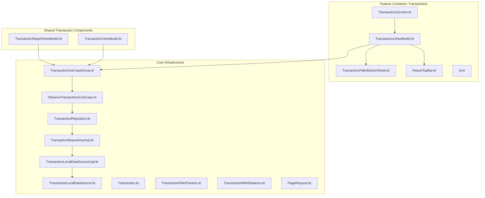
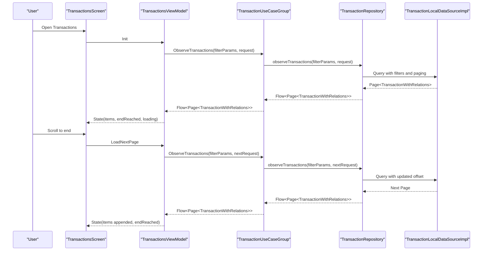
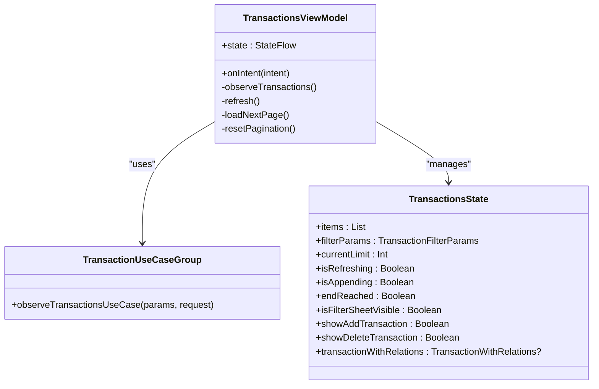
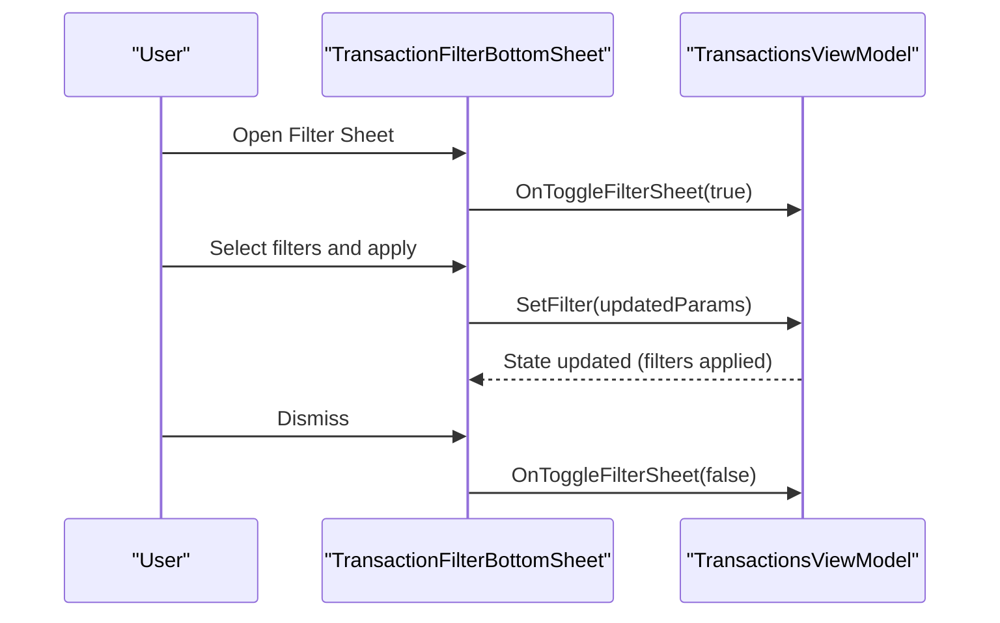
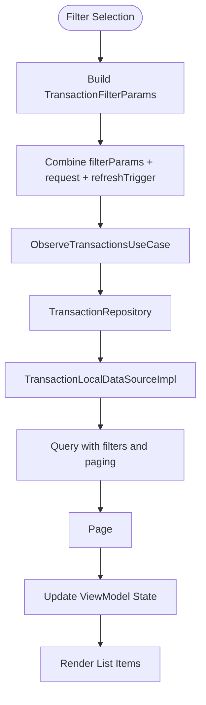
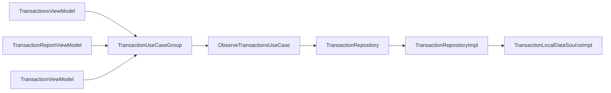
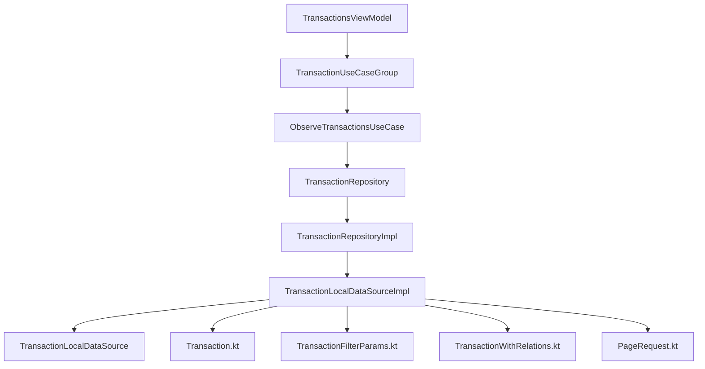

# Transactions Feature

<cite>
**Referenced Files in This Document**
- [TransactionsViewModel.kt](file://feature-container/transactions/src/commonMain/kotlin/feature-container/transactions/src/commonMain/kotlin/com/kazemieh/transactions/TransactionsViewModel.kt)
- [TransactionsScreen.kt](file://feature-container/transactions/src/commonMain/kotlin/feature-container/transactions/src/commonMain/kotlin/com/kazemieh/transactions/TransactionsScreen.kt)
- [TransactionFilterBottomSheet.kt](file://feature-container/transactions/src/commonMain/kotlin/feature-container/transactions/src/commonMain/kotlin/com/kazemieh/transactions/TransactionFilterBottomSheet.kt)
- [ReportTopBar.kt](file://feature-container/transactions/src/commonMain/kotlin/feature-container/transactions/src/commonMain/kotlin/com/kazemieh/transactions/ReportTopBar.kt)
- [di.kt](file://feature-container/transactions/src/commonMain/kotlin/feature-container/transactions/src/commonMain/kotlin/com/kazemieh/transactions/di/di.kt)
- [TransactionUseCaseGroup.kt](file://core/domain/src/commonMain/kotlin/com/kazemieh/domain/usecase/TransactionUseCaseGroup.kt)
- [ObserveTransactionsUseCase.kt](file://core/domain/src/commonMain/kotlin/com/kazemieh/domain/usecase/ObserveTransactionsUseCase.kt)
- [TransactionLocalDataSourceImpl.kt](file://core/database/src/commonMain/kotlin/com/kazemieh/database/datasource/TransactionLocalDataSourceImpl.kt)
- [Transaction.kt](file://core/common/src/commonMain/kotlin/com/kazemieh/common/model/Transaction.kt)
- [TransactionFilterParams.kt](file://core/common/src/commonMain/kotlin/com/kazemieh/common/model/TransactionFilterParams.kt)
- [TransactionWithRelations.kt](file://core/common/src/commonMain/kotlin/com/kazemieh/common/model/TransactionWithRelations.kt)
- [PageRequest.kt](file://core/common/src/commonMain/kotlin/com/kazemieh/common/model/PageRequest.kt)
- [TransactionRepository.kt](file://core/domain/src/commonMain/kotlin/com/kazemieh/domain/repository/TransactionRepository.kt)
- [TransactionRepositoryImpl.kt](file://core/data/src/commonMain/kotlin/com/kazemieh/data/repository/TransactionRepositoryImpl.kt)
- [TransactionLocalDataSource.kt](file://core/data-contract/src/commonMain/kotlin/com/kazemieh/data_contract/datasource/TransactionLocalDataSource.kt)
- [TransactionLocalDataSourceImpl.kt](file://core/database/src/commonMain/kotlin/com/kazemieh/database/datasource/TransactionLocalDataSourceImpl.kt)
- [TransactionReportViewModel.kt](file://feature-share/transaction/src/commonMain/kotlin/com/kazemieh/transaction/ui/report/TransactionReportViewModel.kt)
- [TransactionViewModel.kt](file://feature-share/transaction/src/commonMain/kotlin/com/kazemieh/transaction/ui/main/TransactionViewModel.kt)
</cite>

## Table of Contents
1. [Introduction](#introduction)
2. [Project Structure](#project-structure)
3. [Core Components](#core-components)
4. [Architecture Overview](#architecture-overview)
5. [Detailed Component Analysis](#detailed-component-analysis)
6. [Dependency Analysis](#dependency-analysis)
7. [Performance Considerations](#performance-considerations)
8. [Troubleshooting Guide](#troubleshooting-guide)
9. [Conclusion](#conclusion)

## Introduction
This document provides comprehensive technical documentation for the Transactions feature module in FinTrack. It explains transaction management functionality including listing, filtering, searching, and reporting capabilities. The document focuses on the MVVM implementation with TransactionsViewModel handling complex state management for filters, search queries, and pagination. It also documents the filter system architecture, bottom sheet patterns for modal interactions, and state preservation across navigation. Performance optimization strategies for large datasets, efficient list rendering, and real-time updates are addressed, along with the relationship to shared transaction components and integration with the broader FinTrack ecosystem.

## Project Structure
The Transactions feature is organized as a modular Compose Multiplatform module under feature-container/transactions. It includes presentation components (screen, view model, bottom sheet, top bar), DI configuration, and integration points with shared transaction components and core infrastructure.

**Diagram sources**
- [TransactionsScreen.kt](file://feature-container/transactions/src/commonMain/kotlin/feature-container/transactions/src/commonMain/kotlin/com/kazemieh/transactions/TransactionsScreen.kt)
- [TransactionsViewModel.kt](file://feature-container/transactions/src/commonMain/kotlin/feature-container/transactions/src/commonMain/kotlin/com/kazemieh/transactions/TransactionsViewModel.kt)
- [TransactionFilterBottomSheet.kt](file://feature-container/transactions/src/commonMain/kotlin/feature-container/transactions/src/commonMain/kotlin/com/kazemieh/transactions/TransactionFilterBottomSheet.kt)
- [ReportTopBar.kt](file://feature-container/transactions/src/commonMain/kotlin/feature-container/transactions/src/commonMain/kotlin/com/kazemieh/transactions/ReportTopBar.kt)
- [di.kt](file://feature-container/transactions/src/commonMain/kotlin/feature-container/transactions/src/commonMain/kotlin/com/kazemieh/transactions/di/di.kt)
- [TransactionUseCaseGroup.kt](file://core/domain/src/commonMain/kotlin/com/kazemieh/domain/usecase/TransactionUseCaseGroup.kt)
- [ObserveTransactionsUseCase.kt](file://core/domain/src/commonMain/kotlin/com/kazemieh/domain/usecase/ObserveTransactionsUseCase.kt)
- [TransactionRepository.kt](file://core/domain/src/commonMain/kotlin/com/kazemieh/domain/repository/TransactionRepository.kt)
- [TransactionRepositoryImpl.kt](file://core/data/src/commonMain/kotlin/com/kazemieh/data/repository/TransactionRepositoryImpl.kt)
- [TransactionLocalDataSource.kt](file://core/data-contract/src/commonMain/kotlin/com/kazemieh/data_contract/datasource/TransactionLocalDataSource.kt)
- [TransactionLocalDataSourceImpl.kt](file://core/database/src/commonMain/kotlin/com/kazemieh/database/datasource/TransactionLocalDataSourceImpl.kt)
- [TransactionReportViewModel.kt](file://feature-share/transaction/src/commonMain/kotlin/com/kazemieh/transaction/ui/report/TransactionReportViewModel.kt)
- [TransactionViewModel.kt](file://feature-share/transaction/src/commonMain/kotlin/com/kazemieh/transaction/ui/main/TransactionViewModel.kt)

**Section sources**
- [TransactionsScreen.kt](file://feature-container/transactions/src/commonMain/kotlin/feature-container/transactions/src/commonMain/kotlin/com/kazemieh/transactions/TransactionsScreen.kt)
- [TransactionsViewModel.kt](file://feature-container/transactions/src/commonMain/kotlin/feature-container/transactions/src/commonMain/kotlin/com/kazemieh/transactions/TransactionsViewModel.kt)
- [di.kt](file://feature-container/transactions/src/commonMain/kotlin/feature-container/transactions/src/commonMain/kotlin/com/kazemieh/transactions/di/di.kt)

## Core Components
- TransactionsScreen: Hosts the transaction list UI, bottom sheets for add/delete/modify, and filter bottom sheet integration. It renders transaction items and coordinates user interactions with the view model.
- TransactionsViewModel: Manages state for filters, search queries, pagination, and bottom sheet visibility. It orchestrates use cases for observing transactions and handles refresh/load-next-page intents.
- TransactionFilterBottomSheet: Modal UI for selecting filters (categories, sources, tags, persons, date range, amount range, type) and applying them via view model intents.
- ReportTopBar: Provides navigation actions and top-level controls for report-related views, integrating with the Transactions feature for unified navigation.
- DI Module: Registers TransactionsViewModel with Koin, injecting TransactionUseCaseGroup for use case orchestration.

Key responsibilities:
- State management: Maintains filter parameters, pagination state, loading indicators, and error messages.
- Real-time updates: Observes filtered transaction streams and updates UI reactively.
- Pagination: Implements incremental loading with PageRequest and end-of-list detection.
- Bottom sheet coordination: Controls visibility and passes filter selections to the view model.

**Section sources**
- [TransactionsScreen.kt](file://feature-container/transactions/src/commonMain/kotlin/feature-container/transactions/src/commonMain/kotlin/com/kazemieh/transactions/TransactionsScreen.kt)
- [TransactionsViewModel.kt](file://feature-container/transactions/src/commonMain/kotlin/feature-container/transactions/src/commonMain/kotlin/com/kazemieh/transactions/TransactionsViewModel.kt)
- [TransactionFilterBottomSheet.kt](file://feature-container/transactions/src/commonMain/kotlin/feature-container/transactions/src/commonMain/kotlin/com/kazemieh/transactions/TransactionFilterBottomSheet.kt)
- [ReportTopBar.kt](file://feature-container/transactions/src/commonMain/kotlin/feature-container/transactions/src/commonMain/kotlin/com/kazemieh/transactions/ReportTopBar.kt)
- [di.kt](file://feature-container/transactions/src/commonMain/kotlin/feature-container/transactions/src/commonMain/kotlin/com/kazemieh/transactions/di/di.kt)

## Architecture Overview
The Transactions feature follows MVVM with reactive streams. The view model observes filtered transaction pages from use cases, while the screen renders lists and modals. Filtering and pagination are coordinated through state flows and intents.

**Diagram sources**
- [TransactionsScreen.kt](file://feature-container/transactions/src/commonMain/kotlin/feature-container/transactions/src/commonMain/kotlin/com/kazemieh/transactions/TransactionsScreen.kt)
- [TransactionsViewModel.kt](file://feature-container/transactions/src/commonMain/kotlin/feature-container/transactions/src/commonMain/kotlin/com/kazemieh/transactions/TransactionsViewModel.kt)
- [TransactionUseCaseGroup.kt](file://core/domain/src/commonMain/kotlin/com/kazemieh/domain/usecase/TransactionUseCaseGroup.kt)
- [ObserveTransactionsUseCase.kt](file://core/domain/src/commonMain/kotlin/com/kazemieh/domain/usecase/ObserveTransactionsUseCase.kt)
- [TransactionRepository.kt](file://core/domain/src/commonMain/kotlin/com/kazemieh/domain/repository/TransactionRepository.kt)
- [TransactionLocalDataSourceImpl.kt](file://core/database/src/commonMain/kotlin/com/kazemieh/database/datasource/TransactionLocalDataSourceImpl.kt)

## Detailed Component Analysis

### TransactionsViewModel
Responsibilities:
- Holds filter parameters and pagination state.
- Emits intents for initialization, refresh, and loading more data.
- Observes filtered transaction pages and updates state.
- Coordinates bottom sheet visibility and transaction actions.

Implementation highlights:
- Uses PageRequest for pagination and combines filter flows with request flows to drive observation.
- Reactively resets pagination when filters change and handles errors during refresh/appending.
- Exposes state and effects to the UI for rendering and side effects.

**Diagram sources**
- [TransactionsViewModel.kt](file://feature-container/transactions/src/commonMain/kotlin/feature-container/transactions/src/commonMain/kotlin/com/kazemieh/transactions/TransactionsViewModel.kt)
- [TransactionUseCaseGroup.kt](file://core/domain/src/commonMain/kotlin/com/kazemieh/domain/usecase/TransactionUseCaseGroup.kt)

**Section sources**
- [TransactionsViewModel.kt](file://feature-container/transactions/src/commonMain/kotlin/feature-container/transactions/src/commonMain/kotlin/com/kazemieh/transactions/TransactionsViewModel.kt)

### TransactionFilterBottomSheet
Purpose:
- Presents filter options (type, date range, amount range, categories, sources, tags, persons) in a bottom sheet.
- Applies selected filters by emitting view model intents with updated TransactionFilterParams.

Integration:
- Receives current state and snackbar host state from the screen.
- Calls onIntent to update filters and triggers state changes in the view model.

**Diagram sources**
- [TransactionFilterBottomSheet.kt](file://feature-container/transactions/src/commonMain/kotlin/feature-container/transactions/src/commonMain/kotlin/com/kazemieh/transactions/TransactionFilterBottomSheet.kt)
- [TransactionsViewModel.kt](file://feature-container/transactions/src/commonMain/kotlin/feature-container/transactions/src/commonMain/kotlin/com/kazemieh/transactions/TransactionsViewModel.kt)

**Section sources**
- [TransactionFilterBottomSheet.kt](file://feature-container/transactions/src/commonMain/kotlin/feature-container/transactions/src/commonMain/kotlin/com/kazemieh/transactions/TransactionFilterBottomSheet.kt)

### ReportTopBar
Purpose:
- Provides navigation actions and top-level controls for report-related screens.
- Integrates with the Transactions feature for unified navigation and actions.

Integration:
- Coordinates with TransactionsScreen for navigation and action dispatch.

**Section sources**
- [ReportTopBar.kt](file://feature-container/transactions/src/commonMain/kotlin/feature-container/transactions/src/commonMain/kotlin/com/kazemieh/transactions/ReportTopBar.kt)

### TransactionsScreen
Responsibilities:
- Renders the transaction list and bottom sheets.
- Manages bottom sheet visibility and delegates filter application to the view model.
- Handles add/delete transaction bottom sheets and filter sheet.

UI orchestration:
- Displays transaction items and reacts to view model state changes.
- Triggers intents for adding, deleting, and toggling filters.

**Section sources**
- [TransactionsScreen.kt](file://feature-container/transactions/src/commonMain/kotlin/feature-container/transactions/src/commonMain/kotlin/com/kazemieh/transactions/TransactionsScreen.kt)

### Filter System Architecture
The filter system is built around TransactionFilterParams and integrates with the database layer for efficient querying.

**Diagram sources**
- [TransactionFilterParams.kt](file://core/common/src/commonMain/kotlin/com/kazemieh/common/model/TransactionFilterParams.kt)
- [ObserveTransactionsUseCase.kt](file://core/domain/src/commonMain/kotlin/com/kazemieh/domain/usecase/ObserveTransactionsUseCase.kt)
- [TransactionRepository.kt](file://core/domain/src/commonMain/kotlin/com/kazemieh/domain/repository/TransactionRepository.kt)
- [TransactionLocalDataSourceImpl.kt](file://core/database/src/commonMain/kotlin/com/kazemieh/database/datasource/TransactionLocalDataSourceImpl.kt)

**Section sources**
- [TransactionFilterParams.kt](file://core/common/src/commonMain/kotlin/com/kazemieh/common/model/TransactionFilterParams.kt)
- [ObserveTransactionsUseCase.kt](file://core/domain/src/commonMain/kotlin/com/kazemieh/domain/usecase/ObserveTransactionsUseCase.kt)
- [TransactionLocalDataSourceImpl.kt](file://core/database/src/commonMain/kotlin/com/kazemieh/database/datasource/TransactionLocalDataSourceImpl.kt)

### Integration with Shared Transaction Components
The Transactions feature integrates with shared transaction components for reporting and main transaction views.

**Diagram sources**
- [TransactionsViewModel.kt](file://feature-container/transactions/src/commonMain/kotlin/feature-container/transactions/src/commonMain/kotlin/com/kazemieh/transactions/TransactionsViewModel.kt)
- [TransactionUseCaseGroup.kt](file://core/domain/src/commonMain/kotlin/com/kazemieh/domain/usecase/TransactionUseCaseGroup.kt)
- [ObserveTransactionsUseCase.kt](file://core/domain/src/commonMain/kotlin/com/kazemieh/domain/usecase/ObserveTransactionsUseCase.kt)
- [TransactionRepository.kt](file://core/domain/src/commonMain/kotlin/com/kazemieh/domain/repository/TransactionRepository.kt)
- [TransactionRepositoryImpl.kt](file://core/data/src/commonMain/kotlin/com/kazemieh/data/repository/TransactionRepositoryImpl.kt)
- [TransactionLocalDataSourceImpl.kt](file://core/database/src/commonMain/kotlin/com/kazemieh/database/datasource/TransactionLocalDataSourceImpl.kt)
- [TransactionReportViewModel.kt](file://feature-share/transaction/src/commonMain/kotlin/com/kazemieh/transaction/ui/report/TransactionReportViewModel.kt)
- [TransactionViewModel.kt](file://feature-share/transaction/src/commonMain/kotlin/com/kazemieh/transaction/ui/main/TransactionViewModel.kt)

**Section sources**
- [TransactionReportViewModel.kt](file://feature-share/transaction/src/commonMain/kotlin/com/kazemieh/transaction/ui/report/TransactionReportViewModel.kt)
- [TransactionViewModel.kt](file://feature-share/transaction/src/commonMain/kotlin/com/kazemieh/transaction/ui/main/TransactionViewModel.kt)

## Dependency Analysis
The Transactions feature depends on core domain and data layers for transaction observation and persistence. The view model depends on TransactionUseCaseGroup, which encapsulates use cases for transaction operations. The repository pattern abstracts data sources, enabling local SQLDelight-based querying with pagination and filtering.

**Diagram sources**
- [TransactionsViewModel.kt](file://feature-container/transactions/src/commonMain/kotlin/feature-container/transactions/src/commonMain/kotlin/com/kazemieh/transactions/TransactionsViewModel.kt)
- [TransactionUseCaseGroup.kt](file://core/domain/src/commonMain/kotlin/com/kazemieh/domain/usecase/TransactionUseCaseGroup.kt)
- [ObserveTransactionsUseCase.kt](file://core/domain/src/commonMain/kotlin/com/kazemieh/domain/usecase/ObserveTransactionsUseCase.kt)
- [TransactionRepository.kt](file://core/domain/src/commonMain/kotlin/com/kazemieh/domain/repository/TransactionRepository.kt)
- [TransactionRepositoryImpl.kt](file://core/data/src/commonMain/kotlin/com/kazemieh/data/repository/TransactionRepositoryImpl.kt)
- [TransactionLocalDataSource.kt](file://core/data-contract/src/commonMain/kotlin/com/kazemieh/data_contract/datasource/TransactionLocalDataSource.kt)
- [TransactionLocalDataSourceImpl.kt](file://core/database/src/commonMain/kotlin/com/kazemieh/database/datasource/TransactionLocalDataSourceImpl.kt)
- [Transaction.kt](file://core/common/src/commonMain/kotlin/com/kazemieh/common/model/Transaction.kt)
- [TransactionFilterParams.kt](file://core/common/src/commonMain/kotlin/com/kazemieh/common/model/TransactionFilterParams.kt)
- [TransactionWithRelations.kt](file://core/common/src/commonMain/kotlin/com/kazemieh/common/model/TransactionWithRelations.kt)
- [PageRequest.kt](file://core/common/src/commonMain/kotlin/com/kazemieh/common/model/PageRequest.kt)

**Section sources**
- [TransactionsViewModel.kt](file://feature-container/transactions/src/commonMain/kotlin/feature-container/transactions/src/commonMain/kotlin/com/kazemieh/transactions/TransactionsViewModel.kt)
- [TransactionUseCaseGroup.kt](file://core/domain/src/commonMain/kotlin/com/kazemieh/domain/usecase/TransactionUseCaseGroup.kt)
- [TransactionRepositoryImpl.kt](file://core/data/src/commonMain/kotlin/com/kazemieh/data/repository/TransactionRepositoryImpl.kt)
- [TransactionLocalDataSourceImpl.kt](file://core/database/src/commonMain/kotlin/com/kazemieh/database/datasource/TransactionLocalDataSourceImpl.kt)

## Performance Considerations
- Efficient list rendering: Use lazy column with stable keys and minimal recomposition. Render only visible items and avoid heavy recompositions on scroll.
- Pagination: Implement incremental loading with PageRequest and detect end-of-list to prevent unnecessary queries.
- Reactive observation: Combine filter flows with request flows to minimize redundant observations and optimize stream switching.
- Error handling: Surface errors gracefully and avoid blocking UI updates; support retry mechanisms for refresh and append operations.
- State preservation: Persist filter parameters and pagination state across configuration changes and navigation to maintain user context.
- Real-time updates: Leverage flow-based observation to reflect database changes instantly without manual polling.

## Troubleshooting Guide
Common issues and resolutions:
- Filters not applying: Verify that filter intents update TransactionFilterParams and trigger reset of pagination and refresh.
- Empty lists after filtering: Confirm that PageRequest offset is reset when filters change and that the database query includes the new filters.
- Pagination stalls: Ensure endReached flag is set when items count is less than limit and that loadNextPage increments offset correctly.
- Bottom sheet state: Validate that onDismiss intents toggle visibility and that snackbar host state is passed through to bottom sheets for feedback.
- Error propagation: Check that catch blocks in observation update isRefreshing/isAppending flags and store error messages for UI display.

**Section sources**
- [TransactionsViewModel.kt](file://feature-container/transactions/src/commonMain/kotlin/feature-container/transactions/src/commonMain/kotlin/com/kazemieh/transactions/TransactionsViewModel.kt)
- [TransactionsScreen.kt](file://feature-container/transactions/src/commonMain/kotlin/feature-container/transactions/src/commonMain/kotlin/com/kazemieh/transactions/TransactionsScreen.kt)

## Conclusion
The Transactions feature module provides a robust, MVVM-based solution for managing transactions with powerful filtering, pagination, and real-time updates. Its integration with shared transaction components and core infrastructure ensures scalability and consistency across the FinTrack ecosystem. The modular design, reactive streams, and bottom sheet patterns deliver a responsive and user-friendly experience for transaction listing, filtering, searching, and reporting.