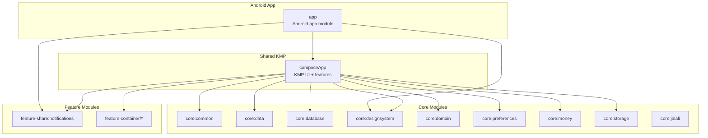
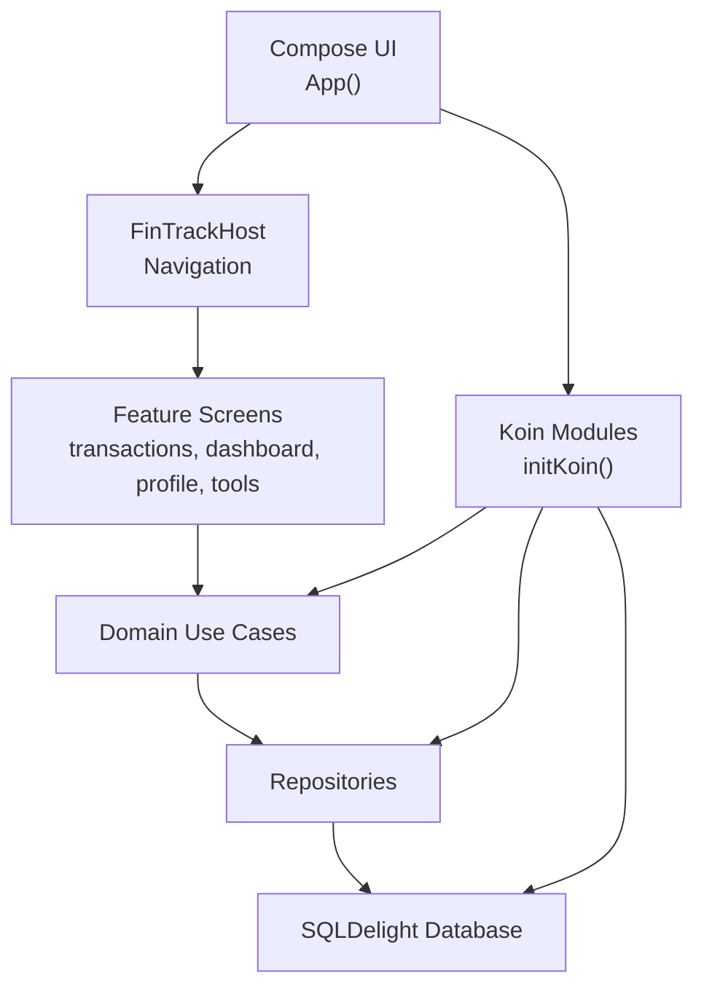
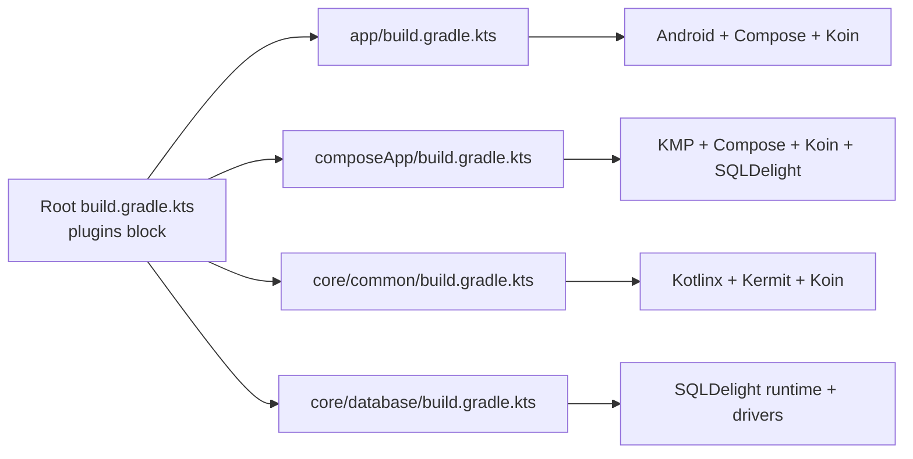

# Getting Started

<cite>
**Referenced Files in This Document**
- [README.md](file://README.md)
- [settings.gradle.kts](file://settings.gradle.kts)
- [build.gradle.kts](file://build.gradle.kts)
- [gradle.properties](file://gradle.properties)
- [gradle/libs.versions.toml](file://gradle/libs.versions.toml)
- [gradlew.bat](file://gradlew.bat)
- [app/build.gradle.kts](file://app/build.gradle.kts)
- [composeApp/build.gradle.kts](file://composeApp/build.gradle.kts)
- [core/common/build.gradle.kts](file://core/common/build.gradle.kts)
- [core/database/build.gradle.kts](file://core/database/build.gradle.kts)
- [app/src/main/java/com/kazemieh/fintrack/FinTrackApplication.kt](file://app/src/main/java/com/kazemieh/fintrack/FinTrackApplication.kt)
- [app/src/main/java/com/kazemieh/fintrack/MainActivity.kt](file://app/src/main/java/com/kazemieh/fintrack/MainActivity.kt)
- [composeApp/src/commonMain/kotlin/com/kazemieh/composeApp/App.kt](file://composeApp/src/commonMain/kotlin/com/kazemieh/composeApp/App.kt)
- [composeApp/src/jvmMain/kotlin/com/kazemieh/fintrack/Main.kt](file://composeApp/src/jvmMain/kotlin/com/kazemieh/fintrack/Main.kt)
</cite>

## Table of Contents
1. [Introduction](#introduction)
2. [Project Structure](#project-structure)
3. [Core Components](#core-components)
4. [Architecture Overview](#architecture-overview)
5. [Detailed Component Analysis](#detailed-component-analysis)
6. [Dependency Analysis](#dependency-analysis)
7. [Performance Considerations](#performance-considerations)
8. [Troubleshooting Guide](#troubleshooting-guide)
9. [Conclusion](#conclusion)
10. [Appendices](#appendices)

## Introduction
FinTrack is a modern personal finance management application built with Kotlin Multiplatform and Jetpack Compose. It supports Android, iOS, Desktop (JVM), and Web targets, and follows Clean Architecture with MVI-style state management. This guide walks you through setting up the development environment, building the project, running on different platforms, and contributing to the project.

## Project Structure
The repository is a Gradle multi-module project with:
- app: Android application module integrating Compose Multiplatform assets
- composeApp: Shared KMP module containing UI, navigation, and feature modules
- core: Shared modules (common, data, database, designsystem, domain, preferences, money, storage, jalali)
- feature-share: Feature modules for transactions, categories, sources, tags, persons, search, lock, notifications, budgets
- feature-container: Container screens (transactions, onboarding, dashboard, profile, tools)

**Diagram sources**
- [settings.gradle.kts:42-69](file://settings.gradle.kts#L42-L69)
- [app/build.gradle.kts:50-62](file://app/build.gradle.kts#L50-L62)
- [composeApp/build.gradle.kts:55-115](file://composeApp/build.gradle.kts#L55-L115)

**Section sources**
- [README.md:21-27](file://README.md#L21-L27)
- [settings.gradle.kts:41-69](file://settings.gradle.kts#L41-L69)

## Core Components
- Android app entry point initializes DI and starts the Compose UI.
- Compose UI initializes Koin modules and sets up theme/currency preferences.
- Database initializer runs on app start to prepare SQLDelight schema.
- Platform-specific entry points:
  - Android: Activity hosting Compose UI
  - Desktop: Compose for Desktop application
  - Web: Browser bundle via Compose Multiplatform JS

Key entry points and initialization:
- Android Application class initializes Koin and notification channels.
- Android Activity sets Compose content to the App composable.
- Compose App initializes Koin modules and database, then renders the host UI.
- Desktop Main creates a window and launches the App composable.

**Section sources**
- [app/src/main/java/com/kazemieh/fintrack/FinTrackApplication.kt:10-23](file://app/src/main/java/com/kazemieh/fintrack/FinTrackApplication.kt#L10-L23)
- [app/src/main/java/com/kazemieh/fintrack/MainActivity.kt:9-17](file://app/src/main/java/com/kazemieh/fintrack/MainActivity.kt#L9-L17)
- [composeApp/src/commonMain/kotlin/com/kazemieh/composeApp/App.kt:55-92](file://composeApp/src/commonMain/kotlin/com/kazemieh/composeApp/App.kt#L55-L92)
- [composeApp/src/jvmMain/kotlin/com/kazemieh/fintrack/Main.kt:11-23](file://composeApp/src/jvmMain/kotlin/com/kazemieh/fintrack/Main.kt#L11-L23)

## Architecture Overview
The app uses a layered architecture:
- Presentation: Compose UI with MVI-like state management
- Domain: Business logic and use cases
- Data: Repositories and data sources
- Infrastructure: SQLDelight database, DI with Koin, platform drivers

**Diagram sources**
- [composeApp/src/commonMain/kotlin/com/kazemieh/composeApp/App.kt:94-133](file://composeApp/src/commonMain/kotlin/com/kazemieh/composeApp/App.kt#L94-L133)
- [core/database/build.gradle.kts:9-18](file://core/database/build.gradle.kts#L9-L18)

**Section sources**
- [README.md:10-17](file://README.md#L10-L17)
- [composeApp/src/commonMain/kotlin/com/kazemieh/composeApp/App.kt:11-127](file://composeApp/src/commonMain/kotlin/com/kazemieh/composeApp/App.kt#L11-L127)

## Detailed Component Analysis

### Android Development (Android Studio)
- Prerequisites
  - Android Studio with SDK/NDK configured
  - JDK 17+ (project compiles with Java 17)
- Setup
  - Open the project in Android Studio
  - Sync Gradle to resolve plugins and dependencies
- Build and Run
  - Select the app module and run on an emulator or device
  - Alternatively, use Gradle tasks from the terminal

Verification steps:
- Launch the app and confirm the onboarding or bottom bar UI appears
- Verify notifications channel creation during app startup

**Section sources**
- [app/build.gradle.kts:38-47](file://app/build.gradle.kts#L38-L47)
- [app/src/main/java/com/kazemieh/fintrack/FinTrackApplication.kt:14-22](file://app/src/main/java/com/kazemieh/fintrack/FinTrackApplication.kt#L14-L22)
- [app/src/main/java/com/kazemieh/fintrack/MainActivity.kt:9-17](file://app/src/main/java/com/kazemieh/fintrack/MainActivity.kt#L9-L17)

### Desktop (JVM) Development
- Prerequisites
  - JDK 17+ installed
- Build and Run
  - Desktop application entry point is Main.kt
  - Use Gradle to run the desktop application task

Verification steps:
- Launch the desktop app window and navigate UI elements
- Confirm the window minimum size and theme rendering

**Section sources**
- [composeApp/src/jvmMain/kotlin/com/kazemieh/fintrack/Main.kt:11-23](file://composeApp/src/jvmMain/kotlin/com/kazemieh/fintrack/Main.kt#L11-L23)
- [composeApp/build.gradle.kts:118-128](file://composeApp/build.gradle.kts#L118-L128)

### Web (JS) Development
- Prerequisites
  - Node.js available for Webpack builds
- Build and Run
  - Configure the JS target and browser binary
  - Copy SQL WASM resource into the Webpack output during build
  - Serve the generated JS bundle

Verification steps:
- Open the generated HTML in a browser
- Confirm Compose UI renders and navigation works

**Section sources**
- [composeApp/build.gradle.kts:50-53](file://composeApp/build.gradle.kts#L50-L53)
- [composeApp/build.gradle.kts:131-145](file://composeApp/build.gradle.kts#L131-L145)

### iOS Development
- Prerequisites
  - Xcode and iOS SDK
  - macOS for iOS builds
- Build and Run
  - Use Xcode or Gradle tasks targeting iOS
  - The iOS framework is configured with multiple architectures

Verification steps:
- Open the generated XCFramework or run via Xcode
- Confirm the app launches on an iOS simulator/device

**Section sources**
- [composeApp/build.gradle.kts:29-45](file://composeApp/build.gradle.kts#L29-L45)

### Command-Line Development
- Prerequisites
  - JDK 17+
  - Android SDK
  - Node.js (for Web)
- Build Commands
  - Clean and assemble debug APK: ./gradlew clean assembleDebug
  - Build all targets: ./gradlew assemble
  - Run desktop: ./gradlew :composeApp:run
  - Build Web: ./gradlew :composeApp:jsBrowserDevelopmentRun

Verification steps:
- Confirm artifacts are produced in the expected build folders
- Launch the desktop app and verify UI

**Section sources**
- [README.md:34-38](file://README.md#L34-L38)
- [gradlew.bat:38-51](file://gradlew.bat#L38-L51)

## Dependency Analysis
The project uses Gradle KTS with a Version Catalog for dependency management. Plugins include Android, Kotlin Multiplatform, Compose Multiplatform, SQLDelight, and Koin. The top-level build applies common plugin aliases, while module-level build scripts declare source sets and platform-specific dependencies.

**Diagram sources**
- [build.gradle.kts:2-14](file://build.gradle.kts#L2-L14)
- [app/build.gradle.kts:50-62](file://app/build.gradle.kts#L50-L62)
- [composeApp/build.gradle.kts:55-115](file://composeApp/build.gradle.kts#L55-L115)
- [core/common/build.gradle.kts:44-74](file://core/common/build.gradle.kts#L44-L74)
- [core/database/build.gradle.kts:60-98](file://core/database/build.gradle.kts#L60-L98)

**Section sources**
- [gradle/libs.versions.toml:212-239](file://gradle/libs.versions.toml#L212-L239)
- [build.gradle.kts:2-14](file://build.gradle.kts#L2-L14)

## Performance Considerations
- Enable Gradle configuration cache and parallel execution
- Increase JVM heap size for the Gradle daemon
- Use incremental compilation for Kotlin and KSP
- Keep AndroidX enabled and avoid legacy support libraries
- Leverage SQLDelight async extensions for database operations

Recommendations:
- Set org.gradle.jvmargs and kotlin.daemon.jvm.options appropriately
- Use release builds for performance profiling
- Minimize large asset resources and compress where possible

**Section sources**
- [gradle.properties:6-42](file://gradle.properties#L6-L42)
- [core/database/build.gradle.kts:9-18](file://core/database/build.gradle.kts#L9-L18)

## Troubleshooting Guide
Common setup issues and resolutions:
- Java not found or JAVA_HOME missing on Windows
  - Ensure JAVA_HOME points to a JDK 17 installation
  - The wrapper script checks JAVA_HOME and PATH
- Android SDK not found
  - Install Android Studio and SDK/NDK
  - Ensure ANDROID_HOME or ANDROID_SDK_ROOT is set if required by your environment
- Node.js missing for Web builds
  - Install Node.js to enable JS/Web tasks
- Gradle sync fails
  - Invalidate caches and restart Android Studio
  - Ensure network connectivity for Gradle plugin repositories
- SQLDelight schema generation errors
  - Verify SQLDelight plugin is applied and schema files exist
  - Regenerate SQLDelight sources if needed

Verification checklist:
- Android: Run the app module on a device/emulator
- Desktop: Execute the desktop run task and check the window
- Web: Open the generated HTML and confirm UI loads
- iOS: Build and run on simulator/device

**Section sources**
- [gradlew.bat:38-65](file://gradlew.bat#L38-L65)
- [core/database/build.gradle.kts:9-18](file://core/database/build.gradle.kts#L9-L18)

## Conclusion
You now have the essentials to set up the FinTrack development environment, build for multiple platforms, and run the application. Use the provided build commands and verification steps to ensure everything is configured correctly. Explore the modular structure to understand how features integrate and follow the established conventions for contributions.

## Appendices

### Build Commands Reference
- Android debug APK: ./gradlew clean assembleDebug
- All targets: ./gradlew assemble
- Desktop run: ./gradlew :composeApp:run
- Web dev server: ./gradlew :composeApp:jsBrowserDevelopmentRun

**Section sources**
- [README.md:34-38](file://README.md#L34-L38)

### Initial Modification Guidance
- Understand the DI initialization in App.kt and FinTrackApplication.kt
- Add new feature modules following the existing module structure
- Integrate new screens into navigation and DI modules
- Keep shared logic in core modules and avoid Android APIs in commonMain

**Section sources**
- [composeApp/src/commonMain/kotlin/com/kazemieh/composeApp/App.kt:94-133](file://composeApp/src/commonMain/kotlin/com/kazemieh/composeApp/App.kt#L94-L133)
- [app/src/main/java/com/kazemieh/fintrack/FinTrackApplication.kt:14-22](file://app/src/main/java/com/kazemieh/fintrack/FinTrackApplication.kt#L14-L22)