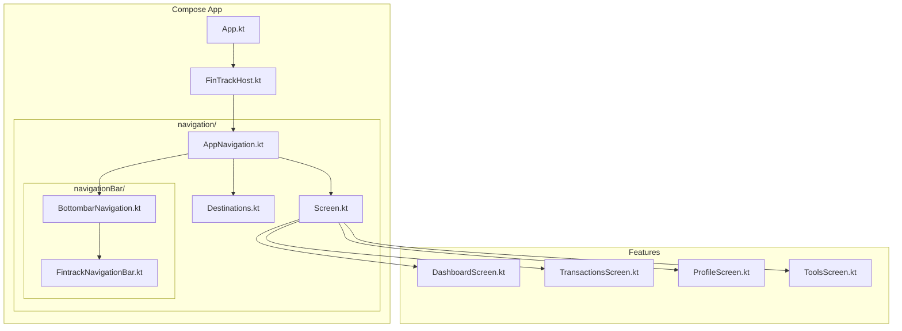
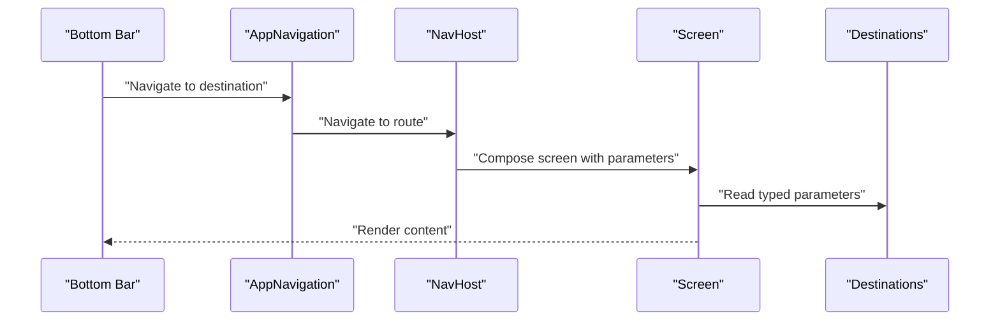
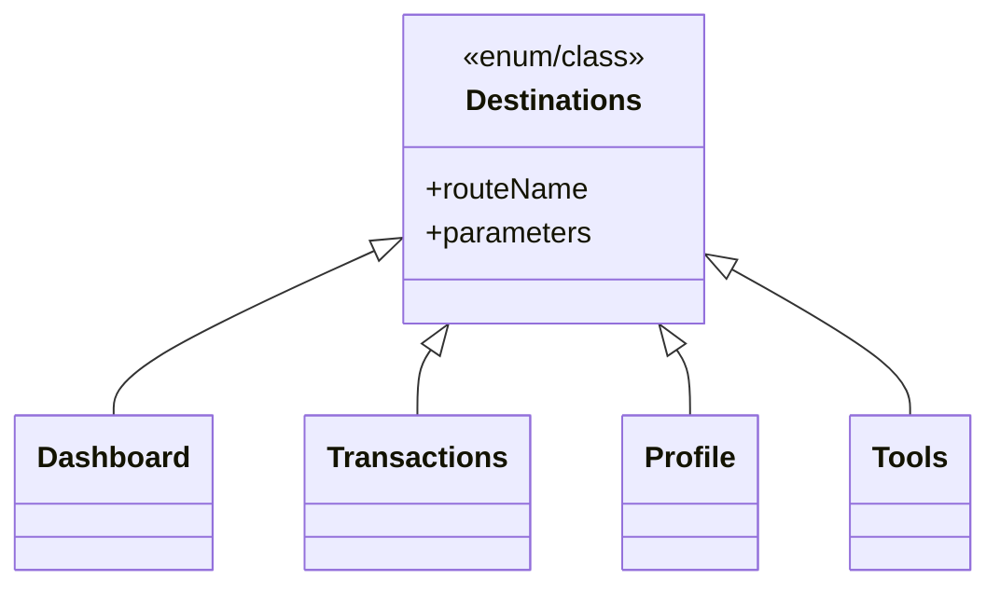
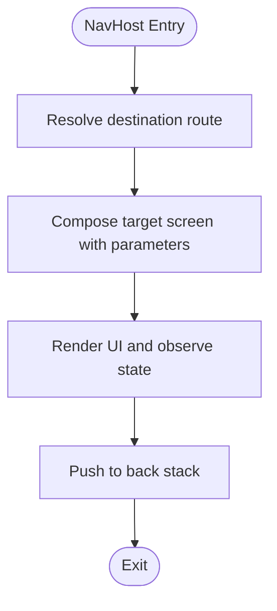
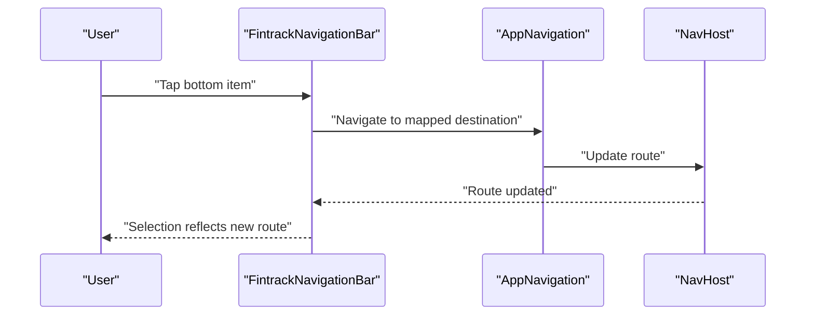
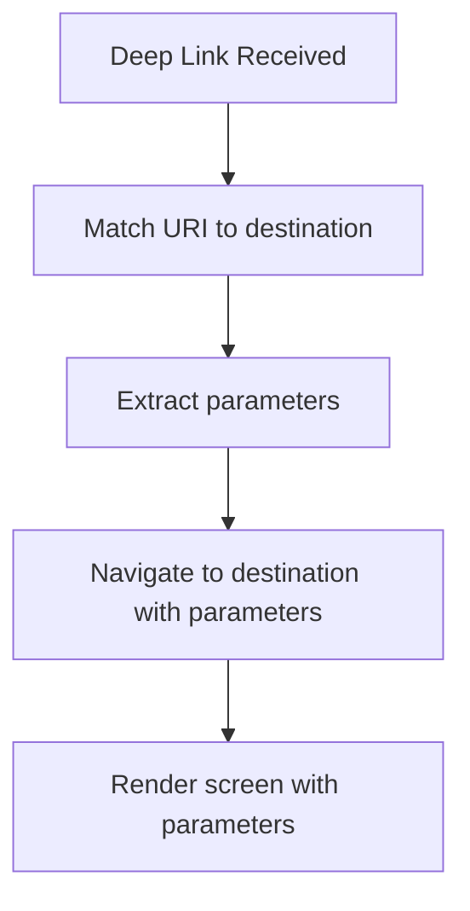
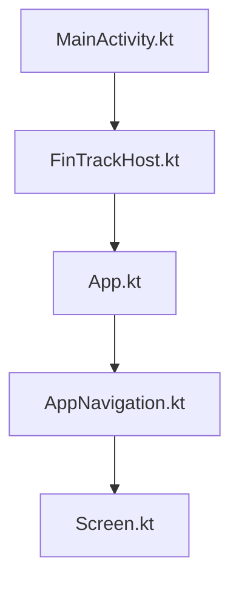
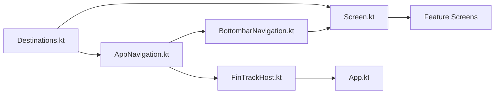

# Navigation and Routing

<cite>
**Referenced Files in This Document**
- [AppNavigation.kt](file://composeApp/src/commonMain/kotlin/com/kazemieh/composeApp/navigation/AppNavigation.kt)
- [Destinations.kt](file://composeApp/src/commonMain/kotlin/com/kazemieh/composeApp/navigation/Destinations.kt)
- [Screen.kt](file://composeApp/src/commonMain/kotlin/com/kazemieh/composeApp/navigation/Screen.kt)
- [BottombarNavigation.kt](file://composeApp/src/commonMain/kotlin/com/kazemieh/composeApp/navigation/navigationBar/BottombarNavigation.kt)
- [FintrackNavigationBar.kt](file://composeApp/src/commonMain/kotlin/com/kazemieh/composeApp/navigation/navigationBar/FintrackNavigationBar.kt)
- [FinTrackHost.kt](file://composeApp/src/commonMain/kotlin/com/kazemieh/composeApp/FinTrackHost.kt)
- [App.kt](file://composeApp/src/commonMain/kotlin/com/kazemieh/composeApp/App.kt)
- [MainActivity.kt](file://app/src/main/java/com/kazemieh/fintrack/MainActivity.kt)
- [DashboardScreen.kt](file://feature-container/dashboard/src/commonMain/kotlin/com/kazemieh/dashboard/DashboardScreen.kt)
- [TransactionsScreen.kt](file://feature-container/transactions/src/commonMain/kotlin/com/kazemieh/transactions/TransactionsScreen.kt)
- [ProfileScreen.kt](file://feature-container/profile/src/commonMain/kotlin/com/kazemieh/profile/ProfileScreen.kt)
- [ToolsScreen.kt](file://feature-container/tools/src/commonMain/kotlin/com/kazemieh/tools/ToolsScreen.kt)
</cite>

## Table of Contents
1. [Introduction](#introduction)
2. [Project Structure](#project-structure)
3. [Core Components](#core-components)
4. [Architecture Overview](#architecture-overview)
5. [Detailed Component Analysis](#detailed-component-analysis)
6. [Dependency Analysis](#dependency-analysis)
7. [Performance Considerations](#performance-considerations)
8. [Troubleshooting Guide](#troubleshooting-guide)
9. [Conclusion](#conclusion)

## Introduction
This document explains FinTrack’s navigation and routing system with a focus on type-safe navigation architecture and bottom bar implementation. It covers how destinations are defined, how screens route and preserve state, and how the bottom navigation integrates with the overall Compose-based architecture. It also documents deep linking considerations, navigation state management, and cross-platform navigation patterns across Android, iOS, JVM, and Web targets.

## Project Structure
FinTrack organizes navigation under a dedicated navigation package with supporting host and app entry points. The structure separates concerns into:
- Destination definitions for type-safe routing
- Navigation composables for bottom bar and global navigation
- Screen definitions for each feature area
- Host and app entry points that wire navigation into the platform-specific UI

**Diagram sources**
- [App.kt](file://composeApp/src/commonMain/kotlin/com/kazemieh/composeApp/App.kt)
- [FinTrackHost.kt](file://composeApp/src/commonMain/kotlin/com/kazemieh/composeApp/FinTrackHost.kt)
- [AppNavigation.kt](file://composeApp/src/commonMain/kotlin/com/kazemieh/composeApp/navigation/AppNavigation.kt)
- [Destinations.kt](file://composeApp/src/commonMain/kotlin/com/kazemieh/composeApp/navigation/Destinations.kt)
- [Screen.kt](file://composeApp/src/commonMain/kotlin/com/kazemieh/composeApp/navigation/Screen.kt)
- [BottombarNavigation.kt](file://composeApp/src/commonMain/kotlin/com/kazemieh/composeApp/navigation/navigationBar/BottombarNavigation.kt)
- [FintrackNavigationBar.kt](file://composeApp/src/commonMain/kotlin/com/kazemieh/composeApp/navigation/navigationBar/FintrackNavigationBar.kt)
- [DashboardScreen.kt](file://feature-container/dashboard/src/commonMain/kotlin/com/kazemieh/dashboard/DashboardScreen.kt)
- [TransactionsScreen.kt](file://feature-container/transactions/src/commonMain/kotlin/com/kazemieh/transactions/TransactionsScreen.kt)
- [ProfileScreen.kt](file://feature-container/profile/src/commonMain/kotlin/com/kazemieh/profile/ProfileScreen.kt)
- [ToolsScreen.kt](file://feature-container/tools/src/commonMain/kotlin/com/kazemieh/tools/ToolsScreen.kt)

**Section sources**
- [App.kt](file://composeApp/src/commonMain/kotlin/com/kazemieh/composeApp/App.kt)
- [FinTrackHost.kt](file://composeApp/src/commonMain/kotlin/com/kazemieh/composeApp/FinTrackHost.kt)
- [AppNavigation.kt](file://composeApp/src/commonMain/kotlin/com/kazemieh/composeApp/navigation/AppNavigation.kt)
- [Destinations.kt](file://composeApp/src/commonMain/kotlin/com/kazemieh/composeApp/navigation/Destinations.kt)
- [Screen.kt](file://composeApp/src/commonMain/kotlin/com/kazemieh/composeApp/navigation/Screen.kt)
- [BottombarNavigation.kt](file://composeApp/src/commonMain/kotlin/com/kazemieh/composeApp/navigation/navigationBar/BottombarNavigation.kt)
- [FintrackNavigationBar.kt](file://composeApp/src/commonMain/kotlin/com/kazemieh/composeApp/navigation/navigationBar/FintrackNavigationBar.kt)

## Core Components
- Type-safe destinations: Centralized enum/class that defines all navigable destinations with compile-time safety for parameters and routes.
- Navigation graph: Compose Navigation implementation that hosts screens and manages back stack and state.
- Bottom bar: A reusable navigation bar composable that maps to destinations and handles selection and state preservation.
- Screens: Feature screens that consume destination parameters and render UI.
- Host and app entry: Platform entry points that initialize the navigation host and render the app shell.

Key responsibilities:
- Define destinations and their parameters in a single source of truth.
- Route to screens while preserving state across configuration changes and navigation actions.
- Provide a bottom bar that reflects current destination and supports deep links.
- Integrate with platform-specific activities and UI shells.

**Section sources**
- [Destinations.kt](file://composeApp/src/commonMain/kotlin/com/kazemieh/composeApp/navigation/Destinations.kt)
- [AppNavigation.kt](file://composeApp/src/commonMain/kotlin/com/kazemieh/composeApp/navigation/AppNavigation.kt)
- [Screen.kt](file://composeApp/src/commonMain/kotlin/com/kazemieh/composeApp/navigation/Screen.kt)
- [BottombarNavigation.kt](file://composeApp/src/commonMain/kotlin/com/kazemieh/composeApp/navigation/navigationBar/BottombarNavigation.kt)
- [FintrackNavigationBar.kt](file://composeApp/src/commonMain/kotlin/com/kazemieh/composeApp/navigation/navigationBar/FintrackNavigationBar.kt)

## Architecture Overview
FinTrack’s navigation architecture follows a type-safe, centralized routing pattern:
- Destinations enumerate all routes and parameters.
- AppNavigation composes the NavHost and delegates to Screen definitions.
- BottombarNavigation renders a bottom bar and triggers navigation events.
- Screens are feature-specific and receive typed parameters from destinations.
- FinTrackHost and App integrate navigation into the platform UI.

**Diagram sources**
- [BottombarNavigation.kt](file://composeApp/src/commonMain/kotlin/com/kazemieh/composeApp/navigation/navigationBar/BottombarNavigation.kt)
- [AppNavigation.kt](file://composeApp/src/commonMain/kotlin/com/kazemieh/composeApp/navigation/AppNavigation.kt)
- [Screen.kt](file://composeApp/src/commonMain/kotlin/com/kazemieh/composeApp/navigation/Screen.kt)
- [Destinations.kt](file://composeApp/src/commonMain/kotlin/com/kazemieh/composeApp/navigation/Destinations.kt)

## Detailed Component Analysis

### Type-Safe Destinations
- Purpose: Define all destinations with compile-time safety for route names and parameters.
- Implementation pattern: Enum or sealed class with nested entries per destination, including optional parameters and route segments.
- Benefits: Prevents runtime navigation errors, improves refactoring safety, and centralizes route definitions.

**Diagram sources**
- [Destinations.kt](file://composeApp/src/commonMain/kotlin/com/kazemieh/composeApp/navigation/Destinations.kt)

**Section sources**
- [Destinations.kt](file://composeApp/src/commonMain/kotlin/com/kazemieh/composeApp/navigation/Destinations.kt)

### Navigation Graph and Screen Routing
- Purpose: Host screens, manage back stack, and route to typed destinations.
- Implementation pattern: Compose NavHost with a graph that maps routes to screens and preserves state automatically.
- State preservation: Back stack and arguments are managed by the navigation framework; stateful screens should avoid retaining heavy transient state.

**Diagram sources**
- [AppNavigation.kt](file://composeApp/src/commonMain/kotlin/com/kazemieh/composeApp/navigation/AppNavigation.kt)
- [Screen.kt](file://composeApp/src/commonMain/kotlin/com/kazemieh/composeApp/navigation/Screen.kt)

**Section sources**
- [AppNavigation.kt](file://composeApp/src/commonMain/kotlin/com/kazemieh/composeApp/navigation/AppNavigation.kt)
- [Screen.kt](file://composeApp/src/commonMain/kotlin/com/kazemieh/composeApp/navigation/Screen.kt)

### Bottom Bar Implementation
- Purpose: Provide persistent bottom navigation with selection state and deep link support.
- Implementation pattern: A composable that maps items to destinations, updates selection based on current route, and triggers navigation on item click.
- State preservation: Selection state is derived from the current route; deep links update the route and reflect in the bar.

**Diagram sources**
- [FintrackNavigationBar.kt](file://composeApp/src/commonMain/kotlin/com/kazemieh/composeApp/navigation/navigationBar/FintrackNavigationBar.kt)
- [BottombarNavigation.kt](file://composeApp/src/commonMain/kotlin/com/kazemieh/composeApp/navigation/navigationBar/BottombarNavigation.kt)
- [AppNavigation.kt](file://composeApp/src/commonMain/kotlin/com/kazemieh/composeApp/navigation/AppNavigation.kt)

**Section sources**
- [FintrackNavigationBar.kt](file://composeApp/src/commonMain/kotlin/com/kazemieh/composeApp/navigation/navigationBar/FintrackNavigationBar.kt)
- [BottombarNavigation.kt](file://composeApp/src/commonMain/kotlin/com/kazemieh/composeApp/navigation/navigationBar/BottombarNavigation.kt)

### Deep Linking Support
- Purpose: Allow launching into specific destinations via external intents or URLs.
- Implementation pattern: Configure deep links in the navigation graph and map incoming URIs to destinations with parameters.
- Best practices: Keep deep link routes deterministic and parameterized; handle missing or invalid parameters gracefully.

**Diagram sources**
- [AppNavigation.kt](file://composeApp/src/commonMain/kotlin/com/kazemieh/composeApp/navigation/AppNavigation.kt)
- [Destinations.kt](file://composeApp/src/commonMain/kotlin/com/kazemieh/composeApp/navigation/Destinations.kt)

**Section sources**
- [AppNavigation.kt](file://composeApp/src/commonMain/kotlin/com/kazemieh/composeApp/navigation/AppNavigation.kt)
- [Destinations.kt](file://composeApp/src/commonMain/kotlin/com/kazemieh/composeApp/navigation/Destinations.kt)

### Cross-Platform Navigation Integration
- Android: MainActivity hosts the Compose app and delegates to FinTrackHost and App.
- iOS, JVM, Web: Platform entry points initialize the Compose app and render the navigation host.
- Consistency: Navigation graph, destinations, and screens remain shared across platforms via commonMain.

**Diagram sources**
- [MainActivity.kt](file://app/src/main/java/com/kazemieh/fintrack/MainActivity.kt)
- [FinTrackHost.kt](file://composeApp/src/commonMain/kotlin/com/kazemieh/composeApp/FinTrackHost.kt)
- [App.kt](file://composeApp/src/commonMain/kotlin/com/kazemieh/composeApp/App.kt)
- [AppNavigation.kt](file://composeApp/src/commonMain/kotlin/com/kazemieh/composeApp/navigation/AppNavigation.kt)
- [Screen.kt](file://composeApp/src/commonMain/kotlin/com/kazemieh/composeApp/navigation/Screen.kt)

**Section sources**
- [MainActivity.kt](file://app/src/main/java/com/kazemieh/fintrack/MainActivity.kt)
- [FinTrackHost.kt](file://composeApp/src/commonMain/kotlin/com/kazemieh/composeApp/FinTrackHost.kt)
- [App.kt](file://composeApp/src/commonMain/kotlin/com/kazemieh/composeApp/App.kt)

## Dependency Analysis
- Destinations define the contract for all routes and parameters.
- AppNavigation depends on Destinations and Screen definitions to compose the navigation graph.
- Bottom bar depends on AppNavigation to trigger navigation and on Destinations to map items to routes.
- Screens depend on Destinations for typed parameters and on AppNavigation for back stack behavior.
- Host and app entry points depend on AppNavigation to render the navigation graph.

**Diagram sources**
- [Destinations.kt](file://composeApp/src/commonMain/kotlin/com/kazemieh/composeApp/navigation/Destinations.kt)
- [AppNavigation.kt](file://composeApp/src/commonMain/kotlin/com/kazemieh/composeApp/navigation/AppNavigation.kt)
- [Screen.kt](file://composeApp/src/commonMain/kotlin/com/kazemieh/composeApp/navigation/Screen.kt)
- [BottombarNavigation.kt](file://composeApp/src/commonMain/kotlin/com/kazemieh/composeApp/navigation/navigationBar/BottombarNavigation.kt)
- [FinTrackHost.kt](file://composeApp/src/commonMain/kotlin/com/kazemieh/composeApp/FinTrackHost.kt)
- [App.kt](file://composeApp/src/commonMain/kotlin/com/kazemieh/composeApp/App.kt)

**Section sources**
- [Destinations.kt](file://composeApp/src/commonMain/kotlin/com/kazemieh/composeApp/navigation/Destinations.kt)
- [AppNavigation.kt](file://composeApp/src/commonMain/kotlin/com/kazemieh/composeApp/navigation/AppNavigation.kt)
- [Screen.kt](file://composeApp/src/commonMain/kotlin/com/kazemieh/composeApp/navigation/Screen.kt)
- [BottombarNavigation.kt](file://composeApp/src/commonMain/kotlin/com/kazemieh/composeApp/navigation/navigationBar/BottombarNavigation.kt)
- [FinTrackHost.kt](file://composeApp/src/commonMain/kotlin/com/kazemieh/composeApp/FinTrackHost.kt)
- [App.kt](file://composeApp/src/commonMain/kotlin/com/kazemieh/composeApp/App.kt)

## Performance Considerations
- State preservation: Leverage the navigation framework’s built-in back stack and state saving to minimize recomposition overhead.
- Parameter passing: Keep destination parameters lightweight; avoid passing large objects directly as arguments.
- Screen composition: Use lazy lists and virtualization in screens to reduce layout cost.
- Memory management: Avoid retaining references to UI scopes or heavy objects in screens; rely on lifecycle-aware patterns.
- Deep linking: Validate and sanitize parameters early to prevent unnecessary work and potential crashes.

## Troubleshooting Guide
- Navigation errors:
  - Verify destination routes match the navigation graph.
  - Ensure parameters are correctly extracted and validated.
- Bottom bar selection:
  - Confirm the current route aligns with the selected item mapping.
  - Check that deep links update the route and selection consistently.
- Cross-platform issues:
  - Confirm platform entry points initialize the navigation host.
  - Validate that shared navigation code compiles on all targets.

**Section sources**
- [AppNavigation.kt](file://composeApp/src/commonMain/kotlin/com/kazemieh/composeApp/navigation/AppNavigation.kt)
- [BottombarNavigation.kt](file://composeApp/src/commonMain/kotlin/com/kazemieh/composeApp/navigation/navigationBar/BottombarNavigation.kt)
- [FintrackNavigationBar.kt](file://composeApp/src/commonMain/kotlin/com/kazemieh/composeApp/navigation/navigationBar/FintrackNavigationBar.kt)

## Conclusion
FinTrack’s navigation system emphasizes type safety, centralized destination definitions, and a reusable bottom bar integrated with a Compose navigation graph. By structuring routes and parameters centrally, preserving state through the navigation framework, and providing deep link support, the system offers a robust foundation for adding new features and maintaining consistency across platforms. For new routes, define destinations, add screens, wire them into the navigation graph, and map them in the bottom bar to ensure a seamless user experience.