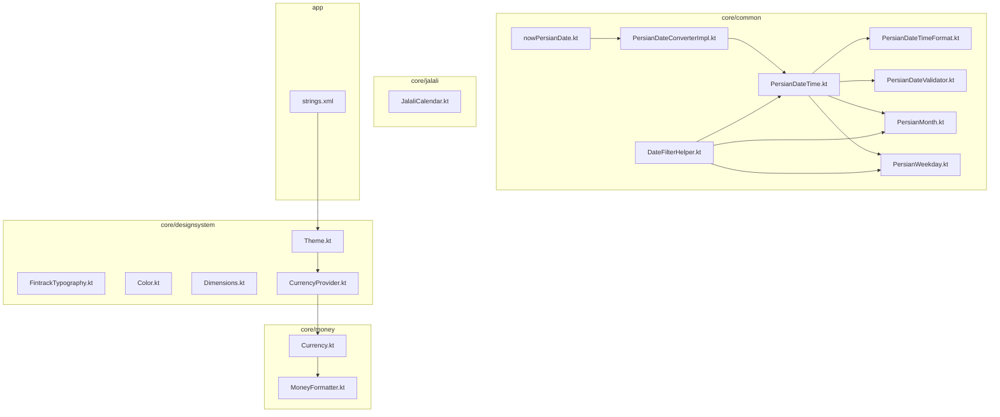
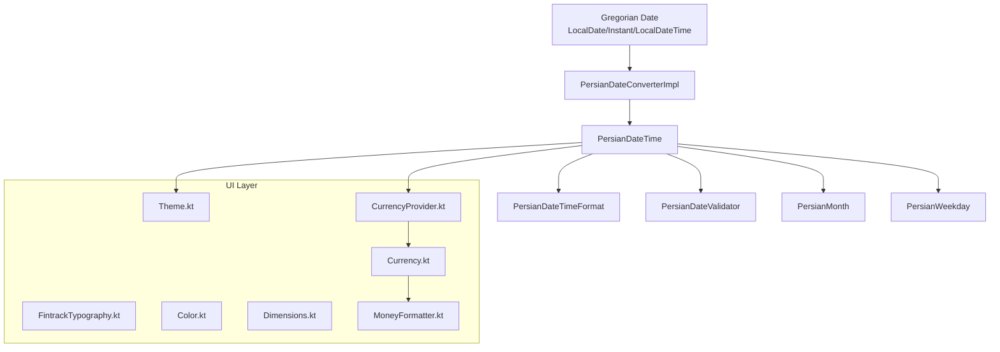
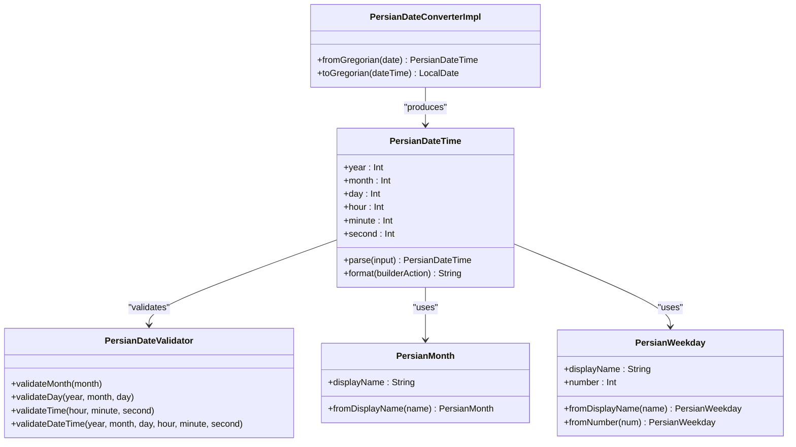
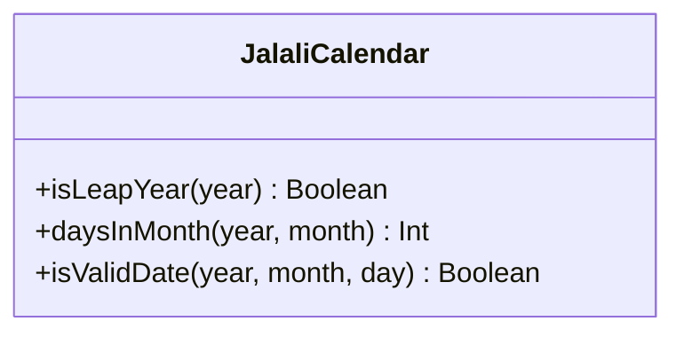
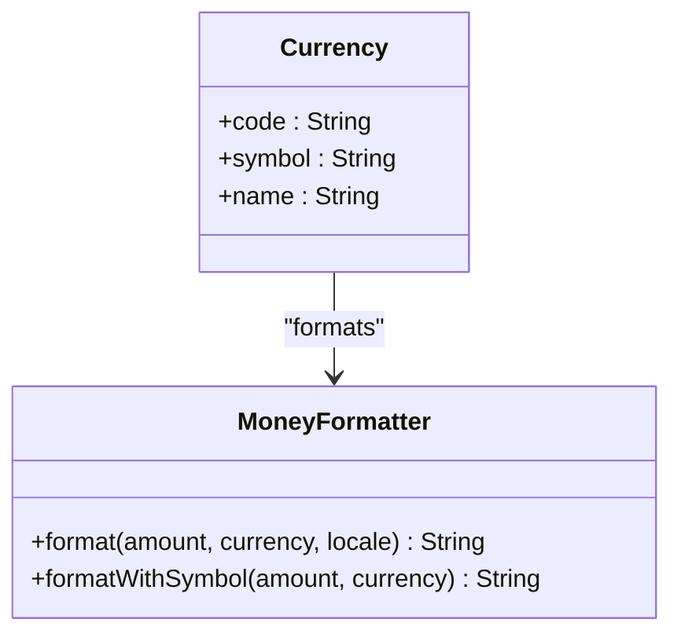
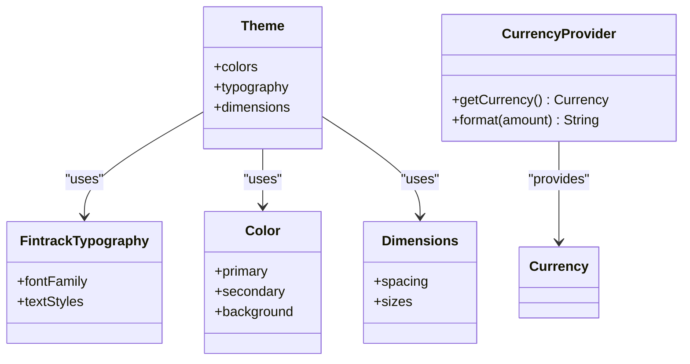
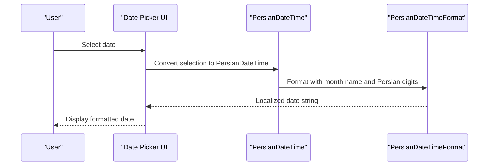
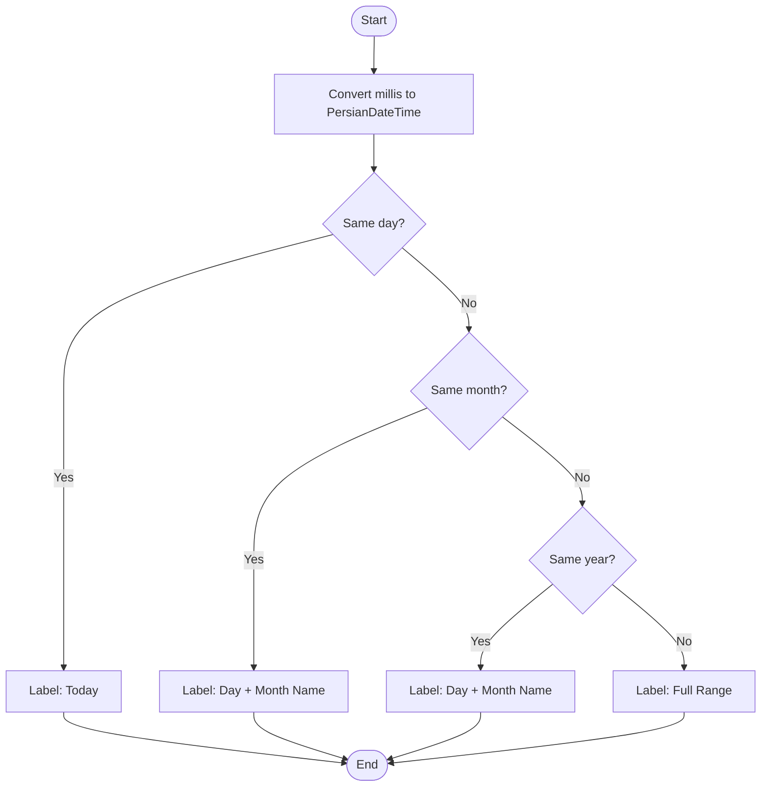
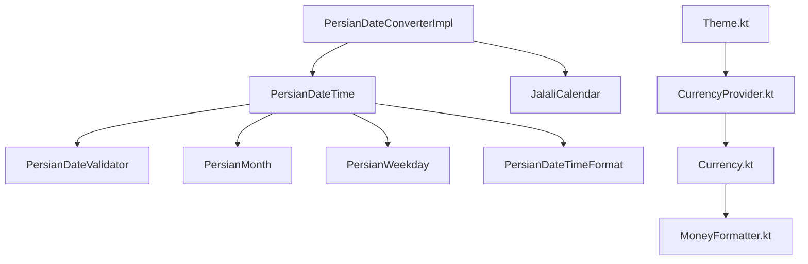

# Persian Localization and Cultural Adaptations

<cite>
**Referenced Files in This Document**
- [PersianDateTime.kt](file://core/common/src/commonMain/kotlin/com/kazemieh/common/persiandatetime/domain/PersianDateTime.kt)
- [PersianDateConverterImpl.kt](file://core/common/src/commonMain/kotlin/com/kazemieh/common/persiandatetime/PersianDateConverterImpl.kt)
- [PersianDateTimeFormat.kt](file://core/common/src/commonMain/kotlin/com/kazemieh/common/persiandatetime/util/PersianDateTimeFormat.kt)
- [PersianDateValidator.kt](file://core/common/src/commonMain/kotlin/com/kazemieh/common/persiandatetime/util/PersianDateValidator.kt)
- [PersianMonth.kt](file://core/common/src/commonMain/kotlin/com/kazemieh/common/persiandatetime/domain/PersianMonth.kt)
- [PersianWeekday.kt](file://core/common/src/commonMain/kotlin/com/kazemieh/common/persiandatetime/domain/PersianWeekday.kt)
- [nowPersianDate.kt](file://core/common/src/commonMain/kotlin/com/kazemieh/common/persiandatetime/extensions/nowPersianDate.kt)
- [JalaliCalendar.kt](file://core/jalali/src/commonMain/kotlin/com/kazemieh/jalali/JalaliCalendar.kt)
- [Currency.kt](file://core/money/src/commonMain/kotlin/com/kazemieh/money/Currency.kt)
- [MoneyFormatter.kt](file://core/money/src/commonMain/kotlin/com/kazemieh/money/MoneyFormatter.kt)
- [DateFilterHelper.kt](file://core/common/src/commonMain/kotlin/com/kazemieh/common/DateFilterHelper.kt)
- [strings.xml](file://app/src/main/res/values/strings.xml)
- [Theme.kt](file://core/designsystem/src/commonMain/kotlin/com/kazemieh/designsystem/Theme.kt)
- [FintrackTypography.kt](file://core/designsystem/src/commonMain/kotlin/com/kazemieh/designsystem/FintrackTypography.kt)
- [Color.kt](file://core/designsystem/src/commonMain/kotlin/com/kazemieh/designsystem/Color.kt)
- [Dimensions.kt](file://core/designsystem/src/commonMain/kotlin/com/kazemieh/designsystem/Dimensions.kt)
- [CurrencyProvider.kt](file://core/designsystem/src/commonMain/kotlin/com/kazemieh/designsystem/CurrencyProvider.kt)
</cite>

## Table of Contents
1. [Introduction](#introduction)
2. [Project Structure](#project-structure)
3. [Core Components](#core-components)
4. [Architecture Overview](#architecture-overview)
5. [Detailed Component Analysis](#detailed-component-analysis)
6. [Dependency Analysis](#dependency-analysis)
7. [Performance Considerations](#performance-considerations)
8. [Troubleshooting Guide](#troubleshooting-guide)
9. [Conclusion](#conclusion)
10. [Appendices](#appendices)

## Introduction
This document explains FinTrack's Persian localization and cultural adaptations with a focus on Persian calendar implementation, date formatting, and culturally appropriate UI patterns. It covers the purpose and implementation of Persian date conversion, Jalali calendar support, and currency formatting tailored for Persian locale users. The guide provides both conceptual overviews for beginners and technical details for developers implementing localization features, using terminology consistent with the codebase such as PersianDateTime, JalaliCalendar, and cultural adaptation patterns. Practical examples demonstrate date conversions, calendar calculations, and localized UI components, while addressing timezone handling, locale-specific formatting, and cross-cultural considerations for international users.

## Project Structure
FinTrack organizes Persian localization across dedicated modules:
- core/common: Contains the core Persian date/time domain, converter, validators, and formatting utilities.
- core/jalali: Provides the Jalali calendar abstraction.
- core/money: Handles currency representation and formatting.
- core/designsystem: Implements theme, typography, color, dimensions, and currency provider for cultural UI adaptations.
- app: Holds shared resources such as string translations.

**Diagram sources**
- [PersianDateConverterImpl.kt](file://core/common/src/commonMain/kotlin/com/kazemieh/common/persiandatetime/PersianDateConverterImpl.kt)
- [PersianDateTime.kt](file://core/common/src/commonMain/kotlin/com/kazemieh/common/persiandatetime/domain/PersianDateTime.kt)
- [PersianDateTimeFormat.kt](file://core/common/src/commonMain/kotlin/com/kazemieh/common/persiandatetime/util/PersianDateTimeFormat.kt)
- [PersianDateValidator.kt](file://core/common/src/commonMain/kotlin/com/kazemieh/common/persiandatetime/util/PersianDateValidator.kt)
- [PersianMonth.kt](file://core/common/src/commonMain/kotlin/com/kazemieh/common/persiandatetime/domain/PersianMonth.kt)
- [PersianWeekday.kt](file://core/common/src/commonMain/kotlin/com/kazemieh/common/persiandatetime/domain/PersianWeekday.kt)
- [nowPersianDate.kt](file://core/common/src/commonMain/kotlin/com/kazemieh/common/persiandatetime/extensions/nowPersianDate.kt)
- [DateFilterHelper.kt](file://core/common/src/commonMain/kotlin/com/kazemieh/common/DateFilterHelper.kt)
- [JalaliCalendar.kt](file://core/jalali/src/commonMain/kotlin/com/kazemieh/jalali/JalaliCalendar.kt)
- [Currency.kt](file://core/money/src/commonMain/kotlin/com/kazemieh/money/Currency.kt)
- [MoneyFormatter.kt](file://core/money/src/commonMain/kotlin/com/kazemieh/money/MoneyFormatter.kt)
- [Theme.kt](file://core/designsystem/src/commonMain/kotlin/com/kazemieh/designsystem/Theme.kt)
- [FintrackTypography.kt](file://core/designsystem/src/commonMain/kotlin/com/kazemieh/designsystem/FintrackTypography.kt)
- [Color.kt](file://core/designsystem/src/commonMain/kotlin/com/kazemieh/designsystem/Color.kt)
- [Dimensions.kt](file://core/designsystem/src/commonMain/kotlin/com/kazemieh/designsystem/Dimensions.kt)
- [CurrencyProvider.kt](file://core/designsystem/src/commonMain/kotlin/com/kazemieh/designsystem/CurrencyProvider.kt)
- [strings.xml](file://app/src/main/res/values/strings.xml)

**Section sources**
- [PersianDateConverterImpl.kt](file://core/common/src/commonMain/kotlin/com/kazemieh/common/persiandatetime/PersianDateConverterImpl.kt)
- [JalaliCalendar.kt](file://core/jalali/src/commonMain/kotlin/com/kazemieh/jalali/JalaliCalendar.kt)
- [Currency.kt](file://core/money/src/commonMain/kotlin/com/kazemieh/money/Currency.kt)
- [MoneyFormatter.kt](file://core/money/src/commonMain/kotlin/com/kazemieh/money/MoneyFormatter.kt)
- [Theme.kt](file://core/designsystem/src/commonMain/kotlin/com/kazemieh/designsystem/Theme.kt)
- [strings.xml](file://app/src/main/res/values/strings.xml)

## Core Components
This section introduces the foundational components that enable Persian localization and cultural adaptations.

- PersianDateTime: The central domain object representing a date and time in the Persian calendar, including parsing, formatting, and arithmetic helpers.
- PersianDateConverterImpl: Implements conversion between Gregorian and Persian calendars, encapsulating the conversion algorithm and validation.
- PersianDateTimeFormat: Provides a DSL-style builder for formatting PersianDateTime instances into localized strings.
- PersianDateValidator: Validates Persian calendar dates and time components against calendar rules, including leap year adjustments.
- PersianMonth and PersianWeekday: Enumerations for Persian month names and weekday names, enabling culturally accurate labeling.
- nowPersianDate extensions: Utility functions for converting Instant, LocalDate, and LocalDateTime to PersianDateTime, and for calculating month lengths and day-of-week indices.
- JalaliCalendar: Abstraction for the Jalali calendar system, enabling calendar-aware operations.
- Money and MoneyFormatter: Currency representation and formatting tailored for Persian locale.
- Design system components: Theme, typography, color, dimensions, and currency provider for culturally appropriate UI.

Practical examples:
- Converting a Gregorian date to PersianDateTime using extension functions.
- Formatting a PersianDateTime with month name and Persian digits.
- Validating a Persian date and time combination.
- Determining the length of a Persian month, including leap year adjustments.

**Section sources**
- [PersianDateTime.kt](file://core/common/src/commonMain/kotlin/com/kazemieh/common/persiandatetime/domain/PersianDateTime.kt)
- [PersianDateConverterImpl.kt](file://core/common/src/commonMain/kotlin/com/kazemieh/common/persiandatetime/PersianDateConverterImpl.kt)
- [PersianDateTimeFormat.kt](file://core/common/src/commonMain/kotlin/com/kazemieh/common/persiandatetime/util/PersianDateTimeFormat.kt)
- [PersianDateValidator.kt](file://core/common/src/commonMain/kotlin/com/kazemieh/common/persiandatetime/util/PersianDateValidator.kt)
- [PersianMonth.kt](file://core/common/src/commonMain/kotlin/com/kazemieh/common/persiandatetime/domain/PersianMonth.kt)
- [PersianWeekday.kt](file://core/common/src/commonMain/kotlin/com/kazemieh/common/persiandatetime/domain/PersianWeekday.kt)
- [nowPersianDate.kt](file://core/common/src/commonMain/kotlin/com/kazemieh/common/persiandatetime/extensions/nowPersianDate.kt)
- [JalaliCalendar.kt](file://core/jalali/src/commonMain/kotlin/com/kazemieh/jalali/JalaliCalendar.kt)
- [Currency.kt](file://core/money/src/commonMain/kotlin/com/kazemieh/money/Currency.kt)
- [MoneyFormatter.kt](file://core/money/src/commonMain/kotlin/com/kazemieh/money/MoneyFormatter.kt)

## Architecture Overview
The Persian localization architecture integrates calendar conversion, formatting, validation, and UI cultural adaptations. The converter translates Gregorian dates to Persian dates, while formatting utilities render culturally appropriate strings. The design system ensures consistent typography, colors, and currency presentation aligned with Persian locale expectations.

**Diagram sources**
- [PersianDateConverterImpl.kt](file://core/common/src/commonMain/kotlin/com/kazemieh/common/persiandatetime/PersianDateConverterImpl.kt)
- [PersianDateTime.kt](file://core/common/src/commonMain/kotlin/com/kazemieh/common/persiandatetime/domain/PersianDateTime.kt)
- [PersianDateTimeFormat.kt](file://core/common/src/commonMain/kotlin/com/kazemieh/common/persiandatetime/util/PersianDateTimeFormat.kt)
- [PersianDateValidator.kt](file://core/common/src/commonMain/kotlin/com/kazemieh/common/persiandatetime/util/PersianDateValidator.kt)
- [PersianMonth.kt](file://core/common/src/commonMain/kotlin/com/kazemieh/common/persiandatetime/domain/PersianMonth.kt)
- [PersianWeekday.kt](file://core/common/src/commonMain/kotlin/com/kazemieh/common/persiandatetime/domain/PersianWeekday.kt)
- [Theme.kt](file://core/designsystem/src/commonMain/kotlin/com/kazemieh/designsystem/Theme.kt)
- [FintrackTypography.kt](file://core/designsystem/src/commonMain/kotlin/com/kazemieh/designsystem/FintrackTypography.kt)
- [Color.kt](file://core/designsystem/src/commonMain/kotlin/com/kazemieh/designsystem/Color.kt)
- [Dimensions.kt](file://core/designsystem/src/commonMain/kotlin/com/kazemieh/designsystem/Dimensions.kt)
- [CurrencyProvider.kt](file://core/designsystem/src/commonMain/kotlin/com/kazemieh/designsystem/CurrencyProvider.kt)
- [Currency.kt](file://core/money/src/commonMain/kotlin/com/kazemieh/money/Currency.kt)
- [MoneyFormatter.kt](file://core/money/src/commonMain/kotlin/com/kazemieh/money/MoneyFormatter.kt)

## Detailed Component Analysis

### Persian Calendar Conversion and Validation
This component handles conversion between Gregorian and Persian calendars, validates Persian dates, and supports calendar-aware operations.

**Diagram sources**
- [PersianDateConverterImpl.kt](file://core/common/src/commonMain/kotlin/com/kazemieh/common/persiandatetime/PersianDateConverterImpl.kt)
- [PersianDateTime.kt](file://core/common/src/commonMain/kotlin/com/kazemieh/common/persiandatetime/domain/PersianDateTime.kt)
- [PersianDateValidator.kt](file://core/common/src/commonMain/kotlin/com/kazemieh/common/persiandatetime/util/PersianDateValidator.kt)
- [PersianMonth.kt](file://core/common/src/commonMain/kotlin/com/kazemieh/common/persiandatetime/domain/PersianMonth.kt)
- [PersianWeekday.kt](file://core/common/src/commonMain/kotlin/com/kazemieh/common/persiandatetime/domain/PersianWeekday.kt)

Key capabilities:
- Conversion from Gregorian to Persian calendar with timezone-awareness via extension functions.
- Parsing Persian date strings with multiple supported formats.
- Validation of month, day, and time components, including leap year adjustments.
- Month length calculation and day-of-week indexing aligned with Persian calendar conventions.

Practical example paths:
- Converting Instant to PersianDateTime: [nowPersianDate.kt](file://core/common/src/commonMain/kotlin/com/kazemieh/common/persiandatetime/extensions/nowPersianDate.kt)
- Parsing Persian date strings: [PersianDateTime.kt](file://core/common/src/commonMain/kotlin/com/kazemieh/common/persiandatetime/domain/PersianDateTime.kt)
- Validating Persian date-time: [PersianDateValidator.kt](file://core/common/src/commonMain/kotlin/com/kazemieh/common/persiandatetime/util/PersianDateValidator.kt)

**Section sources**
- [PersianDateConverterImpl.kt](file://core/common/src/commonMain/kotlin/com/kazemieh/common/persiandatetime/PersianDateConverterImpl.kt)
- [PersianDateTime.kt](file://core/common/src/commonMain/kotlin/com/kazemieh/common/persiandatetime/domain/PersianDateTime.kt)
- [PersianDateValidator.kt](file://core/common/src/commonMain/kotlin/com/kazemieh/common/persiandatetime/util/PersianDateValidator.kt)
- [PersianMonth.kt](file://core/common/src/commonMain/kotlin/com/kazemieh/common/persiandatetime/domain/PersianMonth.kt)
- [PersianWeekday.kt](file://core/common/src/commonMain/kotlin/com/kazemieh/common/persiandatetime/domain/PersianWeekday.kt)
- [nowPersianDate.kt](file://core/common/src/commonMain/kotlin/com/kazemieh/common/persiandatetime/extensions/nowPersianDate.kt)

### Jalali Calendar Support
JalaliCalendar provides a calendar abstraction for the Persian calendar system, enabling calendar-aware operations and integrations.

**Diagram sources**
- [JalaliCalendar.kt](file://core/jalali/src/commonMain/kotlin/com/kazemieh/jalali/JalaliCalendar.kt)

Integration points:
- Used by PersianDateConverterImpl for leap year calculations and month-length determinations.
- Supports validation and arithmetic operations aligned with Persian calendar rules.

**Section sources**
- [JalaliCalendar.kt](file://core/jalali/src/commonMain/kotlin/com/kazemieh/jalali/JalaliCalendar.kt)

### Currency Formatting for Persian Locale
Currency and MoneyFormatter handle currency representation and formatting tailored for Persian locale users.

**Diagram sources**
- [Currency.kt](file://core/money/src/commonMain/kotlin/com/kazemieh/money/Currency.kt)
- [MoneyFormatter.kt](file://core/money/src/commonMain/kotlin/com/kazemieh/money/MoneyFormatter.kt)

Implementation highlights:
- Currency representation with code, symbol, and name.
- Locale-aware formatting of monetary amounts.
- Integration with design system currency provider for consistent UI presentation.

**Section sources**
- [Currency.kt](file://core/money/src/commonMain/kotlin/com/kazemieh/money/Currency.kt)
- [MoneyFormatter.kt](file://core/money/src/commonMain/kotlin/com/kazemieh/money/MoneyFormatter.kt)

### Cultural UI Adaptations
The design system provides culturally appropriate UI elements for Persian locale users, including theme, typography, color, dimensions, and currency provider.

**Diagram sources**
- [Theme.kt](file://core/designsystem/src/commonMain/kotlin/com/kazemieh/designsystem/Theme.kt)
- [FintrackTypography.kt](file://core/designsystem/src/commonMain/kotlin/com/kazemieh/designsystem/FintrackTypography.kt)
- [Color.kt](file://core/designsystem/src/commonMain/kotlin/com/kazemieh/designsystem/Color.kt)
- [Dimensions.kt](file://core/designsystem/src/commonMain/kotlin/com/kazemieh/designsystem/Dimensions.kt)
- [CurrencyProvider.kt](file://core/designsystem/src/commonMain/kotlin/com/kazemieh/designsystem/CurrencyProvider.kt)

Cultural considerations:
- Typography and spacing adapted for right-to-left reading and Persian text rendering.
- Color palette and dimensions optimized for Persian cultural aesthetics.
- Currency provider ensures consistent and culturally appropriate currency display.

**Section sources**
- [Theme.kt](file://core/designsystem/src/commonMain/kotlin/com/kazemieh/designsystem/Theme.kt)
- [FintrackTypography.kt](file://core/designsystem/src/commonMain/kotlin/com/kazemieh/designsystem/FintrackTypography.kt)
- [Color.kt](file://core/designsystem/src/commonMain/kotlin/com/kazemieh/designsystem/Color.kt)
- [Dimensions.kt](file://core/designsystem/src/commonMain/kotlin/com/kazemieh/designsystem/Dimensions.kt)
- [CurrencyProvider.kt](file://core/designsystem/src/commonMain/kotlin/com/kazemieh/designsystem/CurrencyProvider.kt)

### Date Pickers and Time Formatting
Date pickers and time formatting leverage PersianDateTime and related utilities to present culturally appropriate date and time selections.

**Diagram sources**
- [PersianDateTime.kt](file://core/common/src/commonMain/kotlin/com/kazemieh/common/persiandatetime/domain/PersianDateTime.kt)
- [PersianDateTimeFormat.kt](file://core/common/src/commonMain/kotlin/com/kazemieh/common/persiandatetime/util/PersianDateTimeFormat.kt)
- [nowPersianDate.kt](file://core/common/src/commonMain/kotlin/com/kazemieh/common/persiandatetime/extensions/nowPersianDate.kt)

Implementation highlights:
- Extension functions convert system date/time types to PersianDateTime.
- Formatting builder enables flexible, locale-appropriate date displays.
- Day-of-week and month name retrieval align with Persian calendar conventions.

**Section sources**
- [PersianDateTime.kt](file://core/common/src/commonMain/kotlin/com/kazemieh/common/persiandatetime/domain/PersianDateTime.kt)
- [PersianDateTimeFormat.kt](file://core/common/src/commonMain/kotlin/com/kazemieh/common/persiandatetime/util/PersianDateTimeFormat.kt)
- [nowPersianDate.kt](file://core/common/src/commonMain/kotlin/com/kazemieh/common/persiandatetime/extensions/nowPersianDate.kt)

### Date Range Filtering and Labels
DateFilterHelper integrates PersianDateTime for generating culturally appropriate date range labels and filtering logic.

**Diagram sources**
- [DateFilterHelper.kt](file://core/common/src/commonMain/kotlin/com/kazemieh/common/DateFilterHelper.kt)
- [PersianDateTime.kt](file://core/common/src/commonMain/kotlin/com/kazemieh/common/persiandatetime/domain/PersianDateTime.kt)
- [PersianMonth.kt](file://core/common/src/commonMain/kotlin/com/kazemieh/common/persiandatetime/domain/PersianMonth.kt)
- [PersianWeekday.kt](file://core/common/src/commonMain/kotlin/com/kazemieh/common/persiandatetime/domain/PersianWeekday.kt)

**Section sources**
- [DateFilterHelper.kt](file://core/common/src/commonMain/kotlin/com/kazemieh/common/DateFilterHelper.kt)
- [PersianDateTime.kt](file://core/common/src/commonMain/kotlin/com/kazemieh/common/persiandatetime/domain/PersianDateTime.kt)
- [PersianMonth.kt](file://core/common/src/commonMain/kotlin/com/kazemieh/common/persiandatetime/domain/PersianMonth.kt)
- [PersianWeekday.kt](file://core/common/src/commonMain/kotlin/com/kazemieh/common/persiandatetime/domain/PersianWeekday.kt)

## Dependency Analysis
The Persian localization components exhibit low coupling and high cohesion, with clear separation of concerns across calendar conversion, formatting, validation, and UI adaptations.

**Diagram sources**
- [PersianDateConverterImpl.kt](file://core/common/src/commonMain/kotlin/com/kazemieh/common/persiandatetime/PersianDateConverterImpl.kt)
- [PersianDateTime.kt](file://core/common/src/commonMain/kotlin/com/kazemieh/common/persiandatetime/domain/PersianDateTime.kt)
- [PersianDateValidator.kt](file://core/common/src/commonMain/kotlin/com/kazemieh/common/persiandatetime/util/PersianDateValidator.kt)
- [PersianMonth.kt](file://core/common/src/commonMain/kotlin/com/kazemieh/common/persiandatetime/domain/PersianMonth.kt)
- [PersianWeekday.kt](file://core/common/src/commonMain/kotlin/com/kazemieh/common/persiandatetime/domain/PersianWeekday.kt)
- [PersianDateTimeFormat.kt](file://core/common/src/commonMain/kotlin/com/kazemieh/common/persiandatetime/util/PersianDateTimeFormat.kt)
- [JalaliCalendar.kt](file://core/jalali/src/commonMain/kotlin/com/kazemieh/jalali/JalaliCalendar.kt)
- [Theme.kt](file://core/designsystem/src/commonMain/kotlin/com/kazemieh/designsystem/Theme.kt)
- [CurrencyProvider.kt](file://core/designsystem/src/commonMain/kotlin/com/kazemieh/designsystem/CurrencyProvider.kt)
- [Currency.kt](file://core/money/src/commonMain/kotlin/com/kazemieh/money/Currency.kt)
- [MoneyFormatter.kt](file://core/money/src/commonMain/kotlin/com/kazemieh/money/MoneyFormatter.kt)

Observations:
- Converter depends on JalaliCalendar for leap year and month-length calculations.
- PersianDateTime orchestrates formatting and validation.
- UI layer depends on design system components for consistent cultural presentation.

**Section sources**
- [PersianDateConverterImpl.kt](file://core/common/src/commonMain/kotlin/com/kazemieh/common/persiandatetime/PersianDateConverterImpl.kt)
- [JalaliCalendar.kt](file://core/jalali/src/commonMain/kotlin/com/kazemieh/jalali/JalaliCalendar.kt)
- [PersianDateTime.kt](file://core/common/src/commonMain/kotlin/com/kazemieh/common/persiandatetime/domain/PersianDateTime.kt)
- [PersianDateTimeFormat.kt](file://core/common/src/commonMain/kotlin/com/kazemieh/common/persiandatetime/util/PersianDateTimeFormat.kt)
- [PersianDateValidator.kt](file://core/common/src/commonMain/kotlin/com/kazemieh/common/persiandatetime/util/PersianDateValidator.kt)
- [Theme.kt](file://core/designsystem/src/commonMain/kotlin/com/kazemieh/designsystem/Theme.kt)
- [CurrencyProvider.kt](file://core/designsystem/src/commonMain/kotlin/com/kazemieh/designsystem/CurrencyProvider.kt)
- [Currency.kt](file://core/money/src/commonMain/kotlin/com/kazemieh/money/Currency.kt)
- [MoneyFormatter.kt](file://core/money/src/commonMain/kotlin/com/kazemieh/money/MoneyFormatter.kt)

## Performance Considerations
- Conversion operations: Prefer reusing PersianDateTime instances when performing multiple operations to minimize repeated conversions.
- Formatting: Cache frequently used format patterns to avoid repeated parser construction.
- Validation: Perform validation early in the pipeline to fail fast and reduce downstream processing overhead.
- UI rendering: Defer heavy formatting until the UI thread is ready to render, and consider batching updates for lists of dates.

## Troubleshooting Guide
Common issues and resolutions:
- Invalid Persian date: Ensure month and day values are within valid ranges for the given year, including leap year adjustments. Use PersianDateValidator to catch errors early.
- Incorrect timezone conversion: Verify the timezone passed to conversion functions and ensure it matches the user's locale expectations.
- Formatting inconsistencies: Confirm the format builder settings match Persian locale conventions, including month names and Persian digits.
- UI currency display: Ensure the currency provider is configured correctly and MoneyFormatter is applied consistently across the UI.

**Section sources**
- [PersianDateValidator.kt](file://core/common/src/commonMain/kotlin/com/kazemieh/common/persiandatetime/util/PersianDateValidator.kt)
- [nowPersianDate.kt](file://core/common/src/commonMain/kotlin/com/kazemieh/common/persiandatetime/extensions/nowPersianDate.kt)
- [PersianDateTimeFormat.kt](file://core/common/src/commonMain/kotlin/com/kazemieh/common/persiandatetime/util/PersianDateTimeFormat.kt)
- [CurrencyProvider.kt](file://core/designsystem/src/commonMain/kotlin/com/kazemieh/designsystem/CurrencyProvider.kt)

## Conclusion
FinTrack's Persian localization leverages a robust set of components to deliver culturally appropriate date/time experiences and financial formatting for Persian locale users. The PersianDateTime domain, converter, validator, and formatting utilities work together with the Jalali calendar abstraction and design system to ensure accurate, consistent, and culturally sensitive presentations. By following the guidelines and examples outlined in this document, developers can implement and extend localization features with confidence.

## Appendices
- Terminology glossary:
  - PersianDateTime: The primary domain object for Persian calendar dates and times.
  - JalaliCalendar: The calendar abstraction underlying Persian calendar calculations.
  - Cultural adaptation patterns: UI and formatting patterns designed for Persian locale users.