# Android Implementation

<cite>
**Referenced Files in This Document**
- [FinTrackApplication.kt](file://app/src/main/java/com/kazemieh/fintrack/FinTrackApplication.kt)
- [MainActivity.kt](file://app/src/main/java/com/kazemieh/fintrack/MainActivity.kt)
- [AndroidManifest.xml](file://app/src/main/AndroidManifest.xml)
- [file_paths.xml](file://app/src/main/res/xml/file_paths.xml)
- [CommonModule.android.kt](file://core/common/src/androidMain/kotlin/com/kazemieh/common/di/CommonModule.android.kt)
- [ImageStorageImpl.android.kt](file://core/storage/src/androidMain/kotlin/com/kazemieh/storage/ImageStorageImpl.android.kt)
- [BiometricAuthenticator.android.kt](file://feature-share/lock/src/androidMain/kotlin/com/kazemieh/lock/BiometricAuthenticator.android.kt)
- [AndroidNotificationManager.kt](file://feature-share/notifications/src/androidMain/kotlin/com/kazemieh/notifications/AndroidNotificationManager.kt)
- [AndroidNotificationScheduler.kt](file://feature-share/notifications/src/androidMain/kotlin/com/kazemieh/notifications/AndroidNotificationScheduler.kt)
- [DriverFactory.android.kt](file://core/database/src/androidMain/kotlin/com/kazemieh/database/DriverFactory.android.kt)
- [DatabaseModule.kt](file://core/database/src/commonMain/kotlin/com/kazemieh/database/di/DatabaseModule.kt)
- [ImagePicker.android.kt](file://core/designsystem/src/androidMain/kotlin/com/kazemieh/designsystem/component/picker/ImagePicker.android.kt)
- [AndroidNotificationModule.kt](file://feature-share/notifications/src/androidMain/kotlin/com/kazemieh/notifications/di/AndroidNotificationModule.kt)
</cite>

## Table of Contents
1. [Introduction](#introduction)
2. [Project Structure](#project-structure)
3. [Core Components](#core-components)
4. [Architecture Overview](#architecture-overview)
5. [Detailed Component Analysis](#detailed-component-analysis)
6. [Dependency Analysis](#dependency-analysis)
7. [Performance Considerations](#performance-considerations)
8. [Troubleshooting Guide](#troubleshooting-guide)
9. [Conclusion](#conclusion)

## Introduction
This document explains FinTrack’s Android implementation with a focus on Android-specific features and optimizations. It covers application entry points, Activity lifecycle management, Android-specific dependency injection modules, and platform integrations for biometric authentication, notifications, image storage, and database drivers. Practical examples illustrate Android-specific workflows such as biometric authentication, notification scheduling, image picker implementations, and Android build configurations. Guidance is included for permissions, background processing, and device compatibility.

## Project Structure
FinTrack uses a shared-core architecture with Kotlin Multiplatform Mobile (KMP). The Android app module hosts the Application and Activity entry points, while platform-specific modules implement Android features behind common interfaces. Key areas:
- Application and Activity entry points in the app module
- Platform-specific DI modules for notifications and common utilities
- Android-specific implementations for storage, biometrics, notifications, and database drivers
- Shared Compose UI via a common module

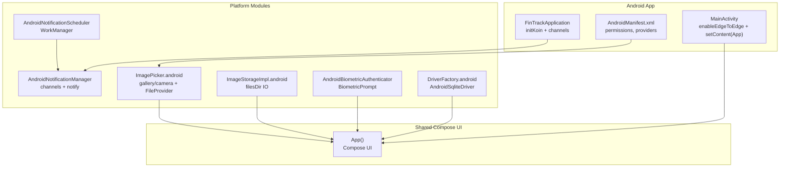

**Diagram sources**
- [FinTrackApplication.kt:10-22](file://app/src/main/java/com/kazemieh/fintrack/FinTrackApplication.kt#L10-L22)
- [MainActivity.kt:9-17](file://app/src/main/java/com/kazemieh/fintrack/MainActivity.kt#L9-L17)
- [AndroidManifest.xml:1-43](file://app/src/main/AndroidManifest.xml#L1-L43)
- [AndroidNotificationManager.kt:15-71](file://feature-share/notifications/src/androidMain/kotlin/com/kazemieh/notifications/AndroidNotificationManager.kt#L15-L71)
- [AndroidNotificationScheduler.kt:12-51](file://feature-share/notifications/src/androidMain/kotlin/com/kazemieh/notifications/AndroidNotificationScheduler.kt#L12-L51)
- [BiometricAuthenticator.android.kt:11-66](file://feature-share/lock/src/androidMain/kotlin/com/kazemieh/lock/BiometricAuthenticator.android.kt#L11-L66)
- [DriverFactory.android.kt:10-22](file://core/database/src/androidMain/kotlin/com/kazemieh/database/DriverFactory.android.kt#L10-L22)
- [ImageStorageImpl.android.kt:10-38](file://core/storage/src/androidMain/kotlin/com/kazemieh/storage/ImageStorageImpl.android.kt#L10-L38)
- [ImagePicker.android.kt:16-70](file://core/designsystem/src/androidMain/kotlin/com/kazemieh/designsystem/component/picker/ImagePicker.android.kt#L16-L70)

**Section sources**
- [FinTrackApplication.kt:10-22](file://app/src/main/java/com/kazemieh/fintrack/FinTrackApplication.kt#L10-L22)
- [MainActivity.kt:9-17](file://app/src/main/java/com/kazemieh/fintrack/MainActivity.kt#L9-L17)
- [AndroidManifest.xml:1-43](file://app/src/main/AndroidManifest.xml#L1-L43)

## Core Components
- Application initialization and DI bootstrap:
  - Initializes Koin with Android context and creates notification channels during application startup.
- Activity lifecycle:
  - Edge-to-edge UI enabled and Compose UI set as content.
- Permissions and providers:
  - Declares CAMERA and POST_NOTIFICATIONS permissions and configures FileProvider for sharing images captured by the camera.

Practical examples:
- Biometric authentication workflow: check availability, present BiometricPrompt, handle callbacks, and propagate success/error.
- Notification scheduling: compute delay, enqueue unique work, and dispatch notifications via NotificationManagerCompat.
- Image picker: choose from gallery, capture with camera, request camera permission, and resolve content URIs to byte arrays.
- Database driver: create AndroidSqliteDriver with schema synchronization and clean up legacy databases.

**Section sources**
- [FinTrackApplication.kt:14-22](file://app/src/main/java/com/kazemieh/fintrack/FinTrackApplication.kt#L14-L22)
- [MainActivity.kt:10-16](file://app/src/main/java/com/kazemieh/fintrack/MainActivity.kt#L10-L16)
- [AndroidManifest.xml:5-7](file://app/src/main/AndroidManifest.xml#L5-L7)
- [AndroidManifest.xml:32-40](file://app/src/main/AndroidManifest.xml#L32-L40)

## Architecture Overview
The Android app integrates platform-specific modules through DI. The Application initializes Koin and sets up notification channels. The Activity renders the shared Compose UI. Platform modules implement Android APIs for biometrics, notifications, image handling, and database drivers.

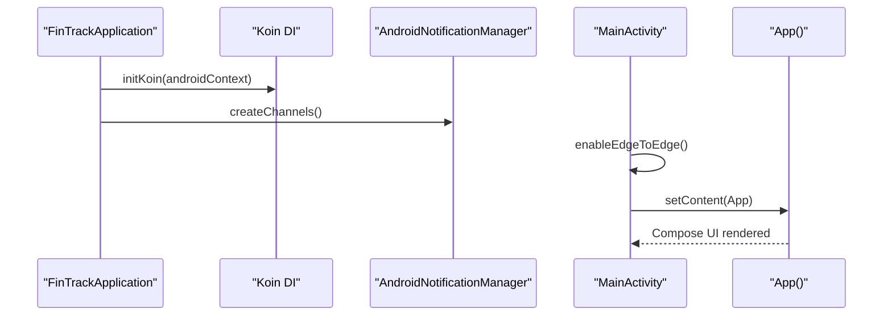

**Diagram sources**
- [FinTrackApplication.kt:17-21](file://app/src/main/java/com/kazemieh/fintrack/FinTrackApplication.kt#L17-L21)
- [MainActivity.kt:12-15](file://app/src/main/java/com/kazemieh/fintrack/MainActivity.kt#L12-L15)

## Detailed Component Analysis

### Android Application Entry Point
- Purpose: Initialize DI container and create notification channels.
- Key actions:
  - Configure Koin Android context.
  - Inject NotificationManager and create channels.

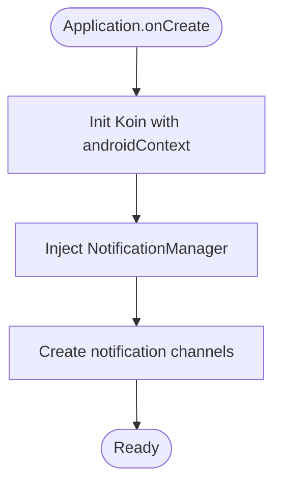

**Diagram sources**
- [FinTrackApplication.kt:14-22](file://app/src/main/java/com/kazemieh/fintrack/FinTrackApplication.kt#L14-L22)

**Section sources**
- [FinTrackApplication.kt:14-22](file://app/src/main/java/com/kazemieh/fintrack/FinTrackApplication.kt#L14-L22)

### Activity Lifecycle Management
- Purpose: Host the Compose UI with edge-to-edge visuals.
- Key actions:
  - Enable edge-to-edge layout.
  - Set Compose content to the shared App.

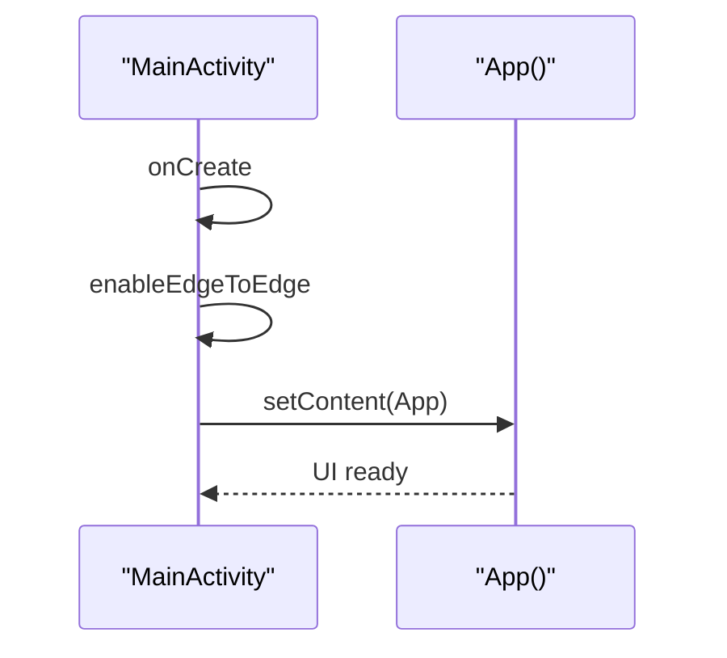

**Diagram sources**
- [MainActivity.kt:10-16](file://app/src/main/java/com/kazemieh/fintrack/MainActivity.kt#L10-L16)

**Section sources**
- [MainActivity.kt:10-16](file://app/src/main/java/com/kazemieh/fintrack/MainActivity.kt#L10-L16)

### Android-Specific Dependency Injection Modules
- Common module (Android):
  - Provides an actual platform module placeholder for Android-specific bindings.
- Notification module (Android):
  - Binds AndroidNotificationManager and AndroidNotificationScheduler as NotificationManager and NotificationScheduler singletons.
- Database module (common):
  - Creates SqlDriver via createDriver (Android-specific), constructs FinTrackDatabase, and registers local data sources.

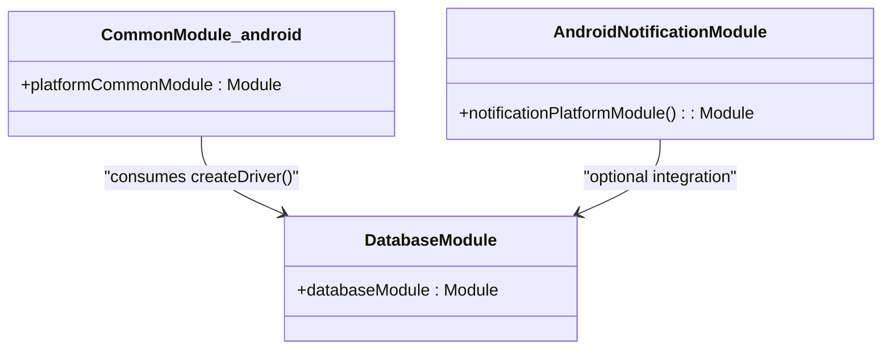

**Diagram sources**
- [CommonModule.android.kt:6-7](file://core/common/src/androidMain/kotlin/com/kazemieh/common/di/CommonModule.android.kt#L6-L7)
- [AndroidNotificationModule.kt:10-13](file://feature-share/notifications/src/androidMain/kotlin/com/kazemieh/notifications/di/AndroidNotificationModule.kt#L10-L13)
- [DatabaseModule.kt:13-31](file://core/database/src/commonMain/kotlin/com/kazemieh/database/di/DatabaseModule.kt#L13-L31)

**Section sources**
- [CommonModule.android.kt:6-7](file://core/common/src/androidMain/kotlin/com/kazemieh/common/di/CommonModule.android.kt#L6-L7)
- [AndroidNotificationModule.kt:10-13](file://feature-share/notifications/src/androidMain/kotlin/com/kazemieh/notifications/di/AndroidNotificationModule.kt#L10-L13)
- [DatabaseModule.kt:13-31](file://core/database/src/commonMain/kotlin/com/kazemieh/database/di/DatabaseModule.kt#L13-L31)

### Biometric Authentication
- Implementation: AndroidBiometricAuthenticator wraps BiometricPrompt and delegates to FragmentActivity.
- Availability check: Uses BiometricManager with strong biometrics and device credentials.
- Callback handling: Propagates success or error messages to callers.

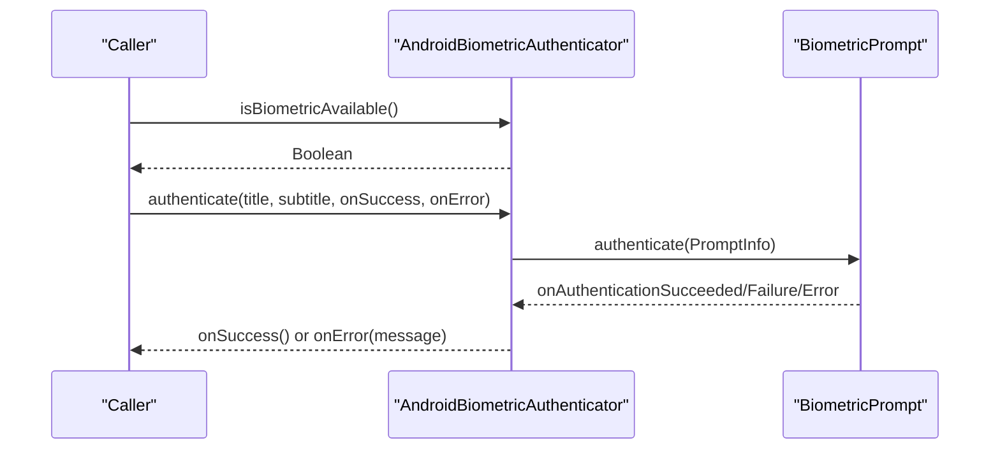

**Diagram sources**
- [BiometricAuthenticator.android.kt:15-57](file://feature-share/lock/src/androidMain/kotlin/com/kazemieh/lock/BiometricAuthenticator.android.kt#L15-L57)

**Section sources**
- [BiometricAuthenticator.android.kt:11-66](file://feature-share/lock/src/androidMain/kotlin/com/kazemieh/lock/BiometricAuthenticator.android.kt#L11-L66)

### Notification Management
- Channels: Creates budget/installment/cheque channels on Android O+.
- Permission handling: Checks POST_NOTIFICATIONS permission on T+; otherwise assumes granted.
- Delivery: Builds and posts notifications via NotificationCompat and NotificationManagerCompat.
- Settings: Opens app notification settings for user convenience.

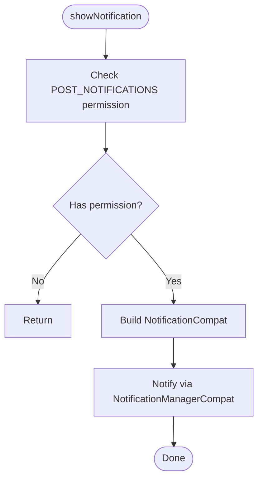

**Diagram sources**
- [AndroidNotificationManager.kt:35-47](file://feature-share/notifications/src/androidMain/kotlin/com/kazemieh/notifications/AndroidNotificationManager.kt#L35-L47)
- [AndroidNotificationManager.kt:49-58](file://feature-share/notifications/src/androidMain/kotlin/com/kazemieh/notifications/AndroidNotificationManager.kt#L49-L58)

**Section sources**
- [AndroidNotificationManager.kt:19-58](file://feature-share/notifications/src/androidMain/kotlin/com/kazemieh/notifications/AndroidNotificationManager.kt#L19-L58)

### Notification Scheduling
- Background processing: Uses WorkManager for scheduling reminders.
- Unique work policy: Replaces existing work with the same id.
- Delay calculation: Computes duration between now and target time.

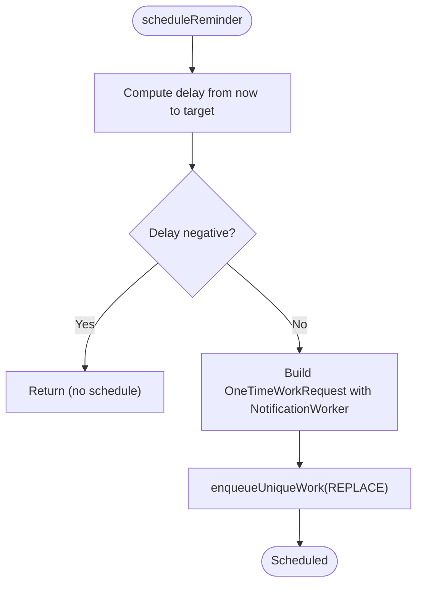

**Diagram sources**
- [AndroidNotificationScheduler.kt:16-46](file://feature-share/notifications/src/androidMain/kotlin/com/kazemieh/notifications/AndroidNotificationScheduler.kt#L16-L46)

**Section sources**
- [AndroidNotificationScheduler.kt:12-51](file://feature-share/notifications/src/androidMain/kotlin/com/kazemieh/notifications/AndroidNotificationScheduler.kt#L12-L51)

### Image Storage
- Storage location: Saves images to Context.filesDir with randomized filenames.
- Operations: Save, load, and delete images using IO dispatcher.
- Thread safety: Offloads file I/O to Dispatchers.IO.

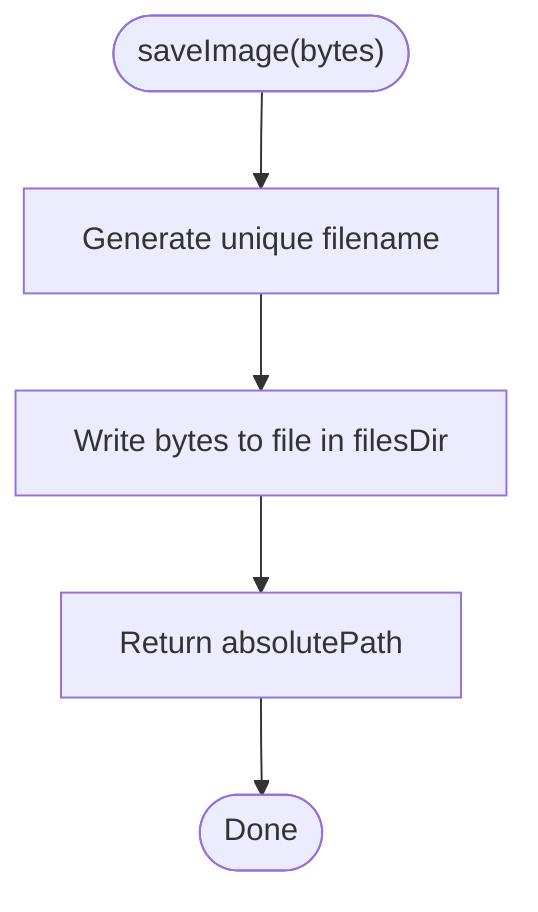

**Diagram sources**
- [ImageStorageImpl.android.kt:14-19](file://core/storage/src/androidMain/kotlin/com/kazemieh/storage/ImageStorageImpl.android.kt#L14-L19)

**Section sources**
- [ImageStorageImpl.android.kt:10-38](file://core/storage/src/androidMain/kotlin/com/kazemieh/storage/ImageStorageImpl.android.kt#L10-L38)

### Image Picker
- Gallery: Uses GetContent to select images and reads bytes from content URI.
- Camera: Uses TakePicture with a temporary file and FileProvider; requests CAMERA permission if needed.
- Provider: Configured in AndroidManifest and file_paths.xml to grant secure access.

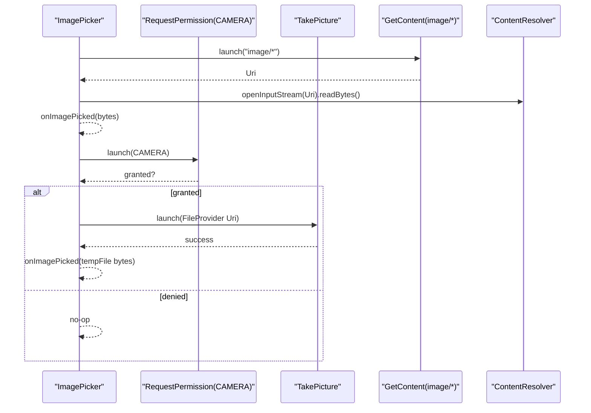

**Diagram sources**
- [ImagePicker.android.kt:28-67](file://core/designsystem/src/androidMain/kotlin/com/kazemieh/designsystem/component/picker/ImagePicker.android.kt#L28-L67)
- [AndroidManifest.xml:32-40](file://app/src/main/AndroidManifest.xml#L32-L40)
- [file_paths.xml:1-6](file://app/src/main/res/xml/file_paths.xml#L1-L6)

**Section sources**
- [ImagePicker.android.kt:16-70](file://core/designsystem/src/androidMain/kotlin/com/kazemieh/designsystem/component/picker/ImagePicker.android.kt#L16-L70)
- [AndroidManifest.xml:32-40](file://app/src/main/AndroidManifest.xml#L32-L40)
- [file_paths.xml:1-6](file://app/src/main/res/xml/file_paths.xml#L1-L6)

### Database Drivers
- Driver creation: AndroidSqliteDriver instantiated with synchronized schema and renamed database file.
- Legacy cleanup: Deletes legacy database if present before creating new driver.
- DI binding: SqlDriver provided via createDriver in Android scope.

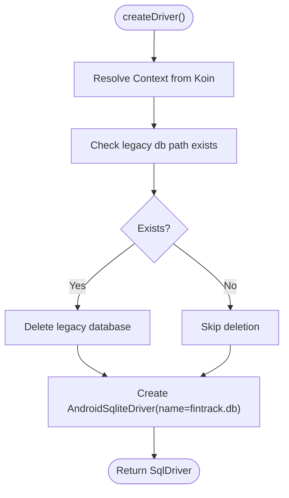

**Diagram sources**
- [DriverFactory.android.kt:10-22](file://core/database/src/androidMain/kotlin/com/kazemieh/database/DriverFactory.android.kt#L10-L22)

**Section sources**
- [DriverFactory.android.kt:10-22](file://core/database/src/androidMain/kotlin/com/kazemieh/database/DriverFactory.android.kt#L10-L22)
- [DatabaseModule.kt:13-20](file://core/database/src/commonMain/kotlin/com/kazemieh/database/di/DatabaseModule.kt#L13-L20)

## Dependency Analysis
- Application depends on DI initialization and NotificationManager to create channels.
- Activity depends on Compose UI rendering.
- ImagePicker depends on Android permissions and FileProvider configuration.
- Notification scheduler depends on WorkManager and NotificationWorker.
- Database module depends on platform driver factory.

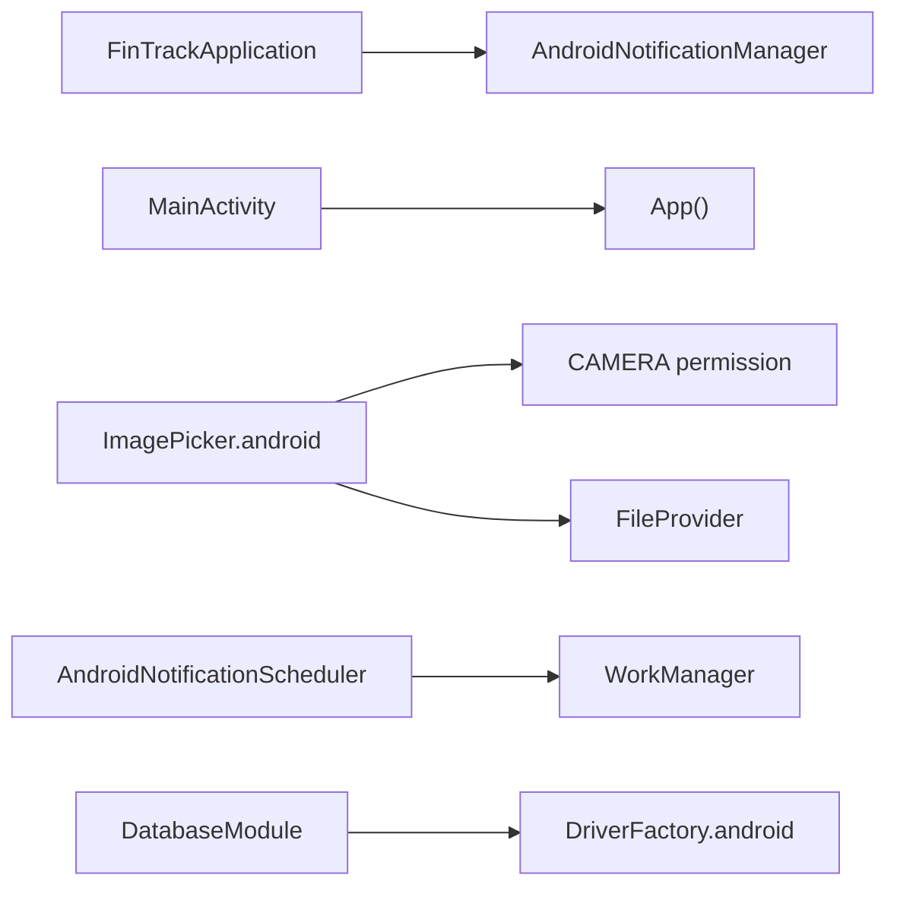

**Diagram sources**
- [FinTrackApplication.kt:12-21](file://app/src/main/java/com/kazemieh/fintrack/FinTrackApplication.kt#L12-L21)
- [MainActivity.kt:13-15](file://app/src/main/java/com/kazemieh/fintrack/MainActivity.kt#L13-L15)
- [ImagePicker.android.kt:46-67](file://core/designsystem/src/androidMain/kotlin/com/kazemieh/designsystem/component/picker/ImagePicker.android.kt#L46-L67)
- [AndroidNotificationScheduler.kt:14-14](file://feature-share/notifications/src/androidMain/kotlin/com/kazemieh/notifications/AndroidNotificationScheduler.kt#L14-L14)
- [DriverFactory.android.kt:10-22](file://core/database/src/androidMain/kotlin/com/kazemieh/database/DriverFactory.android.kt#L10-L22)

**Section sources**
- [FinTrackApplication.kt:12-21](file://app/src/main/java/com/kazemieh/fintrack/FinTrackApplication.kt#L12-L21)
- [MainActivity.kt:13-15](file://app/src/main/java/com/kazemieh/fintrack/MainActivity.kt#L13-L15)
- [ImagePicker.android.kt:46-67](file://core/designsystem/src/androidMain/kotlin/com/kazemieh/designsystem/component/picker/ImagePicker.android.kt#L46-L67)
- [AndroidNotificationScheduler.kt:14-14](file://feature-share/notifications/src/androidMain/kotlin/com/kazemieh/notifications/AndroidNotificationScheduler.kt#L14-L14)
- [DriverFactory.android.kt:10-22](file://core/database/src/androidMain/kotlin/com/kazemieh/database/DriverFactory.android.kt#L10-L22)

## Performance Considerations
- Offload I/O to Dispatchers.IO for image operations to avoid blocking the main thread.
- Use WorkManager for scheduling reminders to leverage background execution and battery-friendly constraints.
- Prefer unique work identifiers to prevent duplicate schedules and reduce overhead.
- Minimize file I/O by reusing temporary files and avoiding unnecessary conversions.

## Troubleshooting Guide
- Notifications not appearing:
  - Verify POST_NOTIFICATIONS permission on Android 13+ and ensure channels are created before posting.
  - Confirm notification settings are not disabled for the app.
- Biometric authentication fails:
  - Check device credential support and biometric enrollment; ensure Authenticators include strong biometrics and device credentials.
- Image picker issues:
  - Ensure CAMERA permission is granted before launching camera capture.
  - Confirm FileProvider authorities match package name and file_paths.xml includes cache/files paths.
- Database migration errors:
  - Review legacy database cleanup and schema synchronization; ensure driver name matches configured database file.

**Section sources**
- [AndroidNotificationManager.kt:49-70](file://feature-share/notifications/src/androidMain/kotlin/com/kazemieh/notifications/AndroidNotificationManager.kt#L49-L70)
- [BiometricAuthenticator.android.kt:15-20](file://feature-share/lock/src/androidMain/kotlin/com/kazemieh/lock/BiometricAuthenticator.android.kt#L15-L20)
- [ImagePicker.android.kt:61-67](file://core/designsystem/src/androidMain/kotlin/com/kazemieh/designsystem/component/picker/ImagePicker.android.kt#L61-L67)
- [DriverFactory.android.kt:13-16](file://core/database/src/androidMain/kotlin/com/kazemieh/database/DriverFactory.android.kt#L13-L16)

## Conclusion
FinTrack’s Android implementation leverages platform-specific modules to deliver robust features such as biometric authentication, notification management, image handling, and SQLite database access. The DI-driven architecture cleanly separates platform concerns, while AndroidManifest configurations and FileProvider ensure secure and compliant integrations. Following the Android-specific patterns and considerations outlined here will help maintain reliability, performance, and compatibility across devices.