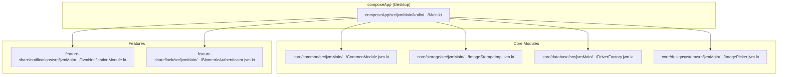
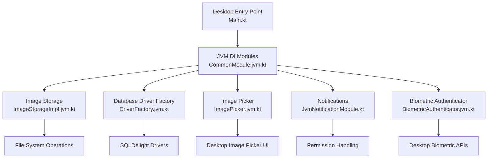
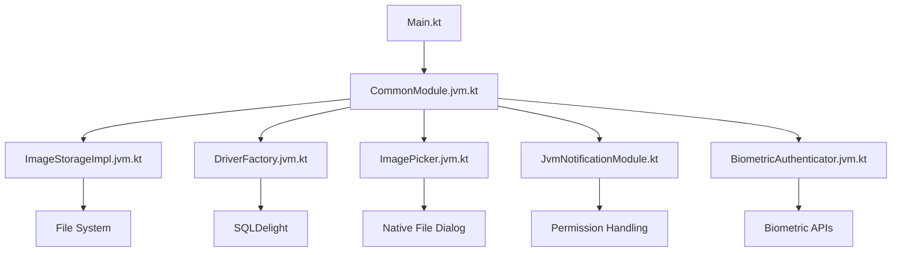

# Desktop Implementation (JVM)

<cite>
**Referenced Files in This Document**
- [Main.kt](file://composeApp/src/jvmMain/kotlin/com/kazemieh/fintrack/Main.kt)
- [CommonModule.jvm.kt](file://core/common/src/jvmMain/kotlin/com/kazemieh/common/di/CommonModule.jvm.kt)
- [ImageStorageImpl.jvm.kt](file://core/storage/src/jvmMain/kotlin/com/kazemieh/storage/ImageStorageImpl.jvm.kt)
- [ImageStorageProvider.jvm.kt](file://core/storage/src/jvmMain/kotlin/com/kazemieh/storage/ImageStorageProvider.jvm.kt)
- [DriverFactory.jvm.kt](file://core/database/src/jvmMain/kotlin/com/kazemieh/database/DriverFactory.jvm.kt)
- [ImagePicker.jvm.kt](file://core/designsystem/src/jvmMain/kotlin/com/kazemieh/designsystem/component/picker/ImagePicker.jvm.kt)
- [JvmNotificationModule.kt](file://feature-share/notifications/src/jvmMain/kotlin/com/kazemieh/notifications/di/JvmNotificationModule.kt)
- [PermissionLauncher.jvm.kt](file://feature-share/notifications/src/jvmMain/kotlin/com/kazemieh/notifications/ui/PermissionLauncher.jvm.kt)
- [PermissionRationaleHelper.jvm.kt](file://feature-share/notifications/src/jvmMain/kotlin/com/kazemieh/notifications/ui/PermissionRationaleHelper.jvm.kt)
- [BiometricAuthenticator.jvm.kt](file://feature-share/lock/src/jvmMain/kotlin/com/kazemieh/lock/BiometricAuthenticator.jvm.kt)
- [build.gradle.kts](file://composeApp/build.gradle.kts)
- [gradle.properties](file://gradle.properties)
- [settings.gradle.kts](file://settings.gradle.kts)
</cite>

## Table of Contents
1. [Introduction](#introduction)
2. [Project Structure](#project-structure)
3. [Core Components](#core-components)
4. [Architecture Overview](#architecture-overview)
5. [Detailed Component Analysis](#detailed-component-analysis)
6. [Dependency Analysis](#dependency-analysis)
7. [Performance Considerations](#performance-considerations)
8. [Troubleshooting Guide](#troubleshooting-guide)
9. [Conclusion](#conclusion)

## Introduction
This document explains FinTrack's Desktop implementation with a focus on JVM-specific features and optimizations. It covers desktop application entry points, window management, and JVM-specific dependency injection modules. It also documents desktop-specific components such as file system integration, image storage, and database drivers optimized for desktop environments. Practical examples demonstrate desktop-specific capabilities including file system operations, desktop notifications, image handling, and JVM-specific build configurations. Cross-platform compatibility considerations and desktop environment integration are addressed throughout.

## Project Structure
FinTrack uses Kotlin Multiplatform with Compose targeting desktop via the JVM. The desktop entry point is located under the JVM source set, while platform-specific modules are organized per feature and core module. The composeApp module defines the desktop application shell, and platform-specific implementations are provided under jvmMain for each core and feature module.

**Diagram sources**
- [Main.kt](file://composeApp/src/jvmMain/kotlin/com/kazemieh/fintrack/Main.kt)
- [CommonModule.jvm.kt](file://core/common/src/jvmMain/kotlin/com/kazemieh/common/di/CommonModule.jvm.kt)
- [ImageStorageImpl.jvm.kt](file://core/storage/src/jvmMain/kotlin/com/kazemieh/storage/ImageStorageImpl.jvm.kt)
- [DriverFactory.jvm.kt](file://core/database/src/jvmMain/kotlin/com/kazemieh/database/DriverFactory.jvm.kt)
- [ImagePicker.jvm.kt](file://core/designsystem/src/jvmMain/kotlin/com/kazemieh/designsystem/component/picker/ImagePicker.jvm.kt)
- [JvmNotificationModule.kt](file://feature-share/notifications/src/jvmMain/kotlin/com/kazemieh/notifications/di/JvmNotificationModule.kt)
- [BiometricAuthenticator.jvm.kt](file://feature-share/lock/src/jvmMain/kotlin/com/kazemieh/lock/BiometricAuthenticator.jvm.kt)

**Section sources**
- [Main.kt](file://composeApp/src/jvmMain/kotlin/com/kazemieh/fintrack/Main.kt)
- [build.gradle.kts](file://composeApp/build.gradle.kts)

## Core Components
This section outlines the JVM-specific building blocks that enable FinTrack on desktop:

- Desktop Application Entry Point: The JVM entry point initializes the Compose application and sets up the desktop window.
- JVM Dependency Injection Modules: Platform-specific DI modules wire desktop implementations for storage, database, notifications, and biometrics.
- Desktop Image Picker: A desktop-specific image picker integrates with the desktop file system for selecting images.
- Desktop Database Driver: A JVM-specific SQLDelight driver factory optimizes database connectivity for desktop environments.
- Desktop Image Storage: Desktop-specific image storage implementation handles local file system operations for storing and retrieving images.
- Desktop Notifications: A JVM-specific notification module provides permission handling and scheduling tailored for desktop environments.
- Desktop Biometric Authenticator: A JVM-specific authenticator integrates with desktop biometric APIs where available.

Practical examples:
- File system operations: Use the desktop image storage provider to save/load images from the local file system.
- Desktop notifications: Initialize the JVM notification module to request permissions and schedule notifications.
- Image handling: Use the desktop image picker to select images and the image storage implementation to persist them.
- JVM-specific build configurations: Configure Gradle for desktop packaging and runtime dependencies.

**Section sources**
- [CommonModule.jvm.kt](file://core/common/src/jvmMain/kotlin/com/kazemieh/common/di/CommonModule.jvm.kt)
- [ImagePicker.jvm.kt](file://core/designsystem/src/jvmMain/kotlin/com/kazemieh/designsystem/component/picker/ImagePicker.jvm.kt)
- [DriverFactory.jvm.kt](file://core/database/src/jvmMain/kotlin/com/kazemieh/database/DriverFactory.jvm.kt)
- [ImageStorageImpl.jvm.kt](file://core/storage/src/jvmMain/kotlin/com/kazemieh/storage/ImageStorageImpl.jvm.kt)
- [ImageStorageProvider.jvm.kt](file://core/storage/src/jvmMain/kotlin/com/kazemieh/storage/ImageStorageProvider.jvm.kt)
- [JvmNotificationModule.kt](file://feature-share/notifications/src/jvmMain/kotlin/com/kazemieh/notifications/di/JvmNotificationModule.kt)
- [PermissionLauncher.jvm.kt](file://feature-share/notifications/src/jvmMain/kotlin/com/kazemieh/notifications/ui/PermissionLauncher.jvm.kt)
- [PermissionRationaleHelper.jvm.kt](file://feature-share/notifications/src/jvmMain/kotlin/com/kazemieh/notifications/ui/PermissionRationaleHelper.jvm.kt)
- [BiometricAuthenticator.jvm.kt](file://feature-share/lock/src/jvmMain/kotlin/com/kazemieh/lock/BiometricAuthenticator.jvm.kt)

## Architecture Overview
The desktop architecture follows a layered approach:
- Application Layer: The JVM entry point initializes the Compose application and sets up the desktop window.
- DI Layer: JVM-specific DI modules bind platform implementations for storage, database, notifications, and biometrics.
- Feature Layer: Features consume DI-provided services and integrate with desktop-specific UI components.
- Platform Layer: Desktop-specific implementations handle file system operations, image handling, database drivers, and notifications.

**Diagram sources**
- [Main.kt](file://composeApp/src/jvmMain/kotlin/com/kazemieh/fintrack/Main.kt)
- [CommonModule.jvm.kt](file://core/common/src/jvmMain/kotlin/com/kazemieh/common/di/CommonModule.jvm.kt)
- [ImageStorageImpl.jvm.kt](file://core/storage/src/jvmMain/kotlin/com/kazemieh/storage/ImageStorageImpl.jvm.kt)
- [DriverFactory.jvm.kt](file://core/database/src/jvmMain/kotlin/com/kazemieh/database/DriverFactory.jvm.kt)
- [ImagePicker.jvm.kt](file://core/designsystem/src/jvmMain/kotlin/com/kazemieh/designsystem/component/picker/ImagePicker.jvm.kt)
- [JvmNotificationModule.kt](file://feature-share/notifications/src/jvmMain/kotlin/com/kazemieh/notifications/di/JvmNotificationModule.kt)
- [BiometricAuthenticator.jvm.kt](file://feature-share/lock/src/jvmMain/kotlin/com/kazemieh/lock/BiometricAuthenticator.jvm.kt)

## Detailed Component Analysis

### Desktop Application Entry Point
The desktop entry point initializes the Compose application and configures the desktop window. It serves as the application's startup hook and orchestrates DI module loading and UI composition.

Key responsibilities:
- Initialize Compose for Desktop
- Configure window properties and lifecycle
- Load JVM-specific DI modules
- Compose the application UI

Practical example:
- Launch the desktop application using the JVM entry point and observe the initialized window and DI-bound services.

**Section sources**
- [Main.kt](file://composeApp/src/jvmMain/kotlin/com/kazemieh/fintrack/Main.kt)

### JVM Dependency Injection Modules
JVM-specific DI modules bind platform implementations for storage, database, notifications, and biometrics. These modules ensure that desktop builds use appropriate platform services.

Key responsibilities:
- Bind desktop image storage implementation
- Bind desktop database driver factory
- Bind desktop image picker
- Bind desktop notification module
- Bind desktop biometric authenticator

Practical example:
- Include the JVM DI module in the application's DI graph to wire desktop implementations automatically.

**Section sources**
- [CommonModule.jvm.kt](file://core/common/src/jvmMain/kotlin/com/kazemieh/common/di/CommonModule.jvm.kt)

### Desktop Image Picker
The desktop image picker integrates with the desktop file system to allow users to select images. It leverages platform-specific file dialog APIs to present a native file selection experience.

Key responsibilities:
- Open a native file dialog for image selection
- Validate selected images
- Return selected image paths for further processing

Practical example:
- Invoke the desktop image picker from a UI action and receive the selected image path for storage.

**Section sources**
- [ImagePicker.jvm.kt](file://core/designsystem/src/jvmMain/kotlin/com/kazemieh/designsystem/component/picker/ImagePicker.jvm.kt)

### Desktop Image Storage
The desktop image storage implementation handles saving and loading images from the local file system. It provides APIs for storing images returned by the desktop image picker and retrieving them later.

Key responsibilities:
- Save images to the local file system
- Load images from the local file system
- Manage image metadata and paths

Practical example:
- After selecting an image via the desktop image picker, use the image storage implementation to persist the image and retrieve it for display.

**Section sources**
- [ImageStorageImpl.jvm.kt](file://core/storage/src/jvmMain/kotlin/com/kazemieh/storage/ImageStorageImpl.jvm.kt)
- [ImageStorageProvider.jvm.kt](file://core/storage/src/jvmMain/kotlin/com/kazemieh/storage/ImageStorageProvider.jvm.kt)

### Desktop Database Driver
The desktop database driver factory provides a SQLDelight driver optimized for desktop environments. It ensures efficient database connectivity and supports desktop-specific configurations.

Key responsibilities:
- Create a desktop-optimized SQLDelight driver
- Configure database connection parameters for desktop
- Support schema initialization and migrations

Practical example:
- Use the driver factory to obtain a database driver and initialize the SQLDelight database for desktop builds.

**Section sources**
- [DriverFactory.jvm.kt](file://core/database/src/jvmMain/kotlin/com/kazemieh/database/DriverFactory.jvm.kt)

### Desktop Notifications
The JVM-specific notification module provides desktop-optimized notification scheduling and permission handling. It integrates with desktop notification systems and manages user permissions.

Key responsibilities:
- Request notification permissions on desktop
- Schedule and manage notifications
- Handle permission rationale and user consent

Practical example:
- Initialize the JVM notification module during application startup and request notification permissions from the user.

**Section sources**
- [JvmNotificationModule.kt](file://feature-share/notifications/src/jvmMain/kotlin/com/kazemieh/notifications/di/JvmNotificationModule.kt)
- [PermissionLauncher.jvm.kt](file://feature-share/notifications/src/jvmMain/kotlin/com/kazemieh/notifications/ui/PermissionLauncher.jvm.kt)
- [PermissionRationaleHelper.jvm.kt](file://feature-share/notifications/src/jvmMain/kotlin/com/kazemieh/notifications/ui/PermissionRationaleHelper.jvm.kt)

### Desktop Biometric Authenticator
The desktop biometric authenticator integrates with desktop biometric APIs where available. It provides an optional layer of authentication using biometric credentials.

Key responsibilities:
- Detect availability of desktop biometric APIs
- Authenticate users via biometric input
- Handle fallbacks when biometrics are unavailable

Practical example:
- Use the desktop biometric authenticator as part of the application's lock screen flow to offer biometric authentication.

**Section sources**
- [BiometricAuthenticator.jvm.kt](file://feature-share/lock/src/jvmMain/kotlin/com/kazemieh/lock/BiometricAuthenticator.jvm.kt)

### Window Management and Desktop Environment Integration
Window management and desktop environment integration are handled by the desktop entry point and related configuration. The entry point sets up the application window, handles lifecycle events, and integrates with the desktop environment for features like system tray and notifications.

Key responsibilities:
- Configure the desktop window (size, title, icon)
- Handle window lifecycle events
- Integrate with desktop environment features (notifications, system tray)

Practical example:
- Customize the desktop window properties in the entry point and observe how the application integrates with the desktop environment.

**Section sources**
- [Main.kt](file://composeApp/src/jvmMain/kotlin/com/kazemieh/fintrack/Main.kt)

## Dependency Analysis
The desktop implementation relies on a clear separation of concerns across modules. The JVM entry point depends on DI modules that bind platform implementations. Each feature consumes DI-provided services, ensuring loose coupling and testability.

**Diagram sources**
- [Main.kt](file://composeApp/src/jvmMain/kotlin/com/kazemieh/fintrack/Main.kt)
- [CommonModule.jvm.kt](file://core/common/src/jvmMain/kotlin/com/kazemieh/common/di/CommonModule.jvm.kt)
- [ImageStorageImpl.jvm.kt](file://core/storage/src/jvmMain/kotlin/com/kazemieh/storage/ImageStorageImpl.jvm.kt)
- [DriverFactory.jvm.kt](file://core/database/src/jvmMain/kotlin/com/kazemieh/database/DriverFactory.jvm.kt)
- [ImagePicker.jvm.kt](file://core/designsystem/src/jvmMain/kotlin/com/kazemieh/designsystem/component/picker/ImagePicker.jvm.kt)
- [JvmNotificationModule.kt](file://feature-share/notifications/src/jvmMain/kotlin/com/kazemieh/notifications/di/JvmNotificationModule.kt)
- [BiometricAuthenticator.jvm.kt](file://feature-share/lock/src/jvmMain/kotlin/com/kazemieh/lock/BiometricAuthenticator.jvm.kt)

**Section sources**
- [settings.gradle.kts](file://settings.gradle.kts)
- [build.gradle.kts](file://composeApp/build.gradle.kts)

## Performance Considerations
- Image handling: Use streaming and caching strategies for large images to minimize memory footprint during desktop image operations.
- Database operations: Optimize queries and use connection pooling where applicable to improve database performance on desktop.
- UI responsiveness: Keep UI operations off the main thread and leverage asynchronous loading for heavy tasks like image processing.
- Resource management: Dispose of file handles and database connections promptly to avoid resource leaks on desktop.

## Troubleshooting Guide
Common issues and resolutions:
- Image picker not opening: Verify desktop file dialog permissions and ensure the desktop environment supports native file dialogs.
- Image storage failures: Check file system permissions and disk space availability for image persistence.
- Database driver errors: Confirm the SQLDelight driver factory is correctly configured and the database schema matches the expected version.
- Notification permission denials: Implement proper permission rationale and guide users to grant notification permissions in the desktop environment.
- Biometric authentication failures: Handle cases where desktop biometric APIs are unavailable and provide alternative authentication methods.

**Section sources**
- [ImagePicker.jvm.kt](file://core/designsystem/src/jvmMain/kotlin/com/kazemieh/designsystem/component/picker/ImagePicker.jvm.kt)
- [ImageStorageImpl.jvm.kt](file://core/storage/src/jvmMain/kotlin/com/kazemieh/storage/ImageStorageImpl.jvm.kt)
- [DriverFactory.jvm.kt](file://core/database/src/jvmMain/kotlin/com/kazemieh/database/DriverFactory.jvm.kt)
- [JvmNotificationModule.kt](file://feature-share/notifications/src/jvmMain/kotlin/com/kazemieh/notifications/di/JvmNotificationModule.kt)
- [BiometricAuthenticator.jvm.kt](file://feature-share/lock/src/jvmMain/kotlin/com/kazemieh/lock/BiometricAuthenticator.jvm.kt)

## Conclusion
FinTrack's desktop implementation leverages JVM-specific features to deliver a native desktop experience. The JVM entry point, DI modules, and platform-specific components work together to provide robust file system integration, image handling, database connectivity, notifications, and biometric authentication. By following the patterns and examples outlined in this document, developers can effectively extend and maintain the desktop implementation while preserving cross-platform compatibility.