# Platform Implementations

<cite>
**Referenced Files in This Document**
- [README.md](file://README.md)
- [settings.gradle.kts](file://settings.gradle.kts)
- [gradle/libs.versions.toml](file://gradle/libs.versions.toml)
- [composeApp/build.gradle.kts](file://composeApp/build.gradle.kts)
- [composeApp/src/androidMain/kotlin/com/kazemieh/composeApp/MainViewController.kt](file://composeApp/src/androidMain/kotlin/com/kazemieh/composeApp/MainViewController.kt)
- [composeApp/src/jvmMain/kotlin/com/kazemieh/fintrack/Main.kt](file://composeApp/src/jvmMain/kotlin/com/kazemieh/fintrack/Main.kt)
- [composeApp/src/webMain/kotlin/com/kazemieh/composeApp/main.kt](file://composeApp/src/webMain/kotlin/com/kazemieh/composeApp/main.kt)
- [composeApp/src/webMain/resources/index.html](file://composeApp/src/webMain/resources/index.html)
- [composeApp/src/webMain/resources/styles.css](file://composeApp/src/webMain/resources/styles.css)
- [core/common/src/commonMain/kotlin/com/kazemieh/common/di/CommonModule.kt](file://core/common/src/commonMain/kotlin/com/kazemieh/common/di/CommonModule.kt)
- [core/common/src/androidMain/kotlin/com/kazemieh/common/di/CommonModule.android.kt](file://core/common/src/androidMain/kotlin/com/kazemieh/common/di/CommonModule.android.kt)
- [core/common/src/iosMain/kotlin/com/kazemieh/common/di/CommonModule.ios.kt](file://core/common/src/iosMain/kotlin/com/kazemieh/common/di/CommonModule.ios.kt)
- [core/common/src/jsMain/kotlin/com/kazemieh/common/di/CommonModule.js.kt](file://core/common/src/jsMain/kotlin/com/kazemieh/common/di/CommonModule.js.kt)
- [core/common/src/jvmMain/kotlin/com/kazemieh/common/di/CommonModule.jvm.kt](file://core/common/src/jvmMain/kotlin/com/kazemieh/common/di/CommonModule.jvm.kt)
- [core/database/src/commonMain/kotlin/com/kazemieh/database/DriverFactory.kt](file://core/database/src/commonMain/kotlin/com/kazemieh/database/DriverFactory.kt)
- [core/database/src/androidMain/kotlin/com/kazemieh/database/DriverFactory.android.kt](file://core/database/src/androidMain/kotlin/com/kazemieh/database/DriverFactory.android.kt)
- [core/database/src/iosMain/kotlin/com/kazemieh/database/DriverFactory.ios.kt](file://core/database/src/iosMain/kotlin/com/kazemieh/database/DriverFactory.ios.kt)
- [core/database/src/jsMain/kotlin/com/kazemieh/database/DriverFactory.js.kt](file://core/database/src/jsMain/kotlin/com/kazemieh/database/DriverFactory.js.kt)
- [core/database/src/jvmMain/kotlin/com/kazemieh/database/DriverFactory.jvm.kt](file://core/database/src/jvmMain/kotlin/com/kazemieh/database/DriverFactory.jvm.kt)
- [core/storage/src/commonMain/kotlin/com/kazemieh/storage/ImageStorageProvider.kt](file://core/storage/src/commonMain/kotlin/com/kazemieh/storage/ImageStorageProvider.kt)
- [core/storage/src/androidMain/kotlin/com/kazemieh/storage/ImageStorageProvider.android.kt](file://core/storage/src/androidMain/kotlin/com/kazemieh/storage/ImageStorageProvider.android.kt)
- [core/storage/src/iosMain/kotlin/com/kazemieh/storage/ImageStorageProvider.ios.kt](file://core/storage/src/iosMain/kotlin/com/kazemieh/storage/ImageStorageProvider.ios.kt)
- [core/storage/src/jsMain/kotlin/com/kazemieh/storage/ImageStorageProvider.js.kt](file://core/storage/src/jsMain/kotlin/com/kazemieh/storage/ImageStorageProvider.js.kt)
- [core/storage/src/jvmMain/kotlin/com/kazemieh/storage/ImageStorageProvider.jvm.kt](file://core/storage/src/jvmMain/kotlin/com/kazemieh/storage/ImageStorageProvider.jvm.kt)
- [feature-share/notifications/src/commonMain/kotlin/com/kazemieh/notifications/NotificationManager.kt](file://feature-share/notifications/src/commonMain/kotlin/com/kazemieh/notifications/NotificationManager.kt)
- [feature-share/notifications/src/androidMain/kotlin/com/kazemieh/notifications/AndroidNotificationManager.kt](file://feature-share/notifications/src/androidMain/kotlin/com/kazemieh/notifications/AndroidNotificationManager.kt)
- [feature-share/notifications/src/iosMain/kotlin/com/kazemieh/notifications/IosNotificationManager.kt](file://feature-share/notifications/src/iosMain/kotlin/com/kazemieh/notifications/IosNotificationManager.kt)
- [feature-share/notifications/src/jvmMain/kotlin/com/kazemieh/notifications/JvmNotificationModule.kt](file://feature-share/notifications/src/jvmMain/kotlin/com/kazemieh/notifications/JvmNotificationModule.kt)
- [feature-share/notifications/src/jsMain/kotlin/com/kazemieh/notifications/JsNotificationModule.kt](file://feature-share/notifications/src/jsMain/kotlin/com/kazemieh/notifications/JsNotificationModule.kt)
- [feature-share/lock/src/commonMain/kotlin/com/kazemieh/lock/BiometricAuthenticator.kt](file://feature-share/lock/src/commonMain/kotlin/com/kazemieh/lock/BiometricAuthenticator.kt)
- [feature-share/lock/src/androidMain/kotlin/com/kazemieh/lock/BiometricAuthenticator.android.kt](file://feature-share/lock/src/androidMain/kotlin/com/kazemieh/lock/BiometricAuthenticator.android.kt)
- [feature-share/lock/src/iosMain/kotlin/com/kazemieh/lock/BiometricAuthenticator.ios.kt](file://feature-share/lock/src/iosMain/kotlin/com/kazemieh/lock/BiometricAuthenticator.ios.kt)
- [feature-share/lock/src/jsMain/kotlin/com/kazemieh/lock/BiometricAuthenticator.js.kt](file://feature-share/lock/src/jsMain/kotlin/com/kazemieh/lock/BiometricAuthenticator.js.kt)
- [feature-share/lock/src/jvmMain/kotlin/com/kazemieh/lock/BiometricAuthenticator.jvm.kt](file://feature-share/lock/src/jvmMain/kotlin/com/kazemieh/lock/BiometricAuthenticator.jvm.kt)
- [feature-container/dashboard/src/commonMain/kotlin/com/kazemieh/dashboard/DashboardScreen.kt](file://feature-container/dashboard/src/commonMain/kotlin/com/kazemieh/dashboard/DashboardScreen.kt)
- [feature-container/onboarding/src/commonMain/kotlin/com/kazemieh/onboarding/ui/OnboardingScreen.kt](file://feature-container/onboarding/src/commonMain/kotlin/com/kazemieh/onboarding/ui/OnboardingScreen.kt)
- [feature-container/profile/src/commonMain/kotlin/com/kazemieh/profile/ProfileScreen.kt](file://feature-container/profile/src/commonMain/kotlin/com/kazemieh/profile/ProfileScreen.kt)
- [feature-container/transactions/src/commonMain/kotlin/com/kazemieh/transactions/TransactionsScreen.kt](file://feature-container/transactions/src/commonMain/kotlin/com/kazemieh/transactions/TransactionsScreen.kt)
- [core/designsystem/src/commonMain/kotlin/com/kazemieh/designsystem/picker/ImagePicker.kt](file://core/designsystem/src/commonMain/kotlin/com/kazemieh/designsystem/picker/ImagePicker.kt)
- [core/designsystem/src/androidMain/kotlin/com/kazemieh/designsystem/component/picker/ImagePicker.android.kt](file://core/designsystem/src/androidMain/kotlin/com/kazemieh/designsystem/component/picker/ImagePicker.android.kt)
- [core/designsystem/src/iosMain/kotlin/com/kazemieh/designsystem/component/picker/ImagePicker.ios.kt](file://core/designsystem/src/iosMain/kotlin/com/kazemieh/designsystem/component/picker/ImagePicker.ios.kt)
- [core/designsystem/src/jsMain/kotlin/com/kazemieh/designsystem/component/picker/ImagePicker.js.kt](file://core/designsystem/src/jsMain/kotlin/com/kazemieh/designsystem/component/picker/ImagePicker.js.kt)
- [core/designsystem/src/jvmMain/kotlin/com/kazemieh/designsystem/component/picker/ImagePicker.jvm.kt](file://core/designsystem/src/jvmMain/kotlin/com/kazemieh/designsystem/component/picker/ImagePicker.jvm.kt)
</cite>

## Table of Contents
1. [Introduction](#introduction)
2. [Project Structure](#project-structure)
3. [Core Components](#core-components)
4. [Architecture Overview](#architecture-overview)
5. [Detailed Component Analysis](#detailed-component-analysis)
6. [Dependency Analysis](#dependency-analysis)
7. [Performance Considerations](#performance-considerations)
8. [Troubleshooting Guide](#troubleshooting-guide)
9. [Conclusion](#conclusion)
10. [Appendices](#appendices)

## Introduction
This document explains FinTrack’s platform-specific implementations across Android, iOS, Desktop (JVM), and Web (JS). It focuses on how the shared codebase leverages Kotlin Multiplatform Mobile (KMP) and Compose Multiplatform to deliver a unified experience while integrating with native APIs and UI patterns per platform. Topics include native interop, platform-specific DI modules, database drivers, image storage providers, biometric authentication, push notification managers, and platform UI patterns. Practical examples demonstrate differences in build configuration and deployment strategies.

## Project Structure
FinTrack organizes platform implementations under a KMP structure:
- Shared code resides in commonMain and platform-specific modules under androidMain, iosMain, jsMain, and jvmMain.
- The composeApp module hosts the Compose Multiplatform entry points for each platform.
- Feature modules and core modules expose platform-specific implementations via DI modules and native interop wrappers.

```mermaid
graph TB
subgraph "Compose Multiplatform Entry Points"
AND["Android<br/>MainViewController.kt"]
IOS["iOS<br/>MainViewController.kt"]
JVM["Desktop JVM<br/>Main.kt"]
WEB["Web JS<br/>main.kt"]
end
subgraph "Shared Modules"
COMMON["Common DI<br/>CommonModule.kt"]
DB["Database Driver Factory<br/>DriverFactory.kt"]
STORAGE["Image Storage Provider<br/>ImageStorageProvider.kt"]
BIOMETRIC["Biometric Authenticator<br/>BiometricAuthenticator.kt"]
NOTIF["Notification Manager<br/>NotificationManager.kt"]
DS["Design System Image Picker<br/>ImagePicker.kt"]
end
subgraph "Platform-Specific Implementations"
DB_ANDROID["DriverFactory.android.kt"]
DB_IOS["DriverFactory.ios.kt"]
DB_JS["DriverFactory.js.kt"]
DB_JVM["DriverFactory.jvm.kt"]
ST_ANDROID["ImageStorageProvider.android.kt"]
ST_IOS["ImageStorageProvider.ios.kt"]
ST_JS["ImageStorageProvider.js.kt"]
ST_JVM["ImageStorageProvider.jvm.kt"]
BIO_ANDROID["BiometricAuthenticator.android.kt"]
BIO_IOS["BiometricAuthenticator.ios.kt"]
BIO_JS["BiometricAuthenticator.js.kt"]
BIO_JVM["BiometricAuthenticator.jvm.kt"]
NOTIF_ANDROID["AndroidNotificationManager.kt"]
NOTIF_IOS["IosNotificationManager.kt"]
NOTIF_JVM["JvmNotificationModule.kt"]
NOTIF_JS["JsNotificationModule.kt"]
end
AND --> COMMON
AND --> DB
AND --> STORAGE
AND --> BIOMETRIC
AND --> NOTIF
AND --> DS
IOS --> COMMON
IOS --> DB
IOS --> STORAGE
IOS --> BIOMETRIC
IOS --> NOTIF
IOS --> DS
JVM --> COMMON
JVM --> DB
JVM --> STORAGE
JVM --> BIOMETRIC
JVM --> NOTIF
JVM --> DS
WEB --> COMMON
WEB --> DB
WEB --> STORAGE
WEB --> BIOMETRIC
WEB --> NOTIF
WEB --> DS
DB --> DB_ANDROID
DB --> DB_IOS
DB --> DB_JS
DB --> DB_JVM
STORAGE --> ST_ANDROID
STORAGE --> ST_IOS
STORAGE --> ST_JS
STORAGE --> ST_JVM
BIOMETRIC --> BIO_ANDROID
BIOMETRIC --> BIO_IOS
BIOMETRIC --> BIO_JS
BIOMETRIC --> BIO_JVM
NOTIF --> NOTIF_ANDROID
NOTIF --> NOTIF_IOS
NOTIF --> NOTIF_JVM
NOTIF --> NOTIF_JS
```

**Diagram sources**
- [composeApp/src/androidMain/kotlin/com/kazemieh/composeApp/MainViewController.kt:1-200](file://composeApp/src/androidMain/kotlin/com/kazemieh/composeApp/MainViewController.kt#L1-L200)
- [composeApp/src/jvmMain/kotlin/com/kazemieh/fintrack/Main.kt:1-200](file://composeApp/src/jvmMain/kotlin/com/kazemieh/fintrack/Main.kt#L1-L200)
- [composeApp/src/webMain/kotlin/com/kazemieh/composeApp/main.kt:1-200](file://composeApp/src/webMain/kotlin/com/kazemieh/composeApp/main.kt#L1-L200)
- [core/common/src/commonMain/kotlin/com/kazemieh/common/di/CommonModule.kt:1-200](file://core/common/src/commonMain/kotlin/com/kazemieh/common/di/CommonModule.kt#L1-L200)
- [core/database/src/commonMain/kotlin/com/kazemieh/database/DriverFactory.kt:1-200](file://core/database/src/commonMain/kotlin/com/kazemieh/database/DriverFactory.kt#L1-L200)
- [core/database/src/androidMain/kotlin/com/kazemieh/database/DriverFactory.android.kt:1-200](file://core/database/src/androidMain/kotlin/com/kazemieh/database/DriverFactory.android.kt#L1-L200)
- [core/database/src/iosMain/kotlin/com/kazemieh/database/DriverFactory.ios.kt:1-200](file://core/database/src/iosMain/kotlin/com/kazemieh/database/DriverFactory.ios.kt#L1-L200)
- [core/database/src/jsMain/kotlin/com/kazemieh/database/DriverFactory.js.kt:1-200](file://core/database/src/jsMain/kotlin/com/kazemieh/database/DriverFactory.js.kt#L1-L200)
- [core/database/src/jvmMain/kotlin/com/kazemieh/database/DriverFactory.jvm.kt:1-200](file://core/database/src/jvmMain/kotlin/com/kazemieh/database/DriverFactory.jvm.kt#L1-L200)
- [core/storage/src/commonMain/kotlin/com/kazemieh/storage/ImageStorageProvider.kt:1-200](file://core/storage/src/commonMain/kotlin/com/kazemieh/storage/ImageStorageProvider.kt#L1-L200)
- [core/storage/src/androidMain/kotlin/com/kazemieh/storage/ImageStorageProvider.android.kt:1-200](file://core/storage/src/androidMain/kotlin/com/kazemieh/storage/ImageStorageProvider.android.kt#L1-L200)
- [core/storage/src/iosMain/kotlin/com/kazemieh/storage/ImageStorageProvider.ios.kt:1-200](file://core/storage/src/iosMain/kotlin/com/kazemieh/storage/ImageStorageProvider.ios.kt#L1-L200)
- [core/storage/src/jsMain/kotlin/com/kazemieh/storage/ImageStorageProvider.js.kt:1-200](file://core/storage/src/jsMain/kotlin/com/kazemieh/storage/ImageStorageProvider.js.kt#L1-L200)
- [core/storage/src/jvmMain/kotlin/com/kazemieh/storage/ImageStorageProvider.jvm.kt:1-200](file://core/storage/src/jvmMain/kotlin/com/kazemieh/storage/ImageStorageProvider.jvm.kt#L1-L200)
- [feature-share/lock/src/commonMain/kotlin/com/kazemieh/lock/BiometricAuthenticator.kt:1-200](file://feature-share/lock/src/commonMain/kotlin/com/kazemieh/lock/BiometricAuthenticator.kt#L1-L200)
- [feature-share/lock/src/androidMain/kotlin/com/kazemieh/lock/BiometricAuthenticator.android.kt:1-200](file://feature-share/lock/src/androidMain/kotlin/com/kazemieh/lock/BiometricAuthenticator.android.kt#L1-L200)
- [feature-share/lock/src/iosMain/kotlin/com/kazemieh/lock/BiometricAuthenticator.ios.kt:1-200](file://feature-share/lock/src/iosMain/kotlin/com/kazemieh/lock/BiometricAuthenticator.ios.kt#L1-L200)
- [feature-share/lock/src/jsMain/kotlin/com/kazemieh/lock/BiometricAuthenticator.js.kt:1-200](file://feature-share/lock/src/jsMain/kotlin/com/kazemieh/lock/BiometricAuthenticator.js.kt#L1-L200)
- [feature-share/lock/src/jvmMain/kotlin/com/kazemieh/lock/BiometricAuthenticator.jvm.kt:1-200](file://feature-share/lock/src/jvmMain/kotlin/com/kazemieh/lock/BiometricAuthenticator.jvm.kt#L1-L200)
- [feature-share/notifications/src/commonMain/kotlin/com/kazemieh/notifications/NotificationManager.kt:1-200](file://feature-share/notifications/src/commonMain/kotlin/com/kazemieh/notifications/NotificationManager.kt#L1-L200)
- [feature-share/notifications/src/androidMain/kotlin/com/kazemieh/notifications/AndroidNotificationManager.kt:1-200](file://feature-share/notifications/src/androidMain/kotlin/com/kazemieh/notifications/AndroidNotificationManager.kt#L1-L200)
- [feature-share/notifications/src/iosMain/kotlin/com/kazemieh/notifications/IosNotificationManager.kt:1-200](file://feature-share/notifications/src/iosMain/kotlin/com/kazemieh/notifications/IosNotificationManager.kt#L1-L200)
- [feature-share/notifications/src/jvmMain/kotlin/com/kazemieh/notifications/JvmNotificationModule.kt:1-200](file://feature-share/notifications/src/jvmMain/kotlin/com/kazemieh/notifications/JvmNotificationModule.kt#L1-L200)
- [feature-share/notifications/src/jsMain/kotlin/com/kazemieh/notifications/JsNotificationModule.kt:1-200](file://feature-share/notifications/src/jsMain/kotlin/com/kazemieh/notifications/JsNotificationModule.kt#L1-L200)

**Section sources**
- [README.md:1-200](file://README.md#L1-L200)
- [settings.gradle.kts:1-200](file://settings.gradle.kts#L1-L200)
- [gradle/libs.versions.toml:1-200](file://gradle/libs.versions.toml#L1-L200)
- [composeApp/build.gradle.kts:1-200](file://composeApp/build.gradle.kts#L1-L200)

## Core Components
This section outlines the platform-specific building blocks FinTrack uses to maintain cross-platform compatibility while leveraging native capabilities.

- Common DI Modules: Platform-specific DI modules register platform implementations for database drivers, image storage, biometric authenticators, and notification managers. These modules are named consistently across platforms (e.g., CommonModule.android.kt, CommonModule.ios.kt, etc.) and are loaded by the platform entry points.
- Database Drivers: The DriverFactory exposes a common interface with platform-specific factories. This enables SQLDelight to target Android Room, iOS SQLite, JS WebSQL/SQLite, and JVM JDBC/SQLite.
- Image Storage Providers: ImageStorageProvider abstracts image persistence across platforms, with platform-specific implementations for Android, iOS, JS, and JVM.
- Biometric Authentication: BiometricAuthenticator offers a unified contract with platform-specific adapters for Android, iOS, JS, and JVM.
- Notification Managers: NotificationManager defines a cross-platform contract with platform-specific implementations for Android, iOS, JS, and JVM.
- Design System Image Picker: ImagePicker integrates with platform UI pickers for images, ensuring native UI patterns on each platform.

**Section sources**
- [core/common/src/commonMain/kotlin/com/kazemieh/common/di/CommonModule.kt:1-200](file://core/common/src/commonMain/kotlin/com/kazemieh/common/di/CommonModule.kt#L1-L200)
- [core/common/src/androidMain/kotlin/com/kazemieh/common/di/CommonModule.android.kt:1-200](file://core/common/src/androidMain/kotlin/com/kazemieh/common/di/CommonModule.android.kt#L1-L200)
- [core/common/src/iosMain/kotlin/com/kazemieh/common/di/CommonModule.ios.kt:1-200](file://core/common/src/iosMain/kotlin/com/kazemieh/common/di/CommonModule.ios.kt#L1-L200)
- [core/common/src/jsMain/kotlin/com/kazemieh/common/di/CommonModule.js.kt:1-200](file://core/common/src/jsMain/kotlin/com/kazemieh/common/di/CommonModule.js.kt#L1-L200)
- [core/common/src/jvmMain/kotlin/com/kazemieh/common/di/CommonModule.jvm.kt:1-200](file://core/common/src/jvmMain/kotlin/com/kazemieh/common/di/CommonModule.jvm.kt#L1-L200)
- [core/database/src/commonMain/kotlin/com/kazemieh/database/DriverFactory.kt:1-200](file://core/database/src/commonMain/kotlin/com/kazemieh/database/DriverFactory.kt#L1-L200)
- [core/database/src/androidMain/kotlin/com/kazemieh/database/DriverFactory.android.kt:1-200](file://core/database/src/androidMain/kotlin/com/kazemieh/database/DriverFactory.android.kt#L1-L200)
- [core/database/src/iosMain/kotlin/com/kazemieh/database/DriverFactory.ios.kt:1-200](file://core/database/src/iosMain/kotlin/com/kazemieh/database/DriverFactory.ios.kt#L1-L200)
- [core/database/src/jsMain/kotlin/com/kazemieh/database/DriverFactory.js.kt:1-200](file://core/database/src/jsMain/kotlin/com/kazemieh/database/DriverFactory.js.kt#L1-L200)
- [core/database/src/jvmMain/kotlin/com/kazemieh/database/DriverFactory.jvm.kt:1-200](file://core/database/src/jvmMain/kotlin/com/kazemieh/database/DriverFactory.jvm.kt#L1-L200)
- [core/storage/src/commonMain/kotlin/com/kazemieh/storage/ImageStorageProvider.kt:1-200](file://core/storage/src/commonMain/kotlin/com/kazemieh/storage/ImageStorageProvider.kt#L1-L200)
- [core/storage/src/androidMain/kotlin/com/kazemieh/storage/ImageStorageProvider.android.kt:1-200](file://core/storage/src/androidMain/kotlin/com/kazemieh/storage/ImageStorageProvider.android.kt#L1-L200)
- [core/storage/src/iosMain/kotlin/com/kazemieh/storage/ImageStorageProvider.ios.kt:1-200](file://core/storage/src/iosMain/kotlin/com/kazemieh/storage/ImageStorageProvider.ios.kt#L1-L200)
- [core/storage/src/jsMain/kotlin/com/kazemieh/storage/ImageStorageProvider.js.kt:1-200](file://core/storage/src/jsMain/kotlin/com/kazemieh/storage/ImageStorageProvider.js.kt#L1-L200)
- [core/storage/src/jvmMain/kotlin/com/kazemieh/storage/ImageStorageProvider.jvm.kt:1-200](file://core/storage/src/jvmMain/kotlin/com/kazemieh/storage/ImageStorageProvider.jvm.kt#L1-L200)
- [feature-share/lock/src/commonMain/kotlin/com/kazemieh/lock/BiometricAuthenticator.kt:1-200](file://feature-share/lock/src/commonMain/kotlin/com/kazemieh/lock/BiometricAuthenticator.kt#L1-L200)
- [feature-share/lock/src/androidMain/kotlin/com/kazemieh/lock/BiometricAuthenticator.android.kt:1-200](file://feature-share/lock/src/androidMain/kotlin/com/kazemieh/lock/BiometricAuthenticator.android.kt#L1-L200)
- [feature-share/lock/src/iosMain/kotlin/com/kazemieh/lock/BiometricAuthenticator.ios.kt:1-200](file://feature-share/lock/src/iosMain/kotlin/com/kazemieh/lock/BiometricAuthenticator.ios.kt#L1-L200)
- [feature-share/lock/src/jsMain/kotlin/com/kazemieh/lock/BiometricAuthenticator.js.kt:1-200](file://feature-share/lock/src/jsMain/kotlin/com/kazemieh/lock/BiometricAuthenticator.js.kt#L1-L200)
- [feature-share/lock/src/jvmMain/kotlin/com/kazemieh/lock/BiometricAuthenticator.jvm.kt:1-200](file://feature-share/lock/src/jvmMain/kotlin/com/kazemieh/lock/BiometricAuthenticator.jvm.kt#L1-L200)
- [feature-share/notifications/src/commonMain/kotlin/com/kazemieh/notifications/NotificationManager.kt:1-200](file://feature-share/notifications/src/commonMain/kotlin/com/kazemieh/notifications/NotificationManager.kt#L1-L200)
- [feature-share/notifications/src/androidMain/kotlin/com/kazemieh/notifications/AndroidNotificationManager.kt:1-200](file://feature-share/notifications/src/androidMain/kotlin/com/kazemieh/notifications/AndroidNotificationManager.kt#L1-L200)
- [feature-share/notifications/src/iosMain/kotlin/com/kazemieh/notifications/IosNotificationManager.kt:1-200](file://feature-share/notifications/src/iosMain/kotlin/com/kazemieh/notifications/IosNotificationManager.kt#L1-L200)
- [feature-share/notifications/src/jvmMain/kotlin/com/kazemieh/notifications/JvmNotificationModule.kt:1-200](file://feature-share/notifications/src/jvmMain/kotlin/com/kazemieh/notifications/JvmNotificationModule.kt#L1-L200)
- [feature-share/notifications/src/jsMain/kotlin/com/kazemieh/notifications/JsNotificationModule.kt:1-200](file://feature-share/notifications/src/jsMain/kotlin/com/kazemieh/notifications/JsNotificationModule.kt#L1-L200)
- [core/designsystem/src/commonMain/kotlin/com/kazemieh/designsystem/picker/ImagePicker.kt:1-200](file://core/designsystem/src/commonMain/kotlin/com/kazemieh/designsystem/picker/ImagePicker.kt#L1-L200)
- [core/designsystem/src/androidMain/kotlin/com/kazemieh/designsystem/component/picker/ImagePicker.android.kt:1-200](file://core/designsystem/src/androidMain/kotlin/com/kazemieh/designsystem/component/picker/ImagePicker.android.kt#L1-L200)
- [core/designsystem/src/iosMain/kotlin/com/kazemieh/designsystem/component/picker/ImagePicker.ios.kt:1-200](file://core/designsystem/src/iosMain/kotlin/com/kazemieh/designsystem/component/picker/ImagePicker.ios.kt#L1-L200)
- [core/designsystem/src/jsMain/kotlin/com/kazemieh/designsystem/component/picker/ImagePicker.js.kt:1-200](file://core/designsystem/src/jsMain/kotlin/com/kazemieh/designsystem/component/picker/ImagePicker.js.kt#L1-L200)
- [core/designsystem/src/jvmMain/kotlin/com/kazemieh/designsystem/component/picker/ImagePicker.jvm.kt:1-200](file://core/designsystem/src/jvmMain/kotlin/com/kazemieh/designsystem/component/picker/ImagePicker.jvm.kt#L1-L200)

## Architecture Overview
FinTrack’s platform implementations follow a layered architecture:
- Platform entry points initialize Compose Multiplatform and load platform-specific DI modules.
- Shared modules expose contracts and common logic; platform-specific modules implement them.
- Native interop is encapsulated behind platform-specific factories/providers to keep the common layer portable.

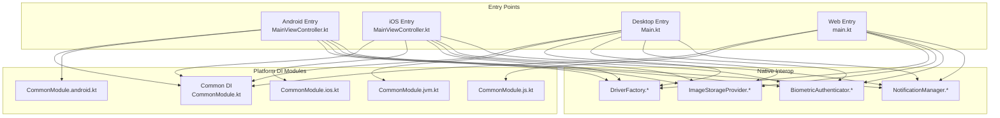

**Diagram sources**
- [composeApp/src/androidMain/kotlin/com/kazemieh/composeApp/MainViewController.kt:1-200](file://composeApp/src/androidMain/kotlin/com/kazemieh/composeApp/MainViewController.kt#L1-L200)
- [composeApp/src/jvmMain/kotlin/com/kazemieh/fintrack/Main.kt:1-200](file://composeApp/src/jvmMain/kotlin/com/kazemieh/fintrack/Main.kt#L1-L200)
- [composeApp/src/webMain/kotlin/com/kazemieh/composeApp/main.kt:1-200](file://composeApp/src/webMain/kotlin/com/kazemieh/composeApp/main.kt#L1-L200)
- [core/common/src/commonMain/kotlin/com/kazemieh/common/di/CommonModule.kt:1-200](file://core/common/src/commonMain/kotlin/com/kazemieh/common/di/CommonModule.kt#L1-L200)
- [core/common/src/androidMain/kotlin/com/kazemieh/common/di/CommonModule.android.kt:1-200](file://core/common/src/androidMain/kotlin/com/kazemieh/common/di/CommonModule.android.kt#L1-L200)
- [core/common/src/iosMain/kotlin/com/kazemieh/common/di/CommonModule.ios.kt:1-200](file://core/common/src/iosMain/kotlin/com/kazemieh/common/di/CommonModule.ios.kt#L1-L200)
- [core/common/src/jsMain/kotlin/com/kazemieh/common/di/CommonModule.js.kt:1-200](file://core/common/src/jsMain/kotlin/com/kazemieh/common/di/CommonModule.js.kt#L1-L200)
- [core/common/src/jvmMain/kotlin/com/kazemieh/common/di/CommonModule.jvm.kt:1-200](file://core/common/src/jvmMain/kotlin/com/kazemieh/common/di/CommonModule.jvm.kt#L1-L200)
- [core/database/src/commonMain/kotlin/com/kazemieh/database/DriverFactory.kt:1-200](file://core/database/src/commonMain/kotlin/com/kazemieh/database/DriverFactory.kt#L1-L200)
- [core/storage/src/commonMain/kotlin/com/kazemieh/storage/ImageStorageProvider.kt:1-200](file://core/storage/src/commonMain/kotlin/com/kazemieh/storage/ImageStorageProvider.kt#L1-L200)
- [feature-share/lock/src/commonMain/kotlin/com/kazemieh/lock/BiometricAuthenticator.kt:1-200](file://feature-share/lock/src/commonMain/kotlin/com/kazemieh/lock/BiometricAuthenticator.kt#L1-L200)
- [feature-share/notifications/src/commonMain/kotlin/com/kazemieh/notifications/NotificationManager.kt:1-200](file://feature-share/notifications/src/commonMain/kotlin/com/kazemieh/notifications/NotificationManager.kt#L1-L200)

## Detailed Component Analysis

### Android Implementation
- Entry Point: Android initializes Compose Multiplatform via a platform-specific entry point and loads the Android DI module.
- Native API Integrations:
  - Biometric Authentication: Android-specific implementation integrates with the platform’s biometric APIs.
  - Notifications: Android-specific notification manager and scheduler integrate with Android’s notification channels and work scheduling.
  - Image Picker: Android-specific image picker uses platform UI components.
- Platform-Specific Optimizations:
  - Uses Android-specific database driver factory for SQLDelight.
  - Leverages Android resource management and manifest declarations.
- Cross-Platform Compatibility:
  - Contracts remain in commonMain; Android-specific implementations are isolated in androidMain.

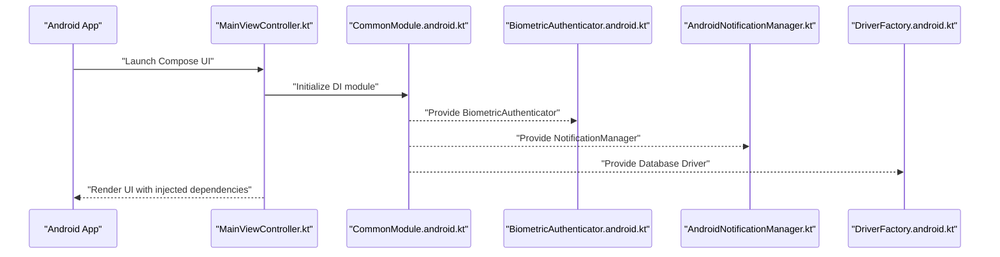

**Diagram sources**
- [composeApp/src/androidMain/kotlin/com/kazemieh/composeApp/MainViewController.kt:1-200](file://composeApp/src/androidMain/kotlin/com/kazemieh/composeApp/MainViewController.kt#L1-L200)
- [core/common/src/androidMain/kotlin/com/kazemieh/common/di/CommonModule.android.kt:1-200](file://core/common/src/androidMain/kotlin/com/kazemieh/common/di/CommonModule.android.kt#L1-L200)
- [feature-share/lock/src/androidMain/kotlin/com/kazemieh/lock/BiometricAuthenticator.android.kt:1-200](file://feature-share/lock/src/androidMain/kotlin/com/kazemieh/lock/BiometricAuthenticator.android.kt#L1-L200)
- [feature-share/notifications/src/androidMain/kotlin/com/kazemieh/notifications/AndroidNotificationManager.kt:1-200](file://feature-share/notifications/src/androidMain/kotlin/com/kazemieh/notifications/AndroidNotificationManager.kt#L1-L200)
- [core/database/src/androidMain/kotlin/com/kazemieh/database/DriverFactory.android.kt:1-200](file://core/database/src/androidMain/kotlin/com/kazemieh/database/DriverFactory.android.kt#L1-L200)

**Section sources**
- [composeApp/src/androidMain/kotlin/com/kazemieh/composeApp/MainViewController.kt:1-200](file://composeApp/src/androidMain/kotlin/com/kazemieh/composeApp/MainViewController.kt#L1-L200)
- [core/common/src/androidMain/kotlin/com/kazemieh/common/di/CommonModule.android.kt:1-200](file://core/common/src/androidMain/kotlin/com/kazemieh/common/di/CommonModule.android.kt#L1-L200)
- [feature-share/lock/src/androidMain/kotlin/com/kazemieh/lock/BiometricAuthenticator.android.kt:1-200](file://feature-share/lock/src/androidMain/kotlin/com/kazemieh/lock/BiometricAuthenticator.android.kt#L1-L200)
- [feature-share/notifications/src/androidMain/kotlin/com/kazemieh/notifications/AndroidNotificationManager.kt:1-200](file://feature-share/notifications/src/androidMain/kotlin/com/kazemieh/notifications/AndroidNotificationManager.kt#L1-L200)
- [core/database/src/androidMain/kotlin/com/kazemieh/database/DriverFactory.android.kt:1-200](file://core/database/src/androidMain/kotlin/com/kazemieh/database/DriverFactory.android.kt#L1-L200)
- [core/designsystem/src/androidMain/kotlin/com/kazemieh/designsystem/component/picker/ImagePicker.android.kt:1-200](file://core/designsystem/src/androidMain/kotlin/com/kazemieh/designsystem/component/picker/ImagePicker.android.kt#L1-L200)

### iOS Implementation
- Entry Point: iOS initializes Compose Multiplatform via a platform-specific entry point and loads the iOS DI module.
- Native API Integrations:
  - Biometric Authentication: iOS-specific implementation integrates with the platform’s local authentication APIs.
  - Notifications: iOS-specific notification manager and scheduler integrate with iOS notification permissions and scheduling.
  - Image Picker: iOS-specific image picker uses platform UI components.
- Platform-Specific Optimizations:
  - Uses iOS-specific database driver factory for SQLDelight.
  - Adheres to iOS UI patterns and lifecycle.
- Cross-Platform Compatibility:
  - Contracts remain in commonMain; iOS-specific implementations are isolated in iosMain.

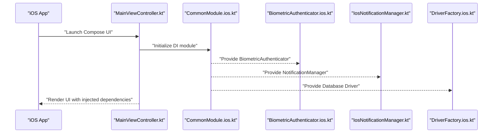

**Diagram sources**
- [composeApp/src/iosMain/kotlin/com/kazemieh/composeApp/MainViewController.kt:1-200](file://composeApp/src/iosMain/kotlin/com/kazemieh/composeApp/MainViewController.kt#L1-L200)
- [core/common/src/iosMain/kotlin/com/kazemieh/common/di/CommonModule.ios.kt:1-200](file://core/common/src/iosMain/kotlin/com/kazemieh/common/di/CommonModule.ios.kt#L1-L200)
- [feature-share/lock/src/iosMain/kotlin/com/kazemieh/lock/BiometricAuthenticator.ios.kt:1-200](file://feature-share/lock/src/iosMain/kotlin/com/kazemieh/lock/BiometricAuthenticator.ios.kt#L1-L200)
- [feature-share/notifications/src/iosMain/kotlin/com/kazemieh/notifications/IosNotificationManager.kt:1-200](file://feature-share/notifications/src/iosMain/kotlin/com/kazemieh/notifications/IosNotificationManager.kt#L1-L200)
- [core/database/src/iosMain/kotlin/com/kazemieh/database/DriverFactory.ios.kt:1-200](file://core/database/src/iosMain/kotlin/com/kazemieh/database/DriverFactory.ios.kt#L1-L200)

**Section sources**
- [composeApp/src/iosMain/kotlin/com/kazemieh/composeApp/MainViewController.kt:1-200](file://composeApp/src/iosMain/kotlin/com/kazemieh/composeApp/MainViewController.kt#L1-L200)
- [core/common/src/iosMain/kotlin/com/kazemieh/common/di/CommonModule.ios.kt:1-200](file://core/common/src/iosMain/kotlin/com/kazemieh/common/di/CommonModule.ios.kt#L1-L200)
- [feature-share/lock/src/iosMain/kotlin/com/kazemieh/lock/BiometricAuthenticator.ios.kt:1-200](file://feature-share/lock/src/iosMain/kotlin/com/kazemieh/lock/BiometricAuthenticator.ios.kt#L1-L200)
- [feature-share/notifications/src/iosMain/kotlin/com/kazemieh/notifications/IosNotificationManager.kt:1-200](file://feature-share/notifications/src/iosMain/kotlin/com/kazemieh/notifications/IosNotificationManager.kt#L1-L200)
- [core/database/src/iosMain/kotlin/com/kazemieh/database/DriverFactory.ios.kt:1-200](file://core/database/src/iosMain/kotlin/com/kazemieh/database/DriverFactory.ios.kt#L1-L200)
- [core/designsystem/src/iosMain/kotlin/com/kazemieh/designsystem/component/picker/ImagePicker.ios.kt:1-200](file://core/designsystem/src/iosMain/kotlin/com/kazemieh/designsystem/component/picker/ImagePicker.ios.kt#L1-L200)

### Desktop (JVM) Implementation
- Entry Point: Desktop initializes Compose Multiplatform via a platform-specific entry point and loads the JVM DI module.
- Native API Integrations:
  - Biometric Authentication: JVM-specific implementation adapts to desktop biometric availability.
  - Notifications: JVM-specific notification module integrates with desktop notification systems.
  - Image Picker: JVM-specific image picker uses platform UI components.
- Platform-Specific Optimizations:
  - Uses JVM-specific database driver factory for SQLDelight.
  - Leverages desktop windowing and file system APIs.
- Cross-Platform Compatibility:
  - Contracts remain in commonMain; JVM-specific implementations are isolated in jvmMain.

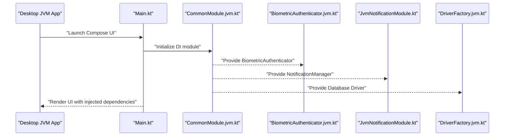

**Diagram sources**
- [composeApp/src/jvmMain/kotlin/com/kazemieh/fintrack/Main.kt:1-200](file://composeApp/src/jvmMain/kotlin/com/kazemieh/fintrack/Main.kt#L1-L200)
- [core/common/src/jvmMain/kotlin/com/kazemieh/common/di/CommonModule.jvm.kt:1-200](file://core/common/src/jvmMain/kotlin/com/kazemieh/common/di/CommonModule.jvm.kt#L1-L200)
- [feature-share/lock/src/jvmMain/kotlin/com/kazemieh/lock/BiometricAuthenticator.jvm.kt:1-200](file://feature-share/lock/src/jvmMain/kotlin/com/kazemieh/lock/BiometricAuthenticator.jvm.kt#L1-L200)
- [feature-share/notifications/src/jvmMain/kotlin/com/kazemieh/notifications/JvmNotificationModule.kt:1-200](file://feature-share/notifications/src/jvmMain/kotlin/com/kazemieh/notifications/JvmNotificationModule.kt#L1-L200)
- [core/database/src/jvmMain/kotlin/com/kazemieh/database/DriverFactory.jvm.kt:1-200](file://core/database/src/jvmMain/kotlin/com/kazemieh/database/DriverFactory.jvm.kt#L1-L200)

**Section sources**
- [composeApp/src/jvmMain/kotlin/com/kazemieh/fintrack/Main.kt:1-200](file://composeApp/src/jvmMain/kotlin/com/kazemieh/fintrack/Main.kt#L1-L200)
- [core/common/src/jvmMain/kotlin/com/kazemieh/common/di/CommonModule.jvm.kt:1-200](file://core/common/src/jvmMain/kotlin/com/kazemieh/common/di/CommonModule.jvm.kt#L1-L200)
- [feature-share/lock/src/jvmMain/kotlin/com/kazemieh/lock/BiometricAuthenticator.jvm.kt:1-200](file://feature-share/lock/src/jvmMain/kotlin/com/kazemieh/lock/BiometricAuthenticator.jvm.kt#L1-L200)
- [feature-share/notifications/src/jvmMain/kotlin/com/kazemieh/notifications/JvmNotificationModule.kt:1-200](file://feature-share/notifications/src/jvmMain/kotlin/com/kazemieh/notifications/JvmNotificationModule.kt#L1-L200)
- [core/database/src/jvmMain/kotlin/com/kazemieh/database/DriverFactory.jvm.kt:1-200](file://core/database/src/jvmMain/kotlin/com/kazemieh/database/DriverFactory.jvm.kt#L1-L200)
- [core/designsystem/src/jvmMain/kotlin/com/kazemieh/designsystem/component/picker/ImagePicker.jvm.kt:1-200](file://core/designsystem/src/jvmMain/kotlin/com/kazemieh/designsystem/component/picker/ImagePicker.jvm.kt#L1-L200)

### Web (JS) Implementation
- Entry Point: Web initializes Compose Multiplatform via a platform-specific entry point and loads the JS DI module.
- Native API Integrations:
  - Biometric Authentication: JS-specific implementation adapts to browser capabilities.
  - Notifications: JS-specific notification module integrates with browser notification permissions.
  - Image Picker: JS-specific image picker uses platform UI components.
- Platform-Specific Optimizations:
  - Uses JS-specific database driver factory for SQLDelight.
  - Leverages browser APIs and Webpack configuration for assets.
- Cross-Platform Compatibility:
  - Contracts remain in commonMain; JS-specific implementations are isolated in jsMain.

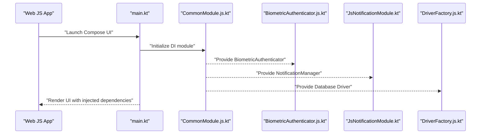

**Diagram sources**
- [composeApp/src/webMain/kotlin/com/kazemieh/composeApp/main.kt:1-200](file://composeApp/src/webMain/kotlin/com/kazemieh/composeApp/main.kt#L1-L200)
- [core/common/src/jsMain/kotlin/com/kazemieh/common/di/CommonModule.js.kt:1-200](file://core/common/src/jsMain/kotlin/com/kazemieh/common/di/CommonModule.js.kt#L1-L200)
- [feature-share/lock/src/jsMain/kotlin/com/kazemieh/lock/BiometricAuthenticator.js.kt:1-200](file://feature-share/lock/src/jsMain/kotlin/com/kazemieh/lock/BiometricAuthenticator.js.kt#L1-L200)
- [feature-share/notifications/src/jsMain/kotlin/com/kazemieh/notifications/JsNotificationModule.kt:1-200](file://feature-share/notifications/src/jsMain/kotlin/com/kazemieh/notifications/JsNotificationModule.kt#L1-L200)
- [core/database/src/jsMain/kotlin/com/kazemieh/database/DriverFactory.js.kt:1-200](file://core/database/src/jsMain/kotlin/com/kazemieh/database/DriverFactory.js.kt#L1-L200)

**Section sources**
- [composeApp/src/webMain/kotlin/com/kazemieh/composeApp/main.kt:1-200](file://composeApp/src/webMain/kotlin/com/kazemieh/composeApp/main.kt#L1-L200)
- [core/common/src/jsMain/kotlin/com/kazemieh/common/di/CommonModule.js.kt:1-200](file://core/common/src/jsMain/kotlin/com/kazemieh/common/di/CommonModule.js.kt#L1-L200)
- [feature-share/lock/src/jsMain/kotlin/com/kazemieh/lock/BiometricAuthenticator.js.kt:1-200](file://feature-share/lock/src/jsMain/kotlin/com/kazemieh/lock/BiometricAuthenticator.js.kt#L1-L200)
- [feature-share/notifications/src/jsMain/kotlin/com/kazemieh/notifications/JsNotificationModule.kt:1-200](file://feature-share/notifications/src/jsMain/kotlin/com/kazemieh/notifications/JsNotificationModule.kt#L1-L200)
- [core/database/src/jsMain/kotlin/com/kazemieh/database/DriverFactory.js.kt:1-200](file://core/database/src/jsMain/kotlin/com/kazemieh/database/DriverFactory.js.kt#L1-L200)
- [core/designsystem/src/jsMain/kotlin/com/kazemieh/designsystem/component/picker/ImagePicker.js.kt:1-200](file://core/designsystem/src/jsMain/kotlin/com/kazemieh/designsystem/component/picker/ImagePicker.js.kt#L1-L200)

### Database Drivers (SQLDelight)
- Purpose: Provide a unified database abstraction across platforms using SQLDelight.
- Implementation Details:
  - Common: DriverFactory.kt defines the shared interface.
  - Platform-Specific: DriverFactory.android.kt, DriverFactory.ios.kt, DriverFactory.js.kt, DriverFactory.jvm.kt implement platform-specific drivers.
- Cross-Platform Compatibility:
  - Contracts remain in commonMain; platform-specific drivers are isolated in platform-specific sourcesets.

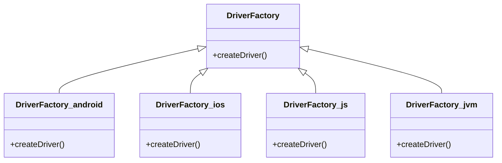

**Diagram sources**
- [core/database/src/commonMain/kotlin/com/kazemieh/database/DriverFactory.kt:1-200](file://core/database/src/commonMain/kotlin/com/kazemieh/database/DriverFactory.kt#L1-L200)
- [core/database/src/androidMain/kotlin/com/kazemieh/database/DriverFactory.android.kt:1-200](file://core/database/src/androidMain/kotlin/com/kazemieh/database/DriverFactory.android.kt#L1-L200)
- [core/database/src/iosMain/kotlin/com/kazemieh/database/DriverFactory.ios.kt:1-200](file://core/database/src/iosMain/kotlin/com/kazemieh/database/DriverFactory.ios.kt#L1-L200)
- [core/database/src/jsMain/kotlin/com/kazemieh/database/DriverFactory.js.kt:1-200](file://core/database/src/jsMain/kotlin/com/kazemieh/database/DriverFactory.js.kt#L1-L200)
- [core/database/src/jvmMain/kotlin/com/kazemieh/database/DriverFactory.jvm.kt:1-200](file://core/database/src/jvmMain/kotlin/com/kazemieh/database/DriverFactory.jvm.kt#L1-L200)

**Section sources**
- [core/database/src/commonMain/kotlin/com/kazemieh/database/DriverFactory.kt:1-200](file://core/database/src/commonMain/kotlin/com/kazemieh/database/DriverFactory.kt#L1-L200)
- [core/database/src/androidMain/kotlin/com/kazemieh/database/DriverFactory.android.kt:1-200](file://core/database/src/androidMain/kotlin/com/kazemieh/database/DriverFactory.android.kt#L1-L200)
- [core/database/src/iosMain/kotlin/com/kazemieh/database/DriverFactory.ios.kt:1-200](file://core/database/src/iosMain/kotlin/com/kazemieh/database/DriverFactory.ios.kt#L1-L200)
- [core/database/src/jsMain/kotlin/com/kazemieh/database/DriverFactory.js.kt:1-200](file://core/database/src/jsMain/kotlin/com/kazemieh/database/DriverFactory.js.kt#L1-L200)
- [core/database/src/jvmMain/kotlin/com/kazemieh/database/DriverFactory.jvm.kt:1-200](file://core/database/src/jvmMain/kotlin/com/kazemieh/database/DriverFactory.jvm.kt#L1-L200)

### Image Storage Providers
- Purpose: Abstract image persistence across platforms.
- Implementation Details:
  - Common: ImageStorageProvider.kt defines the shared interface.
  - Platform-Specific: ImageStorageProvider.android.kt, ImageStorageProvider.ios.kt, ImageStorageProvider.js.kt, ImageStorageProvider.jvm.kt implement platform-specific storage.
- Cross-Platform Compatibility:
  - Contracts remain in commonMain; platform-specific providers are isolated in platform-specific sourcesets.

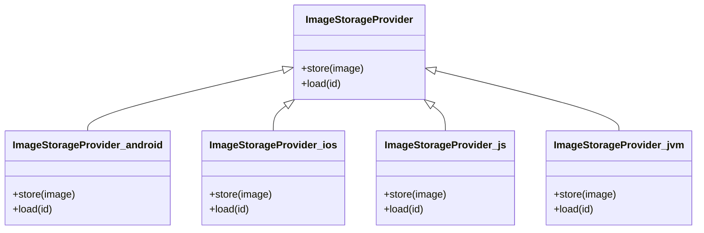

**Diagram sources**
- [core/storage/src/commonMain/kotlin/com/kazemieh/storage/ImageStorageProvider.kt:1-200](file://core/storage/src/commonMain/kotlin/com/kazemieh/storage/ImageStorageProvider.kt#L1-L200)
- [core/storage/src/androidMain/kotlin/com/kazemieh/storage/ImageStorageProvider.android.kt:1-200](file://core/storage/src/androidMain/kotlin/com/kazemieh/storage/ImageStorageProvider.android.kt#L1-L200)
- [core/storage/src/iosMain/kotlin/com/kazemieh/storage/ImageStorageProvider.ios.kt:1-200](file://core/storage/src/iosMain/kotlin/com/kazemieh/storage/ImageStorageProvider.ios.kt#L1-L200)
- [core/storage/src/jsMain/kotlin/com/kazemieh/storage/ImageStorageProvider.js.kt:1-200](file://core/storage/src/jsMain/kotlin/com/kazemieh/storage/ImageStorageProvider.js.kt#L1-L200)
- [core/storage/src/jvmMain/kotlin/com/kazemieh/storage/ImageStorageProvider.jvm.kt:1-200](file://core/storage/src/jvmMain/kotlin/com/kazemieh/storage/ImageStorageProvider.jvm.kt#L1-L200)

**Section sources**
- [core/storage/src/commonMain/kotlin/com/kazemieh/storage/ImageStorageProvider.kt:1-200](file://core/storage/src/commonMain/kotlin/com/kazemieh/storage/ImageStorageProvider.kt#L1-L200)
- [core/storage/src/androidMain/kotlin/com/kazemieh/storage/ImageStorageProvider.android.kt:1-200](file://core/storage/src/androidMain/kotlin/com/kazemieh/storage/ImageStorageProvider.android.kt#L1-L200)
- [core/storage/src/iosMain/kotlin/com/kazemieh/storage/ImageStorageProvider.ios.kt:1-200](file://core/storage/src/iosMain/kotlin/com/kazemieh/storage/ImageStorageProvider.ios.kt#L1-L200)
- [core/storage/src/jsMain/kotlin/com/kazemieh/storage/ImageStorageProvider.js.kt:1-200](file://core/storage/src/jsMain/kotlin/com/kazemieh/storage/ImageStorageProvider.js.kt#L1-L200)
- [core/storage/src/jvmMain/kotlin/com/kazemieh/storage/ImageStorageProvider.jvm.kt:1-200](file://core/storage/src/jvmMain/kotlin/com/kazemieh/storage/ImageStorageProvider.jvm.kt#L1-L200)

### Biometric Authentication
- Purpose: Provide unified biometric authentication across platforms.
- Implementation Details:
  - Common: BiometricAuthenticator.kt defines the shared interface.
  - Platform-Specific: BiometricAuthenticator.android.kt, BiometricAuthenticator.ios.kt, BiometricAuthenticator.js.kt, BiometricAuthenticator.jvm.kt implement platform-specific authentication.
- Cross-Platform Compatibility:
  - Contracts remain in commonMain; platform-specific authenticators are isolated in platform-specific sourcesets.

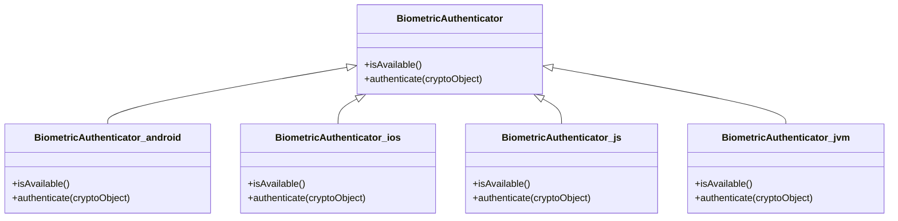

**Diagram sources**
- [feature-share/lock/src/commonMain/kotlin/com/kazemieh/lock/BiometricAuthenticator.kt:1-200](file://feature-share/lock/src/commonMain/kotlin/com/kazemieh/lock/BiometricAuthenticator.kt#L1-L200)
- [feature-share/lock/src/androidMain/kotlin/com/kazemieh/lock/BiometricAuthenticator.android.kt:1-200](file://feature-share/lock/src/androidMain/kotlin/com/kazemieh/lock/BiometricAuthenticator.android.kt#L1-L200)
- [feature-share/lock/src/iosMain/kotlin/com/kazemieh/lock/BiometricAuthenticator.ios.kt:1-200](file://feature-share/lock/src/iosMain/kotlin/com/kazemieh/lock/BiometricAuthenticator.ios.kt#L1-L200)
- [feature-share/lock/src/jsMain/kotlin/com/kazemieh/lock/BiometricAuthenticator.js.kt:1-200](file://feature-share/lock/src/jsMain/kotlin/com/kazemieh/lock/BiometricAuthenticator.js.kt#L1-L200)
- [feature-share/lock/src/jvmMain/kotlin/com/kazemieh/lock/BiometricAuthenticator.jvm.kt:1-200](file://feature-share/lock/src/jvmMain/kotlin/com/kazemieh/lock/BiometricAuthenticator.jvm.kt#L1-L200)

**Section sources**
- [feature-share/lock/src/commonMain/kotlin/com/kazemieh/lock/BiometricAuthenticator.kt:1-200](file://feature-share/lock/src/commonMain/kotlin/com/kazemieh/lock/BiometricAuthenticator.kt#L1-L200)
- [feature-share/lock/src/androidMain/kotlin/com/kazemieh/lock/BiometricAuthenticator.android.kt:1-200](file://feature-share/lock/src/androidMain/kotlin/com/kazemieh/lock/BiometricAuthenticator.android.kt#L1-L200)
- [feature-share/lock/src/iosMain/kotlin/com/kazemieh/lock/BiometricAuthenticator.ios.kt:1-200](file://feature-share/lock/src/iosMain/kotlin/com/kazemieh/lock/BiometricAuthenticator.ios.kt#L1-L200)
- [feature-share/lock/src/jsMain/kotlin/com/kazemieh/lock/BiometricAuthenticator.js.kt:1-200](file://feature-share/lock/src/jsMain/kotlin/com/kazemieh/lock/BiometricAuthenticator.js.kt#L1-L200)
- [feature-share/lock/src/jvmMain/kotlin/com/kazemieh/lock/BiometricAuthenticator.jvm.kt:1-200](file://feature-share/lock/src/jvmMain/kotlin/com/kazemieh/lock/BiometricAuthenticator.jvm.kt#L1-L200)

### Push Notifications
- Purpose: Provide unified push notification management across platforms.
- Implementation Details:
  - Common: NotificationManager.kt defines the shared interface.
  - Platform-Specific: AndroidNotificationManager.kt, IosNotificationManager.kt, JvmNotificationModule.kt, JsNotificationModule.kt implement platform-specific notification handling.
- Cross-Platform Compatibility:
  - Contracts remain in commonMain; platform-specific managers are isolated in platform-specific sourcesets.

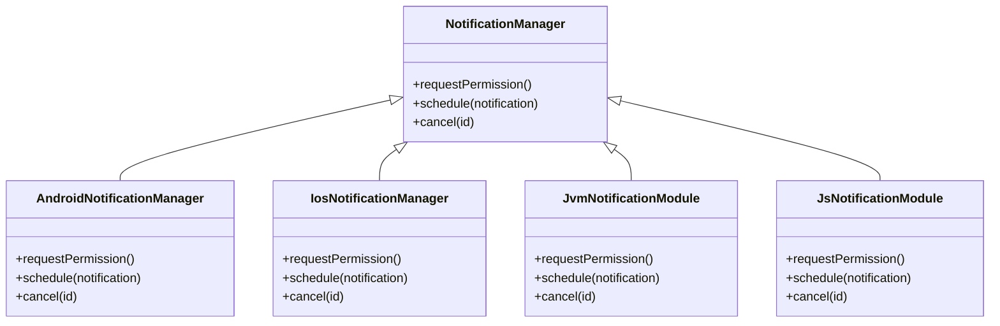

**Diagram sources**
- [feature-share/notifications/src/commonMain/kotlin/com/kazemieh/notifications/NotificationManager.kt:1-200](file://feature-share/notifications/src/commonMain/kotlin/com/kazemieh/notifications/NotificationManager.kt#L1-L200)
- [feature-share/notifications/src/androidMain/kotlin/com/kazemieh/notifications/AndroidNotificationManager.kt:1-200](file://feature-share/notifications/src/androidMain/kotlin/com/kazemieh/notifications/AndroidNotificationManager.kt#L1-L200)
- [feature-share/notifications/src/iosMain/kotlin/com/kazemieh/notifications/IosNotificationManager.kt:1-200](file://feature-share/notifications/src/iosMain/kotlin/com/kazemieh/notifications/IosNotificationManager.kt#L1-L200)
- [feature-share/notifications/src/jvmMain/kotlin/com/kazemieh/notifications/JvmNotificationModule.kt:1-200](file://feature-share/notifications/src/jvmMain/kotlin/com/kazemieh/notifications/JvmNotificationModule.kt#L1-L200)
- [feature-share/notifications/src/jsMain/kotlin/com/kazemieh/notifications/JsNotificationModule.kt:1-200](file://feature-share/notifications/src/jsMain/kotlin/com/kazemieh/notifications/JsNotificationModule.kt#L1-L200)

**Section sources**
- [feature-share/notifications/src/commonMain/kotlin/com/kazemieh/notifications/NotificationManager.kt:1-200](file://feature-share/notifications/src/commonMain/kotlin/com/kazemieh/notifications/NotificationManager.kt#L1-L200)
- [feature-share/notifications/src/androidMain/kotlin/com/kazemieh/notifications/AndroidNotificationManager.kt:1-200](file://feature-share/notifications/src/androidMain/kotlin/com/kazemieh/notifications/AndroidNotificationManager.kt#L1-L200)
- [feature-share/notifications/src/iosMain/kotlin/com/kazemieh/notifications/IosNotificationManager.kt:1-200](file://feature-share/notifications/src/iosMain/kotlin/com/kazemieh/notifications/IosNotificationManager.kt#L1-L200)
- [feature-share/notifications/src/jvmMain/kotlin/com/kazemieh/notifications/JvmNotificationModule.kt:1-200](file://feature-share/notifications/src/jvmMain/kotlin/com/kazemieh/notifications/JvmNotificationModule.kt#L1-L200)
- [feature-share/notifications/src/jsMain/kotlin/com/kazemieh/notifications/JsNotificationModule.kt:1-200](file://feature-share/notifications/src/jsMain/kotlin/com/kazemieh/notifications/JsNotificationModule.kt#L1-L200)

### Platform UI Patterns (Image Picker)
- Purpose: Integrate native image picker UI patterns per platform.
- Implementation Details:
  - Common: ImagePicker.kt defines the shared interface.
  - Platform-Specific: ImagePicker.android.kt, ImagePicker.ios.kt, ImagePicker.js.kt, ImagePicker.jvm.kt implement platform-specific pickers.
- Cross-Platform Compatibility:
  - Contracts remain in commonMain; platform-specific pickers are isolated in platform-specific sourcesets.

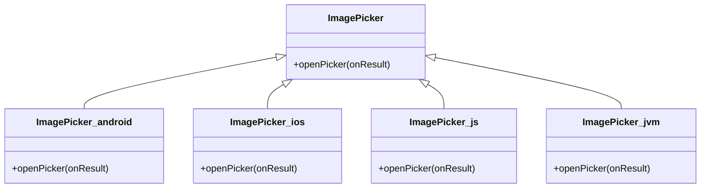

**Diagram sources**
- [core/designsystem/src/commonMain/kotlin/com/kazemieh/designsystem/picker/ImagePicker.kt:1-200](file://core/designsystem/src/commonMain/kotlin/com/kazemieh/designsystem/picker/ImagePicker.kt#L1-L200)
- [core/designsystem/src/androidMain/kotlin/com/kazemieh/designsystem/component/picker/ImagePicker.android.kt:1-200](file://core/designsystem/src/androidMain/kotlin/com/kazemieh/designsystem/component/picker/ImagePicker.android.kt#L1-L200)
- [core/designsystem/src/iosMain/kotlin/com/kazemieh/designsystem/component/picker/ImagePicker.ios.kt:1-200](file://core/designsystem/src/iosMain/kotlin/com/kazemieh/designsystem/component/picker/ImagePicker.ios.kt#L1-L200)
- [core/designsystem/src/jsMain/kotlin/com/kazemieh/designsystem/component/picker/ImagePicker.js.kt:1-200](file://core/designsystem/src/jsMain/kotlin/com/kazemieh/designsystem/component/picker/ImagePicker.js.kt#L1-L200)
- [core/designsystem/src/jvmMain/kotlin/com/kazemieh/designsystem/component/picker/ImagePicker.jvm.kt:1-200](file://core/designsystem/src/jvmMain/kotlin/com/kazemieh/designsystem/component/picker/ImagePicker.jvm.kt#L1-L200)

**Section sources**
- [core/designsystem/src/commonMain/kotlin/com/kazemieh/designsystem/picker/ImagePicker.kt:1-200](file://core/designsystem/src/commonMain/kotlin/com/kazemieh/designsystem/picker/ImagePicker.kt#L1-L200)
- [core/designsystem/src/androidMain/kotlin/com/kazemieh/designsystem/component/picker/ImagePicker.android.kt:1-200](file://core/designsystem/src/androidMain/kotlin/com/kazemieh/designsystem/component/picker/ImagePicker.android.kt#L1-L200)
- [core/designsystem/src/iosMain/kotlin/com/kazemieh/designsystem/component/picker/ImagePicker.ios.kt:1-200](file://core/designsystem/src/iosMain/kotlin/com/kazemieh/designsystem/component/picker/ImagePicker.ios.kt#L1-L200)
- [core/designsystem/src/jsMain/kotlin/com/kazemieh/designsystem/component/picker/ImagePicker.js.kt:1-200](file://core/designsystem/src/jsMain/kotlin/com/kazemieh/designsystem/component/picker/ImagePicker.js.kt#L1-L200)
- [core/designsystem/src/jvmMain/kotlin/com/kazemieh/designsystem/component/picker/ImagePicker.jvm.kt:1-200](file://core/designsystem/src/jvmMain/kotlin/com/kazemieh/designsystem/component/picker/ImagePicker.jvm.kt#L1-L200)

### Build Configurations and Deployment Strategies
- Compose Multiplatform Build: The composeApp module configures targets for Android, iOS, JVM, and JS.
- Version Catalog: Dependencies and versions are centralized in gradle/libs.versions.toml.
- Settings: The root settings.gradle.kts includes the composeApp module and other feature modules.
- Web Deployment: Web assets are served via index.html and styles.css; Webpack configuration supports SQL.js fallbacks.

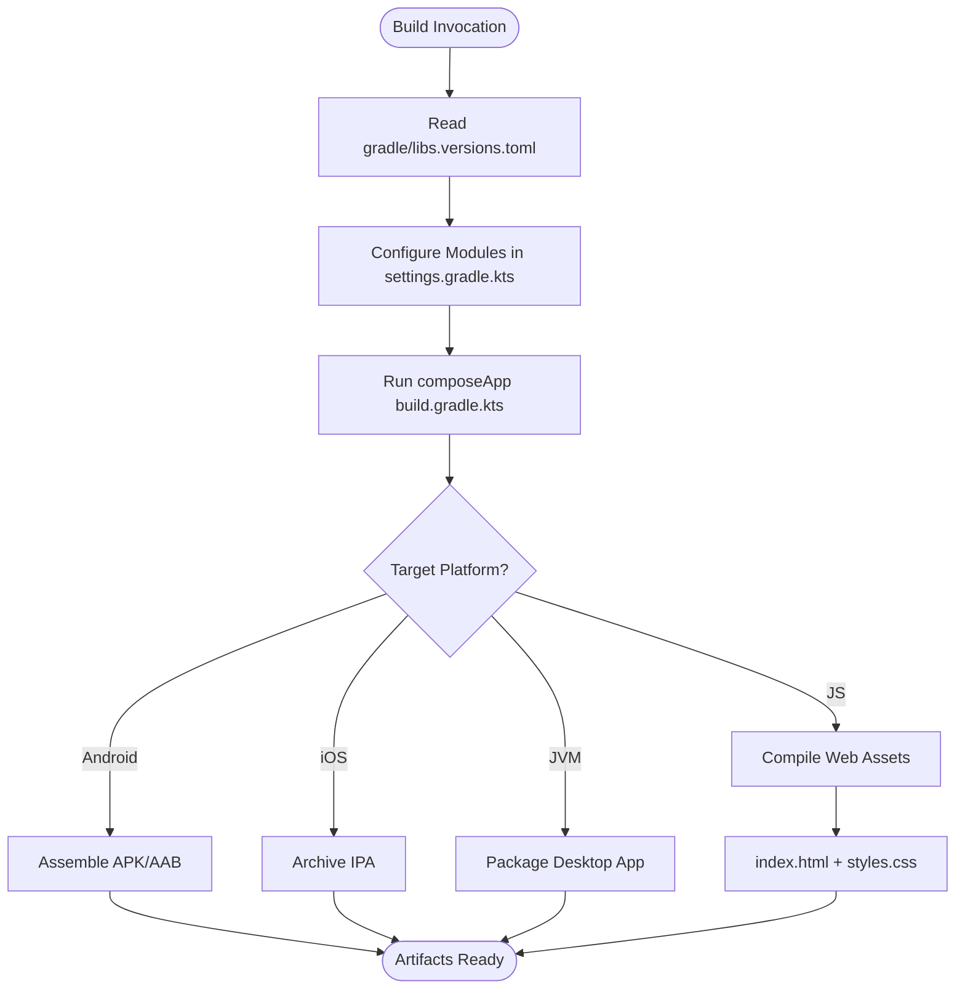

**Diagram sources**
- [gradle/libs.versions.toml:1-200](file://gradle/libs.versions.toml#L1-L200)
- [settings.gradle.kts:1-200](file://settings.gradle.kts#L1-L200)
- [composeApp/build.gradle.kts:1-200](file://composeApp/build.gradle.kts#L1-L200)
- [composeApp/src/webMain/resources/index.html:1-200](file://composeApp/src/webMain/resources/index.html#L1-L200)
- [composeApp/src/webMain/resources/styles.css:1-200](file://composeApp/src/webMain/resources/styles.css#L1-L200)

**Section sources**
- [gradle/libs.versions.toml:1-200](file://gradle/libs.versions.toml#L1-L200)
- [settings.gradle.kts:1-200](file://settings.gradle.kts#L1-L200)
- [composeApp/build.gradle.kts:1-200](file://composeApp/build.gradle.kts#L1-L200)
- [composeApp/src/webMain/resources/index.html:1-200](file://composeApp/src/webMain/resources/index.html#L1-L200)
- [composeApp/src/webMain/resources/styles.css:1-200](file://composeApp/src/webMain/resources/styles.css#L1-L200)

## Dependency Analysis
FinTrack’s platform implementations exhibit low coupling and high cohesion:
- Shared contracts in commonMain decouple platform-specific implementations.
- Platform DI modules inject platform-specific dependencies, minimizing cross-contamination.
- Native interop is encapsulated behind platform-specific factories/providers.

```mermaid
graph TB
CM["Common DI<br/>CommonModule.kt"]
CA["Common DI<br/>CommonModule.android.kt"]
CI["Common DI<br/>CommonModule.ios.kt"]
CJ["Common DI<br/>CommonModule.js.kt"]
CV["Common DI<br/>CommonModule.jvm.kt"]
DF["DriverFactory.kt"]
DFA["DriverFactory.android.kt"]
DFI["DriverFactory.ios.kt"]
DFJ["DriverFactory.js.kt"]
DFV["DriverFactory.jvm.kt"]
ISP["ImageStorageProvider.kt"]
ISPA["ImageStorageProvider.android.kt"]
ISPI["ImageStorageProvider.ios.kt"]
ISPJ["ImageStorageProvider.js.kt"]
ISPV["ImageStorageProvider.jvm.kt"]
BA["BiometricAuthenticator.kt"]
BAA["BiometricAuthenticator.android.kt"]
BAI["BiometricAuthenticator.ios.kt"]
BAJ["BiometricAuthenticator.js.kt"]
BAV["BiometricAuthenticator.jvm.kt"]
NM["NotificationManager.kt"]
NMA["AndroidNotificationManager.kt"]
NMI["IosNotificationManager.kt"]
NMJ["JsNotificationModule.kt"]
NMV["JvmNotificationModule.kt"]
CM --> CA
CM --> CI
CM --> CJ
CM --> CV
CM --> DF
DF --> DFA
DF --> DFI
DF --> DFJ
DF --> DFV
CM --> ISP
ISP --> ISPA
ISP --> ISPI
ISP --> ISPJ
ISP --> ISPV
CM --> BA
BA --> BAA
BA --> BAI
BA --> BAJ
BA --> BAV
CM --> NM
NM --> NMA
NM --> NMI
NM --> NMJ
NM --> NMV
```

**Diagram sources**
- [core/common/src/commonMain/kotlin/com/kazemieh/common/di/CommonModule.kt:1-200](file://core/common/src/commonMain/kotlin/com/kazemieh/common/di/CommonModule.kt#L1-L200)
- [core/common/src/androidMain/kotlin/com/kazemieh/common/di/CommonModule.android.kt:1-200](file://core/common/src/androidMain/kotlin/com/kazemieh/common/di/CommonModule.android.kt#L1-L200)
- [core/common/src/iosMain/kotlin/com/kazemieh/common/di/CommonModule.ios.kt:1-200](file://core/common/src/iosMain/kotlin/com/kazemieh/common/di/CommonModule.ios.kt#L1-L200)
- [core/common/src/jsMain/kotlin/com/kazemieh/common/di/CommonModule.js.kt:1-200](file://core/common/src/jsMain/kotlin/com/kazemieh/common/di/CommonModule.js.kt#L1-L200)
- [core/common/src/jvmMain/kotlin/com/kazemieh/common/di/CommonModule.jvm.kt:1-200](file://core/common/src/jvmMain/kotlin/com/kazemieh/common/di/CommonModule.jvm.kt#L1-L200)
- [core/database/src/commonMain/kotlin/com/kazemieh/database/DriverFactory.kt:1-200](file://core/database/src/commonMain/kotlin/com/kazemieh/database/DriverFactory.kt#L1-L200)
- [core/database/src/androidMain/kotlin/com/kazemieh/database/DriverFactory.android.kt:1-200](file://core/database/src/androidMain/kotlin/com/kazemieh/database/DriverFactory.android.kt#L1-L200)
- [core/database/src/iosMain/kotlin/com/kazemieh/database/DriverFactory.ios.kt:1-200](file://core/database/src/iosMain/kotlin/com/kazemieh/database/DriverFactory.ios.kt#L1-L200)
- [core/database/src/jsMain/kotlin/com/kazemieh/database/DriverFactory.js.kt:1-200](file://core/database/src/jsMain/kotlin/com/kazemieh/database/DriverFactory.js.kt#L1-L200)
- [core/database/src/jvmMain/kotlin/com/kazemieh/database/DriverFactory.jvm.kt:1-200](file://core/database/src/jvmMain/kotlin/com/kazemieh/database/DriverFactory.jvm.kt#L1-L200)
- [core/storage/src/commonMain/kotlin/com/kazemieh/storage/ImageStorageProvider.kt:1-200](file://core/storage/src/commonMain/kotlin/com/kazemieh/storage/ImageStorageProvider.kt#L1-L200)
- [core/storage/src/androidMain/kotlin/com/kazemieh/storage/ImageStorageProvider.android.kt:1-200](file://core/storage/src/androidMain/kotlin/com/kazemieh/storage/ImageStorageProvider.android.kt#L1-L200)
- [core/storage/src/iosMain/kotlin/com/kazemieh/storage/ImageStorageProvider.ios.kt:1-200](file://core/storage/src/iosMain/kotlin/com/kazemieh/storage/ImageStorageProvider.ios.kt#L1-L200)
- [core/storage/src/jsMain/kotlin/com/kazemieh/storage/ImageStorageProvider.js.kt:1-200](file://core/storage/src/jsMain/kotlin/com/kazemieh/storage/ImageStorageProvider.js.kt#L1-L200)
- [core/storage/src/jvmMain/kotlin/com/kazemieh/storage/ImageStorageProvider.jvm.kt:1-200](file://core/storage/src/jvmMain/kotlin/com/kazemieh/storage/ImageStorageProvider.jvm.kt#L1-L200)
- [feature-share/lock/src/commonMain/kotlin/com/kazemieh/lock/BiometricAuthenticator.kt:1-200](file://feature-share/lock/src/commonMain/kotlin/com/kazemieh/lock/BiometricAuthenticator.kt#L1-L200)
- [feature-share/lock/src/androidMain/kotlin/com/kazemieh/lock/BiometricAuthenticator.android.kt:1-200](file://feature-share/lock/src/androidMain/kotlin/com/kazemieh/lock/BiometricAuthenticator.android.kt#L1-L200)
- [feature-share/lock/src/iosMain/kotlin/com/kazemieh/lock/BiometricAuthenticator.ios.kt:1-200](file://feature-share/lock/src/iosMain/kotlin/com/kazemieh/lock/BiometricAuthenticator.ios.kt#L1-L200)
- [feature-share/lock/src/jsMain/kotlin/com/kazemieh/lock/BiometricAuthenticator.js.kt:1-200](file://feature-share/lock/src/jsMain/kotlin/com/kazemieh/lock/BiometricAuthenticator.js.kt#L1-L200)
- [feature-share/lock/src/jvmMain/kotlin/com/kazemieh/lock/BiometricAuthenticator.jvm.kt:1-200](file://feature-share/lock/src/jvmMain/kotlin/com/kazemieh/lock/BiometricAuthenticator.jvm.kt#L1-L200)
- [feature-share/notifications/src/commonMain/kotlin/com/kazemieh/notifications/NotificationManager.kt:1-200](file://feature-share/notifications/src/commonMain/kotlin/com/kazemieh/notifications/NotificationManager.kt#L1-L200)
- [feature-share/notifications/src/androidMain/kotlin/com/kazemieh/notifications/AndroidNotificationManager.kt:1-200](file://feature-share/notifications/src/androidMain/kotlin/com/kazemieh/notifications/AndroidNotificationManager.kt#L1-L200)
- [feature-share/notifications/src/iosMain/kotlin/com/kazemieh/notifications/IosNotificationManager.kt:1-200](file://feature-share/notifications/src/iosMain/kotlin/com/kazemieh/notifications/IosNotificationManager.kt#L1-L200)
- [feature-share/notifications/src/jvmMain/kotlin/com/kazemieh/notifications/JvmNotificationModule.kt:1-200](file://feature-share/notifications/src/jvmMain/kotlin/com/kazemieh/notifications/JvmNotificationModule.kt#L1-L200)
- [feature-share/notifications/src/jsMain/kotlin/com/kazemieh/notifications/JsNotificationModule.kt:1-200](file://feature-share/notifications/src/jsMain/kotlin/com/kazemieh/notifications/JsNotificationModule.kt#L1-L200)

**Section sources**
- [core/common/src/commonMain/kotlin/com/kazemieh/common/di/CommonModule.kt:1-200](file://core/common/src/commonMain/kotlin/com/kazemieh/common/di/CommonModule.kt#L1-L200)
- [core/database/src/commonMain/kotlin/com/kazemieh/database/DriverFactory.kt:1-200](file://core/database/src/commonMain/kotlin/com/kazemieh/database/DriverFactory.kt#L1-L200)
- [core/storage/src/commonMain/kotlin/com/kazemieh/storage/ImageStorageProvider.kt:1-200](file://core/storage/src/commonMain/kotlin/com/kazemieh/storage/ImageStorageProvider.kt#L1-L200)
- [feature-share/lock/src/commonMain/kotlin/com/kazemieh/lock/BiometricAuthenticator.kt:1-200](file://feature-share/lock/src/commonMain/kotlin/com/kazemieh/lock/BiometricAuthenticator.kt#L1-L200)
- [feature-share/notifications/src/commonMain/kotlin/com/kazemieh/notifications/NotificationManager.kt:1-200](file://feature-share/notifications/src/commonMain/kotlin/com/kazemieh/notifications/NotificationManager.kt#L1-L200)

## Performance Considerations
- Minimize Native Interop Overhead: Encapsulate native calls behind platform-specific providers to avoid repeated JNI/FFI overhead.
- Lazy Initialization: Initialize platform-specific dependencies lazily to reduce startup time.
- Resource Management: Ensure platform-specific resources (e.g., database connections, image caches) are disposed properly.
- Web Optimization: For Web targets, minimize asset sizes and leverage lazy loading for heavy components.
- JVM Desktop: Optimize desktop window rendering and file I/O operations.

## Troubleshooting Guide
- DI Module Loading Issues:
  - Verify platform-specific DI modules are included in the platform entry points.
  - Ensure DI modules are named consistently (e.g., CommonModule.android.kt).
- Native API Availability:
  - Check platform-specific availability checks before invoking native APIs (e.g., biometric availability).
- Database Driver Issues:
  - Confirm platform-specific driver factories are registered and compatible with SQLDelight schema.
- Notification Permissions:
  - Ensure permission requests are handled gracefully across platforms with appropriate user prompts.
- Image Picker Failures:
  - Validate platform-specific picker implementations and handle user cancellation scenarios.

**Section sources**
- [core/common/src/androidMain/kotlin/com/kazemieh/common/di/CommonModule.android.kt:1-200](file://core/common/src/androidMain/kotlin/com/kazemieh/common/di/CommonModule.android.kt#L1-L200)
- [core/common/src/iosMain/kotlin/com/kazemieh/common/di/CommonModule.ios.kt:1-200](file://core/common/src/iosMain/kotlin/com/kazemieh/common/di/CommonModule.ios.kt#L1-L200)
- [core/common/src/jsMain/kotlin/com/kazemieh/common/di/CommonModule.js.kt:1-200](file://core/common/src/jsMain/kotlin/com/kazemieh/common/di/CommonModule.js.kt#L1-L200)
- [core/common/src/jvmMain/kotlin/com/kazemieh/common/di/CommonModule.jvm.kt:1-200](file://core/common/src/jvmMain/kotlin/com/kazemieh/common/di/CommonModule.jvm.kt#L1-L200)
- [feature-share/lock/src/commonMain/kotlin/com/kazemieh/lock/BiometricAuthenticator.kt:1-200](file://feature-share/lock/src/commonMain/kotlin/com/kazemieh/lock/BiometricAuthenticator.kt#L1-L200)
- [feature-share/notifications/src/commonMain/kotlin/com/kazemieh/notifications/NotificationManager.kt:1-200](file://feature-share/notifications/src/commonMain/kotlin/com/kazemieh/notifications/NotificationManager.kt#L1-L200)

## Conclusion
FinTrack’s platform implementations demonstrate a robust KMP and Compose Multiplatform architecture. By isolating platform-specific logic behind contracts and DI modules, the project achieves strong cross-platform compatibility while leveraging native capabilities. The consistent naming and modular structure simplify maintenance and onboarding for new contributors. Platform-specific features like biometric authentication, push notifications, and UI pickers are cleanly abstracted, enabling scalable evolution across Android, iOS, Desktop (JVM), and Web (JS).

## Appendices
- Practical Examples:
  - Android: Initialize Compose UI and load the Android DI module; integrate Android biometric APIs and notification channels.
  - iOS: Initialize Compose UI and load the iOS DI module; integrate iOS local authentication and notification permissions.
  - Desktop JVM: Initialize Compose UI and load the JVM DI module; integrate desktop biometric availability and notification systems.
  - Web JS: Initialize Compose UI and load the JS DI module; integrate browser notification permissions and image picker UI patterns.
- Build and Deployment:
  - Centralize versions in gradle/libs.versions.toml.
  - Include composeApp and feature modules in settings.gradle.kts.
  - For Web, ensure index.html and styles.css are present and Webpack configuration supports SQL.js fallbacks.