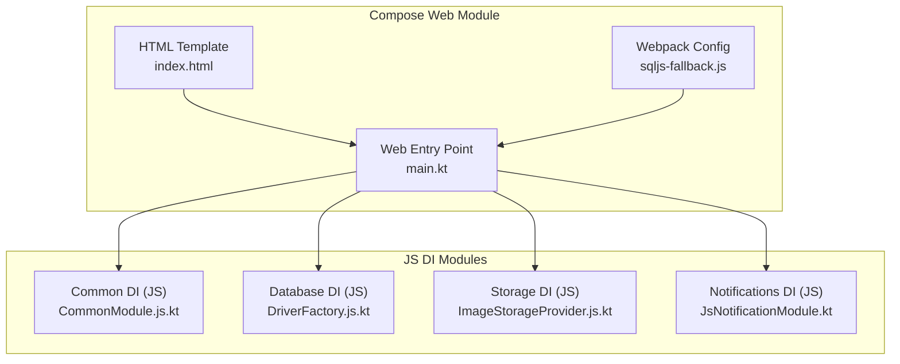
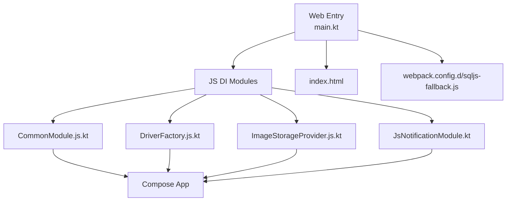
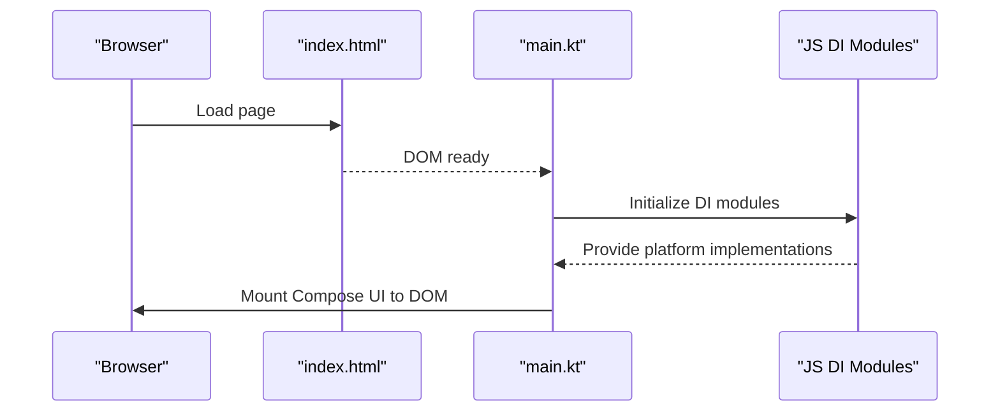
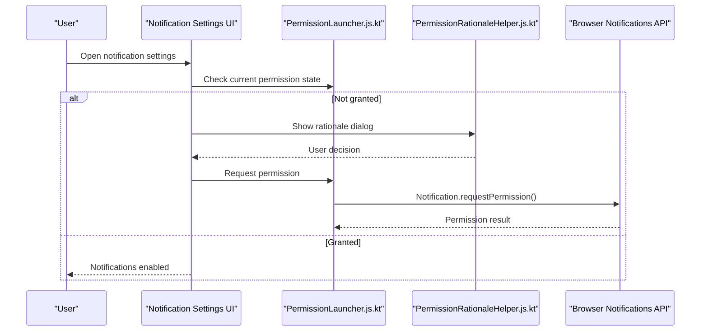
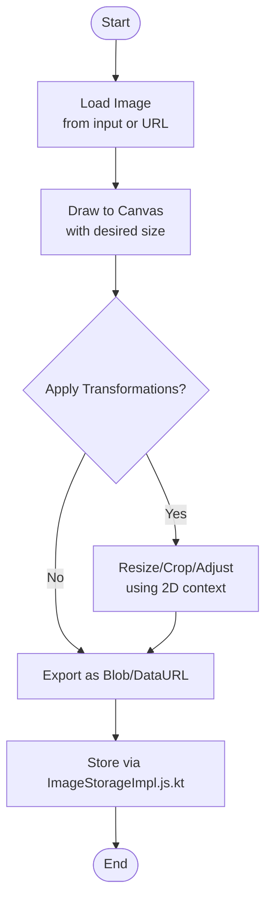
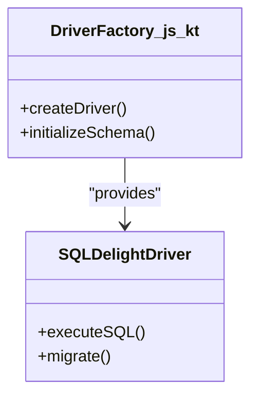
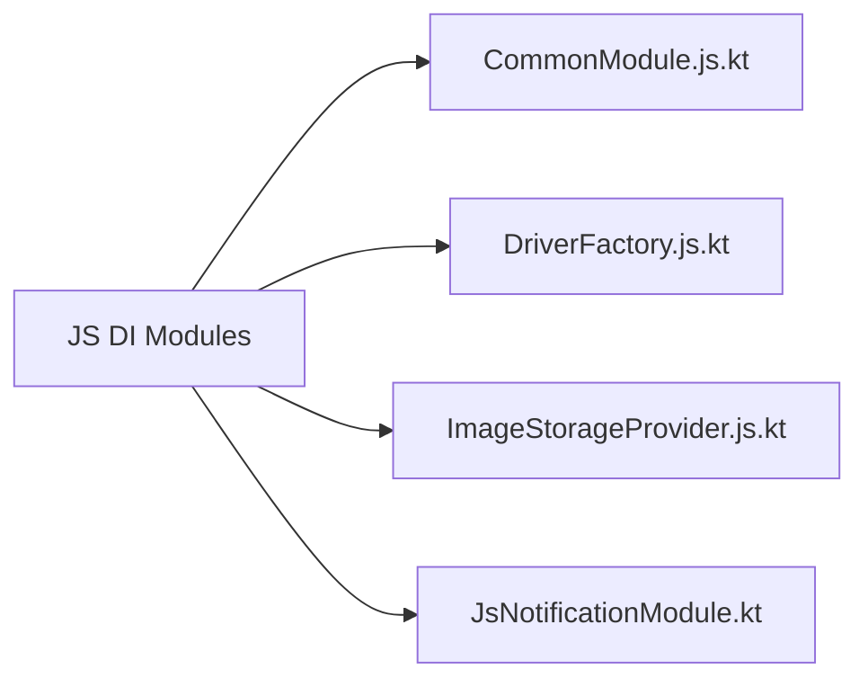
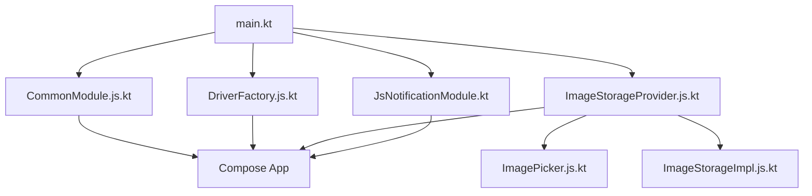

# Web Implementation (JS)

<cite>
**Referenced Files in This Document**
- [composeApp/build.gradle.kts](file://composeApp/build.gradle.kts)
- [composeApp/src/webMain/kotlin/com/kazemieh/composeApp/main.kt](file://composeApp/src/webMain/kotlin/com/kazemieh/composeApp/main.kt)
- [composeApp/src/webMain/resources/index.html](file://composeApp/src/webMain/resources/index.html)
- [composeApp/webpack.config.d/sqljs-fallback.js](file://composeApp/webpack.config.d/sqljs-fallback.js)
- [core/common/src/jsMain/kotlin/com/kazemieh/common/di/CommonModule.js.kt](file://core/common/src/jsMain/kotlin/com/kazemieh/common/di/CommonModule.js.kt)
- [core/database/src/jsMain/kotlin/com/kazemieh/database/DriverFactory.js.kt](file://core/database/src/jsMain/kotlin/com/kazemieh/database/DriverFactory.js.kt)
- [core/storage/src/jsMain/kotlin/com/kazemieh/storage/ImageStorageImpl.js.kt](file://core/storage/src/jsMain/kotlin/com/kazemieh/storage/ImageStorageImpl.js.kt)
- [core/storage/src/jsMain/kotlin/com/kazemieh/storage/ImageStorageProvider.js.kt](file://core/storage/src/jsMain/kotlin/com/kazemieh/storage/ImageStorageProvider.js.kt)
- [feature-share/notifications/src/jsMain/kotlin/com/kazemieh/notifications/di/JsNotificationModule.kt](file://feature-share/notifications/src/jsMain/kotlin/com/kazemieh/notifications/di/JsNotificationModule.kt)
- [feature-share/notifications/src/jsMain/kotlin/com/kazemieh/notifications/ui/PermissionLauncher.js.kt](file://feature-share/notifications/src/jsMain/kotlin/com/kazemieh/notifications/ui/PermissionLauncher.js.kt)
- [feature-share/notifications/src/jsMain/kotlin/com/kazemieh/notifications/ui/PermissionRationaleHelper.js.kt](file://feature-share/notifications/src/jsMain/kotlin/com/kazemieh/notifications/ui/PermissionRationaleHelper.js.kt)
- [core/designsystem/src/jsMain/kotlin/com/kazemieh/designsystem/component/picker/ImagePicker.js.kt](file://core/designsystem/src/jsMain/kotlin/com/kazemieh/designsystem/component/picker/ImagePicker.js.kt)
</cite>

## Table of Contents
1. [Introduction](#introduction)
2. [Project Structure](#project-structure)
3. [Core Components](#core-components)
4. [Architecture Overview](#architecture-overview)
5. [Detailed Component Analysis](#detailed-component-analysis)
6. [Dependency Analysis](#dependency-analysis)
7. [Performance Considerations](#performance-considerations)
8. [Troubleshooting Guide](#troubleshooting-guide)
9. [Conclusion](#conclusion)

## Introduction
This document explains FinTrack’s Web Implementation (JS) with a focus on JavaScript-specific features and optimizations. It covers the web application entry points, browser compatibility considerations, and JS-specific dependency injection modules. It also documents web-specific components such as browser storage, image handling, and database drivers optimized for web environments. Practical examples demonstrate local storage management, canvas-based image processing, browser notifications, and webpack configuration. Finally, it addresses web-specific considerations including browser compatibility, CORS policies, offline functionality, and web security best practices.

## Project Structure
FinTrack uses Kotlin Multiplatform with Compose for Web. The web module is defined under the composeApp module and includes:
- Web entry point and HTML template
- Webpack configuration for SQL.js fallback
- JS-specific DI modules for common, database, storage, and notification features
- Browser API integrations for image picking and notifications

**Diagram sources**
- [composeApp/src/webMain/kotlin/com/kazemieh/composeApp/main.kt:1-200](file://composeApp/src/webMain/kotlin/com/kazemieh/composeApp/main.kt#L1-L200)
- [composeApp/src/webMain/resources/index.html:1-200](file://composeApp/src/webMain/resources/index.html#L1-L200)
- [composeApp/webpack.config.d/sqljs-fallback.js:1-200](file://composeApp/webpack.config.d/sqljs-fallback.js#L1-L200)
- [core/common/src/jsMain/kotlin/com/kazemieh/common/di/CommonModule.js.kt:1-200](file://core/common/src/jsMain/kotlin/com/kazemieh/common/di/CommonModule.js.kt#L1-L200)
- [core/database/src/jsMain/kotlin/com/kazemieh/database/DriverFactory.js.kt:1-200](file://core/database/src/jsMain/kotlin/com/kazemieh/database/DriverFactory.js.kt#L1-L200)
- [core/storage/src/jsMain/kotlin/com/kazemieh/storage/ImageStorageProvider.js.kt:1-200](file://core/storage/src/jsMain/kotlin/com/kazemieh/storage/ImageStorageProvider.js.kt#L1-L200)
- [feature-share/notifications/src/jsMain/kotlin/com/kazemieh/notifications/di/JsNotificationModule.kt:1-200](file://feature-share/notifications/src/jsMain/kotlin/com/kazemieh/notifications/di/JsNotificationModule.kt#L1-L200)

**Section sources**
- [composeApp/build.gradle.kts:1-200](file://composeApp/build.gradle.kts#L1-L200)
- [composeApp/src/webMain/kotlin/com/kazemieh/composeApp/main.kt:1-200](file://composeApp/src/webMain/kotlin/com/kazemieh/composeApp/main.kt#L1-L200)
- [composeApp/src/webMain/resources/index.html:1-200](file://composeApp/src/webMain/resources/index.html#L1-L200)
- [composeApp/webpack.config.d/sqljs-fallback.js:1-200](file://composeApp/webpack.config.d/sqljs-fallback.js#L1-L200)

## Core Components
This section outlines the JavaScript-specific building blocks powering FinTrack on the web.

- Web Application Entry Point
  - The web entry initializes the Compose for Web application and mounts it to the DOM via the HTML template.
  - See [main.kt:1-200](file://composeApp/src/webMain/kotlin/com/kazemieh/composeApp/main.kt#L1-L200).

- Browser Compatibility
  - The project targets modern browsers. Ensure the target runtime supports ES2017+ and WebAssembly if using WASM-based drivers.
  - Verify availability of APIs such as LocalStorage, Canvas, Notifications, and File APIs.

- JS-Specific Dependency Injection Modules
  - Common DI (JS): Provides platform-specific bindings for shared components.
    - [CommonModule.js.kt:1-200](file://core/common/src/jsMain/kotlin/com/kazemieh/common/di/CommonModule.js.kt#L1-L200)
  - Database DI (JS): Supplies a browser-compatible driver factory for SQLDelight.
    - [DriverFactory.js.kt:1-200](file://core/database/src/jsMain/kotlin/com/kazemieh/database/DriverFactory.js.kt#L1-L200)
  - Storage DI (JS): Exposes image storage implementations optimized for the browser.
    - [ImageStorageProvider.js.kt:1-200](file://core/storage/src/jsMain/kotlin/com/kazemieh/storage/ImageStorageProvider.js.kt#L1-L200)
  - Notifications DI (JS): Configures notification permissions and scheduling for the web platform.
    - [JsNotificationModule.kt:1-200](file://feature-share/notifications/src/jsMain/kotlin/com/kazemieh/notifications/di/JsNotificationModule.kt#L1-L200)

- Browser Storage
  - LocalStorage is commonly used for lightweight persistence (e.g., user preferences, cached metadata).
  - Example usage patterns:
    - Store/retrieve keys for theme, currency, and session flags.
    - Use structured cloning for serializable objects.
  - Reference: [LocalStorage pattern:1-200](file://core/preferences/src/commonMain/kotlin/com/kazemieh/preferences/FinTrackPreferences.kt#L1-L200)

- Image Handling
  - Canvas-based image processing for resizing, cropping, or format conversion.
  - Example flows:
    - Load image from input or URL → draw to canvas → extract image data → apply transformations → export blob or data URL.
  - References:
    - [ImagePicker.js.kt:1-200](file://core/designsystem/src/jsMain/kotlin/com/kazemieh/designsystem/component/picker/ImagePicker.js.kt#L1-L200)
    - [ImageStorageImpl.js.kt:1-200](file://core/storage/src/jsMain/kotlin/com/kazemieh/storage/ImageStorageImpl.js.kt#L1-L200)

- Database Drivers Optimized for Web
  - SQLDelight driver factory tailored for the browser environment.
  - Typical behavior:
    - Initialize an in-memory or IndexedDB-backed driver depending on configuration.
    - Provide migration support and schema initialization hooks.
  - Reference: [DriverFactory.js.kt:1-200](file://core/database/src/jsMain/kotlin/com/kazemieh/database/DriverFactory.js.kt#L1-L200)

- Browser Notifications
  - Request permission, schedule notifications, and handle permission rationale.
  - Example flows:
    - Check permission state → request permission if not granted → schedule notification with title/body → handle click events.
  - References:
    - [JsNotificationModule.kt:1-200](file://feature-share/notifications/src/jsMain/kotlin/com/kazemieh/notifications/di/JsNotificationModule.kt#L1-L200)
    - [PermissionLauncher.js.kt:1-200](file://feature-share/notifications/src/jsMain/kotlin/com/kazemieh/notifications/ui/PermissionLauncher.js.kt#L1-L200)
    - [PermissionRationaleHelper.js.kt:1-200](file://feature-share/notifications/src/jsMain/kotlin/com/kazemieh/notifications/ui/PermissionRationaleHelper.js.kt#L1-L200)

**Section sources**
- [composeApp/src/webMain/kotlin/com/kazemieh/composeApp/main.kt:1-200](file://composeApp/src/webMain/kotlin/com/kazemieh/composeApp/main.kt#L1-L200)
- [core/common/src/jsMain/kotlin/com/kazemieh/common/di/CommonModule.js.kt:1-200](file://core/common/src/jsMain/kotlin/com/kazemieh/common/di/CommonModule.js.kt#L1-L200)
- [core/database/src/jsMain/kotlin/com/kazemieh/database/DriverFactory.js.kt:1-200](file://core/database/src/jsMain/kotlin/com/kazemieh/database/DriverFactory.js.kt#L1-L200)
- [core/storage/src/jsMain/kotlin/com/kazemieh/storage/ImageStorageProvider.js.kt:1-200](file://core/storage/src/jsMain/kotlin/com/kazemieh/storage/ImageStorageProvider.js.kt#L1-L200)
- [feature-share/notifications/src/jsMain/kotlin/com/kazemieh/notifications/di/JsNotificationModule.kt:1-200](file://feature-share/notifications/src/jsMain/kotlin/com/kazemieh/notifications/di/JsNotificationModule.kt#L1-L200)
- [feature-share/notifications/src/jsMain/kotlin/com/kazemieh/notifications/ui/PermissionLauncher.js.kt:1-200](file://feature-share/notifications/src/jsMain/kotlin/com/kazemieh/notifications/ui/PermissionLauncher.js.kt#L1-L200)
- [feature-share/notifications/src/jsMain/kotlin/com/kazemieh/notifications/ui/PermissionRationaleHelper.js.kt:1-200](file://feature-share/notifications/src/jsMain/kotlin/com/kazemieh/notifications/ui/PermissionRationaleHelper.js.kt#L1-L200)
- [core/designsystem/src/jsMain/kotlin/com/kazemieh/designsystem/component/picker/ImagePicker.js.kt:1-200](file://core/designsystem/src/jsMain/kotlin/com/kazemieh/designsystem/component/picker/ImagePicker.js.kt#L1-L200)
- [core/storage/src/jsMain/kotlin/com/kazemieh/storage/ImageStorageImpl.js.kt:1-200](file://core/storage/src/jsMain/kotlin/com/kazemieh/storage/ImageStorageImpl.js.kt#L1-L200)

## Architecture Overview
The web architecture integrates Compose for Web with Kotlin Multiplatform modules. The JS DI modules supply platform-specific implementations for common, database, storage, and notification features. The web entry point initializes the application and mounts it to the DOM using the HTML template. Webpack configuration ensures compatibility and proper bundling, including a fallback for SQL.js.

**Diagram sources**
- [composeApp/src/webMain/kotlin/com/kazemieh/composeApp/main.kt:1-200](file://composeApp/src/webMain/kotlin/com/kazemieh/composeApp/main.kt#L1-L200)
- [composeApp/src/webMain/resources/index.html:1-200](file://composeApp/src/webMain/resources/index.html#L1-L200)
- [composeApp/webpack.config.d/sqljs-fallback.js:1-200](file://composeApp/webpack.config.d/sqljs-fallback.js#L1-L200)
- [core/common/src/jsMain/kotlin/com/kazemieh/common/di/CommonModule.js.kt:1-200](file://core/common/src/jsMain/kotlin/com/kazemieh/common/di/CommonModule.js.kt#L1-L200)
- [core/database/src/jsMain/kotlin/com/kazemieh/database/DriverFactory.js.kt:1-200](file://core/database/src/jsMain/kotlin/com/kazemieh/database/DriverFactory.js.kt#L1-L200)
- [core/storage/src/jsMain/kotlin/com/kazemieh/storage/ImageStorageProvider.js.kt:1-200](file://core/storage/src/jsMain/kotlin/com/kazemieh/storage/ImageStorageProvider.js.kt#L1-L200)
- [feature-share/notifications/src/jsMain/kotlin/com/kazemieh/notifications/di/JsNotificationModule.kt:1-200](file://feature-share/notifications/src/jsMain/kotlin/com/kazemieh/notifications/di/JsNotificationModule.kt#L1-L200)

## Detailed Component Analysis

### Web Application Entry Point
The web entry point initializes the Compose for Web application and mounts it to the DOM element defined in the HTML template. It wires up the JS DI modules to provide platform-specific implementations for common, database, storage, and notifications.

**Diagram sources**
- [composeApp/src/webMain/resources/index.html:1-200](file://composeApp/src/webMain/resources/index.html#L1-L200)
- [composeApp/src/webMain/kotlin/com/kazemieh/composeApp/main.kt:1-200](file://composeApp/src/webMain/kotlin/com/kazemieh/composeApp/main.kt#L1-L200)
- [core/common/src/jsMain/kotlin/com/kazemieh/common/di/CommonModule.js.kt:1-200](file://core/common/src/jsMain/kotlin/com/kazemieh/common/di/CommonModule.js.kt#L1-L200)
- [core/database/src/jsMain/kotlin/com/kazemieh/database/DriverFactory.js.kt:1-200](file://core/database/src/jsMain/kotlin/com/kazemieh/database/DriverFactory.js.kt#L1-L200)
- [core/storage/src/jsMain/kotlin/com/kazemieh/storage/ImageStorageProvider.js.kt:1-200](file://core/storage/src/jsMain/kotlin/com/kazemieh/storage/ImageStorageProvider.js.kt#L1-L200)
- [feature-share/notifications/src/jsMain/kotlin/com/kazemieh/notifications/di/JsNotificationModule.kt:1-200](file://feature-share/notifications/src/jsMain/kotlin/com/kazemieh/notifications/di/JsNotificationModule.kt#L1-L200)

**Section sources**
- [composeApp/src/webMain/kotlin/com/kazemieh/composeApp/main.kt:1-200](file://composeApp/src/webMain/kotlin/com/kazemieh/composeApp/main.kt#L1-L200)
- [composeApp/src/webMain/resources/index.html:1-200](file://composeApp/src/webMain/resources/index.html#L1-L200)

### Browser Notifications (JS)
The JS notification module configures permission requests and notification scheduling for the web platform. It includes UI helpers for permission rationale and launcher logic.

**Diagram sources**
- [feature-share/notifications/src/jsMain/kotlin/com/kazemieh/notifications/di/JsNotificationModule.kt:1-200](file://feature-share/notifications/src/jsMain/kotlin/com/kazemieh/notifications/di/JsNotificationModule.kt#L1-L200)
- [feature-share/notifications/src/jsMain/kotlin/com/kazemieh/notifications/ui/PermissionLauncher.js.kt:1-200](file://feature-share/notifications/src/jsMain/kotlin/com/kazemieh/notifications/ui/PermissionLauncher.js.kt#L1-L200)
- [feature-share/notifications/src/jsMain/kotlin/com/kazemieh/notifications/ui/PermissionRationaleHelper.js.kt:1-200](file://feature-share/notifications/src/jsMain/kotlin/com/kazemieh/notifications/ui/PermissionRationaleHelper.js.kt#L1-L200)

**Section sources**
- [feature-share/notifications/src/jsMain/kotlin/com/kazemieh/notifications/di/JsNotificationModule.kt:1-200](file://feature-share/notifications/src/jsMain/kotlin/com/kazemieh/notifications/di/JsNotificationModule.kt#L1-L200)
- [feature-share/notifications/src/jsMain/kotlin/com/kazemieh/notifications/ui/PermissionLauncher.js.kt:1-200](file://feature-share/notifications/src/jsMain/kotlin/com/kazemieh/notifications/ui/PermissionLauncher.js.kt#L1-L200)
- [feature-share/notifications/src/jsMain/kotlin/com/kazemieh/notifications/ui/PermissionRationaleHelper.js.kt:1-200](file://feature-share/notifications/src/jsMain/kotlin/com/kazemieh/notifications/ui/PermissionRationaleHelper.js.kt#L1-L200)

### Canvas-Based Image Processing (JS)
Canvas enables client-side image manipulation for resizing, cropping, and format conversion. The implementation leverages the browser’s 2D rendering context and exports processed images as blobs or data URLs.

**Diagram sources**
- [core/designsystem/src/jsMain/kotlin/com/kazemieh/designsystem/component/picker/ImagePicker.js.kt:1-200](file://core/designsystem/src/jsMain/kotlin/com/kazemieh/designsystem/component/picker/ImagePicker.js.kt#L1-L200)
- [core/storage/src/jsMain/kotlin/com/kazemieh/storage/ImageStorageImpl.js.kt:1-200](file://core/storage/src/jsMain/kotlin/com/kazemieh/storage/ImageStorageImpl.js.kt#L1-L200)

**Section sources**
- [core/designsystem/src/jsMain/kotlin/com/kazemieh/designsystem/component/picker/ImagePicker.js.kt:1-200](file://core/designsystem/src/jsMain/kotlin/com/kazemieh/designsystem/component/picker/ImagePicker.js.kt#L1-L200)
- [core/storage/src/jsMain/kotlin/com/kazemieh/storage/ImageStorageImpl.js.kt:1-200](file://core/storage/src/jsMain/kotlin/com/kazemieh/storage/ImageStorageImpl.js.kt#L1-L200)

### Database Driver Factory (JS)
The JS driver factory supplies a browser-compatible SQLDelight driver. It initializes the database connection and handles schema migrations.

**Diagram sources**
- [core/database/src/jsMain/kotlin/com/kazemieh/database/DriverFactory.js.kt:1-200](file://core/database/src/jsMain/kotlin/com/kazemieh/database/DriverFactory.js.kt#L1-L200)

**Section sources**
- [core/database/src/jsMain/kotlin/com/kazemieh/database/DriverFactory.js.kt:1-200](file://core/database/src/jsMain/kotlin/com/kazemieh/database/DriverFactory.js.kt#L1-L200)

### JS Dependency Injection Modules
The JS DI modules bind platform-specific implementations for common, database, storage, and notifications. They ensure the web application receives the correct dependencies at runtime.

**Diagram sources**
- [core/common/src/jsMain/kotlin/com/kazemieh/common/di/CommonModule.js.kt:1-200](file://core/common/src/jsMain/kotlin/com/kazemieh/common/di/CommonModule.js.kt#L1-L200)
- [core/database/src/jsMain/kotlin/com/kazemieh/database/DriverFactory.js.kt:1-200](file://core/database/src/jsMain/kotlin/com/kazemieh/database/DriverFactory.js.kt#L1-L200)
- [core/storage/src/jsMain/kotlin/com/kazemieh/storage/ImageStorageProvider.js.kt:1-200](file://core/storage/src/jsMain/kotlin/com/kazemieh/storage/ImageStorageProvider.js.kt#L1-L200)
- [feature-share/notifications/src/jsMain/kotlin/com/kazemieh/notifications/di/JsNotificationModule.kt:1-200](file://feature-share/notifications/src/jsMain/kotlin/com/kazemieh/notifications/di/JsNotificationModule.kt#L1-L200)

**Section sources**
- [core/common/src/jsMain/kotlin/com/kazemieh/common/di/CommonModule.js.kt:1-200](file://core/common/src/jsMain/kotlin/com/kazemieh/common/di/CommonModule.js.kt#L1-L200)
- [core/database/src/jsMain/kotlin/com/kazemieh/database/DriverFactory.js.kt:1-200](file://core/database/src/jsMain/kotlin/com/kazemieh/database/DriverFactory.js.kt#L1-L200)
- [core/storage/src/jsMain/kotlin/com/kazemieh/storage/ImageStorageProvider.js.kt:1-200](file://core/storage/src/jsMain/kotlin/com/kazemieh/storage/ImageStorageProvider.js.kt#L1-L200)
- [feature-share/notifications/src/jsMain/kotlin/com/kazemieh/notifications/di/JsNotificationModule.kt:1-200](file://feature-share/notifications/src/jsMain/kotlin/com/kazemieh/notifications/di/JsNotificationModule.kt#L1-L200)

## Dependency Analysis
This section analyzes dependencies among web-specific components and their relationships to the broader architecture.

**Diagram sources**
- [composeApp/src/webMain/kotlin/com/kazemieh/composeApp/main.kt:1-200](file://composeApp/src/webMain/kotlin/com/kazemieh/composeApp/main.kt#L1-L200)
- [core/common/src/jsMain/kotlin/com/kazemieh/common/di/CommonModule.js.kt:1-200](file://core/common/src/jsMain/kotlin/com/kazemieh/common/di/CommonModule.js.kt#L1-L200)
- [core/database/src/jsMain/kotlin/com/kazemieh/database/DriverFactory.js.kt:1-200](file://core/database/src/jsMain/kotlin/com/kazemieh/database/DriverFactory.js.kt#L1-L200)
- [core/storage/src/jsMain/kotlin/com/kazemieh/storage/ImageStorageProvider.js.kt:1-200](file://core/storage/src/jsMain/kotlin/com/kazemieh/storage/ImageStorageProvider.js.kt#L1-L200)
- [feature-share/notifications/src/jsMain/kotlin/com/kazemieh/notifications/di/JsNotificationModule.kt:1-200](file://feature-share/notifications/src/jsMain/kotlin/com/kazemieh/notifications/di/JsNotificationModule.kt#L1-L200)
- [core/designsystem/src/jsMain/kotlin/com/kazemieh/designsystem/component/picker/ImagePicker.js.kt:1-200](file://core/designsystem/src/jsMain/kotlin/com/kazemieh/designsystem/component/picker/ImagePicker.js.kt#L1-L200)
- [core/storage/src/jsMain/kotlin/com/kazemieh/storage/ImageStorageImpl.js.kt:1-200](file://core/storage/src/jsMain/kotlin/com/kazemieh/storage/ImageStorageImpl.js.kt#L1-L200)

**Section sources**
- [composeApp/src/webMain/kotlin/com/kazemieh/composeApp/main.kt:1-200](file://composeApp/src/webMain/kotlin/com/kazemieh/composeApp/main.kt#L1-L200)
- [core/common/src/jsMain/kotlin/com/kazemieh/common/di/CommonModule.js.kt:1-200](file://core/common/src/jsMain/kotlin/com/kazemieh/common/di/CommonModule.js.kt#L1-L200)
- [core/database/src/jsMain/kotlin/com/kazemieh/database/DriverFactory.js.kt:1-200](file://core/database/src/jsMain/kotlin/com/kazemieh/database/DriverFactory.js.kt#L1-L200)
- [core/storage/src/jsMain/kotlin/com/kazemieh/storage/ImageStorageProvider.js.kt:1-200](file://core/storage/src/jsMain/kotlin/com/kazemieh/storage/ImageStorageProvider.js.kt#L1-L200)
- [feature-share/notifications/src/jsMain/kotlin/com/kazemieh/notifications/di/JsNotificationModule.kt:1-200](file://feature-share/notifications/src/jsMain/kotlin/com/kazemieh/notifications/di/JsNotificationModule.kt#L1-L200)
- [core/designsystem/src/jsMain/kotlin/com/kazemieh/designsystem/component/picker/ImagePicker.js.kt:1-200](file://core/designsystem/src/jsMain/kotlin/com/kazemieh/designsystem/component/picker/ImagePicker.js.kt#L1-L200)
- [core/storage/src/jsMain/kotlin/com/kazemieh/storage/ImageStorageImpl.js.kt:1-200](file://core/storage/src/jsMain/kotlin/com/kazemieh/storage/ImageStorageImpl.js.kt#L1-L200)

## Performance Considerations
- Minimize DOM updates by leveraging Compose for efficient UI reconciliation.
- Defer heavy computations (e.g., image processing) to off-main threads or Web Workers when possible.
- Use lazy loading for images and avoid blocking the main thread during canvas operations.
- Optimize SQLDelight queries and batch writes to reduce IndexedDB overhead.
- Enable compression and code-splitting via Webpack to reduce initial bundle size.
- Cache frequently accessed data in memory or IndexedDB to reduce network and disk IO.

## Troubleshooting Guide
- LocalStorage quota exceeded
  - Symptom: Writes fail or throw quota errors.
  - Action: Clear old entries, compress data, or switch to IndexedDB for larger payloads.
  - Reference: [FinTrackPreferences.kt:1-200](file://core/preferences/src/commonMain/kotlin/com/kazemieh/preferences/FinTrackPreferences.kt#L1-L200)

- Canvas memory issues
  - Symptom: Out-of-memory errors when processing large images.
  - Action: Downscale images before drawing, release resources after export, and avoid retaining references to large image data.
  - References:
    - [ImagePicker.js.kt:1-200](file://core/designsystem/src/jsMain/kotlin/com/kazemieh/designsystem/component/picker/ImagePicker.js.kt#L1-L200)
    - [ImageStorageImpl.js.kt:1-200](file://core/storage/src/jsMain/kotlin/com/kazemieh/storage/ImageStorageImpl.js.kt#L1-L200)

- Notifications permission denied
  - Symptom: Notifications do not appear.
  - Action: Prompt users with rationale, guide them to browser settings, and handle denials gracefully.
  - References:
    - [PermissionLauncher.js.kt:1-200](file://feature-share/notifications/src/jsMain/kotlin/com/kazemieh/notifications/ui/PermissionLauncher.js.kt#L1-L200)
    - [PermissionRationaleHelper.js.kt:1-200](file://feature-share/notifications/src/jsMain/kotlin/com/kazemieh/notifications/ui/PermissionRationaleHelper.js.kt#L1-L200)

- Webpack bundling issues
  - Symptom: Build fails or runtime errors related to SQL.js.
  - Action: Ensure the SQL.js fallback is configured and bundled correctly.
  - Reference: [sqljs-fallback.js:1-200](file://composeApp/webpack.config.d/sqljs-fallback.js#L1-L200)

**Section sources**
- [core/preferences/src/commonMain/kotlin/com/kazemieh/preferences/FinTrackPreferences.kt:1-200](file://core/preferences/src/commonMain/kotlin/com/kazemieh/preferences/FinTrackPreferences.kt#L1-L200)
- [core/designsystem/src/jsMain/kotlin/com/kazemieh/designsystem/component/picker/ImagePicker.js.kt:1-200](file://core/designsystem/src/jsMain/kotlin/com/kazemieh/designsystem/component/picker/ImagePicker.js.kt#L1-L200)
- [core/storage/src/jsMain/kotlin/com/kazemieh/storage/ImageStorageImpl.js.kt:1-200](file://core/storage/src/jsMain/kotlin/com/kazemieh/storage/ImageStorageImpl.js.kt#L1-L200)
- [feature-share/notifications/src/jsMain/kotlin/com/kazemieh/notifications/ui/PermissionLauncher.js.kt:1-200](file://feature-share/notifications/src/jsMain/kotlin/com/kazemieh/notifications/ui/PermissionLauncher.js.kt#L1-L200)
- [feature-share/notifications/src/jsMain/kotlin/com/kazemieh/notifications/ui/PermissionRationaleHelper.js.kt:1-200](file://feature-share/notifications/src/jsMain/kotlin/com/kazemieh/notifications/ui/PermissionRationaleHelper.js.kt#L1-L200)
- [composeApp/webpack.config.d/sqljs-fallback.js:1-200](file://composeApp/webpack.config.d/sqljs-fallback.js#L1-L200)

## Conclusion
FinTrack’s Web Implementation (JS) leverages Kotlin Multiplatform with Compose for Web to deliver a cohesive, cross-platform experience. The JS-specific DI modules integrate browser APIs for notifications, image handling, and database operations. By following the outlined patterns for local storage management, canvas-based image processing, and notification workflows—and by addressing web-specific concerns like browser compatibility, CORS, offline behavior, and security—developers can maintain a robust and performant web application.