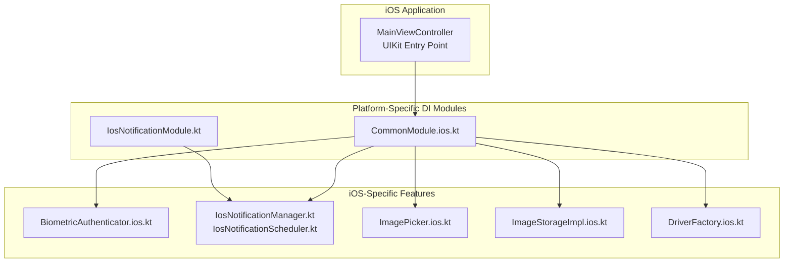
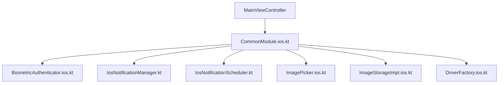
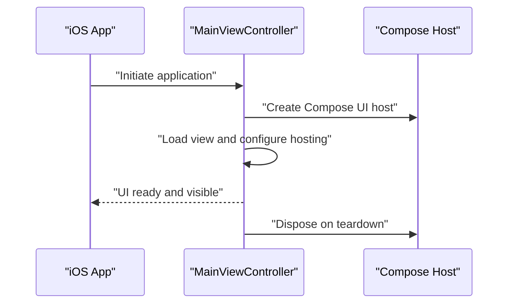
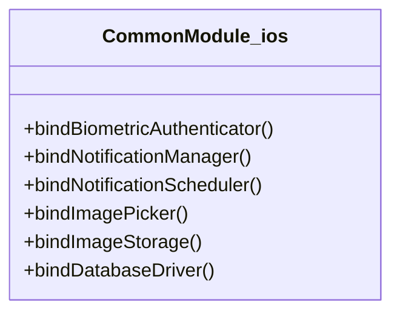
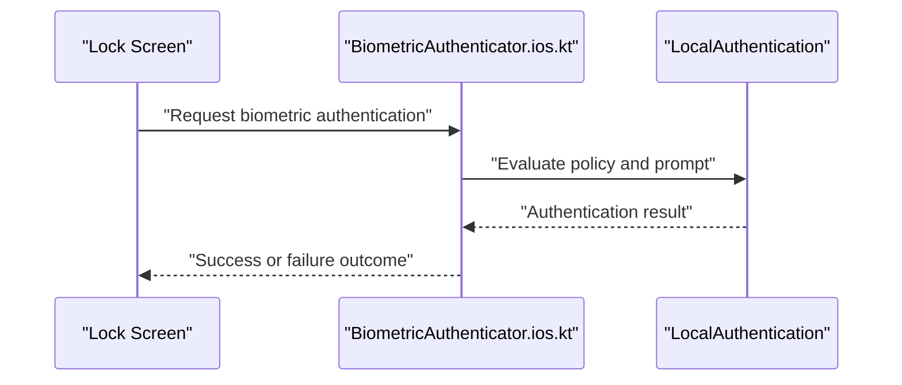
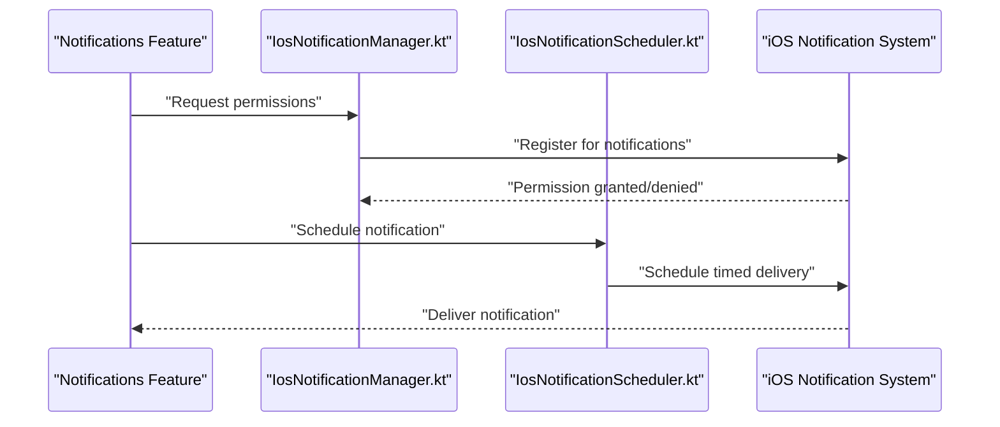
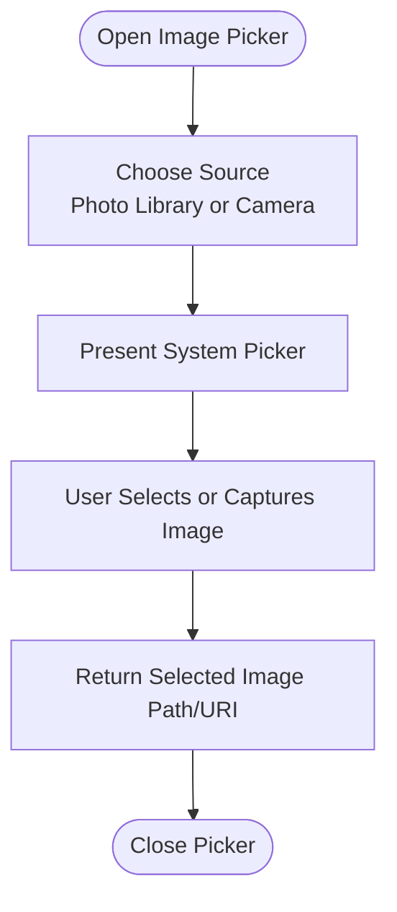
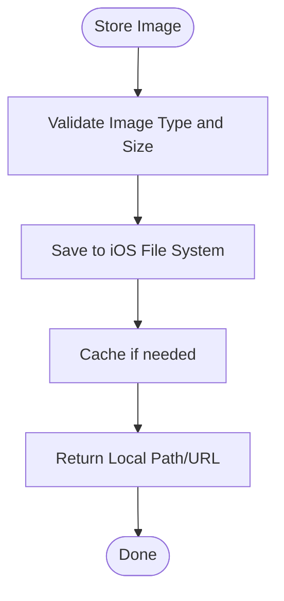
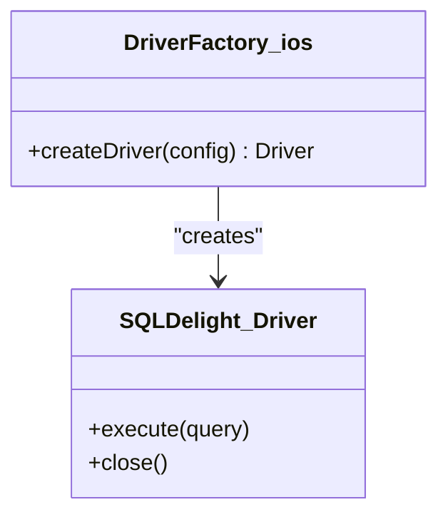
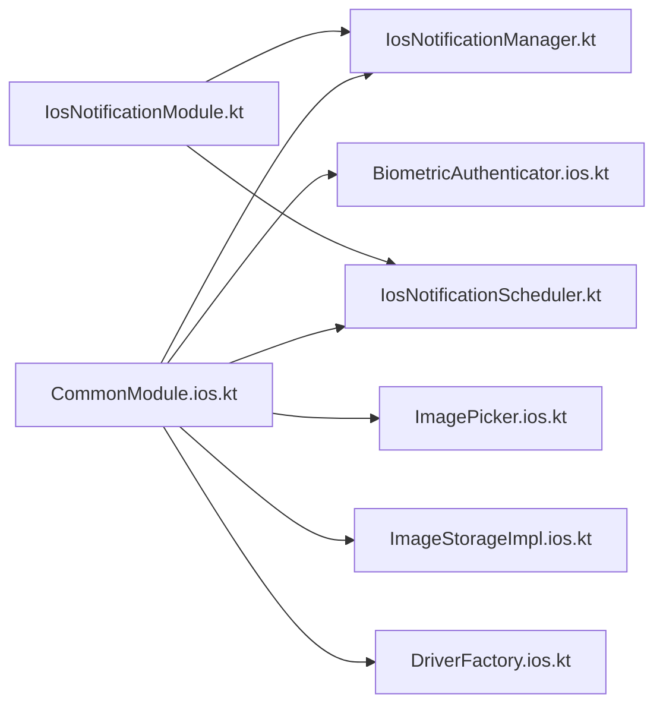

# iOS Implementation

<cite>
**Referenced Files in This Document**
- [MainViewController.kt](file://composeApp/src/iosMain/kotlin/com/kazemieh/composeApp/MainViewController.kt)
- [CommonModule.ios.kt](file://core/common/src/iosMain/kotlin/com/kazemieh/common/di/CommonModule.ios.kt)
- [DriverFactory.ios.kt](file://core/database/src/iosMain/kotlin/com/kazemieh/database/DriverFactory.ios.kt)
- [IosNotificationModule.kt](file://feature-share/notifications/src/iosMain/kotlin/com/kazemieh/notifications/di/IosNotificationModule.kt)
- [PermissionLauncher.ios.kt](file://feature-share/notifications/src/iosMain/kotlin/com/kazemieh/notifications/ui/PermissionLauncher.ios.kt)
- [PermissionRationaleHelper.ios.kt](file://feature-share/notifications/src/iosMain/kotlin/com/kazemieh/notifications/ui/PermissionRationaleHelper.ios.kt)
- [IosNotificationManager.kt](file://feature-share/notifications/src/iosMain/kotlin/com/kazemieh/notifications/IosNotificationManager.kt)
- [IosNotificationScheduler.kt](file://feature-share/notifications/src/iosMain/kotlin/com/kazemieh/notifications/IosNotificationScheduler.kt)
- [ImagePicker.ios.kt](file://core/designsystem/src/iosMain/kotlin/com/kazemieh/designsystem/component/picker/ImagePicker.ios.kt)
- [ImageStorageImpl.ios.kt](file://core/storage/src/iosMain/kotlin/com/kazemieh/storage/ImageStorageImpl.ios.kt)
- [BiometricAuthenticator.ios.kt](file://feature-share/lock/src/iosMain/kotlin/com/kazemieh/lock/BiometricAuthenticator.ios.kt)
</cite>

## Table of Contents
1. [Introduction](#introduction)
2. [Project Structure](#project-structure)
3. [Core Components](#core-components)
4. [Architecture Overview](#architecture-overview)
5. [Detailed Component Analysis](#detailed-component-analysis)
6. [Dependency Analysis](#dependency-analysis)
7. [Performance Considerations](#performance-considerations)
8. [Troubleshooting Guide](#troubleshooting-guide)
9. [Conclusion](#conclusion)

## Introduction
This document explains FinTrack's iOS implementation with a focus on iOS-specific features and optimizations. It covers the iOS application entry points, UIViewController lifecycle management, and iOS-specific dependency injection modules. It documents iOS-specific components including biometric authentication, notification management, image storage, and database drivers. Practical examples demonstrate iOS-specific workflows such as Touch ID/Face ID authentication, iOS notification scheduling, image picker implementations, and iOS-specific build configurations. iOS-specific considerations such as App Store requirements, background processing limitations, and iOS version compatibility are addressed.

## Project Structure
FinTrack adopts Kotlin Multiplatform with platform-specific modules under iosMain. The iOS entry point integrates with UIKit via a UIViewController, while platform-specific DI modules wire iOS-native services. iOS-specific features are organized under feature-share and core modules with dedicated iosMain implementations.

**Diagram sources**
- [MainViewController.kt:1-200](file://composeApp/src/iosMain/kotlin/com/kazemieh/composeApp/MainViewController.kt#L1-L200)
- [CommonModule.ios.kt:1-200](file://core/common/src/iosMain/kotlin/com/kazemieh/common/di/CommonModule.ios.kt#L1-L200)
- [IosNotificationModule.kt:1-200](file://feature-share/notifications/src/iosMain/kotlin/com/kazemieh/notifications/di/IosNotificationModule.kt#L1-L200)
- [IosNotificationManager.kt:1-200](file://feature-share/notifications/src/iosMain/kotlin/com/kazemieh/notifications/IosNotificationManager.kt#L1-L200)
- [IosNotificationScheduler.kt:1-200](file://feature-share/notifications/src/iosMain/kotlin/com/kazemieh/notifications/IosNotificationScheduler.kt#L1-L200)
- [ImagePicker.ios.kt:1-200](file://core/designsystem/src/iosMain/kotlin/com/kazemieh/designsystem/component/picker/ImagePicker.ios.kt#L1-L200)
- [ImageStorageImpl.ios.kt:1-200](file://core/storage/src/iosMain/kotlin/com/kazemieh/storage/ImageStorageImpl.ios.kt#L1-L200)
- [DriverFactory.ios.kt:1-200](file://core/database/src/iosMain/kotlin/com/kazemieh/database/DriverFactory.ios.kt#L1-L200)

**Section sources**
- [MainViewController.kt:1-200](file://composeApp/src/iosMain/kotlin/com/kazemieh/composeApp/MainViewController.kt#L1-L200)
- [CommonModule.ios.kt:1-200](file://core/common/src/iosMain/kotlin/com/kazemieh/common/di/CommonModule.ios.kt#L1-L200)

## Core Components
- iOS Application Entry Point: The iOS app initializes through a UIViewController bridging Compose and UIKit. This controller manages the lifecycle and hosts the Compose UI.
- iOS Dependency Injection: Platform-specific DI modules bind iOS-native implementations for biometric authentication, notifications, image picker, image storage, and database drivers.
- iOS-Specific Services:
  - Biometric Authentication: iOS biometric authenticator integrates with local authentication APIs.
  - Notifications: iOS notification manager and scheduler coordinate with iOS push/notification frameworks.
  - Image Picker: iOS image picker integrates with system photo libraries and capture sessions.
  - Image Storage: iOS image storage provider persists images using iOS file system APIs.
  - Database Driver: iOS SQLDelight driver targets iOS file system and SQLite variants.

**Section sources**
- [MainViewController.kt:1-200](file://composeApp/src/iosMain/kotlin/com/kazemieh/composeApp/MainViewController.kt#L1-L200)
- [CommonModule.ios.kt:1-200](file://core/common/src/iosMain/kotlin/com/kazemieh/common/di/CommonModule.ios.kt#L1-L200)
- [DriverFactory.ios.kt:1-200](file://core/database/src/iosMain/kotlin/com/kazemieh/database/DriverFactory.ios.kt#L1-L200)
- [IosNotificationManager.kt:1-200](file://feature-share/notifications/src/iosMain/kotlin/com/kazemieh/notifications/IosNotificationManager.kt#L1-L200)
- [IosNotificationScheduler.kt:1-200](file://feature-share/notifications/src/iosMain/kotlin/com/kazemieh/notifications/IosNotificationScheduler.kt#L1-L200)
- [ImagePicker.ios.kt:1-200](file://core/designsystem/src/iosMain/kotlin/com/kazemieh/designsystem/component/picker/ImagePicker.ios.kt#L1-L200)
- [ImageStorageImpl.ios.kt:1-200](file://core/storage/src/iosMain/kotlin/com/kazemieh/storage/ImageStorageImpl.ios.kt#L1-L200)
- [BiometricAuthenticator.ios.kt:1-200](file://feature-share/lock/src/iosMain/kotlin/com/kazemieh/lock/BiometricAuthenticator.ios.kt#L1-L200)

## Architecture Overview
The iOS architecture leverages a UIViewController-based entry point to host Compose UI. Platform-specific DI modules inject iOS-native services. iOS notification management is encapsulated in dedicated managers and schedulers. Biometric authentication, image picker, image storage, and database drivers are provided by their respective iosMain implementations.

**Diagram sources**
- [MainViewController.kt:1-200](file://composeApp/src/iosMain/kotlin/com/kazemieh/composeApp/MainViewController.kt#L1-L200)
- [CommonModule.ios.kt:1-200](file://core/common/src/iosMain/kotlin/com/kazemieh/common/di/CommonModule.ios.kt#L1-L200)
- [BiometricAuthenticator.ios.kt:1-200](file://feature-share/lock/src/iosMain/kotlin/com/kazemieh/lock/BiometricAuthenticator.ios.kt#L1-L200)
- [IosNotificationManager.kt:1-200](file://feature-share/notifications/src/iosMain/kotlin/com/kazemieh/notifications/IosNotificationManager.kt#L1-L200)
- [IosNotificationScheduler.kt:1-200](file://feature-share/notifications/src/iosMain/kotlin/com/kazemieh/notifications/IosNotificationScheduler.kt#L1-L200)
- [ImagePicker.ios.kt:1-200](file://core/designsystem/src/iosMain/kotlin/com/kazemieh/designsystem/component/picker/ImagePicker.ios.kt#L1-L200)
- [ImageStorageImpl.ios.kt:1-200](file://core/storage/src/iosMain/kotlin/com/kazemieh/storage/ImageStorageImpl.ios.kt#L1-L200)
- [DriverFactory.ios.kt:1-200](file://core/database/src/iosMain/kotlin/com/kazemieh/database/DriverFactory.ios.kt#L1-L200)

## Detailed Component Analysis

### iOS Application Entry Point and UIViewController Lifecycle
- The iOS entry point is a UIViewController that bridges Compose and UIKit. It manages the lifecycle events and hosts the Compose UI tree.
- Typical lifecycle responsibilities include view loading, appearance transitions, memory warnings, and deallocation cleanup.
- The controller coordinates with the shared Compose application host to render screens and handle navigation.

**Diagram sources**
- [MainViewController.kt:1-200](file://composeApp/src/iosMain/kotlin/com/kazemieh/composeApp/MainViewController.kt#L1-L200)

**Section sources**
- [MainViewController.kt:1-200](file://composeApp/src/iosMain/kotlin/com/kazemieh/composeApp/MainViewController.kt#L1-L200)

### iOS Dependency Injection Modules
- The iOS DI module binds platform-specific implementations for biometric authentication, notifications, image picker, image storage, and database drivers.
- This ensures that iOS code paths are used exclusively on iOS, maintaining clean separation of concerns across platforms.

**Diagram sources**
- [CommonModule.ios.kt:1-200](file://core/common/src/iosMain/kotlin/com/kazemieh/common/di/CommonModule.ios.kt#L1-L200)

**Section sources**
- [CommonModule.ios.kt:1-200](file://core/common/src/iosMain/kotlin/com/kazemieh/common/di/CommonModule.ios.kt#L1-L200)

### Biometric Authentication Workflow (Touch ID/Face ID)
- The iOS biometric authenticator integrates with local authentication APIs to support Face ID or Touch ID.
- Typical workflow includes checking biometric availability, evaluating policy, and handling authentication results.

**Diagram sources**
- [BiometricAuthenticator.ios.kt:1-200](file://feature-share/lock/src/iosMain/kotlin/com/kazemieh/lock/BiometricAuthenticator.ios.kt#L1-L200)

**Section sources**
- [BiometricAuthenticator.ios.kt:1-200](file://feature-share/lock/src/iosMain/kotlin/com/kazemieh/lock/BiometricAuthenticator.ios.kt#L1-L200)

### iOS Notification Management
- iOS notification management is split into a manager and scheduler. The manager handles permission requests and registration, while the scheduler handles timed notifications.
- Permission handling is platform-specific, ensuring compliance with iOS privacy requirements.

**Diagram sources**
- [IosNotificationManager.kt:1-200](file://feature-share/notifications/src/iosMain/kotlin/com/kazemieh/notifications/IosNotificationManager.kt#L1-L200)
- [IosNotificationScheduler.kt:1-200](file://feature-share/notifications/src/iosMain/kotlin/com/kazemieh/notifications/IosNotificationScheduler.kt#L1-L200)

**Section sources**
- [IosNotificationModule.kt:1-200](file://feature-share/notifications/src/iosMain/kotlin/com/kazemieh/notifications/di/IosNotificationModule.kt#L1-L200)
- [PermissionLauncher.ios.kt:1-200](file://feature-share/notifications/src/iosMain/kotlin/com/kazemieh/notifications/ui/PermissionLauncher.ios.kt#L1-L200)
- [PermissionRationaleHelper.ios.kt:1-200](file://feature-share/notifications/src/iosMain/kotlin/com/kazemieh/notifications/ui/PermissionRationaleHelper.ios.kt#L1-L200)
- [IosNotificationManager.kt:1-200](file://feature-share/notifications/src/iosMain/kotlin/com/kazemieh/notifications/IosNotificationManager.kt#L1-L200)
- [IosNotificationScheduler.kt:1-200](file://feature-share/notifications/src/iosMain/kotlin/com/kazemieh/notifications/IosNotificationScheduler.kt#L1-L200)

### Image Picker Implementation
- The iOS image picker integrates with system photo libraries and capture sessions to select or capture images.
- It coordinates with the shared design system to present a unified UX while leveraging iOS APIs.

**Diagram sources**
- [ImagePicker.ios.kt:1-200](file://core/designsystem/src/iosMain/kotlin/com/kazemieh/designsystem/component/picker/ImagePicker.ios.kt#L1-L200)

**Section sources**
- [ImagePicker.ios.kt:1-200](file://core/designsystem/src/iosMain/kotlin/com/kazemieh/designsystem/component/picker/ImagePicker.ios.kt#L1-L200)

### Image Storage Provider
- The iOS image storage provider persists images using iOS file system APIs, ensuring compatibility with sandbox restrictions and efficient caching.

**Diagram sources**
- [ImageStorageImpl.ios.kt:1-200](file://core/storage/src/iosMain/kotlin/com/kazemieh/storage/ImageStorageImpl.ios.kt#L1-L200)

**Section sources**
- [ImageStorageImpl.ios.kt:1-200](file://core/storage/src/iosMain/kotlin/com/kazemieh/storage/ImageStorageImpl.ios.kt#L1-L200)

### Database Drivers (SQLDelight)
- The iOS SQLDelight driver targets iOS file system and SQLite variants, enabling local persistence with schema migrations and type-safe queries.

**Diagram sources**
- [DriverFactory.ios.kt:1-200](file://core/database/src/iosMain/kotlin/com/kazemieh/database/DriverFactory.ios.kt#L1-L200)

**Section sources**
- [DriverFactory.ios.kt:1-200](file://core/database/src/iosMain/kotlin/com/kazemieh/database/DriverFactory.ios.kt#L1-L200)

### Conceptual Overview
This section provides conceptual guidance for beginners:
- Use UIViewController as the iOS entry point to host Compose UI.
- Keep iOS-specific logic in iosMain modules and inject them via DI modules.
- Respect iOS privacy and background execution limits for notifications and background tasks.
- Ensure iOS version compatibility by guarding APIs and using fallbacks where necessary.

[No sources needed since this section doesn't analyze specific source files]

## Dependency Analysis
The iOS DI module orchestrates dependencies for biometric authentication, notifications, image picker, image storage, and database drivers. The notification feature also includes a dedicated iOS DI module for explicit binding.

**Diagram sources**
- [CommonModule.ios.kt:1-200](file://core/common/src/iosMain/kotlin/com/kazemieh/common/di/CommonModule.ios.kt#L1-L200)
- [IosNotificationModule.kt:1-200](file://feature-share/notifications/src/iosMain/kotlin/com/kazemieh/notifications/di/IosNotificationModule.kt#L1-L200)
- [BiometricAuthenticator.ios.kt:1-200](file://feature-share/lock/src/iosMain/kotlin/com/kazemieh/lock/BiometricAuthenticator.ios.kt#L1-L200)
- [IosNotificationManager.kt:1-200](file://feature-share/notifications/src/iosMain/kotlin/com/kazemieh/notifications/IosNotificationManager.kt#L1-L200)
- [IosNotificationScheduler.kt:1-200](file://feature-share/notifications/src/iosMain/kotlin/com/kazemieh/notifications/IosNotificationScheduler.kt#L1-L200)
- [ImagePicker.ios.kt:1-200](file://core/designsystem/src/iosMain/kotlin/com/kazemieh/designsystem/component/picker/ImagePicker.ios.kt#L1-L200)
- [ImageStorageImpl.ios.kt:1-200](file://core/storage/src/iosMain/kotlin/com/kazemieh/storage/ImageStorageImpl.ios.kt#L1-L200)
- [DriverFactory.ios.kt:1-200](file://core/database/src/iosMain/kotlin/com/kazemieh/database/DriverFactory.ios.kt#L1-L200)

**Section sources**
- [CommonModule.ios.kt:1-200](file://core/common/src/iosMain/kotlin/com/kazemieh/common/di/CommonModule.ios.kt#L1-L200)
- [IosNotificationModule.kt:1-200](file://feature-share/notifications/src/iosMain/kotlin/com/kazemieh/notifications/di/IosNotificationModule.kt#L1-L200)

## Performance Considerations
- Minimize UI thread work; delegate heavy computations to background threads or platform-specific dispatch queues.
- Use lazy loading and virtualization for lists and grids to reduce memory footprint.
- Optimize image loading and caching; leverage iOS image caching APIs and appropriate compression.
- Avoid blocking the main thread during network or disk operations; use async/await patterns and background contexts.
- Respect iOS background execution limits; schedule non-critical tasks using background modes or system schedulers.

[No sources needed since this section provides general guidance]

## Troubleshooting Guide
- Biometric Authentication Failures:
  - Verify device support and enrolled biometrics.
  - Handle user cancellation and passcode fallback scenarios.
  - Ensure proper error handling and user feedback.
- Notification Permissions:
  - Request permissions early and gracefully handle denials.
  - Provide rationale and guide users to settings if needed.
- Image Picker Issues:
  - Validate media types and sizes.
  - Handle picker cancellations and permission denials.
- Database Migration:
  - Ensure schema updates are applied safely.
  - Back up data before migrations when necessary.

**Section sources**
- [BiometricAuthenticator.ios.kt:1-200](file://feature-share/lock/src/iosMain/kotlin/com/kazemieh/lock/BiometricAuthenticator.ios.kt#L1-L200)
- [PermissionLauncher.ios.kt:1-200](file://feature-share/notifications/src/iosMain/kotlin/com/kazemieh/notifications/ui/PermissionLauncher.ios.kt#L1-L200)
- [PermissionRationaleHelper.ios.kt:1-200](file://feature-share/notifications/src/iosMain/kotlin/com/kazemieh/notifications/ui/PermissionRationaleHelper.ios.kt#L1-L200)
- [ImagePicker.ios.kt:1-200](file://core/designsystem/src/iosMain/kotlin/com/kazemieh/designsystem/component/picker/ImagePicker.ios.kt#L1-L200)
- [DriverFactory.ios.kt:1-200](file://core/database/src/iosMain/kotlin/com/kazemieh/database/DriverFactory.ios.kt#L1-L200)

## Conclusion
FinTrack’s iOS implementation integrates a UIViewController-based entry point with platform-specific DI modules to deliver iOS-native experiences. iOS-specific components for biometric authentication, notifications, image picker, image storage, and database drivers are cleanly separated and testable. Following iOS best practices ensures robust performance, compliance, and user experience across devices and OS versions.