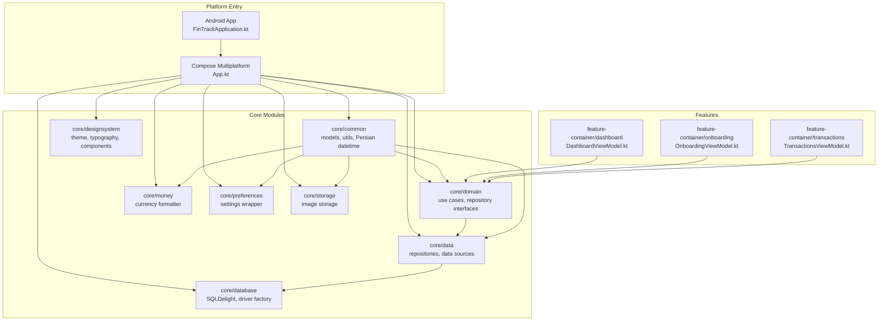
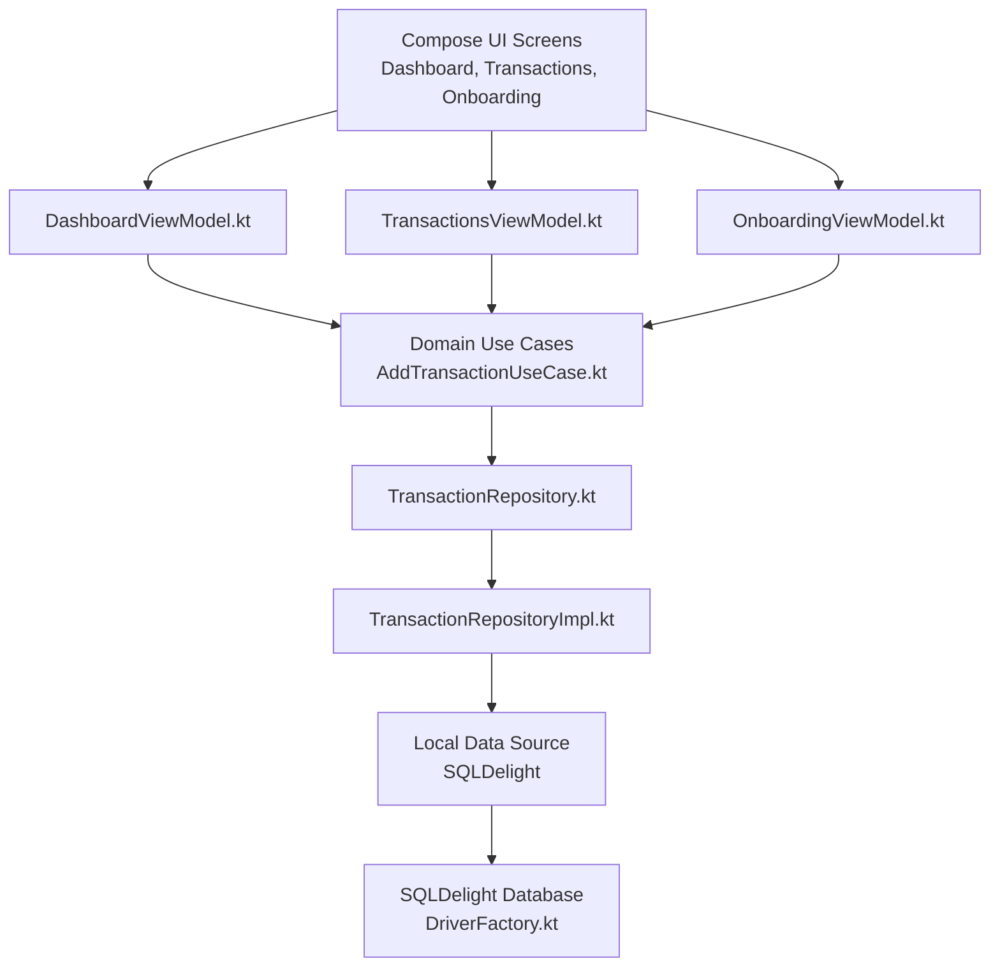
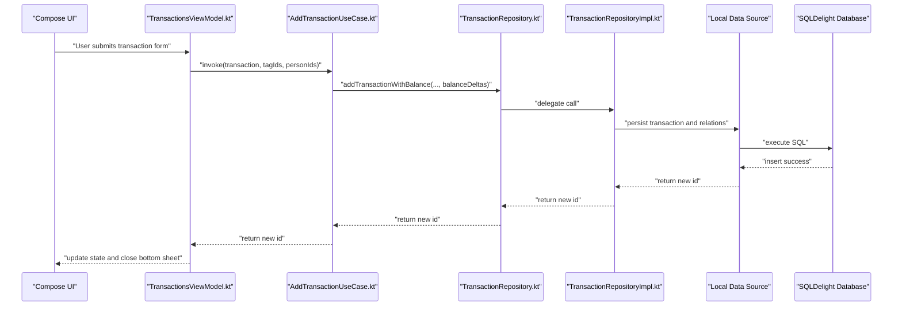
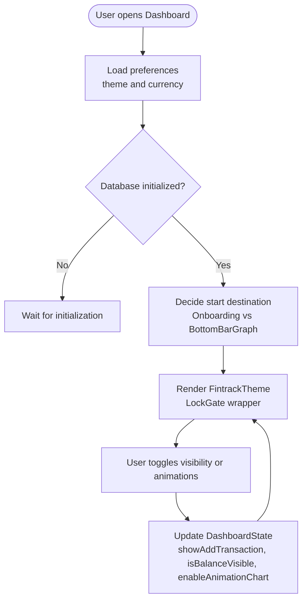
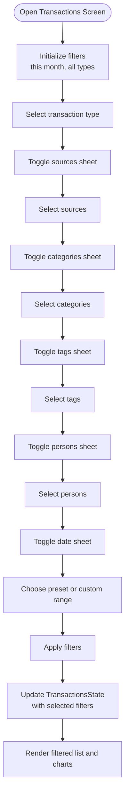
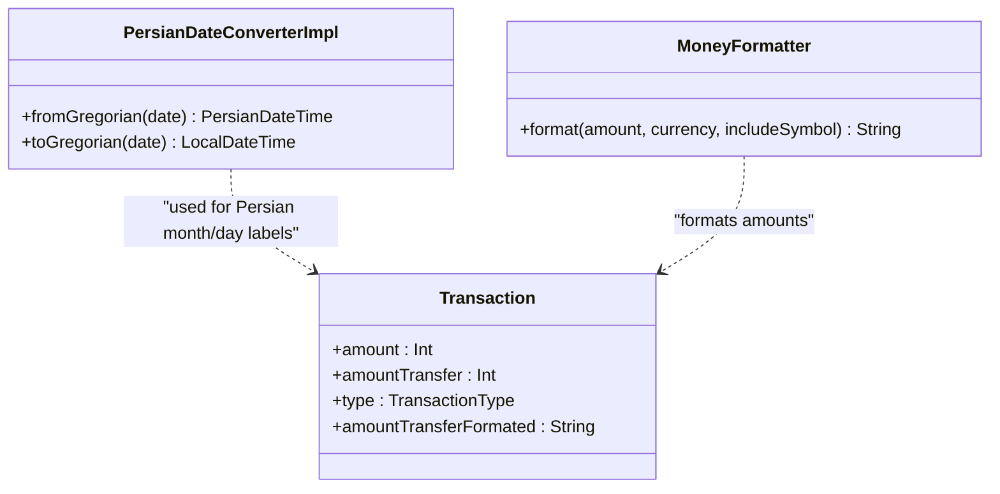
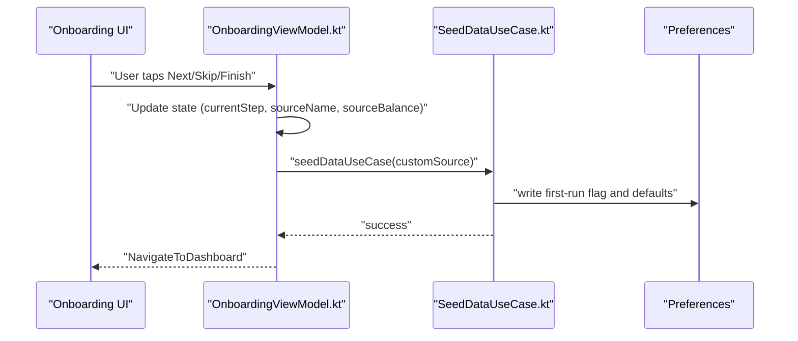
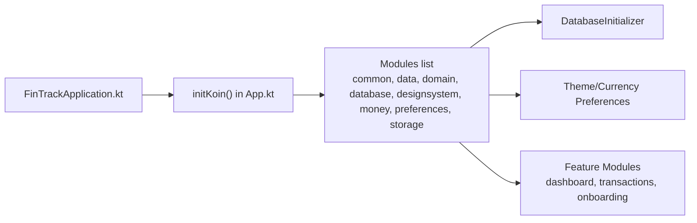

# Project Overview

<cite>
**Referenced Files in This Document**
- [README.md](file://README.md)
- [FinTrackApplication.kt](file://app/src/main/java/com/kazemieh/fintrack/FinTrackApplication.kt)
- [App.kt](file://composeApp/src/commonMain/kotlin/com/kazemieh/composeApp/App.kt)
- [Transaction.kt](file://core/common/src/commonMain/kotlin/com/kazemieh/common/model/Transaction.kt)
- [AddTransactionUseCase.kt](file://core/domain/src/commonMain/kotlin/com/kazemieh/domain/usecase/AddTransactionUseCase.kt)
- [DashboardViewModel.kt](file://feature-container/dashboard/src/commonMain/kotlin/com/kazemieh/dashboard/DashboardViewModel.kt)
- [TransactionsViewModel.kt](file://feature-container/transactions/src/commonMain/kotlin/com/kazemieh/transactions/TransactionsViewModel.kt)
- [TransactionRepository.kt](file://core/domain/src/commonMain/kotlin/com/kazemieh/domain/repository/TransactionRepository.kt)
- [TransactionRepositoryImpl.kt](file://core/data/src/commonMain/kotlin/com/kazemieh/data/repository/TransactionRepositoryImpl.kt)
- [OnboardingViewModel.kt](file://feature-container/onboarding/src/commonMain/kotlin/com/kazemieh/onboarding/ui/OnboardingViewModel.kt)
- [DriverFactory.kt](file://core/database/src/commonMain/kotlin/com/kazemieh/database/DriverFactory.kt)
- [composeApp/build.gradle.kts](file://composeApp/build.gradle.kts)
- [PersianDateConverterImpl.kt](file://core/common/src/commonMain/kotlin/com/kazemieh/common/persiandatetime/PersianDateConverterImpl.kt)
- [MoneyFormatter.kt](file://core/money/src/commonMain/kotlin/com/kazemieh/money/MoneyFormatter.kt)
- [CalculatorParser.kt](file://core/common/src/commonMain/kotlin/com/kazemieh/common/util/CalculatorParser.kt)
</cite>

## Table of Contents
1. [Introduction](#introduction)
2. [Project Structure](#project-structure)
3. [Core Components](#core-components)
4. [Architecture Overview](#architecture-overview)
5. [Detailed Component Analysis](#detailed-component-analysis)
6. [Dependency Analysis](#dependency-analysis)
7. [Performance Considerations](#performance-considerations)
8. [Troubleshooting Guide](#troubleshooting-guide)
9. [Conclusion](#conclusion)

## Introduction
FinTrack is a modern personal finance management application designed to help users track income, expenses, and account balances across platforms. It emphasizes a clean, modular architecture with Kotlin Multiplatform (KMP) readiness, a Persian localization layer, and a Material 3–driven Compose UI. The project’s roadmap targets full KMP support for Android, iOS, Desktop, and Web, enabling a single codebase to power diverse environments while maintaining platform-specific capabilities.

Key value proposition:
- Cross-platform personal finance tracking with a unified UI and data model
- Persian calendar and currency localization for Persian-speaking users
- Modular Clean Architecture with MVI-style state management for predictable UI updates
- Reactive data flows powered by Kotlin Coroutines and Flow
- Practical workflows for everyday tasks: adding transactions, viewing dashboards, and generating filtered reports

Target audience:
- Persian-speaking individuals seeking a localized, privacy-first finance tracker
- Developers who value modular architecture, testability, and multiplatform scalability

Differentiators:
- Persian localization integrated at the date/time converter, formatter, and UI resource layers
- Strong separation of concerns via Clean Architecture and explicit repository boundaries
- MVI-inspired view models with immutable UI state and deterministic intents
- KMP-first Gradle setup with shared modules and expect/actual drivers for SQLDelight

Positioning:
- A developer-friendly, extensible personal finance app that evolves toward full Kotlin Multiplatform support
- Suitable for both beginners (guided onboarding and simple flows) and advanced users (deep filtering, reporting, and localization)

## Project Structure
FinTrack organizes functionality into layered modules:
- app: Android application entry point and platform-specific initialization
- composeApp: Compose Multiplatform entry point and DI bootstrap for shared UI
- core: Shared libraries for models, domain logic, data access, database, design system, money formatting, preferences, and storage
- feature-container: Container modules for screens like dashboard, onboarding, transactions, profile, and tools
- feature-share: Feature modules for entities like transactions, categories, tags, sources, persons, search, lock, and notifications

**Diagram sources**
- [FinTrackApplication.kt:14-22](file://app/src/main/java/com/kazemieh/fintrack/FinTrackApplication.kt#L14-L22)
- [App.kt:94-133](file://composeApp/src/commonMain/kotlin/com/kazemieh/composeApp/App.kt#L94-L133)
- [DriverFactory.kt:1-7](file://core/database/src/commonMain/kotlin/com/kazemieh/database/DriverFactory.kt#L1-L7)

**Section sources**
- [README.md:21-27](file://README.md#L21-L27)
- [composeApp/build.gradle.kts:17-116](file://composeApp/build.gradle.kts#L17-L116)

## Core Components
- Transaction model and type: Defines income, expense, and transfer semantics with serialization and formatting helpers for Persian digits and amounts.
- Use cases: Encapsulate business operations like adding transactions with balance impact calculations.
- View models: Manage UI state using MVI-style intents and immutable state snapshots.
- Repositories: Define contracts for data access and expose reactive streams for lists and aggregates.
- Localization: Persian date conversion and money formatting for culturally appropriate display.
- Onboarding: Guided setup to initialize default data and preferences.

Practical examples:
- Recording a transaction: Use AddTransactionUseCase with a Transaction payload and related identifiers; the use case computes balance impacts and persists the record.
- Dashboard analytics: Observe totals and visibility toggles via DashboardViewModel intents and state.
- Report generation: Filter transactions by type, categories, sources, tags, persons, and date ranges using TransactionsViewModel filters and date helpers.

**Section sources**
- [Transaction.kt:7-36](file://core/common/src/commonMain/kotlin/com/kazemieh/common/model/Transaction.kt#L7-L36)
- [AddTransactionUseCase.kt:7-18](file://core/domain/src/commonMain/kotlin/com/kazemieh/domain/usecase/AddTransactionUseCase.kt#L7-L18)
- [DashboardViewModel.kt:13-83](file://feature-container/dashboard/src/commonMain/kotlin/com/kazemieh/dashboard/DashboardViewModel.kt#L13-L83)
- [TransactionsViewModel.kt:51-526](file://feature-container/transactions/src/commonMain/kotlin/com/kazemieh/transactions/TransactionsViewModel.kt#L51-L526)
- [TransactionRepository.kt:16-93](file://core/domain/src/commonMain/kotlin/com/kazemieh/domain/repository/TransactionRepository.kt#L16-L93)
- [TransactionRepositoryImpl.kt:22-235](file://core/data/src/commonMain/kotlin/com/kazemieh/data/repository/TransactionRepositoryImpl.kt#L22-L235)
- [PersianDateConverterImpl.kt:12-104](file://core/common/src/commonMain/kotlin/com/kazemieh/common/persiandatetime/PersianDateConverterImpl.kt#L12-L104)
- [MoneyFormatter.kt:5-14](file://core/money/src/commonMain/kotlin/com/kazemieh/money/MoneyFormatter.kt#L5-L14)
- [OnboardingViewModel.kt:15-70](file://feature-container/onboarding/src/commonMain/kotlin/com/kazemieh/onboarding/ui/OnboardingViewModel.kt#L15-L70)

## Architecture Overview
FinTrack follows Clean Architecture with distinct layers:
- Presentation: Compose UI with MVI-style view models
- Domain: Use cases and repository interfaces
- Data: Repository implementations delegating to local data sources
- Infrastructure: SQLDelight database and DI via Koin

**Diagram sources**
- [DashboardViewModel.kt:13-16](file://feature-container/dashboard/src/commonMain/kotlin/com/kazemieh/dashboard/DashboardViewModel.kt#L13-L16)
- [TransactionsViewModel.kt:51-53](file://feature-container/transactions/src/commonMain/kotlin/com/kazemieh/transactions/TransactionsViewModel.kt#L51-L53)
- [OnboardingViewModel.kt:15-17](file://feature-container/onboarding/src/commonMain/kotlin/com/kazemieh/onboarding/ui/OnboardingViewModel.kt#L15-L17)
- [AddTransactionUseCase.kt:7-9](file://core/domain/src/commonMain/kotlin/com/kazemieh/domain/usecase/AddTransactionUseCase.kt#L7-L9)
- [TransactionRepository.kt:16-16](file://core/domain/src/commonMain/kotlin/com/kazemieh/domain/repository/TransactionRepository.kt#L16-L16)
- [TransactionRepositoryImpl.kt:22-25](file://core/data/src/commonMain/kotlin/com/kazemieh/data/repository/TransactionRepositoryImpl.kt#L22-L25)
- [DriverFactory.kt:1-7](file://core/database/src/commonMain/kotlin/com/kazemieh/database/DriverFactory.kt#L1-L7)

## Detailed Component Analysis

### Transaction Recording Workflow
This sequence illustrates adding a transaction with balance impact calculation and persistence.

**Diagram sources**
- [TransactionsViewModel.kt:77-84](file://feature-container/transactions/src/commonMain/kotlin/com/kazemieh/transactions/TransactionsViewModel.kt#L77-L84)
- [AddTransactionUseCase.kt:10-17](file://core/domain/src/commonMain/kotlin/com/kazemieh/domain/usecase/AddTransactionUseCase.kt#L10-L17)
- [TransactionRepository.kt:18-35](file://core/domain/src/commonMain/kotlin/com/kazemieh/domain/repository/TransactionRepository.kt#L18-L35)
- [TransactionRepositoryImpl.kt:66-85](file://core/data/src/commonMain/kotlin/com/kazemieh/data/repository/TransactionRepositoryImpl.kt#L66-L85)

**Section sources**
- [AddTransactionUseCase.kt:7-18](file://core/domain/src/commonMain/kotlin/com/kazemieh/domain/usecase/AddTransactionUseCase.kt#L7-L18)
- [TransactionRepository.kt:16-93](file://core/domain/src/commonMain/kotlin/com/kazemieh/domain/repository/TransactionRepository.kt#L16-L93)
- [TransactionRepositoryImpl.kt:22-235](file://core/data/src/commonMain/kotlin/com/kazemieh/data/repository/TransactionRepositoryImpl.kt#L22-L235)

### Dashboard Analytics State Flow
The dashboard uses MVI intents to toggle overlays and manage visibility of balance and charts.

**Diagram sources**
- [App.kt:72-92](file://composeApp/src/commonMain/kotlin/com/kazemieh/composeApp/App.kt#L72-L92)
- [DashboardViewModel.kt:18-54](file://feature-container/dashboard/src/commonMain/kotlin/com/kazemieh/dashboard/DashboardViewModel.kt#L18-L54)

**Section sources**
- [DashboardViewModel.kt:13-83](file://feature-container/dashboard/src/commonMain/kotlin/com/kazemieh/dashboard/DashboardViewModel.kt#L13-L83)
- [App.kt:55-92](file://composeApp/src/commonMain/kotlin/com/kazemieh/composeApp/App.kt#L55-L92)

### Report Generation and Filtering
Transactions screen supports multi-dimensional filtering and date range selection with Persian-aware labels.

**Diagram sources**
- [TransactionsViewModel.kt:58-61](file://feature-container/transactions/src/commonMain/kotlin/com/kazemieh/transactions/TransactionsViewModel.kt#L58-L61)
- [TransactionsViewModel.kt:77-336](file://feature-container/transactions/src/commonMain/kotlin/com/kazemieh/transactions/TransactionsViewModel.kt#L77-L336)

**Section sources**
- [TransactionsViewModel.kt:51-526](file://feature-container/transactions/src/commonMain/kotlin/com/kazemieh/transactions/TransactionsViewModel.kt#L51-L526)

### Persian Localization and Money Formatting
- Persian date conversion: Converts Gregorian dates to Persian calendar and vice versa using a dedicated converter implementation.
- Money formatting: Formats amounts with Persian digits and optional currency symbol.
- UI text resources: Uses localized strings for date range labels and period summaries.

**Diagram sources**
- [PersianDateConverterImpl.kt:12-104](file://core/common/src/commonMain/kotlin/com/kazemieh/common/persiandatetime/PersianDateConverterImpl.kt#L12-L104)
- [MoneyFormatter.kt:5-14](file://core/money/src/commonMain/kotlin/com/kazemieh/money/MoneyFormatter.kt#L5-L14)
- [Transaction.kt:22-24](file://core/common/src/commonMain/kotlin/com/kazemieh/common/model/Transaction.kt#L22-L24)

**Section sources**
- [PersianDateConverterImpl.kt:12-104](file://core/common/src/commonMain/kotlin/com/kazemieh/common/persiandatetime/PersianDateConverterImpl.kt#L12-L104)
- [MoneyFormatter.kt:5-14](file://core/money/src/commonMain/kotlin/com/kazemieh/money/MoneyFormatter.kt#L5-L14)
- [TransactionsViewModel.kt:338-415](file://feature-container/transactions/src/commonMain/kotlin/com/kazemieh/transactions/TransactionsViewModel.kt#L338-L415)

### Onboarding and First Run Experience
Onboarding guides users through steps, optionally allowing them to define a custom financial source and seed default data.

**Diagram sources**
- [OnboardingViewModel.kt:25-69](file://feature-container/onboarding/src/commonMain/kotlin/com/kazemieh/onboarding/ui/OnboardingViewModel.kt#L25-L69)

**Section sources**
- [OnboardingViewModel.kt:15-90](file://feature-container/onboarding/src/commonMain/kotlin/com/kazemieh/onboarding/ui/OnboardingViewModel.kt#L15-L90)

## Dependency Analysis
- DI bootstrap: App.kt initializes Koin and loads all feature and core modules, ensuring database initialization and theme/currency preferences are available early.
- Platform expectations: DriverFactory defines an expect declaration for SQLDelight driver creation, enabling platform-specific implementations.
- Build configuration: composeApp/build.gradle.kts declares Android/iOS/Desktop/Web targets and includes all shared modules, preparing for full KMP rollout.

**Diagram sources**
- [FinTrackApplication.kt:17-21](file://app/src/main/java/com/kazemieh/fintrack/FinTrackApplication.kt#L17-L21)
- [App.kt:94-133](file://composeApp/src/commonMain/kotlin/com/kazemieh/composeApp/App.kt#L94-L133)
- [DriverFactory.kt:6-6](file://core/database/src/commonMain/kotlin/com/kazemieh/database/DriverFactory.kt#L6-L6)

**Section sources**
- [FinTrackApplication.kt:10-22](file://app/src/main/java/com/kazemieh/fintrack/FinTrackApplication.kt#L10-L22)
- [App.kt:94-133](file://composeApp/src/commonMain/kotlin/com/kazemieh/composeApp/App.kt#L94-L133)
- [composeApp/build.gradle.kts:17-116](file://composeApp/build.gradle.kts#L17-L116)

## Performance Considerations
- Reactive streams: Use Flow-based repositories to avoid blocking and to propagate updates efficiently to UI.
- Immutable state: MVI-style state updates minimize UI recompositions and reduce accidental mutations.
- Localization computations: Prefer cached or precomputed localized strings for date ranges to avoid repeated conversions during scrolling.
- Filtering: Apply filters at the data layer (SQLDelight) to limit UI rendering work and improve responsiveness.

## Troubleshooting Guide
- Database initialization: Ensure DatabaseInitializer runs before rendering screens; otherwise, UI may attempt to query uninitialized tables.
- Theme and currency preferences: Verify preferences are loaded before composing themed UI; otherwise, defaults are applied.
- Platform driver: Confirm the expect/actual driver is correctly configured per platform; missing implementations prevent DB creation.
- Onboarding completion: If navigation to the dashboard fails after onboarding, check SeedDataUseCase execution and preference writes.

**Section sources**
- [App.kt:72-92](file://composeApp/src/commonMain/kotlin/com/kazemieh/composeApp/App.kt#L72-L92)
- [DriverFactory.kt:6-6](file://core/database/src/commonMain/kotlin/com/kazemieh/database/DriverFactory.kt#L6-L6)
- [OnboardingViewModel.kt:47-69](file://feature-container/onboarding/src/commonMain/kotlin/com/kazemieh/onboarding/ui/OnboardingViewModel.kt#L47-L69)

## Conclusion
FinTrack delivers a modern, cross-platform personal finance experience grounded in Clean Architecture and MVI. Its Persian localization and KMP-focused structure position it for broad reach while maintaining developer productivity and user-centric design. The documented workflows—transaction recording, dashboard analytics, and report generation—provide clear entry points for both beginners and experienced developers to engage with the codebase and extend functionality.