# Budget Management

<cite>
**Referenced Files in This Document**
- [Budget.kt](file://core/common/src/commonMain/kotlin/com/kazemieh/common/model/Budget.kt)
- [Budget.sq](file://core/database/src/commonMain/sqldelight/com/kazemieh/database/Budget.sq)
- [BudgetLocalDataSource.kt](file://core/data-contract/src/commonMain/kotlin/com/kazemieh/data_contract/datasource/BudgetLocalDataSource.kt)
- [BudgetRepository.kt](file://core/domain/src/commonMain/kotlin/com/kazemieh/domain/repository/BudgetRepository.kt)
- [BudgetRepositoryImpl.kt](file://core/data/src/commonMain/kotlin/com/kazemieh/data/repository/BudgetRepositoryImpl.kt)
- [BudgetModule.kt](file://feature-share/budget/src/commonMain/kotlin/com/kazemieh/budget/di/BudgetModule.kt)
- [BudgetViewModel.kt](file://feature-share/budget/src/commonMain/kotlin/com/kazemieh/budget/ui/list/BudgetViewModel.kt)
- [AddBudgetViewModel.kt](file://feature-share/budget/src/commonMain/kotlin/com/kazemieh/budget/ui/add/AddBudgetViewModel.kt)
- [BudgetWidget.kt](file://feature-share/budget/src/commonMain/kotlin/com/kazemieh/budget/ui/component/BudgetWidget.kt)
- [BudgetComponents.kt](file://feature-share/budget/src/commonMain/kotlin/com/kazemieh/budget/ui/component/BudgetComponents.kt)
- [BudgetScreen.kt](file://feature-share/budget/src/commonMain/kotlin/com/kazemieh/budget/ui/list/BudgetScreen.kt)
- [AddBudgetBottomSheet.kt](file://feature-share/budget/src/commonMain/kotlin/com/kazemieh/budget/ui/add/AddBudgetBottomSheet.kt)
- [Category.kt](file://core/common/src/commonMain/kotlin/com/kazemieh/common/model/Category.kt)
- [Transaction.kt](file://core/common/src/commonMain/kotlin/com/kazemieh/common/model/Transaction.kt)
- [TransactionWithRelations.kt](file://core/common/src/commonMain/kotlin/com/kazemieh/common/model/TransactionWithRelations.kt)
- [TransactionLocalDataSourceImpl.kt](file://core/database/src/commonMain/kotlin/com/kazemieh/database/datasource/TransactionLocalDataSourceImpl.kt)
- [TransactionRepositoryImpl.kt](file://core/data/src/commonMain/kotlin/com/kazemieh/data/repository/TransactionRepositoryImpl.kt)
- [ObserveTransactionsUseCase.kt](file://core/domain/src/commonMain/kotlin/com/kazemieh/domain/usecase/ObserveTransactionsUseCase.kt)
- [ObserveCategoriesUseCase.kt](file://core/domain/src/commonMain/kotlin/com/kazemieh/domain/usecase/ObserveCategoriesUseCase.kt)
- [AddBudgetUseCase.kt](file://core/domain/src/commonMain/kotlin/com/kazemieh/domain/usecase/AddBudgetUseCase.kt)
- [UpdateBudgetUseCase.kt](file://core/domain/src/commonMain/kotlin/com/kazemieh/domain/usecase/UpdateBudgetUseCase.kt)
- [DeleteBudgetUseCase.kt](file://core/domain/src/commonMain/kotlin/com/kazemieh/domain/usecase/DeleteBudgetUseCase.kt)
- [ObserveBudgetsWithProgressUseCase.kt](file://core/domain/src/commonMain/kotlin/com/kazemieh/domain/usecase/ObserveBudgetsWithProgressUseCase.kt)
- [JalaliCalendar.kt](file://core/jalali/src/commonMain/kotlin/com/kazemieh/jalali/JalaliCalendar.kt)
</cite>

## Table of Contents
1. [Introduction](#introduction)
2. [Project Structure](#project-structure)
3. [Core Components](#core-components)
4. [Architecture Overview](#architecture-overview)
5. [Detailed Component Analysis](#detailed-component-analysis)
6. [Dependency Analysis](#dependency-analysis)
7. [Performance Considerations](#performance-considerations)
8. [Troubleshooting Guide](#troubleshooting-guide)
9. [Conclusion](#conclusion)

## Introduction
This document explains the budget management shared feature module, focusing on the budget tracking system that supports monthly budgets, category-based spending limits, and financial goal management. It documents the ViewModel implementation for budget CRUD operations, spending calculations, and progress tracking; the budget UI components including budget cards, progress indicators, and spending visualization; the budget calculation algorithms, overspending alerts, and budget period management; and the integration with category spending limits and transaction categorization. Concrete examples from the codebase illustrate budget creation, spending aggregation, and cross-platform budget synchronization via SQLDelight and Koin dependency injection.

## Project Structure
The budget feature spans three layers:
- Model and persistence: shared model types and SQLDelight schema
- Data and domain: repositories, use cases, and local data sources
- Presentation: Compose UI, ViewModels, and screens

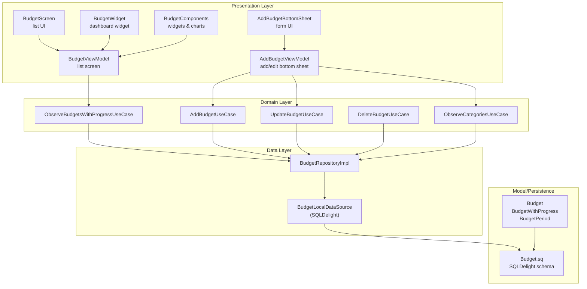

**Diagram sources**
- [BudgetViewModel.kt:32-71](file://feature-share/budget/src/commonMain/kotlin/com/kazemieh/budget/ui/list/BudgetViewModel.kt#L32-L71)
- [AddBudgetViewModel.kt:45-113](file://feature-share/budget/src/commonMain/kotlin/com/kazemieh/budget/ui/add/AddBudgetViewModel.kt#L45-L113)
- [BudgetScreen.kt:32-97](file://feature-share/budget/src/commonMain/kotlin/com/kazemieh/budget/ui/list/BudgetScreen.kt#L32-L97)
- [AddBudgetBottomSheet.kt](file://feature-share/budget/src/commonMain/kotlin/com/kazemieh/budget/ui/add/AddBudgetBottomSheet.kt)
- [BudgetWidget.kt:22-68](file://feature-share/budget/src/commonMain/kotlin/com/kazemieh/budget/ui/component/BudgetWidget.kt#L22-L68)
- [BudgetComponents.kt:34-214](file://feature-share/budget/src/commonMain/kotlin/com/kazemieh/budget/ui/component/BudgetComponents.kt#L34-L214)
- [ObserveBudgetsWithProgressUseCase.kt](file://core/domain/src/commonMain/kotlin/com/kazemieh/domain/usecase/ObserveBudgetsWithProgressUseCase.kt)
- [AddBudgetUseCase.kt](file://core/domain/src/commonMain/kotlin/com/kazemieh/domain/usecase/AddBudgetUseCase.kt)
- [UpdateBudgetUseCase.kt](file://core/domain/src/commonMain/kotlin/com/kazemieh/domain/usecase/UpdateBudgetUseCase.kt)
- [DeleteBudgetUseCase.kt](file://core/domain/src/commonMain/kotlin/com/kazemieh/domain/usecase/DeleteBudgetUseCase.kt)
- [ObserveCategoriesUseCase.kt](file://core/domain/src/commonMain/kotlin/com/kazemieh/domain/usecase/ObserveCategoriesUseCase.kt)
- [BudgetRepositoryImpl.kt:9-35](file://core/data/src/commonMain/kotlin/com/kazemieh/data/repository/BudgetRepositoryImpl.kt#L9-L35)
- [BudgetLocalDataSource.kt:7-14](file://core/data-contract/src/commonMain/kotlin/com/kazemieh/data_contract/datasource/BudgetLocalDataSource.kt#L7-L14)
- [Budget.sq:1-39](file://core/database/src/commonMain/sqldelight/com/kazemieh/database/Budget.sq#L1-L39)
- [Budget.kt:6-25](file://core/common/src/commonMain/kotlin/com/kazemieh/common/model/Budget.kt#L6-L25)

**Section sources**
- [BudgetModule.kt:8-22](file://feature-share/budget/src/commonMain/kotlin/com/kazemieh/budget/di/BudgetModule.kt#L8-L22)
- [BudgetViewModel.kt:32-71](file://feature-share/budget/src/commonMain/kotlin/com/kazemieh/budget/ui/list/BudgetViewModel.kt#L32-L71)
- [AddBudgetViewModel.kt:45-113](file://feature-share/budget/src/commonMain/kotlin/com/kazemieh/budget/ui/add/AddBudgetViewModel.kt#L45-L113)
- [BudgetWidget.kt:22-68](file://feature-share/budget/src/commonMain/kotlin/com/kazemieh/budget/ui/component/BudgetWidget.kt#L22-L68)
- [BudgetComponents.kt:34-214](file://feature-share/budget/src/commonMain/kotlin/com/kazemieh/budget/ui/component/BudgetComponents.kt#L34-L214)
- [BudgetScreen.kt:32-97](file://feature-share/budget/src/commonMain/kotlin/com/kazemieh/budget/ui/list/BudgetScreen.kt#L32-L97)
- [BudgetRepositoryImpl.kt:9-35](file://core/data/src/commonMain/kotlin/com/kazemieh/data/repository/BudgetRepositoryImpl.kt#L9-L35)
- [BudgetLocalDataSource.kt:7-14](file://core/data-contract/src/commonMain/kotlin/com/kazemieh/data_contract/datasource/BudgetLocalDataSource.kt#L7-L14)
- [Budget.sq:1-39](file://core/database/src/commonMain/sqldelight/com/kazemieh/database/Budget.sq#L1-L39)
- [Budget.kt:6-25](file://core/common/src/commonMain/kotlin/com/kazemieh/common/model/Budget.kt#L6-L25)

## Core Components
- Budget model and progress:
  - Budget defines category association, amount, period, start timestamp, and alert flag.
  - BudgetWithProgress pairs a Budget with its spent amount and normalized progress.
  - BudgetPeriod enumerates supported periods for budget cycles.
- Persistence:
  - SQLDelight schema defines the budget table with foreign key to category and indexes for efficient queries.
- Repositories and data sources:
  - BudgetRepository interface exposes CRUD and progress observation.
  - BudgetRepositoryImpl delegates to BudgetLocalDataSource.
  - BudgetLocalDataSource defines the contract for observeBudgetsWithProgress and CRUD operations.
- Use cases:
  - ObserveBudgetsWithProgressUseCase streams BudgetWithProgress updates.
  - AddBudgetUseCase, UpdateBudgetUseCase, DeleteBudgetUseCase encapsulate mutations.
  - ObserveCategoriesUseCase supplies categories for selection.
- ViewModels:
  - BudgetViewModel manages list state, loading, and deletion.
  - AddBudgetViewModel manages form state, category loading, and save/update flows.
- UI components:
  - BudgetWidget displays aggregated budget totals and top budget rows.
  - BudgetComponents provides BudgetHero, CircularProgress, BudgetPeriodSelector, and BudgetRow.
  - BudgetScreen renders the list UI with header, hero, rows, and floating action to open the add/edit bottom sheet.
  - AddBudgetBottomSheet hosts the form and effects.

**Section sources**
- [Budget.kt:6-25](file://core/common/src/commonMain/kotlin/com/kazemieh/common/model/Budget.kt#L6-L25)
- [Budget.sq:1-39](file://core/database/src/commonMain/sqldelight/com/kazemieh/database/Budget.sq#L1-L39)
- [BudgetLocalDataSource.kt:7-14](file://core/data-contract/src/commonMain/kotlin/com/kazemieh/data_contract/datasource/BudgetLocalDataSource.kt#L7-L14)
- [BudgetRepository.kt:7-14](file://core/domain/src/commonMain/kotlin/com/kazemieh/domain/repository/BudgetRepository.kt#L7-L14)
- [BudgetRepositoryImpl.kt:9-35](file://core/data/src/commonMain/kotlin/com/kazemieh/data/repository/BudgetRepositoryImpl.kt#L9-L35)
- [ObserveBudgetsWithProgressUseCase.kt](file://core/domain/src/commonMain/kotlin/com/kazemieh/domain/usecase/ObserveBudgetsWithProgressUseCase.kt)
- [AddBudgetUseCase.kt](file://core/domain/src/commonMain/kotlin/com/kazemieh/domain/usecase/AddBudgetUseCase.kt)
- [UpdateBudgetUseCase.kt](file://core/domain/src/commonMain/kotlin/com/kazemieh/domain/usecase/UpdateBudgetUseCase.kt)
- [DeleteBudgetUseCase.kt](file://core/domain/src/commonMain/kotlin/com/kazemieh/domain/usecase/DeleteBudgetUseCase.kt)
- [ObserveCategoriesUseCase.kt](file://core/domain/src/commonMain/kotlin/com/kazemieh/domain/usecase/ObserveCategoriesUseCase.kt)
- [BudgetViewModel.kt:15-71](file://feature-share/budget/src/commonMain/kotlin/com/kazemieh/budget/ui/list/BudgetViewModel.kt#L15-L71)
- [AddBudgetViewModel.kt:19-113](file://feature-share/budget/src/commonMain/kotlin/com/kazemieh/budget/ui/add/AddBudgetViewModel.kt#L19-L113)
- [BudgetWidget.kt:22-68](file://feature-share/budget/src/commonMain/kotlin/com/kazemieh/budget/ui/component/BudgetWidget.kt#L22-L68)
- [BudgetComponents.kt:34-214](file://feature-share/budget/src/commonMain/kotlin/com/kazemieh/budget/ui/component/BudgetComponents.kt#L34-L214)
- [BudgetScreen.kt:32-97](file://feature-share/budget/src/commonMain/kotlin/com/kazemieh/budget/ui/list/BudgetScreen.kt#L32-L97)
- [AddBudgetBottomSheet.kt](file://feature-share/budget/src/commonMain/kotlin/com/kazemieh/budget/ui/add/AddBudgetBottomSheet.kt)

## Architecture Overview
The budget feature follows Clean Architecture:
- UI observes state from ViewModels.
- ViewModels delegate to use cases.
- Use cases operate on repositories.
- Repositories interact with local data sources backed by SQLDelight.
- The model layer defines shared types and enums.

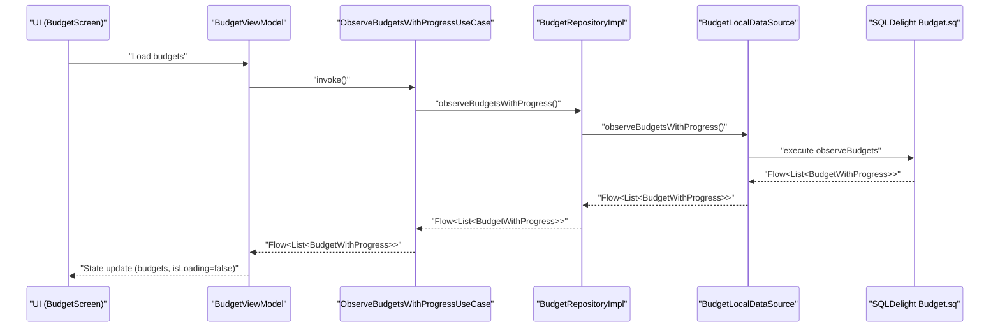

**Diagram sources**
- [BudgetScreen.kt:32-97](file://feature-share/budget/src/commonMain/kotlin/com/kazemieh/budget/ui/list/BudgetScreen.kt#L32-L97)
- [BudgetViewModel.kt:57-64](file://feature-share/budget/src/commonMain/kotlin/com/kazemieh/budget/ui/list/BudgetViewModel.kt#L57-L64)
- [ObserveBudgetsWithProgressUseCase.kt](file://core/domain/src/commonMain/kotlin/com/kazemieh/domain/usecase/ObserveBudgetsWithProgressUseCase.kt)
- [BudgetRepositoryImpl.kt:12-14](file://core/data/src/commonMain/kotlin/com/kazemieh/data/repository/BudgetRepositoryImpl.kt#L12-L14)
- [BudgetLocalDataSource.kt](file://core/data-contract/src/commonMain/kotlin/com/kazemieh/data_contract/datasource/BudgetLocalDataSource.kt#L8)
- [Budget.sq:13-21](file://core/database/src/commonMain/sqldelight/com/kazemieh/database/Budget.sq#L13-L21)

## Detailed Component Analysis

### Budget Model and Period Management
- Budget holds category linkage, amount, period, start timestamp, and alert flag.
- BudgetPeriod supports daily, weekly, monthly, and yearly cycles.
- BudgetWithProgress augments a Budget with spent amount and progress ratio, enabling overspending detection when progress exceeds 1.0.

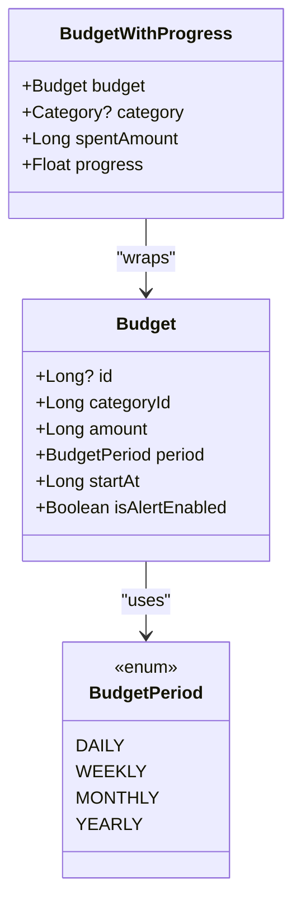

**Diagram sources**
- [Budget.kt:6-25](file://core/common/src/commonMain/kotlin/com/kazemieh/common/model/Budget.kt#L6-L25)

**Section sources**
- [Budget.kt:6-25](file://core/common/src/commonMain/kotlin/com/kazemieh/common/model/Budget.kt#L6-L25)

### Budget Persistence and Schema
- The budget table includes foreign key to category, ensuring referential integrity.
- Indexes optimize lookups by category.
- SQLDelight queries expose observeBudgets, getBudgetByCategoryId, insert/update/delete, and helpers for CRUD.

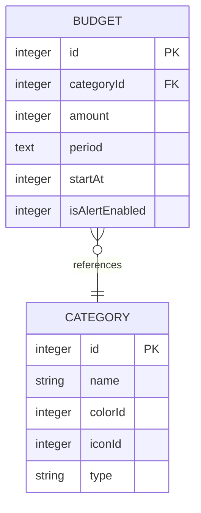

**Diagram sources**
- [Budget.sq:1-11](file://core/database/src/commonMain/sqldelight/com/kazemieh/database/Budget.sq#L1-L11)

**Section sources**
- [Budget.sq:1-39](file://core/database/src/commonMain/sqldelight/com/kazemieh/database/Budget.sq#L1-L39)

### Repository and Data Source Contracts
- BudgetRepository defines observeBudgetsWithProgress, CRUD operations, and category-based spent amount retrieval.
- BudgetRepositoryImpl delegates to BudgetLocalDataSource for all operations.
- BudgetLocalDataSource declares the contract for observeBudgetsWithProgress and CRUD.

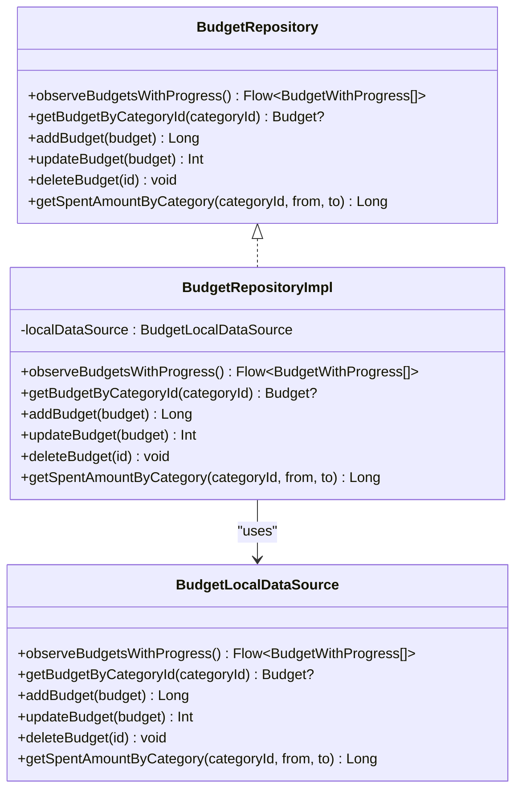

**Diagram sources**
- [BudgetRepository.kt:7-14](file://core/domain/src/commonMain/kotlin/com/kazemieh/domain/repository/BudgetRepository.kt#L7-L14)
- [BudgetRepositoryImpl.kt:9-35](file://core/data/src/commonMain/kotlin/com/kazemieh/data/repository/BudgetRepositoryImpl.kt#L9-L35)
- [BudgetLocalDataSource.kt:7-14](file://core/data-contract/src/commonMain/kotlin/com/kazemieh/data_contract/datasource/BudgetLocalDataSource.kt#L7-L14)

**Section sources**
- [BudgetRepository.kt:7-14](file://core/domain/src/commonMain/kotlin/com/kazemieh/domain/repository/BudgetRepository.kt#L7-L14)
- [BudgetRepositoryImpl.kt:9-35](file://core/data/src/commonMain/kotlin/com/kazemieh/data/repository/BudgetRepositoryImpl.kt#L9-L35)
- [BudgetLocalDataSource.kt:7-14](file://core/data-contract/src/commonMain/kotlin/com/kazemieh/data_contract/datasource/BudgetLocalDataSource.kt#L7-L14)

### Use Cases for Budget CRUD and Observation
- ObserveBudgetsWithProgressUseCase streams BudgetWithProgress updates from the repository.
- AddBudgetUseCase persists new budgets.
- UpdateBudgetUseCase modifies existing budgets.
- DeleteBudgetUseCase removes budgets by ID.
- ObserveCategoriesUseCase provides categories filtered by type for selection.

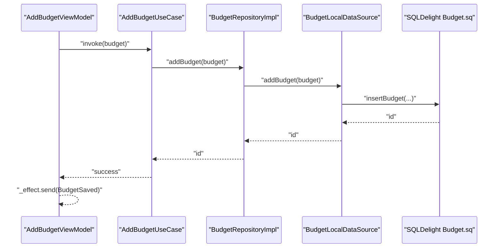

**Diagram sources**
- [AddBudgetViewModel.kt:90-112](file://feature-share/budget/src/commonMain/kotlin/com/kazemieh/budget/ui/add/AddBudgetViewModel.kt#L90-L112)
- [AddBudgetUseCase.kt](file://core/domain/src/commonMain/kotlin/com/kazemieh/domain/usecase/AddBudgetUseCase.kt)
- [BudgetRepositoryImpl.kt:20-22](file://core/data/src/commonMain/kotlin/com/kazemieh/data/repository/BudgetRepositoryImpl.kt#L20-L22)
- [BudgetLocalDataSource.kt](file://core/data-contract/src/commonMain/kotlin/com/kazemieh/data_contract/datasource/BudgetLocalDataSource.kt#L10)
- [Budget.sq:29-31](file://core/database/src/commonMain/sqldelight/com/kazemieh/database/Budget.sq#L29-L31)

**Section sources**
- [ObserveBudgetsWithProgressUseCase.kt](file://core/domain/src/commonMain/kotlin/com/kazemieh/domain/usecase/ObserveBudgetsWithProgressUseCase.kt)
- [AddBudgetUseCase.kt](file://core/domain/src/commonMain/kotlin/com/kazemieh/domain/usecase/AddBudgetUseCase.kt)
- [UpdateBudgetUseCase.kt](file://core/domain/src/commonMain/kotlin/com/kazemieh/domain/usecase/UpdateBudgetUseCase.kt)
- [DeleteBudgetUseCase.kt](file://core/domain/src/commonMain/kotlin/com/kazemieh/domain/usecase/DeleteBudgetUseCase.kt)
- [ObserveCategoriesUseCase.kt](file://core/domain/src/commonMain/kotlin/com/kazemieh/domain/usecase/ObserveCategoriesUseCase.kt)

### ViewModel Implementation: Budget CRUD and Progress Tracking
- BudgetViewModel:
  - Manages budgets list, loading state, and add/edit toggling.
  - Observes BudgetWithProgress stream and handles deletion.
- AddBudgetViewModel:
  - Maintains form state: selected category, amount, period, start timestamp, alert flag.
  - Loads categories by type and saves budgets (create or update).
  - Emits effects for successful save and errors.

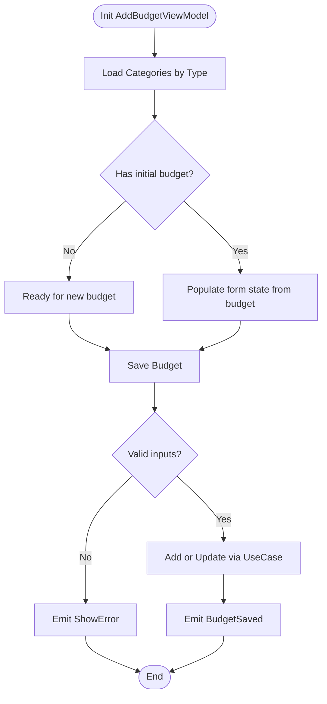

**Diagram sources**
- [AddBudgetViewModel.kt:57-112](file://feature-share/budget/src/commonMain/kotlin/com/kazemieh/budget/ui/add/AddBudgetViewModel.kt#L57-L112)

**Section sources**
- [BudgetViewModel.kt:32-71](file://feature-share/budget/src/commonMain/kotlin/com/kazemieh/budget/ui/list/BudgetViewModel.kt#L32-L71)
- [AddBudgetViewModel.kt:45-113](file://feature-share/budget/src/commonMain/kotlin/com/kazemieh/budget/ui/add/AddBudgetViewModel.kt#L45-L113)

### Budget UI Components: Cards, Progress Indicators, and Visualization
- BudgetWidget:
  - Aggregates total budget and spent amounts across all budgets.
  - Computes overall progress and displays a circular progress indicator with percentage.
  - Shows top budget rows for quick overview.
- BudgetComponents:
  - BudgetHero: Large circular progress with total budget and remaining amount.
  - CircularProgress: Canvas-based circular progress drawing.
  - BudgetPeriodSelector: Chip-based selector for BudgetPeriod.
  - BudgetRow: Category-aware row with progress bar, percentage, and optional overspending indicator.
- BudgetScreen:
  - Renders header with month/year, BudgetHero, and a scrollable list of BudgetRow entries.
  - Floating action opens AddBudgetBottomSheet.
- AddBudgetBottomSheet:
  - Hosts the form and reacts to BudgetSaved effect to close.

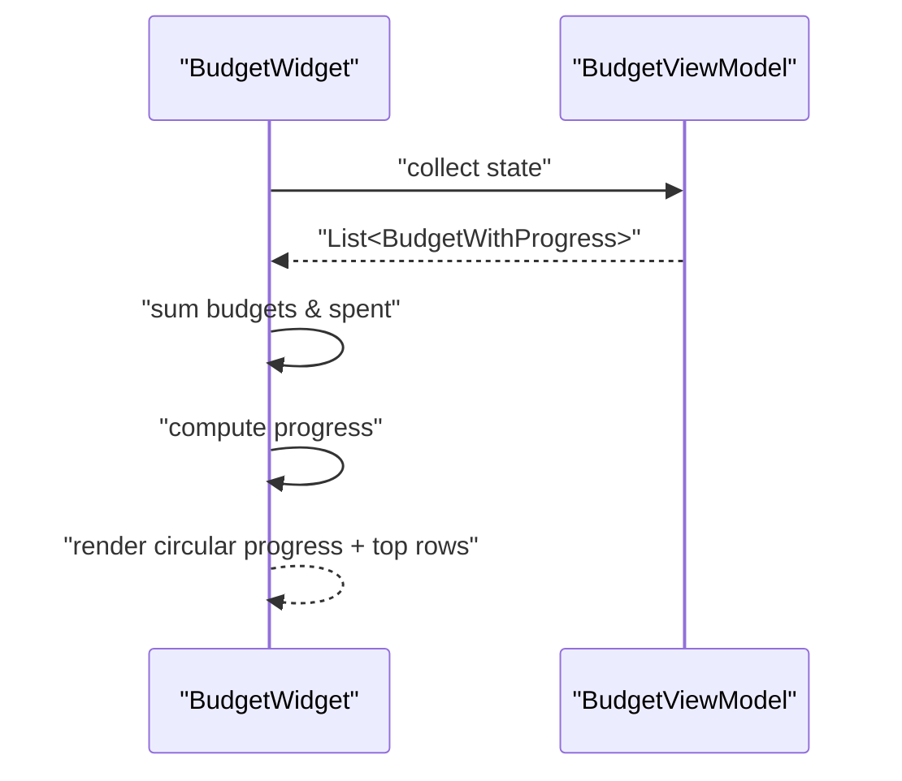

**Diagram sources**
- [BudgetWidget.kt:22-68](file://feature-share/budget/src/commonMain/kotlin/com/kazemieh/budget/ui/component/BudgetWidget.kt#L22-L68)
- [BudgetViewModel.kt:57-64](file://feature-share/budget/src/commonMain/kotlin/com/kazemieh/budget/ui/list/BudgetViewModel.kt#L57-L64)
- [BudgetComponents.kt:34-214](file://feature-share/budget/src/commonMain/kotlin/com/kazemieh/budget/ui/component/BudgetComponents.kt#L34-L214)
- [BudgetScreen.kt:32-97](file://feature-share/budget/src/commonMain/kotlin/com/kazemieh/budget/ui/list/BudgetScreen.kt#L32-L97)
- [AddBudgetBottomSheet.kt](file://feature-share/budget/src/commonMain/kotlin/com/kazemieh/budget/ui/add/AddBudgetBottomSheet.kt)

**Section sources**
- [BudgetWidget.kt:22-68](file://feature-share/budget/src/commonMain/kotlin/com/kazemieh/budget/ui/component/BudgetWidget.kt#L22-L68)
- [BudgetComponents.kt:34-214](file://feature-share/budget/src/commonMain/kotlin/com/kazemieh/budget/ui/component/BudgetComponents.kt#L34-L214)
- [BudgetScreen.kt:32-97](file://feature-share/budget/src/commonMain/kotlin/com/kazemieh/budget/ui/list/BudgetScreen.kt#L32-L97)
- [AddBudgetBottomSheet.kt](file://feature-share/budget/src/commonMain/kotlin/com/kazemieh/budget/ui/add/AddBudgetBottomSheet.kt)

### Budget Calculation Algorithms, Overspending Alerts, and Period Management
- Spending aggregation:
  - BudgetRepository.getSpentAmountByCategory computes spent within a time window per category.
  - UI components sum across budgets to compute totals and progress.
- Overspending detection:
  - BudgetRow highlights overspending when progress exceeds 1.0 and shows an explicit indicator.
- Period management:
  - BudgetPeriod controls cycle boundaries; UI includes a selector for daily/weekly/monthly/yearly.
  - Month label in BudgetScreen uses JalaliCalendar for display.

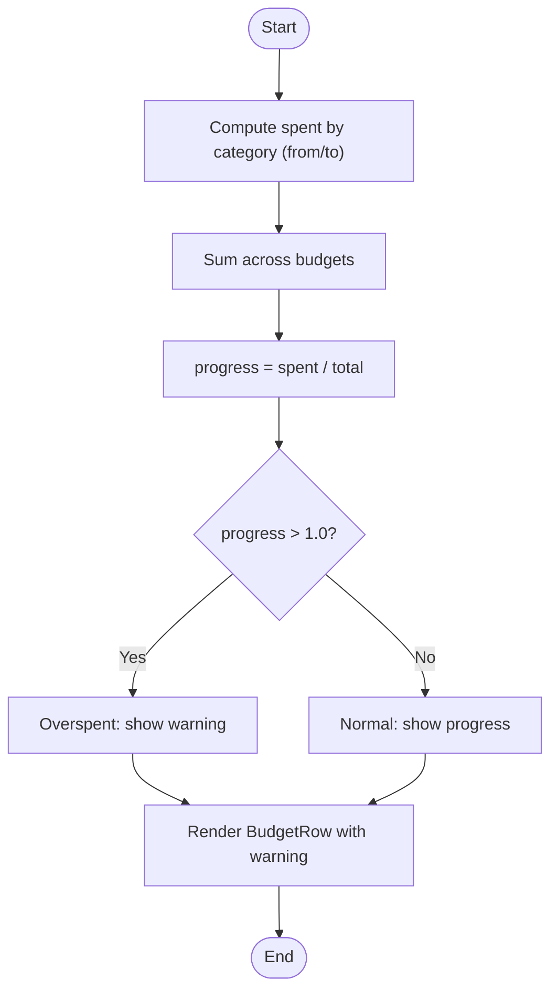

**Diagram sources**
- [BudgetRepositoryImpl.kt:32-34](file://core/data/src/commonMain/kotlin/com/kazemieh/data/repository/BudgetRepositoryImpl.kt#L32-L34)
- [BudgetComponents.kt:141-211](file://feature-share/budget/src/commonMain/kotlin/com/kazemieh/budget/ui/component/BudgetComponents.kt#L141-L211)
- [BudgetScreen.kt:39-42](file://feature-share/budget/src/commonMain/kotlin/com/kazemieh/budget/ui/list/BudgetScreen.kt#L39-L42)
- [JalaliCalendar.kt](file://core/jalali/src/commonMain/kotlin/com/kazemieh/jalali/JalaliCalendar.kt)

**Section sources**
- [BudgetRepositoryImpl.kt:32-34](file://core/data/src/commonMain/kotlin/com/kazemieh/data/repository/BudgetRepositoryImpl.kt#L32-L34)
- [BudgetComponents.kt:141-211](file://feature-share/budget/src/commonMain/kotlin/com/kazemieh/budget/ui/component/BudgetComponents.kt#L141-L211)
- [BudgetScreen.kt:39-42](file://feature-share/budget/src/commonMain/kotlin/com/kazemieh/budget/ui/list/BudgetScreen.kt#L39-L42)
- [JalaliCalendar.kt](file://core/jalali/src/commonMain/kotlin/com/kazemieh/jalali/JalaliCalendar.kt)

### Integration with Category Spending Limits and Transaction Categorization
- Category integration:
  - Budget belongs to a Category via categoryId; UI renders category color/icon and name.
  - AddBudgetViewModel loads categories filtered by type to ensure budgets align with expense/income categories.
- Transaction categorization:
  - Transactions are categorized; spending aggregation sums transaction amounts by category within the budget period.
  - The repository’s spent amount query uses from/to timestamps aligned with BudgetPeriod boundaries.

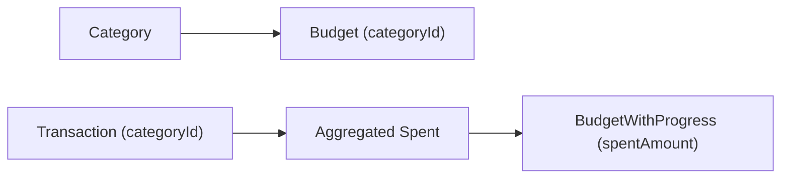

**Diagram sources**
- [Category.kt](file://core/common/src/commonMain/kotlin/com/kazemieh/common/model/Category.kt)
- [Budget.kt:8-8](file://core/common/src/commonMain/kotlin/com/kazemieh/common/model/Budget.kt#L8-L8)
- [BudgetRepositoryImpl.kt:32-34](file://core/data/src/commonMain/kotlin/com/kazemieh/data/repository/BudgetRepositoryImpl.kt#L32-L34)
- [Transaction.kt](file://core/common/src/commonMain/kotlin/com/kazemieh/common/model/Transaction.kt)
- [TransactionWithRelations.kt](file://core/common/src/commonMain/kotlin/com/kazemieh/common/model/TransactionWithRelations.kt)

**Section sources**
- [Category.kt](file://core/common/src/commonMain/kotlin/com/kazemieh/common/model/Category.kt)
- [Budget.kt:8-8](file://core/common/src/commonMain/kotlin/com/kazemieh/common/model/Budget.kt#L8-L8)
- [AddBudgetViewModel.kt:82-88](file://feature-share/budget/src/commonMain/kotlin/com/kazemieh/budget/ui/add/AddBudgetViewModel.kt#L82-L88)
- [ObserveCategoriesUseCase.kt](file://core/domain/src/commonMain/kotlin/com/kazemieh/domain/usecase/ObserveCategoriesUseCase.kt)
- [BudgetRepositoryImpl.kt:32-34](file://core/data/src/commonMain/kotlin/com/kazemieh/data/repository/BudgetRepositoryImpl.kt#L32-L34)
- [Transaction.kt](file://core/common/src/commonMain/kotlin/com/kazemieh/common/model/Transaction.kt)
- [TransactionWithRelations.kt](file://core/common/src/commonMain/kotlin/com/kazemieh/common/model/TransactionWithRelations.kt)

### Cross-Platform Budget Synchronization
- SQLDelight ensures consistent schema and queries across platforms (Android, iOS, JVM, JS/Web).
- The Budget.sq schema and generated DAOs enable synchronized budget reads/writes.
- Dependency injection via Koin modules wires ViewModels and use cases consistently across targets.

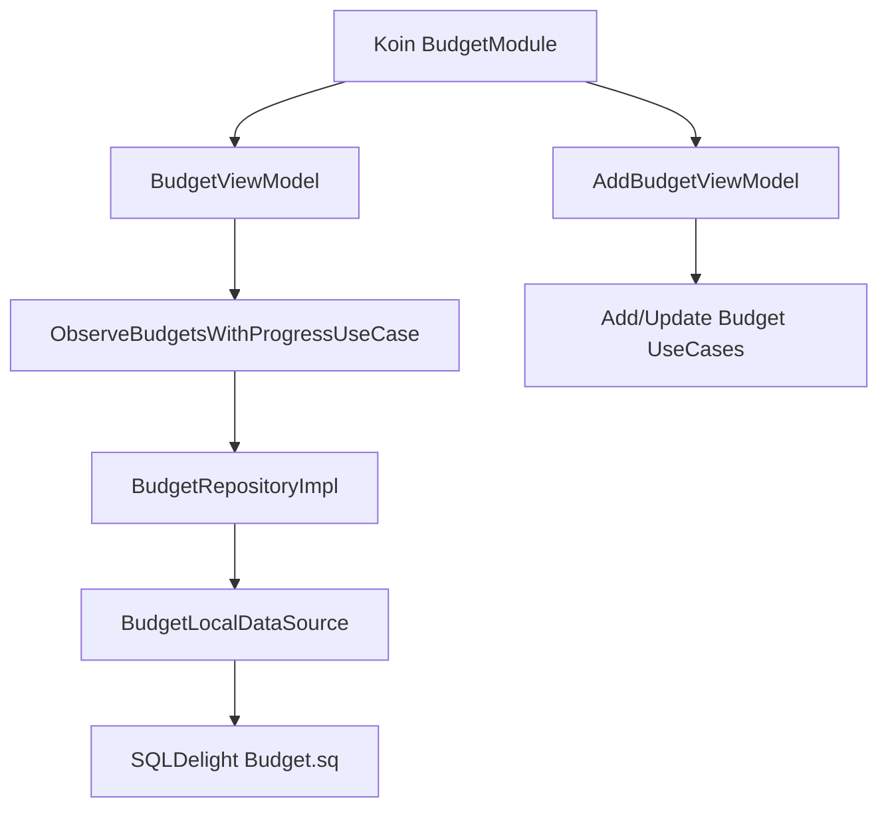

**Diagram sources**
- [BudgetModule.kt:8-22](file://feature-share/budget/src/commonMain/kotlin/com/kazemieh/budget/di/BudgetModule.kt#L8-L22)
- [BudgetViewModel.kt:32-35](file://feature-share/budget/src/commonMain/kotlin/com/kazemieh/budget/ui/list/BudgetViewModel.kt#L32-L35)
- [AddBudgetViewModel.kt:45-49](file://feature-share/budget/src/commonMain/kotlin/com/kazemieh/budget/ui/add/AddBudgetViewModel.kt#L45-L49)
- [BudgetRepositoryImpl.kt:9-11](file://core/data/src/commonMain/kotlin/com/kazemieh/data/repository/BudgetRepositoryImpl.kt#L9-L11)
- [BudgetLocalDataSource.kt:7-8](file://core/data-contract/src/commonMain/kotlin/com/kazemieh/data_contract/datasource/BudgetLocalDataSource.kt#L7-L8)
- [Budget.sq:13-21](file://core/database/src/commonMain/sqldelight/com/kazemieh/database/Budget.sq#L13-L21)

**Section sources**
- [BudgetModule.kt:8-22](file://feature-share/budget/src/commonMain/kotlin/com/kazemieh/budget/di/BudgetModule.kt#L8-L22)
- [Budget.sq:13-21](file://core/database/src/commonMain/sqldelight/com/kazemieh/database/Budget.sq#L13-L21)

## Dependency Analysis
- Coupling:
  - UI depends on ViewModels; ViewModels depend on use cases; use cases depend on repositories.
  - Low coupling between UI and data via reactive streams.
- Cohesion:
  - Each layer has a single responsibility: UI renders state, domain encapsulates business rules, data implements persistence.
- External dependencies:
  - SQLDelight for schema and queries.
  - Koin for DI.
  - Compose for UI rendering.

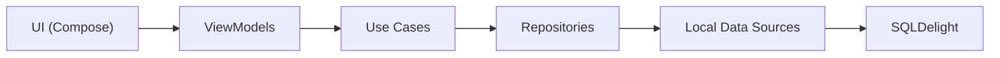

**Diagram sources**
- [BudgetViewModel.kt:32-35](file://feature-share/budget/src/commonMain/kotlin/com/kazemieh/budget/ui/list/BudgetViewModel.kt#L32-L35)
- [AddBudgetViewModel.kt:45-49](file://feature-share/budget/src/commonMain/kotlin/com/kazemieh/budget/ui/add/AddBudgetViewModel.kt#L45-L49)
- [BudgetRepositoryImpl.kt:9-11](file://core/data/src/commonMain/kotlin/com/kazemieh/data/repository/BudgetRepositoryImpl.kt#L9-L11)
- [BudgetLocalDataSource.kt:7-8](file://core/data-contract/src/commonMain/kotlin/com/kazemieh/data_contract/datasource/BudgetLocalDataSource.kt#L7-L8)
- [Budget.sq:13-21](file://core/database/src/commonMain/sqldelight/com/kazemieh/database/Budget.sq#L13-L21)

**Section sources**
- [BudgetViewModel.kt:32-35](file://feature-share/budget/src/commonMain/kotlin/com/kazemieh/budget/ui/list/BudgetViewModel.kt#L32-L35)
- [AddBudgetViewModel.kt:45-49](file://feature-share/budget/src/commonMain/kotlin/com/kazemieh/budget/ui/add/AddBudgetViewModel.kt#L45-L49)
- [BudgetRepositoryImpl.kt:9-11](file://core/data/src/commonMain/kotlin/com/kazemieh/data/repository/BudgetRepositoryImpl.kt#L9-L11)
- [BudgetLocalDataSource.kt:7-8](file://core/data-contract/src/commonMain/kotlin/com/kazemieh/data_contract/datasource/BudgetLocalDataSource.kt#L7-L8)
- [Budget.sq:13-21](file://core/database/src/commonMain/sqldelight/com/kazemieh/database/Budget.sq#L13-L21)

## Performance Considerations
- Reactive streams:
  - Using Flow avoids blocking and enables efficient UI updates.
- Aggregation:
  - Summation across budgets occurs in UI; keep lists reasonably sized to avoid heavy recompositions.
- Database indexing:
  - Index on categoryId accelerates budget and spent lookups.
- Period boundaries:
  - Efficient from/to window computation reduces scan size for spent aggregations.

## Troubleshooting Guide
- Budget calculation accuracy:
  - Verify from/to timestamps align with BudgetPeriod boundaries.
  - Ensure category IDs match between Budget and Transaction records.
- Overspending notifications:
  - Confirm progress normalization and overspend threshold checks in UI.
  - Validate isAlertEnabled flag when creating budgets.
- Budget period transitions:
  - Implement period boundary logic to reset or roll over budgets as needed.
- Cross-platform synchronization:
  - Ensure SQLDelight schema migrations are applied consistently across platforms.
  - Verify Koin modules are initialized on each platform target.

**Section sources**
- [BudgetComponents.kt:141-211](file://feature-share/budget/src/commonMain/kotlin/com/kazemieh/budget/ui/component/BudgetComponents.kt#L141-L211)
- [BudgetRepositoryImpl.kt:32-34](file://core/data/src/commonMain/kotlin/com/kazemieh/data/repository/BudgetRepositoryImpl.kt#L32-L34)
- [Budget.sq:1-39](file://core/database/src/commonMain/sqldelight/com/kazemieh/database/Budget.sq#L1-L39)
- [BudgetModule.kt:8-22](file://feature-share/budget/src/commonMain/kotlin/com/kazemieh/budget/di/BudgetModule.kt#L8-L22)

## Conclusion
The budget management module provides a robust, cross-platform solution for monthly budgets, category-based spending limits, and financial goal visualization. Its layered architecture, reactive streams, and SQLDelight-backed persistence ensure maintainability and scalability. The UI components deliver clear progress insights and overspending alerts, while the ViewModel layer cleanly separates presentation concerns from business logic.