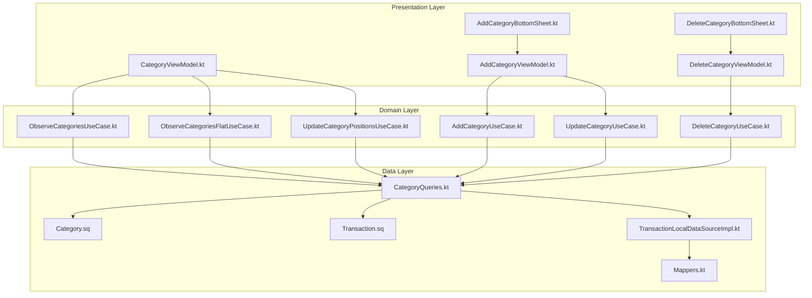
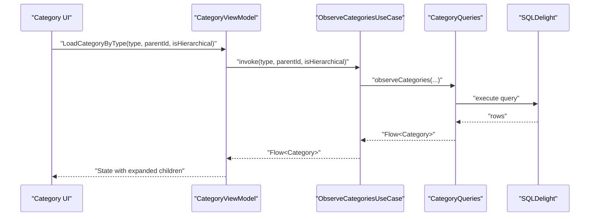
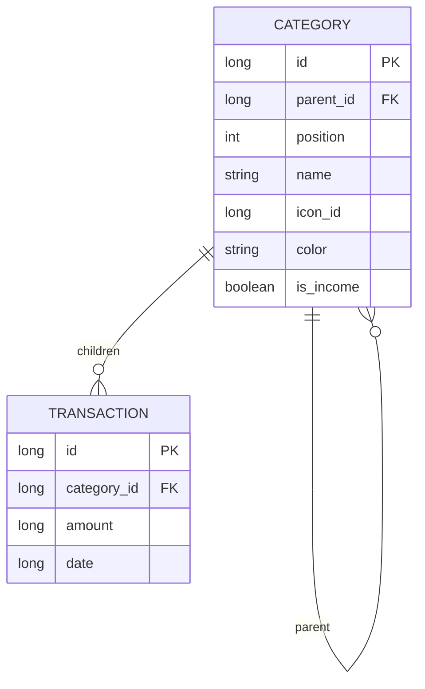
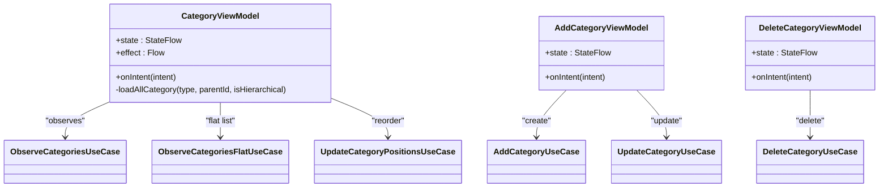
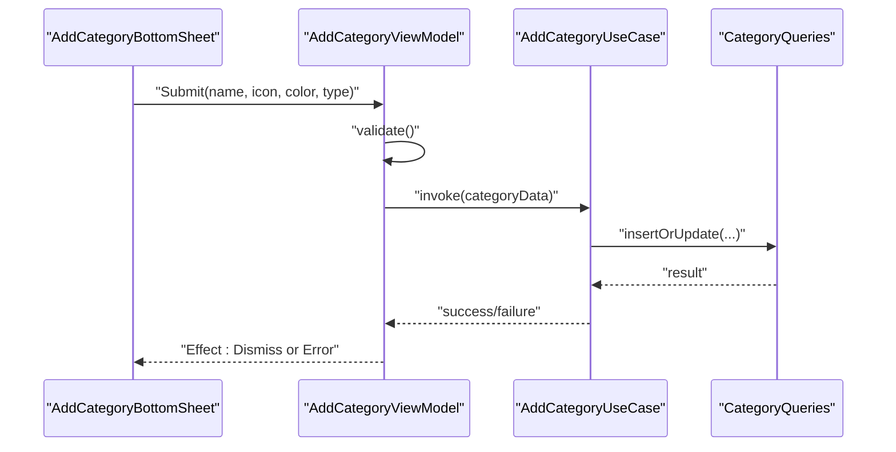
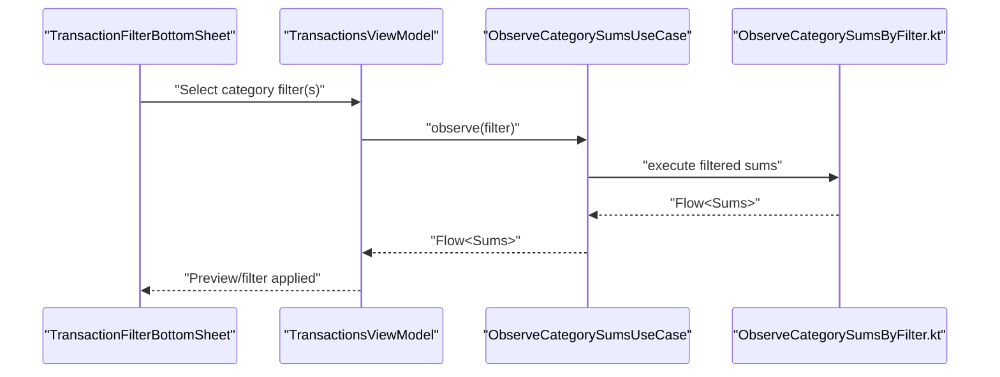
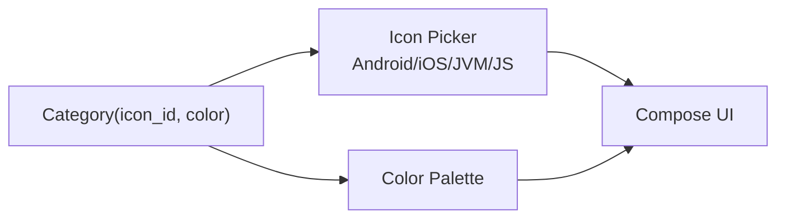
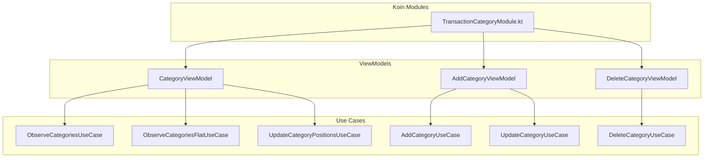
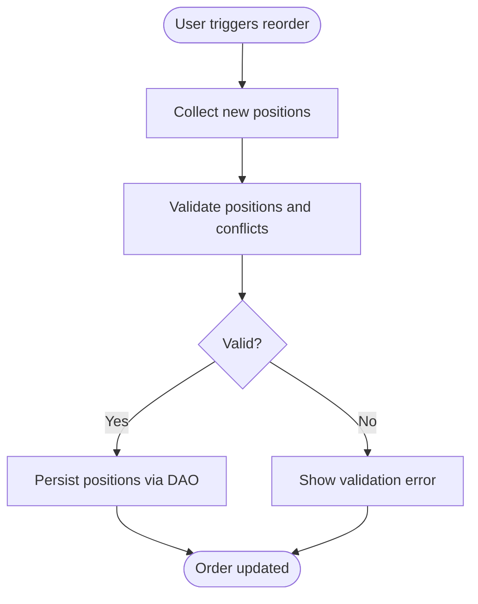
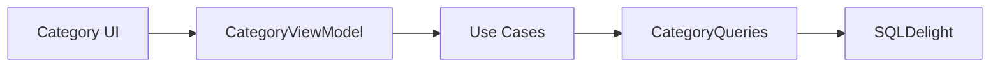

# Category Management

<cite>
**Referenced Files in This Document**
- [Category.kt](file://core/common/src/commonMain/kotlin/com/kazemieh/common/model/Category.kt)
- [Category.sq](file://core/database/src/commonMain/sqldelight/com/kazemieh/database/Category.sq)
- [CategoryQueries.kt](file://core/database/build/generated/sqldelight/code/FinTrackDatabase/commonMain/com/kazemieh/database/CategoryQueries.kt)
- [Transaction.sq](file://core/database/src/commonMain/sqldelight/com/kazemieh/database/Transaction.sq)
- [TransactionLocalDataSourceImpl.kt](file://core/database/src/commonMain/kotlin/com/kazemieh/database/datasource/TransactionLocalDataSourceImpl.kt)
- [TransactionFilterBottomSheet.kt](file://feature-container/transactions/src/commonMain/kotlin/com/kazemieh/transactions/TransactionFilterBottomSheet.kt)
- [TransactionsViewModel.kt](file://feature-container/transactions/src/commonMain/kotlin/com/kazemieh/transactions/TransactionsViewModel.kt)
- [AddCategoryBottomSheet.kt](file://feature-share/category/src/commonMain/kotlin/com/kazemieh/category/ui/add/AddCategoryBottomSheet.kt)
- [AddCategoryViewModel.kt](file://feature-share/category/src/commonMain/kotlin/com/kazemieh/category/ui/add/AddCategoryViewModel.kt)
- [DeleteCategoryBottomSheet.kt](file://feature-share/category/src/commonMain/kotlin/com/kazemieh/category/ui/delete/DeleteCategoryBottomSheet.kt)
- [DeleteCategoryViewModel.kt](file://feature-share/category/src/commonMain/kotlin/com/kazemieh/category/ui/delete/DeleteCategoryViewModel.kt)
- [CategoryViewModel.kt](file://feature-share/category/src/commonMain/kotlin/com/kazemieh/category/ui/list/CategoryViewModel.kt)
- [TransactionCategoryModule.kt](file://feature-share/category/src/commonMain/kotlin/com/kazemieh/category/di/TransactionCategoryModule.kt)
- [ObserveCategoriesUseCase.kt](file://core/domain/src/commonMain/kotlin/com/kazemieh/domain/usecase/ObserveCategoriesUseCase.kt)
- [ObserveCategoriesFlatUseCase.kt](file://core/domain/src/commonMain/kotlin/com/kazemieh/domain/usecase/ObserveCategoriesFlatUseCase.kt)
- [UpdateCategoryPositionsUseCase.kt](file://core/domain/src/commonMain/kotlin/com/kazemieh/domain/usecase/UpdateCategoryPositionsUseCase.kt)
- [AddCategoryUseCase.kt](file://core/domain/src/commonMain/kotlin/com/kazemieh/domain/usecase/AddCategoryUseCase.kt)
- [UpdateCategoryUseCase.kt](file://core/domain/src/commonMain/kotlin/com/kazemieh/domain/usecase/UpdateCategoryUseCase.kt)
- [DeleteCategoryUseCase.kt](file://core/domain/src/commonMain/kotlin/com/kazemieh/domain/usecase/DeleteCategoryUseCase.kt)
- [GetDefaultCategoryUseCase.kt](file://core/domain/src/commonMain/kotlin/com/kazemieh/domain/usecase/GetDefaultCategoryUseCase.kt)
- [GetTransferCategoryUseCase.kt](file://core/domain/src/commonMain/kotlin/com/kazemieh/domain/usecase/GetTransferCategoryUseCase.kt)
- [ObserveCategorySumsUseCase.kt](file://core/domain/src/commonMain/kotlin/com/kazemieh/domain/usecase/ObserveCategorySumsUseCase.kt)
- [ObserveCategorySumsByFilter.kt](file://core/database/src/commonMain/kotlin/com/kazemieh/database/transaction/ObserveCategorySumsByFilter.kt)
- [GetSpentAmountByCategory.kt](file://core/database/build/generated/sqldelight/code/FinTrackDatabase/commonMain/com/kazemieh/database/GetSpentAmountByCategory.kt)
- [Mappers.kt](file://core/database/src/commonMain/kotlin/com/kazemieh/database/mapper/Mappers.kt)
- [ImagePicker.android.kt](file://core/designsystem/src/androidMain/kotlin/com/kazemieh/designsystem/component/picker/ImagePicker.android.kt)
- [ImagePicker.ios.kt](file://core/designsystem/src/iosMain/kotlin/com/kazemieh/designsystem/component/picker/ImagePicker.ios.kt)
- [ImagePicker.js.kt](file://core/designsystem/src/jsMain/kotlin/com/kazemieh/designsystem/component/picker/ImagePicker.js.kt)
- [ImagePicker.jvm.kt](file://core/designsystem/src/jvmMain/kotlin/com/kazemieh/designsystem/component/picker/ImagePicker.jvm.kt)
</cite>

## Table of Contents
1. [Introduction](#introduction)
2. [Project Structure](#project-structure)
3. [Core Components](#core-components)
4. [Architecture Overview](#architecture-overview)
5. [Detailed Component Analysis](#detailed-component-analysis)
6. [Dependency Analysis](#dependency-analysis)
7. [Performance Considerations](#performance-considerations)
8. [Troubleshooting Guide](#troubleshooting-guide)
9. [Conclusion](#conclusion)

## Introduction
This document describes the Category Management shared feature module in FinTrack. It explains the hierarchical category organization (parent-child relationships and position-based ordering), the ViewModel implementation for CRUD operations and reactive updates, bottom sheet interfaces for adding, editing, and deleting categories with validation and conflict resolution, the category filter selection mechanism integrated with transaction filtering, the category icon system and visual representation patterns, and the dependency injection setup linking to the transaction module. It also covers common issues such as circular dependencies, orphaned transactions, and performance considerations for large category hierarchies.

## Project Structure
The Category Management feature spans three layers:
- Data layer: SQLDelight schema and generated DAOs for Category and Transaction, plus mappers.
- Domain layer: Use cases for observing, updating, and managing categories.
- Presentation layer: Compose UI with bottom sheets and ViewModels for add/edit/delete/list operations.

**Diagram sources**
- [CategoryViewModel.kt:1-160](file://feature-share/category/src/commonMain/kotlin/com/kazemieh/category/ui/list/CategoryViewModel.kt#L1-L160)
- [AddCategoryViewModel.kt:1-120](file://feature-share/category/src/commonMain/kotlin/com/kazemieh/category/ui/add/AddCategoryViewModel.kt#L1-L120)
- [DeleteCategoryViewModel.kt:1-120](file://feature-share/category/src/commonMain/kotlin/com/kazemieh/category/ui/delete/DeleteCategoryViewModel.kt#L1-L120)
- [ObserveCategoriesUseCase.kt:1-120](file://core/domain/src/commonMain/kotlin/com/kazemieh/domain/usecase/ObserveCategoriesUseCase.kt#L1-L120)
- [ObserveCategoriesFlatUseCase.kt:1-120](file://core/domain/src/commonMain/kotlin/com/kazemieh/domain/usecase/ObserveCategoriesFlatUseCase.kt#L1-L120)
- [UpdateCategoryPositionsUseCase.kt:1-120](file://core/domain/src/commonMain/kotlin/com/kazemieh/domain/usecase/UpdateCategoryPositionsUseCase.kt#L1-L120)
- [AddCategoryUseCase.kt:1-120](file://core/domain/src/commonMain/kotlin/com/kazemieh/domain/usecase/AddCategoryUseCase.kt#L1-L120)
- [UpdateCategoryUseCase.kt:1-120](file://core/domain/src/commonMain/kotlin/com/kazemieh/domain/usecase/UpdateCategoryUseCase.kt#L1-L120)
- [DeleteCategoryUseCase.kt:1-120](file://core/domain/src/commonMain/kotlin/com/kazemieh/domain/usecase/DeleteCategoryUseCase.kt#L1-L120)
- [Category.sq:1-200](file://core/database/src/commonMain/sqldelight/com/kazemieh/database/Category.sq#L1-L200)
- [CategoryQueries.kt:1-200](file://core/database/build/generated/sqldelight/code/FinTrackDatabase/commonMain/com/kazemieh/database/CategoryQueries.kt#L1-L200)
- [Transaction.sq:1-200](file://core/database/src/commonMain/sqldelight/com/kazemieh/database/Transaction.sq#L1-L200)
- [TransactionLocalDataSourceImpl.kt:1-200](file://core/database/src/commonMain/kotlin/com/kazemieh/database/datasource/TransactionLocalDataSourceImpl.kt#L1-L200)
- [Mappers.kt:1-200](file://core/database/src/commonMain/kotlin/com/kazemieh/database/mapper/Mappers.kt#L1-L200)

**Section sources**
- [CategoryViewModel.kt:1-160](file://feature-share/category/src/commonMain/kotlin/com/kazemieh/category/ui/list/CategoryViewModel.kt#L1-L160)
- [TransactionCategoryModule.kt:1-33](file://feature-share/category/src/commonMain/kotlin/com/kazemieh/category/di/TransactionCategoryModule.kt#L1-L33)

## Core Components
- Category model: Defines category identity, hierarchy, and metadata.
- SQLDelight schema: Declares Category and Transaction tables and relationships.
- Generated DAOs: Provide typed queries for category CRUD and sums.
- Use cases: Encapsulate business logic for observation, updates, and cascading operations.
- ViewModels: Manage UI state, intents, effects, and orchestrate use cases.
- Bottom sheets: Provide modal UI for add, edit, delete, and reorder actions.
- Dependency injection: Registers ViewModels and their dependencies via Koin.

Key implementation references:
- Category entity definition and properties.
- Category table schema and foreign keys.
- CategoryQueries for CRUD and ordering operations.
- Use cases for observe, update positions, add/update/delete.
- CategoryViewModel for hierarchical loading, expansion, and reordering.
- Add/Edit/Delete bottom sheets and their ViewModels.
- DI modules wiring ViewModels to use cases.

**Section sources**
- [Category.kt:1-200](file://core/common/src/commonMain/kotlin/com/kazemieh/common/model/Category.kt#L1-L200)
- [Category.sq:1-200](file://core/database/src/commonMain/sqldelight/com/kazemieh/database/Category.sq#L1-L200)
- [CategoryQueries.kt:1-200](file://core/database/build/generated/sqldelight/code/FinTrackDatabase/commonMain/com/kazemieh/database/CategoryQueries.kt#L1-L200)
- [ObserveCategoriesUseCase.kt:1-120](file://core/domain/src/commonMain/kotlin/com/kazemieh/domain/usecase/ObserveCategoriesUseCase.kt#L1-L120)
- [UpdateCategoryPositionsUseCase.kt:1-120](file://core/domain/src/commonMain/kotlin/com/kazemieh/domain/usecase/UpdateCategoryPositionsUseCase.kt#L1-L120)
- [AddCategoryUseCase.kt:1-120](file://core/domain/src/commonMain/kotlin/com/kazemieh/domain/usecase/AddCategoryUseCase.kt#L1-L120)
- [UpdateCategoryUseCase.kt:1-120](file://core/domain/src/commonMain/kotlin/com/kazemieh/domain/usecase/UpdateCategoryUseCase.kt#L1-L120)
- [DeleteCategoryUseCase.kt:1-120](file://core/domain/src/commonMain/kotlin/com/kazemieh/domain/usecase/DeleteCategoryUseCase.kt#L1-L120)
- [CategoryViewModel.kt:1-160](file://feature-share/category/src/commonMain/kotlin/com/kazemieh/category/ui/list/CategoryViewModel.kt#L1-L160)
- [AddCategoryViewModel.kt:1-120](file://feature-share/category/src/commonMain/kotlin/com/kazemieh/category/ui/add/AddCategoryViewModel.kt#L1-L120)
- [DeleteCategoryViewModel.kt:1-120](file://feature-share/category/src/commonMain/kotlin/com/kazemieh/category/ui/delete/DeleteCategoryViewModel.kt#L1-L120)
- [TransactionCategoryModule.kt:1-33](file://feature-share/category/src/commonMain/kotlin/com/kazemieh/category/di/TransactionCategoryModule.kt#L1-L33)

## Architecture Overview
The Category Management feature follows a layered architecture:
- Presentation: Compose UI with bottom sheets and ViewModels.
- Domain: Use cases encapsulate business rules and coordinate data operations.
- Data: SQLDelight models and DAOs manage persistence and relationships.

**Diagram sources**
- [CategoryViewModel.kt:135-160](file://feature-share/category/src/commonMain/kotlin/com/kazemieh/category/ui/list/CategoryViewModel.kt#L135-L160)
- [ObserveCategoriesUseCase.kt:1-120](file://core/domain/src/commonMain/kotlin/com/kazemieh/domain/usecase/ObserveCategoriesUseCase.kt#L1-L120)
- [CategoryQueries.kt:1-200](file://core/database/build/generated/sqldelight/code/FinTrackDatabase/commonMain/com/kazemieh/database/CategoryQueries.kt#L1-L200)

## Detailed Component Analysis

### Hierarchical Category Organization
- Parent-child relationships are modeled via a self-referencing foreign key in the Category table.
- Position-based ordering is supported through a position field, enabling drag-and-drop reordering and batch updates.
- The presentation layer supports hierarchical loading and expand/collapse behavior.

**Diagram sources**
- [Category.sq:1-200](file://core/database/src/commonMain/sqldelight/com/kazemieh/database/Category.sq#L1-L200)
- [Transaction.sq:1-200](file://core/database/src/commonMain/sqldelight/com/kazemieh/database/Transaction.sq#L1-L200)

**Section sources**
- [Category.sq:1-200](file://core/database/src/commonMain/sqldelight/com/kazemieh/database/Category.sq#L1-L200)
- [Category.kt:1-200](file://core/common/src/commonMain/kotlin/com/kazemieh/common/model/Category.kt#L1-L200)

### ViewModel Implementation for Category CRUD and State Management
- CategoryViewModel orchestrates hierarchical loading, expansion toggles, and reordering.
- It exposes intents for UI actions and emits effects for navigation or dismissal.
- Uses Combine and distinctUntilChanged to merge flows efficiently and avoid redundant recompositions.

**Diagram sources**
- [CategoryViewModel.kt:1-160](file://feature-share/category/src/commonMain/kotlin/com/kazemieh/category/ui/list/CategoryViewModel.kt#L1-L160)
- [AddCategoryViewModel.kt:1-120](file://feature-share/category/src/commonMain/kotlin/com/kazemieh/category/ui/add/AddCategoryViewModel.kt#L1-L120)
- [DeleteCategoryViewModel.kt:1-120](file://feature-share/category/src/commonMain/kotlin/com/kazemieh/category/ui/delete/DeleteCategoryViewModel.kt#L1-L120)

**Section sources**
- [CategoryViewModel.kt:1-160](file://feature-share/category/src/commonMain/kotlin/com/kazemieh/category/ui/list/CategoryViewModel.kt#L1-L160)
- [AddCategoryViewModel.kt:1-120](file://feature-share/category/src/commonMain/kotlin/com/kazemieh/category/ui/add/AddCategoryViewModel.kt#L1-L120)
- [DeleteCategoryViewModel.kt:1-120](file://feature-share/category/src/commonMain/kotlin/com/kazemieh/category/ui/delete/DeleteCategoryViewModel.kt#L1-L120)

### Bottom Sheet Interfaces: Add, Edit, Delete
- AddCategoryBottomSheet and AddCategoryViewModel handle creation and updates with validation and conflict resolution (e.g., duplicate names per parent).
- DeleteCategoryBottomSheet and DeleteCategoryViewModel manage deletion with cascade handling and safety prompts.
- Both use effects to communicate back to the UI for dismissal or navigation.

**Diagram sources**
- [AddCategoryBottomSheet.kt:1-200](file://feature-share/category/src/commonMain/kotlin/com/kazemieh/category/ui/add/AddCategoryBottomSheet.kt#L1-L200)
- [AddCategoryViewModel.kt:1-120](file://feature-share/category/src/commonMain/kotlin/com/kazemieh/category/ui/add/AddCategoryViewModel.kt#L1-L120)
- [AddCategoryUseCase.kt:1-120](file://core/domain/src/commonMain/kotlin/com/kazemieh/domain/usecase/AddCategoryUseCase.kt#L1-L120)
- [CategoryQueries.kt:1-200](file://core/database/build/generated/sqldelight/code/FinTrackDatabase/commonMain/com/kazemieh/database/CategoryQueries.kt#L1-L200)

**Section sources**
- [AddCategoryBottomSheet.kt:1-200](file://feature-share/category/src/commonMain/kotlin/com/kazemieh/category/ui/add/AddCategoryBottomSheet.kt#L1-L200)
- [AddCategoryViewModel.kt:1-120](file://feature-share/category/src/commonMain/kotlin/com/kazemieh/category/ui/add/AddCategoryViewModel.kt#L1-L120)
- [DeleteCategoryBottomSheet.kt:1-200](file://feature-share/category/src/commonMain/kotlin/com/kazemieh/category/ui/delete/DeleteCategoryBottomSheet.kt#L1-L200)
- [DeleteCategoryViewModel.kt:1-120](file://feature-share/category/src/commonMain/kotlin/com/kazemieh/category/ui/delete/DeleteCategoryViewModel.kt#L1-L120)

### Category Filter Selection and Transaction Filtering Integration
- Category filters are integrated into the transaction filtering pipeline.
- The TransactionFilterBottomSheet allows selecting categories for filtering, which feeds into transaction queries.
- Category sums are observed for reporting and filter previews.

**Diagram sources**
- [TransactionFilterBottomSheet.kt:1-200](file://feature-container/transactions/src/commonMain/kotlin/com/kazemieh/transactions/TransactionFilterBottomSheet.kt#L1-L200)
- [TransactionsViewModel.kt:1-200](file://feature-container/transactions/src/commonMain/kotlin/com/kazemieh/transactions/TransactionsViewModel.kt#L1-L200)
- [ObserveCategorySumsUseCase.kt:1-120](file://core/domain/src/commonMain/kotlin/com/kazemieh/domain/usecase/ObserveCategorySumsUseCase.kt#L1-L120)
- [ObserveCategorySumsByFilter.kt:1-200](file://core/database/src/commonMain/kotlin/com/kazemieh/database/transaction/ObserveCategorySumsByFilter.kt#L1-L200)

**Section sources**
- [TransactionFilterBottomSheet.kt:1-200](file://feature-container/transactions/src/commonMain/kotlin/com/kazemieh/transactions/TransactionFilterBottomSheet.kt#L1-L200)
- [TransactionsViewModel.kt:1-200](file://feature-container/transactions/src/commonMain/kotlin/com/kazemieh/transactions/TransactionsViewModel.kt#L1-L200)
- [ObserveCategorySumsUseCase.kt:1-120](file://core/domain/src/commonMain/kotlin/com/kazemieh/domain/usecase/ObserveCategorySumsUseCase.kt#L1-L120)
- [ObserveCategorySumsByFilter.kt:1-200](file://core/database/src/commonMain/kotlin/com/kazemieh/database/transaction/ObserveCategorySumsByFilter.kt#L1-L200)

### Category Icon System, Color Coding, and Visual Representation
- Categories include an icon identifier and a color string for visual distinction.
- The design system provides platform-specific image pickers for icons across Android, iOS, JVM, and JS targets.
- Visual patterns support consistent rendering across platforms while respecting platform conventions.

**Diagram sources**
- [Category.kt:1-200](file://core/common/src/commonMain/kotlin/com/kazemieh/common/model/Category.kt#L1-L200)
- [ImagePicker.android.kt:1-200](file://core/designsystem/src/androidMain/kotlin/com/kazemieh/designsystem/component/picker/ImagePicker.android.kt#L1-L200)
- [ImagePicker.ios.kt:1-200](file://core/designsystem/src/iosMain/kotlin/com/kazemieh/designsystem/component/picker/ImagePicker.ios.kt#L1-L200)
- [ImagePicker.js.kt:1-200](file://core/designsystem/src/jsMain/kotlin/com/kazemieh/designsystem/component/picker/ImagePicker.js.kt#L1-L200)
- [ImagePicker.jvm.kt:1-200](file://core/designsystem/src/jvmMain/kotlin/com/kazemieh/designsystem/component/picker/ImagePicker.jvm.kt#L1-L200)

**Section sources**
- [Category.kt:1-200](file://core/common/src/commonMain/kotlin/com/kazemieh/common/model/Category.kt#L1-L200)
- [ImagePicker.android.kt:1-200](file://core/designsystem/src/androidMain/kotlin/com/kazemieh/designsystem/component/picker/ImagePicker.android.kt#L1-L200)
- [ImagePicker.ios.kt:1-200](file://core/designsystem/src/iosMain/kotlin/com/kazemieh/designsystem/component/picker/ImagePicker.ios.kt#L1-L200)
- [ImagePicker.js.kt:1-200](file://core/designsystem/src/jsMain/kotlin/com/kazemieh/designsystem/component/picker/ImagePicker.js.kt#L1-L200)
- [ImagePicker.jvm.kt:1-200](file://core/designsystem/src/jvmMain/kotlin/com/kazemieh/designsystem/component/picker/ImagePicker.jvm.kt#L1-L200)

### Dependency Injection Setup and Integration with Transaction Module
- Koin modules register Category-related ViewModels and wire them to use cases.
- The transaction module consumes category data for filtering and reporting.

**Diagram sources**
- [TransactionCategoryModule.kt:1-33](file://feature-share/category/src/commonMain/kotlin/com/kazemieh/category/di/TransactionCategoryModule.kt#L1-L33)
- [CategoryViewModel.kt:1-160](file://feature-share/category/src/commonMain/kotlin/com/kazemieh/category/ui/list/CategoryViewModel.kt#L1-L160)
- [AddCategoryViewModel.kt:1-120](file://feature-share/category/src/commonMain/kotlin/com/kazemieh/category/ui/add/AddCategoryViewModel.kt#L1-L120)
- [DeleteCategoryViewModel.kt:1-120](file://feature-share/category/src/commonMain/kotlin/com/kazemieh/category/ui/delete/DeleteCategoryViewModel.kt#L1-L120)

**Section sources**
- [TransactionCategoryModule.kt:1-33](file://feature-share/category/src/commonMain/kotlin/com/kazemieh/category/di/TransactionCategoryModule.kt#L1-L33)

### Position-Based Ordering and Cascade Deletion Handling
- Position updates are handled via UpdateCategoryPositionsUseCase and CategoryQueries to persist new order.
- Cascade deletion ensures child categories are moved or deleted when a parent is removed, preventing orphaned categories.
- Conflict resolution prevents duplicate names under the same parent during add/update.

**Diagram sources**
- [UpdateCategoryPositionsUseCase.kt:1-120](file://core/domain/src/commonMain/kotlin/com/kazemieh/domain/usecase/UpdateCategoryPositionsUseCase.kt#L1-L120)
- [CategoryQueries.kt:1-200](file://core/database/build/generated/sqldelight/code/FinTrackDatabase/commonMain/com/kazemieh/database/CategoryQueries.kt#L1-L200)

**Section sources**
- [UpdateCategoryPositionsUseCase.kt:1-120](file://core/domain/src/commonMain/kotlin/com/kazemieh/domain/usecase/UpdateCategoryPositionsUseCase.kt#L1-L120)
- [CategoryQueries.kt:1-200](file://core/database/build/generated/sqldelight/code/FinTrackDatabase/commonMain/com/kazemieh/database/CategoryQueries.kt#L1-L200)
- [DeleteCategoryUseCase.kt:1-120](file://core/domain/src/commonMain/kotlin/com/kazemieh/domain/usecase/DeleteCategoryUseCase.kt#L1-L120)

### Cross-Platform UI Consistency
- Platform-specific image pickers ensure consistent icon selection across Android, iOS, JVM, and JS.
- Compose-based UI components render consistently with platform theming and accessibility support.

**Section sources**
- [ImagePicker.android.kt:1-200](file://core/designsystem/src/androidMain/kotlin/com/kazemieh/designsystem/component/picker/ImagePicker.android.kt#L1-L200)
- [ImagePicker.ios.kt:1-200](file://core/designsystem/src/iosMain/kotlin/com/kazemieh/designsystem/component/picker/ImagePicker.ios.kt#L1-L200)
- [ImagePicker.js.kt:1-200](file://core/designsystem/src/jsMain/kotlin/com/kazemieh/designsystem/component/picker/ImagePicker.js.kt#L1-L200)
- [ImagePicker.jvm.kt:1-200](file://core/designsystem/src/jvmMain/kotlin/com/kazemieh/designsystem/component/picker/ImagePicker.jvm.kt#L1-L200)

## Dependency Analysis
- Coupling: Presentation depends on domain use cases; domain depends on data access; data access depends on SQLDelight schema.
- Cohesion: Each use case encapsulates a single responsibility (observe, update positions, add/update/delete).
- External dependencies: Koin for DI, SQLDelight for persistence, Kotlin Coroutines for flows.

**Diagram sources**
- [CategoryViewModel.kt:1-160](file://feature-share/category/src/commonMain/kotlin/com/kazemieh/category/ui/list/CategoryViewModel.kt#L1-L160)
- [CategoryQueries.kt:1-200](file://core/database/build/generated/sqldelight/code/FinTrackDatabase/commonMain/com/kazemieh/database/CategoryQueries.kt#L1-L200)

**Section sources**
- [CategoryViewModel.kt:1-160](file://feature-share/category/src/commonMain/kotlin/com/kazemieh/category/ui/list/CategoryViewModel.kt#L1-L160)
- [CategoryQueries.kt:1-200](file://core/database/build/generated/sqldelight/code/FinTrackDatabase/commonMain/com/kazemieh/database/CategoryQueries.kt#L1-L200)

## Performance Considerations
- Prefer flat observation for large hierarchies to reduce nested recomposition overhead.
- Use distinctUntilChanged on flows to minimize unnecessary updates.
- Batch position updates to reduce database round-trips.
- Avoid deep nesting in UI composition; leverage lazy lists for category lists.
- Use paging or pagination for very large datasets.

## Troubleshooting Guide
Common issues and resolutions:
- Circular dependencies: Ensure use cases do not import UI classes; keep ViewModels as the only UI-bound layer.
- Orphaned transactions after category deletion: Implement cascade delete in the data layer so transactions lose their category association safely.
- Performance degradation with large hierarchies: Switch to flat observation and virtualized lists; avoid deep nested state.
- Validation errors on add/edit: Surface validation messages from AddCategoryViewModel and handle conflicts (e.g., duplicate names) gracefully.

**Section sources**
- [DeleteCategoryUseCase.kt:1-120](file://core/domain/src/commonMain/kotlin/com/kazemieh/domain/usecase/DeleteCategoryUseCase.kt#L1-L120)
- [AddCategoryViewModel.kt:1-120](file://feature-share/category/src/commonMain/kotlin/com/kazemieh/category/ui/add/AddCategoryViewModel.kt#L1-L120)
- [CategoryViewModel.kt:1-160](file://feature-share/category/src/commonMain/kotlin/com/kazemieh/category/ui/list/CategoryViewModel.kt#L1-L160)

## Conclusion
The Category Management feature provides a robust, hierarchical, and visually consistent system for organizing financial data. Its layered architecture, reactive state management, and strong integration with the transaction module enable efficient filtering, reporting, and maintenance of category structures across platforms. By following the outlined patterns and troubleshooting guidance, teams can maintain scalability and reliability as category hierarchies grow.