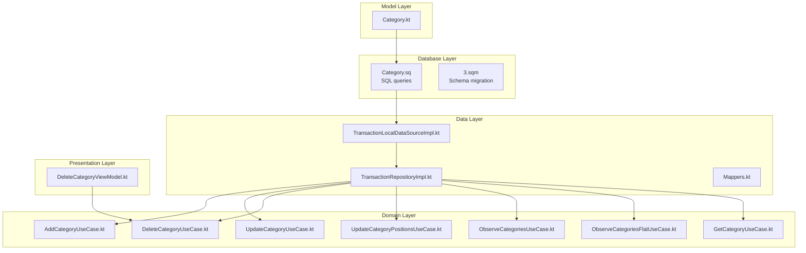
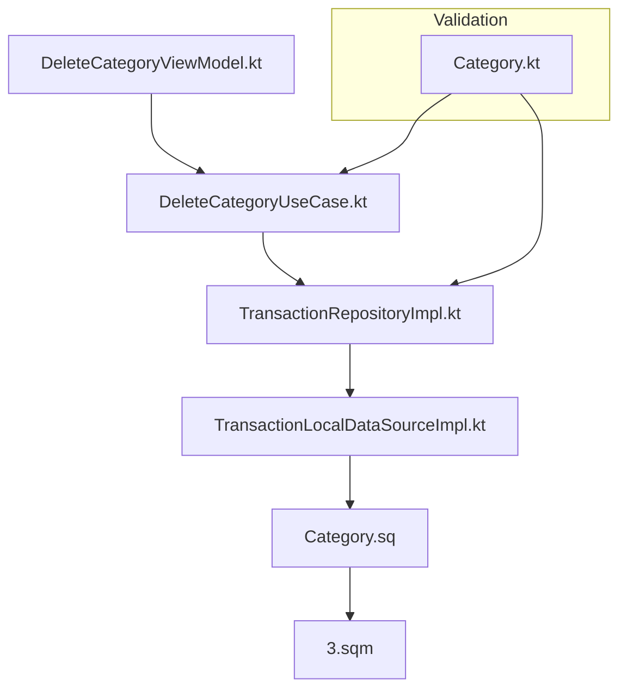
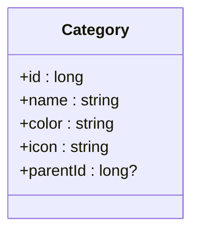
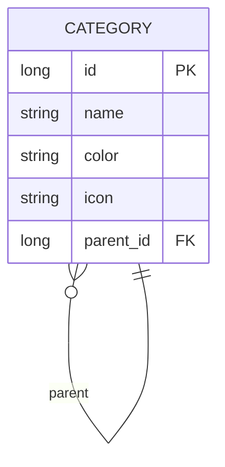
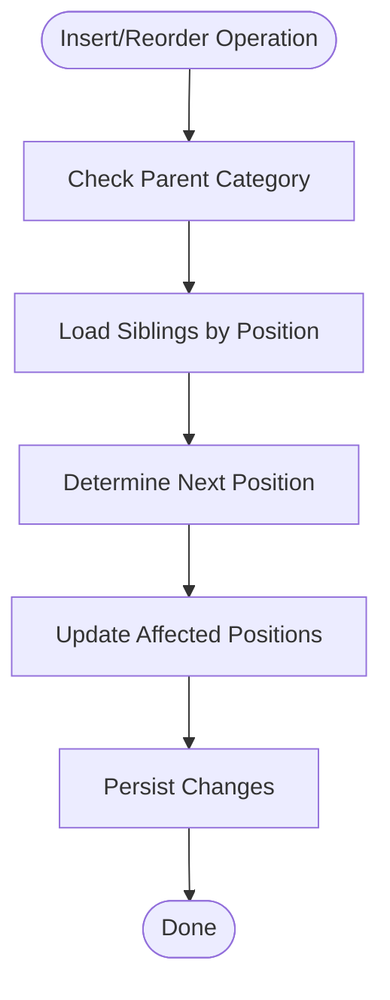
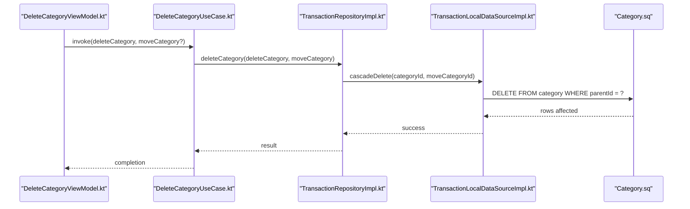
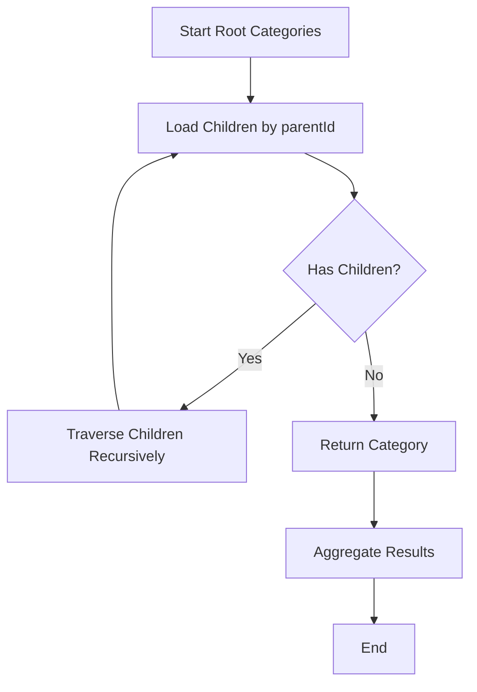
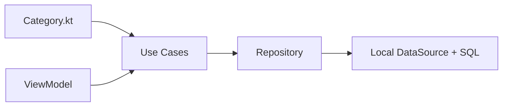

# Hierarchical Category Organization

<cite>
**Referenced Files in This Document**
- [Category.kt](file://core/common/src/commonMain/kotlin/com/kazemieh/common/model/Category.kt)
- [Category.sq](file://core/database/src/commonMain/sqldelight/com/kazemieh/database/Category.sq)
- [3.sqm](file://core/database/src/commonMain/sqldelight/com/kazemieh/database/3.sqm)
- [AddCategoryUseCase.kt](file://core/domain/src/commonMain/kotlin/com/kazemieh/domain/usecase/AddCategoryUseCase.kt)
- [UpdateCategoryUseCase.kt](file://core/domain/src/commonMain/kotlin/com/kazemieh/domain/usecase/UpdateCategoryUseCase.kt)
- [DeleteCategoryUseCase.kt](file://core/domain/src/commonMain/kotlin/com/kazemieh/domain/usecase/DeleteCategoryUseCase.kt)
- [UpdateCategoryPositionsUseCase.kt](file://core/domain/src/commonMain/kotlin/com/kazemieh/domain/usecase/UpdateCategoryPositionsUseCase.kt)
- [ObserveCategoriesUseCase.kt](file://core/domain/src/commonMain/kotlin/com/kazemieh/domain/usecase/ObserveCategoriesUseCase.kt)
- [ObserveCategoriesFlatUseCase.kt](file://core/domain/src/commonMain/kotlin/com/kazemieh/domain/usecase/ObserveCategoriesFlatUseCase.kt)
- [GetCategoryUseCase.kt](file://core/domain/src/commonMain/kotlin/com/kazemieh/domain/usecase/GetCategoryUseCase.kt)
- [TransactionRepositoryImpl.kt](file://core/data/src/commonMain/kotlin/com/kazemieh/data/repository/TransactionRepositoryImpl.kt)
- [TransactionLocalDataSourceImpl.kt](file://core/database/src/commonMain/kotlin/com/kazemieh/database/datasource/TransactionLocalDataSourceImpl.kt)
- [Mappers.kt](file://core/database/src/commonMain/kotlin/com/kazemieh/database/mapper/Mappers.kt)
- [DeleteCategoryViewModel.kt](file://feature-share/category/src/commonMain/kotlin/com/kazemieh/category/ui/delete/DeleteCategoryViewModel.kt)
</cite>

## Table of Contents
1. [Introduction](#introduction)
2. [Project Structure](#project-structure)
3. [Core Components](#core-components)
4. [Architecture Overview](#architecture-overview)
5. [Detailed Component Analysis](#detailed-component-analysis)
6. [Dependency Analysis](#dependency-analysis)
7. [Performance Considerations](#performance-considerations)
8. [Troubleshooting Guide](#troubleshooting-guide)
9. [Conclusion](#conclusion)

## Introduction
This document explains the hierarchical category organization system used to model parent-child relationships among categories, maintain position-based ordering, and handle cascade deletion of child categories. It documents the Category data model, database schema, use cases, and the algorithms used for insertion, deletion, and reordering. It also covers hierarchical queries, tree traversal patterns, and performance considerations for deep category trees.

## Project Structure
The hierarchical category system spans three layers:
- Model layer: Category definition and validation rules
- Database layer: Schema with self-referencing foreign key and SQL queries
- Domain layer: Use cases orchestrating CRUD operations and position updates
- Presentation layer: UI components invoking use cases for user actions

**Diagram sources**
- [Category.kt:1-200](file://core/common/src/commonMain/kotlin/com/kazemieh/common/model/Category.kt#L1-L200)
- [Category.sq:1-200](file://core/database/src/commonMain/sqldelight/com/kazemieh/database/Category.sq#L1-L200)
- [3.sqm:1-1](file://core/database/src/commonMain/sqldelight/com/kazemieh/database/3.sqm#L1-L1)
- [AddCategoryUseCase.kt:1-12](file://core/domain/src/commonMain/kotlin/com/kazemieh/domain/usecase/AddCategoryUseCase.kt#L1-L12)
- [UpdateCategoryUseCase.kt:1-12](file://core/domain/src/commonMain/kotlin/com/kazemieh/domain/usecase/UpdateCategoryUseCase.kt#L1-L12)
- [DeleteCategoryUseCase.kt:1-12](file://core/domain/src/commonMain/kotlin/com/kazemieh/domain/usecase/DeleteCategoryUseCase.kt#L1-L12)
- [UpdateCategoryPositionsUseCase.kt:1-200](file://core/domain/src/commonMain/kotlin/com/kazemieh/domain/usecase/UpdateCategoryPositionsUseCase.kt#L1-L200)
- [ObserveCategoriesUseCase.kt:1-200](file://core/domain/src/commonMain/kotlin/com/kazemieh/domain/usecase/ObserveCategoriesUseCase.kt#L1-L200)
- [ObserveCategoriesFlatUseCase.kt:1-200](file://core/domain/src/commonMain/kotlin/com/kazemieh/domain/usecase/ObserveCategoriesFlatUseCase.kt#L1-L200)
- [GetCategoryUseCase.kt:1-200](file://core/domain/src/commonMain/kotlin/com/kazemieh/domain/usecase/GetCategoryUseCase.kt#L1-L200)
- [TransactionRepositoryImpl.kt:1-200](file://core/data/src/commonMain/kotlin/com/kazemieh/data/repository/TransactionRepositoryImpl.kt#L1-L200)
- [TransactionLocalDataSourceImpl.kt:1-200](file://core/database/src/commonMain/kotlin/com/kazemieh/database/datasource/TransactionLocalDataSourceImpl.kt#L1-L200)
- [Mappers.kt:1-200](file://core/database/src/commonMain/kotlin/com/kazemieh/database/mapper/Mappers.kt#L1-L200)
- [DeleteCategoryViewModel.kt:1-35](file://feature-share/category/src/commonMain/kotlin/com/kazemieh/category/ui/delete/DeleteCategoryViewModel.kt#L1-L35)

**Section sources**
- [Category.kt:1-200](file://core/common/src/commonMain/kotlin/com/kazemieh/common/model/Category.kt#L1-L200)
- [Category.sq:1-200](file://core/database/src/commonMain/sqldelight/com/kazemieh/database/Category.sq#L1-L200)
- [3.sqm:1-1](file://core/database/src/commonMain/sqldelight/com/kazemieh/database/3.sqm#L1-L1)

## Core Components
- Category model: Defines category identity, name, color, icon, and parent-child hierarchy with optional parentId
- Database schema: Self-referencing category table with parentId foreign key constraint
- Use cases: Add, update, delete, observe, and position update operations
- Data layer: Repository and local data source implementing CRUD and hierarchical queries
- Presentation: UI invokes delete use case with optional target category for cascading

Key responsibilities:
- Enforce parent-child constraints and prevent cycles
- Maintain position ordering within siblings
- Cascade delete children when a category is removed
- Provide flat and hierarchical observation of categories

**Section sources**
- [Category.kt:1-200](file://core/common/src/commonMain/kotlin/com/kazemieh/common/model/Category.kt#L1-L200)
- [Category.sq:1-200](file://core/database/src/commonMain/sqldelight/com/kazemieh/database/Category.sq#L1-L200)
- [AddCategoryUseCase.kt:1-12](file://core/domain/src/commonMain/kotlin/com/kazemieh/domain/usecase/AddCategoryUseCase.kt#L1-L12)
- [UpdateCategoryUseCase.kt:1-12](file://core/domain/src/commonMain/kotlin/com/kazemieh/domain/usecase/UpdateCategoryUseCase.kt#L1-L12)
- [DeleteCategoryUseCase.kt:1-12](file://core/domain/src/commonMain/kotlin/com/kazemieh/domain/usecase/DeleteCategoryUseCase.kt#L1-L12)
- [UpdateCategoryPositionsUseCase.kt:1-200](file://core/domain/src/commonMain/kotlin/com/kazemieh/domain/usecase/UpdateCategoryPositionsUseCase.kt#L1-L200)
- [ObserveCategoriesUseCase.kt:1-200](file://core/domain/src/commonMain/kotlin/com/kazemieh/domain/usecase/ObserveCategoriesUseCase.kt#L1-L200)
- [ObserveCategoriesFlatUseCase.kt:1-200](file://core/domain/src/commonMain/kotlin/com/kazemieh/domain/usecase/ObserveCategoriesFlatUseCase.kt#L1-L200)
- [GetCategoryUseCase.kt:1-200](file://core/domain/src/commonMain/kotlin/com/kazemieh/domain/usecase/GetCategoryUseCase.kt#L1-L200)
- [TransactionRepositoryImpl.kt:1-200](file://core/data/src/commonMain/kotlin/com/kazemieh/data/repository/TransactionRepositoryImpl.kt#L1-L200)
- [TransactionLocalDataSourceImpl.kt:1-200](file://core/database/src/commonMain/kotlin/com/kazemieh/database/datasource/TransactionLocalDataSourceImpl.kt#L1-L200)
- [Mappers.kt:1-200](file://core/database/src/commonMain/kotlin/com/kazemieh/database/mapper/Mappers.kt#L1-L200)
- [DeleteCategoryViewModel.kt:1-35](file://feature-share/category/src/commonMain/kotlin/com/kazemieh/category/ui/delete/DeleteCategoryViewModel.kt#L1-L35)

## Architecture Overview
The system follows Clean Architecture with clear separation of concerns:
- Model defines Category entity and validation rules
- Database layer encapsulates schema and SQL queries
- Domain layer exposes use cases for business operations
- Data layer implements repository pattern with local data source
- Presentation layer triggers use cases via ViewModels

**Diagram sources**
- [DeleteCategoryViewModel.kt:1-35](file://feature-share/category/src/commonMain/kotlin/com/kazemieh/category/ui/delete/DeleteCategoryViewModel.kt#L1-L35)
- [DeleteCategoryUseCase.kt:1-12](file://core/domain/src/commonMain/kotlin/com/kazemieh/domain/usecase/DeleteCategoryUseCase.kt#L1-L12)
- [TransactionRepositoryImpl.kt:1-200](file://core/data/src/commonMain/kotlin/com/kazemieh/data/repository/TransactionRepositoryImpl.kt#L1-L200)
- [TransactionLocalDataSourceImpl.kt:1-200](file://core/database/src/commonMain/kotlin/com/kazemieh/database/datasource/TransactionLocalDataSourceImpl.kt#L1-L200)
- [Category.sq:1-200](file://core/database/src/commonMain/sqldelight/com/kazemieh/database/Category.sq#L1-L200)
- [3.sqm:1-1](file://core/database/src/commonMain/sqldelight/com/kazemieh/database/3.sqm#L1-L1)
- [Category.kt:1-200](file://core/common/src/commonMain/kotlin/com/kazemieh/common/model/Category.kt#L1-L200)

## Detailed Component Analysis

### Category Data Model
The Category entity supports hierarchical organization:
- Identity: unique identifier
- Name and metadata: name, color, icon
- Parent relationship: optional parentId referencing another category
- Validation rules: prevent cycles, enforce referential integrity

**Diagram sources**
- [Category.kt:1-200](file://core/common/src/commonMain/kotlin/com/kazemieh/common/model/Category.kt#L1-L200)

**Section sources**
- [Category.kt:1-200](file://core/common/src/commonMain/kotlin/com/kazemieh/common/model/Category.kt#L1-L200)

### Database Schema and Relationships
The category table includes a self-referencing foreign key to support parent-child relationships. A migration adds the parentId column with a foreign key constraint to the same table.

**Diagram sources**
- [Category.sq:1-200](file://core/database/src/commonMain/sqldelight/com/kazemieh/database/Category.sq#L1-L200)
- [3.sqm:1-1](file://core/database/src/commonMain/sqldelight/com/kazemieh/database/3.sqm#L1-L1)

**Section sources**
- [Category.sq:1-200](file://core/database/src/commonMain/sqldelight/com/kazemieh/database/Category.sq#L1-L200)
- [3.sqm:1-1](file://core/database/src/commonMain/sqldelight/com/kazemieh/database/3.sqm#L1-L1)

### Position-Based Ordering Mechanism
Categories are ordered by sibling position. When inserting or reordering:
- New child categories are assigned the next available position after existing siblings
- Reordering adjusts positions to maintain contiguous ordering
- Updates ensure no gaps in position sequences

**Diagram sources**
- [UpdateCategoryPositionsUseCase.kt:1-200](file://core/domain/src/commonMain/kotlin/com/kazemieh/domain/usecase/UpdateCategoryPositionsUseCase.kt#L1-L200)

**Section sources**
- [UpdateCategoryPositionsUseCase.kt:1-200](file://core/domain/src/commonMain/kotlin/com/kazemieh/domain/usecase/UpdateCategoryPositionsUseCase.kt#L1-L200)

### Cascade Deletion Handling
When deleting a category:
- All descendant categories are recursively moved under a specified replacement category or deleted
- Transactions associated with the deleted category are handled according to business rules
- The operation maintains referential integrity and prevents orphaned records

**Diagram sources**
- [DeleteCategoryViewModel.kt:1-35](file://feature-share/category/src/commonMain/kotlin/com/kazemieh/category/ui/delete/DeleteCategoryViewModel.kt#L1-L35)
- [DeleteCategoryUseCase.kt:1-12](file://core/domain/src/commonMain/kotlin/com/kazemieh/domain/usecase/DeleteCategoryUseCase.kt#L1-L12)
- [TransactionRepositoryImpl.kt:1-200](file://core/data/src/commonMain/kotlin/com/kazemieh/data/repository/TransactionRepositoryImpl.kt#L1-L200)
- [TransactionLocalDataSourceImpl.kt:1-200](file://core/database/src/commonMain/kotlin/com/kazemieh/database/datasource/TransactionLocalDataSourceImpl.kt#L1-L200)
- [Category.sq:1-200](file://core/database/src/commonMain/sqldelight/com/kazemieh/database/Category.sq#L1-L200)

**Section sources**
- [DeleteCategoryUseCase.kt:1-12](file://core/domain/src/commonMain/kotlin/com/kazemieh/domain/usecase/DeleteCategoryUseCase.kt#L1-L12)
- [TransactionRepositoryImpl.kt:1-200](file://core/data/src/commonMain/kotlin/com/kazemieh/data/repository/TransactionRepositoryImpl.kt#L1-L200)
- [TransactionLocalDataSourceImpl.kt:1-200](file://core/database/src/commonMain/kotlin/com/kazemieh/database/datasource/TransactionLocalDataSourceImpl.kt#L1-L200)
- [Category.sq:1-200](file://core/database/src/commonMain/sqldelight/com/kazemieh/database/Category.sq#L1-L200)

### Hierarchical Queries and Tree Traversal
Hierarchical retrieval supports:
- Flat list: all categories ordered by position
- Nested tree: parent-first traversal with depth-limited expansion
- Path resolution: ancestor chain from leaf to root

**Diagram sources**
- [ObserveCategoriesUseCase.kt:1-200](file://core/domain/src/commonMain/kotlin/com/kazemieh/domain/usecase/ObserveCategoriesUseCase.kt#L1-L200)
- [ObserveCategoriesFlatUseCase.kt:1-200](file://core/domain/src/commonMain/kotlin/com/kazemieh/domain/usecase/ObserveCategoriesFlatUseCase.kt#L1-L200)
- [GetCategoryUseCase.kt:1-200](file://core/domain/src/commonMain/kotlin/com/kazemieh/domain/usecase/GetCategoryUseCase.kt#L1-L200)

**Section sources**
- [ObserveCategoriesUseCase.kt:1-200](file://core/domain/src/commonMain/kotlin/com/kazemieh/domain/usecase/ObserveCategoriesUseCase.kt#L1-L200)
- [ObserveCategoriesFlatUseCase.kt:1-200](file://core/domain/src/commonMain/kotlin/com/kazemieh/domain/usecase/ObserveCategoriesFlatUseCase.kt#L1-L200)
- [GetCategoryUseCase.kt:1-200](file://core/domain/src/commonMain/kotlin/com/kazemieh/domain/usecase/GetCategoryUseCase.kt#L1-L200)

### Concrete Examples

- Creating a category with parent assignment:
  - Set parentId to the desired parent category id
  - Assign a position value after existing siblings
  - Persist via AddCategoryUseCase

- Position calculation logic:
  - Determine the next position by inspecting sibling positions
  - Adjust positions of subsequent siblings to maintain continuity
  - Apply UpdateCategoryPositionsUseCase to persist changes

- Cascade effects on child categories:
  - Deleting a category moves all descendants to a replacement category
  - Transactions linked to deleted categories are reassigned accordingly

**Section sources**
- [AddCategoryUseCase.kt:1-12](file://core/domain/src/commonMain/kotlin/com/kazemieh/domain/usecase/AddCategoryUseCase.kt#L1-L12)
- [UpdateCategoryPositionsUseCase.kt:1-200](file://core/domain/src/commonMain/kotlin/com/kazemieh/domain/usecase/UpdateCategoryPositionsUseCase.kt#L1-L200)
- [DeleteCategoryUseCase.kt:1-12](file://core/domain/src/commonMain/kotlin/com/kazemieh/domain/usecase/DeleteCategoryUseCase.kt#L1-L12)
- [DeleteCategoryViewModel.kt:1-35](file://feature-share/category/src/commonMain/kotlin/com/kazemieh/category/ui/delete/DeleteCategoryViewModel.kt#L1-L35)

## Dependency Analysis
The system exhibits low coupling and high cohesion:
- Model depends only on primitive types and is UI-agnostic
- Database schema enforces referential integrity at the RDBMS level
- Domain use cases depend on repository interface, enabling testability
- Data layer implements repository using local data source and SQL queries
- Presentation layer depends on use cases, not on persistence details

**Diagram sources**
- [Category.kt:1-200](file://core/common/src/commonMain/kotlin/com/kazemieh/common/model/Category.kt#L1-L200)
- [AddCategoryUseCase.kt:1-12](file://core/domain/src/commonMain/kotlin/com/kazemieh/domain/usecase/AddCategoryUseCase.kt#L1-L12)
- [UpdateCategoryUseCase.kt:1-12](file://core/domain/src/commonMain/kotlin/com/kazemieh/domain/usecase/UpdateCategoryUseCase.kt#L1-L12)
- [DeleteCategoryUseCase.kt:1-12](file://core/domain/src/commonMain/kotlin/com/kazemieh/domain/usecase/DeleteCategoryUseCase.kt#L1-L12)
- [TransactionRepositoryImpl.kt:1-200](file://core/data/src/commonMain/kotlin/com/kazemieh/data/repository/TransactionRepositoryImpl.kt#L1-L200)
- [TransactionLocalDataSourceImpl.kt:1-200](file://core/database/src/commonMain/kotlin/com/kazemieh/database/datasource/TransactionLocalDataSourceImpl.kt#L1-L200)
- [Category.sq:1-200](file://core/database/src/commonMain/sqldelight/com/kazemieh/database/Category.sq#L1-L200)

**Section sources**
- [Category.kt:1-200](file://core/common/src/commonMain/kotlin/com/kazemieh/common/model/Category.kt#L1-L200)
- [TransactionRepositoryImpl.kt:1-200](file://core/data/src/commonMain/kotlin/com/kazemieh/data/repository/TransactionRepositoryImpl.kt#L1-L200)
- [TransactionLocalDataSourceImpl.kt:1-200](file://core/database/src/commonMain/kotlin/com/kazemieh/database/datasource/TransactionLocalDataSourceImpl.kt#L1-L200)
- [Category.sq:1-200](file://core/database/src/commonMain/sqldelight/com/kazemieh/database/Category.sq#L1-L200)

## Performance Considerations
- Indexing: Add an index on parentId and position to optimize sibling queries and ordering updates
- Batch operations: Group position updates to minimize round trips
- Lazy loading: Load nested trees on demand rather than entire hierarchy at once
- Pagination: For very deep trees, consider paginated retrieval of children
- Caching: Cache frequently accessed subtrees in memory to reduce repeated queries
- Migration safety: Ensure parentId migration is executed safely with constraints enabled

## Troubleshooting Guide
Common issues and resolutions:
- Duplicate position values: Trigger UpdateCategoryPositionsUseCase to normalize positions
- Orphaned categories after deletion: Verify cascade logic and ensure parentId is cleared for moved children
- Circular parent references: Validate parentId against the category itself before persisting
- Slow tree traversal: Confirm presence of indices on parentId and consider limiting traversal depth

**Section sources**
- [UpdateCategoryPositionsUseCase.kt:1-200](file://core/domain/src/commonMain/kotlin/com/kazemieh/domain/usecase/UpdateCategoryPositionsUseCase.kt#L1-L200)
- [TransactionLocalDataSourceImpl.kt:1-200](file://core/database/src/commonMain/kotlin/com/kazemieh/database/datasource/TransactionLocalDataSourceImpl.kt#L1-L200)
- [Category.sq:1-200](file://core/database/src/commonMain/sqldelight/com/kazemieh/database/Category.sq#L1-L200)

## Conclusion
The hierarchical category system provides a robust foundation for organizing financial categories with parent-child relationships, position-based ordering, and safe cascade deletion. Its layered architecture ensures maintainability, while database constraints and use cases enforce data integrity. By following the recommended performance strategies and troubleshooting steps, the system remains efficient even with deep category trees.