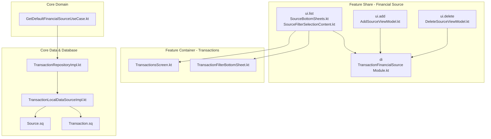
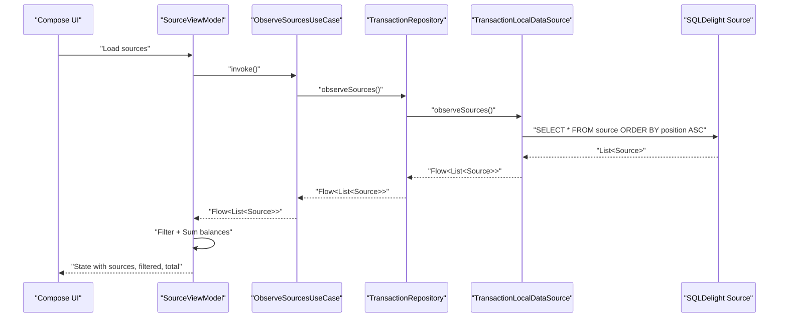
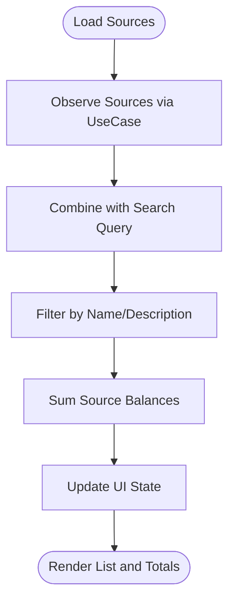
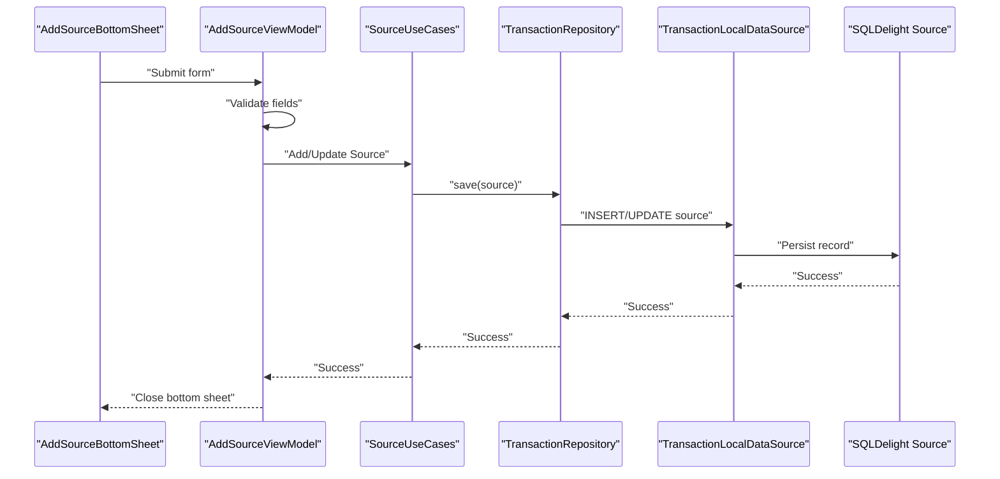
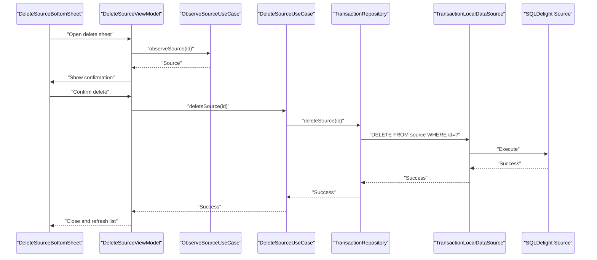
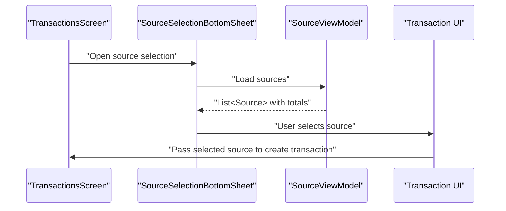
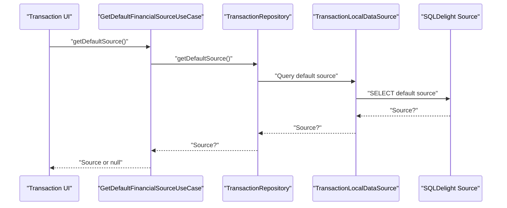
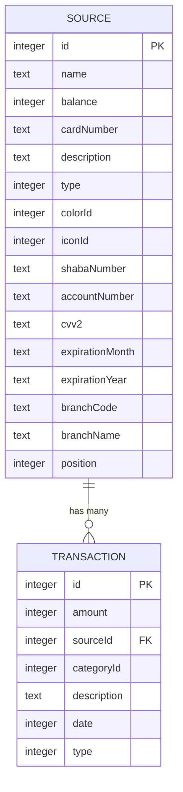
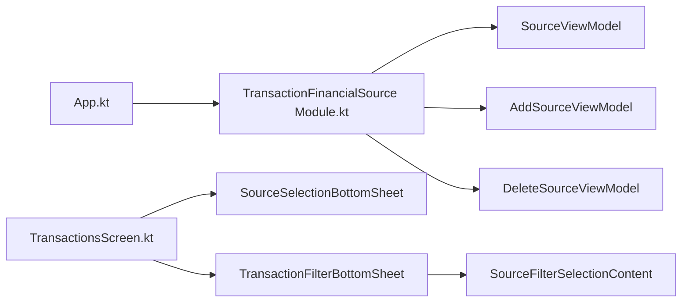

# Financial Source Management

<cite>
**Referenced Files in This Document**
- [SourceViewModel.kt](file://feature-share/source/src/commonMain/kotlin/com/kazemieh/financialsource/ui/list/SourceViewModel.kt)
- [AddSourceViewModel.kt](file://feature-share/source/src/commonMain/kotlin/com/kazemieh/financialsource/ui/add/AddSourceViewModel.kt)
- [DeleteSourceViewModel.kt](file://feature-share/source/src/commonMain/kotlin/com/kazemieh/financialsource/ui/delete/DeleteSourceViewModel.kt)
- [SourceBottomSheets.kt](file://feature-share/source/src/commonMain/kotlin/com/kazemieh/financialsource/ui/list/SourceBottomSheets.kt)
- [SourceFilterSelectionContent.kt](file://feature-share/source/src/commonMain/kotlin/com/kazemieh/financialsource/ui/list/SourceFilterSelectionContent.kt)
- [TransactionFinancialSource Module.kt](file://feature-share/source/src/commonMain/kotlin/com/kazemieh/financialsource/di/TransactionFinancialSource Module.kt)
- [TransactionsScreen.kt](file://feature-container/transactions/src/commonMain/kotlin/com/kazemieh/transactions/TransactionsScreen.kt)
- [TransactionFilterBottomSheet.kt](file://feature-container/transactions/src/commonMain/kotlin/com/kazemieh/transactions/TransactionFilterBottomSheet.kt)
- [GetDefaultFinancialSourceUseCase.kt](file://core/domain/src/commonMain/kotlin/com/kazemieh/domain/usecase/GetDefaultFinancialSourceUseCase.kt)
- [Source.sq](file://core/database/src/commonMain/sqldelight/com/kazemieh/database/Source.sq)
- [Transaction.sq](file://core/database/src/commonMain/sqldelight/com/kazemieh/database/Transaction.sq)
- [TransactionLocalDataSourceImpl.kt](file://core/database/src/commonMain/kotlin/com/kazemieh/database/datasource/TransactionLocalDataSourceImpl.kt)
- [TransactionRepositoryImpl.kt](file://core/data/src/commonMain/kotlin/com/kazemieh/data/repository/TransactionRepositoryImpl.kt)
- [DashboardScreen.kt](file://feature-container/dashboard/src/commonMain/kotlin/com/kazemieh/dashboard/DashboardScreen.kt)
- [App.kt](file://composeApp/src/commonMain/kotlin/com/kazemieh/composeApp/App.kt)
</cite>

## Table of Contents
1. [Introduction](#introduction)
2. [Project Structure](#project-structure)
3. [Core Components](#core-components)
4. [Architecture Overview](#architecture-overview)
5. [Detailed Component Analysis](#detailed-component-analysis)
6. [Dependency Analysis](#dependency-analysis)
7. [Performance Considerations](#performance-considerations)
8. [Troubleshooting Guide](#troubleshooting-guide)
9. [Conclusion](#conclusion)

## Introduction
This document describes the Financial Source Management shared feature module responsible for tracking and managing financial sources such as bank accounts, cash, digital wallets, and credit cards. It covers the ViewModel implementation for CRUD operations, balance calculations, and transaction associations; the bottom sheet interfaces for adding, editing, and deleting sources; the horizontal list display for quick source selection integrated with transaction creation; default source mechanisms; and currency handling. It also documents dependency injection setup, integration patterns with the transaction module, and solutions for common issues like duplicate accounts and balance discrepancies.

## Project Structure
The Financial Source feature is organized into three primary UI packages:
- ui.list: Source list, filter selection, and bottom sheets for selection
- ui.add: Add/edit source screens and ViewModels
- ui.delete: Delete source screens and ViewModels

The feature integrates with the transaction module via bottom sheets and filter components, and relies on domain use cases and database repositories for persistence and default source resolution.

**Diagram sources**
- [SourceBottomSheets.kt](file://feature-share/source/src/commonMain/kotlin/com/kazemieh/financialsource/ui/list/SourceBottomSheets.kt)
- [SourceFilterSelectionContent.kt](file://feature-share/source/src/commonMain/kotlin/com/kazemieh/financialsource/ui/list/SourceFilterSelectionContent.kt)
- [AddSourceViewModel.kt](file://feature-share/source/src/commonMain/kotlin/com/kazemieh/financialsource/ui/add/AddSourceViewModel.kt)
- [DeleteSourceViewModel.kt](file://feature-share/source/src/commonMain/kotlin/com/kazemieh/financialsource/ui/delete/DeleteSourceViewModel.kt)
- [TransactionFinancialSource Module.kt](file://feature-share/source/src/commonMain/kotlin/com/kazemieh/financialsource/di/TransactionFinancialSource Module.kt)
- [TransactionsScreen.kt](file://feature-container/transactions/src/commonMain/kotlin/com/kazemieh/transactions/TransactionsScreen.kt)
- [TransactionFilterBottomSheet.kt](file://feature-container/transactions/src/commonMain/kotlin/com/kazemieh/transactions/TransactionFilterBottomSheet.kt)
- [GetDefaultFinancialSourceUseCase.kt](file://core/domain/src/commonMain/kotlin/com/kazemieh/domain/usecase/GetDefaultFinancialSourceUseCase.kt)
- [TransactionLocalDataSourceImpl.kt](file://core/database/src/commonMain/kotlin/com/kazemieh/database/datasource/TransactionLocalDataSourceImpl.kt)
- [TransactionRepositoryImpl.kt](file://core/data/src/commonMain/kotlin/com/kazemieh/data/repository/TransactionRepositoryImpl.kt)
- [Source.sq](file://core/database/src/commonMain/sqldelight/com/kazemieh/database/Source.sq)
- [Transaction.sq](file://core/database/src/commonMain/sqldelight/com/kazemieh/database/Transaction.sq)

**Section sources**
- [SourceBottomSheets.kt](file://feature-share/source/src/commonMain/kotlin/com/kazemieh/financialsource/ui/list/SourceBottomSheets.kt)
- [TransactionsScreen.kt](file://feature-container/transactions/src/commonMain/kotlin/com/kazemieh/transactions/TransactionsScreen.kt)
- [TransactionFilterBottomSheet.kt](file://feature-container/transactions/src/commonMain/kotlin/com/kazemieh/transactions/TransactionFilterBottomSheet.kt)

## Core Components
- SourceViewModel: Manages list loading, search filtering, total balance calculation, and drag-to-reorder positions.
- AddSourceViewModel: Handles creation and updates of financial sources with validation and initialization.
- DeleteSourceViewModel: Manages deletion flow and observation of selected source.
- SourceBottomSheets: Provides bottom sheet UIs for selection, addition, editing, and deletion.
- SourceFilterSelectionContent: Integrates with transaction filters for source-based filtering.
- Dependency Injection: Registers ViewModels and their use cases scoped to the financial source feature.

Key responsibilities:
- Balance aggregation across all sources for summary views
- Transaction association via source selection during creation
- Default source retrieval for initial selections
- Cross-platform persistence via SQLDelight

**Section sources**
- [SourceViewModel.kt](file://feature-share/source/src/commonMain/kotlin/com/kazemieh/financialsource/ui/list/SourceViewModel.kt)
- [AddSourceViewModel.kt](file://feature-share/source/src/commonMain/kotlin/com/kazemieh/financialsource/ui/add/AddSourceViewModel.kt)
- [DeleteSourceViewModel.kt](file://feature-share/source/src/commonMain/kotlin/com/kazemieh/financialsource/ui/delete/DeleteSourceViewModel.kt)
- [SourceBottomSheets.kt](file://feature-share/source/src/commonMain/kotlin/com/kazemieh/financialsource/ui/list/SourceBottomSheets.kt)
- [SourceFilterSelectionContent.kt](file://feature-share/source/src/commonMain/kotlin/com/kazemieh/financialsource/ui/list/SourceFilterSelectionContent.kt)
- [TransactionFinancialSource Module.kt](file://feature-share/source/src/commonMain/kotlin/com/kazemieh/financialsource/di/TransactionFinancialSource Module.kt)

## Architecture Overview
The feature follows a layered architecture:
- Presentation layer: Compose UI and ViewModels
- Domain layer: Use cases for observing sources, updating positions, and retrieving default source
- Data layer: Repositories and SQLDelight data sources
- Database: SQLDelight tables for Source and Transaction

**Diagram sources**
- [SourceViewModel.kt](file://feature-share/source/src/commonMain/kotlin/com/kazemieh/financialsource/ui/list/SourceViewModel.kt)
- [TransactionRepositoryImpl.kt](file://core/data/src/commonMain/kotlin/com/kazemieh/data/repository/TransactionRepositoryImpl.kt)
- [TransactionLocalDataSourceImpl.kt](file://core/database/src/commonMain/kotlin/com/kazemieh/database/datasource/TransactionLocalDataSourceImpl.kt)
- [Source.sq](file://core/database/src/commonMain/sqldelight/com/kazemieh/database/Source.sq)

## Detailed Component Analysis

### Source List and Selection
The list screen displays financial sources in a horizontally scrollable layout, enabling quick selection during transaction creation. The ViewModel observes all sources, applies search filtering, and computes a total balance across all sources.

**Diagram sources**
- [SourceViewModel.kt](file://feature-share/source/src/commonMain/kotlin/com/kazemieh/financialsource/ui/list/SourceViewModel.kt)

**Section sources**
- [SourceViewModel.kt](file://feature-share/source/src/commonMain/kotlin/com/kazemieh/financialsource/ui/list/SourceViewModel.kt)
- [TransactionsScreen.kt](file://feature-container/transactions/src/commonMain/kotlin/com/kazemieh/transactions/TransactionsScreen.kt)

### Add/Edit Source Bottom Sheet
The add/edit bottom sheet validates input fields and initializes balances. It supports creation of bank accounts, cash, digital wallets, and credit cards with appropriate fields mapped to the Source entity.

**Diagram sources**
- [AddSourceViewModel.kt](file://feature-share/source/src/commonMain/kotlin/com/kazemieh/financialsource/ui/add/AddSourceViewModel.kt)
- [TransactionRepositoryImpl.kt](file://core/data/src/commonMain/kotlin/com/kazemieh/data/repository/TransactionRepositoryImpl.kt)
- [TransactionLocalDataSourceImpl.kt](file://core/database/src/commonMain/kotlin/com/kazemieh/database/datasource/TransactionLocalDataSourceImpl.kt)
- [Source.sq](file://core/database/src/commonMain/sqldelight/com/kazemieh/database/Source.sq)

**Section sources**
- [AddSourceViewModel.kt](file://feature-share/source/src/commonMain/kotlin/com/kazemieh/financialsource/ui/add/AddSourceViewModel.kt)
- [SourceBottomSheets.kt](file://feature-share/source/src/commonMain/kotlin/com/kazemieh/financialsource/ui/list/SourceBottomSheets.kt)

### Delete Source Bottom Sheet
The delete flow confirms removal and ensures the selected source is observed before deletion. It prevents accidental deletions by requiring explicit confirmation.

**Diagram sources**
- [DeleteSourceViewModel.kt](file://feature-share/source/src/commonMain/kotlin/com/kazemieh/financialsource/ui/delete/DeleteSourceViewModel.kt)
- [TransactionRepositoryImpl.kt](file://core/data/src/commonMain/kotlin/com/kazemieh/data/repository/TransactionRepositoryImpl.kt)
- [TransactionLocalDataSourceImpl.kt](file://core/database/src/commonMain/kotlin/com/kazemieh/database/datasource/TransactionLocalDataSourceImpl.kt)
- [Source.sq](file://core/database/src/commonMain/sqldelight/com/kazemieh/database/Source.sq)

**Section sources**
- [DeleteSourceViewModel.kt](file://feature-share/source/src/commonMain/kotlin/com/kazemieh/financialsource/ui/delete/DeleteSourceViewModel.kt)
- [SourceBottomSheets.kt](file://feature-share/source/src/commonMain/kotlin/com/kazemieh/financialsource/ui/list/SourceBottomSheets.kt)

### Transaction Integration and Filtering
The transaction module integrates with the financial source feature through:
- SourceSelectionBottomSheet for choosing a source during transaction creation
- SourceFilterSelectionContent for filtering transactions by source in the filter bottom sheet

**Diagram sources**
- [TransactionsScreen.kt](file://feature-container/transactions/src/commonMain/kotlin/com/kazemieh/transactions/TransactionsScreen.kt)
- [SourceBottomSheets.kt](file://feature-share/source/src/commonMain/kotlin/com/kazemieh/financialsource/ui/list/SourceBottomSheets.kt)
- [SourceViewModel.kt](file://feature-share/source/src/commonMain/kotlin/com/kazemieh/financialsource/ui/list/SourceViewModel.kt)

**Section sources**
- [TransactionsScreen.kt](file://feature-container/transactions/src/commonMain/kotlin/com/kazemieh/transactions/TransactionsScreen.kt)
- [TransactionFilterBottomSheet.kt](file://feature-container/transactions/src/commonMain/kotlin/com/kazemieh/transactions/TransactionFilterBottomSheet.kt)
- [SourceFilterSelectionContent.kt](file://feature-share/source/src/commonMain/kotlin/com/kazemieh/financialsource/ui/list/SourceFilterSelectionContent.kt)

### Default Source Mechanism
The default financial source is resolved by a dedicated use case that queries the repository for a persisted default source. This enables quick selection during transaction creation when no explicit source is chosen.

**Diagram sources**
- [GetDefaultFinancialSourceUseCase.kt](file://core/domain/src/commonMain/kotlin/com/kazemieh/domain/usecase/GetDefaultFinancialSourceUseCase.kt)
- [TransactionRepositoryImpl.kt](file://core/data/src/commonMain/kotlin/com/kazemieh/data/repository/TransactionRepositoryImpl.kt)
- [TransactionLocalDataSourceImpl.kt](file://core/database/src/commonMain/kotlin/com/kazemieh/database/datasource/TransactionLocalDataSourceImpl.kt)
- [Source.sq](file://core/database/src/commonMain/sqldelight/com/kazemieh/database/Source.sq)

**Section sources**
- [GetDefaultFinancialSourceUseCase.kt](file://core/domain/src/commonMain/kotlin/com/kazemieh/domain/usecase/GetDefaultFinancialSourceUseCase.kt)

### Data Model and Persistence
The Source entity stores attributes for different source types (bank account, cash, wallet, credit card) and maintains balance and metadata. Transactions reference sources to establish associations.

**Diagram sources**
- [Source.sq](file://core/database/src/commonMain/sqldelight/com/kazemieh/database/Source.sq)
- [Transaction.sq](file://core/database/src/commonMain/sqldelight/com/kazemieh/database/Transaction.sq)

**Section sources**
- [Source.sq](file://core/database/src/commonMain/sqldelight/com/kazemieh/database/Source.sq)
- [Transaction.sq](file://core/database/src/commonMain/sqldelight/com/kazemieh/database/Transaction.sq)

## Dependency Analysis
The financial source feature registers its ViewModels and use cases via Koin modules. The transaction module depends on the financial source UI components for selection and filtering.

**Diagram sources**
- [App.kt](file://composeApp/src/commonMain/kotlin/com/kazemieh/composeApp/App.kt)
- [TransactionFinancialSource Module.kt](file://feature-share/source/src/commonMain/kotlin/com/kazemieh/financialsource/di/TransactionFinancialSource Module.kt)
- [TransactionsScreen.kt](file://feature-container/transactions/src/commonMain/kotlin/com/kazemieh/transactions/TransactionsScreen.kt)
- [TransactionFilterBottomSheet.kt](file://feature-container/transactions/src/commonMain/kotlin/com/kazemieh/transactions/TransactionFilterBottomSheet.kt)
- [SourceFilterSelectionContent.kt](file://feature-share/source/src/commonMain/kotlin/com/kazemieh/financialsource/ui/list/SourceFilterSelectionContent.kt)

**Section sources**
- [App.kt](file://composeApp/src/commonMain/kotlin/com/kazemieh/composeApp/App.kt)
- [TransactionFinancialSource Module.kt](file://feature-share/source/src/commonMain/kotlin/com/kazemieh/financialsource/di/TransactionFinancialSource Module.kt)

## Performance Considerations
- Efficient filtering: Apply filtering after observing sources to minimize recompositions.
- Balance aggregation: Compute totals lazily and cache results when the source list is stable.
- Horizontal list rendering: Use lazy layouts to render visible items only.
- Drag-and-drop reordering: Debounce position updates to avoid frequent database writes.
- Large lists: Consider pagination or virtualization if the number of sources grows significantly.

## Troubleshooting Guide
Common issues and resolutions:
- Duplicate accounts: Validate uniqueness of identifiers (e.g., accountNumber, cardNumber) before saving. Show user-friendly error messages when duplicates are detected.
- Balance discrepancies: Ensure balance adjustments are applied atomically and consistently across related transactions. Verify SQL triggers or application-level adjustments.
- Performance with large source lists: Use lazy composition, debounce search queries, and batch position updates.
- Cross-platform synchronization: Confirm SQLDelight schema compatibility across platforms and ensure migrations are applied consistently.

## Conclusion
The Financial Source Management module provides a robust foundation for tracking diverse financial sources, integrating seamlessly with transaction creation and filtering. Its ViewModel-driven architecture, combined with SQLDelight persistence and Koin dependency injection, delivers a scalable solution across platforms. By following the recommended practices and troubleshooting steps, teams can maintain accuracy, performance, and user experience as the feature evolves.