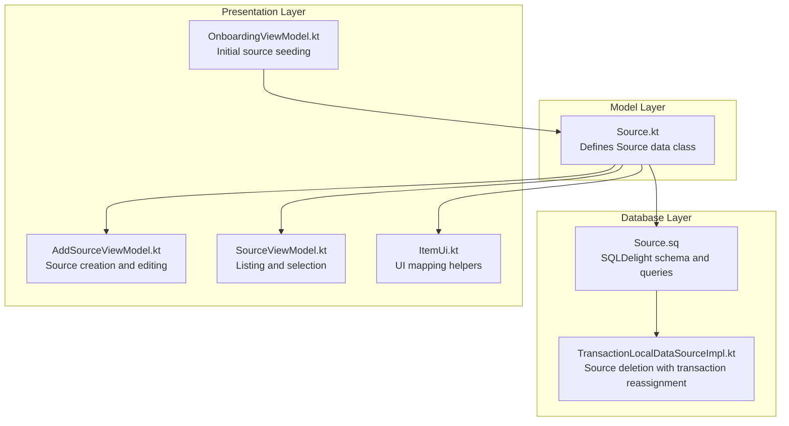
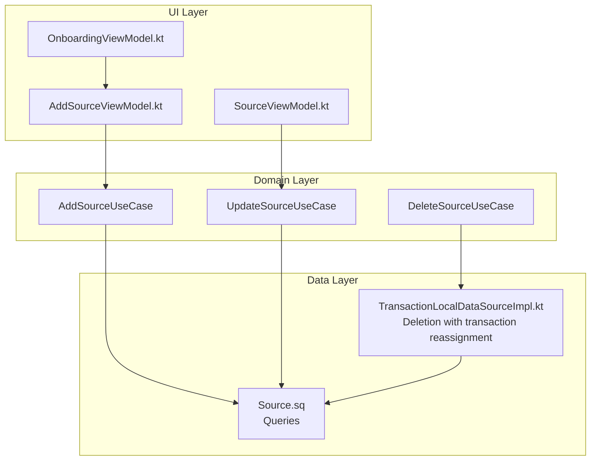
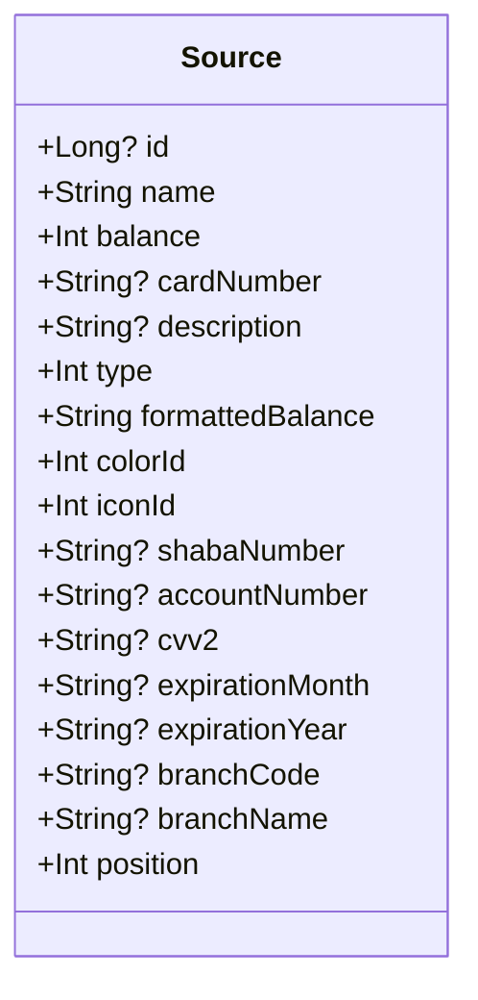
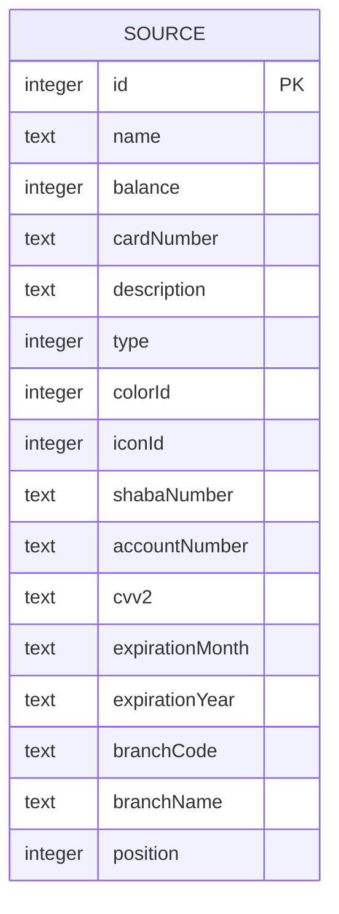
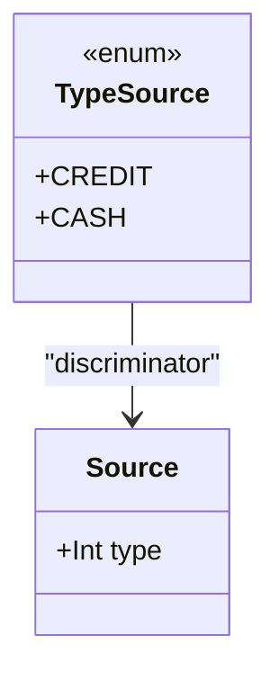
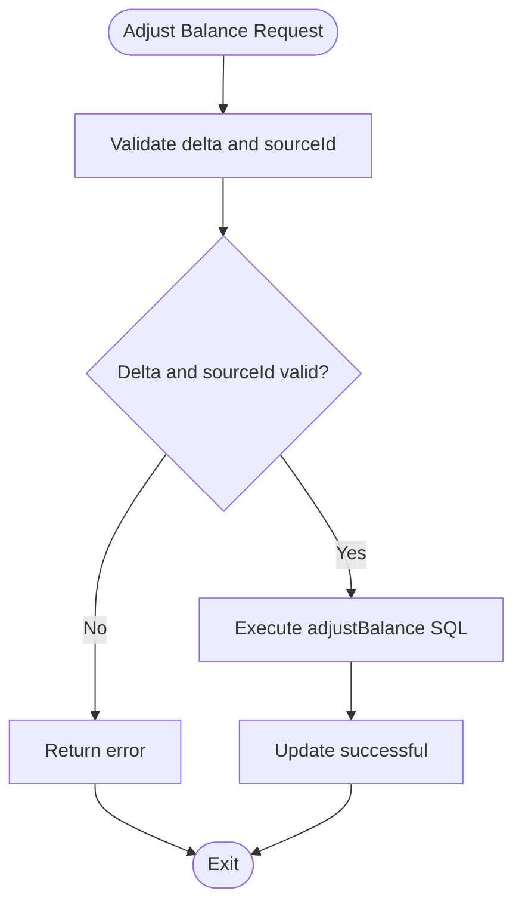
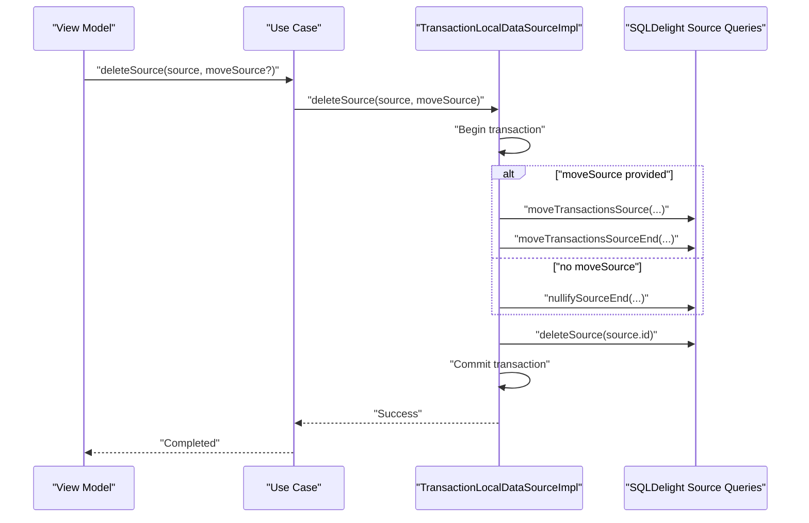
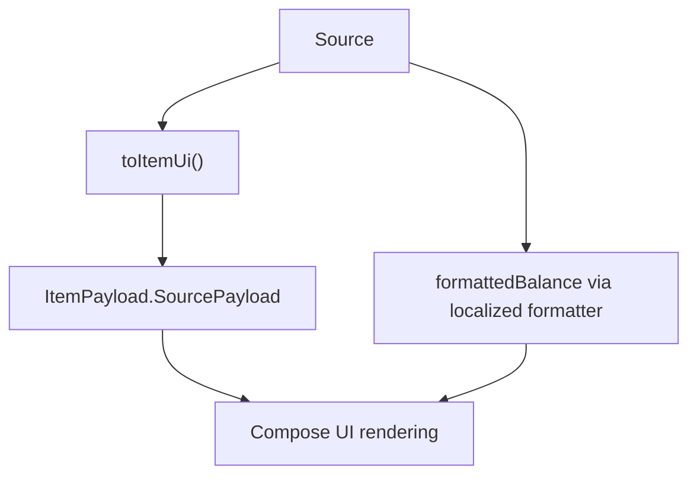
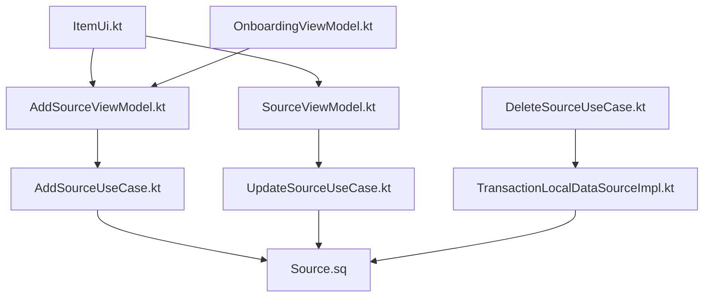

# Source Data Models and Entities

<cite>
**Referenced Files in This Document**
- [Source.kt](file://core/common/src/commonMain/kotlin/com/kazemieh/common/model/Source.kt)
- [Source.sq](file://core/database/src/commonMain/sqldelight/com/kazemieh/database/Source.sq)
- [TransactionLocalDataSourceImpl.kt](file://core/database/src/commonMain/kotlin/com/kazemieh/database/datasource/TransactionLocalDataSourceImpl.kt)
- [AddSourceUseCase.kt](file://core/domain/src/commonMain/kotlin/com/kazemieh/domain/usecase/AddSourceUseCase.kt)
- [UpdateSourceUseCase.kt](file://core/domain/src/commonMain/kotlin/com/kazemieh/domain/usecase/UpdateSourceUseCase.kt)
- [DeleteSourceUseCase.kt](file://core/domain/src/commonMain/kotlin/com/kazemieh/domain/usecase/DeleteSourceUseCase.kt)
- [AddSourceViewModel.kt](file://feature-share/source/src/commonMain/kotlin/com/kazemieh/financialsource/ui/add/AddSourceViewModel.kt)
- [SourceViewModel.kt](file://feature-share/source/src/commonMain/kotlin/com/kazemieh/financialsource/ui/list/SourceViewModel.kt)
- [ItemUi.kt](file://core/designsystem/src/commonMain/kotlin/com/kazemieh/designsystem/component/model/ItemUi.kt)
- [OnboardingViewModel.kt](file://feature-container/onboarding/src/commonMain/kotlin/com/kazemieh/onboarding/ui/OnboardingViewModel.kt)
</cite>

## Table of Contents
1. [Introduction](#introduction)
2. [Project Structure](#project-structure)
3. [Core Components](#core-components)
4. [Architecture Overview](#architecture-overview)
5. [Detailed Component Analysis](#detailed-component-analysis)
6. [Dependency Analysis](#dependency-analysis)
7. [Performance Considerations](#performance-considerations)
8. [Troubleshooting Guide](#troubleshooting-guide)
9. [Conclusion](#conclusion)

## Introduction
This document provides comprehensive data model documentation for financial source entities in the FinTrack project. It covers the Source data class structure, database schema with SQLDelight annotations, source type categorization, validation rules, balance calculation algorithms, currency handling, persistence patterns, migration strategies, and performance considerations for large datasets. Examples of source creation, balance updates, and transaction association patterns are included to guide implementation.

## Project Structure
The Source entity spans three layers:
- Model layer: Defines the Source data class used across the application.
- Database layer: Declares the SQLDelight schema and queries for Source persistence.
- Presentation layer: Provides UI view models and state for adding/editing sources and displaying balances.

**Diagram sources**
- [Source.kt:1-26](file://core/common/src/commonMain/kotlin/com/kazemieh/common/model/Source.kt#L1-L26)
- [Source.sq:1-46](file://core/database/src/commonMain/sqldelight/com/kazemieh/database/Source.sq#L1-L46)
- [TransactionLocalDataSourceImpl.kt:254-272](file://core/database/src/commonMain/kotlin/com/kazemieh/database/datasource/TransactionLocalDataSourceImpl.kt#L254-L272)
- [AddSourceViewModel.kt:196-278](file://feature-share/source/src/commonMain/kotlin/com/kazemieh/financialsource/ui/add/AddSourceViewModel.kt#L196-L278)
- [SourceViewModel.kt:120-149](file://feature-share/source/src/commonMain/kotlin/com/kazemieh/financialsource/ui/list/SourceViewModel.kt#L120-L149)
- [ItemUi.kt:80-102](file://core/designsystem/src/commonMain/kotlin/com/kazemieh/designsystem/component/model/ItemUi.kt#L80-L102)
- [OnboardingViewModel.kt:37-75](file://feature-container/onboarding/src/commonMain/kotlin/com/kazemieh/onboarding/ui/OnboardingViewModel.kt#L37-L75)

**Section sources**
- [Source.kt:1-26](file://core/common/src/commonMain/kotlin/com/kazemieh/common/model/Source.kt#L1-L26)
- [Source.sq:1-46](file://core/database/src/commonMain/sqldelight/com/kazemieh/database/Source.sq#L1-L46)
- [AddSourceViewModel.kt:196-278](file://feature-share/source/src/commonMain/kotlin/com/kazemieh/financialsource/ui/add/AddSourceViewModel.kt#L196-L278)
- [SourceViewModel.kt:120-149](file://feature-share/source/src/commonMain/kotlin/com/kazemieh/financialsource/ui/list/SourceViewModel.kt#L120-L149)
- [ItemUi.kt:80-102](file://core/designsystem/src/commonMain/kotlin/com/kazemieh/designsystem/component/model/ItemUi.kt#L80-L102)
- [OnboardingViewModel.kt:37-75](file://feature-container/onboarding/src/commonMain/kotlin/com/kazemieh/onboarding/ui/OnboardingViewModel.kt#L37-L75)

## Core Components
This section documents the Source data class and its database representation.

- Source data class properties:
  - id: Unique identifier (nullable for new records).
  - name: Required display name.
  - balance: Integer amount stored in minor units (e.g., smallest currency denomination).
  - cardNumber: Optional card number for card-type sources.
  - description: Optional description.
  - type: Integer discriminator for source categories (e.g., credit or cash).
  - formattedBalance: String representation derived from balance via localized formatter.
  - colorId: Integer identifier for UI color.
  - iconId: Integer identifier for UI icon.
  - shabaNumber: Optional IBAN-like identifier for bank accounts.
  - accountNumber: Optional bank account number.
  - cvv2: Optional CVV for cards.
  - expirationMonth: Optional expiry month.
  - expirationYear: Optional expiry year.
  - branchCode: Optional branch code for bank accounts.
  - branchName: Optional branch name for bank accounts.
  - position: Integer ordering hint for UI lists.

- Database schema (SQLDelight):
  - Table: source with primary key id and columns for all Source properties.
  - Default values: balance defaults to 0; colorId and iconId default to 1; position defaults to 0.
  - Queries:
    - addSource: Insert new source with all fields.
    - observeSources: Select all sources ordered by position.
    - observeSourceById: Select by id.
    - adjustBalance: Increment/decrement balance by delta.
    - deleteSource: Delete by id.
    - updateSource: Update all fields by id.
    - updateSourcePosition: Update position by id.

- Source type categorization:
  - Enum TypeSource defines categories: CREDIT and CASH.
  - The type property stores an integer discriminator mapped from TypeSource.

- Validation rules:
  - Name is required (non-blank) in UI forms.
  - Balance is stored as integer (minor units); conversion to/from currency is handled by presentation logic.
  - Card-related fields (cardNumber, cvv2, expirationMonth/year) are optional but should be validated when present.
  - Bank-related fields (shabaNumber, accountNumber, branchCode/name) are optional but should be validated when present.

- Balance calculation and currency handling:
  - Balance is stored as integer representing minor units (e.g., cents or smallest currency unit).
  - Formatted balance is computed via a localized formatter applied to the balance value.
  - Adjustments are performed atomically via the adjustBalance query.

- Persistence patterns:
  - Creation: Use addSource with initial balance and metadata.
  - Updates: Use updateSource to modify properties; use updateSourcePosition for reordering.
  - Deletion: Use deleteSource; when deleting with associated transactions, reassign or nullify references in a transaction block.

- Migration strategies:
  - Add new columns with defaults to preserve existing rows.
  - Use ALTER TABLE statements in incremental migration scripts.
  - Maintain backward compatibility by avoiding breaking changes to existing columns.

- Performance considerations:
  - Indexing: Consider adding an index on position for frequent reordering operations.
  - Batch updates: Use transactions for bulk operations (e.g., reassigning transactions during source deletion).
  - Query optimization: Prefer ordered retrieval by position and selective updates by id.

**Section sources**
- [Source.kt:7-26](file://core/common/src/commonMain/kotlin/com/kazemieh/common/model/Source.kt#L7-L26)
- [Source.sq:1-46](file://core/database/src/commonMain/sqldelight/com/kazemieh/database/Source.sq#L1-L46)
- [AddSourceViewModel.kt:268-271](file://feature-share/source/src/commonMain/kotlin/com/kazemieh/financialsource/ui/add/AddSourceViewModel.kt#L268-L271)
- [ItemUi.kt:80-102](file://core/designsystem/src/commonMain/kotlin/com/kazemieh/designsystem/component/model/ItemUi.kt#L80-L102)
- [OnboardingViewModel.kt:49-68](file://feature-container/onboarding/src/commonMain/kotlin/com/kazemieh/onboarding/ui/OnboardingViewModel.kt#L49-L68)

## Architecture Overview
The Source entity integrates across layers with explicit responsibilities:
- Model: Encapsulates business data and formatting.
- Database: Manages persistence and balance adjustments.
- Presentation: Handles user interactions, validation, and state.

**Diagram sources**
- [AddSourceUseCase.kt:1-20](file://core/domain/src/commonMain/kotlin/com/kazemieh/domain/usecase/AddSourceUseCase.kt#L1-L20)
- [UpdateSourceUseCase.kt:1-20](file://core/domain/src/commonMain/kotlin/com/kazemieh/domain/usecase/UpdateSourceUseCase.kt#L1-L20)
- [DeleteSourceUseCase.kt:1-20](file://core/domain/src/commonMain/kotlin/com/kazemieh/domain/usecase/DeleteSourceUseCase.kt#L1-L20)
- [Source.sq:20-44](file://core/database/src/commonMain/sqldelight/com/kazemieh/database/Source.sq#L20-L44)
- [TransactionLocalDataSourceImpl.kt:254-272](file://core/database/src/commonMain/kotlin/com/kazemieh/database/datasource/TransactionLocalDataSourceImpl.kt#L254-L272)
- [AddSourceViewModel.kt:196-278](file://feature-share/source/src/commonMain/kotlin/com/kazemieh/financialsource/ui/add/AddSourceViewModel.kt#L196-L278)
- [SourceViewModel.kt:120-149](file://feature-share/source/src/commonMain/kotlin/com/kazemieh/financialsource/ui/list/SourceViewModel.kt#L120-L149)
- [OnboardingViewModel.kt:37-75](file://feature-container/onboarding/src/commonMain/kotlin/com/kazemieh/onboarding/ui/OnboardingViewModel.kt#L37-L75)

## Detailed Component Analysis

### Source Data Class
The Source data class encapsulates financial source metadata and formatting. It supports optional attributes for cards and bank accounts, and includes a position field for UI ordering.

**Diagram sources**
- [Source.kt:7-26](file://core/common/src/commonMain/kotlin/com/kazemieh/common/model/Source.kt#L7-L26)

**Section sources**
- [Source.kt:7-26](file://core/common/src/commonMain/kotlin/com/kazemieh/common/model/Source.kt#L7-L26)

### Database Schema and Queries
The SQLDelight schema defines the source table and provides CRUD and balance adjustment operations. It includes optional fields for card and bank details and supports ordering via position.

**Diagram sources**
- [Source.sq:1-18](file://core/database/src/commonMain/sqldelight/com/kazemieh/database/Source.sq#L1-L18)

**Section sources**
- [Source.sq:1-46](file://core/database/src/commonMain/sqldelight/com/kazemieh/database/Source.sq#L1-L46)

### Source Type Categorization
The UI defines source types using an enum with integer discriminators. The model and database store the discriminator as an integer.

**Diagram sources**
- [AddSourceViewModel.kt:268-271](file://feature-share/source/src/commonMain/kotlin/com/kazemieh/financialsource/ui/add/AddSourceViewModel.kt#L268-L271)
- [Source.kt](file://core/common/src/commonMain/kotlin/com/kazemieh/common/model/Source.kt#L14)

**Section sources**
- [AddSourceViewModel.kt:268-271](file://feature-share/source/src/commonMain/kotlin/com/kazemieh/financialsource/ui/add/AddSourceViewModel.kt#L268-L271)
- [Source.kt](file://core/common/src/commonMain/kotlin/com/kazemieh/common/model/Source.kt#L14)

### Balance Adjustment Algorithm
Balance updates are performed atomically via an SQL UPDATE statement that adds a delta to the current balance.

**Diagram sources**
- [Source.sq:30-33](file://core/database/src/commonMain/sqldelight/com/kazemieh/database/Source.sq#L30-L33)

**Section sources**
- [Source.sq:30-33](file://core/database/src/commonMain/sqldelight/com/kazemieh/database/Source.sq#L30-L33)

### Transaction Association During Source Deletion
When deleting a source with associated transactions, the data layer reassigns transactions to another source or nullifies references within a transaction block to maintain referential integrity.

**Diagram sources**
- [TransactionLocalDataSourceImpl.kt:254-272](file://core/database/src/commonMain/kotlin/com/kazemieh/database/datasource/TransactionLocalDataSourceImpl.kt#L254-L272)
- [Source.sq:35-36](file://core/database/src/commonMain/sqldelight/com/kazemieh/database/Source.sq#L35-L36)

**Section sources**
- [TransactionLocalDataSourceImpl.kt:254-272](file://core/database/src/commonMain/kotlin/com/kazemieh/database/datasource/TransactionLocalDataSourceImpl.kt#L254-L272)

### UI Mapping and Formatting
The UI layer maps Source instances to ItemUi for rendering and applies localized formatting for balances.

**Diagram sources**
- [ItemUi.kt:80-102](file://core/designsystem/src/commonMain/kotlin/com/kazemieh/designsystem/component/model/ItemUi.kt#L80-L102)
- [Source.kt](file://core/common/src/commonMain/kotlin/com/kazemieh/common/model/Source.kt#L15)

**Section sources**
- [ItemUi.kt:80-102](file://core/designsystem/src/commonMain/kotlin/com/kazemieh/designsystem/component/model/ItemUi.kt#L80-L102)
- [Source.kt](file://core/common/src/commonMain/kotlin/com/kazemieh/common/model/Source.kt#L15)

### Examples

- Source creation:
  - Use AddSourceViewModel to collect user input, convert to SourceDraft, and persist via AddSourceUseCase and SQLDelight addSource query.
  - Example path: [AddSourceViewModel.kt:196-238](file://feature-share/source/src/commonMain/kotlin/com/kazemieh/financialsource/ui/add/AddSourceViewModel.kt#L196-L238)

- Balance updates:
  - Adjust balance using the adjustBalance query with a delta value.
  - Example path: [Source.sq:30-33](file://core/database/src/commonMain/sqldelight/com/kazemieh/database/Source.sq#L30-L33)

- Transaction association patterns:
  - Reassign transactions to another source or nullify references during deletion using TransactionLocalDataSourceImpl.
  - Example path: [TransactionLocalDataSourceImpl.kt:254-272](file://core/database/src/commonMain/kotlin/com/kazemieh/database/datasource/TransactionLocalDataSourceImpl.kt#L254-L272)

**Section sources**
- [AddSourceViewModel.kt:196-238](file://feature-share/source/src/commonMain/kotlin/com/kazemieh/financialsource/ui/add/AddSourceViewModel.kt#L196-L238)
- [Source.sq:30-33](file://core/database/src/commonMain/sqldelight/com/kazemieh/database/Source.sq#L30-L33)
- [TransactionLocalDataSourceImpl.kt:254-272](file://core/database/src/commonMain/kotlin/com/kazemieh/database/datasource/TransactionLocalDataSourceImpl.kt#L254-L272)

## Dependency Analysis
The following diagram shows dependencies among core components involved in Source management.

**Diagram sources**
- [AddSourceViewModel.kt:196-278](file://feature-share/source/src/commonMain/kotlin/com/kazemieh/financialsource/ui/add/AddSourceViewModel.kt#L196-L278)
- [SourceViewModel.kt:120-149](file://feature-share/source/src/commonMain/kotlin/com/kazemieh/financialsource/ui/list/SourceViewModel.kt#L120-L149)
- [AddSourceUseCase.kt:1-20](file://core/domain/src/commonMain/kotlin/com/kazemieh/domain/usecase/AddSourceUseCase.kt#L1-L20)
- [UpdateSourceUseCase.kt:1-20](file://core/domain/src/commonMain/kotlin/com/kazemieh/domain/usecase/UpdateSourceUseCase.kt#L1-L20)
- [DeleteSourceUseCase.kt:1-20](file://core/domain/src/commonMain/kotlin/com/kazemieh/domain/usecase/DeleteSourceUseCase.kt#L1-L20)
- [Source.sq:20-44](file://core/database/src/commonMain/sqldelight/com/kazemieh/database/Source.sq#L20-L44)
- [TransactionLocalDataSourceImpl.kt:254-272](file://core/database/src/commonMain/kotlin/com/kazemieh/database/datasource/TransactionLocalDataSourceImpl.kt#L254-L272)
- [ItemUi.kt:80-102](file://core/designsystem/src/commonMain/kotlin/com/kazemieh/designsystem/component/model/ItemUi.kt#L80-L102)
- [OnboardingViewModel.kt:37-75](file://feature-container/onboarding/src/commonMain/kotlin/com/kazemieh/onboarding/ui/OnboardingViewModel.kt#L37-L75)

**Section sources**
- [AddSourceUseCase.kt:1-20](file://core/domain/src/commonMain/kotlin/com/kazemieh/domain/usecase/AddSourceUseCase.kt#L1-L20)
- [UpdateSourceUseCase.kt:1-20](file://core/domain/src/commonMain/kotlin/com/kazemieh/domain/usecase/UpdateSourceUseCase.kt#L1-L20)
- [DeleteSourceUseCase.kt:1-20](file://core/domain/src/commonMain/kotlin/com/kazemieh/domain/usecase/DeleteSourceUseCase.kt#L1-L20)
- [Source.sq:20-44](file://core/database/src/commonMain/sqldelight/com/kazemieh/database/Source.sq#L20-L44)
- [TransactionLocalDataSourceImpl.kt:254-272](file://core/database/src/commonMain/kotlin/com/kazemieh/database/datasource/TransactionLocalDataSourceImpl.kt#L254-L272)
- [ItemUi.kt:80-102](file://core/designsystem/src/commonMain/kotlin/com/kazemieh/designsystem/component/model/ItemUi.kt#L80-L102)
- [OnboardingViewModel.kt:37-75](file://feature-container/onboarding/src/commonMain/kotlin/com/kazemieh/onboarding/ui/OnboardingViewModel.kt#L37-L75)

## Performance Considerations
- Indexing: Consider adding an index on position for efficient reordering operations.
- Transactions: Wrap batch operations (e.g., moving transactions during deletion) in a single transaction to reduce overhead and ensure atomicity.
- Query patterns: Prefer ordered retrieval by position and targeted updates by id to minimize scan costs.
- Large datasets: Paginate source lists and defer heavy computations until UI rendering to maintain responsiveness.

## Troubleshooting Guide
- Balance discrepancies:
  - Verify that deltas are integers representing minor units and that adjustBalance is executed within a transaction.
  - Reference: [Source.sq:30-33](file://core/database/src/commonMain/sqldelight/com/kazemieh/database/Source.sq#L30-L33)

- Source deletion failures:
  - Ensure that either a replacement source is provided or transactions are nullified; otherwise, referential integrity errors may occur.
  - Reference: [TransactionLocalDataSourceImpl.kt:254-272](file://core/database/src/commonMain/kotlin/com/kazemieh/database/datasource/TransactionLocalDataSourceImpl.kt#L254-L272)

- UI formatting issues:
  - Confirm that formattedBalance is derived from the balance value and that localization formatting is applied consistently.
  - Reference: [Source.kt](file://core/common/src/commonMain/kotlin/com/kazemieh/common/model/Source.kt#L15), [ItemUi.kt:80-102](file://core/designsystem/src/commonMain/kotlin/com/kazemieh/designsystem/component/model/ItemUi.kt#L80-L102)

**Section sources**
- [Source.sq:30-33](file://core/database/src/commonMain/sqldelight/com/kazemieh/database/Source.sq#L30-L33)
- [TransactionLocalDataSourceImpl.kt:254-272](file://core/database/src/commonMain/kotlin/com/kazemieh/database/datasource/TransactionLocalDataSourceImpl.kt#L254-L272)
- [Source.kt](file://core/common/src/commonMain/kotlin/com/kazemieh/common/model/Source.kt#L15)
- [ItemUi.kt:80-102](file://core/designsystem/src/commonMain/kotlin/com/kazemieh/designsystem/component/model/ItemUi.kt#L80-L102)

## Conclusion
The Source entity in FinTrack is designed as a robust, extensible model supporting diverse financial instruments (cash, credit, bank accounts). Its SQLDelight-backed persistence ensures reliable balance updates and transaction associations, while UI mappings provide consistent formatting and ordering. Adhering to the validation rules, leveraging transactions for batch operations, and applying appropriate indexing strategies will support scalability and maintainability as the dataset grows.