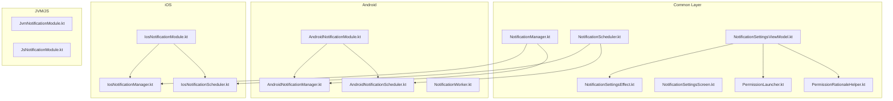
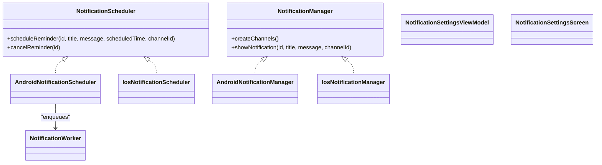
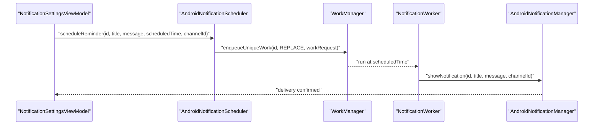
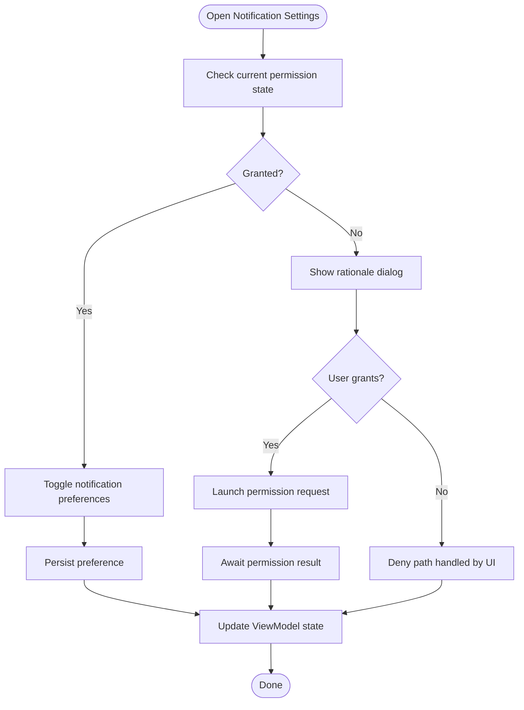
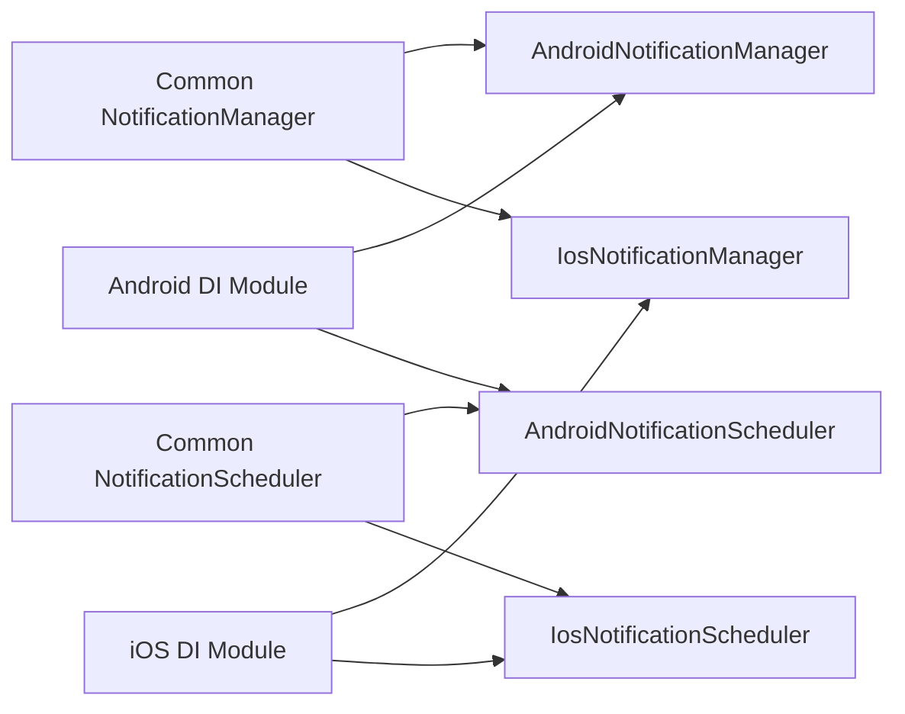
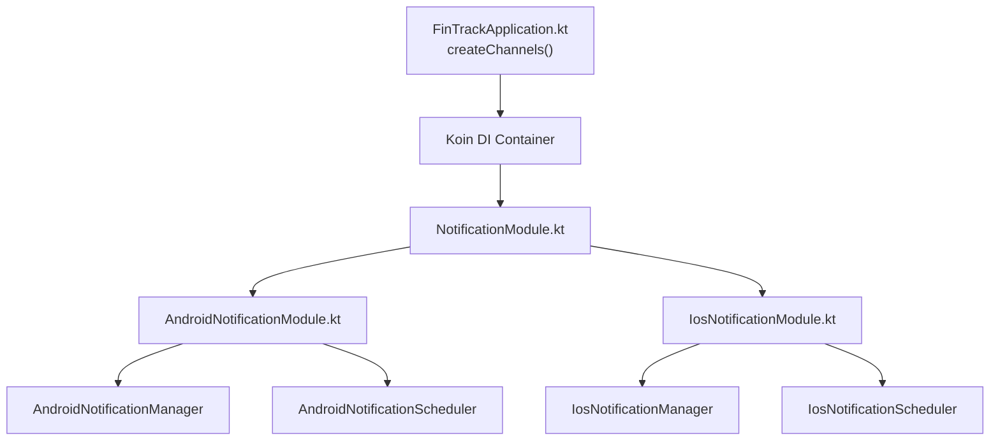
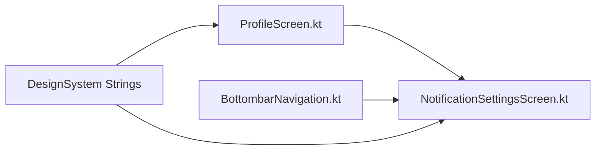

# Notifications System

<cite>
**Referenced Files in This Document**
- [NotificationScheduler.kt](file://feature-share/notifications/src/commonMain/kotlin/com/kazemieh/notifications/NotificationScheduler.kt)
- [AndroidNotificationScheduler.kt](file://feature-share/notifications/src/androidMain/kotlin/com/kazemieh/notifications/AndroidNotificationScheduler.kt)
- [IosNotificationScheduler.kt](file://feature-share/notifications/src/iosMain/kotlin/com/kazemieh/notifications/IosNotificationScheduler.kt)
- [NotificationWorker.kt](file://feature-share/notifications/src/androidMain/kotlin/com/kazemieh/notifications/NotificationWorker.kt)
- [AndroidNotificationManager.kt](file://feature-share/notifications/src/androidMain/kotlin/com/kazemieh/notifications/AndroidNotificationManager.kt)
- [IosNotificationManager.kt](file://feature-share/notifications/src/iosMain/kotlin/com/kazemieh/notifications/IosNotificationManager.kt)
- [NotificationManager.kt](file://feature-share/notifications/src/commonMain/kotlin/com/kazemieh/notifications/NotificationManager.kt)
- [NotificationSettingsViewModel.kt](file://feature-share/notifications/src/commonMain/kotlin/com/kazemieh/notifications/ui/NotificationSettingsViewModel.kt)
- [NotificationSettingsScreen.kt](file://feature-share/notifications/src/commonMain/kotlin/com/kazemieh/notifications/ui/NotificationSettingsScreen.kt)
- [NotificationSettingsEffect.kt](file://feature-share/notifications/src/commonMain/kotlin/com/kazemieh/notifications/ui/NotificationSettingsEffect.kt)
- [PermissionLauncher.kt](file://feature-share/notifications/src/commonMain/kotlin/com/kazemieh/notifications/ui/PermissionLauncher.kt)
- [PermissionRationaleHelper.kt](file://feature-share/notifications/src/commonMain/kotlin/com/kazemieh/notifications/ui/PermissionRationaleHelper.kt)
- [AndroidNotificationModule.kt](file://feature-share/notifications/src/androidMain/kotlin/com/kazemieh/notifications/di/AndroidNotificationModule.kt)
- [IosNotificationModule.kt](file://feature-share/notifications/src/iosMain/kotlin/com/kazemieh/notifications/di/IosNotificationModule.kt)
- [JsNotificationModule.kt](file://feature-share/notifications/src/jsMain/kotlin/com/kazemieh/notifications/di/JsNotificationModule.kt)
- [JvmNotificationModule.kt](file://feature-share/notifications/src/jvmMain/kotlin/com/kazemieh/notifications/di/JvmNotificationModule.kt)
- [NotificationModule.kt](file://feature-share/notifications/src/commonMain/kotlin/com/kazemieh/notifications/di/NotificationModule.kt)
- [FinTrackApplication.kt](file://app/src/main/java/com/kazemieh/fintrack/FinTrackApplication.kt)
- [App.kt](file://composeApp/src/commonMain/kotlin/com/kazemieh/composeApp/App.kt)
- [ProfileScreen.kt](file://feature-container/profile/src/commonMain/kotlin/com/kazemieh/profile/ProfileScreen.kt)
- [BottombarNavigation.kt](file://composeApp/src/commonMain/kotlin/com/kazemieh/composeApp/navigation/navigationBar/BottombarNavigation.kt)
</cite>

## Table of Contents
1. [Introduction](#introduction)
2. [Project Structure](#project-structure)
3. [Core Components](#core-components)
4. [Architecture Overview](#architecture-overview)
5. [Detailed Component Analysis](#detailed-component-analysis)
6. [Dependency Analysis](#dependency-analysis)
7. [Performance Considerations](#performance-considerations)
8. [Troubleshooting Guide](#troubleshooting-guide)
9. [Conclusion](#conclusion)
10. [Appendices](#appendices)

## Introduction
This document explains the cross-platform notifications system used by the FinTrack application. It covers the shared architecture for scheduling and delivering notifications, permission handling across platforms, and the ViewModel-driven settings UI. It also documents platform-specific implementations for Android, iOS, JVM, and JavaScript, along with dependency injection wiring and integration points with the transaction module.

## Project Structure
The notifications feature is organized as a shared module with platform-specific implementations and a common interface layer. Key areas:
- Common interfaces and abstractions for scheduling and notification management
- Platform-specific schedulers and managers
- Compose UI for notification settings, permissions, and rationale dialogs
- Dependency injection modules per platform
- Integration points with the application bootstrap and feature screens

**Diagram sources**
- [NotificationScheduler.kt:1-14](file://feature-share/notifications/src/commonMain/kotlin/com/kazemieh/notifications/NotificationScheduler.kt#L1-L14)
- [NotificationManager.kt](file://feature-share/notifications/src/commonMain/kotlin/com/kazemieh/notifications/NotificationManager.kt)
- [AndroidNotificationManager.kt](file://feature-share/notifications/src/androidMain/kotlin/com/kazemieh/notifications/AndroidNotificationManager.kt)
- [AndroidNotificationScheduler.kt:1-51](file://feature-share/notifications/src/androidMain/kotlin/com/kazemieh/notifications/AndroidNotificationScheduler.kt#L1-L51)
- [IosNotificationManager.kt](file://feature-share/notifications/src/iosMain/kotlin/com/kazemieh/notifications/IosNotificationManager.kt)
- [IosNotificationScheduler.kt:1-8](file://feature-share/notifications/src/iosMain/kotlin/com/kazemieh/notifications/IosNotificationScheduler.kt#L1-L8)
- [NotificationWorker.kt](file://feature-share/notifications/src/androidMain/kotlin/com/kazemieh/notifications/NotificationWorker.kt)
- [AndroidNotificationModule.kt:1-13](file://feature-share/notifications/src/androidMain/kotlin/com/kazemieh/notifications/di/AndroidNotificationModule.kt#L1-L13)
- [IosNotificationModule.kt:1-13](file://feature-share/notifications/src/iosMain/kotlin/com/kazemieh/notifications/di/IosNotificationModule.kt#L1-L13)
- [JvmNotificationModule.kt](file://feature-share/notifications/src/jvmMain/kotlin/com/kazemieh/notifications/di/JvmNotificationModule.kt)
- [JsNotificationModule.kt](file://feature-share/notifications/src/jsMain/kotlin/com/kazemieh/notifications/di/JsNotificationModule.kt)

**Section sources**
- [NotificationScheduler.kt:1-14](file://feature-share/notifications/src/commonMain/kotlin/com/kazemieh/notifications/NotificationScheduler.kt#L1-L14)
- [NotificationManager.kt](file://feature-share/notifications/src/commonMain/kotlin/com/kazemieh/notifications/NotificationManager.kt)
- [AndroidNotificationScheduler.kt:1-51](file://feature-share/notifications/src/androidMain/kotlin/com/kazemieh/notifications/AndroidNotificationScheduler.kt#L1-L51)
- [IosNotificationScheduler.kt:1-8](file://feature-share/notifications/src/iosMain/kotlin/com/kazemieh/notifications/IosNotificationScheduler.kt#L1-L8)
- [AndroidNotificationManager.kt](file://feature-share/notifications/src/androidMain/kotlin/com/kazemieh/notifications/AndroidNotificationManager.kt)
- [IosNotificationManager.kt](file://feature-share/notifications/src/iosMain/kotlin/com/kazemieh/notifications/IosNotificationManager.kt)
- [NotificationWorker.kt](file://feature-share/notifications/src/androidMain/kotlin/com/kazemieh/notifications/NotificationWorker.kt)
- [AndroidNotificationModule.kt:1-13](file://feature-share/notifications/src/androidMain/kotlin/com/kazemieh/notifications/di/AndroidNotificationModule.kt#L1-L13)
- [IosNotificationModule.kt:1-13](file://feature-share/notifications/src/iosMain/kotlin/com/kazemieh/notifications/di/IosNotificationModule.kt#L1-L13)
- [JvmNotificationModule.kt](file://feature-share/notifications/src/jvmMain/kotlin/com/kazemieh/notifications/di/JvmNotificationModule.kt)
- [JsNotificationModule.kt](file://feature-share/notifications/src/jsMain/kotlin/com/kazemieh/notifications/di/JsNotificationModule.kt)
- [NotificationModule.kt](file://feature-share/notifications/src/commonMain/kotlin/com/kazemieh/notifications/di/NotificationModule.kt)

## Core Components
- NotificationScheduler: Defines scheduling contract with scheduleReminder and cancelReminder methods.
- NotificationManager: Provides platform-specific notification creation and channel management.
- NotificationWorker (Android): Executes scheduled notifications via WorkManager.
- PermissionLauncher and PermissionRationaleHelper: Drive permission requests and rationale dialogs.
- NotificationSettingsViewModel: Orchestrates permission workflows, preference updates, and UI state transitions.
- NotificationSettingsScreen: Compose UI presenting settings and permission prompts.

Key responsibilities:
- Cross-platform scheduling abstraction
- Permission request orchestration with rationale dialogs
- Delivery pipeline for reminders and system notifications
- Integration with application bootstrapping and feature screens

**Section sources**
- [NotificationScheduler.kt:1-14](file://feature-share/notifications/src/commonMain/kotlin/com/kazemieh/notifications/NotificationScheduler.kt#L1-L14)
- [NotificationManager.kt](file://feature-share/notifications/src/commonMain/kotlin/com/kazemieh/notifications/NotificationManager.kt)
- [NotificationWorker.kt](file://feature-share/notifications/src/androidMain/kotlin/com/kazemieh/notifications/NotificationWorker.kt)
- [PermissionLauncher.kt](file://feature-share/notifications/src/commonMain/kotlin/com/kazemieh/notifications/ui/PermissionLauncher.kt)
- [PermissionRationaleHelper.kt](file://feature-share/notifications/src/commonMain/kotlin/com/kazemieh/notifications/ui/PermissionRationaleHelper.kt)
- [NotificationSettingsViewModel.kt](file://feature-share/notifications/src/commonMain/kotlin/com/kazemieh/notifications/ui/NotificationSettingsViewModel.kt)
- [NotificationSettingsScreen.kt](file://feature-share/notifications/src/commonMain/kotlin/com/kazemieh/notifications/ui/NotificationSettingsScreen.kt)

## Architecture Overview
The system separates concerns across common and platform layers:
- Common interfaces define scheduling and notification management contracts.
- Platform-specific schedulers and managers implement these contracts.
- A shared ViewModel manages permission workflows and user preferences.
- DI modules wire platform implementations into the application.

**Diagram sources**
- [NotificationScheduler.kt:1-14](file://feature-share/notifications/src/commonMain/kotlin/com/kazemieh/notifications/NotificationScheduler.kt#L1-L14)
- [AndroidNotificationScheduler.kt:1-51](file://feature-share/notifications/src/androidMain/kotlin/com/kazemieh/notifications/AndroidNotificationScheduler.kt#L1-L51)
- [IosNotificationScheduler.kt:1-8](file://feature-share/notifications/src/iosMain/kotlin/com/kazemieh/notifications/IosNotificationScheduler.kt#L1-L8)
- [AndroidNotificationManager.kt](file://feature-share/notifications/src/androidMain/kotlin/com/kazemieh/notifications/AndroidNotificationManager.kt)
- [IosNotificationManager.kt](file://feature-share/notifications/src/iosMain/kotlin/com/kazemieh/notifications/IosNotificationManager.kt)
- [NotificationWorker.kt](file://feature-share/notifications/src/androidMain/kotlin/com/kazemieh/notifications/NotificationWorker.kt)
- [NotificationSettingsViewModel.kt](file://feature-share/notifications/src/commonMain/kotlin/com/kazemieh/notifications/ui/NotificationSettingsViewModel.kt)
- [NotificationSettingsScreen.kt](file://feature-share/notifications/src/commonMain/kotlin/com/kazemieh/notifications/ui/NotificationSettingsScreen.kt)

## Detailed Component Analysis

### Scheduling and Delivery Pipeline
- Android:
  - AndroidNotificationScheduler schedules reminders using WorkManager with a one-time work request and replaces existing work by ID.
  - NotificationWorker reads input data and triggers delivery via NotificationManager.
- iOS:
  - IosNotificationScheduler currently provides empty implementations, indicating a placeholder for future iOS scheduling support.

**Diagram sources**
- [AndroidNotificationScheduler.kt:16-46](file://feature-share/notifications/src/androidMain/kotlin/com/kazemieh/notifications/AndroidNotificationScheduler.kt#L16-L46)
- [NotificationWorker.kt](file://feature-share/notifications/src/androidMain/kotlin/com/kazemieh/notifications/NotificationWorker.kt)
- [AndroidNotificationManager.kt](file://feature-share/notifications/src/androidMain/kotlin/com/kazemieh/notifications/AndroidNotificationManager.kt)

**Section sources**
- [AndroidNotificationScheduler.kt:1-51](file://feature-share/notifications/src/androidMain/kotlin/com/kazemieh/notifications/AndroidNotificationScheduler.kt#L1-L51)
- [NotificationWorker.kt](file://feature-share/notifications/src/androidMain/kotlin/com/kazemieh/notifications/NotificationWorker.kt)
- [IosNotificationScheduler.kt:1-8](file://feature-share/notifications/src/iosMain/kotlin/com/kazemieh/notifications/IosNotificationScheduler.kt#L1-L8)

### Permission Management Workflow
The ViewModel coordinates permission requests and rationale dialogs:
- PermissionLauncher triggers platform-specific permission prompts.
- PermissionRationaleHelper displays rationale dialogs when permissions were previously denied.
- NotificationSettingsEffect handles side effects like requesting permissions and showing messages.
- NotificationSettingsScreen renders the UI for toggling push notifications and handling permission states.

**Diagram sources**
- [NotificationSettingsEffect.kt](file://feature-share/notifications/src/commonMain/kotlin/com/kazemieh/notifications/ui/NotificationSettingsEffect.kt)
- [PermissionLauncher.kt](file://feature-share/notifications/src/commonMain/kotlin/com/kazemieh/notifications/ui/PermissionLauncher.kt)
- [PermissionRationaleHelper.kt](file://feature-share/notifications/src/commonMain/kotlin/com/kazemieh/notifications/ui/PermissionRationaleHelper.kt)
- [NotificationSettingsScreen.kt](file://feature-share/notifications/src/commonMain/kotlin/com/kazemieh/notifications/ui/NotificationSettingsScreen.kt)
- [NotificationSettingsViewModel.kt](file://feature-share/notifications/src/commonMain/kotlin/com/kazemieh/notifications/ui/NotificationSettingsViewModel.kt)

**Section sources**
- [NotificationSettingsEffect.kt](file://feature-share/notifications/src/commonMain/kotlin/com/kazemieh/notifications/ui/NotificationSettingsEffect.kt)
- [PermissionLauncher.kt](file://feature-share/notifications/src/commonMain/kotlin/com/kazemieh/notifications/ui/PermissionLauncher.kt)
- [PermissionRationaleHelper.kt](file://feature-share/notifications/src/commonMain/kotlin/com/kazemieh/notifications/ui/PermissionRationaleHelper.kt)
- [NotificationSettingsScreen.kt](file://feature-share/notifications/src/commonMain/kotlin/com/kazemieh/notifications/ui/NotificationSettingsScreen.kt)
- [NotificationSettingsViewModel.kt](file://feature-share/notifications/src/commonMain/kotlin/com/kazemieh/notifications/ui/NotificationSettingsViewModel.kt)

### Platform-Specific Implementations
- Android:
  - NotificationManager creates channels during application startup.
  - NotificationScheduler uses WorkManager for scheduling.
  - DI module wires Android implementations.
- iOS:
  - NotificationManager and NotificationScheduler are placeholders; iOS scheduling is not implemented yet.
- JVM/JS:
  - DI modules exist for JVM and JS but do not include functional schedulers/managers in the analyzed sources.

**Diagram sources**
- [AndroidNotificationManager.kt](file://feature-share/notifications/src/androidMain/kotlin/com/kazemieh/notifications/AndroidNotificationManager.kt)
- [IosNotificationManager.kt](file://feature-share/notifications/src/iosMain/kotlin/com/kazemieh/notifications/IosNotificationManager.kt)
- [AndroidNotificationScheduler.kt:1-51](file://feature-share/notifications/src/androidMain/kotlin/com/kazemieh/notifications/AndroidNotificationScheduler.kt#L1-L51)
- [IosNotificationScheduler.kt:1-8](file://feature-share/notifications/src/iosMain/kotlin/com/kazemieh/notifications/IosNotificationScheduler.kt#L1-L8)
- [AndroidNotificationModule.kt:1-13](file://feature-share/notifications/src/androidMain/kotlin/com/kazemieh/notifications/di/AndroidNotificationModule.kt#L1-L13)
- [IosNotificationModule.kt:1-13](file://feature-share/notifications/src/iosMain/kotlin/com/kazemieh/notifications/di/IosNotificationModule.kt#L1-L13)

**Section sources**
- [AndroidNotificationManager.kt](file://feature-share/notifications/src/androidMain/kotlin/com/kazemieh/notifications/AndroidNotificationManager.kt)
- [IosNotificationManager.kt](file://feature-share/notifications/src/iosMain/kotlin/com/kazemieh/notifications/IosNotificationManager.kt)
- [AndroidNotificationScheduler.kt:1-51](file://feature-share/notifications/src/androidMain/kotlin/com/kazemieh/notifications/AndroidNotificationScheduler.kt#L1-L51)
- [IosNotificationScheduler.kt:1-8](file://feature-share/notifications/src/iosMain/kotlin/com/kazemieh/notifications/IosNotificationScheduler.kt#L1-L8)
- [AndroidNotificationModule.kt:1-13](file://feature-share/notifications/src/androidMain/kotlin/com/kazemieh/notifications/di/AndroidNotificationModule.kt#L1-L13)
- [IosNotificationModule.kt:1-13](file://feature-share/notifications/src/iosMain/kotlin/com/kazemieh/notifications/di/IosNotificationModule.kt#L1-L13)
- [JvmNotificationModule.kt](file://feature-share/notifications/src/jvmMain/kotlin/com/kazemieh/notifications/di/JvmNotificationModule.kt)
- [JsNotificationModule.kt](file://feature-share/notifications/src/jsMain/kotlin/com/kazemieh/notifications/di/JsNotificationModule.kt)

### Notification Types and Use Cases
- Transaction alerts: Triggered when transaction-related events occur (e.g., new transactions, balance thresholds).
- Reminders: Scheduled notifications for future tasks or deadlines.
- System notifications: General app status updates and maintenance alerts.

These types are supported through the shared NotificationScheduler contract and platform-specific schedulers/managers.

**Section sources**
- [NotificationScheduler.kt:1-14](file://feature-share/notifications/src/commonMain/kotlin/com/kazemieh/notifications/NotificationScheduler.kt#L1-L14)
- [AndroidNotificationScheduler.kt:1-51](file://feature-share/notifications/src/androidMain/kotlin/com/kazemieh/notifications/AndroidNotificationScheduler.kt#L1-L51)
- [IosNotificationScheduler.kt:1-8](file://feature-share/notifications/src/iosMain/kotlin/com/kazemieh/notifications/IosNotificationScheduler.kt#L1-L8)

### Dependency Injection Setup
- Common DI module defines the NotificationManager and NotificationScheduler interfaces.
- Platform-specific DI modules bind implementations:
  - Android: binds AndroidNotificationManager and AndroidNotificationScheduler
  - iOS: binds IosNotificationManager and IosNotificationScheduler
  - JVM/JS: DI modules present but no functional bindings in the analyzed sources
- Application bootstraps the DI container and includes the notification module.

**Diagram sources**
- [FinTrackApplication.kt:11-20](file://app/src/main/java/com/kazemieh/fintrack/FinTrackApplication.kt#L11-L20)
- [NotificationModule.kt](file://feature-share/notifications/src/commonMain/kotlin/com/kazemieh/notifications/di/NotificationModule.kt)
- [AndroidNotificationModule.kt:10-13](file://feature-share/notifications/src/androidMain/kotlin/com/kazemieh/notifications/di/AndroidNotificationModule.kt#L10-L13)
- [IosNotificationModule.kt:10-13](file://feature-share/notifications/src/iosMain/kotlin/com/kazemieh/notifications/di/IosNotificationModule.kt#L10-L13)

**Section sources**
- [FinTrackApplication.kt:11-20](file://app/src/main/java/com/kazemieh/fintrack/FinTrackApplication.kt#L11-L20)
- [NotificationModule.kt](file://feature-share/notifications/src/commonMain/kotlin/com/kazemieh/notifications/di/NotificationModule.kt)
- [AndroidNotificationModule.kt:1-13](file://feature-share/notifications/src/androidMain/kotlin/com/kazemieh/notifications/di/AndroidNotificationModule.kt#L1-L13)
- [IosNotificationModule.kt:1-13](file://feature-share/notifications/src/iosMain/kotlin/com/kazemieh/notifications/di/IosNotificationModule.kt#L1-L13)
- [App.kt](file://composeApp/src/commonMain/kotlin/com/kazemieh/composeApp/App.kt#L124)

### Integration with Transaction Module
- Notification settings screen is integrated into the profile feature.
- Navigation includes a link to the notification settings screen.
- Resources define labels for notification settings and push notifications.

**Diagram sources**
- [ProfileScreen.kt:196-203](file://feature-container/profile/src/commonMain/kotlin/com/kazemieh/profile/ProfileScreen.kt#L196-L203)
- [BottombarNavigation.kt](file://composeApp/src/commonMain/kotlin/com/kazemieh/composeApp/navigation/navigationBar/BottombarNavigation.kt#L16)
- [NotificationSettingsScreen.kt](file://feature-share/notifications/src/commonMain/kotlin/com/kazemieh/notifications/ui/NotificationSettingsScreen.kt)

**Section sources**
- [ProfileScreen.kt:196-203](file://feature-container/profile/src/commonMain/kotlin/com/kazemieh/profile/ProfileScreen.kt#L196-L203)
- [BottombarNavigation.kt](file://composeApp/src/commonMain/kotlin/com/kazemieh/composeApp/navigation/navigationBar/BottombarNavigation.kt#L16)
- [NotificationSettingsScreen.kt](file://feature-share/notifications/src/commonMain/kotlin/com/kazemieh/notifications/ui/NotificationSettingsScreen.kt)

## Dependency Analysis
- Coupling:
  - Common interfaces decouple UI and scheduling logic from platform specifics.
  - AndroidNotificationScheduler depends on WorkManager; NotificationWorker depends on NotificationManager.
- Cohesion:
  - Each platform module encapsulates its own scheduler and manager.
- External dependencies:
  - Android uses WorkManager for scheduling.
  - DI framework (Koin) is used for dependency binding.

Potential circular dependencies:
- None observed among analyzed files; DI wiring is unidirectional from common to platform modules.

**Section sources**
- [AndroidNotificationScheduler.kt:1-51](file://feature-share/notifications/src/androidMain/kotlin/com/kazemieh/notifications/AndroidNotificationScheduler.kt#L1-L51)
- [NotificationWorker.kt](file://feature-share/notifications/src/androidMain/kotlin/com/kazemieh/notifications/NotificationWorker.kt)
- [AndroidNotificationModule.kt:1-13](file://feature-share/notifications/src/androidMain/kotlin/com/kazemieh/notifications/di/AndroidNotificationModule.kt#L1-L13)
- [IosNotificationModule.kt:1-13](file://feature-share/notifications/src/iosMain/kotlin/com/kazemieh/notifications/di/IosNotificationModule.kt#L1-L13)

## Performance Considerations
- Scheduling precision: Android relies on WorkManager; delays are computed from current time to target time.
- Unique work policy: Using REPLACE ensures only one reminder per ID is active, preventing duplicates.
- Channel creation: Android channels are created at application startup to avoid runtime overhead during scheduling.
- Rationale dialogs: Avoid repeated permission prompts by caching rationale decisions in the ViewModel.

[No sources needed since this section provides general guidance]

## Troubleshooting Guide
Common issues and resolutions:
- Permission denials:
  - Use PermissionRationaleHelper to show rationale and PermissionLauncher to request permissions.
  - Update ViewModel state after result to reflect new permission status.
- Notification delivery failures:
  - Verify channel creation was invoked during application startup.
  - Confirm scheduling delay is non-negative and work request enqueued successfully.
- Platform-specific limitations:
  - iOS scheduler is a placeholder; implement IosNotificationScheduler for iOS support.
  - JVM/JS DI modules exist but lack functional schedulers/managers in the analyzed sources.

**Section sources**
- [PermissionRationaleHelper.kt](file://feature-share/notifications/src/commonMain/kotlin/com/kazemieh/notifications/ui/PermissionRationaleHelper.kt)
- [PermissionLauncher.kt](file://feature-share/notifications/src/commonMain/kotlin/com/kazemieh/notifications/ui/PermissionLauncher.kt)
- [NotificationSettingsEffect.kt](file://feature-share/notifications/src/commonMain/kotlin/com/kazemieh/notifications/ui/NotificationSettingsEffect.kt)
- [AndroidNotificationManager.kt](file://feature-share/notifications/src/androidMain/kotlin/com/kazemieh/notifications/AndroidNotificationManager.kt)
- [AndroidNotificationScheduler.kt:23-27](file://feature-share/notifications/src/androidMain/kotlin/com/kazemieh/notifications/AndroidNotificationScheduler.kt#L23-L27)

## Conclusion
The notifications system provides a clean separation between common abstractions and platform-specific implementations. It supports scheduling via WorkManager on Android, permission workflows through a dedicated ViewModel, and integrates with the application’s DI container and feature screens. iOS and non-Android platforms require further implementation to achieve full cross-platform parity.

[No sources needed since this section summarizes without analyzing specific files]

## Appendices
- Example references:
  - Scheduling reminder: [AndroidNotificationScheduler.scheduleReminder:16-46](file://feature-share/notifications/src/androidMain/kotlin/com/kazemieh/notifications/AndroidNotificationScheduler.kt#L16-L46)
  - Cancel reminder: [AndroidNotificationScheduler.cancelReminder:48-50](file://feature-share/notifications/src/androidMain/kotlin/com/kazemieh/notifications/AndroidNotificationScheduler.kt#L48-L50)
  - Permission request effect: [NotificationSettingsEffect.RequestPermission](file://feature-share/notifications/src/commonMain/kotlin/com/kazemieh/notifications/ui/NotificationSettingsEffect.kt)
  - Channel creation: [FinTrackApplication.createChannels](file://app/src/main/java/com/kazemieh/fintrack/FinTrackApplication.kt#L20)

[No sources needed since this section aggregates references without analyzing specific files]