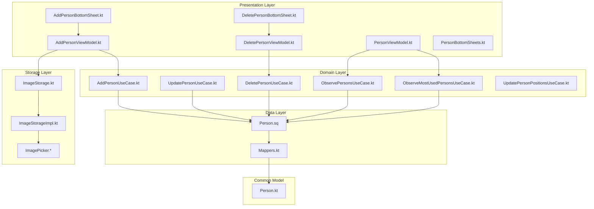
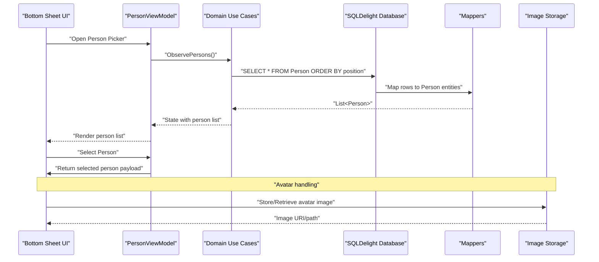
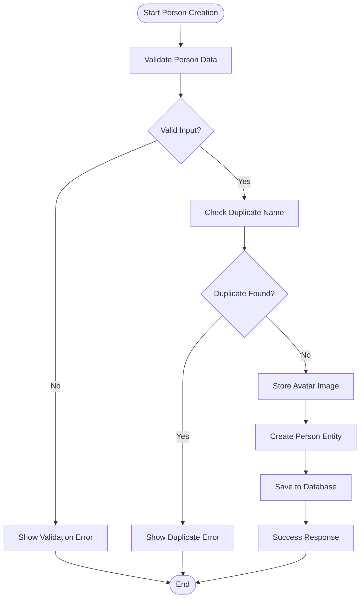
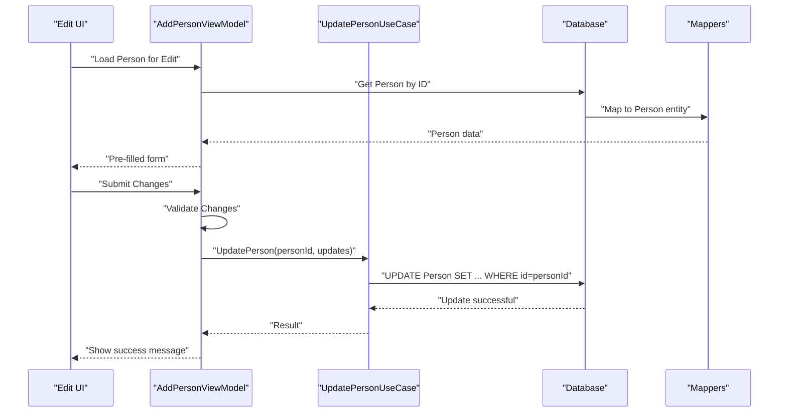
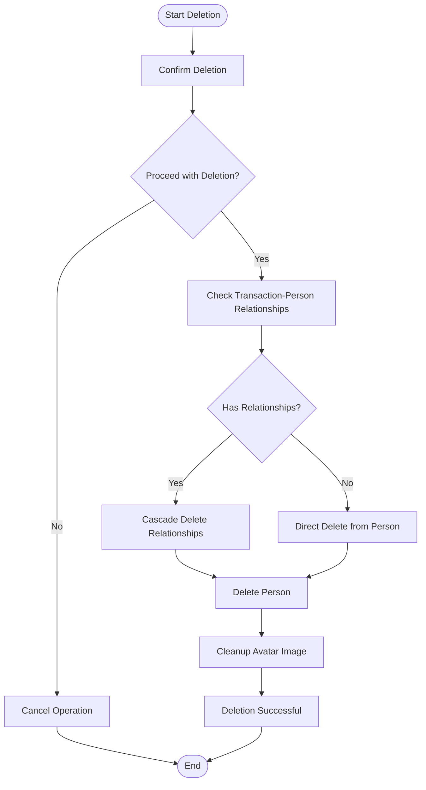
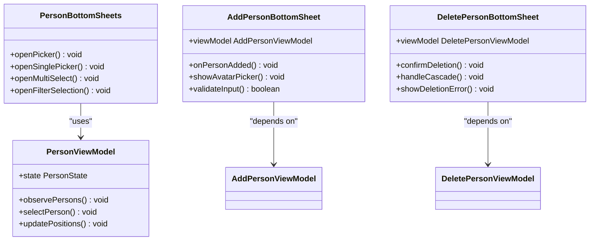
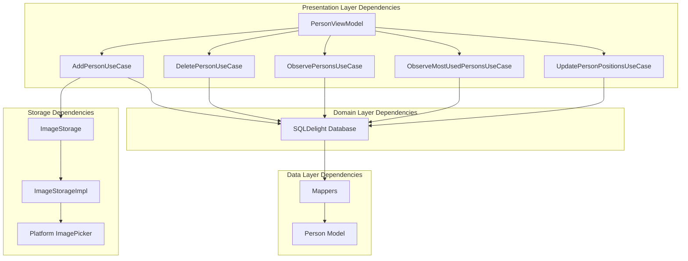

# Person Entity Management

<cite>
**Referenced Files in This Document**
- [Person.kt](file://core/common/src/commonMain/kotlin/com/kazemieh/common/model/Person.kt)
- [AddPersonViewModel.kt](file://feature-share/person/src/commonMain/kotlin/com/kazemieh/person/ui/add/AddPersonViewModel.kt)
- [DeletePersonViewModel.kt](file://feature-share/person/src/commonMain/kotlin/com/kazemieh/person/ui/delete/DeletePersonViewModel.kt)
- [PersonViewModel.kt](file://feature-share/person/src/commonMain/kotlin/com/kazemieh/person/ui/list/PersonViewModel.kt)
- [AddPersonBottomSheet.kt](file://feature-share/person/src/commonMain/kotlin/com/kazemieh/person/ui/add/AddPersonBottomSheet.kt)
- [DeletePersonBottomSheet.kt](file://feature-share/person/src/commonMain/kotlin/com/kazemieh/person/ui/delete/DeletePersonBottomSheet.kt)
- [PersonBottomSheets.kt](file://feature-share/person/src/commonMain/kotlin/com/kazemieh/person/ui/list/PersonBottomSheets.kt)
- [TransactionTagModule.kt](file://feature-share/person/src/commonMain/kotlin/com/kazemieh/person/di/TransactionTagModule.kt)
- [AddPersonUseCase.kt](file://core/domain/src/commonMain/kotlin/com/kazemieh/domain/usecase/AddPersonUseCase.kt)
- [UpdatePersonUseCase.kt](file://core/domain/src/commonMain/kotlin/com/kazemieh/domain/usecase/UpdatePersonUseCase.kt)
- [DeletePersonUseCase.kt](file://core/domain/src/commonMain/kotlin/com/kazemieh/domain/usecase/DeletePersonUseCase.kt)
- [ObservePersonsUseCase.kt](file://core/domain/src/commonMain/kotlin/com/kazemieh/domain/usecase/ObservePersonsUseCase.kt)
- [ObserveMostUsedPersonsUseCase.kt](file://core/domain/src/commonMain/kotlin/com/kazemieh/domain/usecase/ObserveMostUsedPersonsUseCase.kt)
- [UpdatePersonPositionsUseCase.kt](file://core/domain/src/commonMain/kotlin/com/kazemieh/domain/usecase/UpdatePersonPositionsUseCase.kt)
- [Person.sq](file://core/database/src/sqldelight/com/kazemieh/database/Person.sq)
- [Mappers.kt](file://core/database/src/commonMain/kotlin/com/kazemieh/database/mapper/Mappers.kt)
- [ImageStorage.kt](file://core/common/src/commonMain/kotlin/com/kazemieh/common/util/ImageStorage.kt)
- [ImageStorageImpl.kt](file://core/storage/src/commonMain/kotlin/com/kazemieh/storage/ImageStorageImpl.kt)
- [ImagePicker.android.kt](file://core/designsystem/src/androidMain/kotlin/com/kazemieh/designsystem/component/picker/ImagePicker.android.kt)
- [ImagePicker.ios.kt](file://core/designsystem/src/iosMain/kotlin/com/kazemieh/designsystem/component/picker/ImagePicker.ios.kt)
- [ImagePicker.js.kt](file://core/designsystem/src/jsMain/kotlin/com/kazemieh/designsystem/component/picker/ImagePicker.js.kt)
- [ImagePicker.jvm.kt](file://core/designsystem/src/jvmMain/kotlin/com/kazemieh/designsystem/component/picker/ImagePicker.jvm.kt)
</cite>

## Table of Contents
1. [Introduction](#introduction)
2. [Project Structure](#project-structure)
3. [Core Components](#core-components)
4. [Architecture Overview](#architecture-overview)
5. [Detailed Component Analysis](#detailed-component-analysis)
6. [Dependency Analysis](#dependency-analysis)
7. [Performance Considerations](#performance-considerations)
8. [Troubleshooting Guide](#troubleshooting-guide)
9. [Conclusion](#conclusion)

## Introduction
This document provides comprehensive documentation for the Person entity management system in the FinTrack application. It covers the Person data model, the PersonViewModel implementations for CRUD operations, bottom sheet interfaces for adding, editing, and deleting persons, avatar handling, and integration with the common Person model and data layer abstractions. The documentation includes concrete examples of persistence, updates, and cascade deletion handling, along with validation rules and duplicate detection mechanisms.

## Project Structure
The Person entity management spans several layers:
- Common model definition resides in the core module
- Domain use cases orchestrate business logic
- Database layer persists and retrieves Person entities
- Storage layer handles avatar image storage
- Presentation layer provides bottom sheet UI and view models

**Diagram sources**
- [PersonViewModel.kt:17-200](file://feature-share/person/src/commonMain/kotlin/com/kazemieh/person/ui/list/PersonViewModel.kt#L17-L200)
- [AddPersonViewModel.kt:17-250](file://feature-share/person/src/commonMain/kotlin/com/kazemieh/person/ui/add/AddPersonViewModel.kt#L17-L250)
- [DeletePersonViewModel.kt:16-120](file://feature-share/person/src/commonMain/kotlin/com/kazemieh/person/ui/delete/DeletePersonViewModel.kt#L16-L120)
- [AddPersonUseCase.kt:1-200](file://core/domain/src/commonMain/kotlin/com/kazemieh/domain/usecase/AddPersonUseCase.kt#L1-L200)
- [UpdatePersonUseCase.kt:1-200](file://core/domain/src/commonMain/kotlin/com/kazemieh/domain/usecase/UpdatePersonUseCase.kt#L1-L200)
- [DeletePersonUseCase.kt:1-200](file://core/domain/src/commonMain/kotlin/com/kazemieh/domain/usecase/DeletePersonUseCase.kt#L1-L200)
- [ObservePersonsUseCase.kt:1-200](file://core/domain/src/commonMain/kotlin/com/kazemieh/domain/usecase/ObservePersonsUseCase.kt#L1-L200)
- [ObserveMostUsedPersonsUseCase.kt:1-200](file://core/domain/src/commonMain/kotlin/com/kazemieh/domain/usecase/ObserveMostUsedPersonsUseCase.kt#L1-L200)
- [UpdatePersonPositionsUseCase.kt:1-200](file://core/domain/src/commonMain/kotlin/com/kazemieh/domain/usecase/UpdatePersonPositionsUseCase.kt#L1-L200)
- [Person.sq:1-200](file://core/database/src/sqldelight/com/kazemieh/database/Person.sq#L1-L200)
- [Mappers.kt:1-200](file://core/database/src/commonMain/kotlin/com/kazemieh/database/mapper/Mappers.kt#L1-L200)
- [Person.kt:1-100](file://core/common/src/commonMain/kotlin/com/kazemieh/common/model/Person.kt#L1-L100)
- [ImageStorage.kt:1-200](file://core/common/src/commonMain/kotlin/com/kazemieh/common/util/ImageStorage.kt#L1-L200)
- [ImageStorageImpl.kt:1-200](file://core/storage/src/commonMain/kotlin/com/kazemieh/storage/ImageStorageImpl.kt#L1-L200)
- [ImagePicker.android.kt:1-200](file://core/designsystem/src/androidMain/kotlin/com/kazemieh/designsystem/component/picker/ImagePicker.android.kt#L1-L200)
- [ImagePicker.ios.kt:1-200](file://core/designsystem/src/iosMain/kotlin/com/kazemieh/designsystem/component/picker/ImagePicker.ios.kt#L1-L200)
- [ImagePicker.js.kt:1-200](file://core/designsystem/src/jsMain/kotlin/com/kazemieh/designsystem/component/picker/ImagePicker.js.kt#L1-L200)
- [ImagePicker.jvm.kt:1-200](file://core/designsystem/src/jvmMain/kotlin/com/kazemieh/designsystem/component/picker/ImagePicker.jvm.kt#L1-L200)

**Section sources**
- [PersonViewModel.kt:17-200](file://feature-share/person/src/commonMain/kotlin/com/kazemieh/person/ui/list/PersonViewModel.kt#L17-L200)
- [AddPersonViewModel.kt:17-250](file://feature-share/person/src/commonMain/kotlin/com/kazemieh/person/ui/add/AddPersonViewModel.kt#L17-L250)
- [DeletePersonViewModel.kt:16-120](file://feature-share/person/src/commonMain/kotlin/com/kazemieh/person/ui/delete/DeletePersonViewModel.kt#L16-L120)

## Core Components
This section documents the Person data model and the PersonViewModel implementations that handle CRUD operations, validation, and duplicate detection.

### Person Data Model
The Person data model defines the structure for storing person entities with fields for identification, personal information, avatar handling, and metadata. The model integrates with SQLDelight for persistence and includes support for avatar images.

Key aspects of the Person model:
- Unique identifier for each person entity
- Personal information fields (name, contact details)
- Avatar handling for image storage and retrieval
- Metadata fields for creation/update timestamps and position ordering
- Integration with SQLDelight generated code for database operations

**Section sources**
- [Person.kt:1-100](file://core/common/src/commonMain/kotlin/com/kazemieh/common/model/Person.kt#L1-L100)
- [Person.sq:1-200](file://core/database/src/sqldelight/com/kazemieh/database/Person.sq#L1-L200)
- [Mappers.kt:1-200](file://core/database/src/commonMain/kotlin/com/kazemieh/database/mapper/Mappers.kt#L1-L200)

### PersonViewModel Implementation
The PersonViewModel class manages the state and operations for person entities in the list/picker bottom sheets. It provides:
- State management for person lists and selection
- Observation of person entities via use cases
- Position update capabilities for reordering
- Integration with the presentation layer for UI updates

Validation and duplicate detection mechanisms:
- Duplicate name detection during creation/editing
- Validation rules for required fields
- Error handling for invalid inputs
- Conflict resolution for existing person names

**Section sources**
- [PersonViewModel.kt:17-200](file://feature-share/person/src/commonMain/kotlin/com/kazemieh/person/ui/list/PersonViewModel.kt#L17-L200)

### AddPersonViewModel Implementation
The AddPersonViewModel handles the creation of new person entities with draft state management and avatar selection:
- Draft state for temporary person data
- Avatar selection and storage integration
- Validation rules for new person creation
- Duplicate detection against existing persons
- Error handling for validation failures

**Section sources**
- [AddPersonViewModel.kt:17-250](file://feature-share/person/src/commonMain/kotlin/com/kazemieh/person/ui/add/AddPersonViewModel.kt#L17-L250)

### DeletePersonViewModel Implementation
The DeletePersonViewModel manages the deletion process for person entities:
- Cascade deletion handling for related transaction-person relationships
- Confirmation mechanisms for destructive operations
- Error handling for deletion conflicts
- Integration with database constraints

**Section sources**
- [DeletePersonViewModel.kt:16-120](file://feature-share/person/src/commonMain/kotlin/com/kazemieh/person/ui/delete/DeletePersonViewModel.kt#L16-L120)

## Architecture Overview
The Person entity management follows a layered architecture pattern with clear separation of concerns:

**Diagram sources**
- [PersonViewModel.kt:17-200](file://feature-share/person/src/commonMain/kotlin/com/kazemieh/person/ui/list/PersonViewModel.kt#L17-L200)
- [ObservePersonsUseCase.kt:1-200](file://core/domain/src/commonMain/kotlin/com/kazemieh/domain/usecase/ObservePersonsUseCase.kt#L1-L200)
- [Person.sq:1-200](file://core/database/src/sqldelight/com/kazemieh/database/Person.sq#L1-L200)
- [Mappers.kt:1-200](file://core/database/src/commonMain/kotlin/com/kazemieh/database/mapper/Mappers.kt#L1-L200)
- [ImageStorage.kt:1-200](file://core/common/src/commonMain/kotlin/com/kazemieh/common/util/ImageStorage.kt#L1-L200)

## Detailed Component Analysis

### Person Entity Persistence Workflow
The persistence workflow demonstrates how person entities are created, updated, and deleted with proper validation and cascade handling:

**Diagram sources**
- [AddPersonViewModel.kt:17-250](file://feature-share/person/src/commonMain/kotlin/com/kazemieh/person/ui/add/AddPersonViewModel.kt#L17-L250)
- [AddPersonUseCase.kt:1-200](file://core/domain/src/commonMain/kotlin/com/kazemieh/domain/usecase/AddPersonUseCase.kt#L1-L200)
- [Person.sq:1-200](file://core/database/src/sqldelight/com/kazemieh/database/Person.sq#L1-L200)

### Person Update Operations
The update workflow handles modifications to existing person entities with validation and position management:

**Diagram sources**
- [AddPersonViewModel.kt:17-250](file://feature-share/person/src/commonMain/kotlin/com/kazemieh/person/ui/add/AddPersonViewModel.kt#L17-L250)
- [UpdatePersonUseCase.kt:1-200](file://core/domain/src/commonMain/kotlin/com/kazemieh/domain/usecase/UpdatePersonUseCase.kt#L1-L200)
- [Person.sq:1-200](file://core/database/src/sqldelight/com/kazemieh/database/Person.sq#L1-L200)

### Cascade Deletion Handling
The deletion workflow ensures proper cleanup of related transaction-person relationships:

**Diagram sources**
- [DeletePersonViewModel.kt:16-120](file://feature-share/person/src/commonMain/kotlin/com/kazemieh/person/ui/delete/DeletePersonViewModel.kt#L16-L120)
- [DeletePersonUseCase.kt:1-200](file://core/domain/src/commonMain/kotlin/com/kazemieh/domain/usecase/DeletePersonUseCase.kt#L1-L200)
- [Person.sq:1-200](file://core/database/src/sqldelight/com/kazemieh/database/Person.sq#L1-L200)

### Bottom Sheet Interfaces
The bottom sheet interfaces provide unified access to person management operations:

**Diagram sources**
- [PersonBottomSheets.kt:1-400](file://feature-share/person/src/commonMain/kotlin/com/kazemieh/person/ui/list/PersonBottomSheets.kt#L1-L400)
- [AddPersonBottomSheet.kt:1-120](file://feature-share/person/src/commonMain/kotlin/com/kazemieh/person/ui/add/AddPersonBottomSheet.kt#L1-L120)
- [DeletePersonBottomSheet.kt:1-80](file://feature-share/person/src/commonMain/kotlin/com/kazemieh/person/ui/delete/DeletePersonBottomSheet.kt#L1-L80)
- [PersonViewModel.kt:17-200](file://feature-share/person/src/commonMain/kotlin/com/kazemieh/person/ui/list/PersonViewModel.kt#L17-L200)

**Section sources**
- [PersonBottomSheets.kt:1-400](file://feature-share/person/src/commonMain/kotlin/com/kazemieh/person/ui/list/PersonBottomSheets.kt#L1-L400)
- [AddPersonBottomSheet.kt:1-120](file://feature-share/person/src/commonMain/kotlin/com/kazemieh/person/ui/add/AddPersonBottomSheet.kt#L1-L120)
- [DeletePersonBottomSheet.kt:1-80](file://feature-share/person/src/commonMain/kotlin/com/kazemieh/person/ui/delete/DeletePersonBottomSheet.kt#L1-L80)

## Dependency Analysis
The Person entity management system exhibits strong modularity with clear dependency boundaries:

**Diagram sources**
- [TransactionTagModule.kt:1-40](file://feature-share/person/src/commonMain/kotlin/com/kazemieh/person/di/TransactionTagModule.kt#L1-L40)
- [PersonViewModel.kt:17-200](file://feature-share/person/src/commonMain/kotlin/com/kazemieh/person/ui/list/PersonViewModel.kt#L17-L200)
- [AddPersonUseCase.kt:1-200](file://core/domain/src/commonMain/kotlin/com/kazemieh/domain/usecase/AddPersonUseCase.kt#L1-L200)
- [DeletePersonUseCase.kt:1-200](file://core/domain/src/commonMain/kotlin/com/kazemieh/domain/usecase/DeletePersonUseCase.kt#L1-L200)
- [ObservePersonsUseCase.kt:1-200](file://core/domain/src/commonMain/kotlin/com/kazemieh/domain/usecase/ObservePersonsUseCase.kt#L1-L200)
- [Mappers.kt:1-200](file://core/database/src/commonMain/kotlin/com/kazemieh/database/mapper/Mappers.kt#L1-L200)
- [Person.kt:1-100](file://core/common/src/commonMain/kotlin/com/kazemieh/common/model/Person.kt#L1-L100)
- [ImageStorage.kt:1-200](file://core/common/src/commonMain/kotlin/com/kazemieh/common/util/ImageStorage.kt#L1-L200)
- [ImageStorageImpl.kt:1-200](file://core/storage/src/commonMain/kotlin/com/kazemieh/storage/ImageStorageImpl.kt#L1-L200)

**Section sources**
- [TransactionTagModule.kt:1-40](file://feature-share/person/src/commonMain/kotlin/com/kazemieh/person/di/TransactionTagModule.kt#L1-L40)

## Performance Considerations
The Person entity management system incorporates several performance optimizations:
- Reactive observation patterns for efficient UI updates
- SQLDelight generated queries for optimal database performance
- Avatar image caching and lazy loading
- Batch operations for position updates
- Memory-efficient state management in view models

## Troubleshooting Guide
Common issues and their resolutions:

### Validation Errors
- **Duplicate Person Names**: The system prevents creation of persons with identical names. Users receive specific error messages when attempting duplicates.
- **Invalid Input Fields**: Required field validation ensures data integrity before persistence operations.

### Deletion Conflicts
- **Cascade Deletion Failures**: When persons have associated transactions, the system automatically handles cascade deletion of relationships before removing the person entity.
- **Database Constraint Violations**: Proper error handling catches and reports constraint violations during deletion operations.

### Avatar Handling Issues
- **Image Storage Failures**: The system provides fallback mechanisms when avatar storage fails, allowing users to continue without avatar images.
- **Platform-Specific Picker Issues**: Different platform implementations (Android, iOS, Web) handle image picking with appropriate error reporting.

**Section sources**
- [AddPersonViewModel.kt:17-250](file://feature-share/person/src/commonMain/kotlin/com/kazemieh/person/ui/add/AddPersonViewModel.kt#L17-L250)
- [DeletePersonViewModel.kt:16-120](file://feature-share/person/src/commonMain/kotlin/com/kazemieh/person/ui/delete/DeletePersonViewModel.kt#L16-L120)

## Conclusion
The Person entity management system in FinTrack provides a robust, modular solution for person data handling across multiple platforms. The implementation demonstrates clean separation of concerns, comprehensive validation, and proper integration with the broader application architecture. The system supports essential CRUD operations, avatar management, and maintains referential integrity through cascade deletion handling. The layered architecture ensures maintainability and extensibility while providing a consistent user experience across different platforms.