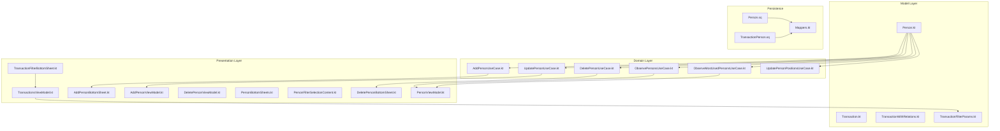
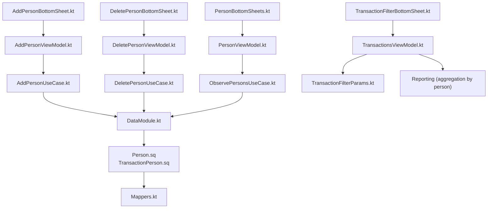
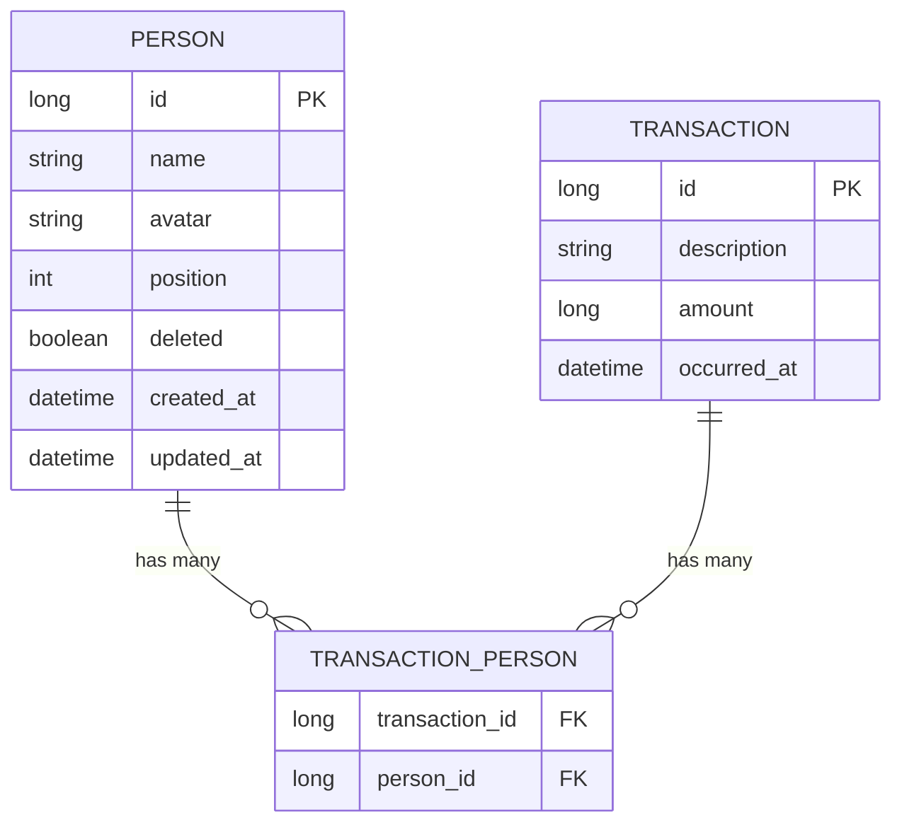
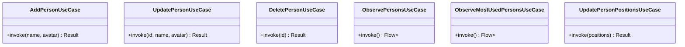
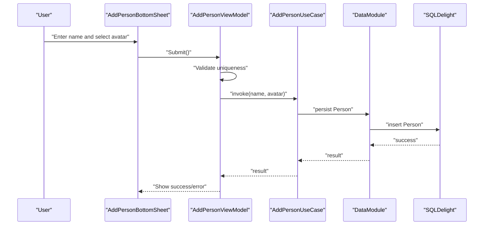
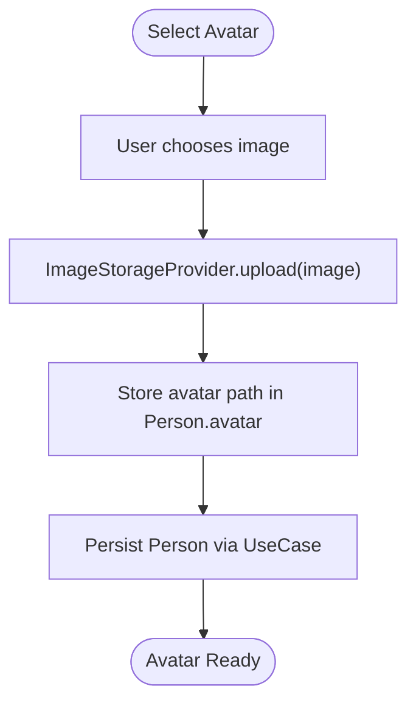
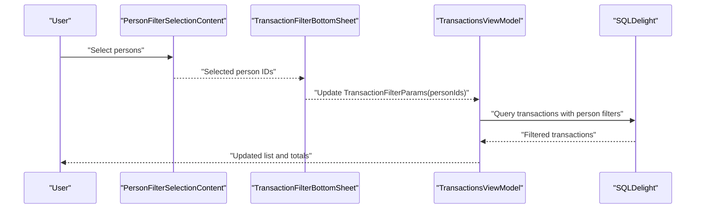
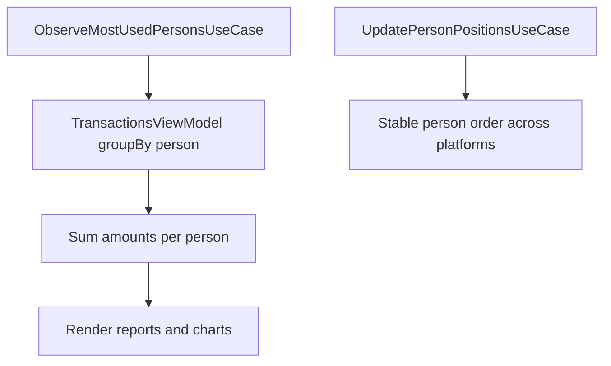
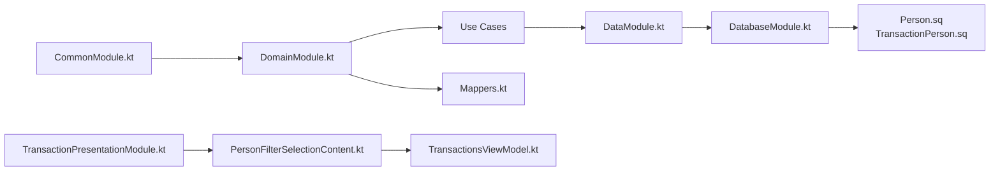

# Person/Contact Management

<cite>
**Referenced Files in This Document**
- [Person.kt](file://core/common/src/commonMain/kotlin/com/kazemieh/common/model/Person.kt)
- [Transaction.kt](file://core/common/src/commonMain/kotlin/com/kazemieh/common/model/Transaction.kt)
- [TransactionWithRelations.kt](file://core/common/src/commonMain/kotlin/com/kazemieh/common/model/TransactionWithRelations.kt)
- [TransactionFilterParams.kt](file://core/common/src/commonMain/kotlin/com/kazemieh/common/model/TransactionFilterParams.kt)
- [AddPersonUseCase.kt](file://core/domain/src/commonMain/kotlin/com/kazemieh/domain/usecase/AddPersonUseCase.kt)
- [UpdatePersonUseCase.kt](file://core/domain/src/commonMain/kotlin/com/kazemieh/domain/usecase/UpdatePersonUseCase.kt)
- [DeletePersonUseCase.kt](file://core/domain/src/commonMain/kotlin/com/kazemieh/domain/usecase/DeletePersonUseCase.kt)
- [ObservePersonsUseCase.kt](file://core/domain/src/commonMain/kotlin/com/kazemieh/domain/usecase/ObservePersonsUseCase.kt)
- [ObserveMostUsedPersonsUseCase.kt](file://core/domain/src/commonMain/kotlin/com/kazemieh/domain/usecase/ObserveMostUsedPersonsUseCase.kt)
- [UpdatePersonPositionsUseCase.kt](file://core/domain/src/commonMain/kotlin/com/kazemieh/domain/usecase/UpdatePersonPositionsUseCase.kt)
- [AddPersonBottomSheet.kt](file://feature-share/person/src/commonMain/kotlin/com/kazemieh/person/ui/add/AddPersonBottomSheet.kt)
- [AddPersonViewModel.kt](file://feature-share/person/src/commonMain/kotlin/com/kazemieh/person/ui/add/AddPersonViewModel.kt)
- [DeletePersonBottomSheet.kt](file://feature-share/person/src/commonMain/kotlin/com/kazemieh/person/ui/delete/DeletePersonBottomSheet.kt)
- [DeletePersonViewModel.kt](file://feature-share/person/src/commonMain/kotlin/com/kazemieh/person/ui/delete/DeletePersonViewModel.kt)
- [PersonBottomSheets.kt](file://feature-share/person/src/commonMain/kotlin/com/kazemieh/person/ui/list/PersonBottomSheets.kt)
- [PersonFilterSelectionContent.kt](file://feature-share/person/src/commonMain/kotlin/com/kazemieh/person/ui/list/PersonFilterSelectionContent.kt)
- [PersonViewModel.kt](file://feature-share/person/src/commonMain/kotlin/com/kazemieh/person/ui/list/PersonViewModel.kt)
- [TransactionFilterBottomSheet.kt](file://feature-container/transactions/src/commonMain/kotlin/com/kazemieh/transactions/TransactionFilterBottomSheet.kt)
- [TransactionsViewModel.kt](file://feature-container/transactions/src/commonMain/kotlin/com/kazemieh/transactions/TransactionsViewModel.kt)
- [TransactionPerson.sq](file://core/database/src/commonMain/kotlin/com/kazemieh/database/sqldelight/TransactionPerson.sq)
- [Person.sq](file://core/database/src/commonMain/kotlin/com/kazemieh/database/sqldelight/Person.sq)
- [Mappers.kt](file://core/database/src/commonMain/kotlin/com/kazemieh/database/mapper/Mappers.kt)
- [DatabaseModule.kt](file://core/database/src/commonMain/kotlin/com/kazemieh/database/di/DatabaseModule.kt)
- [CommonModule.kt](file://core/common/src/commonMain/kotlin/com/kazemieh/common/di/CommonModule.kt)
- [DomainModule.kt](file://core/domain/src/commonMain/kotlin/com/kazemieh/domain/di/DomainModule.kt)
- [DataModule.kt](file://core/data/src/commonMain/kotlin/com/kazemieh/data/di/DataModule.kt)
- [TransactionPresentationModule.kt](file://feature-container/transactions/src/commonMain/kotlin/com/kazemieh/transactions/di/TransactionPresentationModule.kt)
- [TransactionCategoryModule.kt](file://feature-share/category/src/commonMain/kotlin/com/kazemieh/category/di/TransactionCategoryModule.kt)
- [TransactionTagModule.kt](file://feature-share/person/src/commonMain/kotlin/com/kazemieh/person/di/TransactionTagModule.kt)
- [ImageStorageImpl.kt](file://core/storage/src/commonMain/kotlin/com/kazemieh/storage/ImageStorageImpl.kt)
- [ImageStorageProvider.kt](file://core/storage/src/commonMain/kotlin/com/kazemieh/storage/ImageStorageProvider.kt)
</cite>

## Table of Contents
1. [Introduction](#introduction)
2. [Project Structure](#project-structure)
3. [Core Components](#core-components)
4. [Architecture Overview](#architecture-overview)
5. [Detailed Component Analysis](#detailed-component-analysis)
6. [Dependency Analysis](#dependency-analysis)
7. [Performance Considerations](#performance-considerations)
8. [Troubleshooting Guide](#troubleshooting-guide)
9. [Conclusion](#conclusion)

## Introduction
This document describes the person/contact management shared feature module in FinTrack. It explains how individuals (family members, business partners, friends) are tracked and associated with transactions, how ViewModels implement CRUD operations and contact management, and how bottom sheets support adding, editing, and deleting persons with validation and duplicate detection. It also covers the person filter selection mechanism, integration with transaction filtering/reporting, the person-avatar system, and cross-platform contact synchronization via dependency injection and database mapping.

## Project Structure
The person/contact feature spans three layers:
- Model and persistence: shared entity definitions and SQLDelight mappings
- Domain: use cases for person CRUD and observation
- Presentation: Compose UI with bottom sheets and ViewModels

**Diagram sources**
- [Person.kt:1-200](file://core/common/src/commonMain/kotlin/com/kazemieh/common/model/Person.kt#L1-L200)
- [Transaction.kt:1-200](file://core/common/src/commonMain/kotlin/com/kazemieh/common/model/Transaction.kt#L1-L200)
- [TransactionWithRelations.kt:1-200](file://core/common/src/commonMain/kotlin/com/kazemieh/common/model/TransactionWithRelations.kt#L1-L200)
- [TransactionFilterParams.kt:1-200](file://core/common/src/commonMain/kotlin/com/kazemieh/common/model/TransactionFilterParams.kt#L1-L200)
- [AddPersonUseCase.kt:1-200](file://core/domain/src/commonMain/kotlin/com/kazemieh/domain/usecase/AddPersonUseCase.kt#L1-L200)
- [UpdatePersonUseCase.kt:1-200](file://core/domain/src/commonMain/kotlin/com/kazemieh/domain/usecase/UpdatePersonUseCase.kt#L1-L200)
- [DeletePersonUseCase.kt:1-200](file://core/domain/src/commonMain/kotlin/com/kazemieh/domain/usecase/DeletePersonUseCase.kt#L1-L200)
- [ObservePersonsUseCase.kt:1-200](file://core/domain/src/commonMain/kotlin/com/kazemieh/domain/usecase/ObservePersonsUseCase.kt#L1-L200)
- [ObserveMostUsedPersonsUseCase.kt:1-200](file://core/domain/src/commonMain/kotlin/com/kazemieh/domain/usecase/ObserveMostUsedPersonsUseCase.kt#L1-L200)
- [UpdatePersonPositionsUseCase.kt:1-200](file://core/domain/src/commonMain/kotlin/com/kazemieh/domain/usecase/UpdatePersonPositionsUseCase.kt#L1-L200)
- [AddPersonBottomSheet.kt:1-200](file://feature-share/person/src/commonMain/kotlin/com/kazemieh/person/ui/add/AddPersonBottomSheet.kt#L1-L200)
- [AddPersonViewModel.kt:1-200](file://feature-share/person/src/commonMain/kotlin/com/kazemieh/person/ui/add/AddPersonViewModel.kt#L1-L200)
- [DeletePersonBottomSheet.kt:1-200](file://feature-share/person/src/commonMain/kotlin/com/kazemieh/person/ui/delete/DeletePersonBottomSheet.kt#L1-L200)
- [DeletePersonViewModel.kt:1-200](file://feature-share/person/src/commonMain/kotlin/com/kazemieh/person/ui/delete/DeletePersonViewModel.kt#L1-L200)
- [PersonBottomSheets.kt:1-200](file://feature-share/person/src/commonMain/kotlin/com/kazemieh/person/ui/list/PersonBottomSheets.kt#L1-L200)
- [PersonFilterSelectionContent.kt:1-200](file://feature-share/person/src/commonMain/kotlin/com/kazemieh/person/ui/list/PersonFilterSelectionContent.kt#L1-L200)
- [PersonViewModel.kt:1-200](file://feature-share/person/src/commonMain/kotlin/com/kazemieh/person/ui/list/PersonViewModel.kt#L1-L200)
- [TransactionFilterBottomSheet.kt:1-200](file://feature-container/transactions/src/commonMain/kotlin/com/kazemieh/transactions/TransactionFilterBottomSheet.kt#L1-L200)
- [TransactionsViewModel.kt:1-200](file://feature-container/transactions/src/commonMain/kotlin/com/kazemieh/transactions/TransactionsViewModel.kt#L1-L200)
- [TransactionPerson.sq:1-200](file://core/database/src/commonMain/kotlin/com/kazemieh/database/sqldelight/TransactionPerson.sq#L1-L200)
- [Person.sq:1-200](file://core/database/src/commonMain/kotlin/com/kazemieh/database/sqldelight/Person.sq#L1-L200)
- [Mappers.kt:1-200](file://core/database/src/commonMain/kotlin/com/kazemieh/database/mapper/Mappers.kt#L1-L200)

**Section sources**
- [Person.kt:1-200](file://core/common/src/commonMain/kotlin/com/kazemieh/common/model/Person.kt#L1-L200)
- [Transaction.kt:1-200](file://core/common/src/commonMain/kotlin/com/kazemieh/common/model/Transaction.kt#L1-L200)
- [TransactionWithRelations.kt:1-200](file://core/common/src/commonMain/kotlin/com/kazemieh/common/model/TransactionWithRelations.kt#L1-L200)
- [TransactionFilterParams.kt:1-200](file://core/common/src/commonMain/kotlin/com/kazemieh/common/model/TransactionFilterParams.kt#L1-L200)

## Core Components
- Person entity: defines identity, contact details, avatar, and metadata for person-based transaction association.
- Transaction-person mapping: many-to-many bridge enabling multiple persons per transaction and vice versa.
- Use cases: CRUD and observation for persons, supporting sorting and most-used discovery.
- Presentation: bottom sheets and ViewModels for add/edit/delete, plus filter selection integrated with transaction filters.

Key implementation references:
- Person model definition and fields
- Transaction-person join table and mapping
- Person use cases for add/update/delete/observe
- Person presentation components and ViewModels
- Transaction filter integration and reporting

**Section sources**
- [Person.kt:1-200](file://core/common/src/commonMain/kotlin/com/kazemieh/common/model/Person.kt#L1-L200)
- [TransactionPerson.sq:1-200](file://core/database/src/commonMain/kotlin/com/kazemieh/database/sqldelight/TransactionPerson.sq#L1-L200)
- [Mappers.kt:1-200](file://core/database/src/commonMain/kotlin/com/kazemieh/database/mapper/Mappers.kt#L1-L200)
- [AddPersonUseCase.kt:1-200](file://core/domain/src/commonMain/kotlin/com/kazemieh/domain/usecase/AddPersonUseCase.kt#L1-L200)
- [UpdatePersonUseCase.kt:1-200](file://core/domain/src/commonMain/kotlin/com/kazemieh/domain/usecase/UpdatePersonUseCase.kt#L1-L200)
- [DeletePersonUseCase.kt:1-200](file://core/domain/src/commonMain/kotlin/com/kazemieh/domain/usecase/DeletePersonUseCase.kt#L1-L200)
- [ObservePersonsUseCase.kt:1-200](file://core/domain/src/commonMain/kotlin/com/kazemieh/domain/usecase/ObservePersonsUseCase.kt#L1-L200)
- [ObserveMostUsedPersonsUseCase.kt:1-200](file://core/domain/src/commonMain/kotlin/com/kazemieh/domain/usecase/ObserveMostUsedPersonsUseCase.kt#L1-L200)
- [AddPersonBottomSheet.kt:1-200](file://feature-share/person/src/commonMain/kotlin/com/kazemieh/person/ui/add/AddPersonBottomSheet.kt#L1-L200)
- [AddPersonViewModel.kt:1-200](file://feature-share/person/src/commonMain/kotlin/com/kazemieh/person/ui/add/AddPersonViewModel.kt#L1-L200)
- [DeletePersonBottomSheet.kt:1-200](file://feature-share/person/src/commonMain/kotlin/com/kazemieh/person/ui/delete/DeletePersonBottomSheet.kt#L1-L200)
- [DeletePersonViewModel.kt:1-200](file://feature-share/person/src/commonMain/kotlin/com/kazemieh/person/ui/delete/DeletePersonViewModel.kt#L1-L200)
- [PersonFilterSelectionContent.kt:1-200](file://feature-share/person/src/commonMain/kotlin/com/kazemieh/person/ui/list/PersonFilterSelectionContent.kt#L1-L200)
- [PersonViewModel.kt:1-200](file://feature-share/person/src/commonMain/kotlin/com/kazemieh/person/ui/list/PersonViewModel.kt#L1-L200)
- [TransactionFilterBottomSheet.kt:1-200](file://feature-container/transactions/src/commonMain/kotlin/com/kazemieh/transactions/TransactionFilterBottomSheet.kt#L1-L200)
- [TransactionsViewModel.kt:1-200](file://feature-container/transactions/src/commonMain/kotlin/com/kazemieh/transactions/TransactionsViewModel.kt#L1-L200)

## Architecture Overview
The person/contact feature follows a layered architecture:
- Model: shared Person and Transaction entities with relations
- Domain: use cases orchestrating person operations and observations
- Persistence: SQLDelight schemas and mappers for Person and TransactionPerson
- Presentation: Compose UI with bottom sheets and ViewModels
- Integration: transaction filter bottom sheet consumes person filters; reporting aggregates by person

**Diagram sources**
- [AddPersonBottomSheet.kt:1-200](file://feature-share/person/src/commonMain/kotlin/com/kazemieh/person/ui/add/AddPersonBottomSheet.kt#L1-L200)
- [AddPersonViewModel.kt:1-200](file://feature-share/person/src/commonMain/kotlin/com/kazemieh/person/ui/add/AddPersonViewModel.kt#L1-L200)
- [DeletePersonBottomSheet.kt:1-200](file://feature-share/person/src/commonMain/kotlin/com/kazemieh/person/ui/delete/DeletePersonBottomSheet.kt#L1-L200)
- [DeletePersonViewModel.kt:1-200](file://feature-share/person/src/commonMain/kotlin/com/kazemieh/person/ui/delete/DeletePersonViewModel.kt#L1-L200)
- [PersonBottomSheets.kt:1-200](file://feature-share/person/src/commonMain/kotlin/com/kazemieh/person/ui/list/PersonBottomSheets.kt#L1-L200)
- [PersonViewModel.kt:1-200](file://feature-share/person/src/commonMain/kotlin/com/kazemieh/person/ui/list/PersonViewModel.kt#L1-L200)
- [AddPersonUseCase.kt:1-200](file://core/domain/src/commonMain/kotlin/com/kazemieh/domain/usecase/AddPersonUseCase.kt#L1-L200)
- [DeletePersonUseCase.kt:1-200](file://core/domain/src/commonMain/kotlin/com/kazemieh/domain/usecase/DeletePersonUseCase.kt#L1-L200)
- [ObservePersonsUseCase.kt:1-200](file://core/domain/src/commonMain/kotlin/com/kazemieh/domain/usecase/ObservePersonsUseCase.kt#L1-L200)
- [DataModule.kt:1-200](file://core/data/src/commonMain/kotlin/com/kazemieh/data/di/DataModule.kt#L1-L200)
- [Person.sq:1-200](file://core/database/src/commonMain/kotlin/com/kazemieh/database/sqldelight/Person.sq#L1-L200)
- [TransactionPerson.sq:1-200](file://core/database/src/commonMain/kotlin/com/kazemieh/database/sqldelight/TransactionPerson.sq#L1-L200)
- [Mappers.kt:1-200](file://core/database/src/commonMain/kotlin/com/kazemieh/database/mapper/Mappers.kt#L1-L200)
- [TransactionFilterBottomSheet.kt:1-200](file://feature-container/transactions/src/commonMain/kotlin/com/kazemieh/transactions/TransactionFilterBottomSheet.kt#L1-L200)
- [TransactionsViewModel.kt:1-200](file://feature-container/transactions/src/commonMain/kotlin/com/kazemieh/transactions/TransactionsViewModel.kt#L1-L200)
- [TransactionFilterParams.kt:1-200](file://core/common/src/commonMain/kotlin/com/kazemieh/common/model/TransactionFilterParams.kt#L1-L200)

## Detailed Component Analysis

### Person Entity and Relations
- Person: identity, contact info, avatar, position, timestamps, and soft-delete flag.
- TransactionPerson: junction table linking Person and Transaction.
- Mappers: convert between Kotlin models and SQLDelight records.

**Diagram sources**
- [Person.kt:1-200](file://core/common/src/commonMain/kotlin/com/kazemieh/common/model/Person.kt#L1-L200)
- [Transaction.kt:1-200](file://core/common/src/commonMain/kotlin/com/kazemieh/common/model/Transaction.kt#L1-L200)
- [TransactionPerson.sq:1-200](file://core/database/src/commonMain/kotlin/com/kazemieh/database/sqldelight/TransactionPerson.sq#L1-L200)
- [Person.sq:1-200](file://core/database/src/commonMain/kotlin/com/kazemieh/database/sqldelight/Person.sq#L1-L200)
- [Mappers.kt:1-200](file://core/database/src/commonMain/kotlin/com/kazemieh/database/mapper/Mappers.kt#L1-L200)

**Section sources**
- [Person.kt:1-200](file://core/common/src/commonMain/kotlin/com/kazemieh/common/model/Person.kt#L1-L200)
- [TransactionPerson.sq:1-200](file://core/database/src/commonMain/kotlin/com/kazemieh/database/sqldelight/TransactionPerson.sq#L1-L200)
- [Person.sq:1-200](file://core/database/src/commonMain/kotlin/com/kazemieh/database/sqldelight/Person.sq#L1-L200)
- [Mappers.kt:1-200](file://core/database/src/commonMain/kotlin/com/kazemieh/database/mapper/Mappers.kt#L1-L200)

### Person CRUD Use Cases
- AddPersonUseCase: validates input, detects duplicates, persists Person, and updates positions.
- UpdatePersonUseCase: updates fields and avatar path.
- DeletePersonUseCase: soft-deletes Person and removes associations.
- ObservePersonsUseCase: streams current person list.
- ObserveMostUsedPersonsUseCase: ranks persons by transaction frequency.
- UpdatePersonPositionsUseCase: reorders persons for UI.

**Diagram sources**
- [AddPersonUseCase.kt:1-200](file://core/domain/src/commonMain/kotlin/com/kazemieh/domain/usecase/AddPersonUseCase.kt#L1-L200)
- [UpdatePersonUseCase.kt:1-200](file://core/domain/src/commonMain/kotlin/com/kazemieh/domain/usecase/UpdatePersonUseCase.kt#L1-L200)
- [DeletePersonUseCase.kt:1-200](file://core/domain/src/commonMain/kotlin/com/kazemieh/domain/usecase/DeletePersonUseCase.kt#L1-L200)
- [ObservePersonsUseCase.kt:1-200](file://core/domain/src/commonMain/kotlin/com/kazemieh/domain/usecase/ObservePersonsUseCase.kt#L1-L200)
- [ObserveMostUsedPersonsUseCase.kt:1-200](file://core/domain/src/commonMain/kotlin/com/kazemieh/domain/usecase/ObserveMostUsedPersonsUseCase.kt#L1-L200)
- [UpdatePersonPositionsUseCase.kt:1-200](file://core/domain/src/commonMain/kotlin/com/kazemieh/domain/usecase/UpdatePersonPositionsUseCase.kt#L1-L200)

**Section sources**
- [AddPersonUseCase.kt:1-200](file://core/domain/src/commonMain/kotlin/com/kazemieh/domain/usecase/AddPersonUseCase.kt#L1-L200)
- [UpdatePersonUseCase.kt:1-200](file://core/domain/src/commonMain/kotlin/com/kazemieh/domain/usecase/UpdatePersonUseCase.kt#L1-L200)
- [DeletePersonUseCase.kt:1-200](file://core/domain/src/commonMain/kotlin/com/kazemieh/domain/usecase/DeletePersonUseCase.kt#L1-L200)
- [ObservePersonsUseCase.kt:1-200](file://core/domain/src/commonMain/kotlin/com/kazemieh/domain/usecase/ObservePersonsUseCase.kt#L1-L200)
- [ObserveMostUsedPersonsUseCase.kt:1-200](file://core/domain/src/commonMain/kotlin/com/kazemieh/domain/usecase/ObserveMostUsedPersonsUseCase.kt#L1-L200)
- [UpdatePersonPositionsUseCase.kt:1-200](file://core/domain/src/commonMain/kotlin/com/kazemieh/domain/usecase/UpdatePersonPositionsUseCase.kt#L1-L200)

### Person Bottom Sheets and Validation
- AddPersonBottomSheet: captures name and avatar, delegates to AddPersonViewModel.
- AddPersonViewModel: validates uniqueness, triggers AddPersonUseCase, handles errors.
- DeletePersonBottomSheet: confirms deletion and invokes DeletePersonUseCase.
- DeletePersonViewModel: manages delete state and outcomes.
- PersonBottomSheets: hosts list, add/edit, and delete UI.
- PersonFilterSelectionContent: allows selecting persons for filtering.

**Diagram sources**
- [AddPersonBottomSheet.kt:1-200](file://feature-share/person/src/commonMain/kotlin/com/kazemieh/person/ui/add/AddPersonBottomSheet.kt#L1-L200)
- [AddPersonViewModel.kt:1-200](file://feature-share/person/src/commonMain/kotlin/com/kazemieh/person/ui/add/AddPersonViewModel.kt#L1-L200)
- [AddPersonUseCase.kt:1-200](file://core/domain/src/commonMain/kotlin/com/kazemieh/domain/usecase/AddPersonUseCase.kt#L1-L200)
- [DataModule.kt:1-200](file://core/data/src/commonMain/kotlin/com/kazemieh/data/di/DataModule.kt#L1-L200)
- [Person.sq:1-200](file://core/database/src/commonMain/kotlin/com/kazemieh/database/sqldelight/Person.sq#L1-L200)

**Section sources**
- [AddPersonBottomSheet.kt:1-200](file://feature-share/person/src/commonMain/kotlin/com/kazemieh/person/ui/add/AddPersonBottomSheet.kt#L1-L200)
- [AddPersonViewModel.kt:1-200](file://feature-share/person/src/commonMain/kotlin/com/kazemieh/person/ui/add/AddPersonViewModel.kt#L1-L200)
- [DeletePersonBottomSheet.kt:1-200](file://feature-share/person/src/commonMain/kotlin/com/kazemieh/person/ui/delete/DeletePersonBottomSheet.kt#L1-L200)
- [DeletePersonViewModel.kt:1-200](file://feature-share/person/src/commonMain/kotlin/com/kazemieh/person/ui/delete/DeletePersonViewModel.kt#L1-L200)
- [PersonBottomSheets.kt:1-200](file://feature-share/person/src/commonMain/kotlin/com/kazemieh/person/ui/list/PersonBottomSheets.kt#L1-L200)
- [PersonFilterSelectionContent.kt:1-200](file://feature-share/person/src/commonMain/kotlin/com/kazemieh/person/ui/list/PersonFilterSelectionContent.kt#L1-L200)

### Person Avatar System
- Avatar storage abstraction via ImageStorageProvider and ImageStorageImpl.
- Person.avatar stores a platform-specific path or identifier.
- UI selects images and delegates upload to storage provider.

**Diagram sources**
- [ImageStorageProvider.kt:1-200](file://core/storage/src/commonMain/kotlin/com/kazemieh/storage/ImageStorageProvider.kt#L1-L200)
- [ImageStorageImpl.kt:1-200](file://core/storage/src/commonMain/kotlin/com/kazemieh/storage/ImageStorageImpl.kt#L1-L200)
- [Person.kt:1-200](file://core/common/src/commonMain/kotlin/com/kazemieh/common/model/Person.kt#L1-L200)

**Section sources**
- [ImageStorageProvider.kt:1-200](file://core/storage/src/commonMain/kotlin/com/kazemieh/storage/ImageStorageProvider.kt#L1-L200)
- [ImageStorageImpl.kt:1-200](file://core/storage/src/commonMain/kotlin/com/kazemieh/storage/ImageStorageImpl.kt#L1-L200)
- [Person.kt:1-200](file://core/common/src/commonMain/kotlin/com/kazemieh/common/model/Person.kt#L1-L200)

### Person Filter Selection and Transaction Integration
- PersonFilterSelectionContent: presents selectable persons for filtering.
- TransactionFilterBottomSheet: integrates person filters alongside categories/tags/sources.
- TransactionsViewModel: applies TransactionFilterParams including person IDs to queries.

**Diagram sources**
- [PersonFilterSelectionContent.kt:1-200](file://feature-share/person/src/commonMain/kotlin/com/kazemieh/person/ui/list/PersonFilterSelectionContent.kt#L1-L200)
- [TransactionFilterBottomSheet.kt:1-200](file://feature-container/transactions/src/commonMain/kotlin/com/kazemieh/transactions/TransactionFilterBottomSheet.kt#L1-L200)
- [TransactionsViewModel.kt:1-200](file://feature-container/transactions/src/commonMain/kotlin/com/kazemieh/transactions/TransactionsViewModel.kt#L1-L200)
- [TransactionFilterParams.kt:1-200](file://core/common/src/commonMain/kotlin/com/kazemieh/common/model/TransactionFilterParams.kt#L1-L200)

**Section sources**
- [PersonFilterSelectionContent.kt:1-200](file://feature-share/person/src/commonMain/kotlin/com/kazemieh/person/ui/list/PersonFilterSelectionContent.kt#L1-L200)
- [TransactionFilterBottomSheet.kt:1-200](file://feature-container/transactions/src/commonMain/kotlin/com/kazemieh/transactions/TransactionFilterBottomSheet.kt#L1-L200)
- [TransactionsViewModel.kt:1-200](file://feature-container/transactions/src/commonMain/kotlin/com/kazemieh/transactions/TransactionsViewModel.kt#L1-L200)
- [TransactionFilterParams.kt:1-200](file://core/common/src/commonMain/kotlin/com/kazemieh/common/model/TransactionFilterParams.kt#L1-L200)

### Person-Based Transaction Grouping and Reporting
- Use ObserveMostUsedPersonsUseCase to drive "most used" widgets.
- TransactionsViewModel groups and aggregates by person using filtered person IDs.
- Person positions enable consistent ordering across devices.

**Diagram sources**
- [ObserveMostUsedPersonsUseCase.kt:1-200](file://core/domain/src/commonMain/kotlin/com/kazemieh/domain/usecase/ObserveMostUsedPersonsUseCase.kt#L1-L200)
- [TransactionsViewModel.kt:1-200](file://feature-container/transactions/src/commonMain/kotlin/com/kazemieh/transactions/TransactionsViewModel.kt#L1-L200)
- [UpdatePersonPositionsUseCase.kt:1-200](file://core/domain/src/commonMain/kotlin/com/kazemieh/domain/usecase/UpdatePersonPositionsUseCase.kt#L1-L200)

**Section sources**
- [ObserveMostUsedPersonsUseCase.kt:1-200](file://core/domain/src/commonMain/kotlin/com/kazemieh/domain/usecase/ObserveMostUsedPersonsUseCase.kt#L1-L200)
- [TransactionsViewModel.kt:1-200](file://feature-container/transactions/src/commonMain/kotlin/com/kazemieh/transactions/TransactionsViewModel.kt#L1-L200)
- [UpdatePersonPositionsUseCase.kt:1-200](file://core/domain/src/commonMain/kotlin/com/kazemieh/domain/usecase/UpdatePersonPositionsUseCase.kt#L1-L200)

## Dependency Analysis
The person feature integrates across modules via DI:
- CommonModule: shared models and utilities
- DomainModule: use cases
- DataModule: repositories and SQLDelight wiring
- DatabaseModule: SQLDelight drivers and initialization
- TransactionPresentationModule: binds transaction UI to person filters
- Person presentation modules: bottom sheets and ViewModels

**Diagram sources**
- [CommonModule.kt:1-200](file://core/common/src/commonMain/kotlin/com/kazemieh/common/di/CommonModule.kt#L1-L200)
- [DomainModule.kt:1-200](file://core/domain/src/commonMain/kotlin/com/kazemieh/domain/di/DomainModule.kt#L1-L200)
- [DataModule.kt:1-200](file://core/data/src/commonMain/kotlin/com/kazemieh/data/di/DataModule.kt#L1-L200)
- [DatabaseModule.kt:1-200](file://core/database/src/commonMain/kotlin/com/kazemieh/database/di/DatabaseModule.kt#L1-L200)
- [Person.sq:1-200](file://core/database/src/commonMain/kotlin/com/kazemieh/database/sqldelight/Person.sq#L1-L200)
- [TransactionPerson.sq:1-200](file://core/database/src/commonMain/kotlin/com/kazemieh/database/sqldelight/TransactionPerson.sq#L1-L200)
- [Mappers.kt:1-200](file://core/database/src/commonMain/kotlin/com/kazemieh/database/mapper/Mappers.kt#L1-L200)
- [TransactionPresentationModule.kt:1-200](file://feature-container/transactions/src/commonMain/kotlin/com/kazemieh/transactions/di/TransactionPresentationModule.kt#L1-L200)
- [PersonFilterSelectionContent.kt:1-200](file://feature-share/person/src/commonMain/kotlin/com/kazemieh/person/ui/list/PersonFilterSelectionContent.kt#L1-L200)
- [TransactionsViewModel.kt:1-200](file://feature-container/transactions/src/commonMain/kotlin/com/kazemieh/transactions/TransactionsViewModel.kt#L1-L200)

**Section sources**
- [CommonModule.kt:1-200](file://core/common/src/commonMain/kotlin/com/kazemieh/common/di/CommonModule.kt#L1-L200)
- [DomainModule.kt:1-200](file://core/domain/src/commonMain/kotlin/com/kazemieh/domain/di/DomainModule.kt#L1-L200)
- [DataModule.kt:1-200](file://core/data/src/commonMain/kotlin/com/kazemieh/data/di/DataModule.kt#L1-L200)
- [DatabaseModule.kt:1-200](file://core/database/src/commonMain/kotlin/com/kazemieh/database/di/DatabaseModule.kt#L1-L200)
- [TransactionPresentationModule.kt:1-200](file://feature-container/transactions/src/commonMain/kotlin/com/kazemieh/transactions/di/TransactionPresentationModule.kt#L1-L200)

## Performance Considerations
- Use observe flows (ObservePersonsUseCase, ObserveMostUsedPersonsUseCase) to avoid repeated queries and keep UI reactive.
- Batch updates for person positions via UpdatePersonPositionsUseCase to minimize writes.
- Keep avatar paths small and delegate heavy uploads to ImageStorageProvider.
- Filter early in TransactionsViewModel to reduce dataset size for reporting.

## Troubleshooting Guide
Common issues and resolutions:
- Duplicate contacts: AddPersonViewModel validates uniqueness before invoking AddPersonUseCase. Ensure duplicate detection logic runs prior to persistence.
- Missing person associations: Verify TransactionPerson entries exist for each selected person during transaction creation. Check mapping correctness in Mappers.kt.
- Privacy considerations: Person.avatar may contain sensitive data; ensure secure storage and encryption at rest. Respect user consent for cross-platform synchronization.
- Cross-platform sync: Person positions and IDs must remain consistent across platforms. Use UpdatePersonPositionsUseCase to maintain order and rely on SQLDelight migrations for schema stability.

**Section sources**
- [AddPersonUseCase.kt:1-200](file://core/domain/src/commonMain/kotlin/com/kazemieh/domain/usecase/AddPersonUseCase.kt#L1-L200)
- [Mappers.kt:1-200](file://core/database/src/commonMain/kotlin/com/kazemieh/database/mapper/Mappers.kt#L1-L200)
- [UpdatePersonPositionsUseCase.kt:1-200](file://core/domain/src/commonMain/kotlin/com/kazemieh/domain/usecase/UpdatePersonPositionsUseCase.kt#L1-L200)

## Conclusion
The person/contact management module provides robust person tracking, avatar handling, and transaction association through a clean layered architecture. Bottom sheets offer intuitive add/edit/delete experiences with validation and duplicate detection. Person filters integrate seamlessly with transaction filtering and reporting, while DI ensures consistent cross-platform behavior. Following the recommended practices will help maintain data integrity, performance, and user privacy.