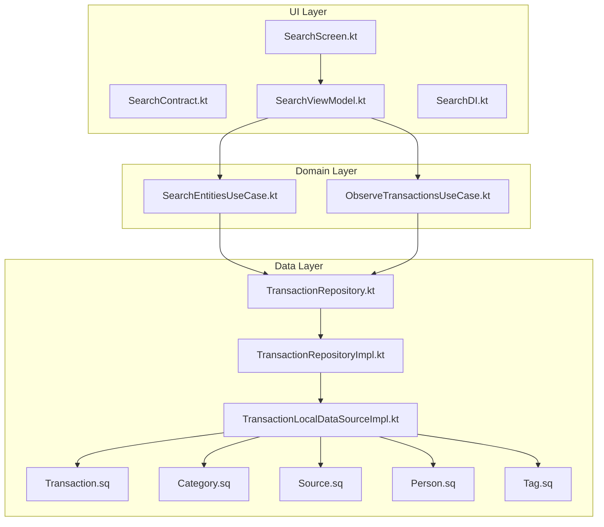
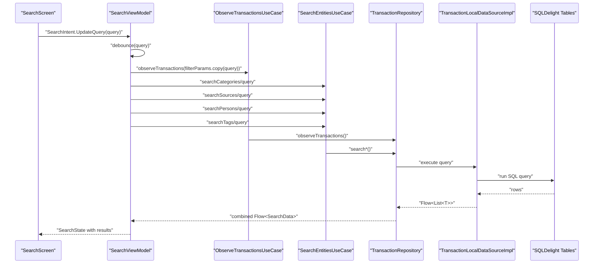
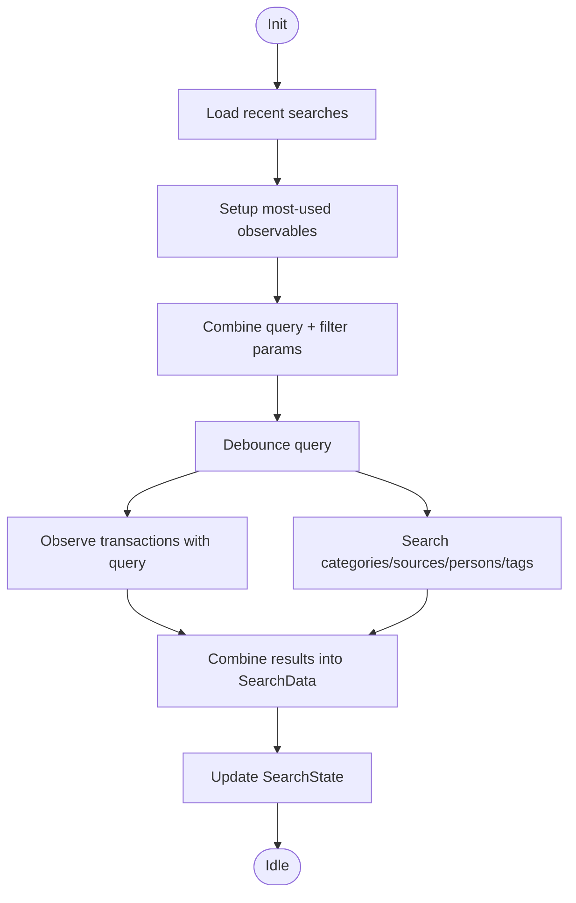
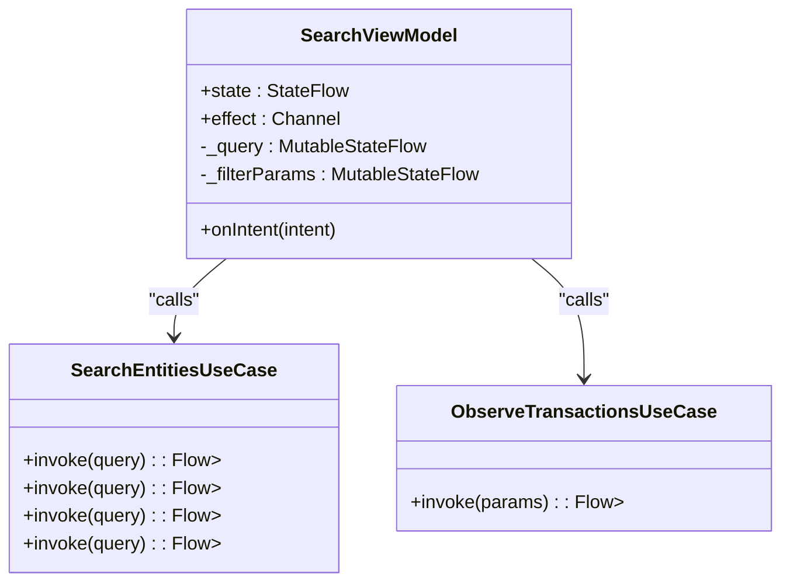
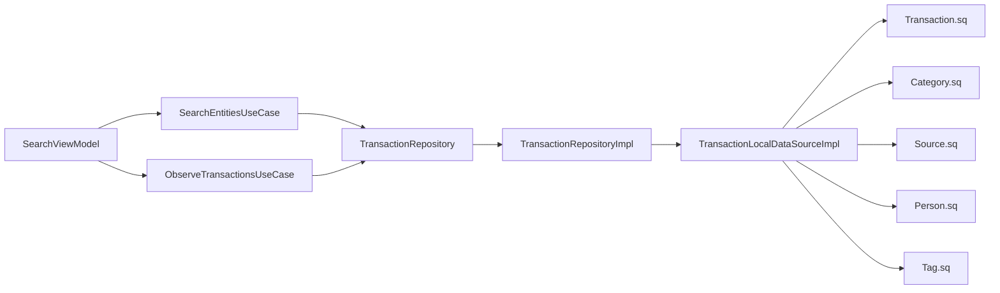

# Search Functionality

<cite>
**Referenced Files in This Document**
- [SearchContract.kt](file://feature-share/search/src/commonMain/kotlin/com/kazemieh/search/ui/SearchContract.kt)
- [SearchViewModel.kt](file://feature-share/search/src/commonMain/kotlin/com/kazemieh/search/ui/SearchViewModel.kt)
- [SearchScreen.kt](file://feature-share/search/src/commonMain/kotlin/com/kazemieh/search/ui/SearchScreen.kt)
- [SearchDI.kt](file://feature-share/search/src/commonMain/kotlin/com/kazemieh/search/di/SearchDI.kt)
- [SearchEntitiesUseCase.kt](file://core/domain/src/commonMain/kotlin/com/kazemieh/domain/usecase/SearchEntitiesUseCase.kt)
- [ObserveTransactionsUseCase.kt](file://core/domain/src/commonMain/kotlin/com/kazemieh/domain/usecase/ObserveTransactionsUseCase.kt)
- [TransactionRepository.kt](file://core/domain/src/commonMain/kotlin/com/kazemieh/domain/repository/TransactionRepository.kt)
- [TransactionRepositoryImpl.kt](file://core/data/src/commonMain/kotlin/com/kazemieh/data/repository/TransactionRepositoryImpl.kt)
- [TransactionLocalDataSourceImpl.kt](file://core/database/src/commonMain/kotlin/com/kazemieh/database/datasource/TransactionLocalDataSourceImpl.kt)
- [Transaction.sq](file://core/database/src/commonMain/kotlin/com/kazemieh/database/sqldelight/Transaction.sq)
- [Category.sq](file://core/database/src/commonMain/kotlin/com/kazemieh/database/sqldelight/Category.sq)
- [Source.sq](file://core/database/src/commonMain/kotlin/com/kazemieh/database/sqldelight/Source.sq)
- [Person.sq](file://core/database/src/commonMain/kotlin/com/kazemieh/database/sqldelight/Person.sq)
- [Tag.sq](file://core/database/src/commonMain/kotlin/com/kazemieh/database/sqldelight/Tag.sq)
- [TransactionWithRelations.kt](file://core/common/src/commonMain/kotlin/com/kazemieh/common/model/TransactionWithRelations.kt)
- [TransactionFilterParams.kt](file://core/common/src/commonMain/kotlin/com/kazemieh/common/model/TransactionFilterParams.kt)
- [Transaction.sq](file://core/database/src/commonMain/kotlin/com/kazemieh/database/sqldelight/Transaction.sq)
</cite>

## Table of Contents
1. [Introduction](#introduction)
2. [Project Structure](#project-structure)
3. [Core Components](#core-components)
4. [Architecture Overview](#architecture-overview)
5. [Detailed Component Analysis](#detailed-component-analysis)
6. [Dependency Analysis](#dependency-analysis)
7. [Performance Considerations](#performance-considerations)
8. [Troubleshooting Guide](#troubleshooting-guide)
9. [Conclusion](#conclusion)

## Introduction
This document explains the cross-entity search functionality implemented in the shared feature module. It covers transaction search, entity filtering (categories, sources, persons, tags), real-time search suggestions, and the ViewModel that orchestrates state, queries, and results. It also documents the UI components for search bars, suggestion dropdowns, and result displays, along with the underlying algorithms and integration points with the transaction and entity modules. Finally, it addresses dependency injection setup, performance considerations, and common troubleshooting topics.

## Project Structure
The search feature is organized as a shared module with three primary layers:
- UI Layer: Contract, ViewModel, and Screen
- Domain Layer: Use cases for search and observation
- Data Layer: Repositories and local data sources backed by SQLDelight

**Diagram sources**
- [SearchContract.kt:1-32](file://feature-share/search/src/commonMain/kotlin/com/kazemieh/search/ui/SearchContract.kt#L1-L32)
- [SearchViewModel.kt:1-201](file://feature-share/search/src/commonMain/kotlin/com/kazemieh/search/ui/SearchViewModel.kt#L1-L201)
- [SearchScreen.kt:115-140](file://feature-share/search/src/commonMain/kotlin/com/kazemieh/search/ui/SearchScreen.kt#L115-L140)
- [SearchDI.kt:1-24](file://feature-share/search/src/commonMain/kotlin/com/kazemieh/search/di/SearchDI.kt#L1-L24)
- [SearchEntitiesUseCase.kt:1-36](file://core/domain/src/commonMain/kotlin/com/kazemieh/domain/usecase/SearchEntitiesUseCase.kt#L1-L36)
- [ObserveTransactionsUseCase.kt](file://core/domain/src/commonMain/kotlin/com/kazemieh/domain/usecase/ObserveTransactionsUseCase.kt)
- [TransactionRepository.kt](file://core/domain/src/commonMain/kotlin/com/kazemieh/domain/repository/TransactionRepository.kt)
- [TransactionRepositoryImpl.kt](file://core/data/src/commonMain/kotlin/com/kazemieh/data/repository/TransactionRepositoryImpl.kt)
- [TransactionLocalDataSourceImpl.kt](file://core/database/src/commonMain/kotlin/com/kazemieh/database/datasource/TransactionLocalDataSourceImpl.kt)
- [Transaction.sq](file://core/database/src/commonMain/kotlin/com/kazemieh/database/sqldelight/Transaction.sq)
- [Category.sq](file://core/database/src/commonMain/kotlin/com/kazemieh/database/sqldelight/Category.sq)
- [Source.sq](file://core/database/src/commonMain/kotlin/com/kazemieh/database/sqldelight/Source.sq)
- [Person.sq](file://core/database/src/commonMain/kotlin/com/kazemieh/database/sqldelight/Person.sq)
- [Tag.sq](file://core/database/src/commonMain/kotlin/com/kazemieh/database/sqldelight/Tag.sq)

**Section sources**
- [SearchContract.kt:1-32](file://feature-share/search/src/commonMain/kotlin/com/kazemieh/search/ui/SearchContract.kt#L1-L32)
- [SearchViewModel.kt:1-201](file://feature-share/search/src/commonMain/kotlin/com/kazemieh/search/ui/SearchViewModel.kt#L1-L201)
- [SearchScreen.kt:115-140](file://feature-share/search/src/commonMain/kotlin/com/kazemieh/search/ui/SearchScreen.kt#L115-L140)
- [SearchDI.kt:1-24](file://feature-share/search/src/commonMain/kotlin/com/kazemieh/search/di/SearchDI.kt#L1-L24)
- [SearchEntitiesUseCase.kt:1-36](file://core/domain/src/commonMain/kotlin/com/kazemieh/domain/usecase/SearchEntitiesUseCase.kt#L1-L36)
- [ObserveTransactionsUseCase.kt](file://core/domain/src/commonMain/kotlin/com/kazemieh/domain/usecase/ObserveTransactionsUseCase.kt)

## Core Components
- SearchState: Holds the current query, loading state, aggregated results for transactions and entities, recent searches, quick filters, most-used entities, and flags for UI actions.
- SearchIntent: Encapsulates user actions such as updating the query, clearing the query, selecting recent searches, choosing quick filters, and deleting recent searches.
- SearchViewModel: Manages reactive state updates, debounced query processing, combines transaction and entity search results, and exposes effects for navigation and UI actions.
- SearchScreen: Renders the search UI, including recent suggestions, quick filters, and result lists, and forwards user intents to the ViewModel.
- SearchDI: Provides dependency injection bindings for the ViewModel and its use cases via Koin.

Key implementation references:
- State definition and intents: [SearchContract.kt:9-32](file://feature-share/search/src/commonMain/kotlin/com/kazemieh/search/ui/SearchContract.kt#L9-L32)
- ViewModel initialization, query debounce, and result combination: [SearchViewModel.kt:64-137](file://feature-share/search/src/commonMain/kotlin/com/kazemieh/search/ui/SearchViewModel.kt#L64-L137)
- Intent handling for query updates and recent search operations: [SearchViewModel.kt:139-192](file://feature-share/search/src/commonMain/kotlin/com/kazemieh/search/ui/SearchViewModel.kt#L139-L192)
- UI wiring and event callbacks: [SearchScreen.kt:115-140](file://feature-share/search/src/commonMain/kotlin/com/kazemieh/search/ui/SearchScreen.kt#L115-L140)
- DI module: [SearchDI.kt:7-24](file://feature-share/search/src/commonMain/kotlin/com/kazemieh/search/di/SearchDI.kt#L7-L24)

**Section sources**
- [SearchContract.kt:9-32](file://feature-share/search/src/commonMain/kotlin/com/kazemieh/search/ui/SearchContract.kt#L9-L32)
- [SearchViewModel.kt:64-137](file://feature-share/search/src/commonMain/kotlin/com/kazemieh/search/ui/SearchViewModel.kt#L64-L137)
- [SearchViewModel.kt:139-192](file://feature-share/search/src/commonMain/kotlin/com/kazemieh/search/ui/SearchViewModel.kt#L139-L192)
- [SearchScreen.kt:115-140](file://feature-share/search/src/commonMain/kotlin/com/kazemieh/search/ui/SearchScreen.kt#L115-L140)
- [SearchDI.kt:7-24](file://feature-share/search/src/commonMain/kotlin/com/kazemieh/search/di/SearchDI.kt#L7-L24)

## Architecture Overview
The search system follows a unidirectional data flow:
- UI emits SearchIntent
- ViewModel updates internal state and streams combined results
- Domain use cases orchestrate repository calls
- Data layer executes SQLDelight queries for fuzzy-like matches
- ViewModel publishes SearchEffect for navigation and actions

**Diagram sources**
- [SearchViewModel.kt:87-137](file://feature-share/search/src/commonMain/kotlin/com/kazemieh/search/ui/SearchViewModel.kt#L87-L137)
- [SearchEntitiesUseCase.kt:10-24](file://core/domain/src/commonMain/kotlin/com/kazemieh/domain/usecase/SearchEntitiesUseCase.kt#L10-L24)
- [ObserveTransactionsUseCase.kt](file://core/domain/src/commonMain/kotlin/com/kazemieh/domain/usecase/ObserveTransactionsUseCase.kt)
- [TransactionRepository.kt](file://core/domain/src/commonMain/kotlin/com/kazemieh/domain/repository/TransactionRepository.kt)
- [TransactionRepositoryImpl.kt](file://core/data/src/commonMain/kotlin/com/kazemieh/data/repository/TransactionRepositoryImpl.kt)
- [TransactionLocalDataSourceImpl.kt](file://core/database/src/commonMain/kotlin/com/kazemieh/database/datasource/TransactionLocalDataSourceImpl.kt)
- [Transaction.sq](file://core/database/src/commonMain/kotlin/com/kazemieh/database/sqldelight/Transaction.sq)
- [Category.sq](file://core/database/src/commonMain/kotlin/com/kazemieh/database/sqldelight/Category.sq)
- [Source.sq](file://core/database/src/commonMain/kotlin/com/kazemieh/database/sqldelight/Source.sq)
- [Person.sq](file://core/database/src/commonMain/kotlin/com/kazemieh/database/sqldelight/Person.sq)
- [Tag.sq](file://core/database/src/commonMain/kotlin/com/kazemieh/database/sqldelight/Tag.sq)

## Detailed Component Analysis

### Search State Management (ViewModel)
The ViewModel maintains:
- A debounced query stream
- Transaction filter parameters synchronized with the query
- Combined flows for transactions and entities
- Loading state and aggregated results
- Effects channel for navigation and actions

Processing logic highlights:
- Debounce and combine: [SearchViewModel.kt:87-137](file://feature-share/search/src/commonMain/kotlin/com/kazemieh/search/ui/SearchViewModel.kt#L87-L137)
- Intent handling for query lifecycle: [SearchViewModel.kt:139-192](file://feature-share/search/src/commonMain/kotlin/com/kazemieh/search/ui/SearchViewModel.kt#L139-L192)
- Recent searches persistence: [SearchViewModel.kt:188-192](file://feature-share/search/src/commonMain/kotlin/com/kazemieh/search/ui/SearchViewModel.kt#L188-L192)

**Diagram sources**
- [SearchViewModel.kt:64-137](file://feature-share/search/src/commonMain/kotlin/com/kazemieh/search/ui/SearchViewModel.kt#L64-L137)

**Section sources**
- [SearchViewModel.kt:64-137](file://feature-share/search/src/commonMain/kotlin/com/kazemieh/search/ui/SearchViewModel.kt#L64-L137)
- [SearchViewModel.kt:139-192](file://feature-share/search/src/commonMain/kotlin/com/kazemieh/search/ui/SearchViewModel.kt#L139-L192)

### Cross-Entity Search Implementation
Cross-entity search aggregates:
- Transactions with relations
- Categories
- Financial sources
- Persons
- Tags

The ViewModel composes these into a single SearchData object and updates state accordingly. Entity-specific search use cases delegate to the repository, which executes SQLDelight queries.

Key references:
- Combined search composition: [SearchViewModel.kt:119-123](file://feature-share/search/src/commonMain/kotlin/com/kazemieh/search/ui/SearchViewModel.kt#L119-L123)
- Entity search use cases: [SearchEntitiesUseCase.kt:10-24](file://core/domain/src/commonMain/kotlin/com/kazemieh/domain/usecase/SearchEntitiesUseCase.kt#L10-L24)

**Diagram sources**
- [SearchViewModel.kt:1-201](file://feature-share/search/src/commonMain/kotlin/com/kazemieh/search/ui/SearchViewModel.kt#L1-L201)
- [SearchEntitiesUseCase.kt:10-24](file://core/domain/src/commonMain/kotlin/com/kazemieh/domain/usecase/SearchEntitiesUseCase.kt#L10-L24)
- [ObserveTransactionsUseCase.kt](file://core/domain/src/commonMain/kotlin/com/kazemieh/domain/usecase/ObserveTransactionsUseCase.kt)

**Section sources**
- [SearchViewModel.kt:119-123](file://feature-share/search/src/commonMain/kotlin/com/kazemieh/search/ui/SearchViewModel.kt#L119-L123)
- [SearchEntitiesUseCase.kt:10-24](file://core/domain/src/commonMain/kotlin/com/kazemieh/domain/usecase/SearchEntitiesUseCase.kt#L10-L24)

### Real-Time Search Suggestions and Recent Searches
- Recent searches are loaded on init and surfaced in the UI.
- Users can select recent searches to repopulate the query.
- Deleting recent searches is supported via dedicated intent.

References:
- Recent searches loading: [SearchViewModel.kt:65-69](file://feature-share/search/src/commonMain/kotlin/com/kazemieh/search/ui/SearchViewModel.kt#L65-L69)
- Select recent search intent: [SearchViewModel.kt:152-156](file://feature-share/search/src/commonMain/kotlin/com/kazemieh/search/ui/SearchViewModel.kt#L152-L156)
- Delete recent search intent: [SearchViewModel.kt:164-168](file://feature-share/search/src/commonMain/kotlin/com/kazemieh/search/ui/SearchViewModel.kt#L164-L168)

**Section sources**
- [SearchViewModel.kt:65-69](file://feature-share/search/src/commonMain/kotlin/com/kazemieh/search/ui/SearchViewModel.kt#L65-L69)
- [SearchViewModel.kt:152-156](file://feature-share/search/src/commonMain/kotlin/com/kazemieh/search/ui/SearchViewModel.kt#L152-L156)
- [SearchViewModel.kt:164-168](file://feature-share/search/src/commonMain/kotlin/com/kazemieh/search/ui/SearchViewModel.kt#L164-L168)

### Search UI Components
The SearchScreen renders:
- Recent searches list with delete actions
- Quick filters for entity types
- Most-used categories, sources, persons, and tags
- Transaction results with click-to-navigate behavior
- Entity result lists (categories, sources, persons, tags)

References:
- UI props and callbacks: [SearchScreen.kt:115-140](file://feature-share/search/src/commonMain/kotlin/com/kazemieh/search/ui/SearchScreen.kt#L115-L140)

**Section sources**
- [SearchScreen.kt:115-140](file://feature-share/search/src/commonMain/kotlin/com/kazemieh/search/ui/SearchScreen.kt#L115-L140)

### Search Algorithms and Relevance Scoring
Observed behaviors:
- Fuzzy-like matching: The SQLDelight queries for entities use LIKE patterns to match substrings against names/descriptions.
- Relevance scoring: Not explicitly implemented in the ViewModel; results appear in repository-specified order.
- Cross-platform consistency: The SQLDelight schema and queries are shared across platforms, ensuring consistent behavior.

References:
- Entity search use cases delegating to repository: [SearchEntitiesUseCase.kt:10-24](file://core/domain/src/commonMain/kotlin/com/kazemieh/domain/usecase/SearchEntitiesUseCase.kt#L10-L24)
- Transaction search with query param: [SearchViewModel.kt:119-123](file://feature-share/search/src/commonMain/kotlin/com/kazemieh/search/ui/SearchViewModel.kt#L119-L123)

**Section sources**
- [SearchEntitiesUseCase.kt:10-24](file://core/domain/src/commonMain/kotlin/com/kazemieh/domain/usecase/SearchEntitiesUseCase.kt#L10-L24)
- [SearchViewModel.kt:119-123](file://feature-share/search/src/commonMain/kotlin/com/kazemieh/search/ui/SearchViewModel.kt#L119-L123)

### Integration with Transaction Filtering and Entity-Specific Searches
- Transaction filtering integrates query into TransactionFilterParams and observes filtered transactions reactively.
- Entity-specific searches operate independently but share the same query input.
- Navigation effects are exposed via a sealed effect interface for deep-linking to entities and transactions.

References:
- Filter params synchronization: [SearchViewModel.kt:87-89](file://feature-share/search/src/commonMain/kotlin/com/kazemieh/search/ui/SearchViewModel.kt#L87-L89)
- Transaction observation with query: [SearchViewModel.kt:119-123](file://feature-share/search/src/commonMain/kotlin/com/kazemieh/search/ui/SearchViewModel.kt#L119-L123)
- Effect declarations: [SearchContract.kt:32-32](file://feature-share/search/src/commonMain/kotlin/com/kazemieh/search/ui/SearchContract.kt#L32-L32)

**Section sources**
- [SearchViewModel.kt:87-89](file://feature-share/search/src/commonMain/kotlin/com/kazemieh/search/ui/SearchViewModel.kt#L87-L89)
- [SearchViewModel.kt:119-123](file://feature-share/search/src/commonMain/kotlin/com/kazemieh/search/ui/SearchViewModel.kt#L119-L123)
- [SearchContract.kt:32-32](file://feature-share/search/src/commonMain/kotlin/com/kazemieh/search/ui/SearchContract.kt#L32-L32)

### Dependency Injection Setup
The search module binds the ViewModel and its use cases via Koin. The DI module retrieves use cases from the Koin graph and constructs the ViewModel.

References:
- DI module binding: [SearchDI.kt:7-24](file://feature-share/search/src/commonMain/kotlin/com/kazemieh/search/di/SearchDI.kt#L7-L24)

**Section sources**
- [SearchDI.kt:7-24](file://feature-share/search/src/commonMain/kotlin/com/kazemieh/search/di/SearchDI.kt#L7-L24)

## Dependency Analysis
The search feature depends on:
- Domain use cases for entity search and transaction observation
- Repository abstractions and implementations
- Local data sources backed by SQLDelight
- Shared models for transactions and entities

**Diagram sources**
- [SearchViewModel.kt:1-201](file://feature-share/search/src/commonMain/kotlin/com/kazemieh/search/ui/SearchViewModel.kt#L1-L201)
- [SearchEntitiesUseCase.kt:10-24](file://core/domain/src/commonMain/kotlin/com/kazemieh/domain/usecase/SearchEntitiesUseCase.kt#L10-L24)
- [ObserveTransactionsUseCase.kt](file://core/domain/src/commonMain/kotlin/com/kazemieh/domain/usecase/ObserveTransactionsUseCase.kt)
- [TransactionRepository.kt](file://core/domain/src/commonMain/kotlin/com/kazemieh/domain/repository/TransactionRepository.kt)
- [TransactionRepositoryImpl.kt](file://core/data/src/commonMain/kotlin/com/kazemieh/data/repository/TransactionRepositoryImpl.kt)
- [TransactionLocalDataSourceImpl.kt](file://core/database/src/commonMain/kotlin/com/kazemieh/database/datasource/TransactionLocalDataSourceImpl.kt)
- [Transaction.sq](file://core/database/src/commonMain/kotlin/com/kazemieh/database/sqldelight/Transaction.sq)
- [Category.sq](file://core/database/src/commonMain/kotlin/com/kazemieh/database/sqldelight/Category.sq)
- [Source.sq](file://core/database/src/commonMain/kotlin/com/kazemieh/database/sqldelight/Source.sq)
- [Person.sq](file://core/database/src/commonMain/kotlin/com/kazemieh/database/sqldelight/Person.sq)
- [Tag.sq](file://core/database/src/commonMain/kotlin/com/kazemieh/database/sqldelight/Tag.sq)

**Section sources**
- [SearchViewModel.kt:1-201](file://feature-share/search/src/commonMain/kotlin/com/kazemieh/search/ui/SearchViewModel.kt#L1-L201)
- [SearchEntitiesUseCase.kt:10-24](file://core/domain/src/commonMain/kotlin/com/kazemieh/domain/usecase/SearchEntitiesUseCase.kt#L10-L24)
- [ObserveTransactionsUseCase.kt](file://core/domain/src/commonMain/kotlin/com/kazemieh/domain/usecase/ObserveTransactionsUseCase.kt)
- [TransactionRepository.kt](file://core/domain/src/commonMain/kotlin/com/kazemieh/domain/repository/TransactionRepository.kt)
- [TransactionRepositoryImpl.kt](file://core/data/src/commonMain/kotlin/com/kazemieh/data/repository/TransactionRepositoryImpl.kt)
- [TransactionLocalDataSourceImpl.kt](file://core/database/src/commonMain/kotlin/com/kazemieh/database/datasource/TransactionLocalDataSourceImpl.kt)

## Performance Considerations
- Debouncing: The ViewModel debounces query updates to reduce excessive recomputation and network/database calls. Reference: [SearchViewModel.kt:87-137](file://feature-share/search/src/commonMain/kotlin/com/kazemieh/search/ui/SearchViewModel.kt#L87-L137)
- Reactive combining: Results are combined reactively to avoid blocking UI threads. Reference: [SearchViewModel.kt:119-123](file://feature-share/search/src/commonMain/kotlin/com/kazemieh/search/ui/SearchViewModel.kt#L119-L123)
- Pagination: Transaction lists are paginated via PageRequest in models; consider applying pagination to entity lists if performance degrades. Reference: [TransactionFilterParams.kt](file://core/common/src/commonMain/kotlin/com/kazemieh/common/model/TransactionFilterParams.kt)
- Caching: No explicit caching layer is present in the ViewModel; consider adding in-memory caches for frequent queries if needed.
- Query optimization: Ensure LIKE queries on large datasets are indexed appropriately in SQLDelight schemas. References: [Category.sq](file://core/database/src/commonMain/kotlin/com/kazemieh/database/sqldelight/Category.sq), [Source.sq](file://core/database/src/commonMain/kotlin/com/kazemieh/database/sqldelight/Source.sq), [Person.sq](file://core/database/src/commonMain/kotlin/com/kazemieh/database/sqldelight/Person.sq), [Tag.sq](file://core/database/src/commonMain/kotlin/com/kazemieh/database/sqldelight/Tag.sq)

[No sources needed since this section provides general guidance]

## Troubleshooting Guide
Common issues and resolutions:
- Query not triggering results: Verify that the query is being emitted to the debounced stream and that TransactionFilterParams is updated. Reference: [SearchViewModel.kt:87-89](file://feature-share/search/src/commonMain/kotlin/com/kazemieh/search/ui/SearchViewModel.kt#L87-L89)
- Empty entity lists: Confirm that entity search use cases return non-empty flows and that SQLDelight queries match expected patterns. Reference: [SearchEntitiesUseCase.kt:10-24](file://core/domain/src/commonMain/kotlin/com/kazemieh/domain/usecase/SearchEntitiesUseCase.kt#L10-L24)
- Recent searches not persisting: Ensure SaveRecentSearchUseCase is invoked and the repository persists entries. Reference: [SearchViewModel.kt:188-192](file://feature-share/search/src/commonMain/kotlin/com/kazemieh/search/ui/SearchViewModel.kt#L188-L192)
- Navigation not working: Check that SearchEffect handlers are wired in the UI and that navigation targets exist. Reference: [SearchContract.kt:32-32](file://feature-share/search/src/commonMain/kotlin/com/kazemieh/search/ui/SearchContract.kt#L32-L32)

**Section sources**
- [SearchViewModel.kt:87-89](file://feature-share/search/src/commonMain/kotlin/com/kazemieh/search/ui/SearchViewModel.kt#L87-L89)
- [SearchEntitiesUseCase.kt:10-24](file://core/domain/src/commonMain/kotlin/com/kazemieh/domain/usecase/SearchEntitiesUseCase.kt#L10-L24)
- [SearchViewModel.kt:188-192](file://feature-share/search/src/commonMain/kotlin/com/kazemieh/search/ui/SearchViewModel.kt#L188-L192)
- [SearchContract.kt:32-32](file://feature-share/search/src/commonMain/kotlin/com/kazemieh/search/ui/SearchContract.kt#L32-L32)

## Conclusion
The search functionality provides a cohesive, reactive cross-entity search experience with real-time suggestions and integrated transaction filtering. The ViewModel orchestrates query processing, result aggregation, and navigation effects, while the domain and data layers ensure consistent, platform-wide behavior through SQLDelight. Performance can be further optimized by introducing caching and pagination strategies, and by refining LIKE queries with appropriate indexing.