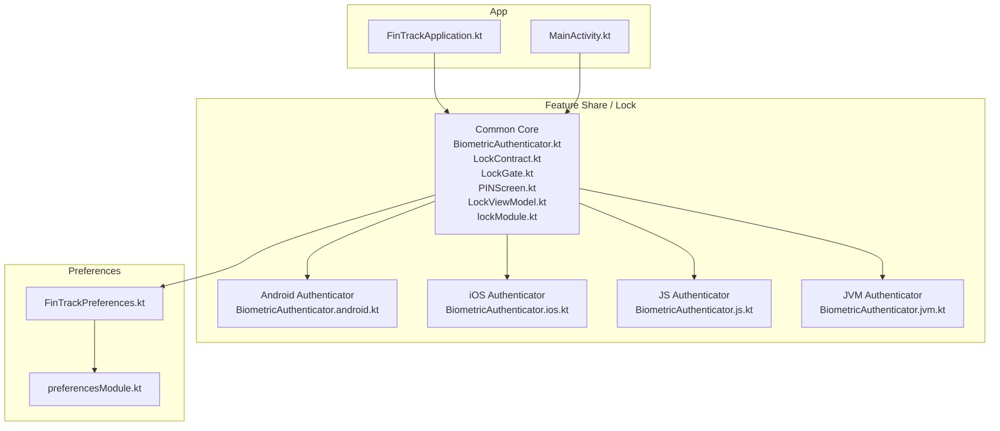
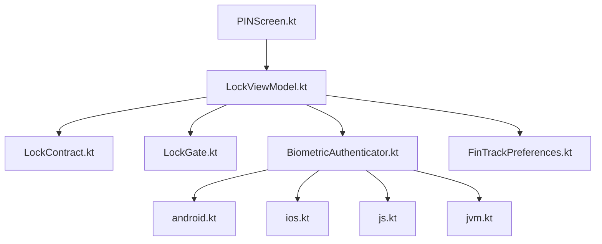
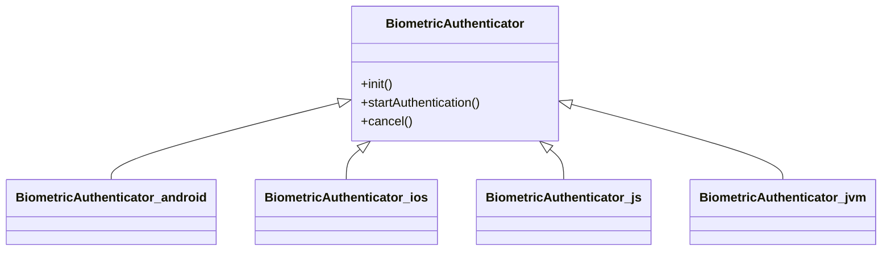
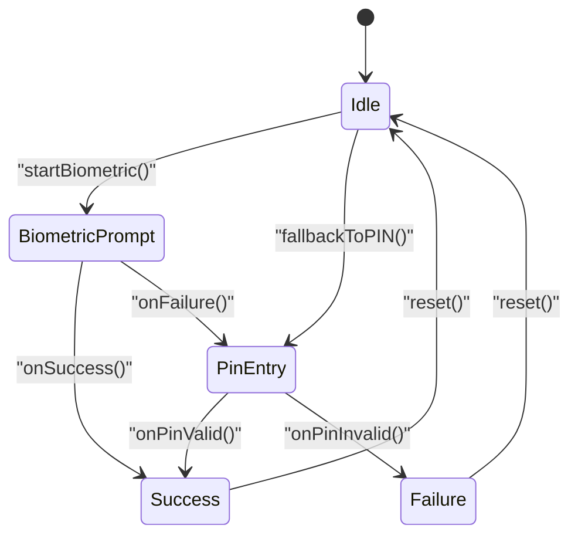
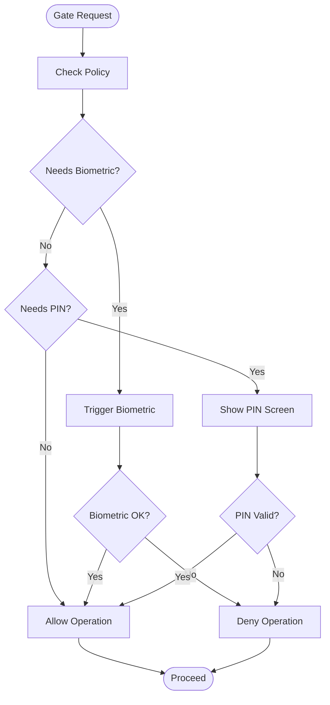
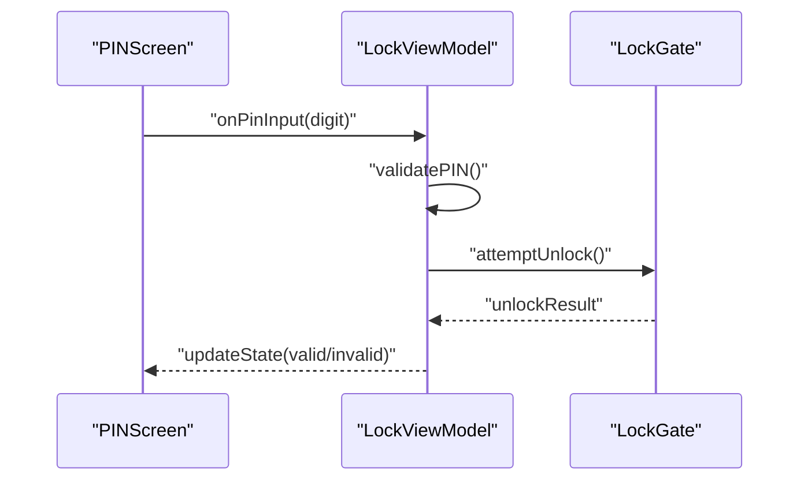
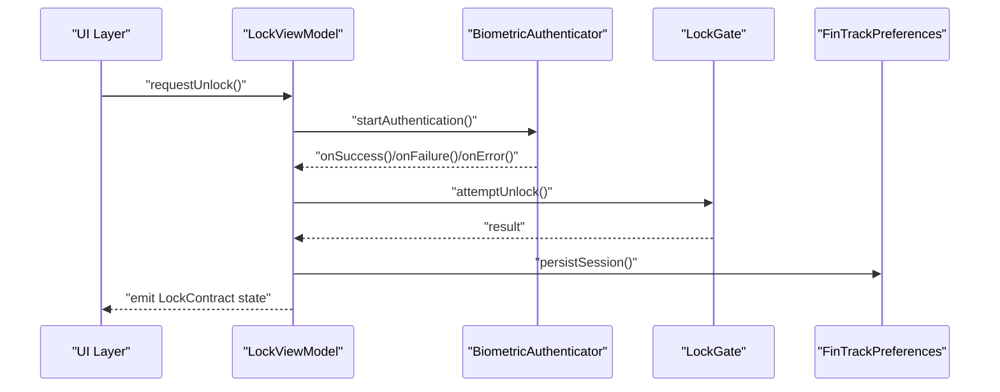
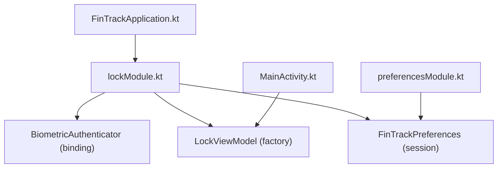
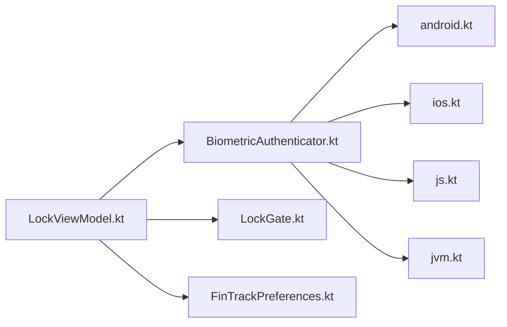

# Security & Authentication

<cite>
**Referenced Files in This Document**
- [BiometricAuthenticator.kt](file://feature-share/lock/src/commonMain/kotlin/com/kazemieh/lock/BiometricAuthenticator.kt)
- [BiometricAuthenticator.android.kt](file://feature-share/lock/src/androidMain/kotlin/com/kazemieh/lock/BiometricAuthenticator.android.kt)
- [BiometricAuthenticator.ios.kt](file://feature-share/lock/src/iosMain/kotlin/com/kazemieh/lock/BiometricAuthenticator.ios.kt)
- [BiometricAuthenticator.js.kt](file://feature-share/lock/src/jsMain/kotlin/com/kazemieh/lock/BiometricAuthenticator.js.kt)
- [BiometricAuthenticator.jvm.kt](file://feature-share/lock/src/jvmMain/kotlin/com/kazemieh/lock/BiometricAuthenticator.jvm.kt)
- [LockContract.kt](file://feature-share/lock/src/commonMain/kotlin/com/kazemieh/lock/LockContract.kt)
- [LockGate.kt](file://feature-share/lock/src/commonMain/kotlin/com/kazemieh/lock/LockGate.kt)
- [PINScreen.kt](file://feature-share/lock/src/commonMain/kotlin/com/kazemieh/lock/PINScreen.kt)
- [LockViewModel.kt](file://feature-share/lock/src/commonMain/kotlin/com/kazemieh/lock/LockViewModel.kt)
- [lockModule.kt](file://feature-share/lock/src/commonMain/kotlin/com/kazemieh/lock/di/lockModule.kt)
- [FinTrackApplication.kt](file://app/src/main/java/com/kazemieh/fintrack/FinTrackApplication.kt)
- [MainActivity.kt](file://app/src/main/java/com/kazemieh/fintrack/MainActivity.kt)
- [FinTrackPreferences.kt](file://core/preferences/src/commonMain/kotlin/com/kazemieh/preferences/FinTrackPreferences.kt)
- [preferencesModule.kt](file://core/preferences/src/commonMain/kotlin/com/kazemieh/preferences/preferencesModule.kt)
</cite>

## Table of Contents
1. [Introduction](#introduction)
2. [Project Structure](#project-structure)
3. [Core Components](#core-components)
4. [Architecture Overview](#architecture-overview)
5. [Detailed Component Analysis](#detailed-component-analysis)
6. [Dependency Analysis](#dependency-analysis)
7. [Performance Considerations](#performance-considerations)
8. [Troubleshooting Guide](#troubleshooting-guide)
9. [Conclusion](#conclusion)
10. [Appendices](#appendices)

## Introduction
This document describes the security and authentication shared feature module responsible for protecting sensitive operations via a multi-layered security system. It covers:
- Biometric authentication (fingerprint, face recognition) with platform-specific authenticators
- PIN protection and PIN screen implementation with input validation
- Session management and persistence
- Lock gate pattern for guarding sensitive operations
- ViewModel implementation for authentication flows and security state management
- Cross-platform consistency across Android, iOS, JVM, and JS
- Dependency injection setup and integration with the application lifecycle

## Project Structure
The security feature is implemented under the feature-share/lock module with platform-specific implementations and a common core:
- Common core: BiometricAuthenticator interface, LockContract, LockGate, PINScreen, LockViewModel, DI module
- Platform-specific authenticators: Android, iOS, JVM, JS
- Preferences integration for session persistence and policy storage

**Diagram sources**
- [BiometricAuthenticator.kt](file://feature-share/lock/src/commonMain/kotlin/com/kazemieh/lock/BiometricAuthenticator.kt)
- [BiometricAuthenticator.android.kt](file://feature-share/lock/src/androidMain/kotlin/com/kazemieh/lock/BiometricAuthenticator.android.kt)
- [BiometricAuthenticator.ios.kt](file://feature-share/lock/src/iosMain/kotlin/com/kazemieh/lock/BiometricAuthenticator.ios.kt)
- [BiometricAuthenticator.js.kt](file://feature-share/lock/src/jsMain/kotlin/com/kazemieh/lock/BiometricAuthenticator.js.kt)
- [BiometricAuthenticator.jvm.kt](file://feature-share/lock/src/jvmMain/kotlin/com/kazemieh/lock/BiometricAuthenticator.jvm.kt)
- [FinTrackPreferences.kt](file://core/preferences/src/commonMain/kotlin/com/kazemieh/preferences/FinTrackPreferences.kt)
- [preferencesModule.kt](file://core/preferences/src/commonMain/kotlin/com/kazemieh/preferences/preferencesModule.kt)
- [FinTrackApplication.kt](file://app/src/main/java/com/kazemieh/fintrack/FinTrackApplication.kt)
- [MainActivity.kt](file://app/src/main/java/com/kazemieh/fintrack/MainActivity.kt)

**Section sources**
- [BiometricAuthenticator.kt](file://feature-share/lock/src/commonMain/kotlin/com/kazemieh/lock/BiometricAuthenticator.kt)
- [lockModule.kt](file://feature-share/lock/src/commonMain/kotlin/com/kazemieh/lock/di/lockModule.kt)
- [FinTrackPreferences.kt](file://core/preferences/src/commonMain/kotlin/com/kazemieh/preferences/FinTrackPreferences.kt)

## Core Components
- BiometricAuthenticator: Common interface for biometric authentication across platforms
- Platform-specific authenticators: Implementations for Android, iOS, JVM, and JS
- LockContract: Defines authentication states and events
- LockGate: Gatekeeper for sensitive operations enforcing security policies
- PINScreen: UI component for PIN entry with validation
- LockViewModel: Orchestrates authentication flows, state transitions, and session management
- Preferences integration: Stores and retrieves security-related settings and session data

Key responsibilities:
- Biometric enrollment and authentication
- Fallback to PIN when biometrics unavailable
- Session timeout and persistence
- Policy-driven enforcement of security gates

**Section sources**
- [BiometricAuthenticator.kt](file://feature-share/lock/src/commonMain/kotlin/com/kazemieh/lock/BiometricAuthenticator.kt)
- [LockContract.kt](file://feature-share/lock/src/commonMain/kotlin/com/kazemieh/lock/LockContract.kt)
- [LockGate.kt](file://feature-share/lock/src/commonMain/kotlin/com/kazemieh/lock/LockGate.kt)
- [PINScreen.kt](file://feature-share/lock/src/commonMain/kotlin/com/kazemieh/lock/PINScreen.kt)
- [LockViewModel.kt](file://feature-share/lock/src/commonMain/kotlin/com/kazemieh/lock/LockViewModel.kt)
- [FinTrackPreferences.kt](file://core/preferences/src/commonMain/kotlin/com/kazemieh/preferences/FinTrackPreferences.kt)

## Architecture Overview
The security module follows a layered architecture:
- Presentation layer: PINScreen UI and LockViewModel orchestration
- Domain layer: LockContract defines states/events; LockGate enforces policies
- Platform abstraction: BiometricAuthenticator interface with platform-specific implementations
- Persistence: Preferences-backed session and policy storage

**Diagram sources**
- [PINScreen.kt](file://feature-share/lock/src/commonMain/kotlin/com/kazemieh/lock/PINScreen.kt)
- [LockViewModel.kt](file://feature-share/lock/src/commonMain/kotlin/com/kazemieh/lock/LockViewModel.kt)
- [LockContract.kt](file://feature-share/lock/src/commonMain/kotlin/com/kazemieh/lock/LockContract.kt)
- [LockGate.kt](file://feature-share/lock/src/commonMain/kotlin/com/kazemieh/lock/LockGate.kt)
- [BiometricAuthenticator.kt](file://feature-share/lock/src/commonMain/kotlin/com/kazemieh/lock/BiometricAuthenticator.kt)
- [BiometricAuthenticator.android.kt](file://feature-share/lock/src/androidMain/kotlin/com/kazemieh/lock/BiometricAuthenticator.android.kt)
- [BiometricAuthenticator.ios.kt](file://feature-share/lock/src/iosMain/kotlin/com/kazemieh/lock/BiometricAuthenticator.ios.kt)
- [BiometricAuthenticator.js.kt](file://feature-share/lock/src/jsMain/kotlin/com/kazemieh/lock/BiometricAuthenticator.js.kt)
- [BiometricAuthenticator.jvm.kt](file://feature-share/lock/src/jvmMain/kotlin/com/kazemieh/lock/BiometricAuthenticator.jvm.kt)
- [FinTrackPreferences.kt](file://core/preferences/src/commonMain/kotlin/com/kazemieh/preferences/FinTrackPreferences.kt)

## Detailed Component Analysis

### BiometricAuthenticator
- Purpose: Provide a unified interface for biometric authentication across platforms
- Responsibilities:
  - Initialize biometric capabilities
  - Start authentication sessions
  - Deliver callbacks for success/failure/error
  - Support cancellation and fallback to PIN
- Platform-specific implementations:
  - Android: Uses platform APIs for fingerprint/face recognition
  - iOS: Uses Face ID/Touch ID APIs
  - JVM: Placeholder for desktop environments
  - JS: Placeholder for web environments

**Diagram sources**
- [BiometricAuthenticator.kt](file://feature-share/lock/src/commonMain/kotlin/com/kazemieh/lock/BiometricAuthenticator.kt)
- [BiometricAuthenticator.android.kt](file://feature-share/lock/src/androidMain/kotlin/com/kazemieh/lock/BiometricAuthenticator.android.kt)
- [BiometricAuthenticator.ios.kt](file://feature-share/lock/src/iosMain/kotlin/com/kazemieh/lock/BiometricAuthenticator.ios.kt)
- [BiometricAuthenticator.js.kt](file://feature-share/lock/src/jsMain/kotlin/com/kazemieh/lock/BiometricAuthenticator.js.kt)
- [BiometricAuthenticator.jvm.kt](file://feature-share/lock/src/jvmMain/kotlin/com/kazemieh/lock/BiometricAuthenticator.jvm.kt)

**Section sources**
- [BiometricAuthenticator.kt](file://feature-share/lock/src/commonMain/kotlin/com/kazemieh/lock/BiometricAuthenticator.kt)
- [BiometricAuthenticator.android.kt](file://feature-share/lock/src/androidMain/kotlin/com/kazemieh/lock/BiometricAuthenticator.android.kt)
- [BiometricAuthenticator.ios.kt](file://feature-share/lock/src/iosMain/kotlin/com/kazemieh/lock/BiometricAuthenticator.ios.kt)
- [BiometricAuthenticator.js.kt](file://feature-share/lock/src/jsMain/kotlin/com/kazemieh/lock/BiometricAuthenticator.js.kt)
- [BiometricAuthenticator.jvm.kt](file://feature-share/lock/src/jvmMain/kotlin/com/kazemieh/lock/BiometricAuthenticator.jvm.kt)

### LockContract
- Defines authentication states and events for the security flow
- Typical states: Idle, BiometricPrompt, PinEntry, Success, Failure
- Events: OnBiometricResult, OnPinResult, OnCancel, OnTimeout
- Used by LockViewModel to drive UI and policy decisions

**Diagram sources**
- [LockContract.kt](file://feature-share/lock/src/commonMain/kotlin/com/kazemieh/lock/LockContract.kt)

**Section sources**
- [LockContract.kt](file://feature-share/lock/src/commonMain/kotlin/com/kazemieh/lock/LockContract.kt)

### LockGate
- Enforces security policies for sensitive operations
- Gate states: Locked, Unlocked, Timeout
- Policies: Require biometric, require PIN, enforce timeout window
- Integrates with LockViewModel to gate actions until conditions are met

**Diagram sources**
- [LockGate.kt](file://feature-share/lock/src/commonMain/kotlin/com/kazemieh/lock/LockGate.kt)
- [LockContract.kt](file://feature-share/lock/src/commonMain/kotlin/com/kazemieh/lock/LockContract.kt)

**Section sources**
- [LockGate.kt](file://feature-share/lock/src/commonMain/kotlin/com/kazemieh/lock/LockGate.kt)
- [LockContract.kt](file://feature-share/lock/src/commonMain/kotlin/com/kazemieh/lock/LockContract.kt)

### PINScreen
- UI component for PIN entry with validation
- Features:
  - Numeric input handling
  - Validation against stored PIN policy
  - Feedback on invalid attempts
  - Integration with LockViewModel for state updates

**Diagram sources**
- [PINScreen.kt](file://feature-share/lock/src/commonMain/kotlin/com/kazemieh/lock/PINScreen.kt)
- [LockViewModel.kt](file://feature-share/lock/src/commonMain/kotlin/com/kazemieh/lock/LockViewModel.kt)
- [LockGate.kt](file://feature-share/lock/src/commonMain/kotlin/com/kazemieh/lock/LockGate.kt)

**Section sources**
- [PINScreen.kt](file://feature-share/lock/src/commonMain/kotlin/com/kazemieh/lock/PINScreen.kt)
- [LockViewModel.kt](file://feature-share/lock/src/commonMain/kotlin/com/kazemieh/lock/LockViewModel.kt)
- [LockGate.kt](file://feature-share/lock/src/commonMain/kotlin/com/kazemieh/lock/LockGate.kt)

### LockViewModel
- Orchestrates authentication flows:
  - Starts biometric prompts
  - Handles callbacks and transitions
  - Manages PIN entry and validation
  - Updates LockGate and emits LockContract events
- Session management:
  - Tracks last successful authentication time
  - Applies timeout policies
  - Persists session state via preferences

**Diagram sources**
- [LockViewModel.kt](file://feature-share/lock/src/commonMain/kotlin/com/kazemieh/lock/LockViewModel.kt)
- [BiometricAuthenticator.kt](file://feature-share/lock/src/commonMain/kotlin/com/kazemieh/lock/BiometricAuthenticator.kt)
- [LockGate.kt](file://feature-share/lock/src/commonMain/kotlin/com/kazemieh/lock/LockGate.kt)
- [FinTrackPreferences.kt](file://core/preferences/src/commonMain/kotlin/com/kazemieh/preferences/FinTrackPreferences.kt)

**Section sources**
- [LockViewModel.kt](file://feature-share/lock/src/commonMain/kotlin/com/kazemieh/lock/LockViewModel.kt)
- [FinTrackPreferences.kt](file://core/preferences/src/commonMain/kotlin/com/kazemieh/preferences/FinTrackPreferences.kt)

### Dependency Injection Setup
- lockModule provides:
  - BiometricAuthenticator binding to platform-specific implementation
  - LockViewModel factory
  - Preferences-backed session storage
- preferencesModule provides FinTrackPreferences and related bindings
- Application integration:
  - FinTrackApplication initializes DI container
  - MainActivity consumes injected LockViewModel and displays PINScreen

**Diagram sources**
- [lockModule.kt](file://feature-share/lock/src/commonMain/kotlin/com/kazemieh/lock/di/lockModule.kt)
- [preferencesModule.kt](file://core/preferences/src/commonMain/kotlin/com/kazemieh/preferences/preferencesModule.kt)
- [FinTrackApplication.kt](file://app/src/main/java/com/kazemieh/fintrack/FinTrackApplication.kt)
- [MainActivity.kt](file://app/src/main/java/com/kazemieh/fintrack/MainActivity.kt)

**Section sources**
- [lockModule.kt](file://feature-share/lock/src/commonMain/kotlin/com/kazemieh/lock/di/lockModule.kt)
- [preferencesModule.kt](file://core/preferences/src/commonMain/kotlin/com/kazemieh/preferences/preferencesModule.kt)
- [FinTrackApplication.kt](file://app/src/main/java/com/kazemieh/fintrack/FinTrackApplication.kt)
- [MainActivity.kt](file://app/src/main/java/com/kazemieh/fintrack/MainActivity.kt)

## Dependency Analysis
- Cohesion: High within the lock module; all security-related concerns are centralized
- Coupling:
  - LockViewModel depends on BiometricAuthenticator, LockGate, and FinTrackPreferences
  - Platform-specific authenticators depend on platform APIs
- External dependencies: None explicit in the lock module; preferences integration is isolated
- DI boundaries: Clear separation between common core and platform implementations

**Diagram sources**
- [BiometricAuthenticator.kt](file://feature-share/lock/src/commonMain/kotlin/com/kazemieh/lock/BiometricAuthenticator.kt)
- [BiometricAuthenticator.android.kt](file://feature-share/lock/src/androidMain/kotlin/com/kazemieh/lock/BiometricAuthenticator.android.kt)
- [BiometricAuthenticator.ios.kt](file://feature-share/lock/src/iosMain/kotlin/com/kazemieh/lock/BiometricAuthenticator.ios.kt)
- [BiometricAuthenticator.js.kt](file://feature-share/lock/src/jsMain/kotlin/com/kazemieh/lock/BiometricAuthenticator.js.kt)
- [BiometricAuthenticator.jvm.kt](file://feature-share/lock/src/jvmMain/kotlin/com/kazemieh/lock/BiometricAuthenticator.jvm.kt)
- [LockViewModel.kt](file://feature-share/lock/src/commonMain/kotlin/com/kazemieh/lock/LockViewModel.kt)
- [LockGate.kt](file://feature-share/lock/src/commonMain/kotlin/com/kazemieh/lock/LockGate.kt)
- [FinTrackPreferences.kt](file://core/preferences/src/commonMain/kotlin/com/kazemieh/preferences/FinTrackPreferences.kt)

**Section sources**
- [LockViewModel.kt](file://feature-share/lock/src/commonMain/kotlin/com/kazemieh/lock/LockViewModel.kt)
- [BiometricAuthenticator.kt](file://feature-share/lock/src/commonMain/kotlin/com/kazemieh/lock/BiometricAuthenticator.kt)
- [LockGate.kt](file://feature-share/lock/src/commonMain/kotlin/com/kazemieh/lock/LockGate.kt)
- [FinTrackPreferences.kt](file://core/preferences/src/commonMain/kotlin/com/kazemieh/preferences/FinTrackPreferences.kt)

## Performance Considerations
- Minimize UI thrashing by batching state updates in LockViewModel
- Debounce biometric callbacks to avoid redundant UI rebuilds
- Cache PIN validation results within a short time window to reduce repeated checks
- Use lazy initialization for biometric prompts to avoid unnecessary overhead
- Persist session state asynchronously to prevent UI blocking

## Troubleshooting Guide
Common issues and resolutions:
- Biometric sensor unavailable:
  - Trigger fallback to PIN automatically
  - Show user-friendly message indicating sensor failure
  - Log diagnostic info for support
- Authentication failures:
  - Increment retry counter and apply cooldown
  - Offer biometric retry after delay
  - Clear sensitive state and reset UI
- Security best practices:
  - Never log raw biometric data or PIN
  - Use secure storage for PIN hashes and session tokens
  - Enforce strict timeout policies
  - Validate PIN length and composition server-side if applicable
- Lifecycle integration:
  - Reinitialize biometric prompts on activity resume
  - Cancel ongoing prompts on pause/destroy
  - Persist session state on application background

**Section sources**
- [LockViewModel.kt](file://feature-share/lock/src/commonMain/kotlin/com/kazemieh/lock/LockViewModel.kt)
- [LockGate.kt](file://feature-share/lock/src/commonMain/kotlin/com/kazemieh/lock/LockGate.kt)
- [PINScreen.kt](file://feature-share/lock/src/commonMain/kotlin/com/kazemieh/lock/PINScreen.kt)

## Conclusion
The security and authentication module provides a robust, cross-platform solution for protecting sensitive operations. Its layered design, strong DI boundaries, and platform-specific implementations ensure consistent behavior while leveraging native capabilities. The LockGate pattern, combined with PIN fallback and preference-backed session persistence, delivers a secure and user-friendly experience across Android, iOS, JVM, and JS targets.

## Appendices
- Example references:
  - Biometric workflow: [BiometricAuthenticator.kt](file://feature-share/lock/src/commonMain/kotlin/com/kazemieh/lock/BiometricAuthenticator.kt)
  - PIN validation: [PINScreen.kt](file://feature-share/lock/src/commonMain/kotlin/com/kazemieh/lock/PINScreen.kt)
  - Session persistence: [FinTrackPreferences.kt](file://core/preferences/src/commonMain/kotlin/com/kazemieh/preferences/FinTrackPreferences.kt)
  - DI wiring: [lockModule.kt](file://feature-share/lock/src/commonMain/kotlin/com/kazemieh/lock/di/lockModule.kt)