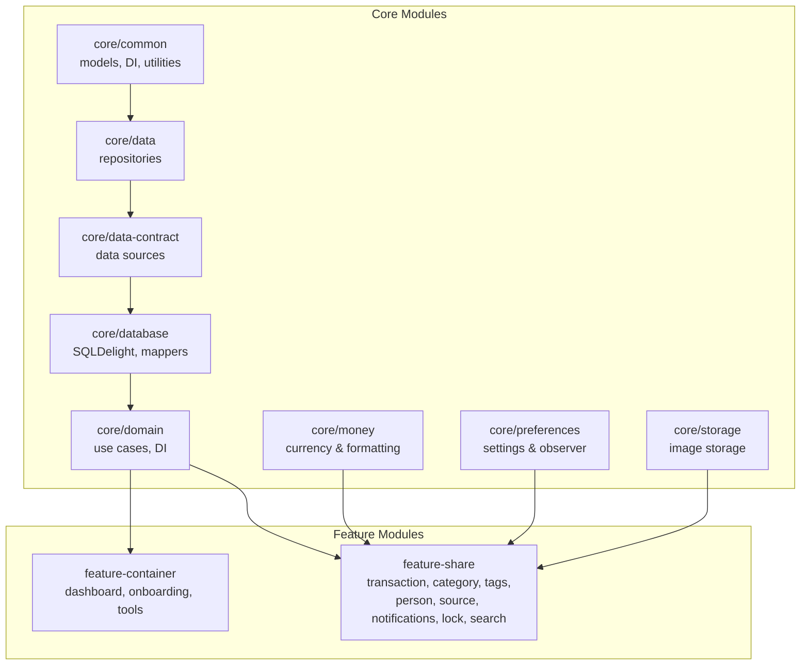
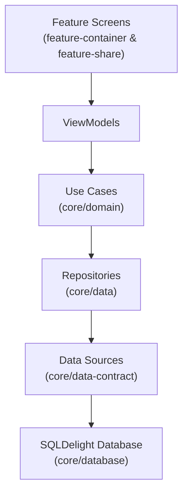
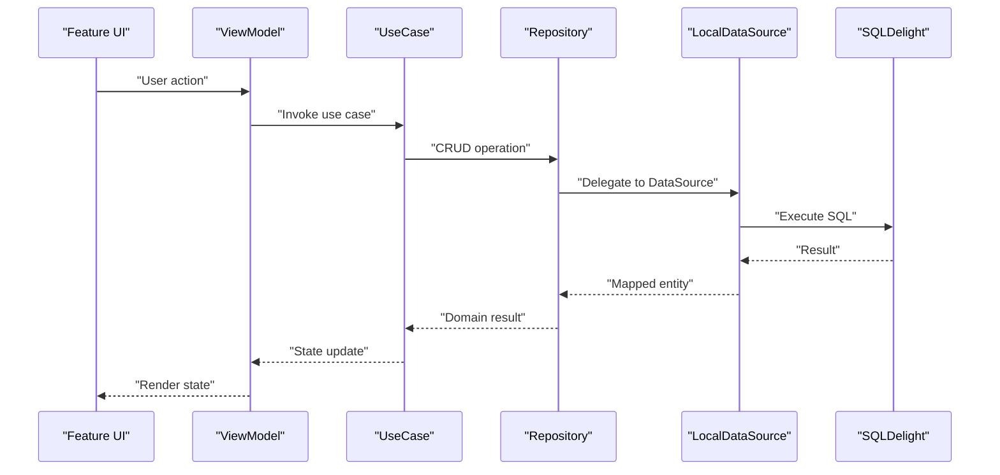
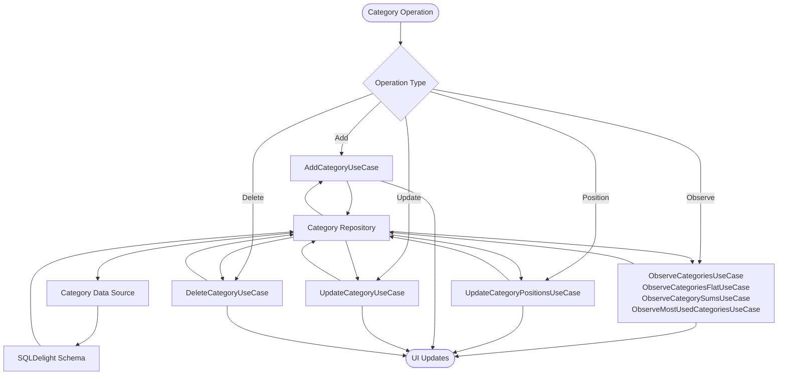
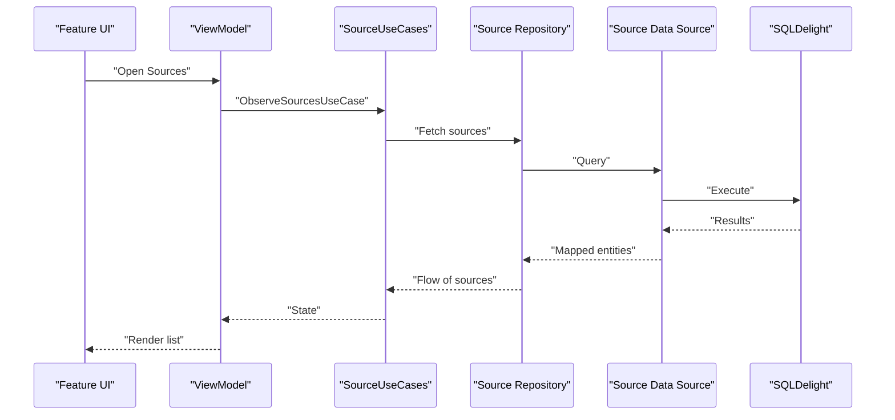
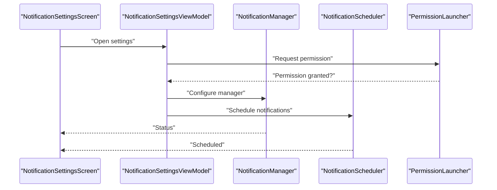
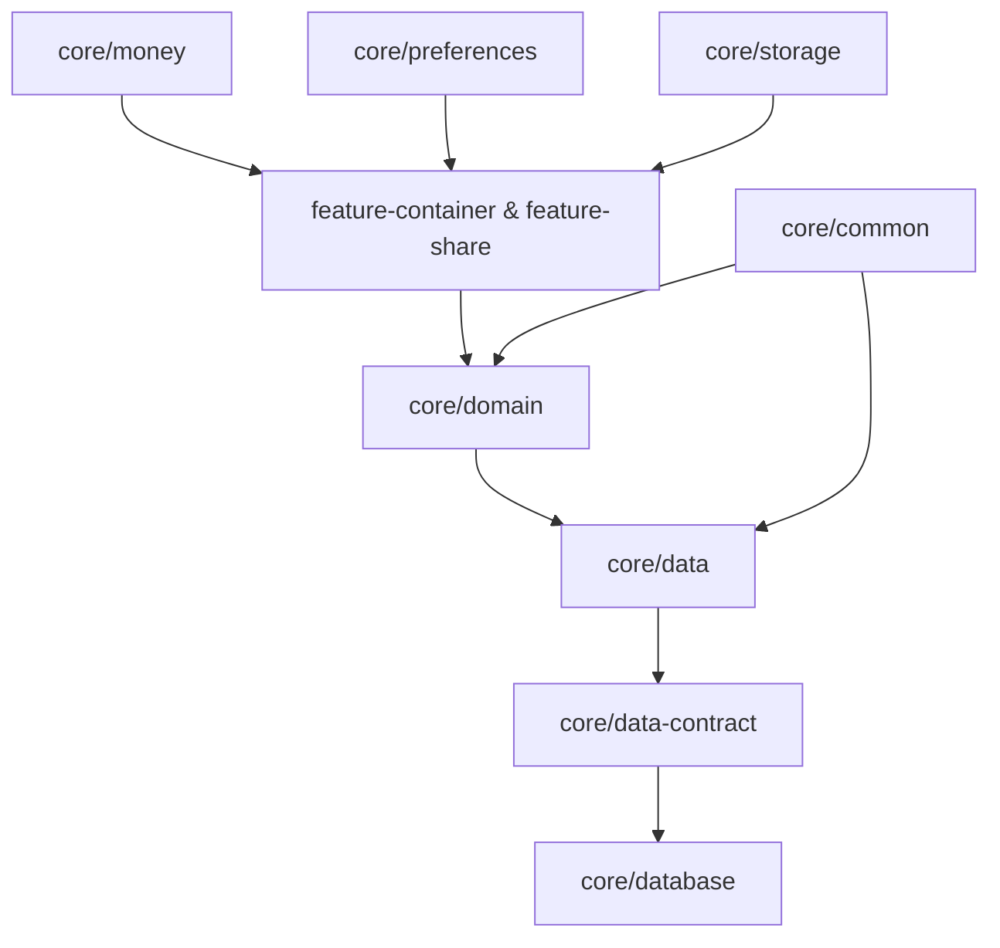

# Shared Features

<cite>
**Referenced Files in This Document**
- [README.md](file://README.md)
- [fintrack_master_guide.md](file://agent/fintrack_master_guide.md)
- [CommonModule.kt](file://core/common/src/commonMain/kotlin/com/kazemieh/common/di/CommonModule.kt)
- [CommonModule.android.kt](file://core/common/src/androidMain/kotlin/com/kazemieh/common/di/CommonModule.android.kt)
- [CommonModule.ios.kt](file://core/common/src/iosMain/kotlin/com/kazemieh/common/di/CommonModule.ios.kt)
- [CommonModule.js.kt](file://core/common/src/jsMain/kotlin/com/kazemieh/common/di/CommonModule.js.kt)
- [CommonModule.jvm.kt](file://core/common/src/jvmMain/kotlin/com/kazemieh/common/di/CommonModule.jvm.kt)
- [Budget.kt](file://core/common/src/commonMain/kotlin/com/kazemieh/common/model/Budget.kt)
- [Category.kt](file://core/common/src/commonMain/kotlin/com/kazemieh/common/model/Category.kt)
- [PageRequest.kt](file://core/common/src/commonMain/kotlin/com/kazemieh/common/model/PageRequest.kt)
- [Person.kt](file://core/common/src/commonMain/kotlin/com/kazemieh/common/model/Person.kt)
- [Source.kt](file://core/common/src/commonMain/kotlin/com/kazemieh/common/model/Source.kt)
- [Tag.kt](file://core/common/src/commonMain/kotlin/com/kazemieh/common/model/Tag.kt)
- [Transaction.kt](file://core/common/src/commonMain/kotlin/com/kazemieh/common/model/Transaction.kt)
- [TransactionFilterParams.kt](file://core/common/src/commonMain/kotlin/com/kazemieh/common/model/TransactionFilterParams.kt)
- [TransactionWithRelations.kt](file://core/common/src/commonMain/kotlin/com/kazemieh/common/model/TransactionWithRelations.kt)
- [PersianDateTime.kt](file://core/common/src/commonMain/kotlin/com/kazemieh/common/persiandatetime/domain/PersianDateTime.kt)
- [PersianDateConverterImpl.kt](file://core/common/src/commonMain/kotlin/com/kazemieh/common/persiandatetime/PersianDateConverterImpl.kt)
- [PersianDateTimeFormat.kt](file://core/common/src/commonMain/kotlin/com/kazemieh/common/persiandatetime/util/PersianDateTimeFormat.kt)
- [PersianLeap.kt](file://core/common/src/commonMain/kotlin/com/kazemieh/common/persiandatetime/util/PersianLeap.kt)
- [PersianDateValidator.kt](file://core/common/src/commonMain/kotlin/com/kazemieh/common/persiandatetime/util/PersianDateValidator.kt)
- [nowPersianDate.kt](file://core/common/src/commonMain/kotlin/com/kazemieh/common/persiandatetime/extensions/nowPersianDate.kt)
- [CalculatorParser.kt](file://core/common/src/commonMain/kotlin/com/kazemieh/common/util/CalculatorParser.kt)
- [ImageStorage.kt](file://core/common/src/commonMain/kotlin/com/kazemieh/common/ImageStorage.kt)
- [Log.kt](file://core/common/src/commonMain/kotlin/com/kazemieh/common/Log.kt)
- [DataModule.kt](file://core/data/src/commonMain/kotlin/com/kazemieh/data/di/DataModule.kt)
- [TransactionRepositoryImpl.kt](file://core/data/src/commonMain/kotlin/com/kazemieh/data/repository/TransactionRepositoryImpl.kt)
- [PreferenceRepositoryImpl.kt](file://core/data/src/commonMain/kotlin/com/kazemieh/data/repository/PreferenceRepositoryImpl.kt)
- [BudgetLocalDataSource.kt](file://core/data-contract/src/commonMain/kotlin/com/kazemieh/data_contract/datasource/BudgetLocalDataSource.kt)
- [TransactionLocalDataSource.kt](file://core/data-contract/src/commonMain/kotlin/com/kazemieh/data_contract/datasource/TransactionLocalDataSource.kt)
- [DatabaseInitializer.kt](file://core/database/src/commonMain/kotlin/com/kazemieh/database/DatabaseInitializer.kt)
- [DriverFactory.kt](file://core/database/src/commonMain/kotlin/com/kazemieh/database/DriverFactory.kt)
- [DriverFactory.android.kt](file://core/database/src/androidMain/kotlin/com/kazemieh/database/DriverFactory.android.kt)
- [DriverFactory.ios.kt](file://core/database/src/iosMain/kotlin/com/kazemieh/database/DriverFactory.ios.kt)
- [DriverFactory.js.kt](file://core/database/src/jsMain/kotlin/com/kazemieh/database/DriverFactory.js.kt)
- [DriverFactory.jvm.kt](file://core/database/src/jvmMain/kotlin/com/kazemieh/database/DriverFactory.jvm.kt)
- [Mappers.kt](file://core/database/src/commonMain/kotlin/com/kazemieh/database/mapper/Mappers.kt)
- [TransactionLocalDataSourceImpl.kt](file://core/database/src/commonMain/kotlin/com/kazemieh/database/datasource/TransactionLocalDataSourceImpl.kt)
- [DomainModule.kt](file://core/domain/src/commonMain/kotlin/com/kazemieh/domain/di/DomainModule.kt)
- [AddTransactionUseCase.kt](file://core/domain/src/commonMain/kotlin/com/kazemieh/domain/usecase/AddTransactionUseCase.kt)
- [UpdateTransactionUseCase.kt](file://core/domain/src/commonMain/kotlin/com/kazemieh/domain/usecase/UpdateTransactionUseCase.kt)
- [DeleteTransactionUseCase.kt](file://core/domain/src/commonMain/kotlin/com/kazemieh/domain/usecase/DeleteTransactionUseCase.kt)
- [ObserveTransactionsUseCase.kt](file://core/domain/src/commonMain/kotlin/com/kazemieh/domain/usecase/ObserveTransactionsUseCase.kt)
- [GetTransactionAmountRangeUseCase.kt](file://core/domain/src/commonMain/kotlin/com/kazemieh/domain/usecase/GetTransactionAmountRangeUseCase.kt)
- [AddCategoryUseCase.kt](file://core/domain/src/commonMain/kotlin/com/kazemieh/domain/usecase/AddCategoryUseCase.kt)
- [UpdateCategoryUseCase.kt](file://core/domain/src/commonMain/kotlin/com/kazemieh/domain/usecase/UpdateCategoryUseCase.kt)
- [DeleteCategoryUseCase.kt](file://core/domain/src/commonMain/kotlin/com/kazemieh/domain/usecase/DeleteCategoryUseCase.kt)
- [ObserveCategoriesUseCase.kt](file://core/domain/src/commonMain/kotlin/com/kazemieh/domain/usecase/ObserveCategoriesUseCase.kt)
- [ObserveCategoriesFlatUseCase.kt](file://core/domain/src/commonMain/kotlin/com/kazemieh/domain/usecase/ObserveCategoriesFlatUseCase.kt)
- [ObserveCategorySumsUseCase.kt](file://core/domain/src/commonMain/kotlin/com/kazemieh/domain/usecase/ObserveCategorySumsUseCase.kt)
- [ObserveMostUsedCategoriesUseCase.kt](file://core/domain/src/commonMain/kotlin/com/kazemieh/domain/usecase/ObserveMostUsedCategoriesUseCase.kt)
- [GetDefaultCategoryUseCase.kt](file://core/domain/src/commonMain/kotlin/com/kazemieh/domain/usecase/GetDefaultCategoryUseCase.kt)
- [UpdateCategoryPositionsUseCase.kt](file://core/domain/src/commonMain/kotlin/com/kazemieh/domain/usecase/UpdateCategoryPositionsUseCase.kt)
- [AddSourceUseCase.kt](file://core/domain/src/commonMain/kotlin/com/kazemieh/domain/usecase/AddSourceUseCase.kt)
- [UpdateSourceUseCase.kt](file://core/domain/src/commonMain/kotlin/com/kazemieh/domain/usecase/UpdateSourceUseCase.kt)
- [DeleteSourceUseCase.kt](file://core/domain/src/commonMain/kotlin/com/kazemieh/domain/usecase/DeleteSourceUseCase.kt)
- [ObserveSourceUseCase.kt](file://core/domain/src/commonMain/kotlin/com/kazemieh/domain/usecase/ObserveSourceUseCase.kt)
- [ObserveSourcesUseCase.kt](file://core/domain/src/commonMain/kotlin/com/kazemieh/domain/usecase/ObserveSourcesUseCase.kt)
- [GetDefaultFinancialSourceUseCase.kt](file://core/domain/src/commonMain/kotlin/com/kazemieh/domain/usecase/GetDefaultFinancialSourceUseCase.kt)
- [UpdateSourcePositionsUseCase.kt](file://core/domain/src/commonMain/kotlin/com/kazemieh/domain/usecase/UpdateSourcePositionsUseCase.kt)
- [AddTagUseCase.kt](file://core/domain/src/commonMain/kotlin/com/kazemieh/domain/usecase/AddTagUseCase.kt)
- [UpdateTagUseCase.kt](file://core/domain/src/commonMain/kotlin/com/kazemieh/domain/usecase/UpdateTagUseCase.kt)
- [DeleteTagUseCase.kt](file://core/domain/src/commonMain/kotlin/com/kazemieh/domain/usecase/DeleteTagUseCase.kt)
- [ObserveTagsUseCase.kt](file://core/domain/src/commonMain/kotlin/com/kazemieh/domain/usecase/ObserveTagsUseCase.kt)
- [ObserveMostUsedTagsUseCase.kt](file://core/domain/src/commonMain/kotlin/com/kazemieh/domain/usecase/ObserveMostUsedTagsUseCase.kt)
- [UpdateTagPositionsUseCase.kt](file://core/domain/src/commonMain/kotlin/com/kazemieh/domain/usecase/UpdateTagPositionsUseCase.kt)
- [AddPersonUseCase.kt](file://core/domain/src/commonMain/kotlin/com/kazemieh/domain/usecase/AddPersonUseCase.kt)
- [UpdatePersonUseCase.kt](file://core/domain/src/commonMain/kotlin/com/kazemieh/domain/usecase/UpdatePersonUseCase.kt)
- [DeletePersonUseCase.kt](file://core/domain/src/commonMain/kotlin/com/kazemieh/domain/usecase/DeletePersonUseCase.kt)
- [ObservePersonsUseCase.kt](file://core/domain/src/commonMain/kotlin/com/kazemieh/domain/usecase/ObservePersonsUseCase.kt)
- [ObserveMostUsedPersonsUseCase.kt](file://core/domain/src/commonMain/kotlin/com/kazemieh/domain/usecase/ObserveMostUsedPersonsUseCase.kt)
- [UpdatePersonPositionsUseCase.kt](file://core/domain/src/commonMain/kotlin/com/kazemieh/domain/usecase/UpdatePersonPositionsUseCase.kt)
- [SearchEntitiesUseCase.kt](file://core/domain/src/commonMain/kotlin/com/kazemieh/domain/usecase/SearchEntitiesUseCase.kt)
- [PreferenceUseCases.kt](file://core/domain/src/commonMain/kotlin/com/kazemieh/domain/usecase/PreferenceUseCases.kt)
- [SourceUseCases.kt](file://core/domain/src/commonMain/kotlin/com/kazemieh/domain/usecase/SourceUseCases.kt)
- [TransactionUseCaseGroup.kt](file://core/domain/src/commonMain/kotlin/com/kazemieh/domain/usecase/TransactionUseCaseGroup.kt)
- [balanceImpact.kt](file://core/domain/src/commonMain/kotlin/com/kazemieh/domain/util/balanceImpact.kt)
- [Currency.kt](file://core/money/src/commonMain/kotlin/com/kazemieh/money/Currency.kt)
- [MoneyFormatter.kt](file://core/money/src/commonMain/kotlin/com/kazemieh/money/MoneyFormatter.kt)
- [FinTrackPreferences.kt](file://core/preferences/src/commonMain/kotlin/com/kazemieh/preferences/FinTrackPreferences.kt)
- [SettingsObserver.kt](file://core/preferences/src/commonMain/kotlin/com/kazemieh/preferences/SettingsObserver.kt)
- [preferencesModule.kt](file://core/preferences/src/commonMain/kotlin/com/kazemieh/preferences/preferencesModule.kt)
- [ImageStorageImpl.kt](file://core/storage/src/commonMain/kotlin/com/kazemieh/storage/ImageStorageImpl.kt)
- [ImageStorageImpl.android.kt](file://core/storage/src/androidMain/kotlin/com/kazemieh/storage/ImageStorageImpl.android.kt)
- [ImageStorageImpl.ios.kt](file://core/storage/src/iosMain/kotlin/com/kazemieh/storage/ImageStorageImpl.ios.kt)
- [ImageStorageImpl.js.kt](file://core/storage/src/jsMain/kotlin/com/kazemieh/storage/ImageStorageImpl.js.kt)
- [ImageStorageImpl.jvm.kt](file://core/storage/src/jvmMain/kotlin/com/kazemieh/storage/ImageStorageImpl.jvm.kt)
- [ImageStorageProvider.kt](file://core/storage/src/commonMain/kotlin/com/kazemieh/storage/ImageStorageProvider.kt)
- [ImageStorageProvider.android.kt](file://core/storage/src/androidMain/kotlin/com/kazemieh/storage/ImageStorageProvider.android.kt)
- [ImageStorageProvider.ios.kt](file://core/storage/src/iosMain/kotlin/com/kazemieh/storage/ImageStorageProvider.ios.kt)
- [ImageStorageProvider.js.kt](file://core/storage/src/jsMain/kotlin/com/kazemieh/storage/ImageStorageProvider.js.kt)
- [ImageStorageProvider.jvm.kt](file://core/storage/src/jvmMain/kotlin/com/kazemieh/storage/ImageStorageProvider.jvm.kt)
- [SearchDI.kt](file://feature-share/search/src/commonMain/kotlin/com/kazemieh/search/di/SearchDI.kt)
- [SearchContract.kt](file://feature-share/search/src/commonMain/kotlin/com/kazemieh/search/ui/SearchContract.kt)
- [SearchScreen.kt](file://feature-share/search/src/commonMain/kotlin/com/kazemieh/search/ui/SearchScreen.kt)
- [SearchViewModel.kt](file://feature-share/search/src/commonMain/kotlin/com/kazemieh/search/ui/SearchViewModel.kt)
- [TransactionCategoryModule.kt](file://feature-share/category/src/commonMain/kotlin/com/kazemieh/category/di/TransactionCategoryModule.kt)
- [TransactionTagModule.kt](file://feature-share/person/src/commonMain/kotlin/com/kazemieh/person/di/TransactionTagModule.kt)
- [TransactionTagModule.kt](file://feature-share/tags/src/commonMain/kotlin/com/kazemieh/tag/di/TransactionTagModule.kt)
- [TransactionFinancialSource Module.kt](file://feature-share/source/src/commonMain/kotlin/com/kazemieh/financialsource/di/TransactionFinancialSource Module.kt)
- [TransactionPresentationModule.kt](file://feature-share/transaction/src/commonMain/kotlin/com/kazemieh/transaction/di/TransactionPresentationModule.kt)
- [NotificationModule.kt](file://feature-share/notifications/src/commonMain/kotlin/com/kazemieh/notifications/di/NotificationModule.kt)
- [AndroidNotificationModule.kt](file://feature-share/notifications/src/androidMain/kotlin/com/kazemieh/notifications/di/AndroidNotificationModule.kt)
- [IosNotificationModule.kt](file://feature-share/notifications/src/iosMain/kotlin/com/kazemieh/notifications/di/IosNotificationModule.kt)
- [JsNotificationModule.kt](file://feature-share/notifications/src/jsMain/kotlin/com/kazemieh/notifications/di/JsNotificationModule.kt)
- [JvmNotificationModule.kt](file://feature-share/notifications/src/jvmMain/kotlin/com/kazemieh/notifications/di/JvmNotificationModule.kt)
- [NotificationManager.kt](file://feature-share/notifications/src/commonMain/kotlin/com/kazemieh/notifications/NotificationManager.kt)
- [NotificationScheduler.kt](file://feature-share/notifications/src/commonMain/kotlin/com/kazemieh/notifications/NotificationScheduler.kt)
- [AndroidNotificationManager.kt](file://feature-share/notifications/src/androidMain/kotlin/com/kazemieh/notifications/AndroidNotificationManager.kt)
- [AndroidNotificationScheduler.kt](file://feature-share/notifications/src/androidMain/kotlin/com/kazemieh/notifications/AndroidNotificationScheduler.kt)
- [IosNotificationManager.kt](file://feature-share/notifications/src/iosMain/kotlin/com/kazemieh/notifications/IosNotificationManager.kt)
- [IosNotificationScheduler.kt](file://feature-share/notifications/src/iosMain/kotlin/com/kazemieh/notifications/IosNotificationScheduler.kt)
- [NotificationSettingsScreen.kt](file://feature-share/notifications/src/commonMain/kotlin/com/kazemieh/notifications/ui/NotificationSettingsScreen.kt)
- [NotificationSettingsViewModel.kt](file://feature-share/notifications/src/commonMain/kotlin/com/kazemieh/notifications/ui/NotificationSettingsViewModel.kt)
- [NotificationSettingsState.kt](file://feature-share/notifications/src/commonMain/kotlin/com/kazemieh/notifications/ui/NotificationSettingsState.kt)
- [NotificationSettingsIntent.kt](file://feature-share/notifications/src/commonMain/kotlin/com/kazemieh/notifications/ui/NotificationSettingsIntent.kt)
- [NotificationSettingsEffect.kt](file://feature-share/notifications/src/commonMain/kotlin/com/kazemieh/notifications/ui/NotificationSettingsEffect.kt)
- [PermissionLauncher.kt](file://feature-share/notifications/src/commonMain/kotlin/com/kazemieh/notifications/ui/PermissionLauncher.kt)
- [PermissionLauncher.android.kt](file://feature-share/notifications/src/androidMain/kotlin/com/kazemieh/notifications/ui/PermissionLauncher.android.kt)
- [PermissionLauncher.ios.kt](file://feature-share/notifications/src/iosMain/kotlin/com/kazemieh/notifications/ui/PermissionLauncher.ios.kt)
- [PermissionLauncher.js.kt](file://feature-share/notifications/src/jsMain/kotlin/com/kazemieh/notifications/ui/PermissionLauncher.js.kt)
- [PermissionLauncher.jvm.kt](file://feature-share/notifications/src/jvmMain/kotlin/com/kazemieh/notifications/ui/PermissionLauncher.jvm.kt)
- [PermissionRationaleHelper.kt](file://feature-share/notifications/src/commonMain/kotlin/com/kazemieh/notifications/ui/PermissionRationaleHelper.kt)
- [PermissionRationaleHelper.android.kt](file://feature-share/notifications/src/androidMain/kotlin/com/kazemieh/notifications/ui/PermissionRationaleHelper.android.kt)
- [PermissionRationaleHelper.ios.kt](file://feature-share/notifications/src/iosMain/kotlin/com/kazemieh/notifications/ui/PermissionRationaleHelper.ios.kt)
- [PermissionRationaleHelper.js.kt](file://feature-share/notifications/src/jsMain/kotlin/com/kazemieh/notifications/ui/PermissionRationaleHelper.js.kt)
- [PermissionRationaleHelper.jvm.kt](file://feature-share/notifications/src/jvmMain/kotlin/com/kazemieh/notifications/ui/PermissionRationaleHelper.jvm.kt)
- [LockContract.kt](file://feature-share/lock/src/commonMain/kotlin/com/kazemieh/lock/LockContract.kt)
- [LockViewModel.kt](file://feature-share/lock/src/commonMain/kotlin/com/kazemieh/lock/LockViewModel.kt)
- [LockGate.kt](file://feature-share/lock/src/commonMain/kotlin/com/kazemieh/lock/LockGate.kt)
- [BiometricAuthenticator.kt](file://feature-share/lock/src/commonMain/kotlin/com/kazemieh/lock/BiometricAuthenticator.kt)
- [BiometricAuthenticator.android.kt](file://feature-share/lock/src/androidMain/kotlin/com/kazemieh/lock/BiometricAuthenticator.android.kt)
- [BiometricAuthenticator.ios.kt](file://feature-share/lock/src/iosMain/kotlin/com/kazemieh/lock/BiometricAuthenticator.ios.kt)
- [BiometricAuthenticator.js.kt](file://feature-share/lock/src/jsMain/kotlin/com/kazemieh/lock/BiometricAuthenticator.js.kt)
- [BiometricAuthenticator.jvm.kt](file://feature-share/lock/src/jvmMain/kotlin/com/kazemieh/lock/BiometricAuthenticator.jvm.kt)
- [PINScreen.kt](file://feature-share/lock/src/commonMain/kotlin/com/kazemieh/lock/PINScreen.kt)
- [lockModule.kt](file://feature-share/lock/src/commonMain/kotlin/com/kazemieh/lock/di/lockModule.kt)
- [DashboardModule.kt](file://feature-container/dashboard/src/commonMain/kotlin/com/kazemieh/dashboard/di/DashboardModule.kt)
- [OnboardingModule.kt](file://feature-container/onboarding/src/commonMain/kotlin/com/kazemieh/onboarding/di/OnboardingModule.kt)
- [DashboardScreen.kt](file://feature-container/dashboard/src/commonMain/kotlin/com/kazemieh/dashboard/DashboardScreen.kt)
- [DashboardViewModel.kt](file://feature-container/dashboard/src/commonMain/kotlin/com/kazemieh/dashboard/DashboardViewModel.kt)
- [OnboardingScreen.kt](file://feature-container/onboarding/src/commonMain/kotlin/com/kazemieh/onboarding/ui/OnboardingScreen.kt)
- [OnboardingViewModel.kt](file://feature-container/onboarding/src/commonMain/kotlin/com/kazemieh/onboarding/ui/OnboardingViewModel.kt)
- [ToolsScreen.kt](file://feature-container/tools/src/commonMain/kotlin/com/kazemieh/tools/ToolsScreen.kt)
- [ToolsDI.kt](file://feature-container/tools/src/commonMain/kotlin/com/kazemieh/tools/di/di.kt)
</cite>

## Table of Contents
1. [Introduction](#introduction)
2. [Project Structure](#project-structure)
3. [Core Components](#core-components)
4. [Architecture Overview](#architecture-overview)
5. [Detailed Component Analysis](#detailed-component-analysis)
6. [Dependency Analysis](#dependency-analysis)
7. [Performance Considerations](#performance-considerations)
8. [Troubleshooting Guide](#troubleshooting-guide)
9. [Conclusion](#conclusion)
10. [Appendices](#appendices)

## Introduction
This document explains FinTrack’s shared feature modules that provide reusable components and cross-cutting concerns across the application. It focuses on:
- Transaction management (CRUD operations)
- Category management (hierarchical organization)
- Financial source tracking (multiple sources)
- Tag management (categorization)
- Person/contact management
- Notification system
- Security/authentication
- Search functionality

It documents the repository pattern, use cases, and multiplatform considerations, and demonstrates how these shared features integrate across feature modules. Both conceptual overviews and technical details are included to serve beginners and experienced developers alike.

## Project Structure
FinTrack follows a modular architecture with a core layer (common, data, data-contract, database, domain, money, preferences, storage) and feature modules (feature-container and feature-share). Shared models, DI, repositories, use cases, and platform-specific adapters live in core modules, while presentation logic lives in feature modules.

**Diagram sources**
- [README.md](file://README.md)
- [CommonModule.kt](file://core/common/src/commonMain/kotlin/com/kazemieh/common/di/CommonModule.kt)
- [DataModule.kt](file://core/data/src/commonMain/kotlin/com/kazemieh/data/di/DataModule.kt)
- [DomainModule.kt](file://core/domain/src/commonMain/kotlin/com/kazemieh/domain/di/DomainModule.kt)
- [DashboardModule.kt](file://feature-container/dashboard/src/commonMain/kotlin/com/kazemieh/dashboard/di/DashboardModule.kt)
- [SearchDI.kt](file://feature-share/search/src/commonMain/kotlin/com/kazemieh/search/di/SearchDI.kt)

**Section sources**
- [README.md](file://README.md)
- [fintrack_master_guide.md](file://agent/fintrack_master_guide.md)

## Core Components
This section outlines the shared models and cross-cutting services that underpin all shared features.

- Shared models define entities and filters used across modules:
  - Transaction, Category, Tag, Person, Source, Budget, PageRequest, TransactionFilterParams, TransactionWithRelations
- Persian date utilities enable Jalali calendar support across platforms
- Money formatting and currency utilities
- Preferences for settings and observers
- Storage abstraction for images
- Logging and calculator utilities

These components are declared in commonMain to ensure multiplatform compatibility and are consumed by domain use cases and feature presentations.

**Section sources**
- [Category.kt](file://core/common/src/commonMain/kotlin/com/kazemieh/common/model/Category.kt)
- [Tag.kt](file://core/common/src/commonMain/kotlin/com/kazemieh/common/model/Tag.kt)
- [Person.kt](file://core/common/src/commonMain/kotlin/com/kazemieh/common/model/Person.kt)
- [Source.kt](file://core/common/src/commonMain/kotlin/com/kazemieh/common/model/Source.kt)
- [Transaction.kt](file://core/common/src/commonMain/kotlin/com/kazemieh/common/model/Transaction.kt)
- [Budget.kt](file://core/common/src/commonMain/kotlin/com/kazemieh/common/model/Budget.kt)
- [PageRequest.kt](file://core/common/src/commonMain/kotlin/com/kazemieh/common/model/PageRequest.kt)
- [TransactionFilterParams.kt](file://core/common/src/commonMain/kotlin/com/kazemieh/common/model/TransactionFilterParams.kt)
- [TransactionWithRelations.kt](file://core/common/src/commonMain/kotlin/com/kazemieh/common/model/TransactionWithRelations.kt)
- [PersianDateTime.kt](file://core/common/src/commonMain/kotlin/com/kazemieh/common/persiandatetime/domain/PersianDateTime.kt)
- [PersianDateConverterImpl.kt](file://core/common/src/commonMain/kotlin/com/kazemieh/common/persiandatetime/PersianDateConverterImpl.kt)
- [PersianDateTimeFormat.kt](file://core/common/src/commonMain/kotlin/com/kazemieh/common/persiandatetime/util/PersianDateTimeFormat.kt)
- [PersianLeap.kt](file://core/common/src/commonMain/kotlin/com/kazemieh/common/persiandatetime/util/PersianLeap.kt)
- [PersianDateValidator.kt](file://core/common/src/commonMain/kotlin/com/kazemieh/common/persiandatetime/util/PersianDateValidator.kt)
- [nowPersianDate.kt](file://core/common/src/commonMain/kotlin/com/kazemieh/common/persiandatetime/extensions/nowPersianDate.kt)
- [Currency.kt](file://core/money/src/commonMain/kotlin/com/kazemieh/money/Currency.kt)
- [MoneyFormatter.kt](file://core/money/src/commonMain/kotlin/com/kazemieh/money/MoneyFormatter.kt)
- [FinTrackPreferences.kt](file://core/preferences/src/commonMain/kotlin/com/kazemieh/preferences/FinTrackPreferences.kt)
- [SettingsObserver.kt](file://core/preferences/src/commonMain/kotlin/com/kazemieh/preferences/SettingsObserver.kt)
- [ImageStorage.kt](file://core/common/src/commonMain/kotlin/com/kazemieh/common/ImageStorage.kt)
- [Log.kt](file://core/common/src/commonMain/kotlin/com/kazemieh/common/Log.kt)
- [CalculatorParser.kt](file://core/common/src/commonMain/kotlin/com/kazemieh/common/util/CalculatorParser.kt)

## Architecture Overview
FinTrack employs a layered architecture:
- Presentation: Feature modules expose screens and ViewModels
- Domain: Use cases encapsulate business logic
- Data: Repositories implement CRUD against local data sources
- Data Contract: Abstractions for local data sources
- Database: SQLDelight schema and mappers
- Core Utilities: Models, DI, money, preferences, storage, Persian date helpers

**Diagram sources**
- [README.md](file://README.md)
- [DomainModule.kt](file://core/domain/src/commonMain/kotlin/com/kazemieh/domain/di/DomainModule.kt)
- [DataModule.kt](file://core/data/src/commonMain/kotlin/com/kazemieh/data/di/DataModule.kt)
- [TransactionLocalDataSource.kt](file://core/data-contract/src/commonMain/kotlin/com/kazemieh/data_contract/datasource/TransactionLocalDataSource.kt)
- [TransactionLocalDataSourceImpl.kt](file://core/database/src/commonMain/kotlin/com/kazemieh/database/datasource/TransactionLocalDataSourceImpl.kt)

## Detailed Component Analysis

### Transaction Management (CRUD)
- Purpose: Provide full CRUD operations for transactions with filtering, observation, and amount range computation.
- Implementation pattern:
  - Use cases encapsulate business logic: Add, Update, Delete, Observe, Amount Range
  - Repository delegates to local data sources via SQLDelight
  - Multiplatform drivers are provided per target
- Cross-cutting concerns:
  - Filtering via TransactionFilterParams and TransactionWithRelations
  - Balance impact calculation utilities
  - Persian date support for transaction timestamps
- Reusability:
  - Use cases are shared across feature modules
  - Repository and DataSource abstractions enable swapping implementations
  - Platform-specific drivers ensure compatibility

**Diagram sources**
- [AddTransactionUseCase.kt](file://core/domain/src/commonMain/kotlin/com/kazemieh/domain/usecase/AddTransactionUseCase.kt)
- [UpdateTransactionUseCase.kt](file://core/domain/src/commonMain/kotlin/com/kazemieh/domain/usecase/UpdateTransactionUseCase.kt)
- [DeleteTransactionUseCase.kt](file://core/domain/src/commonMain/kotlin/com/kazemieh/domain/usecase/DeleteTransactionUseCase.kt)
- [ObserveTransactionsUseCase.kt](file://core/domain/src/commonMain/kotlin/com/kazemieh/domain/usecase/ObserveTransactionsUseCase.kt)
- [GetTransactionAmountRangeUseCase.kt](file://core/domain/src/commonMain/kotlin/com/kazemieh/domain/usecase/GetTransactionAmountRangeUseCase.kt)
- [TransactionRepositoryImpl.kt](file://core/data/src/commonMain/kotlin/com/kazemieh/data/repository/TransactionRepositoryImpl.kt)
- [TransactionLocalDataSource.kt](file://core/data-contract/src/commonMain/kotlin/com/kazemieh/data_contract/datasource/TransactionLocalDataSource.kt)
- [TransactionLocalDataSourceImpl.kt](file://core/database/src/commonMain/kotlin/com/kazemieh/database/datasource/TransactionLocalDataSourceImpl.kt)

**Section sources**
- [Transaction.kt](file://core/common/src/commonMain/kotlin/com/kazemieh/common/model/Transaction.kt)
- [TransactionFilterParams.kt](file://core/common/src/commonMain/kotlin/com/kazemieh/common/model/TransactionFilterParams.kt)
- [TransactionWithRelations.kt](file://core/common/src/commonMain/kotlin/com/kazemieh/common/model/TransactionWithRelations.kt)
- [AddTransactionUseCase.kt](file://core/domain/src/commonMain/kotlin/com/kazemieh/domain/usecase/AddTransactionUseCase.kt)
- [UpdateTransactionUseCase.kt](file://core/domain/src/commonMain/kotlin/com/kazemieh/domain/usecase/UpdateTransactionUseCase.kt)
- [DeleteTransactionUseCase.kt](file://core/domain/src/commonMain/kotlin/com/kazemieh/domain/usecase/DeleteTransactionUseCase.kt)
- [ObserveTransactionsUseCase.kt](file://core/domain/src/commonMain/kotlin/com/kazemieh/domain/usecase/ObserveTransactionsUseCase.kt)
- [GetTransactionAmountRangeUseCase.kt](file://core/domain/src/commonMain/kotlin/com/kazemieh/domain/usecase/GetTransactionAmountRangeUseCase.kt)
- [TransactionRepositoryImpl.kt](file://core/data/src/commonMain/kotlin/com/kazemieh/data/repository/TransactionRepositoryImpl.kt)
- [TransactionLocalDataSource.kt](file://core/data-contract/src/commonMain/kotlin/com/kazemieh/data_contract/datasource/TransactionLocalDataSource.kt)
- [TransactionLocalDataSourceImpl.kt](file://core/database/src/commonMain/kotlin/com/kazemieh/database/datasource/TransactionLocalDataSourceImpl.kt)
- [DriverFactory.kt](file://core/database/src/commonMain/kotlin/com/kazemieh/database/DriverFactory.kt)
- [DriverFactory.android.kt](file://core/database/src/androidMain/kotlin/com/kazemieh/database/DriverFactory.android.kt)
- [DriverFactory.ios.kt](file://core/database/src/iosMain/kotlin/com/kazemieh/database/DriverFactory.ios.kt)
- [DriverFactory.js.kt](file://core/database/src/jsMain/kotlin/com/kazemieh/database/DriverFactory.js.kt)
- [DriverFactory.jvm.kt](file://core/database/src/jvmMain/kotlin/com/kazemieh/database/DriverFactory.jvm.kt)

### Category Management (Hierarchical Organization)
- Purpose: Manage categories with hierarchical structure, positions, and observations for flat lists, sums, and most-used items.
- Implementation pattern:
  - Use cases for add, update, delete, position updates, and observe variants
  - Hierarchical models and relations supported by shared Category model
- Cross-cutting concerns:
  - Position updates maintain ordering across platforms
  - Observations feed UI widgets and dashboards
- Reusability:
  - Use cases are shared across feature modules
  - DI modules bind category-related use cases

**Diagram sources**
- [AddCategoryUseCase.kt](file://core/domain/src/commonMain/kotlin/com/kazemieh/domain/usecase/AddCategoryUseCase.kt)
- [UpdateCategoryUseCase.kt](file://core/domain/src/commonMain/kotlin/com/kazemieh/domain/usecase/UpdateCategoryUseCase.kt)
- [DeleteCategoryUseCase.kt](file://core/domain/src/commonMain/kotlin/com/kazemieh/domain/usecase/DeleteCategoryUseCase.kt)
- [UpdateCategoryPositionsUseCase.kt](file://core/domain/src/commonMain/kotlin/com/kazemieh/domain/usecase/UpdateCategoryPositionsUseCase.kt)
- [ObserveCategoriesUseCase.kt](file://core/domain/src/commonMain/kotlin/com/kazemieh/domain/usecase/ObserveCategoriesUseCase.kt)
- [ObserveCategoriesFlatUseCase.kt](file://core/domain/src/commonMain/kotlin/com/kazemieh/domain/usecase/ObserveCategoriesFlatUseCase.kt)
- [ObserveCategorySumsUseCase.kt](file://core/domain/src/commonMain/kotlin/com/kazemieh/domain/usecase/ObserveCategorySumsUseCase.kt)
- [ObserveMostUsedCategoriesUseCase.kt](file://core/domain/src/commonMain/kotlin/com/kazemieh/domain/usecase/ObserveMostUsedCategoriesUseCase.kt)
- [GetDefaultCategoryUseCase.kt](file://core/domain/src/commonMain/kotlin/com/kazemieh/domain/usecase/GetDefaultCategoryUseCase.kt)

**Section sources**
- [Category.kt](file://core/common/src/commonMain/kotlin/com/kazemieh/common/model/Category.kt)
- [AddCategoryUseCase.kt](file://core/domain/src/commonMain/kotlin/com/kazemieh/domain/usecase/AddCategoryUseCase.kt)
- [UpdateCategoryUseCase.kt](file://core/domain/src/commonMain/kotlin/com/kazemieh/domain/usecase/UpdateCategoryUseCase.kt)
- [DeleteCategoryUseCase.kt](file://core/domain/src/commonMain/kotlin/com/kazemieh/domain/usecase/DeleteCategoryUseCase.kt)
- [UpdateCategoryPositionsUseCase.kt](file://core/domain/src/commonMain/kotlin/com/kazemieh/domain/usecase/UpdateCategoryPositionsUseCase.kt)
- [ObserveCategoriesUseCase.kt](file://core/domain/src/commonMain/kotlin/com/kazemieh/domain/usecase/ObserveCategoriesUseCase.kt)
- [ObserveCategoriesFlatUseCase.kt](file://core/domain/src/commonMain/kotlin/com/kazemieh/domain/usecase/ObserveCategoriesFlatUseCase.kt)
- [ObserveCategorySumsUseCase.kt](file://core/domain/src/commonMain/kotlin/com/kazemieh/domain/usecase/ObserveCategorySumsUseCase.kt)
- [ObserveMostUsedCategoriesUseCase.kt](file://core/domain/src/commonMain/kotlin/com/kazemieh/domain/usecase/ObserveMostUsedCategoriesUseCase.kt)
- [GetDefaultCategoryUseCase.kt](file://core/domain/src/commonMain/kotlin/com/kazemieh/domain/usecase/GetDefaultCategoryUseCase.kt)

### Financial Source Tracking (Multiple Sources)
- Purpose: Track multiple financial sources with CRUD, observation, default selection, and position updates.
- Implementation pattern:
  - Use cases mirror transaction category patterns
  - Default source retrieval and position updates
- Cross-cutting concerns:
  - Default financial source use case ensures consistent fallback behavior
- Reusability:
  - Use cases and DI modules are shared across feature modules

**Diagram sources**
- [SourceUseCases.kt](file://core/domain/src/commonMain/kotlin/com/kazemieh/domain/usecase/SourceUseCases.kt)
- [ObserveSourcesUseCase.kt](file://core/domain/src/commonMain/kotlin/com/kazemieh/domain/usecase/ObserveSourcesUseCase.kt)
- [ObserveSourceUseCase.kt](file://core/domain/src/commonMain/kotlin/com/kazemieh/domain/usecase/ObserveSourceUseCase.kt)
- [GetDefaultFinancialSourceUseCase.kt](file://core/domain/src/commonMain/kotlin/com/kazemieh/domain/usecase/GetDefaultFinancialSourceUseCase.kt)
- [UpdateSourcePositionsUseCase.kt](file://core/domain/src/commonMain/kotlin/com/kazemieh/domain/usecase/UpdateSourcePositionsUseCase.kt)

**Section sources**
- [Source.kt](file://core/common/src/commonMain/kotlin/com/kazemieh/common/model/Source.kt)
- [SourceUseCases.kt](file://core/domain/src/commonMain/kotlin/com/kazemieh/domain/usecase/SourceUseCases.kt)
- [ObserveSourcesUseCase.kt](file://core/domain/src/commonMain/kotlin/com/kazemieh/domain/usecase/ObserveSourcesUseCase.kt)
- [ObserveSourceUseCase.kt](file://core/domain/src/commonMain/kotlin/com/kazemieh/domain/usecase/ObserveSourceUseCase.kt)
- [GetDefaultFinancialSourceUseCase.kt](file://core/domain/src/commonMain/kotlin/com/kazemieh/domain/usecase/GetDefaultFinancialSourceUseCase.kt)
- [UpdateSourcePositionsUseCase.kt](file://core/domain/src/commonMain/kotlin/com/kazemieh/domain/usecase/UpdateSourcePositionsUseCase.kt)

### Tag Management (Categorization)
- Purpose: Manage tags with CRUD, observation, and position updates.
- Implementation pattern:
  - Use cases mirror category and source patterns
- Cross-cutting concerns:
  - Position updates maintain ordering
  - Observations support autocomplete and tagging workflows
- Reusability:
  - Use cases and DI modules are shared across feature modules

**Section sources**
- [Tag.kt](file://core/common/src/commonMain/kotlin/com/kazemieh/common/model/Tag.kt)
- [AddTagUseCase.kt](file://core/domain/src/commonMain/kotlin/com/kazemieh/domain/usecase/AddTagUseCase.kt)
- [UpdateTagUseCase.kt](file://core/domain/src/commonMain/kotlin/com/kazemieh/domain/usecase/UpdateTagUseCase.kt)
- [DeleteTagUseCase.kt](file://core/domain/src/commonMain/kotlin/com/kazemieh/domain/usecase/DeleteTagUseCase.kt)
- [ObserveTagsUseCase.kt](file://core/domain/src/commonMain/kotlin/com/kazemieh/domain/usecase/ObserveTagsUseCase.kt)
- [ObserveMostUsedTagsUseCase.kt](file://core/domain/src/commonMain/kotlin/com/kazemieh/domain/usecase/ObserveMostUsedTagsUseCase.kt)
- [UpdateTagPositionsUseCase.kt](file://core/domain/src/commonMain/kotlin/com/kazemieh/domain/usecase/UpdateTagPositionsUseCase.kt)

### Person/Contact Management
- Purpose: Manage persons/contacts associated with transactions, with CRUD and observation.
- Implementation pattern:
  - Use cases mirror category, source, and tag patterns
- Cross-cutting concerns:
  - Observation supports autocomplete and selection
  - Position updates maintain ordering
- Reusability:
  - Use cases and DI modules are shared across feature modules

**Section sources**
- [Person.kt](file://core/common/src/commonMain/kotlin/com/kazemieh/common/model/Person.kt)
- [AddPersonUseCase.kt](file://core/domain/src/commonMain/kotlin/com/kazemieh/domain/usecase/AddPersonUseCase.kt)
- [UpdatePersonUseCase.kt](file://core/domain/src/commonMain/kotlin/com/kazemieh/domain/usecase/UpdatePersonUseCase.kt)
- [DeletePersonUseCase.kt](file://core/domain/src/commonMain/kotlin/com/kazemieh/domain/usecase/DeletePersonUseCase.kt)
- [ObservePersonsUseCase.kt](file://core/domain/src/commonMain/kotlin/com/kazemieh/domain/usecase/ObservePersonsUseCase.kt)
- [ObserveMostUsedPersonsUseCase.kt](file://core/domain/src/commonMain/kotlin/com/kazemieh/domain/usecase/ObserveMostUsedPersonsUseCase.kt)
- [UpdatePersonPositionsUseCase.kt](file://core/domain/src/commonMain/kotlin/com/kazemieh/domain/usecase/UpdatePersonPositionsUseCase.kt)

### Notification System
- Purpose: Provide cross-platform notification scheduling and settings management with permission handling.
- Implementation pattern:
  - Common NotificationManager and NotificationScheduler with platform-specific implementations
  - Permission launchers and rationale helpers per platform
- Cross-cutting concerns:
  - Permission handling is abstracted behind platform adapters
  - Settings screen and ViewModel manage state and intents
- Reusability:
  - Common interfaces and DI modules enable reuse across feature modules

**Diagram sources**
- [NotificationSettingsScreen.kt](file://feature-share/notifications/src/commonMain/kotlin/com/kazemieh/notifications/ui/NotificationSettingsScreen.kt)
- [NotificationSettingsViewModel.kt](file://feature-share/notifications/src/commonMain/kotlin/com/kazemieh/notifications/ui/NotificationSettingsViewModel.kt)
- [NotificationSettingsState.kt](file://feature-share/notifications/src/commonMain/kotlin/com/kazemieh/notifications/ui/NotificationSettingsState.kt)
- [NotificationSettingsIntent.kt](file://feature-share/notifications/src/commonMain/kotlin/com/kazemieh/notifications/ui/NotificationSettingsIntent.kt)
- [NotificationSettingsEffect.kt](file://feature-share/notifications/src/commonMain/kotlin/com/kazemieh/notifications/ui/NotificationSettingsEffect.kt)
- [NotificationManager.kt](file://feature-share/notifications/src/commonMain/kotlin/com/kazemieh/notifications/NotificationManager.kt)
- [NotificationScheduler.kt](file://feature-share/notifications/src/commonMain/kotlin/com/kazemieh/notifications/NotificationScheduler.kt)
- [PermissionLauncher.kt](file://feature-share/notifications/src/commonMain/kotlin/com/kazemieh/notifications/ui/PermissionLauncher.kt)
- [PermissionLauncher.android.kt](file://feature-share/notifications/src/androidMain/kotlin/com/kazemieh/notifications/ui/PermissionLauncher.android.kt)
- [PermissionLauncher.ios.kt](file://feature-share/notifications/src/iosMain/kotlin/com/kazemieh/notifications/ui/PermissionLauncher.ios.kt)
- [PermissionLauncher.js.kt](file://feature-share/notifications/src/jsMain/kotlin/com/kazemieh/notifications/ui/PermissionLauncher.js.kt)
- [PermissionLauncher.jvm.kt](file://feature-share/notifications/src/jvmMain/kotlin/com/kazemieh/notifications/ui/PermissionLauncher.jvm.kt)
- [PermissionRationaleHelper.kt](file://feature-share/notifications/src/commonMain/kotlin/com/kazemieh/notifications/ui/PermissionRationaleHelper.kt)
- [PermissionRationaleHelper.android.kt](file://feature-share/notifications/src/androidMain/kotlin/com/kazemieh/notifications/ui/PermissionRationaleHelper.android.kt)
- [PermissionRationaleHelper.ios.kt](file://feature-share/notifications/src/iosMain/kotlin/com/kazemieh/notifications/ui/PermissionRationaleHelper.ios.kt)
- [PermissionRationaleHelper.js.kt](file://feature-share/notifications/src/jsMain/kotlin/com/kazemieh/notifications/ui/PermissionRationaleHelper.js.kt)
- [PermissionRationaleHelper.jvm.kt](file://feature-share/notifications/src/jvmMain/kotlin/com/kazemieh/notifications/ui/PermissionRationaleHelper.jvm.kt)

**Section sources**
- [NotificationModule.kt](file://feature-share/notifications/src/commonMain/kotlin/com/kazemieh/notifications/di/NotificationModule.kt)
- [AndroidNotificationModule.kt](file://feature-share/notifications/src/androidMain/kotlin/com/kazemieh/notifications/di/AndroidNotificationModule.kt)
- [IosNotificationModule.kt](file://feature-share/notifications/src/iosMain/kotlin/com/kazemieh/notifications/di/IosNotificationModule.kt)
- [JsNotificationModule.kt](file://feature-share/notifications/src/jsMain/kotlin/com/kazemieh/notifications/di/JsNotificationModule.kt)
- [JvmNotificationModule.kt](file://feature-share/notifications/src/jvmMain/kotlin/com/kazemieh/notifications/di/JvmNotificationModule.kt)
- [NotificationManager.kt](file://feature-share/notifications/src/commonMain/kotlin/com/kazemieh/notifications/NotificationManager.kt)
- [NotificationScheduler.kt](file://feature-share/notifications/src/commonMain/kotlin/com/kazemieh/notifications/NotificationScheduler.kt)
- [AndroidNotificationManager.kt](file://feature-share/notifications/src/androidMain/kotlin/com/kazemieh/notifications/AndroidNotificationManager.kt)
- [AndroidNotificationScheduler.kt](file://feature-share/notifications/src/androidMain/kotlin/com/kazemieh/notifications/AndroidNotificationScheduler.kt)
- [IosNotificationManager.kt](file://feature-share/notifications/src/iosMain/kotlin/com/kazemieh/notifications/IosNotificationManager.kt)
- [IosNotificationScheduler.kt](file://feature-share/notifications/src/iosMain/kotlin/com/kazemieh/notifications/IosNotificationScheduler.kt)

### Security/Authentication (Lock Gate and Biometrics)
- Purpose: Provide biometric and PIN-based authentication gates and screens.
- Implementation pattern:
  - Biometric authenticator per platform
  - Lock gate composes authentication UI and enforces policies
  - PIN screen for numeric fallback
- Cross-cutting concerns:
  - Platform-specific authenticators abstract biometric APIs
  - Lock contract defines state and intents
- Reusability:
  - Common interfaces and DI modules enable reuse across feature modules

**Section sources**
- [LockContract.kt](file://feature-share/lock/src/commonMain/kotlin/com/kazemieh/lock/LockContract.kt)
- [LockViewModel.kt](file://feature-share/lock/src/commonMain/kotlin/com/kazemieh/lock/LockViewModel.kt)
- [LockGate.kt](file://feature-share/lock/src/commonMain/kotlin/com/kazemieh/lock/LockGate.kt)
- [BiometricAuthenticator.kt](file://feature-share/lock/src/commonMain/kotlin/com/kazemieh/lock/BiometricAuthenticator.kt)
- [BiometricAuthenticator.android.kt](file://feature-share/lock/src/androidMain/kotlin/com/kazemieh/lock/BiometricAuthenticator.android.kt)
- [BiometricAuthenticator.ios.kt](file://feature-share/lock/src/iosMain/kotlin/com/kazemieh/lock/BiometricAuthenticator.ios.kt)
- [BiometricAuthenticator.js.kt](file://feature-share/lock/src/jsMain/kotlin/com/kazemieh/lock/BiometricAuthenticator.js.kt)
- [BiometricAuthenticator.jvm.kt](file://feature-share/lock/src/jvmMain/kotlin/com/kazemieh/lock/BiometricAuthenticator.jvm.kt)
- [PINScreen.kt](file://feature-share/lock/src/commonMain/kotlin/com/kazemieh/lock/PINScreen.kt)
- [lockModule.kt](file://feature-share/lock/src/commonMain/kotlin/com/kazemieh/lock/di/lockModule.kt)

### Search Functionality
- Purpose: Provide unified search across entities (transactions, categories, tags, persons, sources).
- Implementation pattern:
  - Search DI module binds search components
  - Search contract defines state and intents
  - ViewModel orchestrates search queries and results
- Cross-cutting concerns:
  - Unified search interface across feature modules
  - State management via MVI pattern
- Reusability:
  - DI module and UI components are shared across feature modules

**Section sources**
- [SearchDI.kt](file://feature-share/search/src/commonMain/kotlin/com/kazemieh/search/di/SearchDI.kt)
- [SearchContract.kt](file://feature-share/search/src/commonMain/kotlin/com/kazemieh/search/ui/SearchContract.kt)
- [SearchScreen.kt](file://feature-share/search/src/commonMain/kotlin/com/kazemieh/search/ui/SearchScreen.kt)
- [SearchViewModel.kt](file://feature-share/search/src/commonMain/kotlin/com/kazemieh/search/ui/SearchViewModel.kt)
- [SearchEntitiesUseCase.kt](file://core/domain/src/commonMain/kotlin/com/kazemieh/domain/usecase/SearchEntitiesUseCase.kt)

## Dependency Analysis
Shared features depend on core modules and are consumed by feature modules. The dependency graph below highlights key relationships.

**Diagram sources**
- [DomainModule.kt](file://core/domain/src/commonMain/kotlin/com/kazemieh/domain/di/DomainModule.kt)
- [DataModule.kt](file://core/data/src/commonMain/kotlin/com/kazemieh/data/di/DataModule.kt)
- [CommonModule.kt](file://core/common/src/commonMain/kotlin/com/kazemieh/common/di/CommonModule.kt)
- [DashboardModule.kt](file://feature-container/dashboard/src/commonMain/kotlin/com/kazemieh/dashboard/di/DashboardModule.kt)
- [SearchDI.kt](file://feature-share/search/src/commonMain/kotlin/com/kazemieh/search/di/SearchDI.kt)

**Section sources**
- [README.md](file://README.md)
- [fintrack_master_guide.md](file://agent/fintrack_master_guide.md)

## Performance Considerations
- Use cases return reactive streams (Flow) for efficient UI updates and reduced overdraw.
- Repository pattern centralizes caching and deduplication strategies.
- SQLDelight provides compile-time verified queries and efficient paging via PageRequest.
- Multiplatform drivers minimize overhead by leveraging native capabilities per platform.
- Avoid heavy computations in UI threads; delegate to use cases and repositories.

## Troubleshooting Guide
- Transaction CRUD failures:
  - Verify DataSource implementations and SQLDelight schema migrations.
  - Check repository method signatures and mapper correctness.
- Category/Tag/Person/Source inconsistencies:
  - Ensure position updates are applied atomically.
  - Confirm observation use cases emit correct ordering.
- Notifications not appearing:
  - Validate permission launcher outcomes and rationale helpers.
  - Confirm platform-specific managers and schedulers are initialized.
- Authentication prompts not working:
  - Check platform-specific authenticator implementations.
  - Ensure LockGate receives correct state transitions.
- Search not returning results:
  - Confirm SearchEntitiesUseCase is invoked with correct parameters.
  - Validate DI bindings for search module.

**Section sources**
- [TransactionLocalDataSourceImpl.kt](file://core/database/src/commonMain/kotlin/com/kazemieh/database/datasource/TransactionLocalDataSourceImpl.kt)
- [Mappers.kt](file://core/database/src/commonMain/kotlin/com/kazemieh/database/mapper/Mappers.kt)
- [NotificationSettingsEffect.kt](file://feature-share/notifications/src/commonMain/kotlin/com/kazemieh/notifications/ui/NotificationSettingsEffect.kt)
- [LockGate.kt](file://feature-share/lock/src/commonMain/kotlin/com/kazemieh/lock/LockGate.kt)
- [SearchEntitiesUseCase.kt](file://core/domain/src/commonMain/kotlin/com/kazemieh/domain/usecase/SearchEntitiesUseCase.kt)

## Conclusion
FinTrack’s shared features are built around a consistent repository pattern, use cases, and multiplatform DI. This enables:
- Reusable components across feature modules
- Cross-cutting concerns (notifications, security, search) to be implemented once and reused
- Predictable state management and testability
- Scalable extension for new shared features

## Appendices
- Multiplatform considerations:
  - commonMain-first approach ensures shared logic is portable.
  - Platform-specific modules override or complement common implementations.
- DI guidelines:
  - Bind use cases and repositories in core modules.
  - Expose feature-specific DI modules to wire UI and domain together.
- State management:
  - Use MVI in ViewModels; keep UI state immutable and derived from use cases.