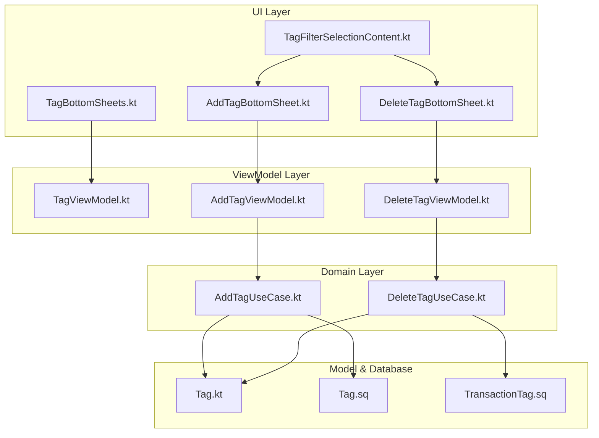
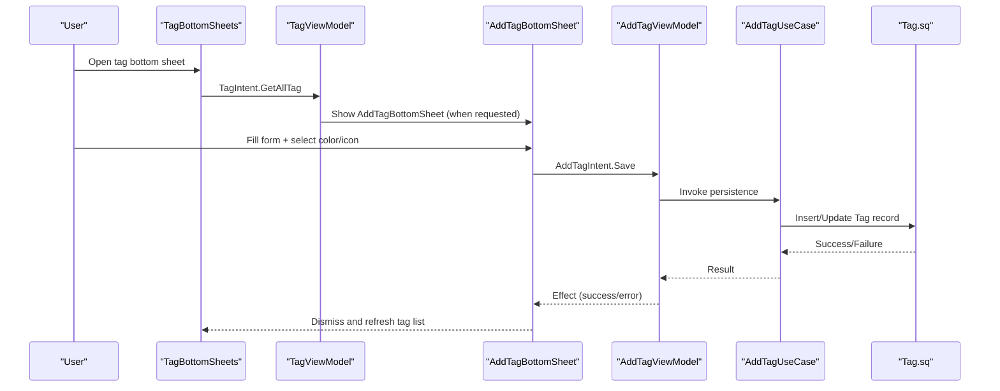
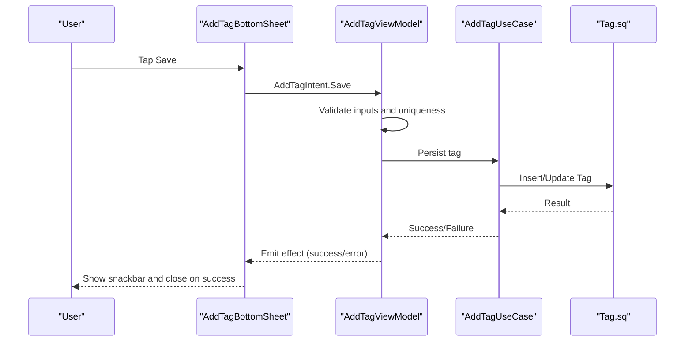
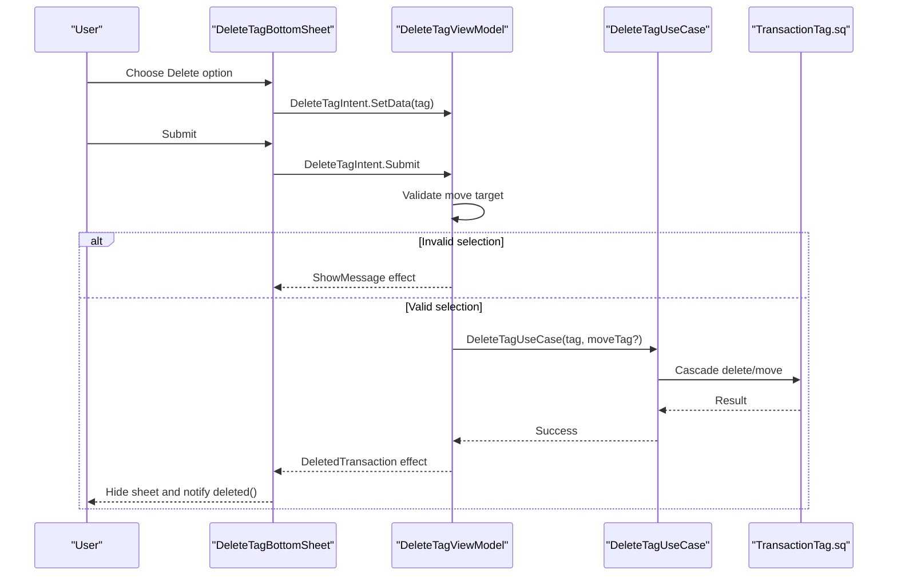
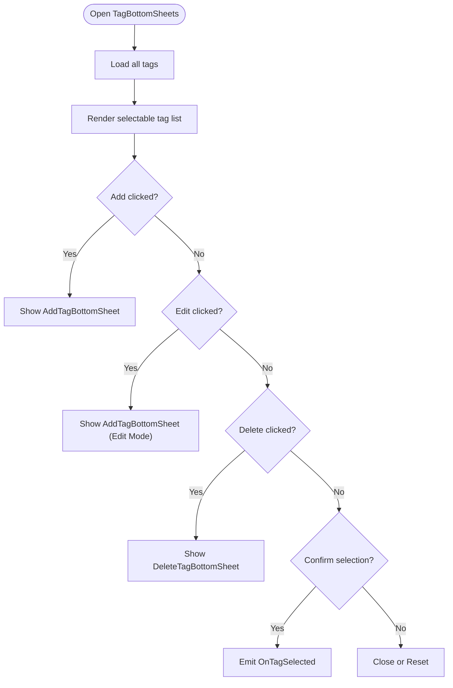
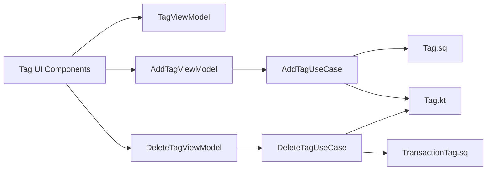

# Tag CRUD Operations

<cite>
**Referenced Files in This Document**
- [TagBottomSheets.kt](file://feature-share/tags/src/commonMain/kotlin/com/kazemieh/tag/ui/list/TagBottomSheets.kt)
- [TagFilterSelectionContent.kt](file://feature-share/tags/src/commonMain/kotlin/com/kazemieh/tag/ui/list/TagFilterSelectionContent.kt)
- [TagViewModel.kt](file://feature-share/tags/src/commonMain/kotlin/com/kazemieh/tag/ui/list/TagViewModel.kt)
- [AddTagBottomSheet.kt](file://feature-share/tags/src/commonMain/kotlin/com/kazemieh/tag/ui/add/AddTagBottomSheet.kt)
- [AddTagViewModel.kt](file://feature-share/tags/src/commonMain/kotlin/com/kazemieh/tag/ui/add/AddTagViewModel.kt)
- [DeleteTagBottomSheet.kt](file://feature-share/tags/src/commonMain/kotlin/com/kazemieh/tag/ui/delete/DeleteTagBottomSheet.kt)
- [DeleteTagViewModel.kt](file://feature-share/tags/src/commonMain/kotlin/com/kazemieh/tag/ui/delete/DeleteTagViewModel.kt)
- [Tag.kt](file://core/common/src/commonMain/kotlin/com/kazemieh/common/model/Tag.kt)
- [AddTagUseCase.kt](file://core/domain/src/commonMain/kotlin/com/kazemieh/domain/usecase/AddTagUseCase.kt)
- [DeleteTagUseCase.kt](file://core/domain/src/commonMain/kotlin/com/kazemieh/domain/usecase/DeleteTagUseCase.kt)
- [Tag.sq](file://core/database/src/commonMain/kotlin/com/kazemieh/database/sqldelight/Tag.sq)
- [TransactionTag.sq](file://core/database/src/commonMain/kotlin/com/kazemieh/database/sqldelight/TransactionTag.sq)
</cite>

## Table of Contents
1. [Introduction](#introduction)
2. [Project Structure](#project-structure)
3. [Core Components](#core-components)
4. [Architecture Overview](#architecture-overview)
5. [Detailed Component Analysis](#detailed-component-analysis)
6. [Dependency Analysis](#dependency-analysis)
7. [Performance Considerations](#performance-considerations)
8. [Troubleshooting Guide](#troubleshooting-guide)
9. [Conclusion](#conclusion)

## Introduction
This document provides comprehensive documentation for the tag CRUD (Create, Read, Update, Delete) operations in the FinTrack application. It focuses on the user interface components responsible for managing tags, including the AddTagBottomSheet and DeleteTagBottomSheet, along with their corresponding ViewModels. The documentation covers form validation, uniqueness constraints, error handling, state management patterns, and the end-to-end workflows from user input to database persistence. It also explains the deletion confirmation process, cascade effects on associated transactions, and undo mechanisms. Edge cases such as duplicate names, empty inputs, and system tag protection are addressed, alongside bottom sheet animation patterns and user interaction flows.

## Project Structure
The tag management system is organized into three primary UI modules and supporting domain/data layers:
- List UI: TagBottomSheets and TagFilterSelectionContent orchestrate tag selection, editing, and deletion via bottom sheets.
- Add UI: AddTagBottomSheet and AddTagViewModel handle tag creation/editing with validation and persistence.
- Delete UI: DeleteTagBottomSheet and DeleteTagViewModel manage deletion confirmation and cascading actions.

**Diagram sources**
- [TagBottomSheets.kt:53-161](file://feature-share/tags/src/commonMain/kotlin/com/kazemieh/tag/ui/list/TagBottomSheets.kt#L53-L161)
- [TagFilterSelectionContent.kt:100-130](file://feature-share/tags/src/commonMain/kotlin/com/kazemieh/tag/ui/list/TagFilterSelectionContent.kt#L100-L130)
- [AddTagBottomSheet.kt:55-120](file://feature-share/tags/src/commonMain/kotlin/com/kazemieh/tag/ui/add/AddTagBottomSheet.kt#L55-L120)
- [DeleteTagBottomSheet.kt:22-74](file://feature-share/tags/src/commonMain/kotlin/com/kazemieh/tag/ui/delete/DeleteTagBottomSheet.kt#L22-L74)
- [TagViewModel.kt:36-172](file://feature-share/tags/src/commonMain/kotlin/com/kazemieh/tag/ui/list/TagViewModel.kt#L36-L172)
- [AddTagViewModel.kt:34-76](file://feature-share/tags/src/commonMain/kotlin/com/kazemieh/tag/ui/add/AddTagViewModel.kt#L34-L76)
- [DeleteTagViewModel.kt:19-79](file://feature-share/tags/src/commonMain/kotlin/com/kazemieh/tag/ui/delete/DeleteTagViewModel.kt#L19-L79)
- [AddTagUseCase.kt](file://core/domain/src/commonMain/kotlin/com/kazemieh/domain/usecase/AddTagUseCase.kt)
- [DeleteTagUseCase.kt](file://core/domain/src/commonMain/kotlin/com/kazemieh/domain/usecase/DeleteTagUseCase.kt)
- [Tag.kt](file://core/common/src/commonMain/kotlin/com/kazemieh/common/model/Tag.kt)
- [Tag.sq](file://core/database/src/commonMain/kotlin/com/kazemieh/database/sqldelight/Tag.sq)
- [TransactionTag.sq](file://core/database/src/commonMain/kotlin/com/kazemieh/database/sqldelight/TransactionTag.sq)

**Section sources**
- [TagBottomSheets.kt:53-161](file://feature-share/tags/src/commonMain/kotlin/com/kazemieh/tag/ui/list/TagBottomSheets.kt#L53-L161)
- [TagFilterSelectionContent.kt:100-130](file://feature-share/tags/src/commonMain/kotlin/com/kazemieh/tag/ui/list/TagFilterSelectionContent.kt#L100-L130)
- [TagViewModel.kt:36-172](file://feature-share/tags/src/commonMain/kotlin/com/kazemieh/tag/ui/list/TagViewModel.kt#L36-L172)

## Core Components
This section outlines the primary components involved in tag CRUD operations and their responsibilities.

- TagBottomSheets: Presents a bottom sheet for selecting, adding, editing, and deleting tags. It manages state for visibility flags, selected tags, and delegates actions to child bottom sheets.
- AddTagBottomSheet: Provides a form for creating or editing tags with color/icon selection and validation feedback.
- DeleteTagBottomSheet: Handles deletion confirmation and offers options to delete all associated transactions or move them to another tag.
- TagViewModel: Manages tag list state, selection, search, reorder mode, and emits effects for dismissal and selection.
- AddTagViewModel: Manages tag creation/editing state, draft updates, picker interactions, and triggers persistence via use cases.
- DeleteTagViewModel: Manages deletion state, validation for move target selection, and emits effects for UI updates and dismissal.

**Section sources**
- [TagBottomSheets.kt:53-161](file://feature-share/tags/src/commonMain/kotlin/com/kazemieh/tag/ui/list/TagBottomSheets.kt#L53-L161)
- [AddTagBottomSheet.kt:55-120](file://feature-share/tags/src/commonMain/kotlin/com/kazemieh/tag/ui/add/AddTagBottomSheet.kt#L55-L120)
- [DeleteTagBottomSheet.kt:22-74](file://feature-share/tags/src/commonMain/kotlin/com/kazemieh/tag/ui/delete/DeleteTagBottomSheet.kt#L22-L74)
- [TagViewModel.kt:36-172](file://feature-share/tags/src/commonMain/kotlin/com/kazemieh/tag/ui/list/TagViewModel.kt#L36-L172)
- [AddTagViewModel.kt:34-76](file://feature-share/tags/src/commonMain/kotlin/com/kazemieh/tag/ui/add/AddTagViewModel.kt#L34-L76)
- [DeleteTagViewModel.kt:19-79](file://feature-share/tags/src/commonMain/kotlin/com/kazemieh/tag/ui/delete/DeleteTagViewModel.kt#L19-L79)

## Architecture Overview
The tag CRUD architecture follows a unidirectional data flow:
- UI components emit intents to ViewModels.
- ViewModels update state and trigger use cases.
- Use cases coordinate with repositories and databases.
- Effects are emitted to drive UI reactions (snackbar messages, navigation, dismissal).

**Diagram sources**
- [TagBottomSheets.kt:53-161](file://feature-share/tags/src/commonMain/kotlin/com/kazemieh/tag/ui/list/TagBottomSheets.kt#L53-L161)
- [TagViewModel.kt:36-172](file://feature-share/tags/src/commonMain/kotlin/com/kazemieh/tag/ui/list/TagViewModel.kt#L36-L172)
- [AddTagBottomSheet.kt:55-120](file://feature-share/tags/src/commonMain/kotlin/com/kazemieh/tag/ui/add/AddTagBottomSheet.kt#L55-L120)
- [AddTagViewModel.kt:34-76](file://feature-share/tags/src/commonMain/kotlin/com/kazemieh/tag/ui/add/AddTagViewModel.kt#L34-L76)
- [AddTagUseCase.kt](file://core/domain/src/commonMain/kotlin/com/kazemieh/domain/usecase/AddTagUseCase.kt)
- [Tag.sq](file://core/database/src/commonMain/kotlin/com/kazemieh/database/sqldelight/Tag.sq)

## Detailed Component Analysis

### AddTagBottomSheet and AddTagViewModel
The AddTagBottomSheet provides a form for creating or editing tags with:
- Name and description fields
- Color and icon picker integration
- Validation feedback and error messaging
- Loading states during save operations

Key behaviors:
- Form validation ensures non-empty inputs and enforces uniqueness constraints.
- Picker interactions update the draft colorId and iconId.
- Save triggers persistence via AddTagUseCase and emits success/error effects.
- Edit mode preloads existing tag data into the draft.

**Diagram sources**
- [AddTagBottomSheet.kt:55-120](file://feature-share/tags/src/commonMain/kotlin/com/kazemieh/tag/ui/add/AddTagBottomSheet.kt#L55-L120)
- [AddTagViewModel.kt:34-76](file://feature-share/tags/src/commonMain/kotlin/com/kazemieh/tag/ui/add/AddTagViewModel.kt#L34-L76)
- [AddTagUseCase.kt](file://core/domain/src/commonMain/kotlin/com/kazemieh/domain/usecase/AddTagUseCase.kt)
- [Tag.sq](file://core/database/src/commonMain/kotlin/com/kazemieh/database/sqldelight/Tag.sq)

Validation and constraints:
- Empty name/description: Prevent save until valid.
- Duplicate name: Enforce uniqueness against existing tags.
- Color/icon selection: Required before saving.

State management:
- Draft holds transient form data.
- Picker open/close toggles UI state.
- Loading and error flags control UI feedback.

Integration with tag list:
- On success, the bottom sheet closes and the parent tag list refreshes.

**Section sources**
- [AddTagBottomSheet.kt:55-120](file://feature-share/tags/src/commonMain/kotlin/com/kazemieh/tag/ui/add/AddTagBottomSheet.kt#L55-L120)
- [AddTagViewModel.kt:34-76](file://feature-share/tags/src/commonMain/kotlin/com/kazemieh/tag/ui/add/AddTagViewModel.kt#L34-L76)
- [TagViewModel.kt:36-172](file://feature-share/tags/src/commonMain/kotlin/com/kazemieh/tag/ui/list/TagViewModel.kt#L36-L172)

### DeleteTagBottomSheet and DeleteTagViewModel
The DeleteTagBottomSheet handles deletion confirmation and cascade options:
- Delete all associated transactions
- Move transactions to another tag
- Validation prevents deletion without a move target when required

Workflow:
- User selects a tag to delete.
- Bottom sheet opens with options.
- Submit validates selection; if invalid, shows a snackbar message.
- On valid submission, DeleteTagUseCase performs deletion/move and emits an effect.
- UI hides the sheet and notifies completion.

**Diagram sources**
- [DeleteTagBottomSheet.kt:22-74](file://feature-share/tags/src/commonMain/kotlin/com/kazemieh/tag/ui/delete/DeleteTagBottomSheet.kt#L22-L74)
- [DeleteTagViewModel.kt:19-79](file://feature-share/tags/src/commonMain/kotlin/com/kazemieh/tag/ui/delete/DeleteTagViewModel.kt#L19-L79)
- [DeleteTagUseCase.kt](file://core/domain/src/commonMain/kotlin/com/kazemieh/domain/usecase/DeleteTagUseCase.kt)
- [TransactionTag.sq](file://core/database/src/commonMain/kotlin/com/kazemieh/database/sqldelight/TransactionTag.sq)

Validation and constraints:
- If not deleting all transactions, a move target must be selected.
- Error state triggers a snackbar message prompting selection.

Effects and UI reactions:
- DeletedTransaction effect triggers sheet hide and completion callback.
- ShowMessage effect displays user-friendly error messages.

**Section sources**
- [DeleteTagBottomSheet.kt:22-74](file://feature-share/tags/src/commonMain/kotlin/com/kazemieh/tag/ui/delete/DeleteTagBottomSheet.kt#L22-L74)
- [DeleteTagViewModel.kt:19-79](file://feature-share/tags/src/commonMain/kotlin/com/kazemieh/tag/ui/delete/DeleteTagViewModel.kt#L19-L79)

### Tag List Interaction and Selection
The TagBottomSheets component integrates tag selection, edit, and delete actions:
- Displays a selectable row of tags with initial selection support.
- Triggers AddTagBottomSheet for new tags.
- Triggers DeleteTagBottomSheet for existing tags.
- Emits effects for dismissal and individual tag selection.

**Diagram sources**
- [TagBottomSheets.kt:53-161](file://feature-share/tags/src/commonMain/kotlin/com/kazemieh/tag/ui/list/TagBottomSheets.kt#L53-L161)
- [TagViewModel.kt:36-172](file://feature-share/tags/src/commonMain/kotlin/com/kazemieh/tag/ui/list/TagViewModel.kt#L36-L172)

**Section sources**
- [TagBottomSheets.kt:53-161](file://feature-share/tags/src/commonMain/kotlin/com/kazemieh/tag/ui/list/TagBottomSheets.kt#L53-L161)
- [TagFilterSelectionContent.kt:100-130](file://feature-share/tags/src/commonMain/kotlin/com/kazemieh/tag/ui/list/TagFilterSelectionContent.kt#L100-L130)
- [TagViewModel.kt:36-172](file://feature-share/tags/src/commonMain/kotlin/com/kazemieh/tag/ui/list/TagViewModel.kt#L36-L172)

## Dependency Analysis
The tag CRUD system exhibits clear separation of concerns:
- UI depends on ViewModels for state and effects.
- ViewModels depend on use cases for business logic.
- Use cases depend on domain repositories and database mappings.
- Database mappings define Tag and TransactionTag schemas.

**Diagram sources**
- [TagViewModel.kt:36-172](file://feature-share/tags/src/commonMain/kotlin/com/kazemieh/tag/ui/list/TagViewModel.kt#L36-L172)
- [AddTagViewModel.kt:34-76](file://feature-share/tags/src/commonMain/kotlin/com/kazemieh/tag/ui/add/AddTagViewModel.kt#L34-L76)
- [DeleteTagViewModel.kt:19-79](file://feature-share/tags/src/commonMain/kotlin/com/kazemieh/tag/ui/delete/DeleteTagViewModel.kt#L19-L79)
- [AddTagUseCase.kt](file://core/domain/src/commonMain/kotlin/com/kazemieh/domain/usecase/AddTagUseCase.kt)
- [DeleteTagUseCase.kt](file://core/domain/src/commonMain/kotlin/com/kazemieh/domain/usecase/DeleteTagUseCase.kt)
- [Tag.kt](file://core/common/src/commonMain/kotlin/com/kazemieh/common/model/Tag.kt)
- [Tag.sq](file://core/database/src/commonMain/kotlin/com/kazemieh/database/sqldelight/Tag.sq)
- [TransactionTag.sq](file://core/database/src/commonMain/kotlin/com/kazemieh/database/sqldelight/TransactionTag.sq)

**Section sources**
- [TagViewModel.kt:36-172](file://feature-share/tags/src/commonMain/kotlin/com/kazemieh/tag/ui/list/TagViewModel.kt#L36-L172)
- [AddTagViewModel.kt:34-76](file://feature-share/tags/src/commonMain/kotlin/com/kazemieh/tag/ui/add/AddTagViewModel.kt#L34-L76)
- [DeleteTagViewModel.kt:19-79](file://feature-share/tags/src/commonMain/kotlin/com/kazemieh/tag/ui/delete/DeleteTagViewModel.kt#L19-L79)

## Performance Considerations
- Reactive state updates: Using StateFlow and collectAsState minimizes unnecessary recompositions.
- Single source of truth: ViewModels centralize state transitions, reducing UI-side duplication.
- Deferred loading: Tags are fetched on demand to avoid heavy initialization.
- Batch operations: Reorder and position updates are batched via UpdatePositions intent.

## Troubleshooting Guide
Common issues and resolutions:
- Duplicate tag names: Validation prevents saving duplicates; ensure uniqueness before submit.
- Empty inputs: Disable submit until name is provided.
- No move target selected: When not deleting all transactions, require a destination tag selection; UI shows a snackbar prompt.
- Bottom sheet not dismissing: Ensure effects are handled and sheetState visibility is managed.

**Section sources**
- [AddTagViewModel.kt:34-76](file://feature-share/tags/src/commonMain/kotlin/com/kazemieh/tag/ui/add/AddTagViewModel.kt#L34-L76)
- [DeleteTagViewModel.kt:19-79](file://feature-share/tags/src/commonMain/kotlin/com/kazemieh/tag/ui/delete/DeleteTagViewModel.kt#L19-L79)
- [DeleteTagBottomSheet.kt:22-74](file://feature-share/tags/src/commonMain/kotlin/com/kazemieh/tag/ui/delete/DeleteTagBottomSheet.kt#L22-L74)

## Conclusion
The tag CRUD system provides a cohesive, reactive, and user-friendly experience for managing tags. The AddTagBottomSheet and DeleteTagBottomSheet, backed by robust ViewModels and use cases, enforce validation, handle cascading effects, and deliver responsive UI feedback. The architecture supports scalability and maintainability while ensuring data integrity through database mappings and domain use cases.