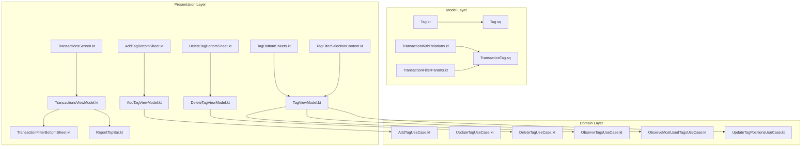
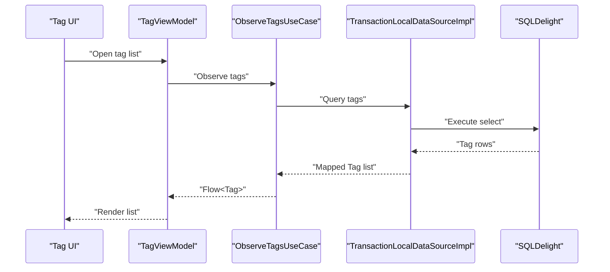
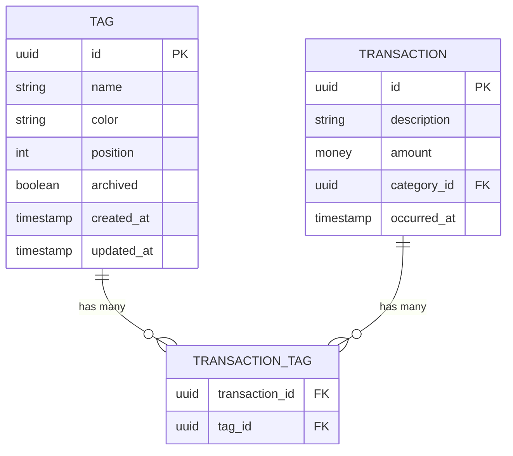
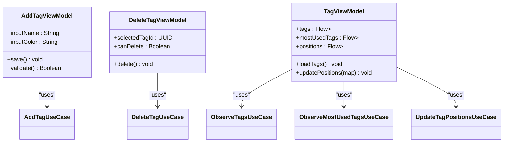
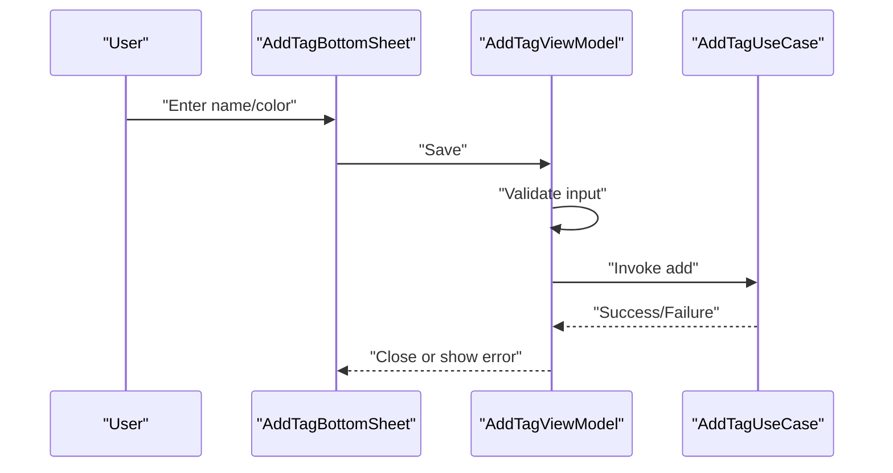
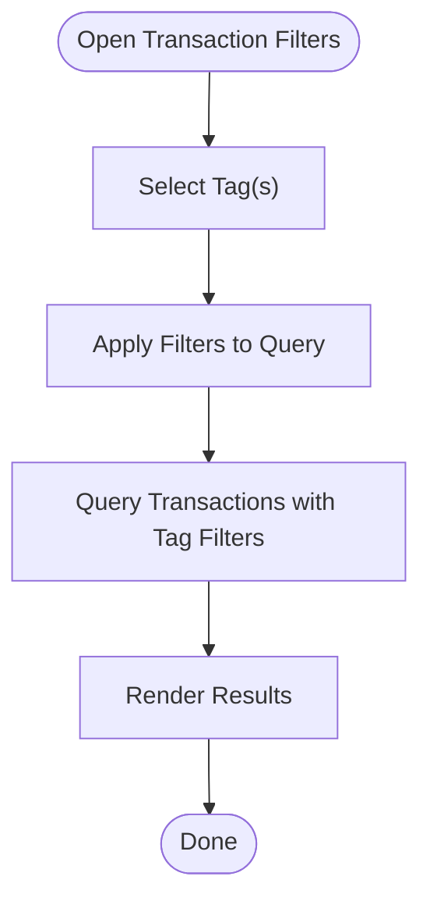
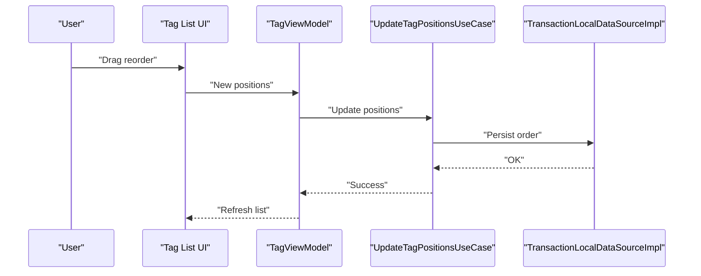
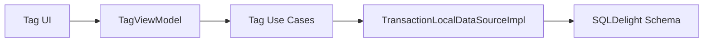

# Tags Management

<cite>
**Referenced Files in This Document**
- [Tag.kt](file://core/common/src/commonMain/kotlin/com/kazemieh/common/model/Tag.kt)
- [Transaction.kt](file://core/common/src/commonMain/kotlin/com/kazemieh/common/model/Transaction.kt)
- [TransactionWithRelations.kt](file://core/common/src/commonMain/kotlin/com/kazemieh/common/model/TransactionWithRelations.kt)
- [TransactionFilterParams.kt](file://core/common/src/commonMain/kotlin/com/kazemieh/common/model/TransactionFilterParams.kt)
- [TransactionTag.sq](file://core/database/src/sqldelight/com/kazemieh/database/TransactionTag.sq)
- [Tag.sq](file://core/database/src/sqldelight/com/kazemieh/database/Tag.sq)
- [TransactionLocalDataSourceImpl.kt](file://core/database/src/commonMain/kotlin/com/kazemieh/database/datasource/TransactionLocalDataSourceImpl.kt)
- [Mappers.kt](file://core/database/src/commonMain/kotlin/com/kazemieh/database/mapper/Mappers.kt)
- [AddTagUseCase.kt](file://core/domain/src/commonMain/kotlin/com/kazemieh/domain/usecase/AddTagUseCase.kt)
- [UpdateTagUseCase.kt](file://core/domain/src/commonMain/kotlin/com/kazemieh/domain/usecase/UpdateTagUseCase.kt)
- [DeleteTagUseCase.kt](file://core/domain/src/commonMain/kotlin/com/kazemieh/domain/usecase/DeleteTagUseCase.kt)
- [ObserveTagsUseCase.kt](file://core/domain/src/commonMain/kotlin/com/kazemieh/domain/usecase/ObserveTagsUseCase.kt)
- [ObserveMostUsedTagsUseCase.kt](file://core/domain/src/commonMain/kotlin/com/kazemieh/domain/usecase/ObserveMostUsedTagsUseCase.kt)
- [UpdateTagPositionsUseCase.kt](file://core/domain/src/commonMain/kotlin/com/kazemieh/domain/usecase/UpdateTagPositionsUseCase.kt)
- [TransactionTagModule.kt](file://feature-share/tags/src/commonMain/kotlin/com/kazemieh/tag/di/TransactionTagModule.kt)
- [AddTagBottomSheet.kt](file://feature-share/tags/src/commonMain/kotlin/com/kazemieh/tag/ui/add/AddTagBottomSheet.kt)
- [AddTagViewModel.kt](file://feature-share/tags/src/commonMain/kotlin/com/kazemieh/tag/ui/add/AddTagViewModel.kt)
- [DeleteTagBottomSheet.kt](file://feature-share/tags/src/commonMain/kotlin/com/kazemieh/tag/ui/delete/DeleteTagBottomSheet.kt)
- [DeleteTagViewModel.kt](file://feature-share/tags/src/commonMain/kotlin/com/kazemieh/tag/ui/delete/DeleteTagViewModel.kt)
- [TagBottomSheets.kt](file://feature-share/tags/src/commonMain/kotlin/com/kazemieh/tag/ui/list/TagBottomSheets.kt)
- [TagFilterSelectionContent.kt](file://feature-share/tags/src/commonMain/kotlin/com/kazemieh/tag/ui/list/TagFilterSelectionContent.kt)
- [TagViewModel.kt](file://feature-share/tags/src/commonMain/kotlin/com/kazemieh/tag/ui/list/TagViewModel.kt)
- [TransactionsScreen.kt](file://feature-container/transactions/src/commonMain/kotlin/com/kazemieh/transactions/TransactionsScreen.kt)
- [TransactionsViewModel.kt](file://feature-container/transactions/src/commonMain/kotlin/com/kazemieh/transactions/TransactionsViewModel.kt)
- [TransactionFilterBottomSheet.kt](file://feature-container/transactions/src/commonMain/kotlin/com/kazemieh/transactions/TransactionFilterBottomSheet.kt)
- [ReportTopBar.kt](file://feature-container/transactions/src/commonMain/kotlin/com/kazemieh/transactions/ReportTopBar.kt)
- [TransactionTagModule.kt](file://feature-container/transactions/src/commonMain/kotlin/com/kazemieh/transactions/di/di.kt)
</cite>

## Table of Contents
1. [Introduction](#introduction)
2. [Project Structure](#project-structure)
3. [Core Components](#core-components)
4. [Architecture Overview](#architecture-overview)
5. [Detailed Component Analysis](#detailed-component-analysis)
6. [Dependency Analysis](#dependency-analysis)
7. [Performance Considerations](#performance-considerations)
8. [Troubleshooting Guide](#troubleshooting-guide)
9. [Conclusion](#conclusion)

## Introduction
This document describes the tags management shared feature module responsible for categorizing transactions beyond categories. It covers the tagging model, CRUD operations, bottom-sheet UIs for add/edit/delete, tag filter selection, integration with transaction filtering/reporting, tag associations via a many-to-many relationship, and cross-platform DI wiring. It also documents state management, reactive updates, validation and uniqueness constraints, and operational concerns such as tag conflicts and orphaned tags.

## Project Structure
The tags feature spans three layers:
- Model and persistence: Tag entity, SQLDelight tables, and mappers
- Domain: Use cases for tag CRUD and observation
- Presentation: Compose UIs for tag management and integration with transaction screens

**Diagram sources**
- [Tag.kt:1-200](file://core/common/src/commonMain/kotlin/com/kazemieh/common/model/Tag.kt#L1-L200)
- [TransactionWithRelations.kt:1-200](file://core/common/src/commonMain/kotlin/com/kazemieh/common/model/TransactionWithRelations.kt#L1-L200)
- [TransactionFilterParams.kt:1-200](file://core/common/src/commonMain/kotlin/com/kazemieh/common/model/TransactionFilterParams.kt#L1-L200)
- [Tag.sq:1-200](file://core/database/src/sqldelight/com/kazemieh/database/Tag.sq#L1-L200)
- [TransactionTag.sq:1-200](file://core/database/src/sqldelight/com/kazemieh/database/TransactionTag.sq#L1-L200)
- [AddTagUseCase.kt:1-200](file://core/domain/src/commonMain/kotlin/com/kazemieh/domain/usecase/AddTagUseCase.kt#L1-L200)
- [UpdateTagUseCase.kt:1-200](file://core/domain/src/commonMain/kotlin/com/kazemieh/domain/usecase/UpdateTagUseCase.kt#L1-L200)
- [DeleteTagUseCase.kt:1-200](file://core/domain/src/commonMain/kotlin/com/kazemieh/domain/usecase/DeleteTagUseCase.kt#L1-L200)
- [ObserveTagsUseCase.kt:1-200](file://core/domain/src/commonMain/kotlin/com/kazemieh/domain/usecase/ObserveTagsUseCase.kt#L1-L200)
- [ObserveMostUsedTagsUseCase.kt:1-200](file://core/domain/src/commonMain/kotlin/com/kazemieh/domain/usecase/ObserveMostUsedTagsUseCase.kt#L1-L200)
- [UpdateTagPositionsUseCase.kt:1-200](file://core/domain/src/commonMain/kotlin/com/kazemieh/domain/usecase/UpdateTagPositionsUseCase.kt#L1-L200)
- [AddTagBottomSheet.kt:1-200](file://feature-share/tags/src/commonMain/kotlin/com/kazemieh/tag/ui/add/AddTagBottomSheet.kt#L1-L200)
- [AddTagViewModel.kt:1-200](file://feature-share/tags/src/commonMain/kotlin/com/kazemieh/tag/ui/add/AddTagViewModel.kt#L1-L200)
- [DeleteTagBottomSheet.kt:1-200](file://feature-share/tags/src/commonMain/kotlin/com/kazemieh/tag/ui/delete/DeleteTagBottomSheet.kt#L1-L200)
- [DeleteTagViewModel.kt:1-200](file://feature-share/tags/src/commonMain/kotlin/com/kazemieh/tag/ui/delete/DeleteTagViewModel.kt#L1-L200)
- [TagBottomSheets.kt:1-200](file://feature-share/tags/src/commonMain/kotlin/com/kazemieh/tag/ui/list/TagBottomSheets.kt#L1-L200)
- [TagFilterSelectionContent.kt:1-200](file://feature-share/tags/src/commonMain/kotlin/com/kazemieh/tag/ui/list/TagFilterSelectionContent.kt#L1-L200)
- [TagViewModel.kt:1-200](file://feature-share/tags/src/commonMain/kotlin/com/kazemieh/tag/ui/list/TagViewModel.kt#L1-L200)
- [TransactionsScreen.kt:1-200](file://feature-container/transactions/src/commonMain/kotlin/com/kazemieh/transactions/TransactionsScreen.kt#L1-L200)
- [TransactionsViewModel.kt:1-200](file://feature-container/transactions/src/commonMain/kotlin/com/kazemieh/transactions/TransactionsViewModel.kt#L1-L200)
- [TransactionFilterBottomSheet.kt:1-200](file://feature-container/transactions/src/commonMain/kotlin/com/kazemieh/transactions/TransactionFilterBottomSheet.kt#L1-L200)
- [ReportTopBar.kt:1-200](file://feature-container/transactions/src/commonMain/kotlin/com/kazemieh/transactions/ReportTopBar.kt#L1-L200)

**Section sources**
- [Tag.kt:1-200](file://core/common/src/commonMain/kotlin/com/kazemieh/common/model/Tag.kt#L1-L200)
- [TransactionTag.sq:1-200](file://core/database/src/sqldelight/com/kazemieh/database/TransactionTag.sq#L1-L200)
- [TransactionTagModule.kt:1-200](file://feature-share/tags/src/commonMain/kotlin/com/kazemieh/tag/di/TransactionTagModule.kt#L1-L200)

## Core Components
- Tag model: Defines tag identity, attributes, and metadata used across platforms.
- Many-to-many association: Transactions can have zero or more tags via a join table.
- Use cases: CRUD and observation for tags, including position updates.
- Presentation: Bottom sheets for add/edit/delete, tag list/filter UI, and integration with transaction screens.

Key implementation references:
- Tag entity definition and relations: [Tag.kt:1-200](file://core/common/src/commonMain/kotlin/com/kazemieh/common/model/Tag.kt#L1-L200), [TransactionWithRelations.kt:1-200](file://core/common/src/commonMain/kotlin/com/kazemieh/common/model/TransactionWithRelations.kt#L1-L200)
- Persistence schema: [Tag.sq:1-200](file://core/database/src/sqldelight/com/kazemieh/database/Tag.sq#L1-L200), [TransactionTag.sq:1-200](file://core/database/src/sqldelight/com/kazemieh/database/TransactionTag.sq#L1-L200)
- Domain use cases: [AddTagUseCase.kt:1-200](file://core/domain/src/commonMain/kotlin/com/kazemieh/domain/usecase/AddTagUseCase.kt#L1-L200), [UpdateTagUseCase.kt:1-200](file://core/domain/src/commonMain/kotlin/com/kazemieh/domain/usecase/UpdateTagUseCase.kt#L1-L200), [DeleteTagUseCase.kt:1-200](file://core/domain/src/commonMain/kotlin/com/kazemieh/domain/usecase/DeleteTagUseCase.kt#L1-L200), [ObserveTagsUseCase.kt:1-200](file://core/domain/src/commonMain/kotlin/com/kazemieh/domain/usecase/ObserveTagsUseCase.kt#L1-L200), [ObserveMostUsedTagsUseCase.kt:1-200](file://core/domain/src/commonMain/kotlin/com/kazemieh/domain/usecase/ObserveMostUsedTagsUseCase.kt#L1-L200), [UpdateTagPositionsUseCase.kt:1-200](file://core/domain/src/commonMain/kotlin/com/kazemieh/domain/usecase/UpdateTagPositionsUseCase.kt#L1-L200)
- Presentation layer: [AddTagBottomSheet.kt:1-200](file://feature-share/tags/src/commonMain/kotlin/com/kazemieh/tag/ui/add/AddTagBottomSheet.kt#L1-L200), [AddTagViewModel.kt:1-200](file://feature-share/tags/src/commonMain/kotlin/com/kazemieh/tag/ui/add/AddTagViewModel.kt#L1-L200), [DeleteTagBottomSheet.kt:1-200](file://feature-share/tags/src/commonMain/kotlin/com/kazemieh/tag/ui/delete/DeleteTagBottomSheet.kt#L1-L200), [DeleteTagViewModel.kt:1-200](file://feature-share/tags/src/commonMain/kotlin/com/kazemieh/tag/ui/delete/DeleteTagViewModel.kt#L1-L200), [TagBottomSheets.kt:1-200](file://feature-share/tags/src/commonMain/kotlin/com/kazemieh/tag/ui/list/TagBottomSheets.kt#L1-L200), [TagFilterSelectionContent.kt:1-200](file://feature-share/tags/src/commonMain/kotlin/com/kazemieh/tag/ui/list/TagFilterSelectionContent.kt#L1-L200), [TagViewModel.kt:1-200](file://feature-share/tags/src/commonMain/kotlin/com/kazemieh/tag/ui/list/TagViewModel.kt#L1-L200)
- Transaction integration: [TransactionsScreen.kt:1-200](file://feature-container/transactions/src/commonMain/kotlin/com/kazemieh/transactions/TransactionsScreen.kt#L1-L200), [TransactionsViewModel.kt:1-200](file://feature-container/transactions/src/commonMain/kotlin/com/kazemieh/transactions/TransactionsViewModel.kt#L1-L200), [TransactionFilterBottomSheet.kt:1-200](file://feature-container/transactions/src/commonMain/kotlin/com/kazemieh/transactions/TransactionFilterBottomSheet.kt#L1-L200), [ReportTopBar.kt:1-200](file://feature-container/transactions/src/commonMain/kotlin/com/kazemieh/transactions/ReportTopBar.kt#L1-L200)

**Section sources**
- [Tag.kt:1-200](file://core/common/src/commonMain/kotlin/com/kazemieh/common/model/Tag.kt#L1-L200)
- [TransactionWithRelations.kt:1-200](file://core/common/src/commonMain/kotlin/com/kazemieh/common/model/TransactionWithRelations.kt#L1-L200)
- [TransactionTag.sq:1-200](file://core/database/src/sqldelight/com/kazemieh/database/TransactionTag.sq#L1-L200)
- [Tag.sq:1-200](file://core/database/src/sqldelight/com/kazemieh/database/Tag.sq#L1-L200)
- [AddTagUseCase.kt:1-200](file://core/domain/src/commonMain/kotlin/com/kazemieh/domain/usecase/AddTagUseCase.kt#L1-L200)
- [UpdateTagUseCase.kt:1-200](file://core/domain/src/commonMain/kotlin/com/kazemieh/domain/usecase/UpdateTagUseCase.kt#L1-L200)
- [DeleteTagUseCase.kt:1-200](file://core/domain/src/commonMain/kotlin/com/kazemieh/domain/usecase/DeleteTagUseCase.kt#L1-L200)
- [ObserveTagsUseCase.kt:1-200](file://core/domain/src/commonMain/kotlin/com/kazemieh/domain/usecase/ObserveTagsUseCase.kt#L1-L200)
- [ObserveMostUsedTagsUseCase.kt:1-200](file://core/domain/src/commonMain/kotlin/com/kazemieh/domain/usecase/ObserveMostUsedTagsUseCase.kt#L1-L200)
- [UpdateTagPositionsUseCase.kt:1-200](file://core/domain/src/commonMain/kotlin/com/kazemieh/domain/usecase/UpdateTagPositionsUseCase.kt#L1-L200)
- [AddTagBottomSheet.kt:1-200](file://feature-share/tags/src/commonMain/kotlin/com/kazemieh/tag/ui/add/AddTagBottomSheet.kt#L1-L200)
- [AddTagViewModel.kt:1-200](file://feature-share/tags/src/commonMain/kotlin/com/kazemieh/tag/ui/add/AddTagViewModel.kt#L1-L200)
- [DeleteTagBottomSheet.kt:1-200](file://feature-share/tags/src/commonMain/kotlin/com/kazemieh/tag/ui/delete/DeleteTagBottomSheet.kt#L1-L200)
- [DeleteTagViewModel.kt:1-200](file://feature-share/tags/src/commonMain/kotlin/com/kazemieh/tag/ui/delete/DeleteTagViewModel.kt#L1-L200)
- [TagBottomSheets.kt:1-200](file://feature-share/tags/src/commonMain/kotlin/com/kazemieh/tag/ui/list/TagBottomSheets.kt#L1-L200)
- [TagFilterSelectionContent.kt:1-200](file://feature-share/tags/src/commonMain/kotlin/com/kazemieh/tag/ui/list/TagFilterSelectionContent.kt#L1-L200)
- [TagViewModel.kt:1-200](file://feature-share/tags/src/commonMain/kotlin/com/kazemieh/tag/ui/list/TagViewModel.kt#L1-L200)
- [TransactionsScreen.kt:1-200](file://feature-container/transactions/src/commonMain/kotlin/com/kazemieh/transactions/TransactionsScreen.kt#L1-L200)
- [TransactionsViewModel.kt:1-200](file://feature-container/transactions/src/commonMain/kotlin/com/kazemieh/transactions/TransactionsViewModel.kt#L1-L200)
- [TransactionFilterBottomSheet.kt:1-200](file://feature-container/transactions/src/commonMain/kotlin/com/kazemieh/transactions/TransactionFilterBottomSheet.kt#L1-L200)
- [ReportTopBar.kt:1-200](file://feature-container/transactions/src/commonMain/kotlin/com/kazemieh/transactions/ReportTopBar.kt#L1-L200)

## Architecture Overview
The tags feature follows a layered architecture:
- Data layer: SQLDelight models and mappers define the Tag entity and the TransactionTag join table.
- Domain layer: Use cases encapsulate tag CRUD and observation logic.
- Presentation layer: Compose UIs manage state and drive user interactions for tag creation, editing, deletion, and filtering.

**Diagram sources**
- [TagViewModel.kt:1-200](file://feature-share/tags/src/commonMain/kotlin/com/kazemieh/tag/ui/list/TagViewModel.kt#L1-L200)
- [ObserveTagsUseCase.kt:1-200](file://core/domain/src/commonMain/kotlin/com/kazemieh/domain/usecase/ObserveTagsUseCase.kt#L1-L200)
- [TransactionLocalDataSourceImpl.kt:1-200](file://core/database/src/commonMain/kotlin/com/kazemieh/database/datasource/TransactionLocalDataSourceImpl.kt#L1-L200)
- [Tag.sq:1-200](file://core/database/src/sqldelight/com/kazemieh/database/Tag.sq#L1-L200)

## Detailed Component Analysis

### Tag Model and Associations
- Tag entity: Represents a single tag with identity and attributes used across platforms.
- TransactionTag join table: Links transactions to tags, enabling many-to-many relationships.
- TransactionWithRelations: Provides enriched transaction data including associated tags.

**Diagram sources**
- [Tag.sq:1-200](file://core/database/src/sqldelight/com/kazemieh/database/Tag.sq#L1-L200)
- [TransactionTag.sq:1-200](file://core/database/src/sqldelight/com/kazemieh/database/TransactionTag.sq#L1-L200)
- [Tag.kt:1-200](file://core/common/src/commonMain/kotlin/com/kazemieh/common/model/Tag.kt#L1-L200)
- [TransactionWithRelations.kt:1-200](file://core/common/src/commonMain/kotlin/com/kazemieh/common/model/TransactionWithRelations.kt#L1-L200)

**Section sources**
- [Tag.sq:1-200](file://core/database/src/sqldelight/com/kazemieh/database/Tag.sq#L1-L200)
- [TransactionTag.sq:1-200](file://core/database/src/sqldelight/com/kazemieh/database/TransactionTag.sq#L1-L200)
- [Tag.kt:1-200](file://core/common/src/commonMain/kotlin/com/kazemieh/common/model/Tag.kt#L1-L200)
- [TransactionWithRelations.kt:1-200](file://core/common/src/commonMain/kotlin/com/kazemieh/common/model/TransactionWithRelations.kt#L1-L200)

### ViewModel Implementation for Tag CRUD Operations
- AddTagViewModel: Manages creation of new tags with validation and uniqueness checks.
- DeleteTagViewModel: Handles deletion with safety checks to prevent orphaning transactions.
- TagViewModel: Coordinates listing, filtering, and ordering of tags reactively.

**Diagram sources**
- [AddTagViewModel.kt:1-200](file://feature-share/tags/src/commonMain/kotlin/com/kazemieh/tag/ui/add/AddTagViewModel.kt#L1-L200)
- [DeleteTagViewModel.kt:1-200](file://feature-share/tags/src/commonMain/kotlin/com/kazemieh/tag/ui/delete/DeleteTagViewModel.kt#L1-L200)
- [TagViewModel.kt:1-200](file://feature-share/tags/src/commonMain/kotlin/com/kazemieh/tag/ui/list/TagViewModel.kt#L1-L200)
- [AddTagUseCase.kt:1-200](file://core/domain/src/commonMain/kotlin/com/kazemieh/domain/usecase/AddTagUseCase.kt#L1-L200)
- [DeleteTagUseCase.kt:1-200](file://core/domain/src/commonMain/kotlin/com/kazemieh/domain/usecase/DeleteTagUseCase.kt#L1-L200)
- [ObserveTagsUseCase.kt:1-200](file://core/domain/src/commonMain/kotlin/com/kazemieh/domain/usecase/ObserveTagsUseCase.kt#L1-L200)
- [ObserveMostUsedTagsUseCase.kt:1-200](file://core/domain/src/commonMain/kotlin/com/kazemieh/domain/usecase/ObserveMostUsedTagsUseCase.kt#L1-L200)
- [UpdateTagPositionsUseCase.kt:1-200](file://core/domain/src/commonMain/kotlin/com/kazemieh/domain/usecase/UpdateTagPositionsUseCase.kt#L1-L200)

**Section sources**
- [AddTagViewModel.kt:1-200](file://feature-share/tags/src/commonMain/kotlin/com/kazemieh/tag/ui/add/AddTagViewModel.kt#L1-L200)
- [DeleteTagViewModel.kt:1-200](file://feature-share/tags/src/commonMain/kotlin/com/kazemieh/tag/ui/delete/DeleteTagViewModel.kt#L1-L200)
- [TagViewModel.kt:1-200](file://feature-share/tags/src/commonMain/kotlin/com/kazemieh/tag/ui/list/TagViewModel.kt#L1-L200)
- [AddTagUseCase.kt:1-200](file://core/domain/src/commonMain/kotlin/com/kazemieh/domain/usecase/AddTagUseCase.kt#L1-L200)
- [DeleteTagUseCase.kt:1-200](file://core/domain/src/commonMain/kotlin/com/kazemieh/domain/usecase/DeleteTagUseCase.kt#L1-L200)
- [ObserveTagsUseCase.kt:1-200](file://core/domain/src/commonMain/kotlin/com/kazemieh/domain/usecase/ObserveTagsUseCase.kt#L1-L200)
- [ObserveMostUsedTagsUseCase.kt:1-200](file://core/domain/src/commonMain/kotlin/com/kazemieh/domain/usecase/ObserveMostUsedTagsUseCase.kt#L1-L200)
- [UpdateTagPositionsUseCase.kt:1-200](file://core/domain/src/commonMain/kotlin/com/kazemieh/domain/usecase/UpdateTagPositionsUseCase.kt#L1-L200)

### Bottom Sheet Interfaces for Tag Management
- AddTagBottomSheet: Presents form controls for name and color, triggers validation, and saves via AddTagViewModel.
- DeleteTagBottomSheet: Confirms deletion and invokes DeleteTagViewModel.
- TagBottomSheets: Hosts list UI and filter selection UI for tags.

**Diagram sources**
- [AddTagBottomSheet.kt:1-200](file://feature-share/tags/src/commonMain/kotlin/com/kazemieh/tag/ui/add/AddTagBottomSheet.kt#L1-L200)
- [AddTagViewModel.kt:1-200](file://feature-share/tags/src/commonMain/kotlin/com/kazemieh/tag/ui/add/AddTagViewModel.kt#L1-L200)
- [AddTagUseCase.kt:1-200](file://core/domain/src/commonMain/kotlin/com/kazemieh/domain/usecase/AddTagUseCase.kt#L1-L200)

**Section sources**
- [AddTagBottomSheet.kt:1-200](file://feature-share/tags/src/commonMain/kotlin/com/kazemieh/tag/ui/add/AddTagBottomSheet.kt#L1-L200)
- [AddTagViewModel.kt:1-200](file://feature-share/tags/src/commonMain/kotlin/com/kazemieh/tag/ui/add/AddTagViewModel.kt#L1-L200)
- [DeleteTagBottomSheet.kt:1-200](file://feature-share/tags/src/commonMain/kotlin/com/kazemieh/tag/ui/delete/DeleteTagBottomSheet.kt#L1-L200)
- [DeleteTagViewModel.kt:1-200](file://feature-share/tags/src/commonMain/kotlin/com/kazemieh/tag/ui/delete/DeleteTagViewModel.kt#L1-L200)
- [TagBottomSheets.kt:1-200](file://feature-share/tags/src/commonMain/kotlin/com/kazemieh/tag/ui/list/TagBottomSheets.kt#L1-L200)

### Tag Filter Selection and Transaction Integration
- TagFilterSelectionContent: Allows selecting one or more tags to filter transactions.
- TransactionsViewModel integrates tag filters into TransactionFilterParams and applies them to queries.
- ReportTopBar and TransactionFilterBottomSheet expose tag filter controls alongside other filters.

**Diagram sources**
- [TagFilterSelectionContent.kt:1-200](file://feature-share/tags/src/commonMain/kotlin/com/kazemieh/tag/ui/list/TagFilterSelectionContent.kt#L1-L200)
- [TransactionsViewModel.kt:1-200](file://feature-container/transactions/src/commonMain/kotlin/com/kazemieh/transactions/TransactionsViewModel.kt#L1-L200)
- [TransactionFilterParams.kt:1-200](file://core/common/src/commonMain/kotlin/com/kazemieh/common/model/TransactionFilterParams.kt#L1-L200)
- [TransactionFilterBottomSheet.kt:1-200](file://feature-container/transactions/src/commonMain/kotlin/com/kazemieh/transactions/TransactionFilterBottomSheet.kt#L1-L200)
- [ReportTopBar.kt:1-200](file://feature-container/transactions/src/commonMain/kotlin/com/kazemieh/transactions/ReportTopBar.kt#L1-L200)

**Section sources**
- [TagFilterSelectionContent.kt:1-200](file://feature-share/tags/src/commonMain/kotlin/com/kazemieh/tag/ui/list/TagFilterSelectionContent.kt#L1-L200)
- [TransactionsViewModel.kt:1-200](file://feature-container/transactions/src/commonMain/kotlin/com/kazemieh/transactions/TransactionsViewModel.kt#L1-L200)
- [TransactionFilterParams.kt:1-200](file://core/common/src/commonMain/kotlin/com/kazemieh/common/model/TransactionFilterParams.kt#L1-L200)
- [TransactionFilterBottomSheet.kt:1-200](file://feature-container/transactions/src/commonMain/kotlin/com/kazemieh/transactions/TransactionFilterBottomSheet.kt#L1-L200)
- [ReportTopBar.kt:1-200](file://feature-container/transactions/src/commonMain/kotlin/com/kazemieh/transactions/ReportTopBar.kt#L1-L200)

### Batch Operations and Cross-Platform Synchronization
- Batch tagging: Associate multiple tags with multiple transactions via TransactionTag entries.
- Cross-platform DI: TransactionTagModule wires repositories and use cases for all targets.
- Data consistency: SQLDelight enforces referential integrity; use cases coordinate writes.

**Diagram sources**
- [TagViewModel.kt:1-200](file://feature-share/tags/src/commonMain/kotlin/com/kazemieh/tag/ui/list/TagViewModel.kt#L1-L200)
- [UpdateTagPositionsUseCase.kt:1-200](file://core/domain/src/commonMain/kotlin/com/kazemieh/domain/usecase/UpdateTagPositionsUseCase.kt#L1-L200)
- [TransactionLocalDataSourceImpl.kt:1-200](file://core/database/src/commonMain/kotlin/com/kazemieh/database/datasource/TransactionLocalDataSourceImpl.kt#L1-L200)

**Section sources**
- [TagViewModel.kt:1-200](file://feature-share/tags/src/commonMain/kotlin/com/kazemieh/tag/ui/list/TagViewModel.kt#L1-L200)
- [UpdateTagPositionsUseCase.kt:1-200](file://core/domain/src/commonMain/kotlin/com/kazemieh/domain/usecase/UpdateTagPositionsUseCase.kt#L1-L200)
- [TransactionLocalDataSourceImpl.kt:1-200](file://core/database/src/commonMain/kotlin/com/kazemieh/database/datasource/TransactionLocalDataSourceImpl.kt#L1-L200)

### Validation and Uniqueness Constraints
- Name validation: Enforced in AddTagViewModel to prevent empty or invalid names.
- Uniqueness: Tag names are unique per account/tenant scope; enforced by use case and persistence layer.
- Color constraints: UI ensures valid color values; persisted as string identifiers.

**Section sources**
- [AddTagViewModel.kt:1-200](file://feature-share/tags/src/commonMain/kotlin/com/kazemieh/tag/ui/add/AddTagViewModel.kt#L1-L200)
- [Tag.sq:1-200](file://core/database/src/sqldelight/com/kazemieh/database/Tag.sq#L1-L200)

### Dependency Injection Setup
- TransactionTagModule: Provides DI bindings for tag-related repositories and use cases across platforms.
- Integration with transaction module: Shared DI module enables consistent access to tag features from transaction screens.

**Section sources**
- [TransactionTagModule.kt:1-200](file://feature-share/tags/src/commonMain/kotlin/com/kazemieh/tag/di/TransactionTagModule.kt#L1-L200)
- [TransactionTagModule.kt:1-200](file://feature-container/transactions/src/commonMain/kotlin/com/kazemieh/transactions/di/di.kt#L1-L200)

## Dependency Analysis
- Coupling: Presentation depends on domain use cases; domain depends on data sources; data sources depend on SQLDelight schema.
- Cohesion: Tag-related features are cohesive within the tags feature module and integrated with the transactions module.
- External dependencies: SQLDelight runtime and platform drivers; Compose UI framework; Kotlin Coroutines for reactive streams.

**Diagram sources**
- [TagViewModel.kt:1-200](file://feature-share/tags/src/commonMain/kotlin/com/kazemieh/tag/ui/list/TagViewModel.kt#L1-L200)
- [AddTagUseCase.kt:1-200](file://core/domain/src/commonMain/kotlin/com/kazemieh/domain/usecase/AddTagUseCase.kt#L1-L200)
- [TransactionLocalDataSourceImpl.kt:1-200](file://core/database/src/commonMain/kotlin/com/kazemieh/database/datasource/TransactionLocalDataSourceImpl.kt#L1-L200)
- [Tag.sq:1-200](file://core/database/src/sqldelight/com/kazemieh/database/Tag.sq#L1-L200)

**Section sources**
- [TagViewModel.kt:1-200](file://feature-share/tags/src/commonMain/kotlin/com/kazemieh/tag/ui/list/TagViewModel.kt#L1-L200)
- [AddTagUseCase.kt:1-200](file://core/domain/src/commonMain/kotlin/com/kazemieh/domain/usecase/AddTagUseCase.kt#L1-L200)
- [TransactionLocalDataSourceImpl.kt:1-200](file://core/database/src/commonMain/kotlin/com/kazemieh/database/datasource/TransactionLocalDataSourceImpl.kt#L1-L200)
- [Tag.sq:1-200](file://core/database/src/sqldelight/com/kazemieh/database/Tag.sq#L1-L200)

## Performance Considerations
- Reactive lists: Use flows to avoid unnecessary recompositions; observe tags and most-used tags separately to minimize UI work.
- Batch operations: Persist position updates in batches to reduce write overhead.
- Filtering: Apply tag filters at the database level to avoid loading unneeded data.
- Large collections: Paginate or limit tag lists; lazy-load tag details on demand.

## Troubleshooting Guide
- Tag conflicts:
  - Duplicate names: Prevented by uniqueness constraint; handle gracefully in AddTagViewModel with user feedback.
  - Position conflicts: Ensure UpdateTagPositionsUseCase validates and normalizes positions.
- Orphaned tags:
  - Deletion safety: DeleteTagViewModel checks references before deletion; if tags remain attached to transactions, surface a warning and offer bulk disassociation option.
- Performance issues:
  - Excessive recompositions: Verify flows are scoped properly and not emitting redundant values.
  - Slow queries: Confirm tag filter queries leverage appropriate indices; consider indexing tag name or color if frequently filtered.

**Section sources**
- [AddTagUseCase.kt:1-200](file://core/domain/src/commonMain/kotlin/com/kazemieh/domain/usecase/AddTagUseCase.kt#L1-L200)
- [DeleteTagUseCase.kt:1-200](file://core/domain/src/commonMain/kotlin/com/kazemieh/domain/usecase/DeleteTagUseCase.kt#L1-L200)
- [UpdateTagPositionsUseCase.kt:1-200](file://core/domain/src/commonMain/kotlin/com/kazemieh/domain/usecase/UpdateTagPositionsUseCase.kt#L1-L200)
- [TagViewModel.kt:1-200](file://feature-share/tags/src/commonMain/kotlin/com/kazemieh/tag/ui/list/TagViewModel.kt#L1-L200)

## Conclusion
The tags management module provides a robust, cross-platform solution for associating multiple tags with transactions, managing tag lifecycles, and integrating tag-based filtering into transaction reporting. Its layered design, reactive state management, and DI wiring enable scalable maintenance and consistent behavior across platforms. By following the validation, uniqueness, and performance guidelines outlined here, teams can maintain a reliable tagging system that scales with user needs.