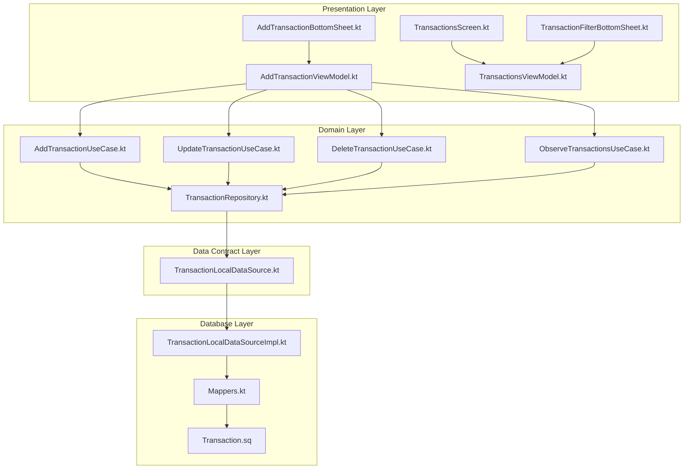
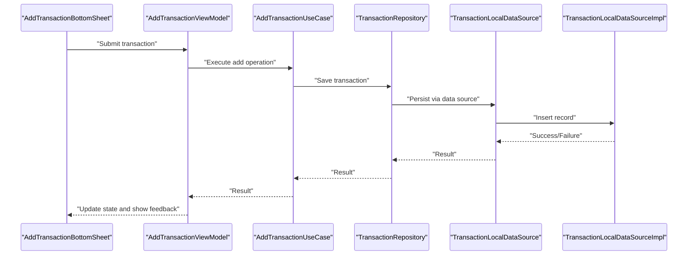
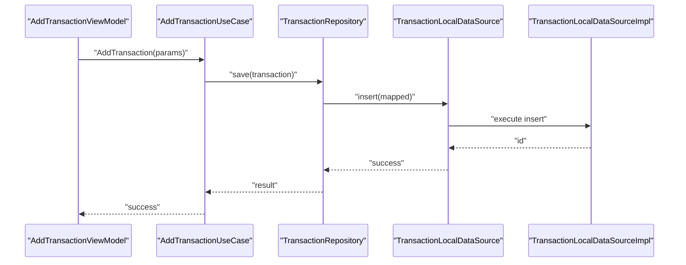
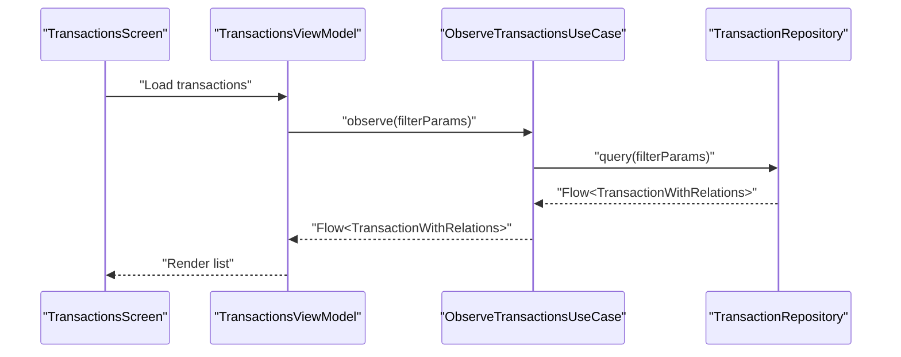
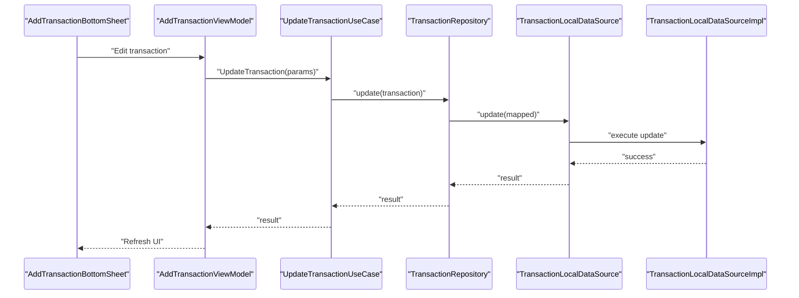
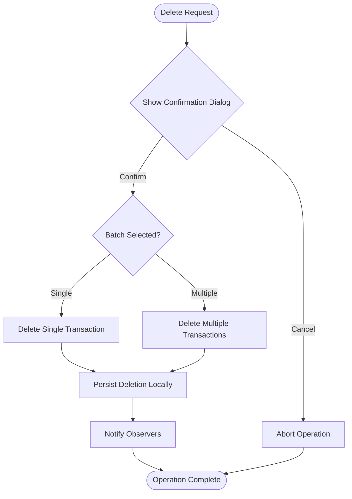

# Transaction CRUD Operations

<cite>
**Referenced Files in This Document**
- [Transaction.kt](file://core/common/src/commonMain/kotlin/com/kazemieh/common/model/Transaction.kt)
- [TransactionWithRelations.kt](file://core/common/src/commonMain/kotlin/com/kazemieh/common/model/TransactionWithRelations.kt)
- [TransactionFilterParams.kt](file://core/common/src/commonMain/kotlin/com/kazemieh/common/model/TransactionFilterParams.kt)
- [TransactionRepository.kt](file://core/domain/src/commonMain/kotlin/com/kazemieh/domain/repository/TransactionRepository.kt)
- [TransactionRepositoryImpl.kt](file://core/data/src/commonMain/kotlin/com/kazemieh/data/repository/TransactionRepositoryImpl.kt)
- [TransactionLocalDataSource.kt](file://core/data-contract/src/commonMain/kotlin/com/kazemieh/data_contract/datasource/TransactionLocalDataSource.kt)
- [TransactionLocalDataSourceImpl.kt](file://core/database/src/commonMain/kotlin/com/kazemieh/database/datasource/TransactionLocalDataSourceImpl.kt)
- [AddTransactionUseCase.kt](file://core/domain/src/commonMain/kotlin/com/kazemieh/domain/usecase/AddTransactionUseCase.kt)
- [UpdateTransactionUseCase.kt](file://core/domain/src/commonMain/kotlin/com/kazemieh/domain/usecase/UpdateTransactionUseCase.kt)
- [DeleteTransactionUseCase.kt](file://core/domain/src/commonMain/kotlin/com/kazemieh/domain/usecase/DeleteTransactionUseCase.kt)
- [ObserveTransactionsUseCase.kt](file://core/domain/src/commonMain/kotlin/com/kazemieh/domain/usecase/ObserveTransactionsUseCase.kt)
- [AddTransactionBottomSheet.kt](file://feature-share/transaction/src/commonMain/kotlin/com/kazemieh/transaction/ui/add/AddTransactionBottomSheet.kt)
- [AddTransactionComponents.kt](file://feature-share/transaction/src/commonMain/kotlin/com/kazemieh/transaction/ui/add/AddTransactionComponents.kt)
- [AddTransactionViewModel.kt](file://feature-share/transaction/src/commonMain/kotlin/com/kazemieh/transaction/ui/add/AddTransactionViewModel.kt)
- [TransactionsScreen.kt](file://feature-container/transactions/src/commonMain/kotlin/com/kazemieh/transactions/TransactionsScreen.kt)
- [TransactionsViewModel.kt](file://feature-container/transactions/src/commonMain/kotlin/com/kazemieh/transactions/TransactionsViewModel.kt)
- [TransactionFilterBottomSheet.kt](file://feature-container/transactions/src/commonMain/kotlin/com/kazemieh/transactions/TransactionFilterBottomSheet.kt)
- [Mappers.kt](file://core/database/src/commonMain/kotlin/com/kazemieh/database/mapper/Mappers.kt)
- [Transaction.sq](file://core/database/src/commonMain/kotlin/com/kazemieh/database/sqldelight/Transaction.sq)
</cite>

## Table of Contents
1. [Introduction](#introduction)
2. [Project Structure](#project-structure)
3. [Core Components](#core-components)
4. [Architecture Overview](#architecture-overview)
5. [Detailed Component Analysis](#detailed-component-analysis)
6. [Dependency Analysis](#dependency-analysis)
7. [Performance Considerations](#performance-considerations)
8. [Troubleshooting Guide](#troubleshooting-guide)
9. [Conclusion](#conclusion)

## Introduction
This document provides comprehensive documentation for transaction CRUD operations within the transaction management module. It covers Create, Read, Update, and Delete operations for income, expense, and transfer transactions, along with the AddTransactionBottomSheet component, AddTransactionViewModel architecture using an MVI-like pattern, validation, category selection, amount input, date picker integration, confirmation dialogs, batch operations, data binding patterns, repository integration, cross-platform compatibility, transaction types, validation rules, error handling, user feedback mechanisms, performance considerations for large datasets, and offline synchronization patterns.

## Project Structure
The transaction management spans multiple layers:
- Model layer defines transaction entities and relations.
- Domain layer encapsulates use cases for CRUD operations and observation.
- Data contract layer defines local data source interfaces.
- Database layer implements local data sources and mappers.
- Presentation layer provides screens and view models for adding and listing transactions.

**Diagram sources**
- [AddTransactionBottomSheet.kt](file://feature-share/transaction/src/commonMain/kotlin/com/kazemieh/transaction/ui/add/AddTransactionBottomSheet.kt)
- [AddTransactionViewModel.kt](file://feature-share/transaction/src/commonMain/kotlin/com/kazemieh/transaction/ui/add/AddTransactionViewModel.kt)
- [TransactionsScreen.kt](file://feature-container/transactions/src/commonMain/kotlin/com/kazemieh/transactions/TransactionsScreen.kt)
- [TransactionsViewModel.kt](file://feature-container/transactions/src/commonMain/kotlin/com/kazemieh/transactions/TransactionsViewModel.kt)
- [TransactionFilterBottomSheet.kt](file://feature-container/transactions/src/commonMain/kotlin/com/kazemieh/transactions/TransactionFilterBottomSheet.kt)
- [AddTransactionUseCase.kt](file://core/domain/src/commonMain/kotlin/com/kazemieh/domain/usecase/AddTransactionUseCase.kt)
- [UpdateTransactionUseCase.kt](file://core/domain/src/commonMain/kotlin/com/kazemieh/domain/usecase/UpdateTransactionUseCase.kt)
- [DeleteTransactionUseCase.kt](file://core/domain/src/commonMain/kotlin/com/kazemieh/domain/usecase/DeleteTransactionUseCase.kt)
- [ObserveTransactionsUseCase.kt](file://core/domain/src/commonMain/kotlin/com/kazemieh/domain/usecase/ObserveTransactionsUseCase.kt)
- [TransactionRepository.kt](file://core/domain/src/commonMain/kotlin/com/kazemieh/domain/repository/TransactionRepository.kt)
- [TransactionLocalDataSource.kt](file://core/data-contract/src/commonMain/kotlin/com/kazemieh/data_contract/datasource/TransactionLocalDataSource.kt)
- [TransactionLocalDataSourceImpl.kt](file://core/database/src/commonMain/kotlin/com/kazemieh/database/datasource/TransactionLocalDataSourceImpl.kt)
- [Mappers.kt](file://core/database/src/commonMain/kotlin/com/kazemieh/database/mapper/Mappers.kt)
- [Transaction.sq](file://core/database/src/commonMain/kotlin/com/kazemieh/database/sqldelight/Transaction.sq)

**Section sources**
- [Transaction.kt](file://core/common/src/commonMain/kotlin/com/kazemieh/common/model/Transaction.kt)
- [TransactionWithRelations.kt](file://core/common/src/commonMain/kotlin/com/kazemieh/common/model/TransactionWithRelations.kt)
- [TransactionFilterParams.kt](file://core/common/src/commonMain/kotlin/com/kazemieh/common/model/TransactionFilterParams.kt)

## Core Components
This section outlines the core components involved in transaction CRUD operations.

- Transaction entity and relations define the data model for income, expense, and transfer transactions.
- Use cases encapsulate business logic for adding, updating, deleting, and observing transactions.
- Repositories and local data sources abstract persistence and mapping.
- Presentation components handle UI interactions, validation, and state updates.

Key responsibilities:
- Create: AddTransactionUseCase orchestrates creation via repository and data source.
- Read: ObserveTransactionsUseCase streams transactions; TransactionsViewModel observes and exposes state.
- Update: UpdateTransactionUseCase handles modifications.
- Delete: DeleteTransactionUseCase manages deletions with confirmation and batch support.

**Section sources**
- [Transaction.kt](file://core/common/src/commonMain/kotlin/com/kazemieh/common/model/Transaction.kt)
- [TransactionWithRelations.kt](file://core/common/src/commonMain/kotlin/com/kazemieh/common/model/TransactionWithRelations.kt)
- [AddTransactionUseCase.kt](file://core/domain/src/commonMain/kotlin/com/kazemieh/domain/usecase/AddTransactionUseCase.kt)
- [UpdateTransactionUseCase.kt](file://core/domain/src/commonMain/kotlin/com/kazemieh/domain/usecase/UpdateTransactionUseCase.kt)
- [DeleteTransactionUseCase.kt](file://core/domain/src/commonMain/kotlin/com/kazemieh/domain/usecase/DeleteTransactionUseCase.kt)
- [ObserveTransactionsUseCase.kt](file://core/domain/src/commonMain/kotlin/com/kazemieh/domain/usecase/ObserveTransactionsUseCase.kt)
- [TransactionRepository.kt](file://core/domain/src/commonMain/kotlin/com/kazemieh/domain/repository/TransactionRepository.kt)
- [TransactionLocalDataSource.kt](file://core/data-contract/src/commonMain/kotlin/com/kazemieh/data_contract/datasource/TransactionLocalDataSource.kt)
- [TransactionLocalDataSourceImpl.kt](file://core/database/src/commonMain/kotlin/com/kazemieh/database/datasource/TransactionLocalDataSourceImpl.kt)
- [Mappers.kt](file://core/database/src/commonMain/kotlin/com/kazemieh/database/mapper/Mappers.kt)

## Architecture Overview
The transaction management follows a layered architecture:
- Presentation layer: Screens and bottom sheets manage user interactions and state.
- Domain layer: Use cases coordinate business operations.
- Data contract layer: Interfaces define local data source contracts.
- Database layer: SQLDelight implementation and mappers handle persistence.

**Diagram sources**
- [AddTransactionBottomSheet.kt](file://feature-share/transaction/src/commonMain/kotlin/com/kazemieh/transaction/ui/add/AddTransactionBottomSheet.kt)
- [AddTransactionViewModel.kt](file://feature-share/transaction/src/commonMain/kotlin/com/kazemieh/transaction/ui/add/AddTransactionViewModel.kt)
- [AddTransactionUseCase.kt](file://core/domain/src/commonMain/kotlin/com/kazemieh/domain/usecase/AddTransactionUseCase.kt)
- [TransactionRepository.kt](file://core/domain/src/commonMain/kotlin/com/kazemieh/domain/repository/TransactionRepository.kt)
- [TransactionLocalDataSource.kt](file://core/data-contract/src/commonMain/kotlin/com/kazemieh/data_contract/datasource/TransactionLocalDataSource.kt)
- [TransactionLocalDataSourceImpl.kt](file://core/database/src/commonMain/kotlin/com/kazemieh/database/datasource/TransactionLocalDataSourceImpl.kt)

## Detailed Component Analysis

### Transaction Entity and Relations
Transaction types supported:
- Income: inflow of funds.
- Expense: outflow of funds.
- Transfer: movement between accounts.

Validation rules:
- Amount must be positive for income and zero or positive for transfers.
- Categories must be valid and associated with the transaction type.
- Date must be within acceptable bounds.
- Related entities (persons/tags/sources) must be consistent with the transaction.

Data binding patterns:
- Use immutable models for state representation.
- Map domain entities to presentation models for UI rendering.
- Apply currency formatting and localization for amounts.

Cross-platform compatibility:
- Kotlin Multiplatform ensures consistent models across Android, iOS, JVM, and Web targets.

**Section sources**
- [Transaction.kt](file://core/common/src/commonMain/kotlin/com/kazemieh/common/model/Transaction.kt)
- [TransactionWithRelations.kt](file://core/common/src/commonMain/kotlin/com/kazemieh/common/model/TransactionWithRelations.kt)
- [TransactionFilterParams.kt](file://core/common/src/commonMain/kotlin/com/kazemieh/common/model/TransactionFilterParams.kt)

### AddTransactionBottomSheet Component
Form validation:
- Amount input validation ensures numeric format and non-negative values.
- Category selection requires a valid category for the chosen transaction type.
- Date picker integration validates date range and Persian calendar compliance.
- Required field checks for description and related entities.

Category selection:
- Dynamic category lists filtered by transaction type (income/expense/transfer).
- Default category fallback when none selected.

Amount input:
- Currency-aware formatting and parsing.
- Real-time validation feedback.

Date picker integration:
- Persian date support with validator integration.
- Minimum/maximum date constraints aligned with business rules.

User feedback:
- Immediate inline validation messages.
- Success and error snackbars or toasts.
- Form reset after successful submission.

**Section sources**
- [AddTransactionBottomSheet.kt](file://feature-share/transaction/src/commonMain/kotlin/com/kazemieh/transaction/ui/add/AddTransactionBottomSheet.kt)
- [AddTransactionComponents.kt](file://feature-share/transaction/src/commonMain/kotlin/com/kazemieh/transaction/ui/add/AddTransactionComponents.kt)

### AddTransactionViewModel Architecture (MVI Pattern)
State management:
- Immutable state objects represent UI state transitions.
- Intents drive state changes through pure functions.
- Side effects (network/local) are isolated and testable.

Intent handling:
- SubmitTransactionIntent triggers add/update/delete operations.
- FilterIntent updates filter parameters.
- ValidationIntent runs form validations.

Repository integration:
- Delegates CRUD operations to use cases.
- Observes real-time updates via observe transactions use case.

Example state transitions:
- Loading -> Success/Error
- Editing -> Validating -> Submitting
- Idle -> Filtering -> Results

**Section sources**
- [AddTransactionViewModel.kt](file://feature-share/transaction/src/commonMain/kotlin/com/kazemieh/transaction/ui/add/AddTransactionViewModel.kt)

### CRUD Operations Implementation

#### Create Operation
- Use case: AddTransactionUseCase coordinates creation.
- Repository: TransactionRepository persists via TransactionLocalDataSource.
- Data source: TransactionLocalDataSourceImpl inserts records.
- Mapping: Mappers convert between domain and database models.
- Validation: Pre-save validation ensures data integrity.

**Diagram sources**
- [AddTransactionViewModel.kt](file://feature-share/transaction/src/commonMain/kotlin/com/kazemieh/transaction/ui/add/AddTransactionViewModel.kt)
- [AddTransactionUseCase.kt](file://core/domain/src/commonMain/kotlin/com/kazemieh/domain/usecase/AddTransactionUseCase.kt)
- [TransactionRepository.kt](file://core/domain/src/commonMain/kotlin/com/kazemieh/domain/repository/TransactionRepository.kt)
- [TransactionLocalDataSource.kt](file://core/data-contract/src/commonMain/kotlin/com/kazemieh/data_contract/datasource/TransactionLocalDataSource.kt)
- [TransactionLocalDataSourceImpl.kt](file://core/database/src/commonMain/kotlin/com/kazemieh/database/datasource/TransactionLocalDataSourceImpl.kt)
- [Mappers.kt](file://core/database/src/commonMain/kotlin/com/kazemieh/database/mapper/Mappers.kt)

**Section sources**
- [AddTransactionUseCase.kt](file://core/domain/src/commonMain/kotlin/com/kazemieh/domain/usecase/AddTransactionUseCase.kt)
- [TransactionRepositoryImpl.kt](file://core/data/src/commonMain/kotlin/com/kazemieh/data/repository/TransactionRepositoryImpl.kt)
- [TransactionLocalDataSourceImpl.kt](file://core/database/src/commonMain/kotlin/com/kazemieh/database/datasource/TransactionLocalDataSourceImpl.kt)
- [Mappers.kt](file://core/database/src/commonMain/kotlin/com/kazemieh/database/mapper/Mappers.kt)

#### Read Operation
- Use case: ObserveTransactionsUseCase streams transactions.
- ViewModel: TransactionsViewModel observes and exposes state.
- Filtering: TransactionFilterBottomSheet updates filter parameters.
- Pagination: PageRequest supports large datasets.

**Diagram sources**
- [TransactionsScreen.kt](file://feature-container/transactions/src/commonMain/kotlin/com/kazemieh/transactions/TransactionsScreen.kt)
- [TransactionsViewModel.kt](file://feature-container/transactions/src/commonMain/kotlin/com/kazemieh/transactions/TransactionsViewModel.kt)
- [ObserveTransactionsUseCase.kt](file://core/domain/src/commonMain/kotlin/com/kazemieh/domain/usecase/ObserveTransactionsUseCase.kt)
- [TransactionRepository.kt](file://core/domain/src/commonMain/kotlin/com/kazemieh/domain/repository/TransactionRepository.kt)
- [TransactionFilterBottomSheet.kt](file://feature-container/transactions/src/commonMain/kotlin/com/kazemieh/transactions/TransactionFilterBottomSheet.kt)

**Section sources**
- [ObserveTransactionsUseCase.kt](file://core/domain/src/commonMain/kotlin/com/kazemieh/domain/usecase/ObserveTransactionsUseCase.kt)
- [TransactionsViewModel.kt](file://feature-container/transactions/src/commonMain/kotlin/com/kazemieh/transactions/TransactionsViewModel.kt)
- [TransactionFilterBottomSheet.kt](file://feature-container/transactions/src/commonMain/kotlin/com/kazemieh/transactions/TransactionFilterBottomSheet.kt)

#### Update Operation
- Use case: UpdateTransactionUseCase coordinates updates.
- Validation: Ensures transaction exists and state change is valid.
- Persistence: Updates via data source and notifies observers.

**Diagram sources**
- [AddTransactionBottomSheet.kt](file://feature-share/transaction/src/commonMain/kotlin/com/kazemieh/transaction/ui/add/AddTransactionBottomSheet.kt)
- [AddTransactionViewModel.kt](file://feature-share/transaction/src/commonMain/kotlin/com/kazemieh/transaction/ui/add/AddTransactionViewModel.kt)
- [UpdateTransactionUseCase.kt](file://core/domain/src/commonMain/kotlin/com/kazemieh/domain/usecase/UpdateTransactionUseCase.kt)
- [TransactionRepository.kt](file://core/domain/src/commonMain/kotlin/com/kazemieh/domain/repository/TransactionRepository.kt)
- [TransactionLocalDataSource.kt](file://core/data-contract/src/commonMain/kotlin/com/kazemieh/data_contract/datasource/TransactionLocalDataSource.kt)
- [TransactionLocalDataSourceImpl.kt](file://core/database/src/commonMain/kotlin/com/kazemieh/database/datasource/TransactionLocalDataSourceImpl.kt)

**Section sources**
- [UpdateTransactionUseCase.kt](file://core/domain/src/commonMain/kotlin/com/kazemieh/domain/usecase/UpdateTransactionUseCase.kt)
- [TransactionRepositoryImpl.kt](file://core/data/src/commonMain/kotlin/com/kazemieh/data/repository/TransactionRepositoryImpl.kt)

#### Delete Operation
- Use case: DeleteTransactionUseCase coordinates deletions.
- Confirmation dialogs: Prompt user for irreversible actions.
- Batch operations: Support deleting multiple transactions.
- Offline synchronization: Queue deletions locally until sync.

**Diagram sources**
- [DeleteTransactionUseCase.kt](file://core/domain/src/commonMain/kotlin/com/kazemieh/domain/usecase/DeleteTransactionUseCase.kt)
- [TransactionRepositoryImpl.kt](file://core/data/src/commonMain/kotlin/com/kazemieh/data/repository/TransactionRepositoryImpl.kt)

**Section sources**
- [DeleteTransactionUseCase.kt](file://core/domain/src/commonMain/kotlin/com/kazemieh/domain/usecase/DeleteTransactionUseCase.kt)
- [TransactionsViewModel.kt](file://feature-container/transactions/src/commonMain/kotlin/com/kazemieh/transactions/TransactionsViewModel.kt)

### Data Binding Patterns and Cross-Platform Compatibility
- Data binding: Use immutable models and sealed states for predictable UI updates.
- Cross-platform: Kotlin Multiplatform ensures consistent models and logic across Android, iOS, JVM, and Web.
- Offline-first: Local SQLDelight database enables offline operations; sync strategies can be introduced later.

**Section sources**
- [Transaction.sq](file://core/database/src/commonMain/kotlin/com/kazemieh/database/sqldelight/Transaction.sq)
- [Mappers.kt](file://core/database/src/commonMain/kotlin/com/kazemieh/database/mapper/Mappers.kt)

## Dependency Analysis
The transaction module exhibits clean separation of concerns:
- Presentation depends on domain use cases.
- Domain depends on repository abstractions.
- Data contract defines boundaries for local data sources.
- Database implements local data sources and mappers.

```mermaid
graph LR
UI["AddTransactionBottomSheet.kt"] --> VM["AddTransactionViewModel.kt"]
VM --> UC["AddTransactionUseCase.kt"]
UC --> Repo["TransactionRepository.kt"]
Repo --> DS["TransactionLocalDataSource.kt"]
DS --> Impl["TransactionLocalDataSourceImpl.kt"]
Impl --> Map["Mappers.kt"]
Map --> DB["Transaction.sq"]
```

**Diagram sources**
- [AddTransactionBottomSheet.kt](file://feature-share/transaction/src/commonMain/kotlin/com/kazemieh/transaction/ui/add/AddTransactionBottomSheet.kt)
- [AddTransactionViewModel.kt](file://feature-share/transaction/src/commonMain/kotlin/com/kazemieh/transaction/ui/add/AddTransactionViewModel.kt)
- [AddTransactionUseCase.kt](file://core/domain/src/commonMain/kotlin/com/kazemieh/domain/usecase/AddTransactionUseCase.kt)
- [TransactionRepository.kt](file://core/domain/src/commonMain/kotlin/com/kazemieh/domain/repository/TransactionRepository.kt)
- [TransactionLocalDataSource.kt](file://core/data-contract/src/commonMain/kotlin/com/kazemieh/data_contract/datasource/TransactionLocalDataSource.kt)
- [TransactionLocalDataSourceImpl.kt](file://core/database/src/commonMain/kotlin/com/kazemieh/database/datasource/TransactionLocalDataSourceImpl.kt)
- [Mappers.kt](file://core/database/src/commonMain/kotlin/com/kazemieh/database/mapper/Mappers.kt)
- [Transaction.sq](file://core/database/src/commonMain/kotlin/com/kazemieh/database/sqldelight/Transaction.sq)

**Section sources**
- [TransactionRepository.kt](file://core/domain/src/commonMain/kotlin/com/kazemieh/domain/repository/TransactionRepository.kt)
- [TransactionLocalDataSource.kt](file://core/data-contract/src/commonMain/kotlin/com/kazemieh/data_contract/datasource/TransactionLocalDataSource.kt)
- [TransactionLocalDataSourceImpl.kt](file://core/database/src/commonMain/kotlin/com/kazemieh/database/datasource/TransactionLocalDataSourceImpl.kt)

## Performance Considerations
- Large datasets: Use pagination and filtering to limit memory usage.
- Observation: Prefer Flow-based observation to avoid unnecessary recompositions.
- Caching: Cache frequently accessed categories and sources.
- Batch operations: Minimize database round-trips by batching writes.
- Offline synchronization: Queue operations locally and reconcile on connectivity.

## Troubleshooting Guide
Common issues and resolutions:
- Validation failures: Ensure amount formatting and category selection are correct.
- Date picker errors: Verify Persian calendar validator and date range constraints.
- Sync conflicts: Implement conflict resolution strategies for offline edits.
- Memory leaks: Avoid retaining UI references in view models; use lifecycle-aware patterns.

**Section sources**
- [AddTransactionBottomSheet.kt](file://feature-share/transaction/src/commonMain/kotlin/com/kazemieh/transaction/ui/add/AddTransactionBottomSheet.kt)
- [AddTransactionViewModel.kt](file://feature-share/transaction/src/commonMain/kotlin/com/kazemieh/transaction/ui/add/AddTransactionViewModel.kt)

## Conclusion
The transaction management module implements robust CRUD operations across income, expense, and transfer types with strong validation, user feedback, and cross-platform compatibility. The MVI-like AddTransactionViewModel provides predictable state management, while layered architecture ensures maintainability and testability. Performance and offline capabilities are designed to scale with large datasets and varied platform requirements.