# Design System Overview

<cite>
**Referenced Files in This Document**
- [Theme.kt](file://core/designsystem/src/commonMain/kotlin/com/kazemieh/designsystem/Theme.kt)
- [Color.kt](file://core/designsystem/src/commonMain/kotlin/com/kazemieh/designsystem/Color.kt)
- [Dimensions.kt](file://core/designsystem/src/commonMain/kotlin/com/kazemieh/designsystem/Dimensions.kt)
- [FintrackTypography.kt](file://core/designsystem/src/commonMain/kotlin/com/kazemieh/designsystem/FintrackTypography.kt)
- [FintrackShapes.kt](file://core/designsystem/src/commonMain/kotlin/com/kazemieh/designsystem/FintrackShapes.kt)
- [GlassColors.kt](file://core/designsystem/src/commonMain/kotlin/com/kazemieh/designsystem/GlassColors.kt)
- [AppTheme.kt](file://core/designsystem/src/commonMain/kotlin/com/kazemieh/designsystem/AppTheme.kt)
- [themes.xml](file://app/src/main/res/values/themes.xml)
- [colors.xml](file://app/src/main/res/values/colors.xml)
- [FinTrackHost.kt](file://composeApp/src/commonMain/kotlin/com/kazemieh/composeApp/FinTrackHost.kt)
- [App.kt](file://composeApp/src/commonMain/kotlin/com/kazemieh/composeApp/App.kt)
- [BottombarNavigation.kt](file://composeApp/src/commonMain/kotlin/com/kazemieh/composeApp/navigation/navigationBar/BottombarNavigation.kt)
- [FintrackNavigationBar.kt](file://composeApp/src/commonMain/kotlin/com/kazemieh/composeApp/navigation/navigationBar/FintrackNavigationBar.kt)
- [ThemeAndCurrencyScreen.kt](file://feature-container/profile/src/commonMain/kotlin/com/kazemieh/profile/ThemeAndCurrencyScreen.kt)
- [ThemeAndCurrencyViewModel.kt](file://feature-container/profile/src/commonMain/kotlin/com/kazemieh/profile/ThemeAndCurrencyViewModel.kt)
- [FinTrackPreferences.kt](file://core/preferences/src/commonMain/kotlin/com/kazemieh/preferences/FinTrackPreferences.kt)
- [MoneyFormatter.kt](file://core/money/src/commonMain/kotlin/com/kazemieh/money/MoneyFormatter.kt)
- [Currency.kt](file://core/money/src/commonMain/kotlin/com/kazemieh/money/Currency.kt)
</cite>

## Table of Contents
1. [Introduction](#introduction)
2. [Project Structure](#project-structure)
3. [Core Components](#core-components)
4. [Architecture Overview](#architecture-overview)
5. [Detailed Component Analysis](#detailed-component-analysis)
6. [Dependency Analysis](#dependency-analysis)
7. [Performance Considerations](#performance-considerations)
8. [Troubleshooting Guide](#troubleshooting-guide)
9. [Conclusion](#conclusion)

## Introduction
This document describes FinTrack’s design system foundation with a focus on theming and styling. It explains how Material 3 principles are integrated, how the color palette, typography, and dimension scales are organized, and how theme configuration enables consistent visuals across platforms. It also documents theme variants, design token usage, responsive design approaches, and accessibility considerations.

## Project Structure
FinTrack organizes design system assets and logic primarily under the core/designsystem module, with platform-specific theme resources in the app module and Compose-based UI in composeApp. Feature screens consume the design system for consistent styling.

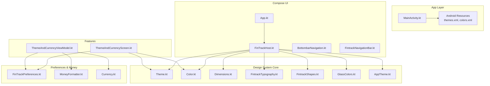

**Diagram sources**
- [Theme.kt](file://core/designsystem/src/commonMain/kotlin/com/kazemieh/designsystem/Theme.kt)
- [Color.kt](file://core/designsystem/src/commonMain/kotlin/com/kazemieh/designsystem/Color.kt)
- [Dimensions.kt](file://core/designsystem/src/commonMain/kotlin/com/kazemieh/designsystem/Dimensions.kt)
- [FintrackTypography.kt](file://core/designsystem/src/commonMain/kotlin/com/kazemieh/designsystem/FintrackTypography.kt)
- [FintrackShapes.kt](file://core/designsystem/src/commonMain/kotlin/com/kazemieh/designsystem/FintrackShapes.kt)
- [GlassColors.kt](file://core/designsystem/src/commonMain/kotlin/com/kazemieh/designsystem/GlassColors.kt)
- [AppTheme.kt](file://core/designsystem/src/commonMain/kotlin/com/kazemieh/designsystem/AppTheme.kt)
- [themes.xml](file://app/src/main/res/values/themes.xml)
- [colors.xml](file://app/src/main/res/values/colors.xml)
- [FinTrackHost.kt](file://composeApp/src/commonMain/kotlin/com/kazemieh/composeApp/FinTrackHost.kt)
- [App.kt](file://composeApp/src/commonMain/kotlin/com/kazemieh/composeApp/App.kt)
- [BottombarNavigation.kt](file://composeApp/src/commonMain/kotlin/com/kazemieh/composeApp/navigation/navigationBar/BottombarNavigation.kt)
- [FintrackNavigationBar.kt](file://composeApp/src/commonMain/kotlin/com/kazemieh/composeApp/navigation/navigationBar/FintrackNavigationBar.kt)
- [ThemeAndCurrencyScreen.kt](file://feature-container/profile/src/commonMain/kotlin/com/kazemieh/profile/ThemeAndCurrencyScreen.kt)
- [ThemeAndCurrencyViewModel.kt](file://feature-container/profile/src/commonMain/kotlin/com/kazemieh/profile/ThemeAndCurrencyViewModel.kt)
- [FinTrackPreferences.kt](file://core/preferences/src/commonMain/kotlin/com/kazemieh/preferences/FinTrackPreferences.kt)
- [MoneyFormatter.kt](file://core/money/src/commonMain/kotlin/com/kazemieh/money/MoneyFormatter.kt)
- [Currency.kt](file://core/money/src/commonMain/kotlin/com/kazemieh/money/Currency.kt)

**Section sources**
- [Theme.kt](file://core/designsystem/src/commonMain/kotlin/com/kazemieh/designsystem/Theme.kt)
- [AppTheme.kt](file://core/designsystem/src/commonMain/kotlin/com/kazemieh/designsystem/AppTheme.kt)
- [themes.xml](file://app/src/main/res/values/themes.xml)
- [colors.xml](file://app/src/main/res/values/colors.xml)
- [FinTrackHost.kt](file://composeApp/src/commonMain/kotlin/com/kazemieh/composeApp/FinTrackHost.kt)
- [App.kt](file://composeApp/src/commonMain/kotlin/com/kazemieh/composeApp/App.kt)

## Core Components
This section outlines the foundational building blocks of FinTrack’s design system.

- Theme configuration and variants
  - Centralized theme definition and variant composition are implemented in the design system module. Theme variants enable light/dark modes and brand-consistent palettes.
  - The host composable integrates the design system theme into the UI tree.

- Color system
  - A unified color palette is defined and exposed via design tokens. Color roles map to semantic intents (primary, surface, error) and support dynamic mode switching.

- Typography hierarchy
  - A scalable typography scale defines font families, weights, sizes, and line heights for consistent readability across components.

- Dimension scaling system
  - A spacing and sizing scale ensures proportional layouts and consistent padding/margins/gaps across components and breakpoints.

- Shapes and surfaces
  - Corner radii and elevation-based shadows define surface appearance and interactive states.

- Glassmorphism accents
  - Optional glass-like color overlays enhance depth while preserving content readability.

- Responsive design
  - Layouts adapt to screen sizes and orientations using density-independent units and flexible component sizing.

- Accessibility
  - WCAG-compliant contrast ratios, sufficient touch targets, and semantic color roles support inclusive experiences.

**Section sources**
- [Theme.kt](file://core/designsystem/src/commonMain/kotlin/com/kazemieh/designsystem/Theme.kt)
- [Color.kt](file://core/designsystem/src/commonMain/kotlin/com/kazemieh/designsystem/Color.kt)
- [FintrackTypography.kt](file://core/designsystem/src/commonMain/kotlin/com/kazemieh/designsystem/FintrackTypography.kt)
- [Dimensions.kt](file://core/designsystem/src/commonMain/kotlin/com/kazemieh/designsystem/Dimensions.kt)
- [FintrackShapes.kt](file://core/designsystem/src/commonMain/kotlin/com/kazemieh/designsystem/FintrackShapes.kt)
- [GlassColors.kt](file://core/designsystem/src/commonMain/kotlin/com/kazemieh/designsystem/GlassColors.kt)
- [AppTheme.kt](file://core/designsystem/src/commonMain/kotlin/com/kazemieh/designsystem/AppTheme.kt)

## Architecture Overview
The design system architecture connects theme configuration, tokens, and UI components across platforms. Platform resources supply base colors and themes, while the design system module provides Compose-native tokens and variants. Features consume these tokens to maintain consistency.

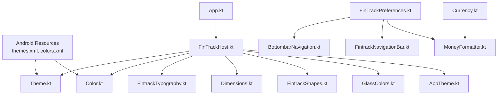

**Diagram sources**
- [Theme.kt](file://core/designsystem/src/commonMain/kotlin/com/kazemieh/designsystem/Theme.kt)
- [Color.kt](file://core/designsystem/src/commonMain/kotlin/com/kazemieh/designsystem/Color.kt)
- [FintrackTypography.kt](file://core/designsystem/src/commonMain/kotlin/com/kazemieh/designsystem/FintrackTypography.kt)
- [Dimensions.kt](file://core/designsystem/src/commonMain/kotlin/com/kazemieh/designsystem/Dimensions.kt)
- [FintrackShapes.kt](file://core/designsystem/src/commonMain/kotlin/com/kazemieh/designsystem/FintrackShapes.kt)
- [GlassColors.kt](file://core/designsystem/src/commonMain/kotlin/com/kazemieh/designsystem/GlassColors.kt)
- [AppTheme.kt](file://core/designsystem/src/commonMain/kotlin/com/kazemieh/designsystem/AppTheme.kt)
- [themes.xml](file://app/src/main/res/values/themes.xml)
- [colors.xml](file://app/src/main/res/values/colors.xml)
- [FinTrackHost.kt](file://composeApp/src/commonMain/kotlin/com/kazemieh/composeApp/FinTrackHost.kt)
- [App.kt](file://composeApp/src/commonMain/kotlin/com/kazemieh/composeApp/App.kt)
- [BottombarNavigation.kt](file://composeApp/src/commonMain/kotlin/com/kazemieh/composeApp/navigation/navigationBar/BottombarNavigation.kt)
- [FintrackNavigationBar.kt](file://composeApp/src/commonMain/kotlin/com/kazemieh/composeApp/navigation/navigationBar/FintrackNavigationBar.kt)
- [FinTrackPreferences.kt](file://core/preferences/src/commonMain/kotlin/com/kazemieh/preferences/FinTrackPreferences.kt)
- [MoneyFormatter.kt](file://core/money/src/commonMain/kotlin/com/kazemieh/money/MoneyFormatter.kt)
- [Currency.kt](file://core/money/src/commonMain/kotlin/com/kazemieh/money/Currency.kt)

## Detailed Component Analysis

### Theme Configuration and Variants
- Purpose: Centralizes theme creation and variant selection (e.g., light/dark) for consistent UI rendering.
- Integration: Host composable applies the design system theme to the entire UI tree.
- Variant behavior: Theme variants switch color roles and typography/sizing tokens based on user preference or system setting.

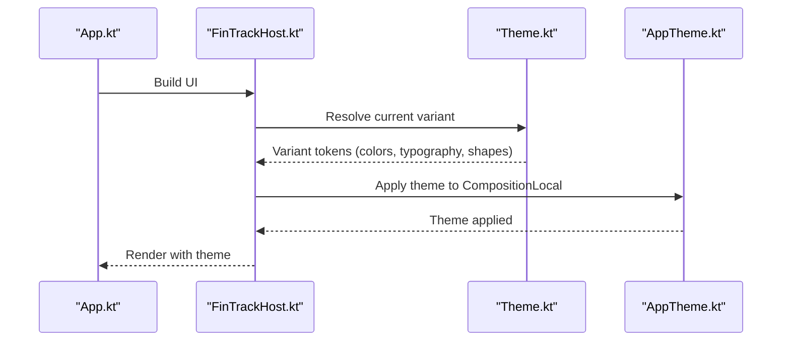

**Diagram sources**
- [App.kt](file://composeApp/src/commonMain/kotlin/com/kazemieh/composeApp/App.kt)
- [FinTrackHost.kt](file://composeApp/src/commonMain/kotlin/com/kazemieh/composeApp/FinTrackHost.kt)
- [Theme.kt](file://core/designsystem/src/commonMain/kotlin/com/kazemieh/designsystem/Theme.kt)
- [AppTheme.kt](file://core/designsystem/src/commonMain/kotlin/com/kazemieh/designsystem/AppTheme.kt)

**Section sources**
- [Theme.kt](file://core/designsystem/src/commonMain/kotlin/com/kazemieh/designsystem/Theme.kt)
- [AppTheme.kt](file://core/designsystem/src/commonMain/kotlin/com/kazemieh/designsystem/AppTheme.kt)
- [FinTrackHost.kt](file://composeApp/src/commonMain/kotlin/com/kazemieh/composeApp/FinTrackHost.kt)

### Color System and Design Tokens
- Purpose: Provides a single source of truth for all color roles and semantic intents.
- Organization: Tokens map to roles such as primary, surface, background, error, and their variants across modes.
- Usage: Components consume tokens rather than hardcoded values to ensure consistency and easy updates.

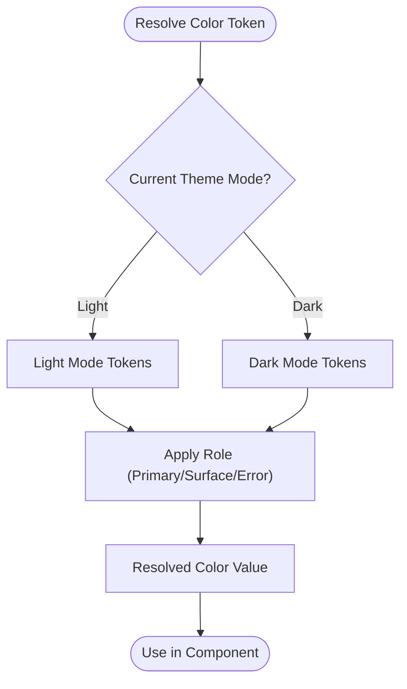

**Diagram sources**
- [Color.kt](file://core/designsystem/src/commonMain/kotlin/com/kazemieh/designsystem/Color.kt)
- [Theme.kt](file://core/designsystem/src/commonMain/kotlin/com/kazemieh/designsystem/Theme.kt)

**Section sources**
- [Color.kt](file://core/designsystem/src/commonMain/kotlin/com/kazemieh/designsystem/Color.kt)
- [Theme.kt](file://core/designsystem/src/commonMain/kotlin/com/kazemieh/designsystem/Theme.kt)

### Typography Hierarchy
- Purpose: Establishes a readable and scalable typographic system across components.
- Implementation: Tokens define font family, weight, size, and line height for headings, body, and caption styles.
- Usage: Components reference tokens to maintain consistent rhythm and readability.

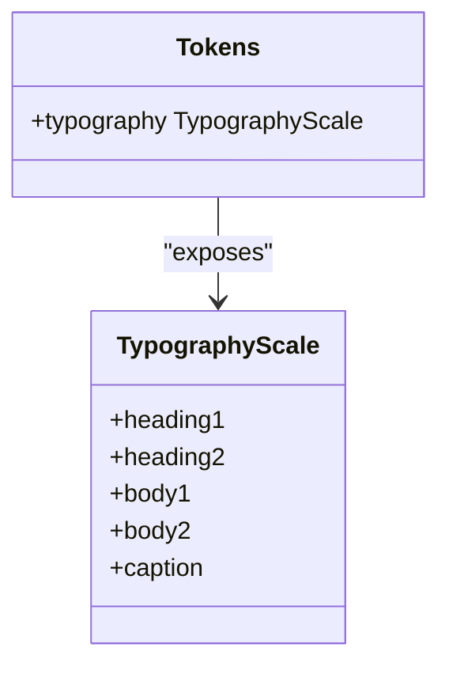

**Diagram sources**
- [FintrackTypography.kt](file://core/designsystem/src/commonMain/kotlin/com/kazemieh/designsystem/FintrackTypography.kt)
- [Theme.kt](file://core/designsystem/src/commonMain/kotlin/com/kazemieh/designsystem/Theme.kt)

**Section sources**
- [FintrackTypography.kt](file://core/designsystem/src/commonMain/kotlin/com/kazemieh/designsystem/FintrackTypography.kt)
- [Theme.kt](file://core/designsystem/src/commonMain/kotlin/com/kazemieh/designsystem/Theme.kt)

### Dimensions and Spacing Scale
- Purpose: Ensures proportional spacing and sizing across components and breakpoints.
- Implementation: A numeric scale defines paddings, margins, gaps, corner radii, and elevations.
- Usage: Components consume tokens for consistent layout regardless of device or orientation.

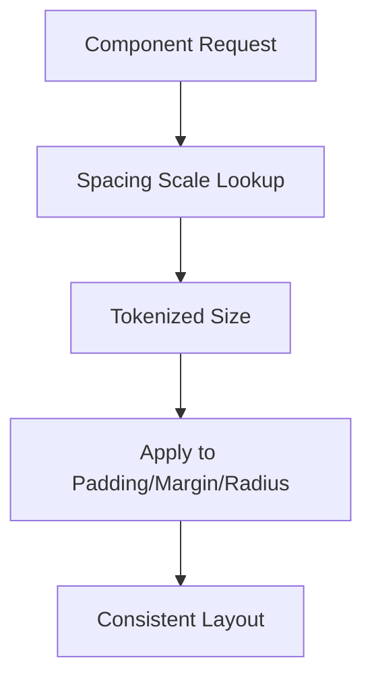

**Diagram sources**
- [Dimensions.kt](file://core/designsystem/src/commonMain/kotlin/com/kazemieh/designsystem/Dimensions.kt)
- [Theme.kt](file://core/designsystem/src/commonMain/kotlin/com/kazemieh/designsystem/Theme.kt)

**Section sources**
- [Dimensions.kt](file://core/designsystem/src/commonMain/kotlin/com/kazemieh/designsystem/Dimensions.kt)
- [Theme.kt](file://core/designsystem/src/commonMain/kotlin/com/kazemieh/designsystem/Theme.kt)

### Shapes and Surfaces
- Purpose: Standardizes corner radii and elevation to communicate hierarchy and depth.
- Implementation: Shape tokens define roundedness for cards, chips, buttons, and other surfaces.
- Usage: Components apply shape tokens consistently to reinforce visual coherence.

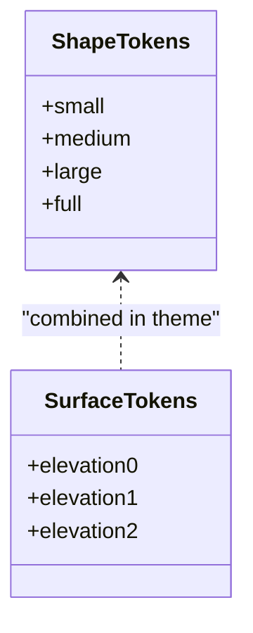

**Diagram sources**
- [FintrackShapes.kt](file://core/designsystem/src/commonMain/kotlin/com/kazemieh/designsystem/FintrackShapes.kt)
- [Theme.kt](file://core/designsystem/src/commonMain/kotlin/com/kazemieh/designsystem/Theme.kt)

**Section sources**
- [FintrackShapes.kt](file://core/designsystem/src/commonMain/kotlin/com/kazemieh/designsystem/FintrackShapes.kt)
- [Theme.kt](file://core/designsystem/src/commonMain/kotlin/com/kazemieh/designsystem/Theme.kt)

### Glassmorphism Accents
- Purpose: Adds translucent overlays for depth while keeping underlying content readable.
- Implementation: Glass color tokens combine transparency and backdrop blur effects.
- Usage: Applied selectively to modals, snackbars, and floating elements.

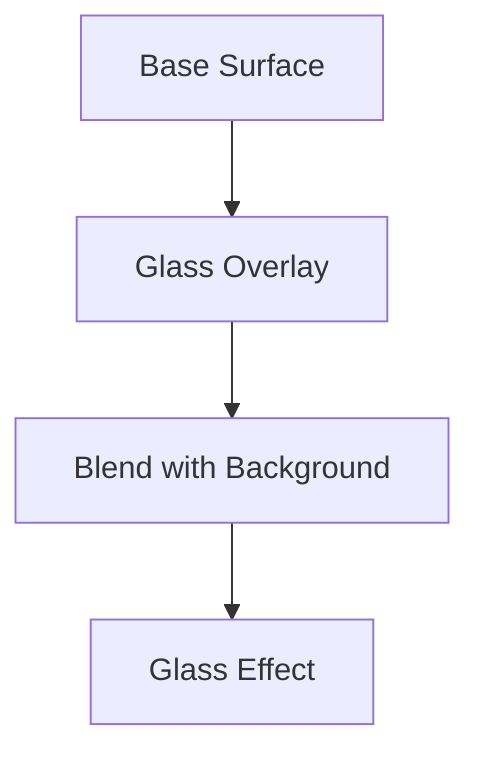

**Diagram sources**
- [GlassColors.kt](file://core/designsystem/src/commonMain/kotlin/com/kazemieh/designsystem/GlassColors.kt)
- [Theme.kt](file://core/designsystem/src/commonMain/kotlin/com/kazemieh/designsystem/Theme.kt)

**Section sources**
- [GlassColors.kt](file://core/designsystem/src/commonMain/kotlin/com/kazemieh/designsystem/GlassColors.kt)
- [Theme.kt](file://core/designsystem/src/commonMain/kotlin/com/kazemieh/designsystem/Theme.kt)

### Platform Theme Integration
- Android resources define base colors and themes that inform the design system tokens.
- The design system consumes these resources to align Compose UI with platform conventions.

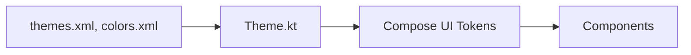

**Diagram sources**
- [themes.xml](file://app/src/main/res/values/themes.xml)
- [colors.xml](file://app/src/main/res/values/colors.xml)
- [Theme.kt](file://core/designsystem/src/commonMain/kotlin/com/kazemieh/designsystem/Theme.kt)

**Section sources**
- [themes.xml](file://app/src/main/res/values/themes.xml)
- [colors.xml](file://app/src/main/res/values/colors.xml)
- [Theme.kt](file://core/designsystem/src/commonMain/kotlin/com/kazemieh/designsystem/Theme.kt)

### Theme Customization and User Preferences
- Users can change theme and currency settings via the profile feature.
- Preferences drive runtime updates to theme variants and currency formatting.

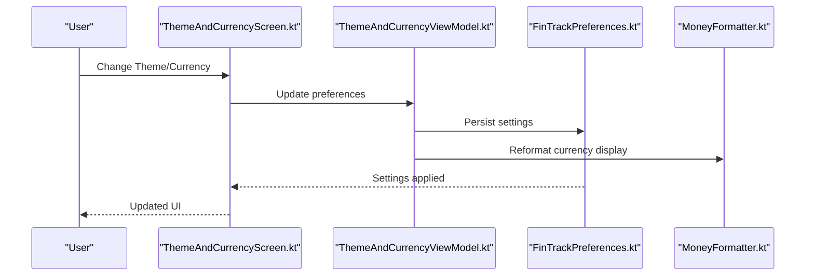

**Diagram sources**
- [ThemeAndCurrencyScreen.kt](file://feature-container/profile/src/commonMain/kotlin/com/kazemieh/profile/ThemeAndCurrencyScreen.kt)
- [ThemeAndCurrencyViewModel.kt](file://feature-container/profile/src/commonMain/kotlin/com/kazemieh/profile/ThemeAndCurrencyViewModel.kt)
- [FinTrackPreferences.kt](file://core/preferences/src/commonMain/kotlin/com/kazemieh/preferences/FinTrackPreferences.kt)
- [MoneyFormatter.kt](file://core/money/src/commonMain/kotlin/com/kazemieh/money/MoneyFormatter.kt)

**Section sources**
- [ThemeAndCurrencyScreen.kt](file://feature-container/profile/src/commonMain/kotlin/com/kazemieh/profile/ThemeAndCurrencyScreen.kt)
- [ThemeAndCurrencyViewModel.kt](file://feature-container/profile/src/commonMain/kotlin/com/kazemieh/profile/ThemeAndCurrencyViewModel.kt)
- [FinTrackPreferences.kt](file://core/preferences/src/commonMain/kotlin/com/kazemieh/preferences/FinTrackPreferences.kt)
- [MoneyFormatter.kt](file://core/money/src/commonMain/kotlin/com/kazemieh/money/MoneyFormatter.kt)

## Dependency Analysis
The design system components depend on each other to form a cohesive theme. Tokens feed typography, shapes, and colors into the theme, which is then applied by the host composable. Features depend on the design system for consistent styling.

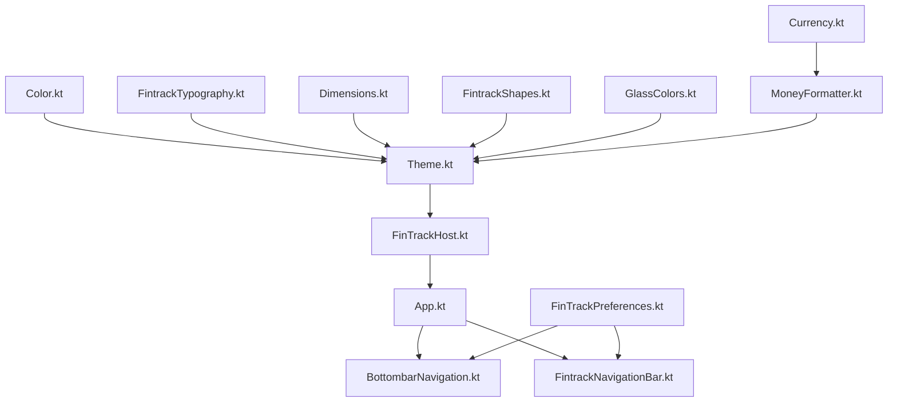

**Diagram sources**
- [Color.kt](file://core/designsystem/src/commonMain/kotlin/com/kazemieh/designsystem/Color.kt)
- [FintrackTypography.kt](file://core/designsystem/src/commonMain/kotlin/com/kazemieh/designsystem/FintrackTypography.kt)
- [Dimensions.kt](file://core/designsystem/src/commonMain/kotlin/com/kazemieh/designsystem/Dimensions.kt)
- [FintrackShapes.kt](file://core/designsystem/src/commonMain/kotlin/com/kazemieh/designsystem/FintrackShapes.kt)
- [GlassColors.kt](file://core/designsystem/src/commonMain/kotlin/com/kazemieh/designsystem/GlassColors.kt)
- [Theme.kt](file://core/designsystem/src/commonMain/kotlin/com/kazemieh/designsystem/Theme.kt)
- [FinTrackHost.kt](file://composeApp/src/commonMain/kotlin/com/kazemieh/composeApp/FinTrackHost.kt)
- [App.kt](file://composeApp/src/commonMain/kotlin/com/kazemieh/composeApp/App.kt)
- [BottombarNavigation.kt](file://composeApp/src/commonMain/kotlin/com/kazemieh/composeApp/navigation/navigationBar/BottombarNavigation.kt)
- [FintrackNavigationBar.kt](file://composeApp/src/commonMain/kotlin/com/kazemieh/composeApp/navigation/navigationBar/FintrackNavigationBar.kt)
- [FinTrackPreferences.kt](file://core/preferences/src/commonMain/kotlin/com/kazemieh/preferences/FinTrackPreferences.kt)
- [MoneyFormatter.kt](file://core/money/src/commonMain/kotlin/com/kazemieh/money/MoneyFormatter.kt)
- [Currency.kt](file://core/money/src/commonMain/kotlin/com/kazemieh/money/Currency.kt)

**Section sources**
- [Theme.kt](file://core/designsystem/src/commonMain/kotlin/com/kazemieh/designsystem/Theme.kt)
- [FinTrackHost.kt](file://composeApp/src/commonMain/kotlin/com/kazemieh/composeApp/FinTrackHost.kt)
- [App.kt](file://composeApp/src/commonMain/kotlin/com/kazemieh/composeApp/App.kt)

## Performance Considerations
- Prefer token-based styling over hard-coded values to reduce recomposition overhead and improve consistency.
- Use shape and elevation tokens to minimize layout thrashing during theme switches.
- Keep typography scales concise to avoid excessive font variations that complicate rendering.
- Apply glass effects judiciously to avoid unnecessary blending costs on lower-end devices.

## Troubleshooting Guide
- Theme not applying: Verify the host composable wraps UI with the design system theme and that variant resolution is active.
- Colors appear incorrect: Confirm color tokens resolve to the intended semantic role and that mode switching is functioning.
- Typography mismatch: Ensure components reference the correct tokenized styles and that fonts are properly bundled.
- Spacing inconsistencies: Check that dimension tokens are used uniformly across components and that breakpoints are handled correctly.
- Accessibility issues: Validate contrast ratios and ensure sufficient touch target sizes across variants.

**Section sources**
- [Theme.kt](file://core/designsystem/src/commonMain/kotlin/com/kazemieh/designsystem/Theme.kt)
- [Color.kt](file://core/designsystem/src/commonMain/kotlin/com/kazemieh/designsystem/Color.kt)
- [FintrackTypography.kt](file://core/designsystem/src/commonMain/kotlin/com/kazemieh/designsystem/FintrackTypography.kt)
- [Dimensions.kt](file://core/designsystem/src/commonMain/kotlin/com/kazemieh/designsystem/Dimensions.kt)
- [FintrackShapes.kt](file://core/designsystem/src/commonMain/kotlin/com/kazemieh/designsystem/FintrackShapes.kt)
- [GlassColors.kt](file://core/designsystem/src/commonMain/kotlin/com/kazemieh/designsystem/GlassColors.kt)

## Conclusion
FinTrack’s design system establishes a robust, token-driven foundation for consistent theming and styling across platforms. By centralizing theme configuration, color roles, typography, and dimensions, and by integrating user preferences for theme and currency, the system ensures visual coherence and supports accessibility. Following the guidelines herein will help maintain design consistency and scalability as the product evolves.