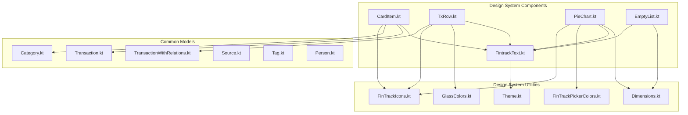
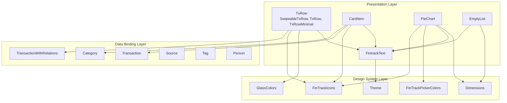
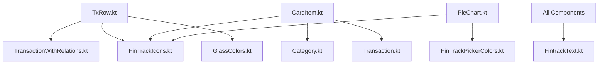

# Entity and Display Components

<cite>
**Referenced Files in This Document**
- [CardItem.kt](file://core/designsystem/src/commonMain/kotlin/com/kazemieh/designsystem/component/CardItem.kt)
- [TxRow.kt](file://core/designsystem/src/commonMain/kotlin/com/kazemieh/designsystem/component/TxRow.kt)
- [PieChart.kt](file://core/designsystem/src/commonMain/kotlin/com/kazemieh/designsystem/component/PieChart.kt)
- [EmptyList.kt](file://core/designsystem/src/commonMain/kotlin/com/kazemieh/designsystem/component/EmptyList.kt)
- [FintrackText.kt](file://core/designsystem/src/commonMain/kotlin/com/kazemieh/designsystem/component/FintrackText.kt)
- [Transaction.kt](file://core/common/src/commonMain/kotlin/com/kazemieh/common/model/Transaction.kt)
- [TransactionWithRelations.kt](file://core/common/src/commonMain/kotlin/com/kazemieh/common/model/TransactionWithRelations.kt)
- [Category.kt](file://core/common/src/commonMain/kotlin/com/kazemieh/common/model/Category.kt)
- [Source.kt](file://core/common/src/commonMain/kotlin/com/kazemieh/common/model/Source.kt)
- [Tag.kt](file://core/common/src/commonMain/kotlin/com/kazemieh/common/model/Tag.kt)
- [Person.kt](file://core/common/src/commonMain/kotlin/com/kazemieh/common/model/Person.kt)
- [FinTrackIcons.kt](file://core/designsystem/src/commonMain/kotlin/com/kazemieh/designsystem/picker/FinTrackIcons.kt)
- [FinTrackPickerColors.kt](file://core/designsystem/src/commonMain/kotlin/com/kazemieh/designsystem/picker/FinTrackPickerColors.kt)
- [GlassColors.kt](file://core/designsystem/src/commonMain/kotlin/com/kazemieh/designsystem/GlassColors.kt)
- [Dimensions.kt](file://core/designsystem/src/commonMain/kotlin/com/kazemieh/designsystem/Dimensions.kt)
- [Theme.kt](file://core/designsystem/src/commonMain/kotlin/com/kazemieh/designsystem/Theme.kt)
</cite>

## Table of Contents
1. [Introduction](#introduction)
2. [Project Structure](#project-structure)
3. [Core Components](#core-components)
4. [Architecture Overview](#architecture-overview)
5. [Detailed Component Analysis](#detailed-component-analysis)
6. [Dependency Analysis](#dependency-analysis)
7. [Performance Considerations](#performance-considerations)
8. [Accessibility Features](#accessibility-features)
9. [Responsive Design](#responsive-design)
10. [Troubleshooting Guide](#troubleshooting-guide)
11. [Conclusion](#conclusion)

## Introduction
This document provides comprehensive technical documentation for FinTrack's entity display and data visualization components. It focuses on five key components: CardItem, TxRow, PieChart, EmptyList, and FintrackText. These components collectively render financial entities (transactions, categories, sources), present data visually through charts, handle empty states gracefully, and ensure consistent typography across platforms. The documentation covers data binding patterns, visualization rendering, interactive behaviors, performance optimizations for large datasets, animation handling, accessibility features, and responsive design considerations.

## Project Structure
The entity and display components reside in the design system module under the common platform, ensuring shared UI logic across Android, iOS, JVM, and Web targets. The components integrate with common domain models and design system utilities for icons, colors, spacing, and typography.

**Diagram sources**
- [CardItem.kt:1-105](file://core/designsystem/src/commonMain/kotlin/com/kazemieh/designsystem/component/CardItem.kt#L1-L105)
- [TxRow.kt:1-480](file://core/designsystem/src/commonMain/kotlin/com/kazemieh/designsystem/component/TxRow.kt#L1-L480)
- [PieChart.kt:1-504](file://core/designsystem/src/commonMain/kotlin/com/kazemieh/designsystem/component/PieChart.kt#L1-L504)
- [EmptyList.kt:1-40](file://core/designsystem/src/commonMain/kotlin/com/kazemieh/designsystem/component/EmptyList.kt#L1-L40)
- [FintrackText.kt:1-432](file://core/designsystem/src/commonMain/kotlin/com/kazemieh/designsystem/component/FintrackText.kt#L1-L432)
- [Transaction.kt](file://core/common/src/commonMain/kotlin/com/kazemieh/common/model/Transaction.kt)
- [TransactionWithRelations.kt](file://core/common/src/commonMain/kotlin/com/kazemieh/common/model/TransactionWithRelations.kt)
- [Category.kt](file://core/common/src/commonMain/kotlin/com/kazemieh/common/model/Category.kt)
- [Source.kt](file://core/common/src/commonMain/kotlin/com/kazemieh/common/model/Source.kt)
- [Tag.kt](file://core/common/src/commonMain/kotlin/com/kazemieh/common/model/Tag.kt)
- [Person.kt](file://core/common/src/commonMain/kotlin/com/kazemieh/common/model/Person.kt)
- [FinTrackIcons.kt](file://core/designsystem/src/commonMain/kotlin/com/kazemieh/designsystem/picker/FinTrackIcons.kt)
- [FinTrackPickerColors.kt](file://core/designsystem/src/commonMain/kotlin/com/kazemieh/designsystem/picker/FinTrackPickerColors.kt)
- [GlassColors.kt](file://core/designsystem/src/commonMain/kotlin/com/kazemieh/designsystem/GlassColors.kt)
- [Dimensions.kt](file://core/designsystem/src/commonMain/kotlin/com/kazemieh/designsystem/Dimensions.kt)
- [Theme.kt](file://core/designsystem/src/commonMain/kotlin/com/kazemieh/designsystem/Theme.kt)

**Section sources**
- [CardItem.kt:1-105](file://core/designsystem/src/commonMain/kotlin/com/kazemieh/designsystem/component/CardItem.kt#L1-L105)
- [TxRow.kt:1-480](file://core/designsystem/src/commonMain/kotlin/com/kazemieh/designsystem/component/TxRow.kt#L1-L480)
- [PieChart.kt:1-504](file://core/designsystem/src/commonMain/kotlin/com/kazemieh/designsystem/component/PieChart.kt#L1-L504)
- [EmptyList.kt:1-40](file://core/designsystem/src/commonMain/kotlin/com/kazemieh/designsystem/component/EmptyList.kt#L1-L40)
- [FintrackText.kt:1-432](file://core/designsystem/src/commonMain/kotlin/com/kazemieh/designsystem/component/FintrackText.kt#L1-L432)

## Core Components
This section introduces the primary components and their roles in displaying financial entities and visualizing data.

- CardItem: Renders a financial card entity with bank branding, cardholder name, and formatted card number. It uses icon selection via FinTrackIcons and applies glassmorphism styling.
- TxRow: Displays transaction rows with expandable metadata, swipe actions for edit/delete, and dynamic color coding based on transaction type. Supports minimal and full variants.
- PieChart: Renders a configurable pie chart with animated arcs, interactive slice tapping, percentage labels, and a legend. Handles localization and dynamic color generation.
- EmptyList: Provides a consistent empty state UI with centered icon and localized message.
- FintrackText: Offers a comprehensive set of typography composables with Persian font family integration and consistent styling.

**Section sources**
- [CardItem.kt:30-105](file://core/designsystem/src/commonMain/kotlin/com/kazemieh/designsystem/component/CardItem.kt#L30-L105)
- [TxRow.kt:68-231](file://core/designsystem/src/commonMain/kotlin/com/kazemieh/designsystem/component/TxRow.kt#L68-L231)
- [PieChart.kt:140-277](file://core/designsystem/src/commonMain/kotlin/com/kazemieh/designsystem/component/PieChart.kt#L140-L277)
- [EmptyList.kt:23-40](file://core/designsystem/src/commonMain/kotlin/com/kazemieh/designsystem/component/EmptyList.kt#L23-L40)
- [FintrackText.kt:17-432](file://core/designsystem/src/commonMain/kotlin/com/kazemieh/designsystem/component/FintrackText.kt#L17-L432)

## Architecture Overview
The components follow a layered architecture:
- Presentation Layer: Composables define UI structure and behavior.
- Data Binding Layer: Components consume domain models (Transaction, Category, Source, Tag, Person) and relations (TransactionWithRelations).
- Design System Layer: Typography, colors, icons, and spacing utilities ensure consistency across platforms.
- Interaction Layer: Gesture handling, animations, and state management are encapsulated within components.

**Diagram sources**
- [TxRow.kt:68-231](file://core/designsystem/src/commonMain/kotlin/com/kazemieh/designsystem/component/TxRow.kt#L68-L231)
- [CardItem.kt:30-105](file://core/designsystem/src/commonMain/kotlin/com/kazemieh/designsystem/component/CardItem.kt#L30-L105)
- [PieChart.kt:140-277](file://core/designsystem/src/commonMain/kotlin/com/kazemieh/designsystem/component/PieChart.kt#L140-L277)
- [EmptyList.kt:23-40](file://core/designsystem/src/commonMain/kotlin/com/kazemieh/designsystem/component/EmptyList.kt#L23-L40)
- [FintrackText.kt:17-432](file://core/designsystem/src/commonMain/kotlin/com/kazemieh/designsystem/component/FintrackText.kt#L17-L432)
- [Transaction.kt](file://core/common/src/commonMain/kotlin/com/kazemieh/common/model/Transaction.kt)
- [TransactionWithRelations.kt](file://core/common/src/commonMain/kotlin/com/kazemieh/common/model/TransactionWithRelations.kt)
- [Category.kt](file://core/common/src/commonMain/kotlin/com/kazemieh/common/model/Category.kt)
- [Source.kt](file://core/common/src/commonMain/kotlin/com/kazemieh/common/model/Source.kt)
- [Tag.kt](file://core/common/src/commonMain/kotlin/com/kazemieh/common/model/Tag.kt)
- [Person.kt](file://core/common/src/commonMain/kotlin/com/kazemieh/common/model/Person.kt)
- [FinTrackIcons.kt](file://core/designsystem/src/commonMain/kotlin/com/kazemieh/designsystem/picker/FinTrackIcons.kt)
- [FinTrackPickerColors.kt](file://core/designsystem/src/commonMain/kotlin/com/kazemieh/designsystem/picker/FinTrackPickerColors.kt)
- [GlassColors.kt](file://core/designsystem/src/commonMain/kotlin/com/kazemieh/designsystem/GlassColors.kt)
- [Dimensions.kt](file://core/designsystem/src/commonMain/kotlin/com/kazemieh/designsystem/Dimensions.kt)
- [Theme.kt](file://core/designsystem/src/commonMain/kotlin/com/kazemieh/designsystem/Theme.kt)

## Detailed Component Analysis

### CardItem Component
CardItem renders a single financial card entity with:
- Bank branding via FinTrackIcons
- Cardholder name and formatted card number (grouped digits)
- Glassmorphism styling with rounded corners and elevation
- Responsive layout using weights and alignments

Data binding pattern:
- Accepts name, cardNumber, bank, and optional iconId
- Uses TransactionWithRelations for richer context in higher-level screens

Visualization pattern:
- Horizontal layout with icon area, text column, and numeric display
- Dynamic tinting based on icon tintability

Accessibility and responsiveness:
- Uses Material3 Card defaults and spacing
- Content descriptions are set to null per design guidelines

**Section sources**
- [CardItem.kt:30-105](file://core/designsystem/src/commonMain/kotlin/com/kazemieh/designsystem/component/CardItem.kt#L30-L105)
- [FinTrackIcons.kt](file://core/designsystem/src/commonMain/kotlin/com/kazemieh/designsystem/picker/FinTrackIcons.kt)
- [GlassColors.kt](file://core/designsystem/src/commonMain/kotlin/com/kazemieh/designsystem/GlassColors.kt)

### TxRow Component
TxRow provides a comprehensive transaction row with:
- Minimal and full variants
- Expandable metadata for tags, persons, description, and optional photo
- Swipe actions for edit/delete with animated backgrounds
- Dynamic color coding based on transaction type (income, expense, transfer)
- Source icons and directional arrows for transfers

Interactive behaviors:
- Click toggles expand/collapse when metadata is expandable
- Swipe gestures trigger edit/delete actions
- Edit/Delete buttons trigger callbacks

Data binding:
- Consumes TransactionWithRelations for enriched data
- Uses FinTrackIcons for category and source icons
- Applies GlassColors for consistent theming

Animation handling:
- animateContentSize for smooth expansion
- graphicsLayer alpha for swipe background opacity

**Section sources**
- [TxRow.kt:68-231](file://core/designsystem/src/commonMain/kotlin/com/kazemieh/designsystem/component/TxRow.kt#L68-L231)
- [TxRow.kt:290-397](file://core/designsystem/src/commonMain/kotlin/com/kazemieh/designsystem/component/TxRow.kt#L290-L397)
- [TxRow.kt:400-442](file://core/designsystem/src/commonMain/kotlin/com/kazemieh/designsystem/component/TxRow.kt#L400-L442)
- [FinTrackIcons.kt](file://core/designsystem/src/commonMain/kotlin/com/kazemieh/designsystem/picker/FinTrackIcons.kt)
- [GlassColors.kt](file://core/designsystem/src/commonMain/kotlin/com/kazemieh/designsystem/GlassColors.kt)

### PieChart Component
PieChart renders a data visualization with:
- Configurable radius, stroke width, and animation duration
- Animated arc drawing with rotation easing
- Tap gesture detection for slice selection
- Percentage-based labeling with localized formatting
- Dynamic color generation and icon support in legend

Rendering pipeline:
- Calculates percentages and slice angles
- Generates colors from data, palette, or dynamic HSV
- Draws arcs on Canvas and overlays labels with curved connectors
- Renders a responsive legend with icons or colored circles

Localization and formatting:
- Uses Persian digit conversion and currency formatting helpers
- Formats amounts with Persian units

Animation and interactivity:
- animateFloatAsState controls rotation animation
- pointerInput detects tap positions and maps to slices

**Section sources**
- [PieChart.kt:140-277](file://core/designsystem/src/commonMain/kotlin/com/kazemieh/designsystem/component/PieChart.kt#L140-L277)
- [PieChart.kt:279-430](file://core/designsystem/src/commonMain/kotlin/com/kazemieh/designsystem/component/PieChart.kt#L279-L430)
- [PieChart.kt:432-480](file://core/designsystem/src/commonMain/kotlin/com/kazemieh/designsystem/component/PieChart.kt#L432-L480)
- [FinTrackPickerColors.kt](file://core/designsystem/src/commonMain/kotlin/com/kazemieh/designsystem/picker/FinTrackPickerColors.kt)
- [FintrackText.kt:17-432](file://core/designsystem/src/commonMain/kotlin/com/kazemieh/designsystem/component/FintrackText.kt#L17-L432)

### EmptyList Component
EmptyList provides a standardized empty state:
- Centered icon and localized message
- Optional custom title fallback to default resource
- Consistent spacing via Dimensions

Usage pattern:
- Rendered when collections are empty or filtered results are zero
- Encourages user action through contextual messaging

**Section sources**
- [EmptyList.kt:23-40](file://core/designsystem/src/commonMain/kotlin/com/kazemieh/designsystem/component/EmptyList.kt#L23-L40)

### FintrackText Components
FintrackText offers a complete typography system:
- Multiple text styles (display, headline, title, body, label) with Persian font integration
- Consistent maxLines and overflow handling
- Unified styling via MaterialTheme and custom font family

Integration:
- Used across CardItem, TxRow, PieChart, and EmptyList for consistent text rendering
- Ensures readability and accessibility with appropriate truncation

**Section sources**
- [FintrackText.kt:17-432](file://core/designsystem/src/commonMain/kotlin/com/kazemieh/designsystem/component/FintrackText.kt#L17-L432)
- [Theme.kt](file://core/designsystem/src/commonMain/kotlin/com/kazemieh/designsystem/Theme.kt)

## Dependency Analysis
The components exhibit low coupling and high cohesion:
- TxRow depends on TransactionWithRelations and multiple domain models
- CardItem depends on Category and Transaction models
- PieChart depends on FinTrackIcons and FinTrackPickerColors
- All components depend on FintrackText for typography consistency

**Diagram sources**
- [TxRow.kt:1-480](file://core/designsystem/src/commonMain/kotlin/com/kazemieh/designsystem/component/TxRow.kt#L1-L480)
- [CardItem.kt:1-105](file://core/designsystem/src/commonMain/kotlin/com/kazemieh/designsystem/component/CardItem.kt#L1-L105)
- [PieChart.kt:1-504](file://core/designsystem/src/commonMain/kotlin/com/kazemieh/designsystem/component/PieChart.kt#L1-L504)
- [FintrackText.kt:1-432](file://core/designsystem/src/commonMain/kotlin/com/kazemieh/designsystem/component/FintrackText.kt#L1-L432)
- [TransactionWithRelations.kt](file://core/common/src/commonMain/kotlin/com/kazemieh/common/model/TransactionWithRelations.kt)
- [Category.kt](file://core/common/src/commonMain/kotlin/com/kazemieh/common/model/Category.kt)
- [Transaction.kt](file://core/common/src/commonMain/kotlin/com/kazemieh/common/model/Transaction.kt)
- [FinTrackIcons.kt](file://core/designsystem/src/commonMain/kotlin/com/kazemieh/designsystem/picker/FinTrackIcons.kt)
- [FinTrackPickerColors.kt](file://core/designsystem/src/commonMain/kotlin/com/kazemieh/designsystem/picker/FinTrackPickerColors.kt)
- [GlassColors.kt](file://core/designsystem/src/commonMain/kotlin/com/kazemieh/designsystem/GlassColors.kt)

**Section sources**
- [TxRow.kt:1-480](file://core/designsystem/src/commonMain/kotlin/com/kazemieh/designsystem/component/TxRow.kt#L1-L480)
- [CardItem.kt:1-105](file://core/designsystem/src/commonMain/kotlin/com/kazemieh/designsystem/component/CardItem.kt#L1-L105)
- [PieChart.kt:1-504](file://core/designsystem/src/commonMain/kotlin/com/kazemieh/designsystem/component/PieChart.kt#L1-L504)
- [FintrackText.kt:1-432](file://core/designsystem/src/commonMain/kotlin/com/kazemieh/designsystem/component/FintrackText.kt#L1-L432)

## Performance Considerations
- Large transaction lists:
  - Use lazy layouts (LazyColumn/LazyRow) to render visible items only
  - Apply stable keys to minimize recompositions
  - Debounce filters and search queries to avoid excessive recompositions
- Charts:
  - Limit label count and simplify legends for dense data
  - Use remember for computed values (percentages, colors, painters)
  - Prefer vector icons for scalability and memory efficiency
- Images:
  - Load thumbnails and apply cropping to reduce memory footprint
  - Dispose of bitmaps when leaving the screen
- Animations:
  - Keep animation durations reasonable (default 500ms)
  - Disable animations for large datasets or low-end devices
- Text rendering:
  - Use maxLines and ellipsis to prevent expensive layout passes
  - Reuse text measurers via rememberTextMeasurer

## Accessibility Features
- Content descriptions:
  - Set to null for decorative icons per design guidelines
  - Ensure meaningful content descriptions for actionable icons
- Color contrast:
  - Use textColorForBackground to ensure readable text on colored slices
  - Rely on Material3 color schemes for accessible defaults
- Touch targets:
  - Ensure swipe areas and buttons meet minimum touch target sizes
- Localization:
  - All text resources support Persian digits and RTL languages
- Focus and navigation:
  - Provide keyboard navigation cues for interactive elements

## Responsive Design
- Flexible layouts:
  - Use weights and fillMaxWidth for adaptive widths
  - Employ FlowRow for legends to wrap on small screens
- Spacing:
  - Centralize spacing via Dimensions for consistent padding across breakpoints
- Typography:
  - Scale text appropriately for different screen densities
- Gestures:
  - Ensure swipe areas accommodate various finger sizes
- Dark mode:
  - Automatic dark theme detection influences color choices

## Troubleshooting Guide
- Empty chart rendering:
  - Verify data is non-empty before invoking PieChart
  - Check that value sums are greater than zero
- Incorrect slice selection:
  - Confirm pointerInput bounds and coordinate transformations
  - Validate angle calculations and sweep ranges
- Memory issues with images:
  - Ensure bitmaps are cleared when not visible
  - Use thumbnail loading and appropriate content scales
- Animation glitches:
  - Reset animation state on data changes
  - Avoid frequent re-creations of animated targets
- Text overflow:
  - Adjust maxLines and use ellipsis for long content
  - Consider dynamic font sizing for constrained spaces

**Section sources**
- [PieChart.kt:154-156](file://core/designsystem/src/commonMain/kotlin/com/kazemieh/designsystem/component/PieChart.kt#L154-L156)
- [PieChart.kt:205-229](file://core/designsystem/src/commonMain/kotlin/com/kazemieh/designsystem/component/PieChart.kt#L205-L229)
- [TxRow.kt:339-359](file://core/designsystem/src/commonMain/kotlin/com/kazemieh/designsystem/component/TxRow.kt#L339-L359)

## Conclusion
FinTrack’s entity and display components form a cohesive, reusable design system that ensures consistent rendering of financial data across platforms. CardItem, TxRow, PieChart, EmptyList, and FintrackText work together to present complex information clearly, support rich interactions, and maintain performance and accessibility standards. By following the documented patterns and best practices, developers can extend and customize these components effectively while preserving cross-platform consistency.