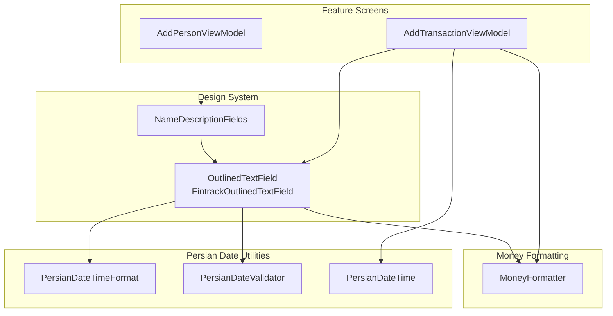
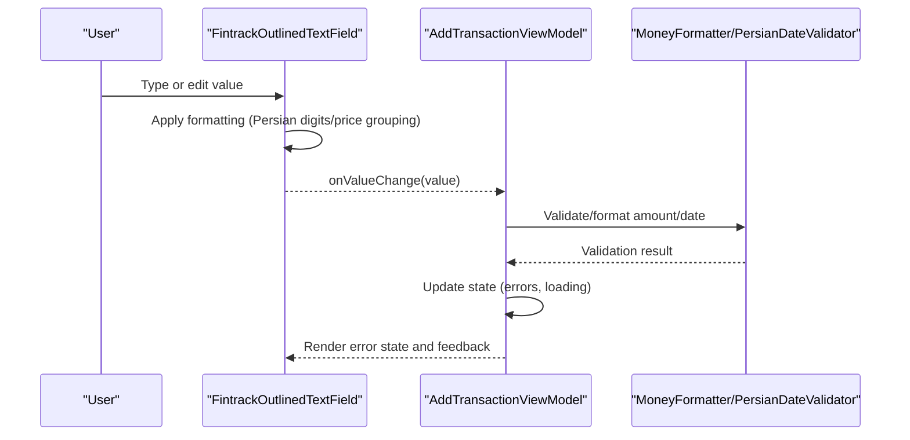
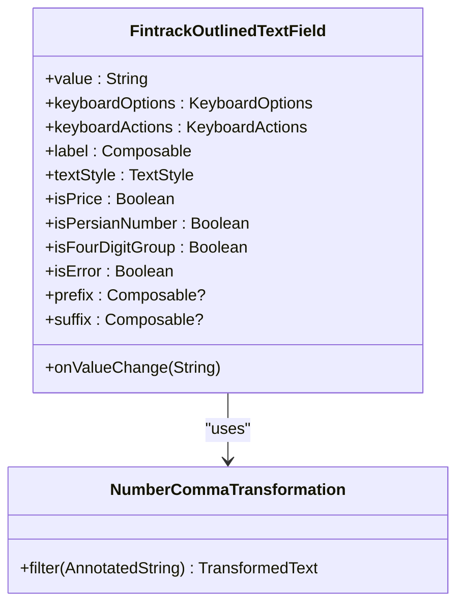
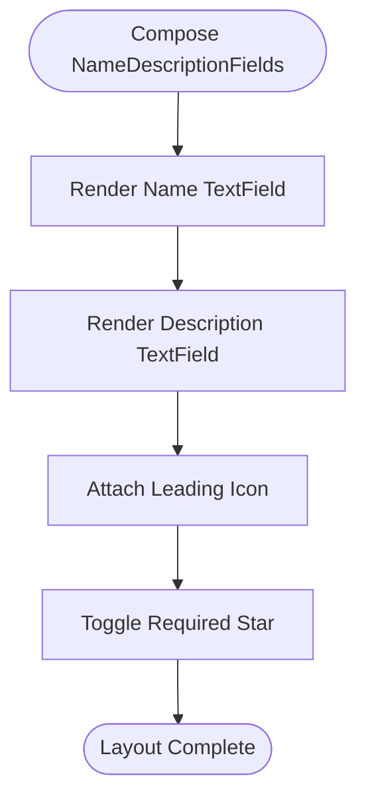
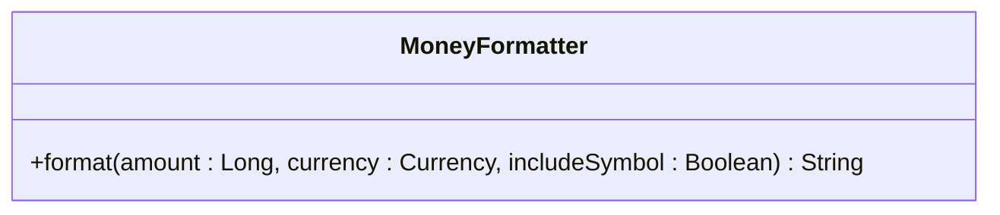
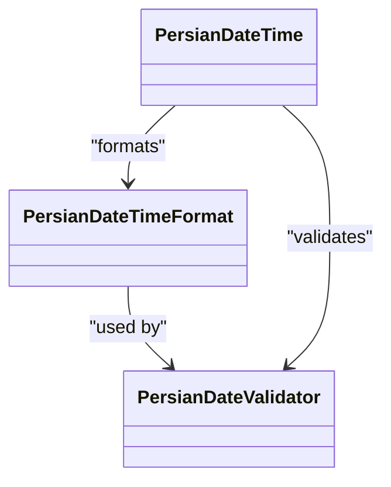
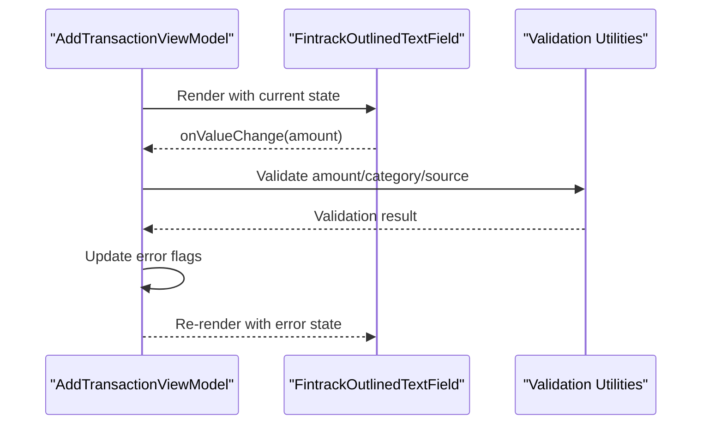
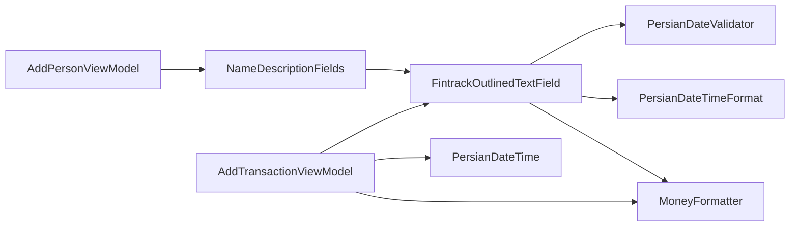

# Form and Input Components

<cite>
**Referenced Files in This Document**
- [OutlinedTextField.kt](file://core/designsystem/src/commonMain/kotlin/com/kazemieh/designsystem/component/OutlinedTextField.kt)
- [NameDescriptionFields.kt](file://core/designsystem/src/commonMain/kotlin/com/kazemieh/designsystem/component/form/NameDescriptionFields.kt)
- [MoneyFormatter.kt](file://core/money/src/commonMain/kotlin/com/kazemieh/money/MoneyFormatter.kt)
- [PersianDateTimeFormat.kt](file://core/common/src/commonMain/kotlin/com/kazemieh/common/persiandatetime/util/PersianDateTimeFormat.kt)
- [PersianDateValidator.kt](file://core/common/src/commonMain/kotlin/com/kazemieh/common/persiandatetime/util/PersianDateValidator.kt)
- [PersianDateTime.kt](file://core/common/src/commonMain/kotlin/com/kazemieh/common/persiandatetime/domain/PersianDateTime.kt)
- [CalculatorParser.kt](file://core/common/src/commonMain/kotlin/com/kazemieh/common/util/CalculatorParser.kt)
- [AddTransactionViewModel.kt](file://feature-share/transaction/src/commonMain/kotlin/com/kazemieh/transaction/ui/add/AddTransactionViewModel.kt)
- [AddPersonViewModel.kt](file://feature-share/person/src/commonMain/kotlin/com/kazemieh/person/ui/add/AddPersonViewModel.kt)
- [Transaction.kt](file://core/common/src/commonMain/kotlin/com/kazemieh/common/model/Transaction.kt)
- [Category.kt](file://core/common/src/commonMain/kotlin/com/kazemieh/common/model/Category.kt)
- [Source.kt](file://core/common/src/commonMain/kotlin/com/kazemieh/common/model/Source.kt)
- [Tag.kt](file://core/common/src/commonMain/kotlin/com/kazemieh/common/model/Tag.kt)
- [Person.kt](file://core/common/src/commonMain/kotlin/com/kazemieh/common/model/Person.kt)
- [SnackbarController.kt](file://feature-share/transaction/src/commonMain/kotlin/com/kazemieh/transaction/ui/add/SnackbarController.kt)
</cite>

## Table of Contents
1. [Introduction](#introduction)
2. [Project Structure](#project-structure)
3. [Core Components](#core-components)
4. [Architecture Overview](#architecture-overview)
5. [Detailed Component Analysis](#detailed-component-analysis)
6. [Dependency Analysis](#dependency-analysis)
7. [Performance Considerations](#performance-considerations)
8. [Troubleshooting Guide](#troubleshooting-guide)
9. [Conclusion](#conclusion)
10. [Appendices](#appendices)

## Introduction
This document focuses on FinTrack’s form and input components that power financial data entry and user interaction. It covers:
- NameDescriptionFields for composite name and description inputs
- FintrackOutlinedTextField for flexible, styled text input with Persian digit and price formatting
- MoneyFormatter for currency display and localization
- Validation, formatting, and user feedback mechanisms
- Input handling, data binding, and form state management
- Accessibility, keyboard navigation, and input sanitization
- Currency formatting, Persian date input, and specialized financial data entry patterns
- Guidelines for form layout, validation feedback, and user experience optimization

## Project Structure
FinTrack organizes form and input logic primarily in the design system and shared modules:
- Design system components provide reusable UI primitives (text fields, icons, colors)
- Money formatting utilities centralize currency display
- Common utilities support Persian date formatting and validation
- Feature screens and ViewModels demonstrate form composition and validation patterns

**Diagram sources**
- [OutlinedTextField.kt:28-115](file://core/designsystem/src/commonMain/kotlin/com/kazemieh/designsystem/component/OutlinedTextField.kt#L28-L115)
- [NameDescriptionFields.kt:25-35](file://core/designsystem/src/commonMain/kotlin/com/kazemieh/designsystem/component/form/NameDescriptionFields.kt#L25-L35)
- [MoneyFormatter.kt:5-14](file://core/money/src/commonMain/kotlin/com/kazemieh/money/MoneyFormatter.kt#L5-L14)
- [PersianDateTimeFormat.kt](file://core/common/src/commonMain/kotlin/com/kazemieh/common/persiandatetime/util/PersianDateTimeFormat.kt)
- [PersianDateValidator.kt](file://core/common/src/commonMain/kotlin/com/kazemieh/common/persiandatetime/util/PersianDateValidator.kt)
- [PersianDateTime.kt](file://core/common/src/commonMain/kotlin/com/kazemieh/common/persiandatetime/domain/PersianDateTime.kt)
- [AddTransactionViewModel.kt:292-311](file://feature-share/transaction/src/commonMain/kotlin/com/kazemieh/transaction/ui/add/AddTransactionViewModel.kt#L292-L311)
- [AddPersonViewModel.kt:18-93](file://feature-share/person/src/commonMain/kotlin/com/kazemieh/person/ui/add/AddPersonViewModel.kt#L18-L93)

**Section sources**
- [OutlinedTextField.kt:28-115](file://core/designsystem/src/commonMain/kotlin/com/kazemieh/designsystem/component/OutlinedTextField.kt#L28-L115)
- [NameDescriptionFields.kt:25-35](file://core/designsystem/src/commonMain/kotlin/com/kazemieh/designsystem/component/form/NameDescriptionFields.kt#L25-L35)
- [MoneyFormatter.kt:5-14](file://core/money/src/commonMain/kotlin/com/kazemieh/money/MoneyFormatter.kt#L5-L14)
- [PersianDateTimeFormat.kt](file://core/common/src/commonMain/kotlin/com/kazemieh/common/persiandatetime/util/PersianDateTimeFormat.kt)
- [PersianDateValidator.kt](file://core/common/src/commonMain/kotlin/com/kazemieh/common/persiandatetime/util/PersianDateValidator.kt)
- [PersianDateTime.kt](file://core/common/src/commonMain/kotlin/com/kazemieh/common/persiandatetime/domain/PersianDateTime.kt)
- [AddTransactionViewModel.kt:292-311](file://feature-share/transaction/src/commonMain/kotlin/com/kazemieh/transaction/ui/add/AddTransactionViewModel.kt#L292-L311)
- [AddPersonViewModel.kt:18-93](file://feature-share/person/src/commonMain/kotlin/com/kazemieh/person/ui/add/AddPersonViewModel.kt#L18-L93)

## Core Components
This section documents the primary form/input building blocks and their capabilities.

- FintrackOutlinedTextField
  - Purpose: A Material3 OutlinedTextField variant with enhanced formatting and styling options tailored for Persian and financial contexts
  - Key features:
    - Persian digit conversion and price grouping
    - Optional comma-separated number formatting
    - Customizable colors, shapes, borders, and text styles
    - Error state support with dedicated error color
    - Prefix/suffix support for icons or currency symbols
    - Keyboard options/actions customization
  - Important parameters:
    - isPrice: Enables Persian price formatting
    - isPersianNumber: Converts digits to Persian numerals
    - isFourDigitGroup: Applies four-digit grouping for readability
    - isError: Signals invalid input state
    - keyboardOptions and keyboardActions: Control soft keyboard behavior
  - Implementation highlights:
    - Uses VisualTransformation for real-time formatting
    - Applies OutlinedTextFieldDefaults for consistent theming
    - Integrates Persian utilities for digit and price formatting

- NameDescriptionFields
  - Purpose: Composite input for name and description with optional icon and color selection
  - Key features:
    - Two FintrackOutlinedTextField instances arranged horizontally
    - Required star indicator toggle
    - Leading icon and color picker integration
    - Responsive spacing via LocalSpacing
  - Typical usage:
    - Editing entity names and descriptions in forms
    - Providing immediate visual feedback for required fields

- MoneyFormatter
  - Purpose: Centralized currency formatting for display
  - Key features:
    - Converts numeric amounts to Persian digits
    - Supports currency symbol inclusion
    - Used alongside text fields for localized display

- Persian Date Utilities
  - PersianDateTimeFormat: Provides formatting patterns for Persian dates
  - PersianDateValidator: Validates Persian date inputs
  - PersianDateTime: Core domain object for Persian calendar operations

**Section sources**
- [OutlinedTextField.kt:28-115](file://core/designsystem/src/commonMain/kotlin/com/kazemieh/designsystem/component/OutlinedTextField.kt#L28-L115)
- [NameDescriptionFields.kt:25-35](file://core/designsystem/src/commonMain/kotlin/com/kazemieh/designsystem/component/form/NameDescriptionFields.kt#L25-L35)
- [MoneyFormatter.kt:5-14](file://core/money/src/commonMain/kotlin/com/kazemieh/money/MoneyFormatter.kt#L5-L14)
- [PersianDateTimeFormat.kt](file://core/common/src/commonMain/kotlin/com/kazemieh/common/persiandatetime/util/PersianDateTimeFormat.kt)
- [PersianDateValidator.kt](file://core/common/src/commonMain/kotlin/com/kazemieh/common/persiandatetime/util/PersianDateValidator.kt)
- [PersianDateTime.kt](file://core/common/src/commonMain/kotlin/com/kazemieh/common/persiandatetime/domain/PersianDateTime.kt)

## Architecture Overview
The form/input architecture follows a layered pattern:
- UI Layer: Compose components (OutlinedTextField, NameDescriptionFields)
- Formatting Layer: MoneyFormatter and Persian date utilities
- State Management Layer: ViewModels manage form state and validation
- Domain Models: Entities (Transaction, Category, Source, Tag, Person) represent persisted data

**Diagram sources**
- [OutlinedTextField.kt:28-115](file://core/designsystem/src/commonMain/kotlin/com/kazemieh/designsystem/component/OutlinedTextField.kt#L28-L115)
- [AddTransactionViewModel.kt:292-311](file://feature-share/transaction/src/commonMain/kotlin/com/kazemieh/transaction/ui/add/AddTransactionViewModel.kt#L292-L311)
- [MoneyFormatter.kt:5-14](file://core/money/src/commonMain/kotlin/com/kazemieh/money/MoneyFormatter.kt#L5-L14)
- [PersianDateValidator.kt](file://core/common/src/commonMain/kotlin/com/kazemieh/common/persiandatetime/util/PersianDateValidator.kt)

## Detailed Component Analysis

### FintrackOutlinedTextField
- Implementation patterns:
  - VisualTransformation for real-time formatting
  - KeyboardOptions and KeyboardActions for device-specific behavior
  - Error state rendering via OutlinedTextFieldDefaults
  - Optional prefix/suffix for icons and currency symbols
- Data structures and complexity:
  - Transformations operate in O(n) per keystroke, where n is the length of the input
  - Offset mapping ensures caret position remains consistent during transformations
- Dependency chains:
  - Uses Material3 OutlinedTextField and defaults
  - Integrates Persian digit and price formatting utilities
- Error handling:
  - isError toggles visual error state and border color
  - Cursor color adapts to error state for accessibility
- Performance implications:
  - Keep transformations lightweight; avoid heavy computations in filter()

**Diagram sources**
- [OutlinedTextField.kt:28-115](file://core/designsystem/src/commonMain/kotlin/com/kazemieh/designsystem/component/OutlinedTextField.kt#L28-L115)
- [OutlinedTextField.kt:117-127](file://core/designsystem/src/commonMain/kotlin/com/kazemieh/designsystem/component/OutlinedTextField.kt#L117-L127)

**Section sources**
- [OutlinedTextField.kt:28-115](file://core/designsystem/src/commonMain/kotlin/com/kazemieh/designsystem/component/OutlinedTextField.kt#L28-L115)
- [OutlinedTextField.kt:117-127](file://core/designsystem/src/commonMain/kotlin/com/kazemieh/designsystem/component/OutlinedTextField.kt#L117-L127)

### NameDescriptionFields
- Composition pattern:
  - Arranges two text fields with a leading icon and optional color picker
  - Uses LocalSpacing for consistent layout
  - Supports required star indicator
- Data binding:
  - Exposes separate callbacks for name and description updates
  - Accepts initial icon and color IDs for prepopulation
- Accessibility:
  - Leverages Material3 text field semantics
  - Supports labels and placeholders

**Diagram sources**
- [NameDescriptionFields.kt:25-35](file://core/designsystem/src/commonMain/kotlin/com/kazemieh/designsystem/component/form/NameDescriptionFields.kt#L25-L35)

**Section sources**
- [NameDescriptionFields.kt:25-35](file://core/designsystem/src/commonMain/kotlin/com/kazemieh/designsystem/component/form/NameDescriptionFields.kt#L25-L35)

### MoneyFormatter
- Purpose: Provide consistent currency display with Persian digit formatting
- Usage patterns:
  - Format amounts for labels and summaries
  - Combine with text fields for localized presentation
- Complexity:
  - O(n) for digit conversion, where n is the number of digits

**Diagram sources**
- [MoneyFormatter.kt:5-14](file://core/money/src/commonMain/kotlin/com/kazemieh/money/MoneyFormatter.kt#L5-L14)

**Section sources**
- [MoneyFormatter.kt:5-14](file://core/money/src/commonMain/kotlin/com/kazemieh/money/MoneyFormatter.kt#L5-L14)

### Persian Date Utilities
- PersianDateTimeFormat: Defines formatting patterns for Persian dates
- PersianDateValidator: Validates Persian date inputs
- PersianDateTime: Core domain object for Persian calendar operations

**Diagram sources**
- [PersianDateTimeFormat.kt](file://core/common/src/commonMain/kotlin/com/kazemieh/common/persiandatetime/util/PersianDateTimeFormat.kt)
- [PersianDateValidator.kt](file://core/common/src/commonMain/kotlin/com/kazemieh/common/persiandatetime/util/PersianDateValidator.kt)
- [PersianDateTime.kt](file://core/common/src/commonMain/kotlin/com/kazemieh/common/persiandatetime/domain/PersianDateTime.kt)

**Section sources**
- [PersianDateTimeFormat.kt](file://core/common/src/commonMain/kotlin/com/kazemieh/common/persiandatetime/util/PersianDateTimeFormat.kt)
- [PersianDateValidator.kt](file://core/common/src/commonMain/kotlin/com/kazemieh/common/persiandatetime/util/PersianDateValidator.kt)
- [PersianDateTime.kt](file://core/common/src/commonMain/kotlin/com/kazemieh/common/persiandatetime/domain/PersianDateTime.kt)

### Form State Management and Validation Patterns
- AddTransactionViewModel demonstrates:
  - State encapsulation with error flags for each field
  - Validation logic for amount, category, and source(s)
  - Real-time error flag updates and user feedback
  - Use of SnackbarController for error messaging
- AddPersonViewModel demonstrates:
  - Draft pattern for incremental edits
  - State reset after successful save
  - Intent-driven updates to state

**Diagram sources**
- [AddTransactionViewModel.kt:292-311](file://feature-share/transaction/src/commonMain/kotlin/com/kazemieh/transaction/ui/add/AddTransactionViewModel.kt#L292-L311)
- [OutlinedTextField.kt:28-115](file://core/designsystem/src/commonMain/kotlin/com/kazemieh/designsystem/component/OutlinedTextField.kt#L28-L115)

**Section sources**
- [AddTransactionViewModel.kt:292-311](file://feature-share/transaction/src/commonMain/kotlin/com/kazemieh/transaction/ui/add/AddTransactionViewModel.kt#L292-L311)
- [AddPersonViewModel.kt:18-93](file://feature-share/person/src/commonMain/kotlin/com/kazemieh/person/ui/add/AddPersonViewModel.kt#L18-L93)

## Dependency Analysis
- Component coupling:
  - FintrackOutlinedTextField depends on Material3 and Persian formatting utilities
  - NameDescriptionFields composes FintrackOutlinedTextField and icon/color pickers
  - ViewModels depend on domain models and formatting utilities
- Cohesion:
  - MoneyFormatter and Persian utilities are cohesive units for localization
  - Form components focus on UI concerns while delegating logic to ViewModels
- External dependencies:
  - Material3 theming and composables
  - Kotlin coroutines for state updates and effects
  - Resource management for icons and strings

**Diagram sources**
- [OutlinedTextField.kt:28-115](file://core/designsystem/src/commonMain/kotlin/com/kazemieh/designsystem/component/OutlinedTextField.kt#L28-L115)
- [NameDescriptionFields.kt:25-35](file://core/designsystem/src/commonMain/kotlin/com/kazemieh/designsystem/component/form/NameDescriptionFields.kt#L25-L35)
- [MoneyFormatter.kt:5-14](file://core/money/src/commonMain/kotlin/com/kazemieh/money/MoneyFormatter.kt#L5-L14)
- [PersianDateTimeFormat.kt](file://core/common/src/commonMain/kotlin/com/kazemieh/common/persiandatetime/util/PersianDateTimeFormat.kt)
- [PersianDateValidator.kt](file://core/common/src/commonMain/kotlin/com/kazemieh/common/persiandatetime/util/PersianDateValidator.kt)
- [PersianDateTime.kt](file://core/common/src/commonMain/kotlin/com/kazemieh/common/persiandatetime/domain/PersianDateTime.kt)
- [AddTransactionViewModel.kt:292-311](file://feature-share/transaction/src/commonMain/kotlin/com/kazemieh/transaction/ui/add/AddTransactionViewModel.kt#L292-L311)
- [AddPersonViewModel.kt:18-93](file://feature-share/person/src/commonMain/kotlin/com/kazemieh/person/ui/add/AddPersonViewModel.kt#L18-L93)

**Section sources**
- [OutlinedTextField.kt:28-115](file://core/designsystem/src/commonMain/kotlin/com/kazemieh/designsystem/component/OutlinedTextField.kt#L28-L115)
- [NameDescriptionFields.kt:25-35](file://core/designsystem/src/commonMain/kotlin/com/kazemieh/designsystem/component/form/NameDescriptionFields.kt#L25-L35)
- [MoneyFormatter.kt:5-14](file://core/money/src/commonMain/kotlin/com/kazemieh/money/MoneyFormatter.kt#L5-L14)
- [PersianDateTimeFormat.kt](file://core/common/src/commonMain/kotlin/com/kazemieh/common/persiandatetime/util/PersianDateTimeFormat.kt)
- [PersianDateValidator.kt](file://core/common/src/commonMain/kotlin/com/kazemieh/common/persiandatetime/util/PersianDateValidator.kt)
- [PersianDateTime.kt](file://core/common/src/commonMain/kotlin/com/kazemieh/common/persiandatetime/domain/PersianDateTime.kt)
- [AddTransactionViewModel.kt:292-311](file://feature-share/transaction/src/commonMain/kotlin/com/kazemieh/transaction/ui/add/AddTransactionViewModel.kt#L292-L311)
- [AddPersonViewModel.kt:18-93](file://feature-share/person/src/commonMain/kotlin/com/kazemieh/person/ui/add/AddPersonViewModel.kt#L18-L93)

## Performance Considerations
- Prefer lightweight transformations in VisualTransformation to minimize recompositions
- Debounce expensive validations when possible
- Use single-line text fields for short inputs to reduce layout cost
- Cache formatted strings for repeated display operations
- Avoid unnecessary state updates; batch updates when validating multiple fields

## Troubleshooting Guide
- Text field not updating:
  - Verify onValueChange is invoked and state is updated in the ViewModel
  - Check keyboardOptions for conflicting actions
- Formatting issues:
  - Ensure isPrice and isPersianNumber flags are set appropriately
  - Confirm Persian utilities are applied consistently
- Validation errors:
  - Inspect error flags in state and re-render accordingly
  - Use SnackbarController for user-visible messages
- Accessibility:
  - Provide meaningful labels and assistive text
  - Test keyboard navigation and screen reader compatibility

**Section sources**
- [AddTransactionViewModel.kt:292-311](file://feature-share/transaction/src/commonMain/kotlin/com/kazemieh/transaction/ui/add/AddTransactionViewModel.kt#L292-L311)
- [SnackbarController.kt](file://feature-share/transaction/src/commonMain/kotlin/com/kazemieh/transaction/ui/add/SnackbarController.kt)

## Conclusion
FinTrack’s form and input components combine Material3 primitives with Persian localization and financial formatting to deliver a robust, accessible, and user-friendly data entry experience. By leveraging ViewModels for state management and validation, and by composing reusable components like FintrackOutlinedTextField and NameDescriptionFields, the system supports scalable and maintainable form implementations across features.

## Appendices

### Examples of Form Composition and Validation Patterns
- Transaction form:
  - Amount field with isPrice and error state
  - Category and source selection with validation
  - Real-time error flags and user feedback
- Person form:
  - NameDescriptionFields for name and description
  - Draft pattern for incremental editing and saving

**Section sources**
- [AddTransactionViewModel.kt:292-311](file://feature-share/transaction/src/commonMain/kotlin/com/kazemieh/transaction/ui/add/AddTransactionViewModel.kt#L292-L311)
- [AddPersonViewModel.kt:18-93](file://feature-share/person/src/commonMain/kotlin/com/kazemieh/person/ui/add/AddPersonViewModel.kt#L18-L93)
- [NameDescriptionFields.kt:25-35](file://core/designsystem/src/commonMain/kotlin/com/kazemieh/designsystem/component/form/NameDescriptionFields.kt#L25-L35)

### Accessibility and Input Sanitization Guidelines
- Accessibility:
  - Always provide labels and assistive text
  - Support keyboard navigation and screen readers
  - Use semantic error states and announcements
- Input sanitization:
  - Validate and sanitize numeric inputs (amounts)
  - Normalize Persian digits and separators
  - Prevent injection by relying on validated transformations

**Section sources**
- [OutlinedTextField.kt:28-115](file://core/designsystem/src/commonMain/kotlin/com/kazemieh/designsystem/component/OutlinedTextField.kt#L28-L115)
- [CalculatorParser.kt](file://core/common/src/commonMain/kotlin/com/kazemieh/common/util/CalculatorParser.kt)

### Currency Formatting and Financial Data Entry
- Use MoneyFormatter for consistent currency display
- Apply isPrice in FintrackOutlinedTextField for localized price formatting
- Validate amounts using ViewModel-level checks before persistence

**Section sources**
- [MoneyFormatter.kt:5-14](file://core/money/src/commonMain/kotlin/com/kazemieh/money/MoneyFormatter.kt#L5-L14)
- [OutlinedTextField.kt:28-115](file://core/designsystem/src/commonMain/kotlin/com/kazemieh/designsystem/component/OutlinedTextField.kt#L28-L115)
- [AddTransactionViewModel.kt:292-311](file://feature-share/transaction/src/commonMain/kotlin/com/kazemieh/transaction/ui/add/AddTransactionViewModel.kt#L292-L311)

### Persian Date Input and Specialized Financial Requirements
- Use PersianDateTimeFormat for consistent date formatting
- Use PersianDateValidator for input validation
- Integrate PersianDateTime for calendar-aware operations

**Section sources**
- [PersianDateTimeFormat.kt](file://core/common/src/commonMain/kotlin/com/kazemieh/common/persiandatetime/util/PersianDateTimeFormat.kt)
- [PersianDateValidator.kt](file://core/common/src/commonMain/kotlin/com/kazemieh/common/persiandatetime/util/PersianDateValidator.kt)
- [PersianDateTime.kt](file://core/common/src/commonMain/kotlin/com/kazemieh/common/persiandatetime/domain/PersianDateTime.kt)